# 강의_3기_ROS2_기초_1차시

ROKEY BOOT CAMP
Apr, 2025
ROS2 기초-1차시

2
ROKEY BOOT CAMP
훈련일정
오전
오후
1차시
▪로봇의역사
▪컴퓨터구조(Booting, CPU 작동원리, POST)
▪리눅스와운영체계
▪리눅스CLI 실습(디렉토리, 계정, 기본명령어등), Terminator, 커널, 쉘, gedit, bash
▪Application 작동원리(마이크로프로세서, 메모리, 저장장치)
▪리눅스 CLI 실습
2차시
▪리눅스 CLI 실습
▪네트워크와통신(IPV4, IPV6, 소켓, 노드, Hub, TCP, UDP)
▪API, Library, Framework, 프로세스와Thread
▪인터프리터, 컴파일러(소스코드→ Build → 실행파일)
▪소켓프로그래밍실습
▪OSI7 Layer, 프로토콜(RS-232C, RS-485, Ethernet, TCP/UDP, IP)
3차시
▪센서 기초, IoT와Embedded
▪로봇기초, 좌표계
▪로봇센서활용및로봇의 구성(기계기구, 전기전자, 소프트웨어)
▪ROS2 소개및활용
▪ROS2 설치(ros.org) 및demo_node
4차시
▪ROS2 소개및활용
▪ROS2 실습(Talker, Listener)
▪ROS2 패키지설명
▪ROS2 실습(Turtlesim, teleop_key)
5차시
▪ROS2 실습(Turtlesim, Teleop_key 여러개만들기)
▪Topic, Service, Action, Parameter, RQT, RQT_Graph 이론및실습
▪ROS2 실습(Turtlesim, Namespace 여러개만들기)
▪Ros bag and play 실습, my first package build 실습
▪Turtlesim subscribing 실습, ROS의 중요한개발도구(Rviz, GAZEBO 소개)

3
ROKEY BOOT CAMP
로봇의역사
로봇의어원
로봇(Robot)은어떤작업이나조작을자동으로할수있는기계장치를말합니다.
오늘날우리가익숙하게쓰는‘로봇’이라는용어는1920년에체코슬로바키아극작가인차펙(Karel Čapek)이<로섬의
만능로봇(Rossum’s Universal Robots, R.U.R.)>이라는희곡에서처음사용한것이그기원이되었다고합니다.
로봇의어원은체코어로천한노동, 중노동, 강제노동등을뜻하는
‘로보타(robota)’인데요. 연극의내용은뛰어난과학자로섬과그의아들이
인간에게무조건복종하고모든육체적노동을대신해줄로봇을
만들어내는데로섬의동료가로봇에게감정을준이후로봇이점점일을
싫어하게되면서결국은반란을일으켜사람들을죽이고세계를정복하게
된다는내용입니다. 영화<터미네이터>, <매트릭스> 등여러SF영화의
줄거리가떠오르기도합니다. 그만큼극작가차펙의희곡이후대에끼친
영향이크다는것이겠죠? 물론이때까지도로봇은이렇게상상속의존재에
불과했습니다.
[출처] 로봇의탄생과발전그리고미래|작성자한국과학기술연구원

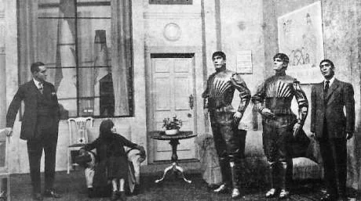

4
ROKEY BOOT CAMP
로봇의역사
진짜로봇의탄생
상상속의존재였던로봇. 그러다1950년대에최초의산업용로봇유니메이트가등장하면서로봇에관한연구가급속도로발전하기
시작합니다. 최초의산업용로봇유니메이트는공장에서막생산되어뜨거운금속사출물을운반하는역할을했습니다. 인간이하기
힘든일을대신하기시작한것이죠. 
undefined
유니메이트이후에도장애인환자를돕는로봇팔, 자동차를조립하는생산용로봇등이
나오기시작했습니다. 단순반복작업이가능하고부상의위험이없다는점때문에다양한
분야에서생산공정에맞는로봇을만들어사용하였죠.
용도와사용처가명확하기때문에이러한산업용로봇들은인간을닮기보다는굴삭기나
재봉틀처럼용도에딱맞는기계에더가까운모습을하고있었습니다.
1980년대이후에는용도에따라산업용, 의료용, 가정용, 탐사용, 군사용등그용도가
다양해졌습니다. 로봇을전문적으로제작하는기업도생겼고연구자도늘어났습니다. 
연구가점점고도화되면서로봇을조종하는방법도용도에따라달라졌고요. 그결과
인간이직접수동조작을해야하는로봇, 인간이설정해둔순서대로따라하는로봇을넘어
스스로학습능력이나판단력을지닌로봇까지개발되면서발전을거듭하게되었습니다.
[출처] 로봇의탄생과발전그리고미래|작성자한국과학기술연구원

5
ROKEY BOOT CAMP
로봇의역사
로봇의발전
1999년일본에서출시된반려견을닮은강아지로봇아이보(AiBo)는실제강아지처럼
인간과상호교류가가능해서큰인기를끌었습니다.
그리고마침내2000년대에이르러서는한국과학기술연구원(KIST) 연구팀이개발한
마루(MAHRU), 한국과학기술원(KAIST) 연구팀이개발한휴보(HUBO), 일본혼다에서
개발한아시모(ASIMO) 등직립보행하는인간형로봇이만들어지기도했습니다.
[출처] 로봇의탄생과발전그리고미래|작성자한국과학기술연구원
마루의경우, 무선네트워크로연결된서버컴퓨터를통해로봇에게인식능력을
제공하는‘네트워크기반휴머노이드’로개발되었다고합니다. 휴보의경우, 2013년
미국방부에서열린인명구조로봇선발대회인DARPA 로보틱스챌린지(DRC)에서
1위를했다고합니다. 당시대회에서는차량운전, 사다리타기, 장애물제거등인간
구조대원이실제로재난현장에서하는활동을해내야했다고하는데이대회에서
1등을했다니대단하죠?

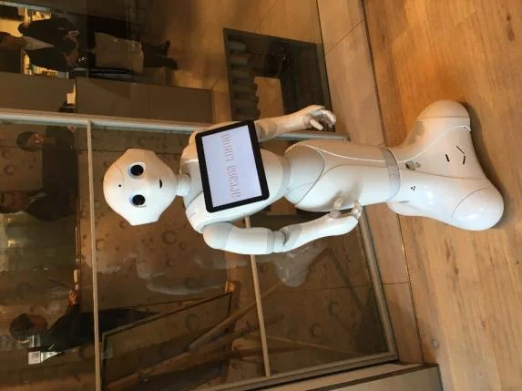

6
ROKEY BOOT CAMP
로봇의역사
로봇의발전
이처럼로봇관련연구는소수의산업용로봇으로시작하여보다정확하고
안전한수술을할수있도록돕는의료용로봇이나인간과대화하며상호작용을
하는대화형로봇에이르기까지꾸준히발전해왔습니다. 그러다이제는집안을
스스로청소하는로봇청소기처럼가정용으로보급되기까지에이르렀습니다. 
산업용로봇이처음출시된게1950년대였던걸생각하면약70여년동안
이루어진발전이어마무시하다는생각이듭니다.
[출처] 로봇의탄생과발전그리고미래|작성자한국과학기술연구원

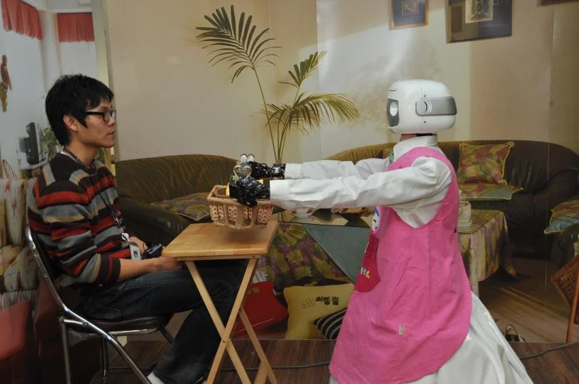

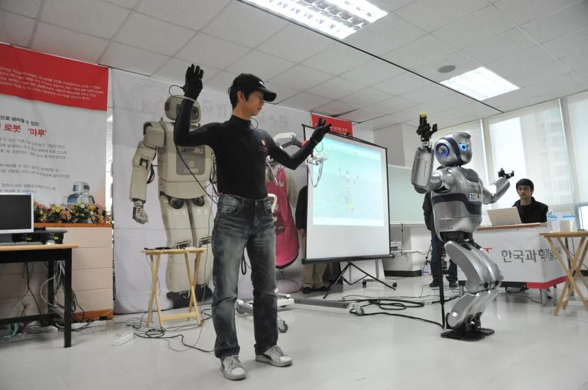

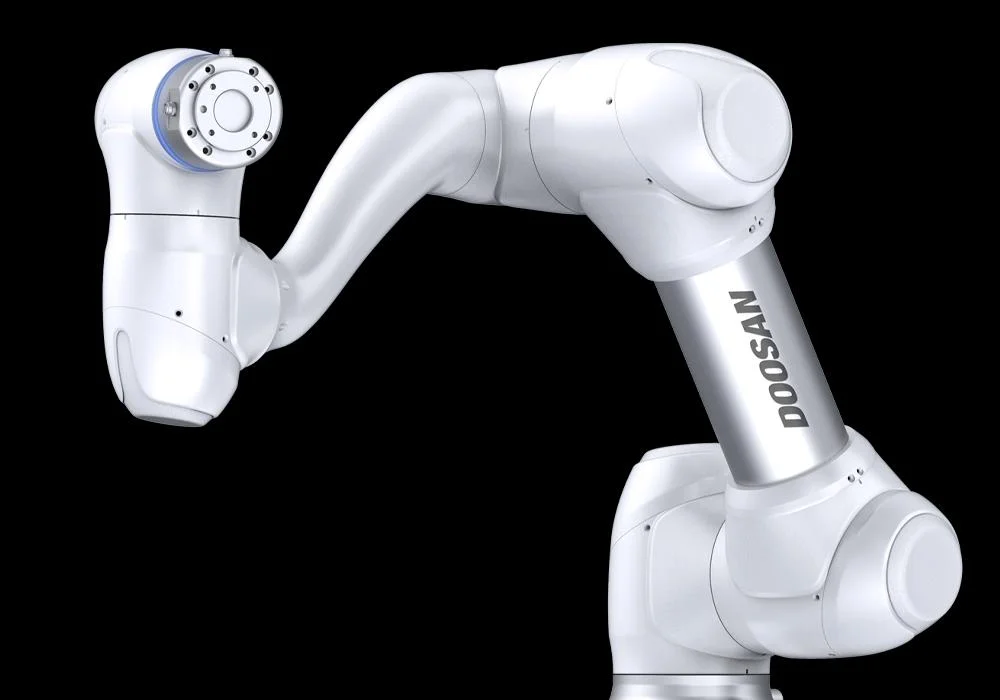

7
ROKEY BOOT CAMP
로봇의역사
로봇의미래
그렇다면앞으로로봇은어떻게발전하게될까요?
불과몇년전있었던코로나19의전세계적인유행으로인해다양한분야에서비대면수요가크게증가했던걸
다들기억하실겁니다. 당시전염병위험때문에모든것이마비되고멈췄다고해도과언이아닌데요. 로봇은
전염병에걸리지도않는데다전파할위험도없습니다. 게다가쉬지않고일을할수있기때문에생산작업
분야에서수요가크게증가하면서사회곳곳에빠르게자리잡게되었습니다.
[출처] 로봇의탄생과발전그리고미래|작성자한국과학기술연구원

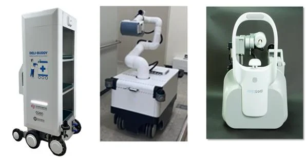

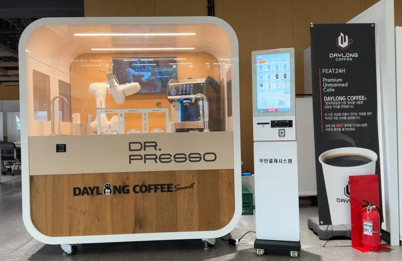

8
ROKEY BOOT CAMP
로봇의역사
로봇의미래
코로나가잠잠해진요즘도단순하고반복적인노동이필요한분야또는인간이하기에신체적
부상의위험이있는분야를중심으로로봇이적극사용되는중입니다. 그래서우리는익숙하게
키오스크로음식을주문하고있습니다. 로봇은단순히주문을받는것뿐만아니라사람대신
음식이나음료를만들기도하고서빙을하기도합니다. 덕분에키오스크로주문을하고로봇이
음료를만드는카페의경우에는아예직원없이무인으로운영되는것도가능해졌죠.
공항이나박물관등에는여러가지언어로사람들의질문에친절히답해주는안내원로봇이있게
되었고요.
테슬라휴머노이드로봇옵티머스
 
 
 
. 사진
=테슬라
야간에는사람대신공원을순찰하는순찰로봇이
위험을방지합니다. 일손이부족한물류센터에서빠른
일처리를돕는물류로봇이등장하기도했습니다. 
우리가자각하지못할만큼자연스럽게로봇이
일상생활속으로스며들고있는겁니다.
[출처] 로봇의탄생과발전그리고미래|작성자한국과학기술연구원

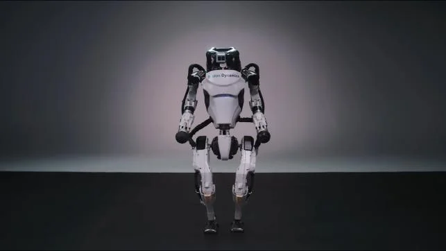

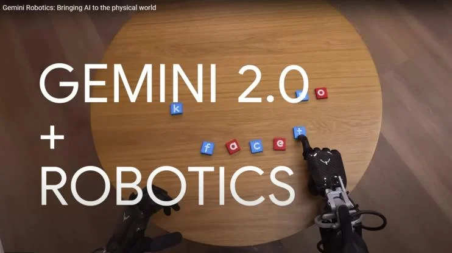

9
ROKEY BOOT CAMP
로봇의역사

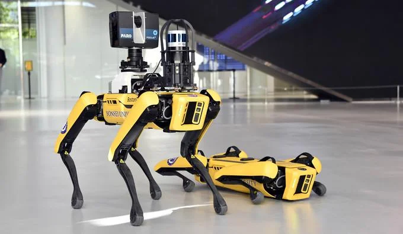

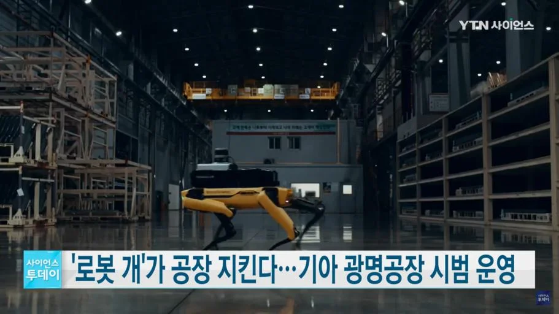

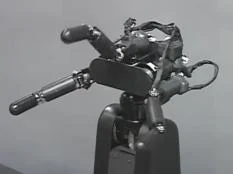

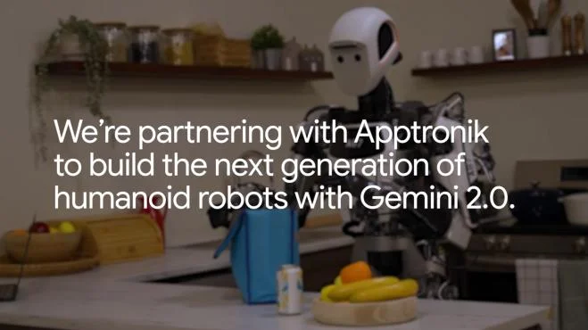

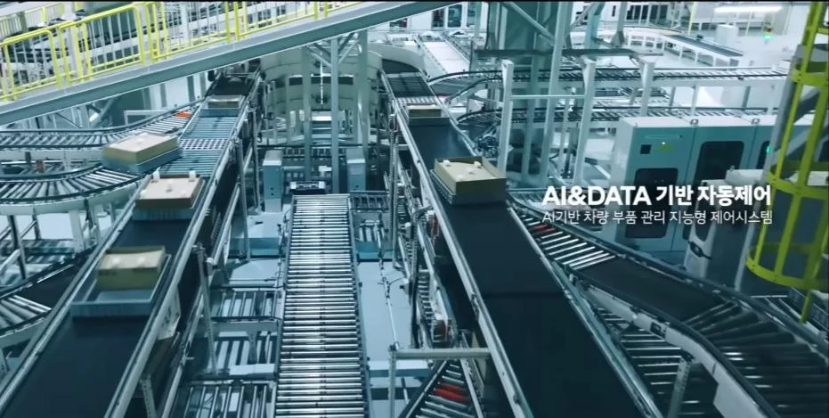

10
ROKEY BOOT CAMP
로봇의역사
하지만미래에어떤로봇이만들어지든아이작아시모프(Isaac Asimov)라는SF소설가가만들었던로봇이지켜야할원칙은
지켜지게될거예요.
1942년아이작아시모프의SF소설‘런어라운드(Runaround)’에서처음언급된로봇의3원칙은다음과같습니다. 
제1원칙로봇은인간에게해를끼쳐서는안되며위험에처해있는인간을방관해서는안된다.
제2원칙제1원칙에위배되지않는경우로봇은인간의명령에반드시복종해야만한다.
제3원칙제1원칙과제2원칙에위배되지않는경우로봇은자기자신을보호해야한다.
3원칙을만든이후아이작아시모프는인류의집단안전을위해제0원칙을추가했다고합니다.
제0원칙은다른3원칙보다더상위에서절대적으로지켜야하는법칙이라고해요.
제0원칙로봇은인류에게해를가하거나행동을하지않음으로써인류에게해가가도록해서는안된다.
[출처] 로봇의탄생과발전그리고미래|작성자한국과학기술연구원

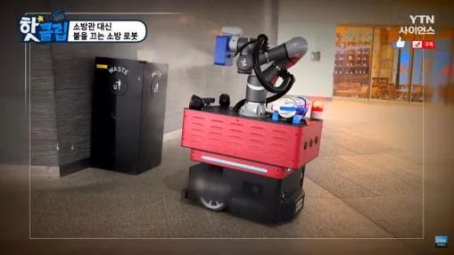

11
ROKEY BOOT CAMP
컴퓨터구조(Booting, CPU 작동원리, POST)
폰노이만구조
폰노이만구조는중앙처리장치(CPU), 메모리, 프로그램세가지요소로구성되어있습니다. 
CPU와메모리는서로분리되어있고둘을연결하는버스(Bus)를통해명령어읽기, 데이터의읽고쓰기가가능-> 메모리안에프로그램과
데이터영역의물리적구분없음-> 같은버스를통해CPU가명령어와데이터에동시접근불가
프로그램내장방식컴퓨터-> 폰노이만이전하드웨어전선을바꿔야함-> 폰노이만은프로그램만바꾸면되기에편의성이증가

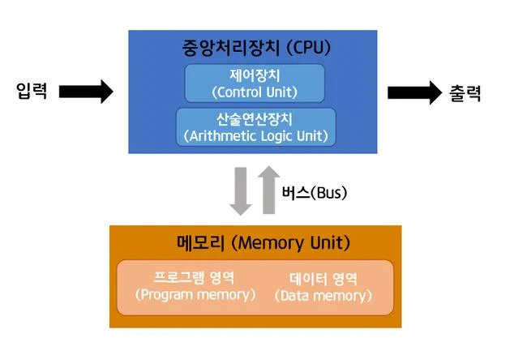

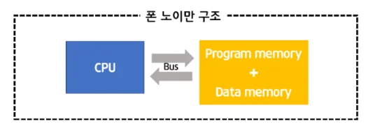

12
ROKEY BOOT CAMP
컴퓨터구조(Booting, CPU 작동원리, POST)
1. 전원인가(Power On)
▪
컴퓨터의전원버튼을누르면메인보드에전원이공급되면서부팅과정이시작됩니다. 
메인보드의BIOS(Basic Input/Output System) 칩에저장된펌웨어가실행됩니다.
2. POST(Power-On Self-Test) 실행
▪
BIOS는컴퓨터의주요하드웨어구성요소(CPU, 메모리, 그래픽카드등)들을점검하는
POST를실행합니다. 이상이없으면짧은비프음을내고다음단계로진행합니다.
3. BIOS 설정로드
▪
POST를통과하면BIOS는CMOS(Complementary Metal-Oxide Semiconductor)에
저장된설정값을읽어옵니다. 여기에는부팅순서, 시간, 하드디스크정보등이
포함됩니다.
전원인가
POST (Power-On Self-
Test) 실행
BIOS 설정로드
부트로더
(Boot Loader)실행
운영체제커널로드
초기프로세스실행
사용자인터페이스실행

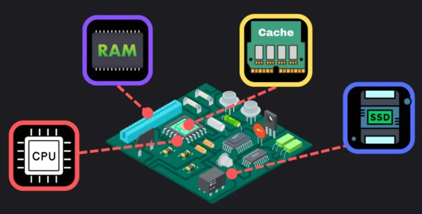

13
ROKEY BOOT CAMP
컴퓨터구조(Booting, CPU 작동원리, POST)
​4. 부트로더(Boot Loader) 실행
▪BIOS는설정된부팅순서에따라부팅가능한장치(하드디스크, USB, CD-ROM 등)를찾아부트로더를
실행합니다. 부트로더는운영체제커널을메모리에적재하고제어권을넘기는역할을합니다.
​5. 운영체제커널로드
▪부트로더는하드디스크에서운영체제커널을찾아메모리에적재합니다. 커널은운영체제의핵심
부분으로, 하드웨어를제어하고시스템자원을관리합니다.
​6. 초기프로세스실행
▪커널은시스템초기화를마치고init(리눅스) 또는smss.exe(윈도우) 같은첫번째프로세스를
실행합니다. 이프로세스는운영체제의나머지부분을로드하고실행합니다.
​7. 사용자인터페이스실행
▪사용자인터페이스(데스크톱환경, 로그인화면등)가실행되어사용자가컴퓨터를사용할수있게
됩니다
전원인가
POST (Power-On Self-
Test) 실행
BIOS 설정로드
부트로더
(Boot Loader)실행
운영체제커널로드
초기프로세스실행
사용자인터페이스실행

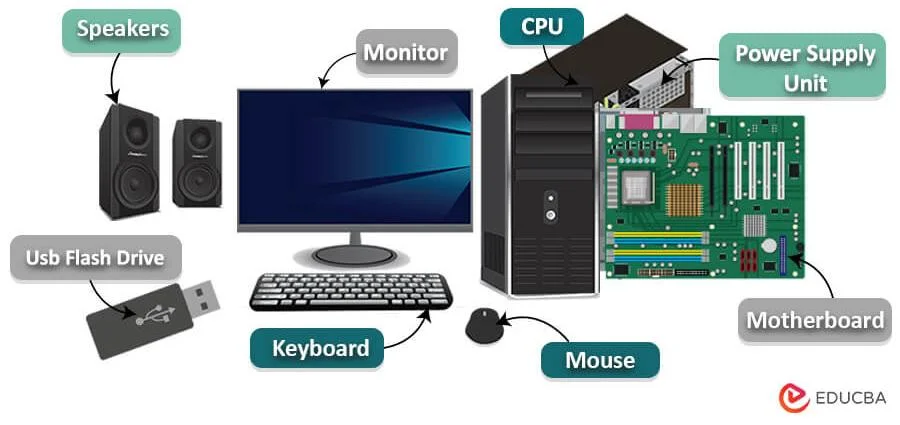

14
ROKEY BOOT CAMP
컴퓨터구조(Booting, CPU 작동원리, POST)
바이오스단계
▪
PC의전원스위치를켜면제일먼저바이오스BIOS, Basic Input/Output System가동작
▪
바이오스는보통ROM에저장되어있어흔히ROM-BIOS라고부름
▪
바이오스는PC에장착된기본적인하드웨어(키보드, 디스크등)의상태를확인한후부팅장치를선택하여부팅디스크의첫
섹터에서512B를로딩함
▪
512B를마스터부트레코드MBR라고하며, 여기에는디스크의어느파티션에2차부팅프로그램
(부트로더)이있는지에대한정보가저장되어있음. MBR은부트로더를찾아메모리에로딩하는작업까지수행

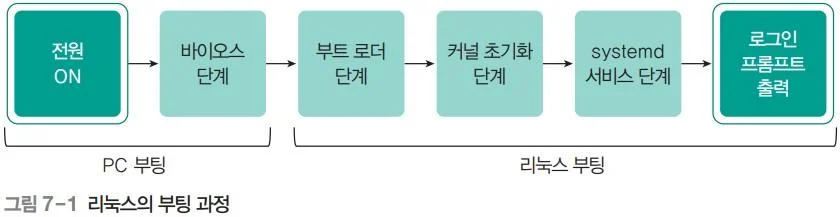

15
ROKEY BOOT CAMP
컴퓨터구조(Booting, CPU 작동원리, POST)
CPU란무엇인가?
컴퓨터의뇌라고할수있는중앙처리장치(Central Processing Unit, CPU)는주기억장치인메모리에서명령어를읽어들이고이를해석하여
수행하는작업을맡는다. CPU의주요구성요소로는산술및논리연산을수행하는ALU(Arithmetic Logic), 명령어의순서와수행을
제어하는제어유닛(Control Unit), 그리고중간결과와작업상태를저장하는레지스터(Register)가있다.

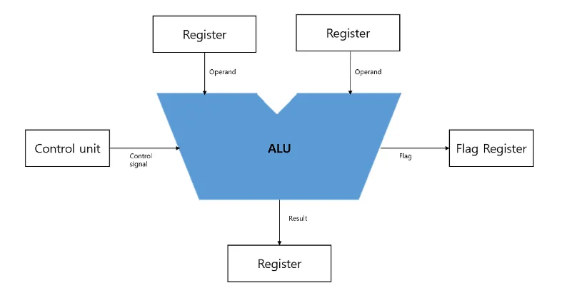

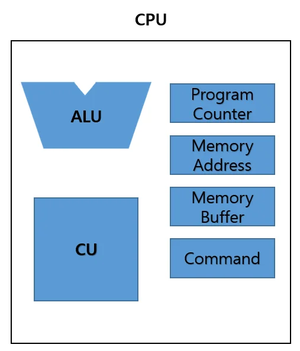

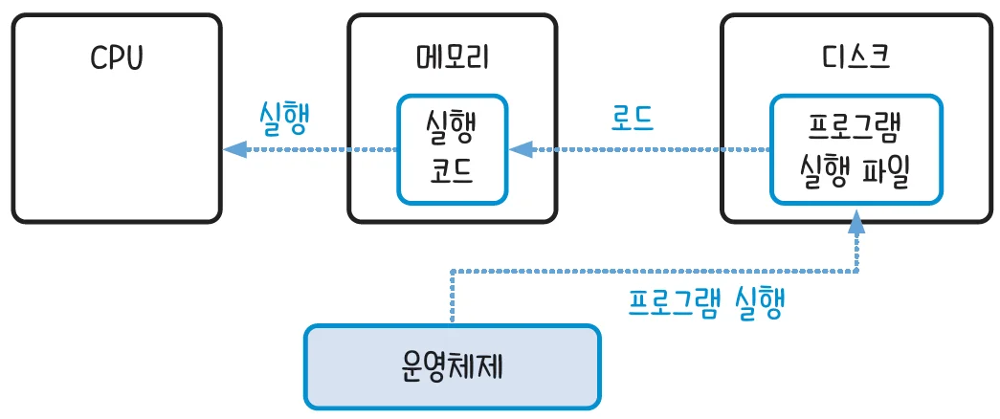

16
ROKEY BOOT CAMP
마이크로프로세서
▪마이크로프로세서(Microprocessor)는산술논리장치, 제어장치, 레지스터를하나의단일체집적회로로구성한것을의미한다.
▪CPU와의차이: CPU뿐만아니라GPU(Graphic Processing Unit), DSP(Digital Signal Processor)도포함
커널
▪하드웨어를초기화해사용할수있게하는운영체제의핵심부분. 여러소프트웨어가운영체제에서잘작동할수있도록
메모리와프로세스를관리하고, 네트워크를연결하는등주요기능을제공
 
파일, 파일시스템
▪
파일: 정보를저장하는기본단위
▪
파일시스템: HDD, SSD 등저장장치에파일을저장하고관리하는소프트웨어. 파일시스템은파일의이름, 크기, 저장위치를
저장하고, 파일에대한읽기/쓰기/실행을제어하며, 파일의권한을관리하고저장장치에대한접근도제어
네트워크시스템
▪
네트워크드라이버(network driver) : 유선랜, 와이파이, 블루투스등네트워크장치를초기화해
▪
사용할수있게하는장치드라이버
▪
네트워크스택(network stack) : 네트워크장치를통해들어온네트워크트래픽을처리하는네트워크프로토콜을
▪
구현한소프트웨어
▪
네트워크프로토콜(network protocol) : 네트워크에서데이터를주고받는데적용되는통신규약
Application 작동원리(마이크로프로세서, 메모리, 저장장치)

17
ROKEY BOOT CAMP
장치
▪그래픽카드, 랜카드, 디스크드라이브, 마우스, 키보드등컴퓨터에연결해사용하는모든기기 
컴퓨터주기억장치메모리(RAM)
▪컴퓨터가켜지는순간부터CPU 연산과동작에필요한모든내용이저장되는곳
컴퓨터저장장치메모리(플래시메모리Flash memory)
▪RAM과차별화된비휘발성메모리ROM중여러번다시작성할수있는EPROM(Erasable PROM)의한종류인플래시메모리가많이사용
Application 작동원리(마이크로프로세서, 메모리, 저장장치)

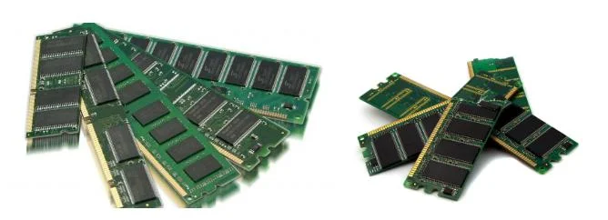

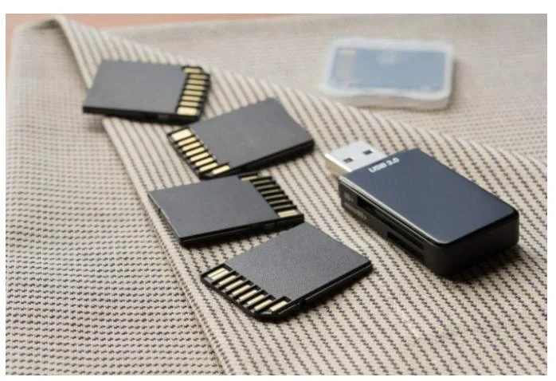

18
ROKEY BOOT CAMP
Application 작동원리(마이크로프로세서, 메모리, 저장장치)

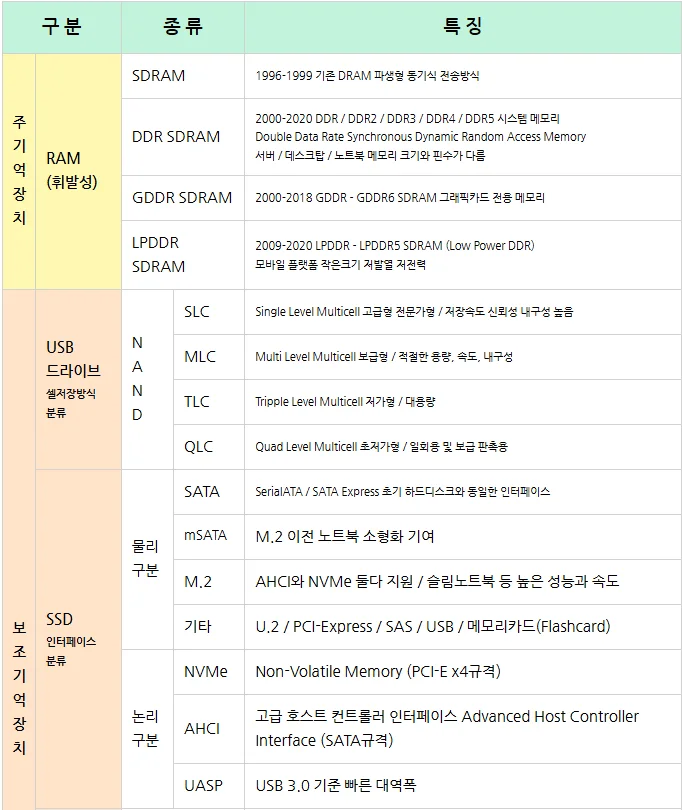

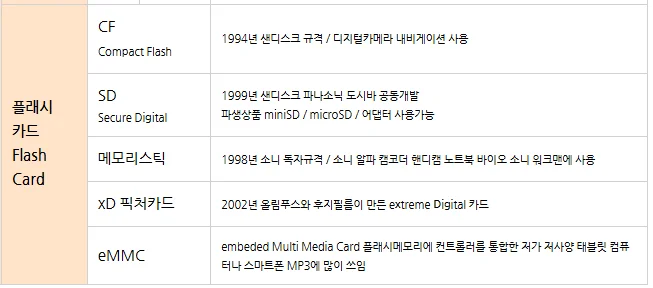

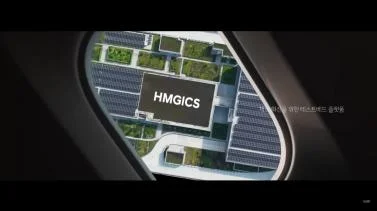

19
ROKEY BOOT CAMP
Application 작동원리(마이크로프로세서, 메모리, 저장장치)
메모리구조
프로그램이실행되기위해서는먼저프로그램이메모리에로드(load)되어야합니다.
또한, 프로그램에서사용되는변수들을저장할메모리도필요합니다.
따라서컴퓨터의운영체제는프로그램의실행을위해다양한메모리공간을제공하고있습니다.
프로그램이운영체제로부터할당받는대표적인메모리공간은4종류입니다.
▪코드(code) 영역
▪데이터(data) 영역
▪스택(stack) 영역
▪힙(heap) 영역
1. 코드(code) 영역
메모리의코드(code) 영역은실행할프로그램의코드가저장되는영역으로텍스트(code) 영역이라고도
부릅니다.
CPU는코드영역에저장된명령어를하나씩가져가서처리하게됩니다.
2. 데이터(data) 영역
메모리의데이터(data) 영역은프로그램의전역변수와정적(static) 변수가저장되는영역입니다.
데이터영역은프로그램의시작과함께할당되며, 프로그램이종료되면소멸합니다.

20
ROKEY BOOT CAMP
Application 작동원리(마이크로프로세서, 메모리, 저장장치)
스택(Stack) 영역
메모리의스택(stack) 영역은함수의호출과관계되는지역변수와매개변수가저장되는영역입니다.
스택영역은함수의호출과함께할당되며, 함수의호출이완료되면소멸합니다.
이렇게스택영역에저장되는함수의호출정보를스택프레임(stack frame)이라고합니다.
스택영역은푸시(push) 동작으로데이터를저장하고, 팝(pop) 동작으로데이터를인출합니다.
이러한스택은후입선출(LIFO, Last-In First-Out) 방식에따라동작하므로, 가장늦게저장된데이터가
가장먼저인출됩니다.
스택영역은메모리의높은주소에서낮은주소의방향으로할당됩니다.
힙(Heap) 영역
메모리의힙(heap) 영역은사용자가직접관리할수있는‘그리고해야만하는’ 메모리영역입니다.
힙영역은사용자에의해메모리공간이동적으로할당되고해제됩니다.
힙영역은메모리의낮은주소에서높은주소의방향으로할당됩니다.
스택
힙
•
매우빠른액세스
•
변수를명시적으로할당해제할필요가
없습니다.
•
공간은CPU에의해효율적으로관리됩니다.
•
지역변수
•
스택크기제한(OS에따라다름)
•
변수의크기를조정할수없습니다.
•
변수는전역적으로액세스할수있습니다.
•
메모리크기제한없음
•
(상대적으로) 느린액세스
•
효율적인공간사용을보장하지못하면메모리블록이할당된후시간이지남에따라
메모리가조각화되어해제될수있습니다.
•
메모리를관리해야합니다(변수를할당하고해제하는책임이있습니다)
메모리구조

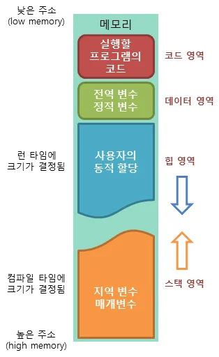

21
ROKEY BOOT CAMP
Stack, Queue, Circular Queue, Deque
Stack
Queue

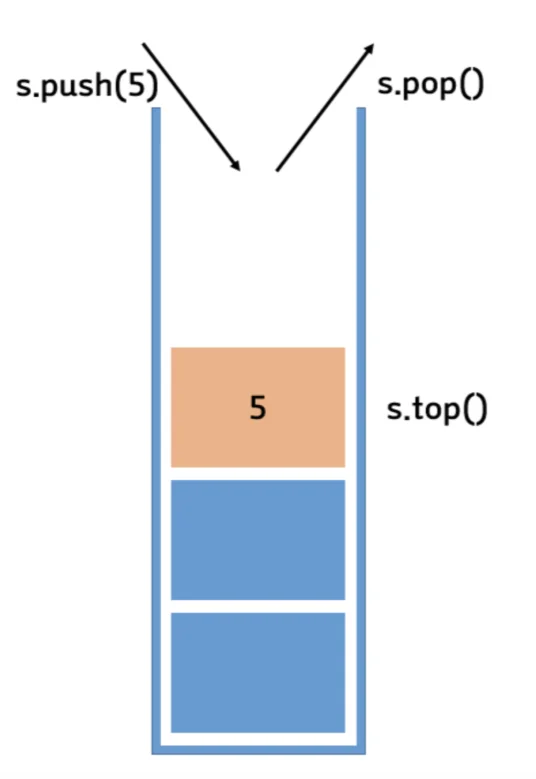

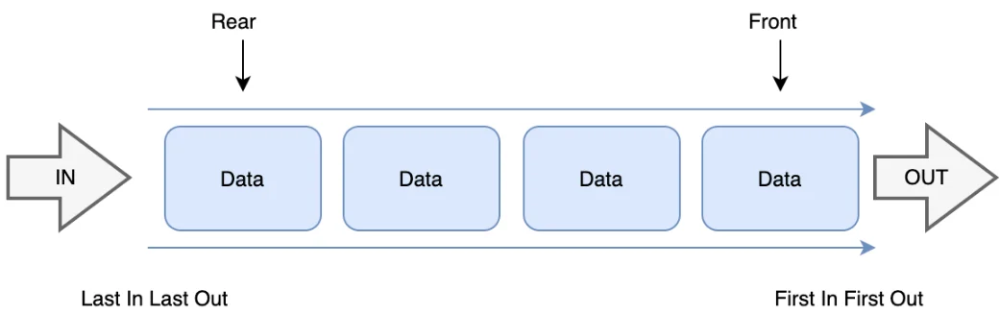

22
ROKEY BOOT CAMP
Stack, Queue, Circular Queue, Deque
Circular Queue
Deque
(Double Ended Queue)

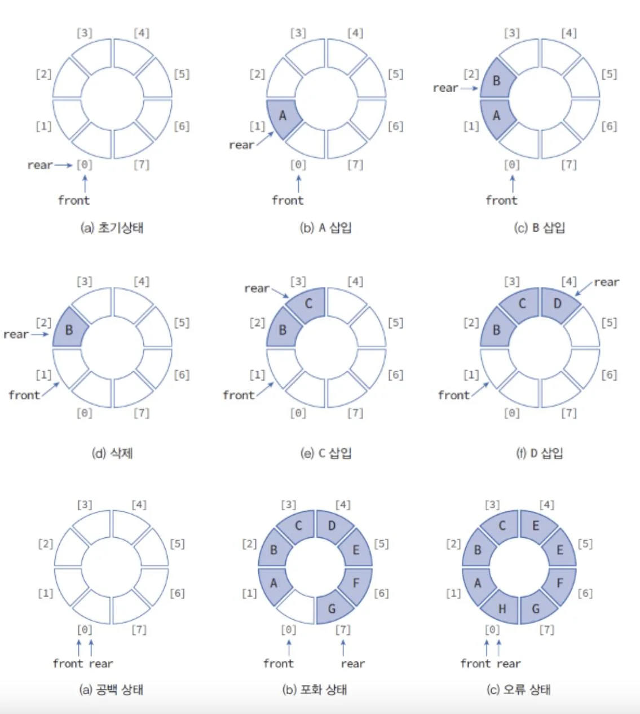

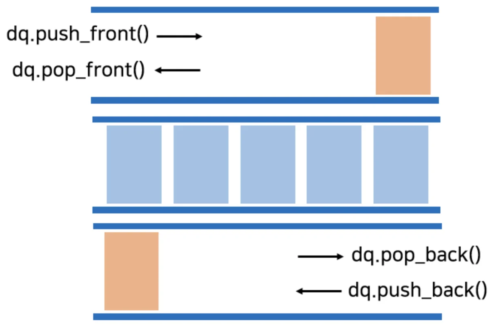

23
ROKEY BOOT CAMP
컴퓨터구조(Booting, CPU 작동원리, POST)
프로그램이란
프로그램의의미는어떤작업을하기위해해야할일들을순서대로나열한것으로쉽게말해컴퓨터에서어떤작업을위해실행할수있는'정적인상태'의
파일이라고볼수있다.
컴퓨터에서의'프로그램'은사용자가원하는일을처리할수있도록프로그래밍언어를사용하여올바른수행절차를표현해놓은명령어들의집합이다.
그에필요한데이터를묶어놓은파일로보조기억장치에저장되어있다.
프로세스(Process)란무엇인가
프로그램이실행되서돌아가고있는상태, 컴퓨터에서연속적으로실행되고있는'동적인상태'의컴퓨터프로그램이다
[특징]
▪프로세스는각각Code, Data, Stack, Heap의구조로되어있는독립된메모리영역을할당받는다.
▪다른프로세스의자원에접근하려면프로세스간의통신(IPC)을사용해야한다.
▪프로세스는최소하나이상의스레드를포함한다.
▪각프로세스는별도의주소공간에서실행되며, 서로독자적인메모리공간을갖기때문에서로메모리공간을
공유할수없다. 즉, 다른프로세스의변수나자료구조에접근할수없다.

24
ROKEY BOOT CAMP
컴퓨터구조(Booting, CPU 작동원리, POST)
스레드(Thread)란무엇인가
▪스레드(Thread)는프로세스가할당받은자원을이용하는실행단위이자, 프로세스의특정한수행경로이자프로세스내에서실행되는여러흐름의단위이다.
▪스레드는프로세스내에서프로세스의자원을이용해서실제로작업을수행하는일꾼이다.
▪스레드가소속된프로세스가운영체제로부터자원을할당받으면그자원을스레드가사용한다.
▪프로세스는최소한개이상의스레드를가지며이스레드를메인스레드(main thread)라고한다.
[스레드의특징]
▪각스레드는독자적인스택(Stack) 메모리를갖는다.
▪스레드는프로세스내에서각각스택만할당받고Code, Data, Heap 영역은공유한다.
▪스레드는한프로세스내에서동작되는여러실행의흐름으로, 프로세스내의주소공간이나자원들을같은프로세스내의스레드끼리공유하며실행된다.
▪각각의스레드는별도의레지스터와스택을갖고있지만, 힙메모리는서로읽고쓸수있다.
▪한스레드가프로세스자원을변경하면, 다른이웃스레드(sibling thread)도그변경결과를즉시볼수있다.
▪스레드는메모리를공유하기때문에동기화, 데드락등의문제가발생할수있다.
▪스레드는대부분의현대운영체제가지원하고있으며, 이와관련된주요라이브러리로는POSIX Pthreads, Windows threads, Java threads 가있다.
프로세스(Process)와스레드(Thread)
▪프로세스와스레드의관계: 프로세스는스레드의컨테이너이다. 스레드의정보를담고있는것에불과하다.
▪프로세스와스레드의차이점: 프로세스는각작업(Task)마다운영체제로부터자원을할당받기위해시스템콜을하는부담이생기지만멀티스레드를
사용한다면시스템콜을한번만해도되기때문에효율적이다.
▪또한IPC 방식보다는스레드간통신이덜복잡하고시스템자원사용이더적으므로통신의부담도줄일수있다.

25
ROKEY BOOT CAMP
컴퓨터구조(Booting, CPU 작동원리, POST)
멀티프로세스와멀티스레드
멀티스레딩이란
▪하나의응용프로그램을여러개의스레드로구성하고각스레드로하여금하나의작업을처리하도록하는것이다.
▪윈도우, 리눅스등많은운영체제들이멀티프로세싱을지원하고있지만멀티스레딩을기본으로하고있다.
▪웹서버는대표적인멀티스레드응용프로그램이다.
멀티스레딩의장점
▪시스템자원소모감소(자원의효율성증대)
▪프로세스를생성하여자원을할당하는시스템콜이줄어들어자원을효율적으로관리할수있다.
▪시스템처리량증가(처리비용감소)
▪스레드간데이터를주고받는것이간단해지고시스템자원소모가줄어들게된다.
▪스레드사이의작업량이작아Context Switching이빠르다.
▪간단한통신방법으로인한프로그램응답시간단축
▪스레드는프로세스내의Stack 영역을제외한모든메모리를공유하기때문에통신의부담이적다.
멀티스레딩의단점
▪주의깊은설계가필요하다.
▪디버깅이까다롭다.
▪단일프로세스시스템의경우효과를기대하기어렵다.
▪다른프로세스에서스레드를제어할수없다. (즉, 프로세스밖에서스레드각각을제어할수없다.)
▪멀티스레드의경우자원공유의문제가발생한다. (동기화문제)
▪하나의스레드에문제가발생하면전체프로세스가영향을받는다.
*멀티프로세스대신멀티스레드를사용하는이유는?
프로그램을여러개키는것보다하나의프로그램안에서여러
작업을해결하는것이더효율적이기때문이다.

26
ROKEY BOOT CAMP
리눅스CLI 실습(디렉토리, 계정, 기본명령어등)

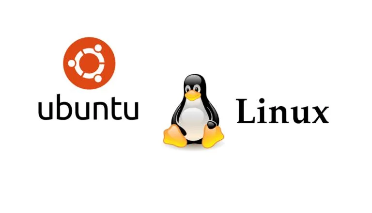

27
ROKEY BOOT CAMP
운영체제란무엇인가?
운영체제(Operating System, OS)는 사용자가컴퓨터를사용하기위해필요한소프트웨어
일반적으로컴퓨터를사용하면서실행한모든프로그램들은운영체제에서관리하고제어한다
운영체제 목적
컴퓨터의하드웨어관리+ 사용자편의제공
컴퓨터의성능을높이고(performance), 사용자에게편의성제공(Convenience)을목적으로하는컴퓨터하드웨어관리하는프로그램
리눅스란
리눅스(Linux)는리누스토르발즈가유닉스(Unix)에기반하여만든운영체제
특징: 
▪독립된플랫폼을갖는운영체제
▪빠른업데이트
▪강력한네트워크지원
▪다중직업과가상터미널환경지원
▪유닉스호환
▪공개형오픈소스운영체제
▪다중사용자환경지원
▪저사양컴퓨터에서서버구축가능
▪이식성과확장성
리눅스와운영체계

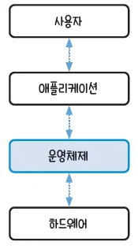

28
ROKEY BOOT CAMP
리눅스와운영체계

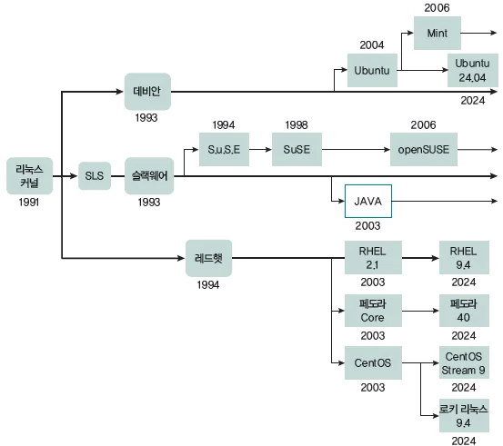

29
ROKEY BOOT CAMP
리눅스와운영체계
운영체제의역사

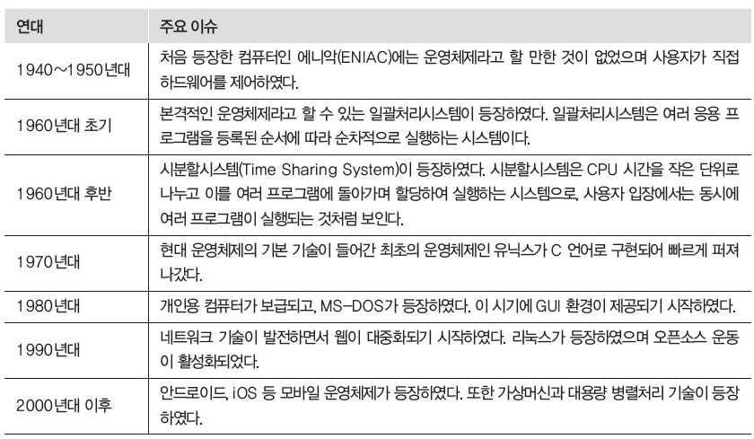

30
ROKEY BOOT CAMP
리눅스와운영체계
리눅스와유닉스
▪
리눅스: 유닉스계열운영체제, '리누스가만든유닉스'라는의미
▪
유닉스: 1969년AT&T 벨연구소에서개발, 1971년C 언어로재개발된최초의고급프로그래밍언어기반운영체제. 상용화버전(시스템계열)과
오픈소스버전(BSD 계열)으로발전
▪
리눅스의등장: 1980년대후반, BSD 유닉스가AT&T와법적공방중리누스토르발스가개발
리눅스의시작과발전
▪
핀란드헬싱키대학교학생인리누스베네딕트토르발스가교육용운영체제미닉스를참고해개발
▪
오픈소스운동에합류되며발전, 현재는서버, 슈퍼컴퓨터, 임베디드시스템, 모바일기기에서사용, 안드로이드운영체제도리눅스기반
▪
리눅스커널: 1991년8월처음공개, 현재최신버전6.9(2024년5월25일기준)
리눅스의특징
▪
리눅스는공개소프트웨어이며무료로사용할수있다.
▪
유닉스와완벽한호환성을유지한다.
▪
서버용운영체제로많이사용된다.
▪
편리한GUI 환경을제공한다.

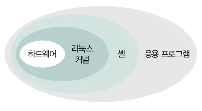

31
ROKEY BOOT CAMP
리눅스와운영체계
• 운영체제의구성요소
▪
커널: 시스템의핵심기능을담당
▪
파일시스템: 데이터저장및관리
▪
디바이스드라이버: 하드웨어와의통신
▪
시스템호출: 운영체제서비스접근
▪
인터페이스: 사용자와의상호작용
• CPU의동작모드
▪
커널모드: 하드웨어자원에직접접근가능
▪
사용자모드: 시스템호출을통해자원접근
운영체제의기능
▪
프로세스관리: 프로세스생성, 스케줄링, 관리
▪
메모리관리: 메모리할당/해제, 가상메모리
▪
파일시스템관리: 파일/디렉터리생성, 읽기, 쓰기, 삭제
▪
입출력관리: 데이터입출력, 버퍼링, 스케줄링
▪
자원관리및보호: 하드웨어자원관리, 충돌방지
▪
사용자인터페이스제공: GUI 및명령행인터페이스제공

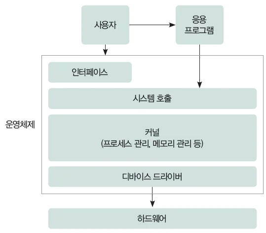

32
ROKEY BOOT CAMP
커널
▪하드웨어를초기화해사용할수있게하는운영체제의핵심부분. 여러소프트웨어가운영체제에서잘작동할수있도록
메모리와프로세스를관리하고, 네트워크를연결하는등주요기능을제공 
 
파일, 파일시스템
▪파일: 정보를저장하는기본단위
▪파일시스템: HDD, SSD 등저장장치에파일을저장하고관리하는소프트웨어. 파일시스템은파일의이름, 크기, 저장위치를
저장하고, 파일에대한읽기/쓰기/실행을제어하며, 파일의권한을관리하고저장장치에대한접근도제어
네트워크시스템
▪네트워크드라이버(network driver) : 유선랜, 와이파이, 블루투스등네트워크장치를초기화해사용할수있게하는장치
드라이버
▪네트워크스택(network stack) : 네트워크장치를통해들어온네트워크트래픽을처리하는네트워크프로토콜을구현한
소프트웨어
▪네트워크프로토콜(network protocol) : 네트워크에서데이터를주고받는데적용되는통신규약
리눅스와운영체계

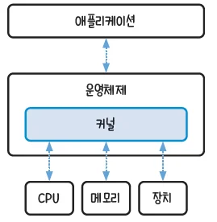

33
ROKEY BOOT CAMP
리눅스의계열
공개형오픈소스운영체제. 마이크로소프트- 윈도우, 애플– IOS 와달리리눅스는종류가많다
리눅스와운영체계
레드햇계열
페도라에서파생된배포판들이다. 패키지형식은.rpm이며패키지관리자로yum을
사용하는것이특징이다. 서버용으로사용되는경우가대부분이다. 얼마없는상용
리눅스중에서도굉장히잘나가는편인데, 이는서버시장이주타겟인배포판이기때문
맨드리바/마제야계열
마제야에서파생된배포판들. 본래맨드리바기반이었으나, 맨드리바가개발중단되면서
독립하였다. 쉬운사용성을추구하며, KDE를주력데스크톱환경으로밀고있는몇
안되는배포판들이다.
데비안계열
데비안에서파생된배포판들. 패키지형식은.deb이며, 패키지관리자로apt를
이용한다.
그외우분투, 아치, 슬랙웨어등등

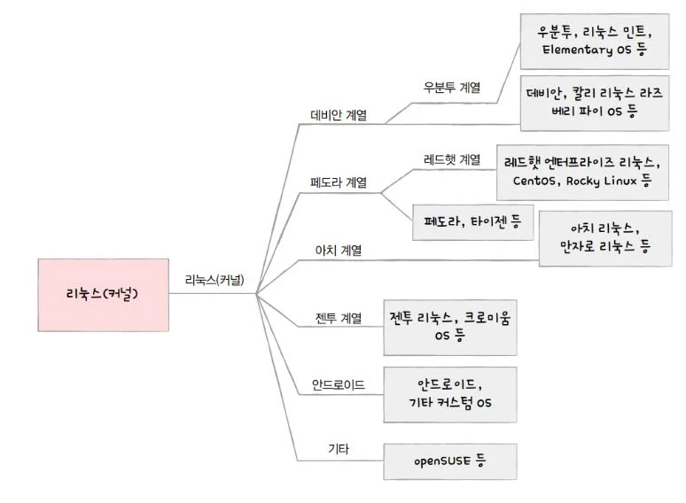

34
ROKEY BOOT CAMP
다양한리눅스종류
공개형오픈소스운영체제. 마이크로소프트- 윈도우, 애플– IOS 와달리리눅스는종류가많다
리눅스와운영체계

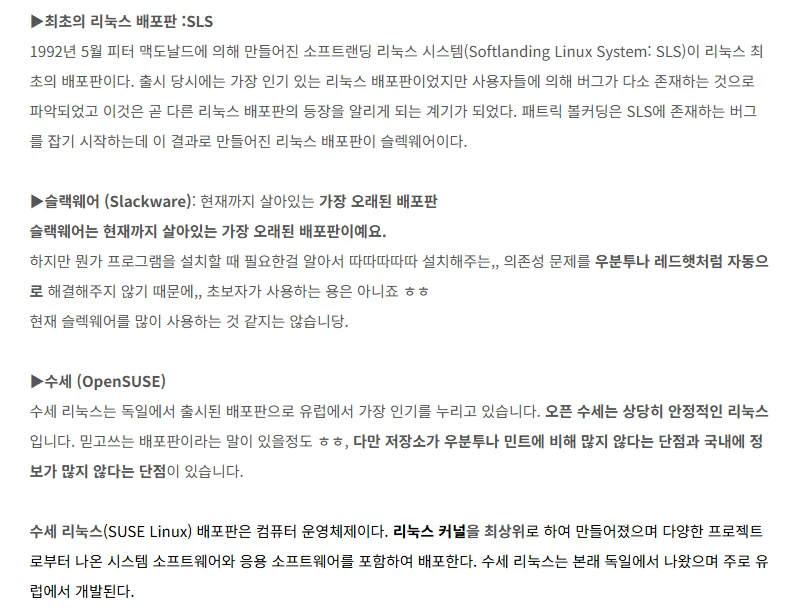

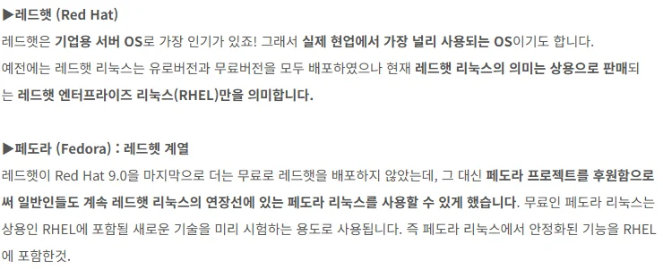

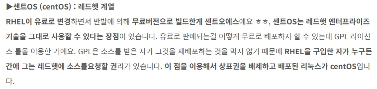

35
ROKEY BOOT CAMP
리눅스와운영체계
어디에쓰일까
▪
서버: IT 서비스를구성하기위한서버
▪
클라우드컴퓨팅: 클라우드서비스를구축하기위한백엔드
▪
임베디드시스템: PC나서버환경에비해제한적인자원을가진경우
▪
모바일기기: 스마트폰이나태블릿등
누가/왜배워야할까
▪
컴퓨터와관련한직군
▪
소프트웨어개발자
▪
시스템관리자, 소프트웨어엔지니어
▪
네트워크엔지니어
▪
데이터과학자나AI 전문가
C-ITS
C-ITS
Smart Factory
Smart Factory

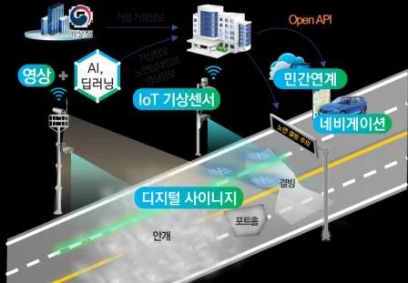

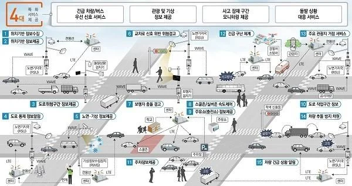

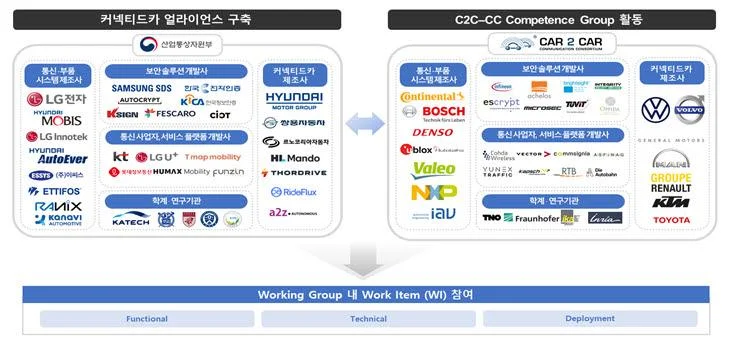

36
ROKEY BOOT CAMP
리눅스와운영체계

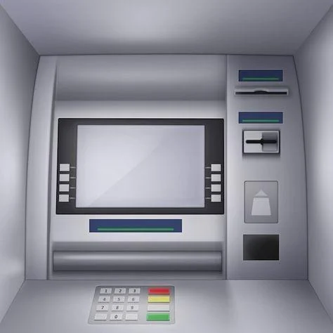

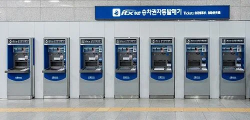

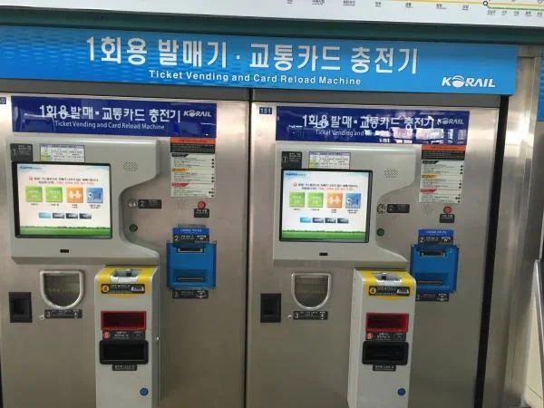

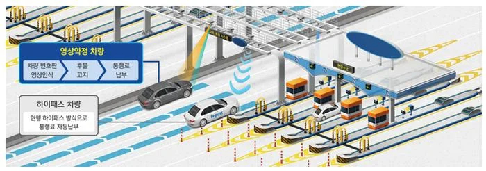

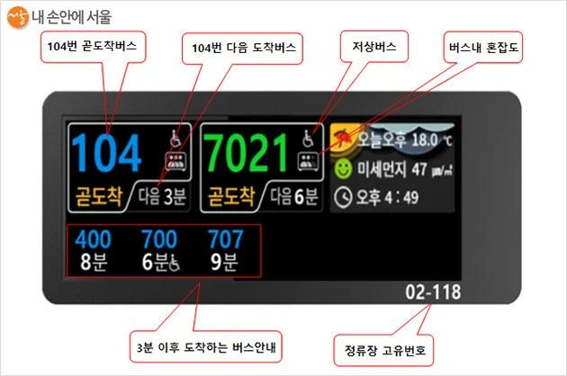

37
ROKEY BOOT CAMP
리눅스와운영체계
ROS와리눅스
▪
운영체계라이선스-> 오픈API
▪
개발시간단축-> API, 생태계활용
▪
편리한디버깅도구및시각화
▪
많은사용자및생태계-> 오픈API
시각화도구
ROS는다양한생태계를지향하여특정OS, 특정프로그래밍언어가강제되지
않지만해당이유로인해본강의에서는ROS를리눅스(우분투)에서사용한다 
ROS에서왜파이썬을쓰는가?
우리가그동안배운AI를로봇과연동시키기위해호환성을위해같은프로그래밍언어로구성하면유리한부분이있다.
또한시스템을구축한후유지/보수/관리측면에서다른프로그래밍언어로구축하게되면인력관리에이슈가생길수있어
하나의프로그래밍언어로통일하는것이좋다

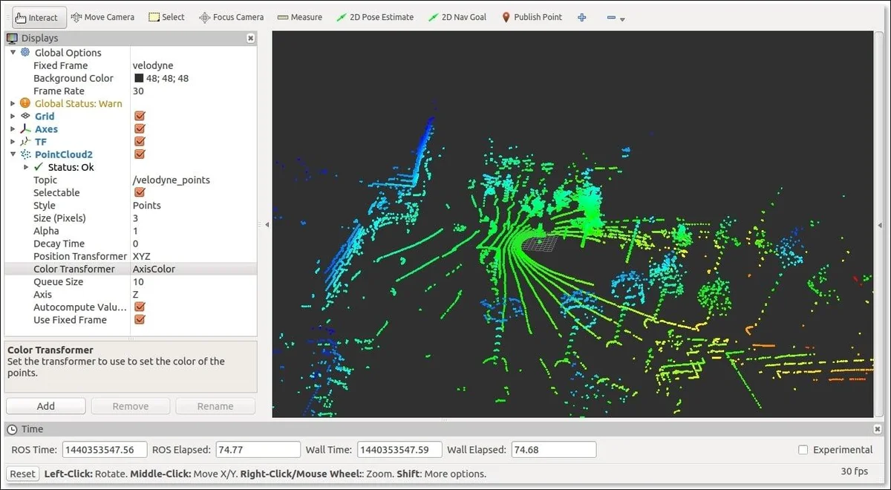

38
ROKEY BOOT CAMP
리눅스CLI 실습(디렉토리, 계정, 기본명령어등)
GUI
CLI
방식
그래픽
텍스트
메모리소비
높음
낮음
속도
느림
빠름
진입장벽
쉬움
어려움

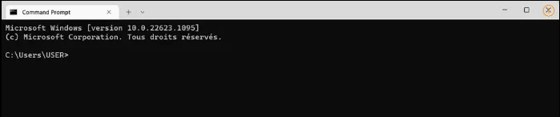

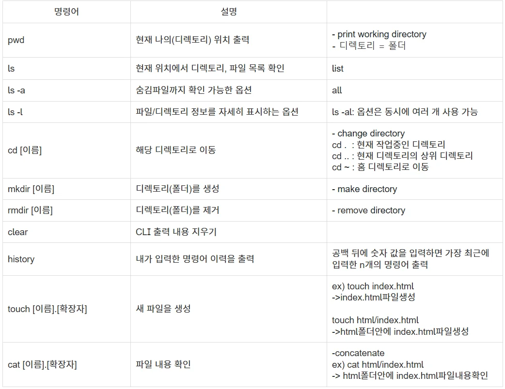

39
ROKEY BOOT CAMP
리눅스CLI 실습(디렉토리, 계정, 기본명령어등)

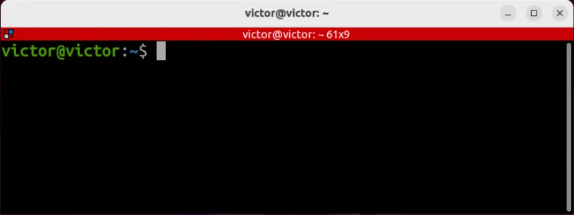

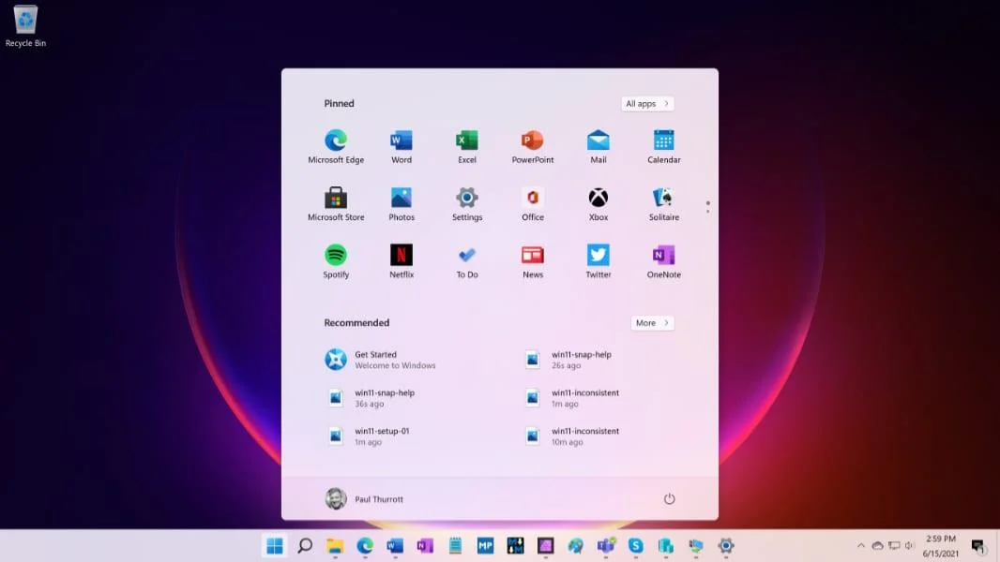

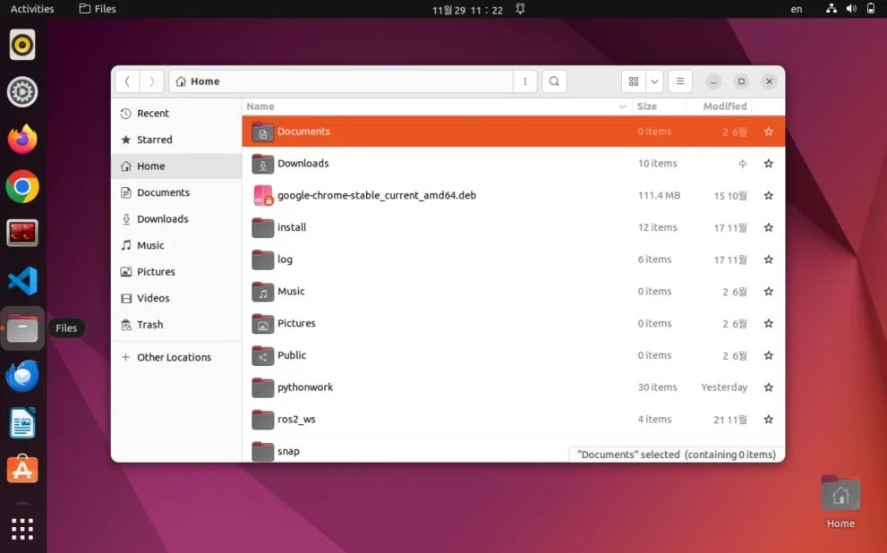

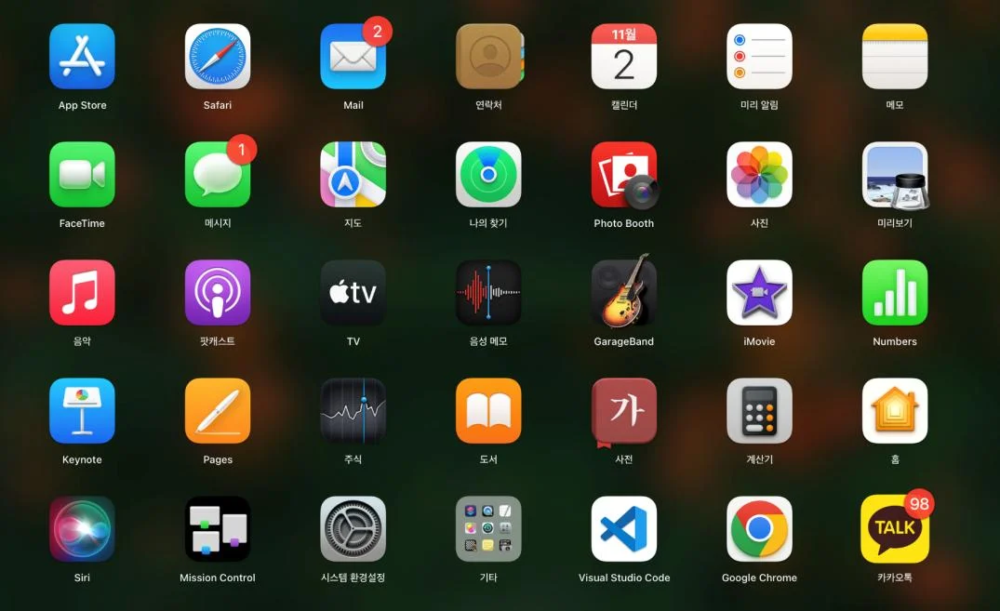

40
ROKEY BOOT CAMP
리눅스CLI 실습(디렉토리, 계정, 기본명령어등)
Linux의shell → bash
Windows의shell → cmd.exe
Windows의shell → powershell.exe

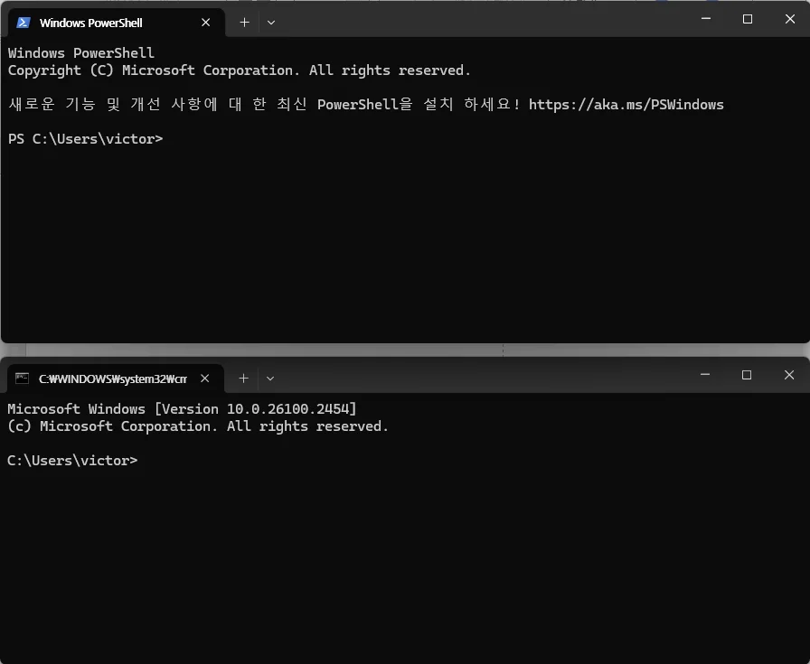

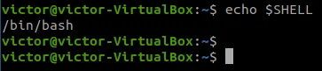

41
ROKEY BOOT CAMP
리눅스CLI 실습(디렉토리, 계정, 기본명령어등)
Windows와리눅스의디렉토리구조비교

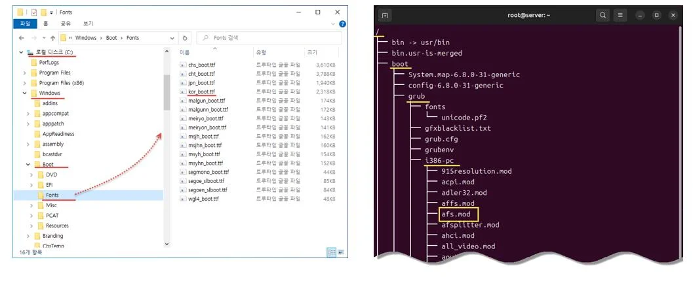

42
ROKEY BOOT CAMP
리눅스CLI 실습(디렉토리, 계정, 기본명령어등)
FHS(Filesystem Hierarchy Standard) 구성
/bin: ls, cd, cp, mv과같은기본적인명령어(binary)를저장하는디렉토리로, 대부분의
실행파일을포함함
/boot: OS 부팅에대한파일을담고있는디렉토리로, 커널이미지파일은부팅시매우
중요함
/dev: 입출력장치와관련된device 디렉토리
Ex) /dev/had(하드디스크), /dev/sda(SCSI 타입하드디스크)
/etc: 시스템환경설정파일과시스템부팅, 셧다운시필요한파일들의디렉토리
/home: user의홈디렉토리, 사용자계정명과동일하며root는/root가홈디렉토리
/media: CD_ROM,USB 등외부장치연결디렉토리
/mnt: 파일을임시로연결(mounting)하는디렉토리
/proc: 프로세스(process)와OS 정보를제공하기위한가상파일시스템의디렉토리로, 
각종정보를kernel 모드가아닌user 모드에서쉽게접근할수있도록해줌
-문자디렉토리는시스템과커널정보,숫자디렉토리는현재실행중인프로세스의
정보를나타냄
/root: 일반사용자가접근할수없는시스템관리자root의홈디렉토리

43
ROKEY BOOT CAMP
리눅스CLI 실습(디렉토리, 계정, 기본명령어등)
FHS(Filesystem Hierarchy Standard) 구성
/sbin: system Binary를의미하고시스템관리를위한실행유틸리티를
담고있다. Root 만이실행할수있는프로그램과명령어가있다. Ex) 
fdisk, reboot
/sys: 리눅스kernel 관련정보가있는디렉토리
/temp: 발생한임시데이터가저장되는디렉토리, 수시로생성및
삭제되며부팅시초기화됨
/usr: 기본실행파일, 라이브버리파일, 헤더파일등이저장되어있는
공유파일시스템디렉토리로사용자와관련된대부분의
응용프로그램과파일이저장되어있음
/var: 시스템운영중발생한가변데이터와로그가저장되는디렉토리
/opt: operation을의미하며타사응용프로그램을설치하는디렉토리, 
CentOS는없음
/lib: 시스템운영및프로그램작동시필요한공유라이브러리(*.so)

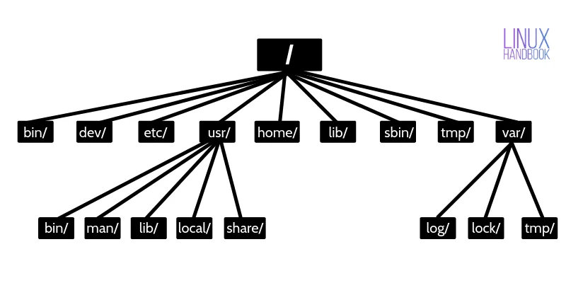

44
ROKEY BOOT CAMP
리눅스CLI 실습(디렉토리, 계정, 기본명령어등)
루트디렉토리
▪
디렉토리(directory): 파일시스템을계층화할때사용하는도구
▪
루트디렉토리(root directory): 파일시스템의최상단에위치하는디렉토리
현재작업디렉토리
▪
현재작업디렉토리: Bash가실행중인디렉터리
홈디렉토리
▪
홈디렉토리(home directory): 리눅스에사용자를추가하면사용자별로할당하는디렉토리
루트디렉터리하위의주요디렉토리

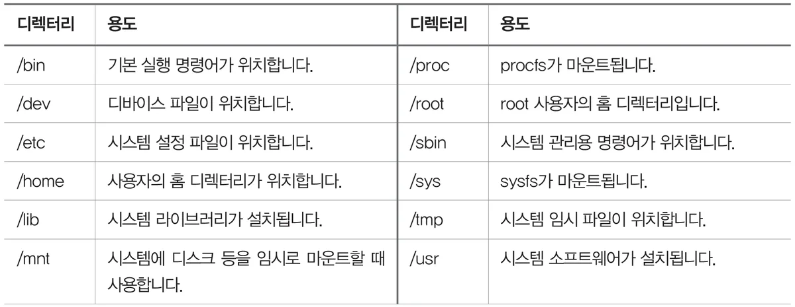

45
ROKEY BOOT CAMP
리눅스CLI 실습(디렉토리, 계정, 기본명령어등)
루트디렉터리와서브디렉터리
▪
최상단에루트디렉터리(/)가있고, 그아래에etc, usr, home, tmp 같은디렉터리가있음
▪
루트디렉터리: 유일하게부모디렉터리가없는디렉터리. 아래에는기본적으로서브디렉터리가있음
▪
디렉터리아래에있는디렉터리를서브디렉터리sub directory 또는하위디렉터리라고함
▪
서브디렉터리의입장에서보면위에자신을포함하고있는디렉터리가있는데, 이를부모디렉터리parent directory 또는상위디렉터리라고함
▪
상위디렉터리는..(마침표두개)로표시하며, .(마침표한개)는현재디렉터리를말함

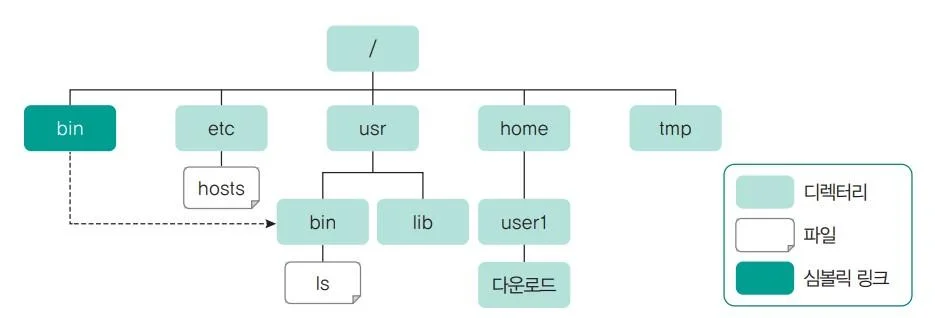

46
ROKEY BOOT CAMP
리눅스CLI 실습(디렉토리, 계정, 기본명령어등)

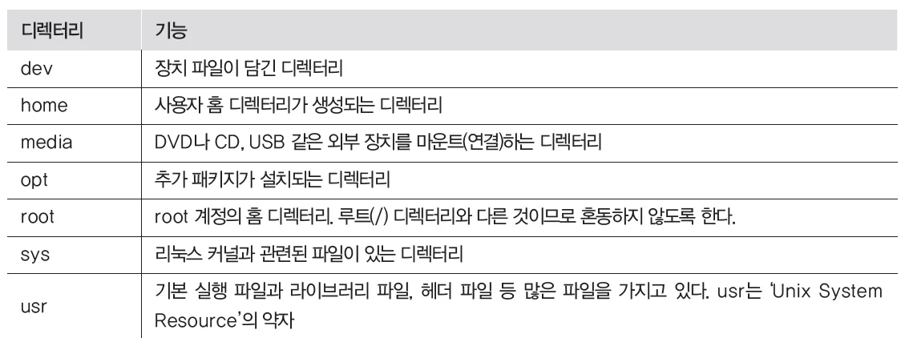

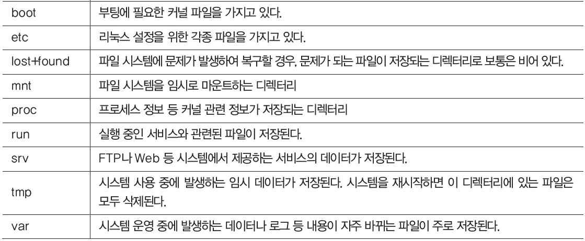

47
ROKEY BOOT CAMP
리눅스CLI 실습(디렉토리, 계정, 기본명령어등)
현재디렉터리확인(pwd)
▪
현재디렉터리를확인하는명령은pwd
▪
user1 계정으로로그인하면현재디렉터리는user1 계정의홈디렉터리가됨
디렉터리이동(cd)
▪
디렉터리에서다른디렉터리로이동할때는cd 명령을사용
▪
cd 명령과함께이동하고자하는목적지디렉터리를지정하면해당디렉터리로이동
▪
이동할디렉터리의경로명으로절대경로명과상대경로명둘다사용할수있음
▪
이동한뒤pwd 명령을사용하여현재디렉터리가바뀌었는지확인( ~가tmp로바뀜)
▪
프롬프트에현재디렉터리의이름을표시하도록설정되어있는것
▪
상대경로명을이용하여디렉터리를이동할경우상위디렉터리로이동해야하므로..(마침표두개)로시작
원래의홈디렉터리로이동방법
▪
cd /home/user1: 절대경로명을사용하여홈디렉터리로이동
▪
cd ../../home/user1: 현재/usr/lib 디렉터리에있으므로이를기준으로상대경로명을사용하여홈디렉터리로이동
▪
cd ~: 홈디렉터리를나타내는기호인~를사용하여홈디렉터리로이동
▪
cd: 목적지를지정하지않고cd 명령만사용하면해당계정의홈디렉터리로이동

48
ROKEY BOOT CAMP
리눅스CLI 실습(디렉토리, 계정, 기본명령어등)
디렉터리내용확인
▪
ls : 디렉터리에있는파일이나서브디렉터리등디렉터리의내용을보는명령
▪
ls 명령은다양한기능을제공하는옵션을사용하고, 내용을보고싶은목적지디렉터리를인자로지정할수있다

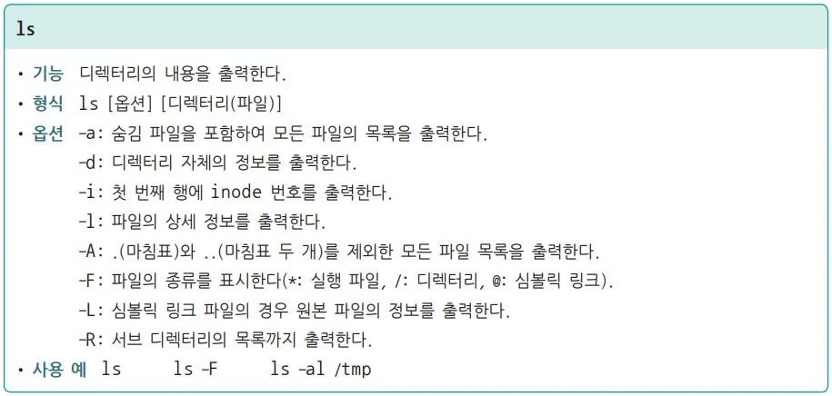

49
ROKEY BOOT CAMP
리눅스CLI 실습(디렉토리, 계정, 기본명령어등)
숨김파일확인하기: -a 옵션
▪
리눅스에서는파일명이나디렉터리명을.(마침표)로시작하면숨김파일이됨
▪
ls 명령만사용해서는보이지않고-a 옵션을지정해야함
▪
현재디렉터리를나타내는.(마침표)와상위디렉터리를나타내는..(마침표두개)도확인할수있음
파일의종류표시하기: -F 옵션
▪
ls 명령에서도-F 옵션을사용하면파일의종류를구분하는기호가표시됨
▪
파일명뒤에/가붙으면디렉터리, @이붙으면심볼릭링크, *가붙으면실행파일을의미하고, 아무표시도없으면일반파일
옵션여러개사용하기
▪
옵션을연결할때는-(하이픈) 뒤에옵션만나열
▪
숨김파일을보여주는a 옵션과파일의종류를보여주는F 옵션을연결하여사용하면숨김파일의종류도알수있음
▪
.(마침표)와..(마침표두개)에도/가붙어있음

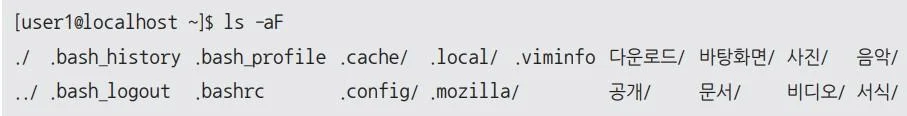

50
ROKEY BOOT CAMP
리눅스CLI 실습(디렉토리, 계정, 기본명령어등)
지정한디렉터리의내용출력하기
▪
해당디렉터리로이동하지않고도디렉터리의내용을확인할수있음
▪
옵션과인자를함께사용할수도있음
상세정보출력하기: -l 옵션
▪
디렉터리에있는파일들의상세한정보를보려면-l 옵션을사용
디렉터리의자체정보확인하기: -d 옵션
▪
디렉터리의자체정보를확인할때는-d 옵션을사용
ls 명령과비슷한명령: dir, vdir
▪
디렉터리의내용을보는dir과vdir 명령

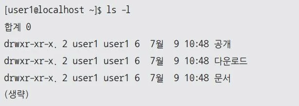

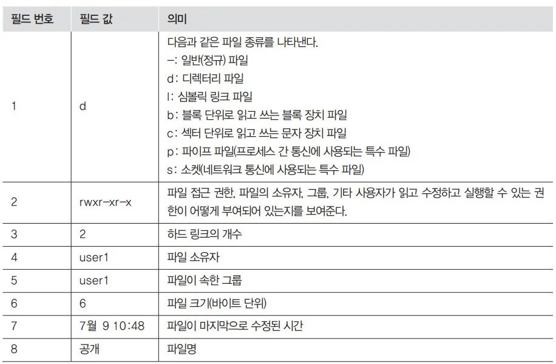

51
ROKEY BOOT CAMP
리눅스CLI 실습(디렉토리, 계정, 기본명령어등)
디렉터리한개만들기
▪
디렉터리를한개만만들려면mkdir 명령에인자로생성하려는디렉터리를지정하면 됨
동시에디렉터리여러개만들기
중간디렉터리를자동으로만들기: -p 옵션
▪
mkdir 명령다음에-p 옵션을사용하면, 생성할디렉터리로지정한경로중중간단계의디렉터리가없을경우자동으로중간단계디렉터리를
생성한후최종디렉터리를만듦
▪
비교해보기: mkdir 명령에-p 옵션을사용하지않은경우vs mkdir 명령에-p 옵션을사용한경우

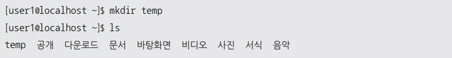

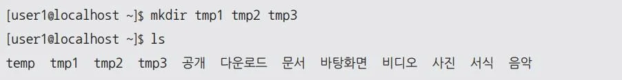

52
ROKEY BOOT CAMP
리눅스CLI 실습(디렉토리, 계정, 기본명령어등)
디렉터리삭제
▪
mkdir 명령예에서만든tmp3을삭제하는예
▪
rmdir 명령으로디렉터리를삭제할때는해당디렉터리가비어있어야함
▪
디렉터리에파일이나서브디렉터리가남아있으면rmdir로디렉터리를삭제할수없음
▪
비어있지않은디렉터리를삭제하려했을때
실습
▪
홈디렉터리로이동
▪
Test 디렉터리만들고이동하기
▪
디렉터리동시에만들기$mkdir one two three
▪
중간경로 tmp 디렉터리자동생성$mkdir –p one/tmp/test
▪
하위디렉터리보기$ls –R one
▪
$rmdir one
▪
$rmdir two three 실행해보기

53
ROKEY BOOT CAMP
리눅스CLI 실습(디렉토리, 계정, 기본명령어등)
파일내용출력
▪
파일내용을연속으로출력하기: cat
파일내용출력
▪
/etc/hosts 파일의내용을cat 명령으로확인
파일내용을화면단위로출력하기: more
▪
more 명령은파일내용을화면단위로출력하고, 출력할내용이더있으면화면하단에‘--More--(0%)’와같이알려줌

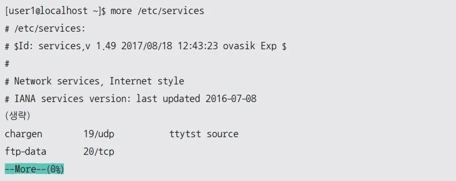

54
ROKEY BOOT CAMP
리눅스CLI 실습(디렉토리, 계정, 기본명령어등)
파일내용을화면단위로출력하기: less
▪
more 명령은이미스크롤되어지나간내용을다시볼수없다는것
▪
less 명령을사용하면파일내용을앞뒤로스크롤하며이동할수있음

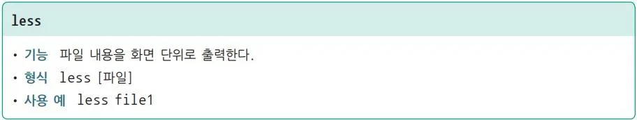

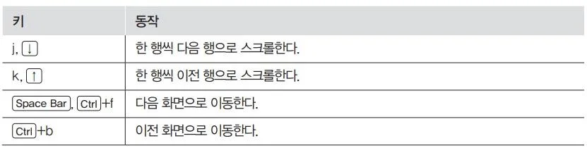

55
ROKEY BOOT CAMP
리눅스CLI 실습(디렉토리, 계정, 기본명령어등)
파일내용의뒷부분출력하기: tail
▪
tail은파일뒷부분의몇행을출력, 기본값은10으로파일뒷부분의10행이출력됨

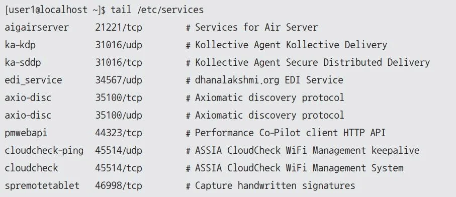

56
ROKEY BOOT CAMP
리눅스의시간(2038년1월19일03시14분07초)
1.
제목: 2038년문제(Y2038)
2.
개요: 
32bit 운영체계를사용하는OS(Linux, Unix)는2038/01/19 03:14:07초를지나게되면1901/12/31 혹은1970/01/01 시점으로타임슬립하는문제. 
정식명칭은Y2K38, Y2038이라고함
3.
원인 :
컴퓨터에서그레고리력시간을계산하는방법에는여러가지가있는데, 현재보편적인방법은Unix Time을사용함. 해당방법은32bit 크기의정수형을
사용하여시간을나타냄. 초당1씩증가. 32bit의한계점은2,147,483,647이므로해당수를넘어가게되면overflow현상이발생하고, 최소값으로돌아가게됨
4.
해결방법:
▪
부호없는정수형으로변경. 음수를제외하면0 ~ 4,294,967,295까지증가. 즉, 2106년까지늦출수있다.
▪
그러나1970년1월1일이전의시간을셀수없으므로그이전출생자들의정보가모두사라지는단점
▪
OS를64bit이상으로변경. 단순히OS만변경하면안되고32bit에맞춰져있는실행파일, 라이브러리등64bit정수형으로변경필요
5.
이문제를해결하면언제까지가능?
64bit 정수형최대값= 9,223,372,036,854,775,807. 1970년부터계산하면서기2922억7702만6596년12월4일15시30분8초
6.
참고: 
▪
Y2K : 1999/12/31 23:59:59 → 2000/01/01 00:00:00
▪
10년= 10년 x 365일 x 24시간x 3600초=   315,360,000초(약3억초)
▪
100년= 100년 x 365일 x 24시간x 3600초= 3,153,600,000초(약31억초)
▪
80년=
80년 x 365일 x 24시간x 3600초= 2,522,880,000초(약25억초)

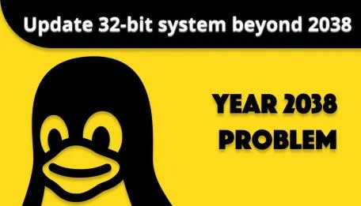

57
ROKEY BOOT CAMP
리눅스CLI 실습(디렉토리, 계정, 기본명령어등)
root
시스템을관리할수있는관리자권한의계정이자슈퍼유저
리눅스파일체제의최상위디렉토리( / )로도표현한다.
root 권한이있으면모든파일과디렉토리에대해읽고쓸수있고, 생성할수도있지만제거할수도있다.
시스템구성을변경할수도있다. 그래서매우편하지만조심히행동해야하는계정이다.
su (Switch User)
현재계정을로그아웃하지않고다른계정으로전환하는명령어
sudo란무엇인가?
sudo는superuser do의줄임말로, 일시적으로관리자권한을부여하여특정명령어를실행할수있게해주는명령어입니다. 
리눅스에서는기본적으로일반사용자와관리자(root) 사용자를구분하여시스템을보호합니다. sudo를통해사용자는root
계정의권한을일시적으로사용할수있으며, 시스템파일을수정하거나프로그램을설치하는등관리자권한이필요한
작업을수행할수있습니다

58
ROKEY BOOT CAMP
리눅스CLI 실습(디렉토리, 계정, 기본명령어등)
권한 설정이해하기(drwxr-xr-x 형식)
▪
리눅스에서파일과디렉터리는세가지사용자(소유자, 그룹, 기타사용자)에게읽기(r), 쓰기(w), 실행(x) 권한을
가질수있습니다. 이권한은chmod 명령어를통해수정가능합니다.
형식설명(drwxr-xr-x)
▪
첫글자: 파일타입(d는디렉터리, -는파일)
▪
그다음세글자: 소유자의권한(rwx - 읽기, 쓰기, 실행)
▪
그다음세글자: 그룹의권한(r-x - 읽기, 실행)
▪
마지막세글자: 기타사용자의권한(r-x - 읽기, 실행)
파일권한수정명령어
▪
읽기, 쓰기, 실행권한부여
▪
chmod u+r 파일명: 소유자에게읽기권한추가
▪
chmod g-w 파일명: 그룹의쓰기권한제거
▪
chmod o+x 파일명: 기타사용자에게실행권한추가
▪
숫자코드로설정
▪
4 = 읽기(r), 2 = 쓰기(w), 1 = 실행(x)
▪
예를들어, chmod 755 파일명명령어는drwxr-xr-x와같은설정을의미합니다.

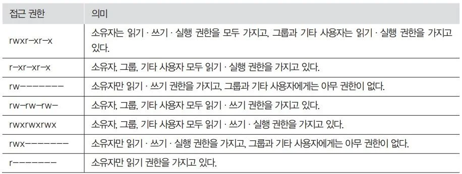

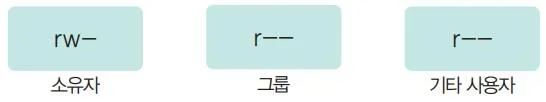

59
ROKEY BOOT CAMP
리눅스CLI 실습(디렉토리, 계정, 기본명령어등)

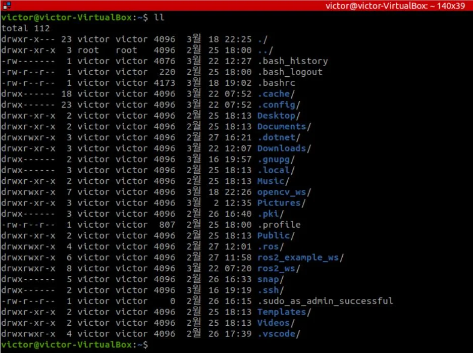

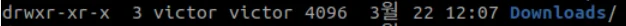

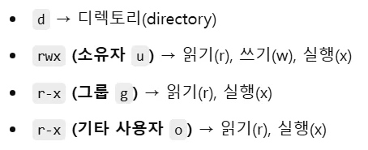

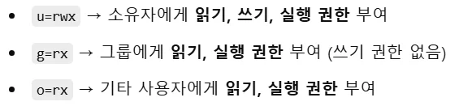

60
ROKEY BOOT CAMP
리눅스CLI 실습(디렉토리, 계정, 기본명령어등)
[ chmod 사용하여권한변경]
1. 기호 모드(Symbolic Mode) 사용
2. 숫자 모드(Octal Mode）사용
※
하위폴더와파일에도적용하는옵션

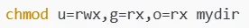

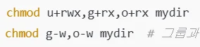

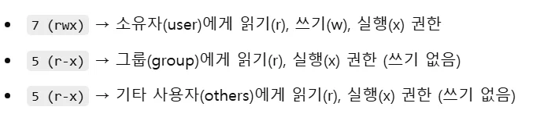

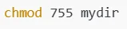

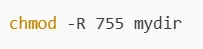

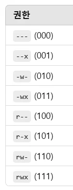

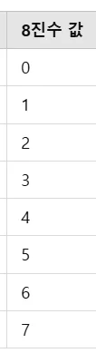

61
ROKEY BOOT CAMP
리눅스CLI 실습(디렉토리, 계정, 기본명령어등)
루트암호설정하기
$sudo passwd root
기호모드
▪
사용자카테고리: 소유자, 그룹, 기타사용자를나타내는문자로표기
▪
연산자: 권한부여나제거를나타내는기호로표기
▪
접근권한기호: 읽기, 쓰기, 실행을나타내는문자를사용

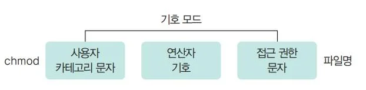

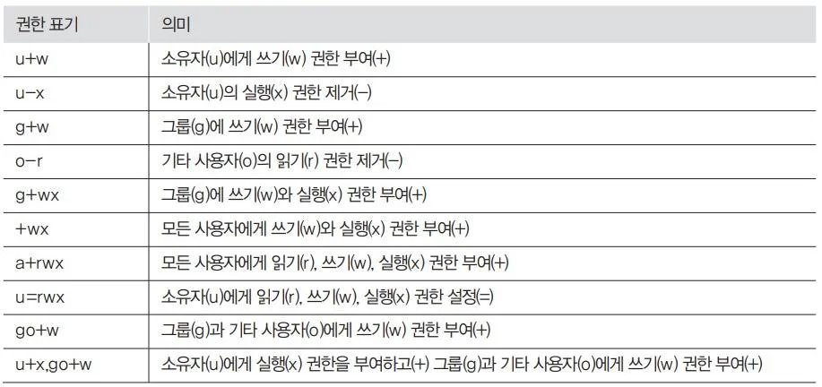

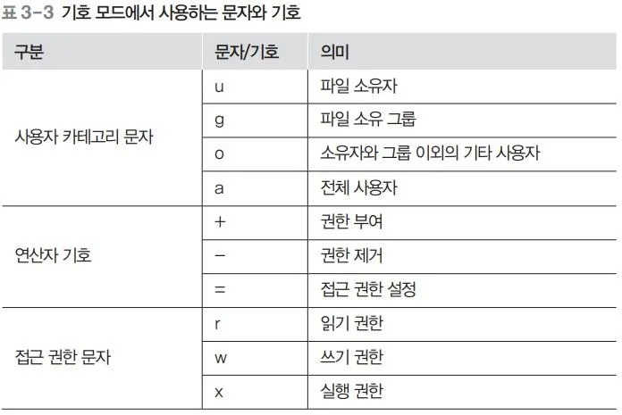

62
ROKEY BOOT CAMP
기호모드로접근권한변경하기
 
그룹에쓰기와실행권한을부여(g+wx)
 
기타사용자에게실행권한을부여(o+x)
 
그룹과기타사용자의실행권한을제거(go-x)
리눅스CLI 실습(디렉토리, 계정, 기본명령어등)

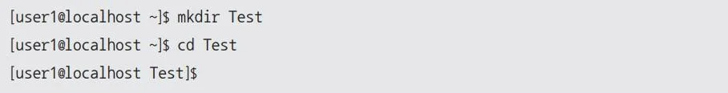

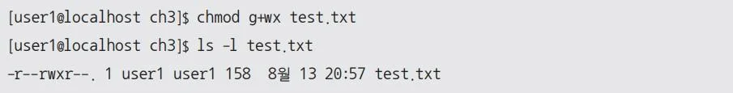

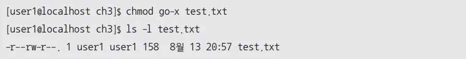

63
ROKEY BOOT CAMP
리눅스CLI 실습(디렉토리, 계정, 기본명령어등)
상대경로와절대경로
경로(path): 파일의위치정보를표현한것
상대경로(relative path): 현재작업디렉터리를기준으로파일경로를나타냄
절대경로(absolute path): 루트디렉터리를기준으로파일경로를나타냄

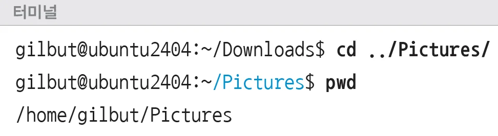

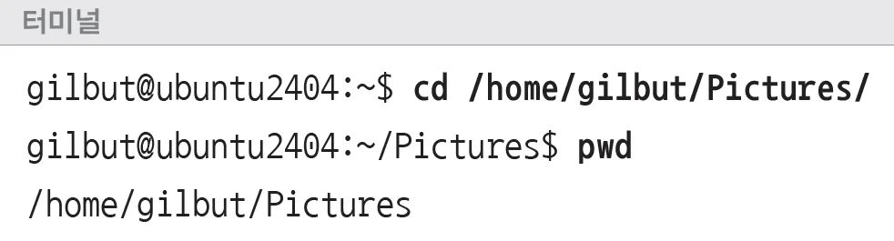

64
ROKEY BOOT CAMP
리눅스CLI 실습(디렉토리, 계정, 기본명령어등)
파일내용검색하기: grep
 
grep의가장기본적인사용법으로인자로지정한문자열을검색하는예
 
-n 옵션을사용하면검색된행번호도함께출력됨

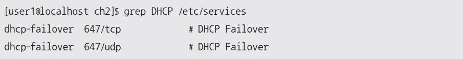

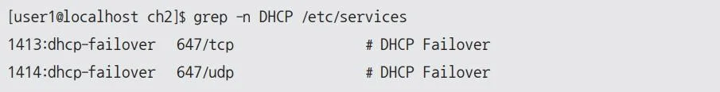

65
ROKEY BOOT CAMP
리눅스CLI 실습(디렉토리, 계정, 기본명령어등)
표준입출력장치
▪
표준입력장치: 셸이작업을수행하는데필요한정보를받아들이는장치
▪
표준출력장치: 실행결과를내보내는장치
▪
표준오류장치: 표준출력과별도로오류메시지를내보내는장치
▪
표준입력장치는키보드로설정되어있고, 표준출력및표준오류장치는화면으로설정되어있음
▪
파일디스크립터: 작업중필요한파일에일련번호를붙여서관리하는값
▪
입출력장치를변경할때파일디스크립터를사용

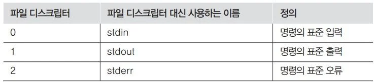

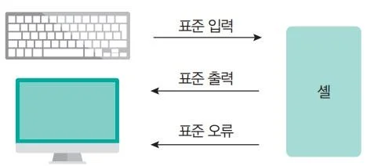

66
ROKEY BOOT CAMP
리눅스CLI 실습(디렉토리, 계정, 기본명령어등)
출력리다이렉션
▪
리다이렉션: 표준입출력장치를파일로바꾸는것
▪
출력결과를저장할파일이이미존재하는파일일경우, 기존파일의내용을유지할지말지에따라달라짐
▪
기존파일의내용을삭제하고새로결과를저장할때는>를, 기존파일의내용뒤에결과를추가할때는>>를사용
• 파일덮어쓰기: >
▪
표준출력파일을바꾸는특수문자>
▪
첫번째형식의1은파일디스크립터1번을의미
▪
파일디스크립터1은생략가능하며, 보통1이생략된두번째형식을사용
▪
셸은>를사용한리다이렉션에서지정한파일명의파일이없으면파일을생성하여명령의수행결과를저장
▪
해당파일이있으면기존내용이없어지고명령의수행결과로대체되므로출력리다이렉션을사용할때는먼저해당이름의파일이있는지확인해야함

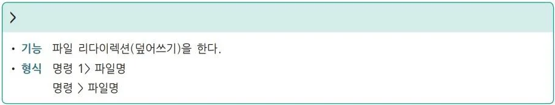

67
ROKEY BOOT CAMP
리눅스CLI 실습(디렉토리, 계정, 기본명령어등)

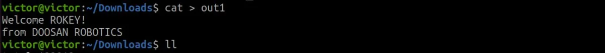

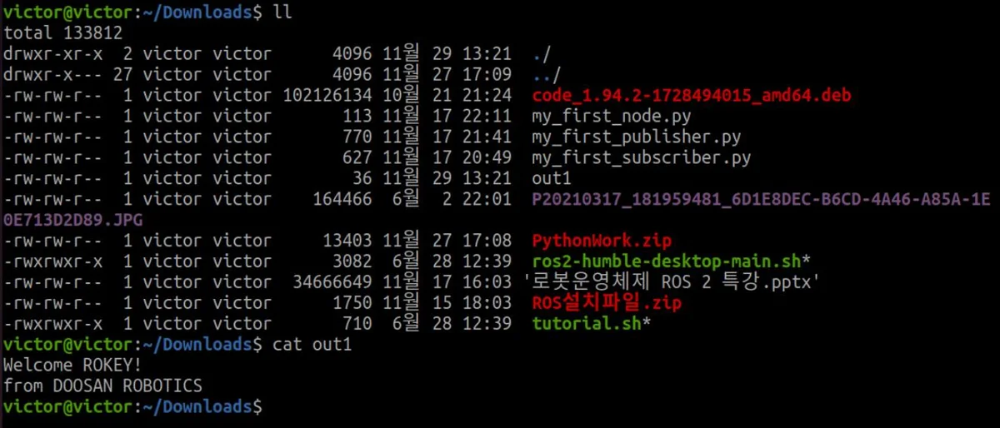

68
ROKEY BOOT CAMP
리눅스CLI 실습(디렉토리, 계정, 기본명령어등)

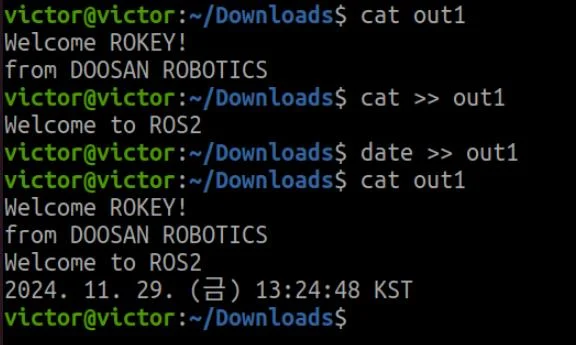

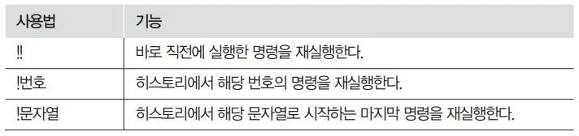

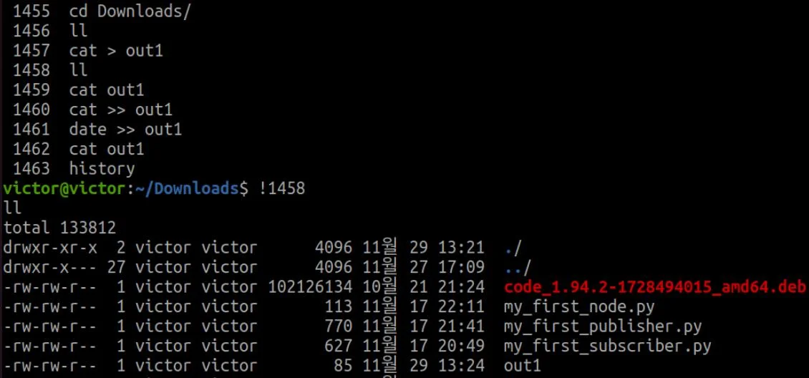

69
ROKEY BOOT CAMP
리눅스CLI 실습
• ls
Windows의dir과같은역할로,해당디렉터리에있는파일의목록을나열
예) # ls /etc/systemd
• cd
디렉터리를이동
예)  # cd ../etc/systemd
• pwd
현재디렉터리의전체경로를출력
• touch
크기가0인새파일을생성, 이미존재하는경우수정시간을변경
예)  # touch abc.txt

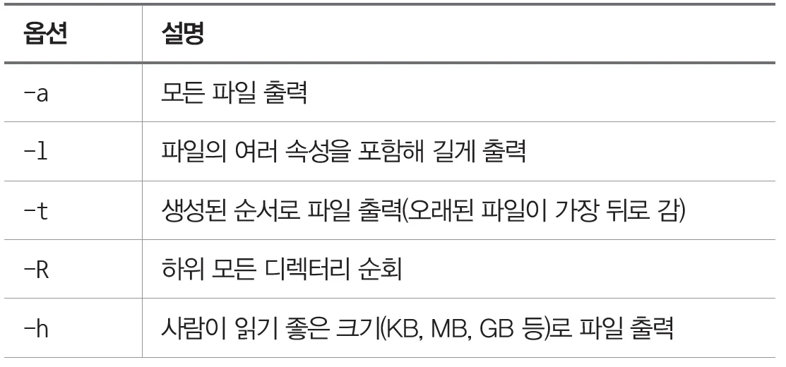

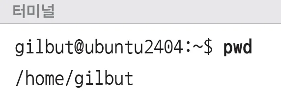

70
ROKEY BOOT CAMP
리눅스CLI 실습
• rm
파일이나디렉터리를삭제
예)  # rm -rf abc
• cp
파일이나디렉터리를복사
예) # cp abc.txt cba.txt
• mv
파일과디렉터리의이름을변경하거나위치이동시사용
예) mv  abc.txt  www.txt
• mkdir
새로운디렉터리를생성
예)  # mkdir abc
실습디렉터리생성하기
•
mkdir(make directory) 명령어
•
실습순서
1. ls 명령어로animals 디렉터리생성
2. dog, cat, cow 디렉터리생성
3. snake 디렉터리생성
4. -p 옵션을넣지않고fruits 디렉터리하위에apple 디렉터리생성
5. -p 옵션을넣고생성
6. -p 옵션으로fruits/apple 디렉터리를다시생성

71
ROKEY BOOT CAMP
리눅스CLI 실습
• rmdir
디렉터리를삭제. (단, 비어있어야함)
예) # rmdir abc
• cat
텍스트로작성된파일을화면에출력
예)  # cat a.txt b.txt
• head, tail
텍스트로작성된파일의앞10행또는마지막10행만출력
예) # head  /etc/systemd/user.conf
• more
텍스트로작성된파일을화면에페이지단위로출력
예)  # more  /etc/systemd/system.conf
• less
more와용도가비슷하지만기능이더확장된명령
예) # less /etc/systemd/system.conf
• file
File이어떤종류의파일인지를표시
예)  # file /etc/systemd/system.conf
• clear
터미널화면을깨끗하게지워줌
예) # clear
• nano
텍스트편집기

72
ROKEY BOOT CAMP
리눅스CLI 실습
일반파일이동
1. temporary의파일확인
2. mv 명령어로say-hi 파일의이름변경
3. greetings 파일의이름변경
4. 파일경로변경
5. temporary 디렉터리조회
6. hello 파일을현재작업디렉터리로이동
7. 파일이름변경
temporary 디렉터리의파일확인
# temporary 디렉터리로이동
cd ~/temporary
# 현재디렉터리의파일목록확인
ls
say-hi 파일의이름변경
# say-hi 파일의이름을say-hello로변경
mv say-hi say-hello
greetings 파일의이름변경
# greetings 파일의이름을welcome으로변경
mv greetings welcome
파일경로변경
# `say-hello` 파일을다른디렉터리로이동(예: ~/Documents)
mv say-hello ~/Documents
temporary 디렉터리조회
# 다시temporary 디렉터리로이동한후목록확인
cd ~/temporary
ls
hello 파일을현재작업디렉터리로이동
# hello 파일을현재디렉터리로이동(예: ~/temporary에서다른위치로이동)
mv ~/temporary/hello .  # 현재디렉터리로이동
hello 파일의이름변경
# hello 파일의이름을hi로변경
mv hello hi

73
ROKEY BOOT CAMP
리눅스CLI 실습
디렉터리이동
1. 현재디렉터리확인
2. haha 디렉터리생성
3. hoho로이름변경
4. 디렉터리위치이동
5. 디렉터리이동하며hihi로이름변경
현재디렉터리확인
# 현재작업중인디렉터리확인
pwd
haha 디렉터리생성
# 현재디렉터리에`haha`라는새디렉터리생성
mkdir haha
haha 디렉터리이름을hoho로변경
# `haha` 디렉터리의이름을`hoho`로변경
mv haha hoho
hoho 디렉터리로이동
# `hoho` 디렉터리로이동
cd hoho
디렉터리이동과동시에hihi로이름변경
# `hoho` 디렉터리를현재경로에서상위경로로이동시키면서`hihi`로이름변경
mv ../hoho ../hihi
# 상위디렉터리로이동하여변경된디렉터리확인
cd ..
ls

74
ROKEY BOOT CAMP
리눅스CLI 실습
일반파일삭제
1. 현재상태확인
2. say-hi 파일삭제
3. -i 옵션을주고hello 파일삭제
4. 여러파일한꺼번에삭제
현재상태확인
# 현재디렉터리에있는파일목록을확인
ls
say-hi 파일삭제
# `say-hi` 파일을삭제
rm say-hi
-i 옵션을주고hello 파일삭제
# `hello` 파일을삭제할때확인메시지표시
rm -i hello
# 삭제여부를묻는메시지가나오면`y`를입력해삭제를확정
여러파일한꺼번에삭제
# 예를들어`file1.txt`, `file2.txt`, `file3.txt` 파일을한꺼번에삭제
rm file1.txt file2.txt file3.txt
또는, 특정패턴에맞는파일을모두삭제할수있습니다. 예를들어, .txt 확장자를가진파일모두삭제:
rm *.txt

75
ROKEY BOOT CAMP
리눅스CLI 실습(디렉토리, 계정, 기본명령어등)
우분투터미널
우분투터미널은사용자가컴퓨터에명령어를입력하여시스템을제어관리할수있습니다
아래에는유용한터미널단축키들을모았습니다
터미널단축키
Ctrl + C: 현재작업중지
Ctrl + Z: 작업일시중지
Ctrl + D: 터미널로그아웃또는종료
Tab: 자동완성
Ctrl + R: 명령어기록에서검색

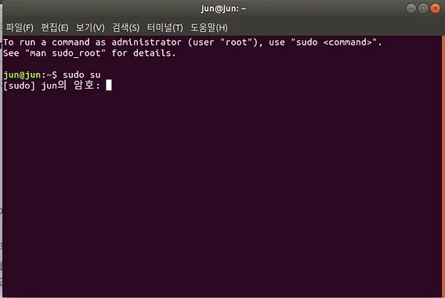

76
ROKEY BOOT CAMP
터미널
터미널(terminal): 컴퓨터와사용자간에상호작용할수있게연결하는장치
입력장치: 사용자가컴퓨터에명령을전달하는장치
출력장치: 컴퓨터가사용자에게결과를보여주는장치
셸(shell) 
운영체제가제공하는명령어기반인터페이스
셸스크립트(shell script): 셸에서동작가능한명령을모아놓은파일
Bash(배시)
리누스토르발즈가리눅스를개발할때리눅스로처음포팅한프로그램
Gedit
초보자친화적인에디터
터미널과셸의관계
터미널은사용자와컴퓨터가상호작용하기위한매체
이때사용하는도구중하나가바로셸
컴퓨터가부팅되면운영체제는터미널을통해사용자에게내용을보여주거나
사용자로부터명령을입력받을수있는상태가됨
apt-get install gedit -y
리눅스Terminator, 커널, 쉘, gedit, bash

77
ROKEY BOOT CAMP
gedit 실습
초보자친화적인에디터
apt-get install gedit -y
리눅스Terminator, 커널, 쉘, gedit, bash
gedit

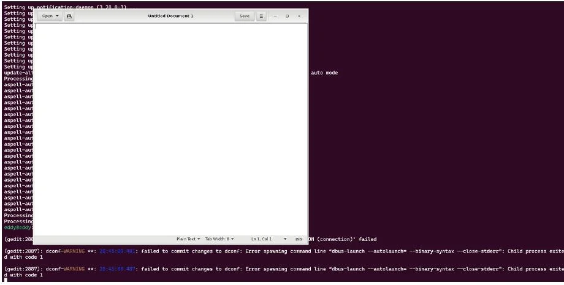

ROKEY BOOT CAMP
수고하셨습니다.

