# 강의_3기_ROS2_기초_2차시

ROKEY BOOT CAMP
ROS2 기초-2차시
Apr, 2025

2
ROKEY BOOT CAMP
훈련일정
오전
오후
1차시
▪로봇의역사
▪컴퓨터구조(Booting, CPU 작동원리, POST)
▪리눅스와운영체계
▪리눅스CLI 실습(디렉토리, 계정, 기본명령어등), Terminator, 커널, 쉘, gedit, bash
▪Application 작동원리(마이크로프로세서, 메모리, 저장장치)
▪리눅스 CLI 실습
2차시
▪리눅스 CLI 실습
▪네트워크와통신(IPV4, IPV6, 소켓, 노드, Hub, TCP, UDP)
▪API, Library, Framework, 프로세스와Thread
▪인터프리터, 컴파일러(소스코드→ Build → 실행파일)
▪소켓프로그래밍실습
▪OSI7 Layer, 프로토콜(RS-232C, RS-485, Ethernet, TCP/UDP, IP)
3차시
▪센서 기초, IoT와Embedded
▪로봇기초, 좌표계
▪로봇센서활용및로봇의 구성(기계기구, 전기전자, 소프트웨어)
▪ROS2 소개및활용
▪ROS2 설치(ros.org) 및demo_node
4차시
▪ROS2 소개및활용
▪ROS2 실습(Talker, Listener)
▪ROS2 패키지설명
▪ROS2 실습(Turtlesim, teleop_key)
5차시
▪ROS2 실습(Turtlesim, Teleop_key 여러개만들기)
▪Topic, Service, Action, Parameter, RQT, RQT_Graph 이론및실습
▪ROS2 실습(Turtlesim, Namespace 여러개만들기)
▪Ros bag and play 실습, my first package build 실습
▪Turtlesim subscribing 실습, ROS의 중요한개발도구(Rviz, GAZEBO 소개)

3
ROKEY BOOT CAMP
리눅스CLI 실습
• rm
파일이나디렉터리를삭제
예)  # rm -rf abc
• cp
파일이나디렉터리를복사
예) # cp abc.txt cba.txt
• mv
파일과디렉터리의이름을변경하거나위치이동시사용
예) mv  abc.txt  www.txt
• mkdir
새로운디렉터리를생성
예)  # mkdir abc
실습디렉터리생성하기
▪
mkdir(make directory) 명령어
▪
실습순서
▪1. ls 명령어로animals 디렉터리생성
▪2. dog, cat, cow 디렉터리생성
▪3. snake 디렉터리생성
▪4. -p 옵션을넣지않고fruits 디렉터리하위에apple 디렉터리생성
▪5. -p 옵션을넣고생성
▪6. -p 옵션으로fruits/apple 디렉터리를다시생성

4
ROKEY BOOT CAMP
리눅스CLI 실습
• rmdir
디렉터리를삭제. (단, 비어있어야함)
예) # rmdir abc
• cat
텍스트로작성된파일을화면에출력
예)  # cat a.txt b.txt
• head, tail
텍스트로작성된파일의앞10행또는마지막10행만출력
예) # head  /etc/systemd/user.conf
• more
텍스트로작성된파일을화면에페이지단위로출력
예)  # more  /etc/systemd/system.conf
• less
more와용도가비슷하지만기능이더확장된명령
예) # less /etc/systemd/system.conf
• file
File이어떤종류의파일인지를표시
예)  # file /etc/systemd/system.conf
• clear
터미널화면을깨끗하게지워줌
예) # clear
• nano
텍스트편집기

5
ROKEY BOOT CAMP
리눅스CLI 실습
일반파일이동
1. temporary의파일확인
2. mv 명령어로say-hi 파일의이름변경
3. greetings 파일의이름변경
4. 파일경로변경
5. temporary 디렉터리조회
6. hello 파일을현재작업디렉터리로이동
7. 파일이름변경
temporary 디렉터리의파일확인
# temporary 디렉터리로이동
cd ~/temporary
# 현재디렉터리의파일목록확인
ls
say-hi 파일의이름변경
# say-hi 파일의이름을say-hello로변경
mv say-hi say-hello
greetings 파일의이름변경
# greetings 파일의이름을welcome으로변경
mv greetings welcome
파일경로변경
# `say-hello` 파일을다른디렉터리로이동(예: ~/Documents)
mv say-hello ~/Documents
temporary 디렉터리조회
# 다시temporary 디렉터리로이동한후목록확인
cd ~/temporary
ls
hello 파일을현재작업디렉터리로이동
# hello 파일을현재디렉터리로이동(예: ~/temporary에서다른위치로이동)
mv ~/temporary/hello .  # 현재디렉터리로이동
hello 파일의이름변경
# hello 파일의이름을hi로변경
mv hello hi

6
ROKEY BOOT CAMP
리눅스CLI 실습
디렉터리이동
1. 현재디렉터리확인
2. haha 디렉터리생성
3. hoho로이름변경
4. 디렉터리위치이동
5. 디렉터리이동하며hihi로이름변경
현재디렉터리확인
# 현재작업중인디렉터리확인
pwd
haha 디렉터리생성
# 현재디렉터리에`haha`라는새디렉터리생성
mkdir haha
haha 디렉터리이름을hoho로변경
# `haha` 디렉터리의이름을`hoho`로변경
mv haha hoho
hoho 디렉터리로이동
# `hoho` 디렉터리로이동
cd hoho
디렉터리이동과동시에hihi로이름변경
# `hoho` 디렉터리를현재경로에서상위경로로이동시키면서`hihi`로이름변경
mv ../hoho ../hihi
# 상위디렉터리로이동하여변경된디렉터리확인
cd ..
ls

7
ROKEY BOOT CAMP
리눅스CLI 실습
일반파일삭제
1. 현재상태확인
2. say-hi 파일삭제
3. -i 옵션을주고hello 파일삭제
4. 여러파일한꺼번에삭제
현재상태확인
# 현재디렉터리에있는파일목록을확인
ls
say-hi 파일삭제
# `say-hi` 파일을삭제
rm say-hi
-i 옵션을주고hello 파일삭제
# `hello` 파일을삭제할때확인메시지표시
rm -i hello
# 삭제여부를묻는메시지가나오면`y`를입력해삭제를확정
여러파일한꺼번에삭제
# 예를들어`file1.txt`, `file2.txt`, `file3.txt` 파일을한꺼번에삭제
rm file1.txt file2.txt file3.txt
또는, 특정패턴에맞는파일을모두삭제할수있습니다. 예를들어, .txt 확장자를가진파일모두삭제:
rm *.txt

8
ROKEY BOOT CAMP
리눅스CLI 실습

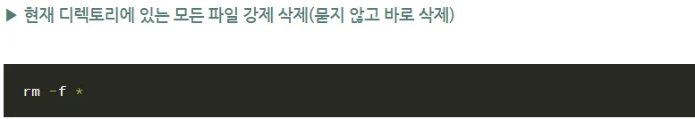

9
ROKEY BOOT CAMP
컴퓨터구조(Booting, CPU 작동원리, POST) – 복습
프로그램이란
프로그램의의미는어떤작업을하기위해해야할일들을순서대로나열한것으로쉽게말해컴퓨터에서어떤작업을위해실행할수있는'정적인상태'의
파일이라고볼수있다.
컴퓨터에서의'프로그램'은사용자가원하는일을처리할수있도록프로그래밍언어를사용하여올바른수행절차를표현해놓은명령어들의집합이다.
그에필요한데이터를묶어놓은파일로보조기억장치에저장되어있다.
프로세스(Process)란무엇인가
프로그램이실행되서돌아가고있는상태, 컴퓨터에서연속적으로실행되고있는'동적인상태'의컴퓨터프로그램이다
[특징]
▪프로세스는각각Code, Data, Stack, Heap의구조로되어있는독립된메모리영역을할당받는다.
▪다른프로세스의자원에접근하려면프로세스간의통신(IPC)을사용해야한다.
▪프로세스는최소하나이상의스레드를포함한다.
▪각프로세스는별도의주소공간에서실행되며, 서로독자적인메모리공간을갖기때문에서로메모리공간을
공유할수없다. 즉, 다른프로세스의변수나자료구조에접근할수없다.

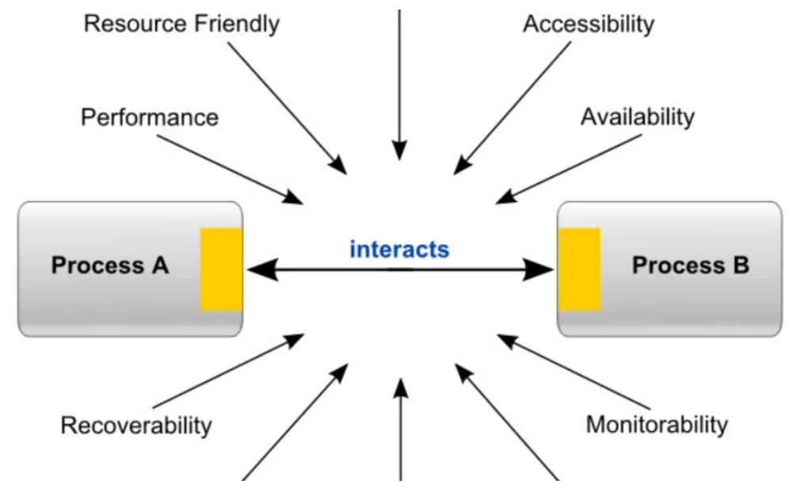

10
ROKEY BOOT CAMP
컴퓨터구조(Booting, CPU 작동원리, POST) - 복습
스레드(Thread)란무엇인가
▪스레드(Thread)는프로세스가할당받은자원을이용하는실행단위이자, 프로세스의특정한수행경로이자프로세스내에서실행되는여러흐름의단위이다.
▪스레드는프로세스내에서프로세스의자원을이용해서실제로작업을수행하는일꾼이다.
▪스레드가소속된프로세스가운영체제로부터자원을할당받으면그자원을스레드가사용한다.
▪프로세스는최소한개이상의스레드를가지며이스레드를메인스레드(main thread)라고한다.
[스레드의특징]
▪각스레드는독자적인스택(Stack) 메모리를갖는다.
▪스레드는프로세스내에서각각스택만할당받고Code, Data, Heap 영역은공유한다.
▪스레드는한프로세스내에서동작되는여러실행의흐름으로, 프로세스내의주소공간이나자원들을같은프로세스내의스레드끼리공유하며실행된다.
▪각각의스레드는별도의레지스터와스택을갖고있지만, 힙메모리는서로읽고쓸수있다.
▪한스레드가프로세스자원을변경하면, 다른이웃스레드(sibling thread)도그변경결과를즉시볼수있다.
▪스레드는메모리를공유하기때문에동기화, 데드락등의문제가발생할수있다.
▪스레드는대부분의현대운영체제가지원하고있으며, 이와관련된주요라이브러리로는POSIX Pthreads, Windows threads, Java threads 가있다.
프로세스(Process)와스레드(Thread)
▪프로세스와스레드의관계: 프로세스는스레드의컨테이너이다. 스레드의정보를담고있는것에불과하다.
▪프로세스와스레드의차이점: 프로세스는각작업(Task)마다운영체제로부터자원을할당받기위해시스템콜을하는부담이생기지만멀티스레드를
사용한다면시스템콜을한번만해도되기때문에효율적이다.
▪또한IPC 방식보다는스레드간통신이덜복잡하고시스템자원사용이더적으므로통신의부담도줄일수있다.

11
ROKEY BOOT CAMP
컴퓨터구조(Booting, CPU 작동원리, POST) - 복습
멀티프로세스와멀티스레드
멀티스레딩이란
▪하나의응용프로그램을여러개의스레드로구성하고각스레드로하여금하나의작업을처리하도록하는것이다.
▪윈도우, 리눅스등많은운영체제들이멀티프로세싱을지원하고있지만멀티스레딩을기본으로하고있다.
▪웹서버는대표적인멀티스레드응용프로그램이다.
멀티스레딩의장점
▪시스템자원소모감소(자원의효율성증대)
▪프로세스를생성하여자원을할당하는시스템콜이줄어들어자원을효율적으로관리할수있다.
▪시스템처리량증가(처리비용감소)
▪스레드간데이터를주고받는것이간단해지고시스템자원소모가줄어들게된다.
▪스레드사이의작업량이작아Context Switching이빠르다.
▪간단한통신방법으로인한프로그램응답시간단축
▪스레드는프로세스내의Stack 영역을제외한모든메모리를공유하기때문에통신의부담이적다.
멀티스레딩의단점
▪주의깊은설계가필요하다.
▪디버깅이까다롭다.
▪단일프로세스시스템의경우효과를기대하기어렵다.
▪다른프로세스에서스레드를제어할수없다. (즉, 프로세스밖에서스레드각각을제어할수없다.)
▪멀티스레드의경우자원공유의문제가발생한다. (동기화문제)
▪하나의스레드에문제가발생하면전체프로세스가영향을받는다.
*멀티프로세스대신멀티스레드를사용하는이유는?
프로그램을여러개키는것보다하나의프로그램안에서여러
작업을해결하는것이더효율적이기때문이다.

12
ROKEY BOOT CAMP
API, Library, Framework, Process와Thread
API이란
api란Application programming Interface, 응용프로그램에서운영체제나프로그래밍언어가제공하는기능을제어할
수있게만든인터페이스이다.
아래와같이정해진정보를클라이언트가전해주면클라이언트가원하는기능을접근할프로그램에서가져올수있다, 
이런클라이언트와프로그램사이의다리역할을하는것을api라한다
API의특징
▪구현과독립적으로사양만정의되어있다
▪API에따라접근권한이필요할수있다
▪*말그래도인터페이스이기에안에는무엇이들어있는지알수없다

13
ROKEY BOOT CAMP
API, Library, Framework, Process와Thread
Library이란
응용프로그램개발을위해필요한기능(함수)를모아놓은소프트웨어이다. 구성데이터, 문서, 도움말자료, 메시지틀, 미리
작성된코드, 서브루틴(함수), 클래스, 값, 자료형등이포함될수있습니다.
Library의특징
▪
독립성을가진다-> 해당라이브러리는다른라이브러리를의지하지않는다
▪
응용프로그램이능동적으로라이브러리를사용한다-> 응용프로그램이필요할때라이브러리를호출한다
▪
프로그래머가어떠한기능을수행하기위해도움을주는또는필요한것을제공해주는역할을하는것. 
▪
라이브러리는재사용이필요한기능으로반복적인코드작성을없애기위해언제든지필요한곳에서호출하여
사용할수있도록Class나Function으로만들어진다.
▪
프로그램을만들때기존에만들어진함수들을재활용함으로써, 프로그램의제작시간과노력을줄일수있다. 그리고
필요한함수만호출하여사용할수있다.
▪
독립성을가지고, 응용프로그램이능동적으로라이브러리를사용한다. 
데이터시각화라이브러리
(Matplotlib 기반)
컴퓨터비전라이브러리
(이미지처리, 객체인식)
데이터시각화라이브러리
(Matplotlib 기반)
수학연산라이브러리
(행렬, 벡터연산)
데이터분석라이브러리
(NumPy 기반)

14
ROKEY BOOT CAMP
API, Library, Framework, Process와Thread
Framework
▪
응용프로그램이나소프트웨어의솔루션개발을수월하게하기위해제공된소프트웨어환경.
▪
특정인프라나환경에서동작할수있도록기반시설을담당해주는것이프레임워크의역할이다.
Framework의특징
▪
응용프로그램이수동적으로프레임워크에의해사용된다.
▪
뼈대나기반구조라는뜻. 응용프로그램이나소프트웨어구현을수월하게하기위해제공된소프트웨어환경이다.
▪
프레임워크만으로실행되지않고, 기능을추가해야하며, 프레임워크에의존하여개발해야하고, 프레임워크가정의한규칙을
준수해야한다.
▪
프로그래밍을진행할때필수적인코드, 알고리즘등과같이어느정도구조를제공해주기때문에프레임워크를사용하는
프로그래머는이프레임워크뼈대위에서코드를작성하여프로그램을개발한다.
▪
프레임워크는완성된제품이아닌완성된제품을만들기위해개발자를도와주는또는기반이되는역할을한다. 즉, 소프트웨어의
특정문제를해결하기위해상호협력하는클래스와인터페이스의집합
▪Google이개발한딥러닝프레임워크
▪GPU 가속및확장성이뛰어남
▪Facebook이개발한딥러닝프레임워크
▪직관적인코드와동적연산그래프지원
▪2D/3D 게임개발에널리사용됨
▪다양한플랫폼(Android, iOS, PC 등) 지원

15
ROKEY BOOT CAMP
API, Library, Framework, Process와Thread
Framework vs. Library
가장큰차이점은이것없이도앱이동작할수있는지여부이다. →응용프로그램의흐름주도권을누가가지고있는가?
라이브러리: 개발자가코드를컨트롤합니다. 즉, 개발자가라이브러리를호출합니다.
프레임워크: 개발자가프레임워크의규칙을따라코딩을합니다. 즉프레임워크가개발자를호출합니다.
라이브러리는어떤부분에서사용되기때문에호출하는측에주도성이있다.
API와Library 차이점
• API: 컴포넌트를사용하는규약및호출을위한수단으로써구현로직이필요없음.
• 라이브러리: 컴포넌트자체로써, 구현로직이존재

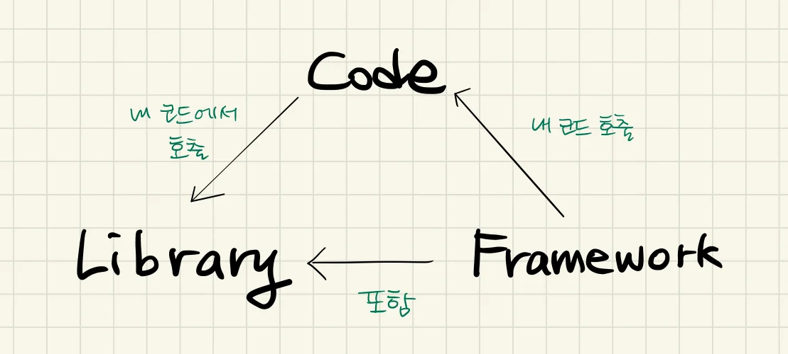

16
ROKEY BOOT CAMP
API, Library, Framework, Process와Thread
HTTP와HTTPS란?
HTTP(Hypertext Transfer Protocol)는클라이언트와서버간통신을위한통신규칙세트또는
프로토콜입니다.
사용자가웹사이트를방문하면사용자브라우저가웹서버에HTTP 요청을전송하고웹서버는
HTTP 응답으로응답합니다. 웹서버와사용자브라우저는데이터를일반텍스트로교환합니다. 
간단히말해HTTP 프로토콜은네트워크통신을작동하게하는기본기술입니다. 이름에서알수
있듯이HTTPS(Hypertext Transfer Protocol Secure)는HTTP의확장버전또는더안전한
버전입니다. HTTPS에서는브라우저와서버가데이터를전송하기전에안전하고암호화된연결을
설정합니다.
플라스크(Flask)는웹프레임워크
웹프레임워크를실질적인웹서비스로제공했을시웹접속자의접속및통신이어떻게
이루어지는가를생각해보고이러한통신에대한지식을바탕으로ROS를이해한다

17
ROKEY BOOT CAMP
인터프리터, 컴파일러(소스코드→ Build → 실행파일)
소스코드란?
소스코드는컴퓨터소프트웨어(프로그램)의제작에사용되는설계도이다. 개념만나타낸추상적인설계도가아니라(그런건순서도라고
한다), 당장컴퓨터에입력만하면진짜로프로그램을완성할수있는매우세밀하고구체적으로짜인설계도이다. 이름인소스코드중
“소스”(source, 근원)가이를의미하는것으로, 프로그램의'근원'이란뜻이다.
이전에파이썬, AI 시간에작성한소스코드

18
ROKEY BOOT CAMP
인터프리터, 컴파일러(소스코드→ Build → 실행파일)
Build 란?
▪컴퓨터는근본적으로는0과1밖에모릅니다. 우리가작성하는코드들은거의대부분고급언어를사용하기때문에결국에는컴퓨터(CPU)가
이해할수있도록번역이필요
▪컴퓨터가이해하는언어를기계어라고하는데, 우리가만든소스코드가컴퓨터입장에서는해외판책이되는것이고, 이책을
기계어(machine code)로번역하여컴퓨터에서이해할수있는, 즉실행가능한파일로만드는과정을빌드(Build) 라고한다.
고급언어: Python, Java 등대부분의프로그래밍언어 
저급언어: 어셈블리어, 기계어, C/C++(관점에따라저급언어로보거나고급언어로봄)

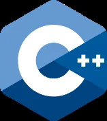

19
ROKEY BOOT CAMP
인터프리터, 컴파일러(소스코드→ Build → 실행파일)

20
ROKEY BOOT CAMP
인터프리터, 컴파일러(소스코드→ Build → 실행파일)
▪
인터프리터
소스코드를빌드해서번역물(실행파일등)을만드는것과다르게한줄씩해석해서실행
(Python, JavaScript)
▪
컴파일러
컴파일러는전체소스코드를한번에기계어코드로번역한후, 실행가능한파일을생성합니다.
이과정에서모든코드가기계어로번역되므로, 실행전에한번의컴파일이필요합니다.
(C, C++, Java)
질문1 : 코딩이란무엇인가?
질문2 : 파이썬의인터프린터언어로서가진특징은무엇인가?
질문3 : 인터프린터언어로서머신러닝/딥러닝에서가진장점은무엇인가?
둘다기계어로번역하는도구

21
ROKEY BOOT CAMP
XML이란
XML이란
Extensible Markup Language(XML)를사용하면공유가능한방식으로데이터를정의하고저장할수있습니다.
XML은웹사이트, 데이터베이스및타사애플리케이션과같은컴퓨터시스템간의정보교환을지원합니다.
사전정의된규칙을사용하면수신자가이러한규칙을사용하여데이터를효율적으로정확하게읽을수있으므로모든네트워크에서데이터를
XML 파일로손쉽게전송할수있습니다.
+유연한애플리케이션설계
XML을사용하면애플리케이션디자인을편리하게업그레이드하거나수정할수있습니다. 많은기술, 특히최신기술에는기본제공XML 지원이
함께제공됩니다. XML 데이터파일을자동으로읽고처리할수있으므로전체데이터베이스를다시포맷하지않고도변경할수있습니다.
XML이중요한이유는무엇인가요?
XML(Extensible Markup Language)은데이터를정의하는규칙을제공하는마크업
언어입니다. 다른프로그래밍언어와달리XML은자체적으로컴퓨팅작업을수행할
수없습니다. 대신구조적데이터관리를위해모든프로그래밍언어또는
소프트웨어를구현할수있습니다. 
-> ROS에서XML의역할
ROS의패키지빌드및의존성관리를해준다. 
*후에ROS에서XML 사용시해당내용참고, Colab의markdown과비교

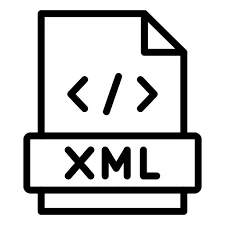

22
ROKEY BOOT CAMP
Web동작방식
HTTP 프로토콜작동
HTTP는OSI(Open Systems Interconnection) 네트워크통신모델의애플리케이션계층프로토콜입니다. 
HTTP는여러유형의요청과응답을정의합니다. 예를들어, 웹사이트의일부데이터를보려는경우HTTP 
GET 요청을전송합니다. 연락처양식작성과같은일부정보를전송하려는경우HTTP PUT 요청을
전송합니다.
마찬가지로, 서버는숫자코드및데이터양식으로다양한유형의HTTP 응답을전송합니다.
다음은몇가지예입니다.
200 - OK(정상) / 400 - Bad request(잘못된요청) / 404 - Resource not found(리소스를찾을수없음)
1,2 사용자가웹브라우저에웹페이지의URL 주소를입력한다.
3. 웹브라우저는URL 주소중에서도메인네임(domain name) 부분을DNS 서버에서검색한다.
4. DNS 서버에서해당도메인네임에해당하는IP 주소를찾고사용자가입력한URL 정보와함께전달한다.
5. IP 주소와URL 정보는HTTP 프로토콜을사용하여HTTP 요청메시지(HTTP Request)를생성한다.
6. 이렇게생성된HTTP 요청메시지는TCP 프로토콜을사용하여인터넷을거쳐해당IP 주소의컴퓨터로전송된다.
7. 도착한HTTP 요청메시지는HTTP 프로토콜을사용하여웹페이지URL 정보로변환된다.
8. 웹서버는도착한웹페이지URL 정보에해당하는데이터를검색한다.
9. 검색된웹페이지데이터는또다시HTTP 프로토콜을사용하여HTTP 응답메시지(HTTP Response)를생성한다.
10. 이렇게생성된HTTP 응답메시지는TCP 프로토콜을사용하여인터넷을거쳐원래컴퓨터로전송된다.
11. 도착한HTTP 응답메시지는HTTP 프로토콜을사용하여웹페이지데이터로변환된다.
12. 웹브라우저는변환된웹페이지데이터를출력한다.

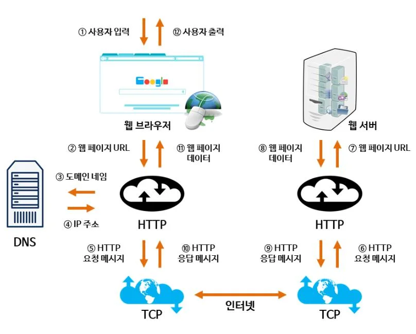

23
ROKEY BOOT CAMP
네트워크와통신(IPV4, IPV6, 소켓, 노드, Hub, TCP, UDP)
윈도우네트워크환경설정에서볼수있는화면
ROS에서통신의의의
ROS는각노드간에service, topic, action 같은통신인터페이스를제공한다.
통신에대한이해도가바탕이되어야ROS의구조, 원리, 의의를이해할수있다.
(각인터페이스의역할에대해선ROS 강의에서후술예정)

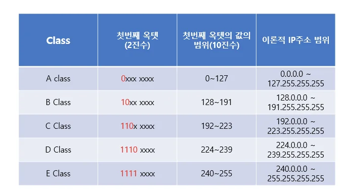

24
ROKEY BOOT CAMP
네트워크와통신(IPV4, IPV6, 소켓, 노드, Hub, TCP, UDP)
인터넷프로토콜(IP)이란?
인터넷프로토콜(IP)은데이터패킷이네트워크를통해이동하고올바른대상에도착할수있도록데이터패킷을라우팅하고주소를지정하기위한프로토콜또는
규칙의집합입니다. 인터넷을통과하는데이터는패킷이라고하는더작은조각으로나뉩니다. IP 정보는각패킷에첨부되며, 이정보는라우터가패킷을올바른위치로
보내는데도움이됩니다. 인터넷에연결하는모든장치나도메인에는IP 주소가할당되며, 패킷이연결된IP 주소로전달되면데이터가필요한곳에도착합니다.
IPv4와IPv6의차이점?
IPv4와IPv6는인터넷프로토콜(IP) 주소지정시스템의두가지버전입니다. IP는인터넷을통한데이터교환을제공하는일련의통신규칙입니다. 인터넷의핵심은
네트워킹기술을통해서로데이터를공유하는수십억개디바이스의집합체입니다. IP는넘버링시스템을사용하여연결된모든디바이스에고유한식별번호또는
주소를부여합니다. IPv4는32비트주소형식을사용하며40억개이상의주소공간을수용할수있습니다. 인터넷및사물인터넷(IoT) 시스템의확장으로인해IPv4의
주소지정범위가충분하지않은것으로입증되었습니다. 128비트주소형식을사용하고1x1036개이상의주소를수용할수있는IPv6로단계적으로대체되고
있습니다.
윈도우에서해당옵션의속성설정일반적으로
네트워크를연결할때자동으로IP를할당하여사용한다. 
그러나ROS에서네트워크구축과정에서고유IP연결이
필요해해당옵션을조정할필요가있다(물론우분투에서
조정한다)

25
ROKEY BOOT CAMP
네트워크와통신(IPV4, IPV6, 소켓, 노드, Hub, TCP, UDP)
노드(Node)
재분배지점또는통신종단점이다. 즉, 네트워크의기본요소인지역네트워크에연결된컴퓨터와그안에속한장비들을통틀어하나의노드라고한다.
*ROS에서도노드라는단위를사용하는데이둘은엄연히다른개념이므로헷갈리지않도록주의한다.
소켓(Socket)
컴퓨터간의데이터전송을위한인터페이스
허브(Hub)
컴퓨터와컴퓨터사이, 즉네트워크장비와장비를연결해주는기능을수행하는장비
모뎀(MOdulator and DEModulator)
신호를변조하여송신하고수신측에서원래의신호로복구하기위해복조하는장치
TCP
응용프로그램이데이터를교환할수있는네트워크대화를설정하고유지하는방법을정의하는표준
UDP
IP를사용하는네트워크내에서컴퓨터간에메세지들이교환될때제한된서비스만을제공하는통신
프로토콜. TCP의대안으로쓰임

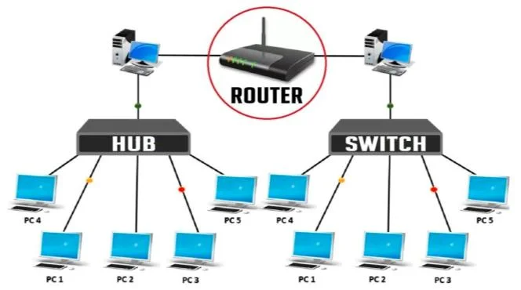

26
ROKEY BOOT CAMP
네트워크와통신(IPV4, IPV6, 소켓, 노드, Hub, TCP, UDP)
TCP (Transmission Control Protocol)
UDP (User Datagram Protocol)
신뢰성
높음
낮음
속도
낮음
높음
전송방법
패킷이순서대로전달
패킷이스트레이트로전달
오류감지및수정
있음
없음
혼잡도제어
있음
없음
전송인정
있음
오직체크썸만
연결방식
연결지향적
비연결성
사용예시
웹(http, https), 이메일전송(SMTP), 파일전송)FTP)
실시간비디오 스트리밍, 온라인게임, 음성통화(VoIP)

27
ROKEY BOOT CAMP
소켓프로그래밍실습
소켓
컴퓨터간의데이터전송을위한인터페이스
네트워크소켓통신실습
추후ROS에서통신으로topic 같은통신을테스트는하는내용이있음
해당실습은ROS가아닌파이썬으로소켓통신프로그래밍을실습하고,
이실습과유사한내용이ROS에서다시배우게되기때문에이해를하고넘어가자
에코서버
클라이언트가전송하는데이터를그대로되돌려전송해주는기능의서버. 즉, 
클라이언트가보낸데이터를수신해서동일한데이터를다시클라이언트에게송신한다
에코클라이언트(Echo Client)
클라이언트가전송하는데이터를그대로되돌려전송해주는기능의서버. 즉, 
클라이언트가보낸데이터를수신해서동일한데이터를다시클라이언트에게송신한다

28
ROKEY BOOT CAMP
네트워크, 통신과프로그래밍
소켓의 통신과정
실제코드

29
ROKEY BOOT CAMP
네트워크, 통신과프로그래밍
socketServer.py

30
ROKEY BOOT CAMP
네트워크, 통신과프로그래밍
socketClient.py

31
ROKEY BOOT CAMP
네트워크, 통신과프로그래밍
fileSend.py

32
ROKEY BOOT CAMP
네트워크, 통신과프로그래밍
fileReceive.py

33
ROKEY BOOT CAMP
Socket Programming
※ Python으로다른프로그램실행

34
ROKEY BOOT CAMP
Socket Programming
__name__ 
▪
파이썬에서아주중요한개념이고자주사용되는내장변수
▪
파이썬인터프리터가자동으로설정해주는특별한변수
▪
파이썬이실행될때마다파이썬은이변수에값을넣어줌
▪
파이썬파일이직접실행되면__name__에는“__main__” 값이입력됨
▪
다른파일에서import되면“모듈(파일)이름“ 이입력됨
▪
모듈화를하고, 테스트코드와기능코드를분리함
▪
프로그램의진입점(Entry Point)

35
ROKEY BOOT CAMP
Socket Programming
argsExample1.py

36
ROKEY BOOT CAMP
Socket Programming
argsExample2.py

37
ROKEY BOOT CAMP
Socket Programming
argsExample3.py

38
ROKEY BOOT CAMP
Socket Programming
tcpServer.py

39
ROKEY BOOT CAMP
Socket Programming
tcpClient.py

40
ROKEY BOOT CAMP
Socket Programming
udpServer.py
UDP포트점유중인프로세스kill
UPD 포트 다시binding시에러
발생. 재사용하게해주는코드추가

41
ROKEY BOOT CAMP
Socket Programming
udpClient.py

42
ROKEY BOOT CAMP
Socket Programming
chattingServer.py

43
ROKEY BOOT CAMP
Socket Programming
chattingClient.py

44
ROKEY BOOT CAMP
Socket Programming
서버ip주소를argument로전달

45
ROKEY BOOT CAMP
Socket Programming
$ pip install pyinstaller

46
ROKEY BOOT CAMP
Socket Programming
※ Python 실행프로그램만들기

47
ROKEY BOOT CAMP
Socket Programming

48
ROKEY BOOT CAMP
Socket Programming

49
ROKEY BOOT CAMP
OSI7 Layer, 프로토콜(RS-232C, RS-485, Ethernet, TCP/UDP, IP)
네트워크통신의대표적인모델
OSI7 Layer, TCP/IP
OSI(Open Systems Interconnection) 모델은국제표준화기구(ISO)가정의한통신을위한프로토콜계층구조로, 네트워크통신을
7개의레이어구조로나눈이론적모델. 서로다른시스템간의통신을원활하게하기위한표준모델로, 각레이어가독립적으로
작동하며, 데이터전송과정에서다양한작업을수행
Data가목적지까지가는경로를결정하는역할
IP주소를사용해라우팅하는작업수행
물리계층에서데이터를수신한후오류검출과제어를담당 
MAC 주소를사용해물리적인연결을관리
데이터를실제로전송하는하드웨어적인부분을담당. 전기신호나광신호를이용해
DATA를변환하여전송. 케이블, 스위치, 허브같은장비가여기속함

50
ROKEY BOOT CAMP
OSI7 Layer, 프로토콜(RS-232C, RS-485, Ethernet, TCP/UDP, IP)
IP Address, Routing
MAC Address

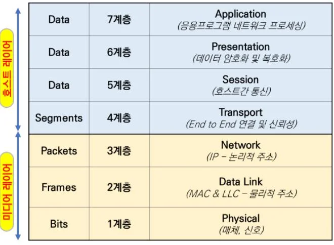

51
ROKEY BOOT CAMP
OSI7 Layer, 프로토콜(RS-232C, RS-485, Ethernet, TCP/UDP, IP)
RS-232C
▪직렬통신중하나과거에는주로모니터를연결할때쉽게볼수있었다.(최근에는HDMI 케이블이대부분의모니터를연결하는데쓰고있다.) 
▪1:1 통신이며1:N의통신은되지않는다. 
▪단방향통신이며노이즈에강하고간단한통신방식이기에 현재도산업용기기에서데이터교환하는방식으로쓰이고있다.
RS-232
RS-485
전송방식
단방향또는양방향
양방향
선의수
3선또는9선
2선또는4선
통신거리
최대15m
최대1,200m
속도
최대115200bps
최대10Mbps
인터페이스
단일장치1 : 1
여러장치최대32개
신뢰성
Noise에민감긴거리성능저하
Noise에강하고긴거리안정적
구성
단일송신기와수신기
멀티드롭, 여러장치
가격
상대적으로저렴
상대적으로비쌈

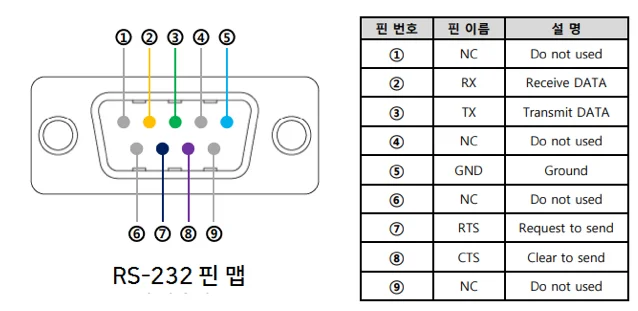

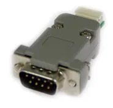

52
ROKEY BOOT CAMP
OSI7 Layer, 프로토콜(RS-232C, RS-485, Ethernet, TCP/UDP, IP)
UART는UART(Universal Asynchronous Receiver/Transmitter, 범용비동기송수신기)의약자이며
▪두장치사이에서직렬데이터를교환할때적용되는프로토콜(규칙세트)을정의합니다.
▪UART는매우간단하며양방향으로데이터를송신및수신하기위해송신기와수신기사이에두개의와이어만사용합니다.
▪와이어양끝단은접지연결이되어있습니다. UART를이용한통신은Simplex(단방향통신)(데이터가한방향으로만전송됨), Half-
duplex(반이중)(한번에한쪽만전송가능) 또는Full-duplex(전이중)(양쪽이동시에전송가능) 방식이있습니다.
▪UART에서데이터는프레임형태로전송됩니다.

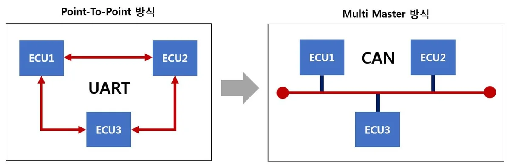

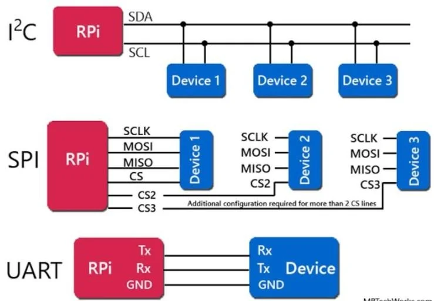

53
ROKEY BOOT CAMP
OSI7 Layer, 프로토콜(RS-232C, RS-485, Ethernet, TCP/UDP, IP)
RS-485
▪먼거리에서데이터를전송해야하는장치간의통신중하나인직렬통신의종류
▪하나의버스에최대32개의송신기와32개의수신기를연결할수있고 여러장치를연결하여네트워크를구성할수있다. 장거리통신가능
이후 실습시간에사용하는터틀봇도이러한방식으로조립되어있다.
조립된상태이므로직접연결할필요는없으나확인만해보자
RS-485 2wired
RS-485 4wired
배선수
2개(송신/수신공유)
4개(송신과수신분리)
통신방식
단방향(송신과수신번갈아)
양방향동시
데이터전송속도
상대적으로낮음
상대적으로빠름
배선및설치
간단하고저렴
배선이복잡설치번거로움
장점
간단한배선, 멀티드롭연결
양방향통신, 빠른응답
단점
단방향통신, 속도제한
배선복잡, 설치비용

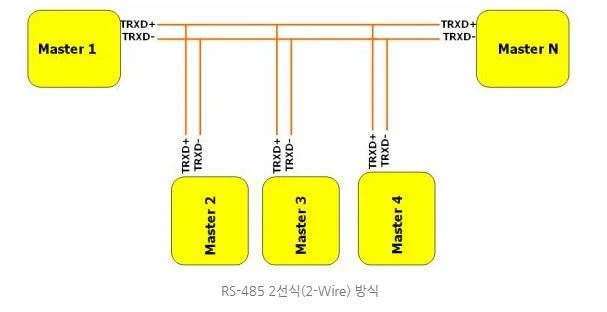

54
ROKEY BOOT CAMP
OSI7 Layer, 프로토콜(RS-232C, RS-485, Ethernet, TCP/UDP, IP)
RS-485
먼거리에서데이터를전송해야하는장치간의통신중하나인직렬통신의종류
실습에사용하는터틀봇
터틀봇의부품인OpenCR
OpenCR은로봇의센서, 모터, 엑츄에이터를
제어하기위해설계된마이크로컨트롤러보드
빨간색표시한부분이Txd, Rxd 이약자로표기되어있다

55
ROKEY BOOT CAMP
RS-485와센서
다양한센서들과액츄에이터들이RS-485 통신을지원한다.
(3차강의자료참고)
자세히보면RS-485 통신의Rxd, Txd 표시가있다.
보통핀3개가Rxd, Txd, Gnd(접지)로구성되어있다
+라즈베리파이보드나아두이노보드에는Rxd, Txd 커널이하나만있다. 이때
여러개의 센서를해당보드에연결할때병렬로연결해서해결할수있다.
*RS-485 통신특징
하나의버스에최대32개의송신기와32개의수신기를연결할수있다.

56
ROKEY BOOT CAMP
OSI7 Layer, 프로토콜(RS-232C, RS-485, Ethernet, TCP/UDP, IP)
Ethernet
이더넷은컴퓨터네트워크기술중하나로, CSMA/CD라는프로토콜을사용하는통신방식을채택한다.
일반적으로LAN, MAN, WAN에서가장많이활용되는기술규격이다
윈도우에서쉽게찾아볼수있는이더넷, 유선연결이더넷
두산협동로봇은이러한LAN 케이블로컴퓨터와협동로봇을연결할수있다

57
ROKEY BOOT CAMP
OSI7 Layer, 프로토콜(RS-232C, RS-485, Ethernet, TCP/UDP, IP)

58
ROKEY BOOT CAMP
OSI7 Layer, 프로토콜(RS-232C, RS-485, Ethernet, TCP/UDP, IP)

59
ROKEY BOOT CAMP
OSI7 Layer, 프로토콜(RS-232C, RS-485, Ethernet, TCP/UDP, IP)

60
ROKEY BOOT CAMP
+부록기타통신
블루투스통신이란디지털통신기기를위한개인근거리무선통신산업의표준이다.
짧은거리라데이터통신에제한이있다. 다중제어/ 중앙화를지향하는ROS와는어울리지않지만
블루투스로향후실무프로젝트에서쓰이는터틀봇과비슷하게사용하는제품이있다.
Long Range의약자로광범위한커버리지와적은대역폭, 긴배터리수명과
저전력등의특징을갖춘IoT 전용네트워크기술로저전력장거리통신기술이다.

ROKEY BOOT CAMP
수고하셨습니다.

