# ROS2 기초 3차시 - 센서와 ROS2 소개

로봇과 센서
센서(Sensor)란 무엇인가?
Sense는 인간의 감각 작용을 가리킨다. 센서는 측정 대상으로부터 정보를 검지 또는 측정하여 그 측정 량을 인식 가능한 유용한 신호로
변하는 장치, 물리, 화학 량 등 외계의 정보를 감지하여 신호 처리하기 쉬운 전기나 빛의 신호로 변화하는 기능을 가진 소자, 신호나
자극에 반응하고, 수신하는 장치, 모든 정보 및 에너지의 검출 장치 등으로 정의한다.
인간의 오감
센서
측정 대상
시각
광 센서, 이미지 센서
빛, 명암, 색, 패턴, 위치, 속도
청각
마이크, 초음파 센서
음성, 음계
후각
가스 센서, 연기 센서
냄새
미각
이온 센서, 바이오 센서
맛
촉각
자기 센서, 온도 센서, 압력 센서, 습도 센서
온도, 압력, 위치

신호 체계
PWM
PWM
PWM 신호를 통해 위 그림과 같이 우리가 작업하는 프로그램과 입력, 혹은 프로그램과 출력 사이에서 주고받을 수 있다.
마치 우리가 대화를 할 때 소리를 사용하는 것처럼 다만 우리가 의사소통을 할 때 공기 중의 소리를 쓸 수도 있고 메신저를
쓸 수 있는 것처럼 신호를 회로 간의 유선 연결 혹은 앞서 배운 무선 연결, 네트워크를 통해 쓸 수도 있다.
참고로 본 교육 과정에서 우리가 주로 다루는 것은 가운데 처리 부분이며, 처리 부분에서의 수행으로 양 끝단의 센서, 출력에
어떤 영향을 미치는지 이해하도록해 보자.
입력(Sensors)
출력(Actuator)
Processing
(H/W, S/W, F/W, M/W, OS, etc)

신호 체계
4mA
20mA
-100℃
+100℃
제품명: 온도 센서
[Specifications]

- 측정 범위: -100℃ ~ +100℃
- Analog 출력: 4~ 20mA 12mA 0℃

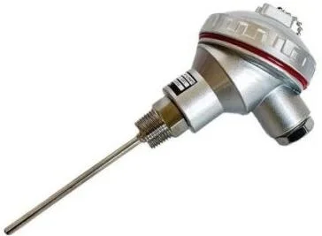

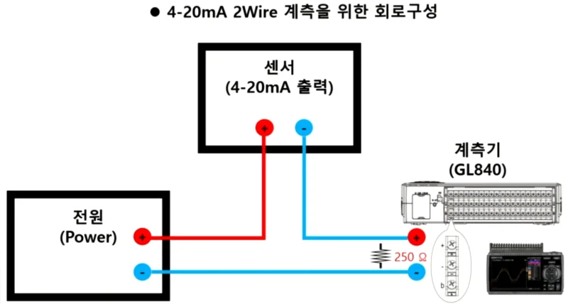

로봇과 센서
센서의 신호
인간의 감각이 뇌에 전달되고 행동에 명령을 내리듯이 센서의 신호 또한 회로를 통해 연결, CPU나 메모리에 연결되어 로봇에 명령을 내리게 된다.
PWM 신호
PWM은 디지털 신호 중 특정한 형태를 띈 신호를 일 컷는 용어이다. 이PWM은 회로 제어에 다양한 용도로 활용되고 있다. 가장 손쉽게PWM을 사용한
예는RGB LED의 색상 변경이 나서 보 모터의 방향 전환에서 목격할 수 있다. 양쪽의 예 모두 디지털 신호일지라도PWM을 사용하면 아날로그 신호와
유사한 효과를 낼 수 있다는 점에 기인한 방법이다. 이 방법은 일정한 주기의 디지털 신호의 출력이HIGH인 시간과LOW인 시간의 비율을 조정해서
아날로그 효과를 내는 방법이므로 디지털 신호만을 사용하는 마이크로 컨트롤러에서 아날로그 신호를 만들 필요가 있을 때 매우 유용하게 사용된다.
이런 형태의 펄스 신호가PWM이며, 펄스의 길이로 값을 측정하거나 혹은 제어 명령을 내릴 수 있다

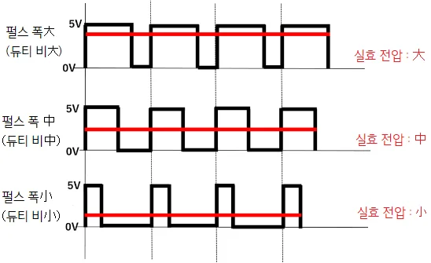

로봇과 센서
아두이노 출력
5V = ON
0V = OFF
5ms동안HIGH이고5ms동안LOW였으므로 전체 시간은10ms
10ms는0.01초이므로 주파수는1/0.01 = 100Hz
1sec = 1000ms
   0.1sec =   100ms
 0.01sec =     10ms
0.001sec =      1ms

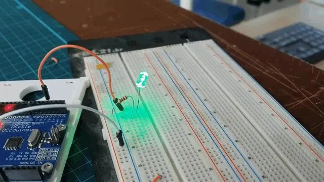

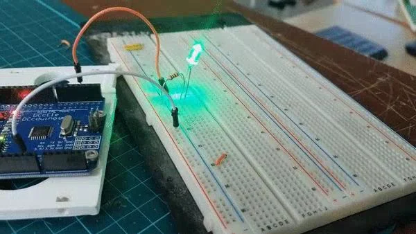

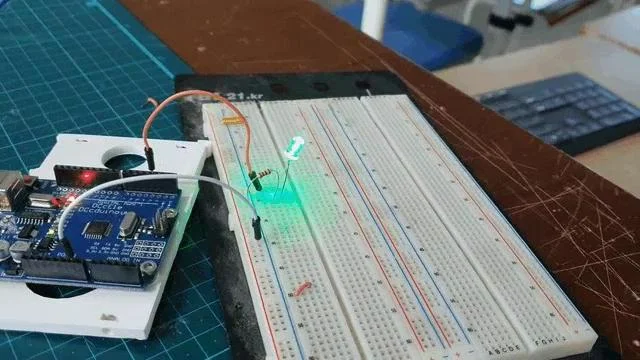

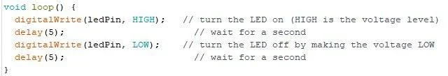

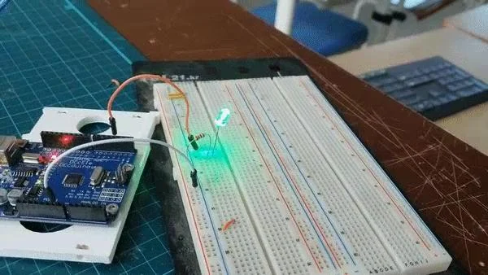

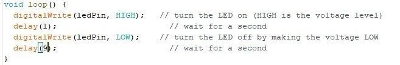

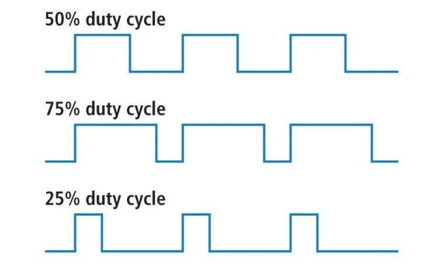

센서 종류
*센서가 너무 민감한 경우PWM 신호의 펄스가 너무 급격히 변해 오히려 측정에 어려움을 겪는 경우가 있다.
이때 방법 중 하나가 특정 구간(시간)의 평균값 혹은 급격한 펄스 변화를 노이즈라 판단하고 제외하는 방법이 있다.

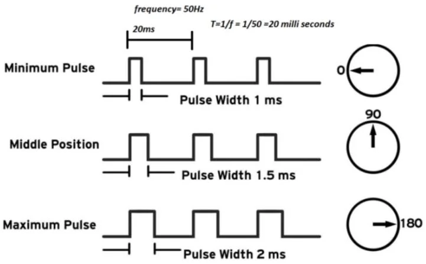

로봇과 센서
센서를 선택할 때 고려해야하는 것
로봇을 설계할 때 센서를 선택할 때 고려해야할 사항이다.

- 가격: 로봇 제품을 판매할 때 고려되는 사항
- 크기 및 무게: 센서의 응용 분야에 따라 고려되는 부분. 가령 작업 영역이 작다면 크고 무거운 센서를 쓸 필요는 없다.
- 출력 형태: 아날로그 또는 디지털로 출력된다. 아날로그 신호를 택할 경우 디지털로 변환하는 컨버터가 필요하다.
- 인터 페이 싱: 제어기나 마이크로프로세서 등과의 연결을 지원하는 인터페이스가 고려된다. 센서가 요구하는 인터페이스, API가 있을 수 있다.
- 분해능: 센서 측정 범위 내 최소 크기 단위. 즉 센서가 측정하는 최소 단위
- 감도: 센서의 민감 도. 보통 가격에 영향을 준다. 작업에 따라 민감한 감도를 요구하기도하지만 항시 우선되어 요구되는 부분은 아니다.
- 선형성: 일반적으로 입력과 출력 사이의 관계를 선형성으로 설계한다. 비선형성의 출력이라면 모델링, 보정 식을 추가하여 선형화한다.
- 범위: 최대 출력과 최소 출력의 범위를 뜻한다.
- 응답 시간: 입력 변화에 따른 출력의 응답 시간을 뜻한다. 감도와는 헷갈리기 쉽지만 엄연히 다른 개념이다.
- 신뢰성: 시스템이 온전히 운용된 시간을 시스템이 운용된 횟수로 나눈 비율로 신뢰성을 측정한다.
- 정확성: 센서의 출력이 목표치에 얼마나 접근되어 있는지
- 반복 정밀도: 반복된 횟수에서 출력된 값의 범위. 센서의 출력이 같은 입력에 대한 각각의 출력 값이 변화한 정도를 측정함으로써 결정됨

로봇과 센서

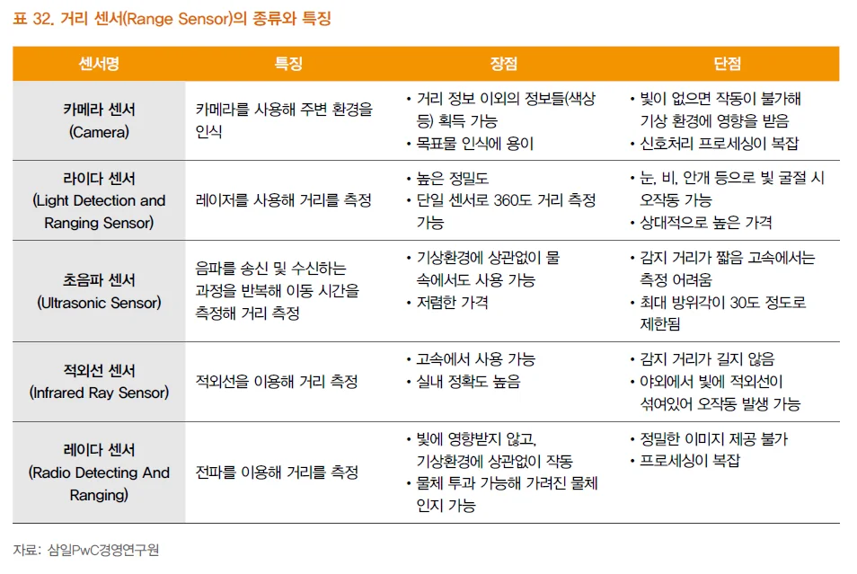

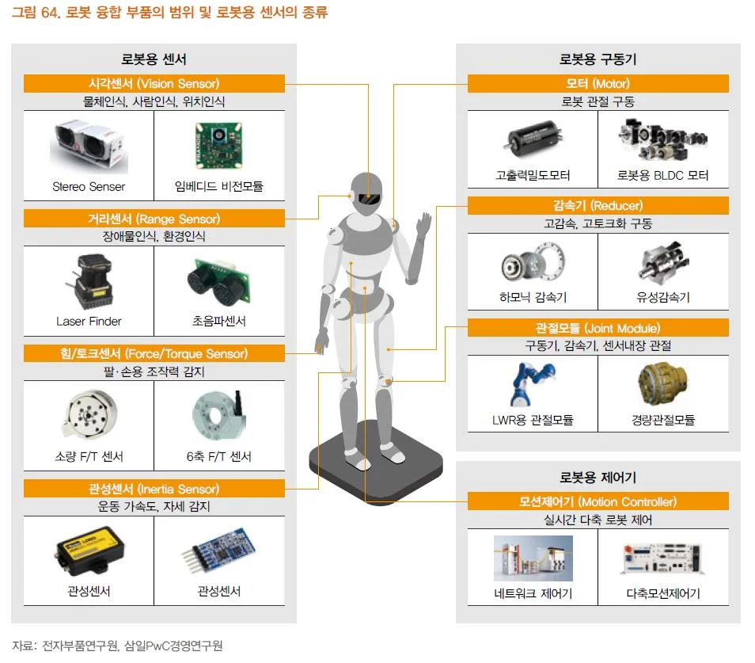

로봇과 센서

- 사람은 앞이 안 보이면 손을 더듬어 가며 길을 찾을 수 있지만
- 로봇은 각종 센서로부터 데이터를 수집→ 분석, 판단→ 행동(제어)
- 입력→ 처리→ 출력

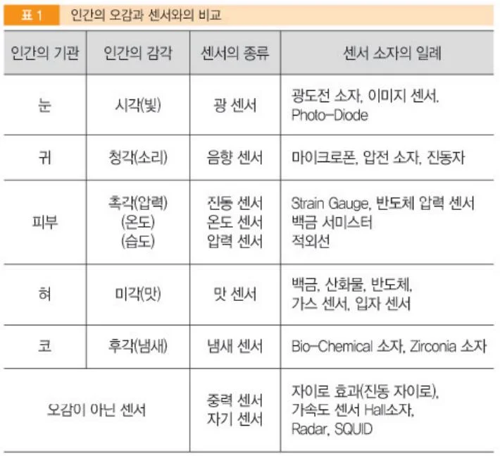

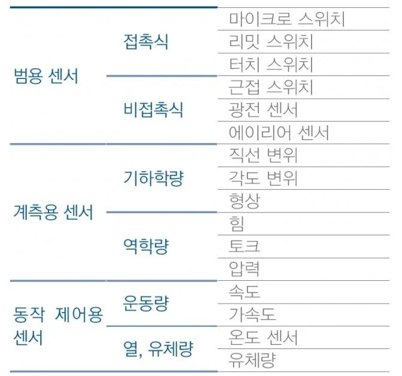

센서 종류

- 일상생활에서 우리 주변에는 어떤 센서들이 있는지 생각해 보자

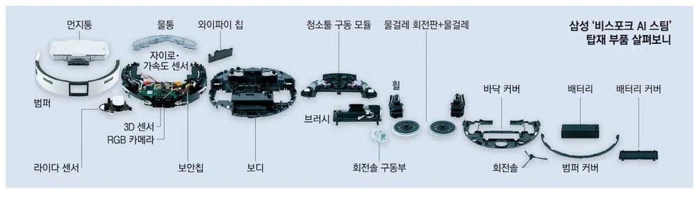

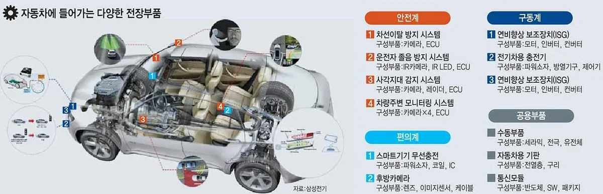

센서 종류
참고로 여기 있는 센서들 상당수(핀3개 있는 것들)가RS-485 통신을 쓴다.
자세히 보면RS-485 통신의Rxd, Txd 표시가 있다.
보통핀3개가Rxd, Txd, Gnd(접지)로 구성되어 있다.
라즈베리 파이 보드나 아두이노 보드에는Rxd, Txd 커널이 하나만 있다. 이때
여러 개의 센서를 해당 보드에 연결할 때 병렬로 연결해서 해결할 수 있다.
[RS-485 통신 특징]
하나의 버스에 최대32개의 송신기와32개의 수신기를 연결할 수 있다.

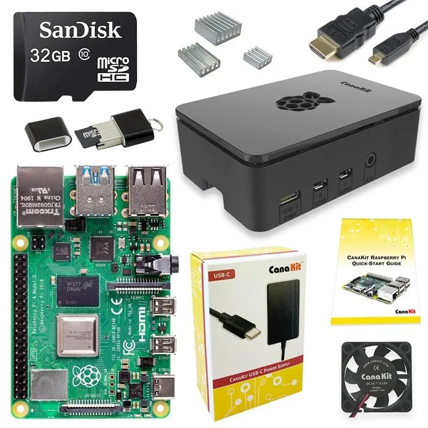

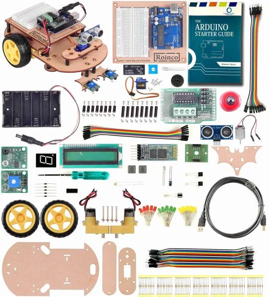

로봇과 센서, 액츄에이터
측정(Input)을 위해 사람에게는 감각이 있고 vs 로봇에게 센서(Snesor)가 있다면,
움직임(Output)을 위해서 사람에겐 근육 vs 로봇에겐액츄에이터(Actuator)가있다.
액츄에이터란 전기 신호를 받아 물리적인 움직임이나 변화를 만들어 내는 장치. 정보를 실행하는 역할을 한다 아래는 액 츄에 이 터의 예이다.
서 보 모터: 특정 각도로 회전한다
DC모터: 회전 운동을 한다
LED : 빛을 발산한다

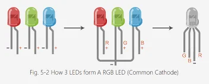

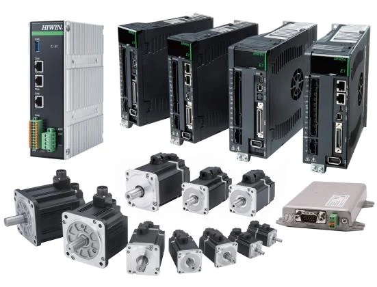

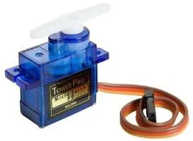

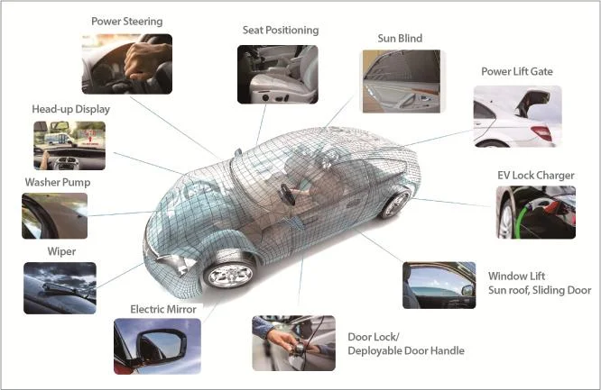

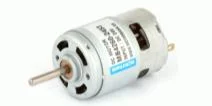

센서 종류
이중LCD의 경우 센서와 마찬가지로 회로를 보면RS-485 통신의Rxd, Txd가있다.
즉RS-485 통신으로 센서의 입력과 액 츄에 이 터의 출력을 모두 연결할 수도 있다.

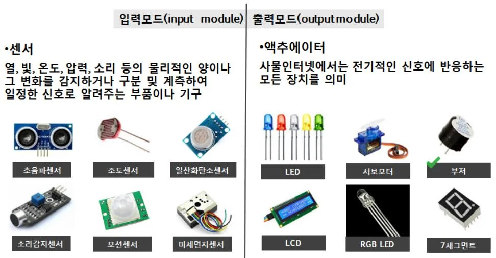

미들웨어(Middleware)와Firmware
Firmware
Middleware
위치

- 하드웨어와 가까운 저수준 소프트웨어
- ROM이나 플래시 메모리와 같은 비휘발성 메모리에 저장
- 소프트웨어와 소프트웨어
- 하드웨어와 소프트웨어 사이의 중간 계층 역할 하드웨어 제어 및 초기와 시스템 간의 데이터 통신과 상호 작용 관리 사용 예 마이크로컨트롤러, 임베디드 시스템 네트워크 통신, 데이터베이스 접근 여러 소프트웨어 모듈 간의 연결 변경 용이성 하드웨어에 내장되어 있어 수정이나 업데이트가 어려움 보통 업데이트가 가능하며, 시스템 간의 통신에만 영향을 미침 사용자와의 관계 사용자는 거의 직접적으로 펌 웨어를 다루지 않음 사용자 및 애플리케이션 미들 웨어를 통해 시스템을 다룸 특징 하드웨어와의 직접적인 상호 작용 여러 시스템 간의 통신을 처리하는 소프트웨어 예시
- 마이크로컨트롤러에서 실행되는 소프트웨어
- 라우터의 부팅 과정에서 작동하는 소프트웨어
- 프린터의 하드웨어 동작을 제어하는 소프트웨어
- 데이터베이스 미들 웨어
- 메시 징 미들 웨어
- ROS(다양한 하드웨어 및 소프트웨어 모듈 간의 통신을 중개)

미들웨어(Middleware)와Firmware
미들 웨어 정의
응용 소프트웨어가(application software) 운영 체제(operation system, OS)로부터 제공 받는 서비스 이외에, 추가적인 서비스를 제공하는
컴퓨터 소프트웨어라고 정의한다.
미들 웨어는 양쪽을 연결하여 데이터를 주고받을 수 있도록 중간에서 매개 역할을 하는 소프트웨어, 네트워크를 통해서 연결된 여러 개의
컴퓨터에 있는 많은 프로세스들에게 어떤 서비스를 사용할 수 있도록 연결해 주는 소프트웨어를 말한다.
데이터를 주고받을 수 있도록 중간에서 매개 역할을 하는 소프트웨어
우리가 공부하는ROS가 바로 미들 웨어에 속한다.

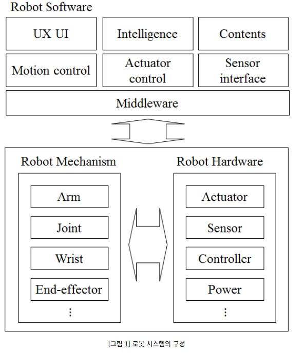

SBC
Single Board Computer (싱글 보드 컴퓨터)
SBC는 하나의 보드에CPU, 메모리, 저장 장치 등을 모두 포함한 작은 컴퓨터를 의미합니다.
대표적인 예로Raspberry Pi, Arduino, BeagleBone, NBDIA Jetson Nano 등이 있습니다.
주로IoT, 임베디드 시스템, 소규모 서버 용도로 활용됩니다.
즉 주로 소형 로봇에 탑재되는 소형 컴퓨터이다.
그러나 협동 로봇처럼 크기가 크거나 무거운 연산(프로세스 스레드)을 요구하는 로봇의 경우 해당SBC 대신 우리가
일반적으로 생각하는 컴퓨터 보드나CPU를 탑재하기도한다

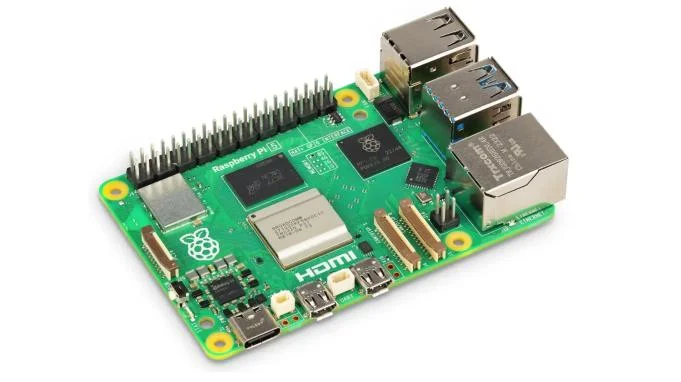

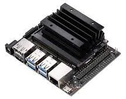

SBC
ROS의 통신을 로봇과의 통신이라고 하지만 엄밀히 말하면, SBC나 로봇에 탑재된 컴퓨터 통신하는 것이다.
즉 우리가 이전에 통신했던 네트워크, 소켓 통신이 컴퓨터(데스크탑 혹은 노트북)와 컴퓨터 (데스크탑 혹은 노트북)이 통신하는 것이라면
ROS는 컴퓨터(데스크탑 혹은 노트북)와 SBC 혹은 로봇에 탑재된 컴퓨터 간의 통신이다

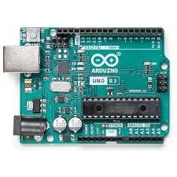

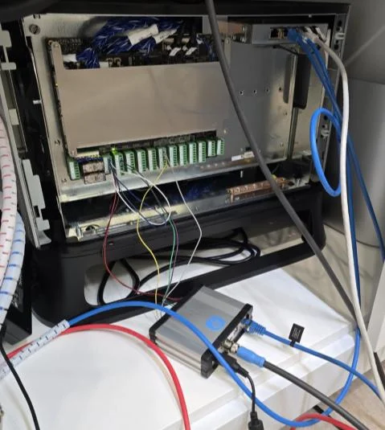

## SBC vs 제어기

터 틀 봇의 경우에는 SBC(라즈베리 파이)와 OpenCR이라는 보드가 탑재되어 있다.

### 제어기란?

특정 작업이나 장비를 제어하는 데 사용되는 장치로, 보통 임베디드 시스템에서 마이크로 컨트롤러(MCU)를 사용하며 간단한 작업을 수행하도록 설계된다.

- 예: 산업용 PLC(Programmable Logic Controller), 자동차 ECU(Electronic Control Unit), IoT 디바이스의 내장형 제어 시스템

제어기는 로봇의 두뇌 역할을 하는 장치로써 다양한 센서와 액추에이터를 연결할 수 있다. 로봇 개발자는 제어기에 다양한 프로그래밍 방법을 통해서 원하는 형태의 로봇을 제어할 수 있게 된다.

### SBC vs 제어기 비교

| 구분 | SBC | 제어기 |
|------|-----|--------|
| **용도** | 더 복잡하고 다양한 작업 수행 (예: 동영상 처리, 네트워크 서버 운영, 프로그래밍 학습) | 특정한 작업을 효율적으로 수행 (예: 온도 제어, 로봇팔 움직임 제어, 센서 데이터 수집 및 처리) |
| **범용성** | 일반적인 컴퓨터처럼 다목적 사용이 가능 | 실시간 작업과 빠른 반응이 중요한 경우에 적합 |
| **효율성** | 운영체제와 소프트웨어를 실행할 수 있어 복잡한 데이터 처리와 멀티태스킹에 적합 | 에너지 소모가 적고, 비용이 저렴하며, 단순한 시스템에 최적화 |
| **운영체제** | 보통 Linux, Windows IoT, Android와 같은 범용 운영체제를 실행할 수 있음. 복잡한 소프트웨어와 GUI 기반의 애플리케이션 실행 가능 | 대부분 운영체제가 없거나, RTOS(Real-Time Operating System)와 같은 경량 운영체제 사용. 작업이 운영체제에 의존하지 않고 펌웨어 수준에서 직접 작동 |
| **하드웨어** | CPU, GPU, RAM 등의 사양이 훨씬 높음. USB, HDMI, 이더넷 포트 등 다양한 연결 옵션 제공. 복잡한 연산과 데이터 처리가 가능하며 고해상도 디스플레이 출력도 지원 | CPU 성능과 메모리가 상대적으로 낮음. GPIO(General Purpose Input/Output)와 같은 간단한 하드웨어 인터페이스 제공. 저전력 및 소형화에 최적화 |
| **활용 분야** | 비디오 스트리밍, 머신러닝 응용 프로그램, 웹 서버, 로봇공학에서 활용. 교육용, 프로토타이핑, 개발자 커뮤니티에서 널리 사용 | 온도, 압력, 습도 등 센서 데이터를 기반으로 간단한 제어 작업 수행. 산업용 자동화, IoT 장치, 스마트 가전 등에서 주로 사용 |

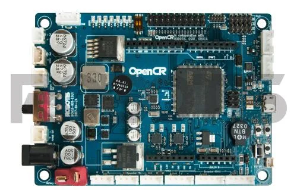

IoT(사물 인터넷)
IoT (Internet of Things)또는 사물 인터넷이라는 용어는 연결된 디바이스의 공통 네트워크를 의미하며, 디바이스와 클라우드 및 디바이스 간
통신을 용이하게하는 기술을 의미하기도합니다. 저렴한 컴퓨터 칩과 고대역폭 통신의 출현 덕분에 이제 수십억 개의 디바이스가 인터넷에
연결되어 있습니다. 이는 칫솔, 진공청소기, 자동차 및 기계와 같은 일상적인 디바이스가 센서를 사용하여 데이터를 수집하고 사용자에게
지능적으로 응답할 수 있음을 의미합니다.
IoT의 구성 요소

- 스마트 디바이스 컴퓨터 기능이 부여된 텔레비전, 보안 카메라 또는 운동 장비와 같은 디바이스입니다. 환경, 사용자 입력 또는 사용 패턴에서 데이터를 수집하고 인터넷을 통해IoT 애플리케이션과 데이터를 주고받습니다.
- IoT 애플리케이션 IoT 애플리케이션은 다양한IoT 디바이스에서 수신한 데이터를 통합하는 서비스 및 소프트웨어의 모음입니다. 머신 러닝/딥 러닝 기술을 사용하여 이 데이터를 분석하고 정보에 입각한 결정을 내립니다. 이러한 결정은IoT 디바이스로 다시 전달되고IoT 디바이스는 입력에 지능적으로 응답합니다.
- 그래픽 사용자 인터페이스 그래픽 사용자 인터페이스를 통해IoT 디바이스나 디바이 스플릿(Fleet)을 관리할 수 있습니다. 일반적인 예로 스마트 디바이스를 등록하고 제어하는 데 사용할 수 있는 모바일 애플리케이션 또는 웹 사이트가 있습니다.

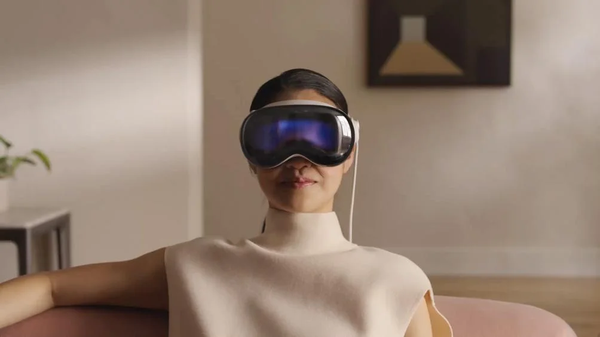

IoT(사물 인터넷)
IoT (Internet of Things)의예
스마트 팜
스마트홈(삼성smart thing 앱의 모니터, 에어컨 제어 화면)
스마트시티
그 외 스마트 공급망 관리, 스마트 헬스케어 시스템, 스마트 바코드 리더, 스마트 팩토리, 스마트 그리드 등

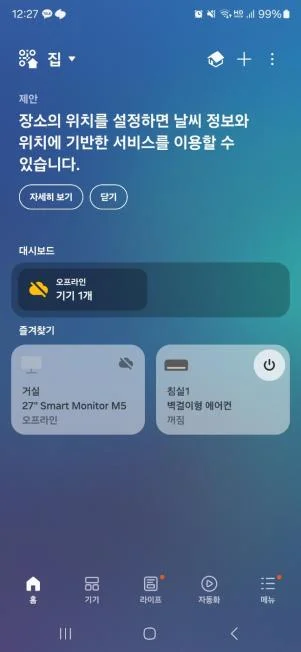

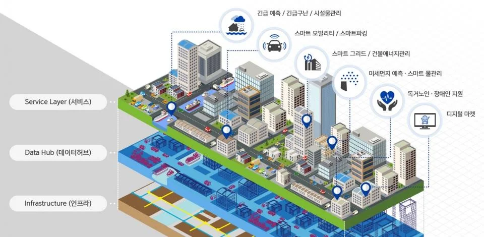

임베디드(Embedded)
내장형 시스템이라는 뜻으로 시스템'내부에 탑재된' 컴퓨터를 뜻한다.

- 시스템을 동작시키는 소프트웨어를 하드웨어에 내장하여 특수한 기능만을 수행하는 컴퓨터 시스템
- 즉, 디바이스를 직접적으로 제어하는 프로그램을 말한다.
- 디바이스를 제어하기 위해서 메모리 영역에서 리소스를 제어하는 것이 필요하여 강력한 메모리 조작 성능을 갖추고C/C++ 언어를 권장한다.
- 또한 임 베 디 드 개발에서 메모리 리소스 영역을 제대로 정리하지 못하고 침범하면 하드웨어의 심각한 오작동을 유발할 수 있기 때문이다. 때문에 컴파일 언어의 빌드 동작으로 메모리 리소스를 효율적으로 확보해야한다.
- 그리고 기기에 탑재되는 프로그램 리소스가 제한될 수 있어 최적화는 반드시 필요하다. 파이썬으로 임 베 디 드 개발이 가능한가?
- 일반적으로 파이썬으로 임 베 디 드 시스템을 개발하는 것은 부적절하다.
- 이유는 파이썬의 메모리 할당되어 메모리를 사용자가 직접적으로 통제하기 어렵기 때문이다.
- 파이썬에서는 가비지 컬렉션을 자체적으로 메모리를 관리해 주는 부분이 있어, 메모리 리소스 관리는 생소한 개념일 수 있다.
- 하지만 고급 개발자가 되기 위해 해당 개념을 숙지하도록한다 Garbage Collection(가비지 컬렉션)은 메모리 관리 기법 중 하나로, 더 이상 사용되지 않는 메모리(즉, 객체들)를 자동으로 해제하여 메모리 누수를 방지하고 시스템의 효율적인 메모리 사용을 돕습니다.

임베디드(Embedded)
임베디드는SBC 같은 로봇 내부의 컴퓨터에 탑재된다.
즉 우리가 그 동안 코딩했던 프로그램이 우리가 쓰는 데스크탑 혹은 노트북에서 돌아가는 것이라면 임 베 디 드는 로봇 안에 들어가는 프로그램이다.
로봇 안에서 각종 프로세스, 스레드를 처리하고 그러기 위해 메모리를 통제해서
로봇이 해당 임 베 디 드 프로그램에 의해 안정적으로 돌아가야하므로C/C++이 선호된다.

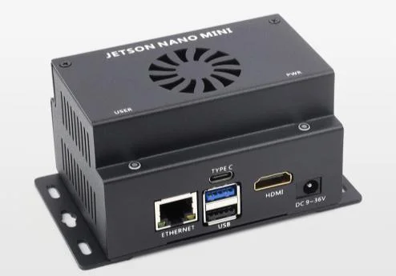

임베디드(Embedded)
임베디드 설계 시 고려해야할 사항을 고민해 보자.
임베디드에 어디까지 프로그램을 넣느냐?
지금까지AI 실습을 할 때 컴퓨터가 발열되거나 팬이 계속 작동되는 상황을 접한 적이 있다.
학습하는데Epoch 한 번에 상당한 시간을 소비하게 되어colab 프로까지 사용했던 경험을 떠올려 보자.
이때 우리는 컴퓨터의 리소스가 아닌 구글에서 제공해 주는 리소스를 사용했다.
ROKEY 친구들 중에서GPU가 있는 수강생은 빠르게 처리되어 크게 불편함이 없었을 것 같다.
이유는 컴퓨터 하드웨어의 사양이 좋다면colab 프로는 필요 없었을 것이다.
마찬가지로 아두이노, 라즈베리 파이는 작은 보드에 무거운 임 베 디 드를 돌린다면 어떻게 될까?
많은 리소스를 필요하게 되어 오히려 기기의 성능을 저하시킬 수 있다.
하지만 임 베 디 드에 최소한의 기기 작동에 대한 프로그램만 넣고AI에 의한 연산은 중앙에서 제어하는 컴퓨터에서 실행한 후
컴퓨터에서 임 베 디 드에 명령을 내린다면 우리가 그 동안 컴퓨터에GPU가없어colab 프로를 썼던 것처럼
SBC의리 소스가 아닌 중앙 제어의 리소스를 사용해 기기의 리소스를 절약하게 된다.
물론 기기에 탑재하는SBC나 컴퓨터를 고성능으로 넣어 중앙에서 제어하는PC에 의존하지 않는 것이 더 좋은 경우도 있다.
가령 통신이 원활하지 않는 상황에 자주 노출되는 디바이스라면 그런 고성능 리소스를 탑재하는 것이 좋다.
하지만 기기에 고성능 리소스를 탑재한다는 것은 곧 가격의 상승을 의미하게 되니 상황과 여건을 고려하여 기기의 사양이 정해지면
임베디드의 역할을 어디까지 정할지 고민하는 게 좋겠다.
이는 임 베 디 드 개발자뿐만 아니라 임 베 디 드와 통신하는 프로그램을 만드는 개발자도 마찬가지이다.

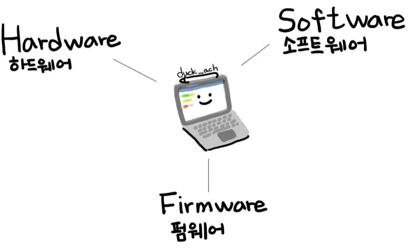

로봇의 센서 활용 구성

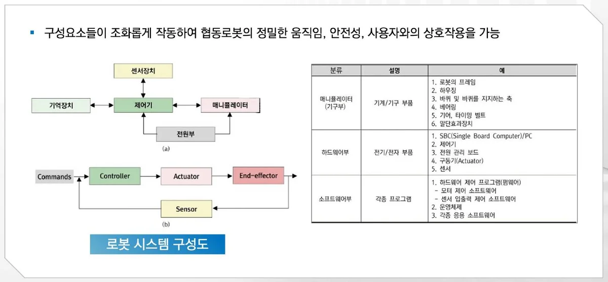

로봇의 구성

로봇의 구성

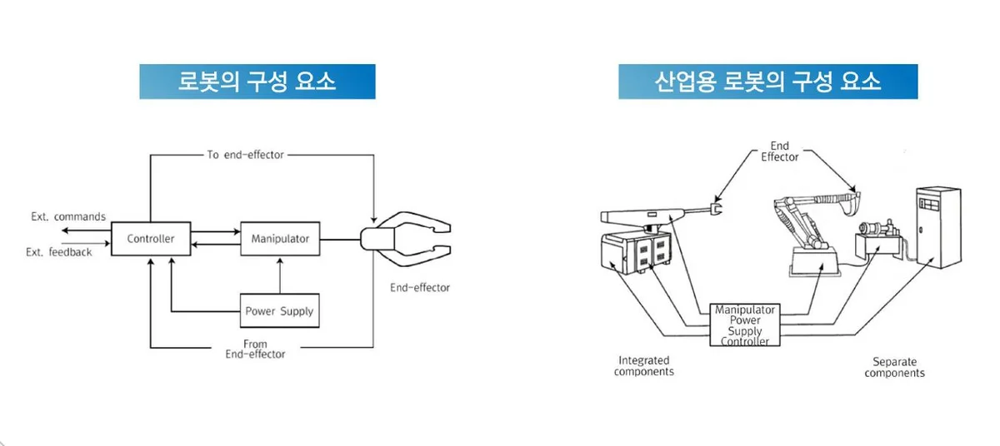

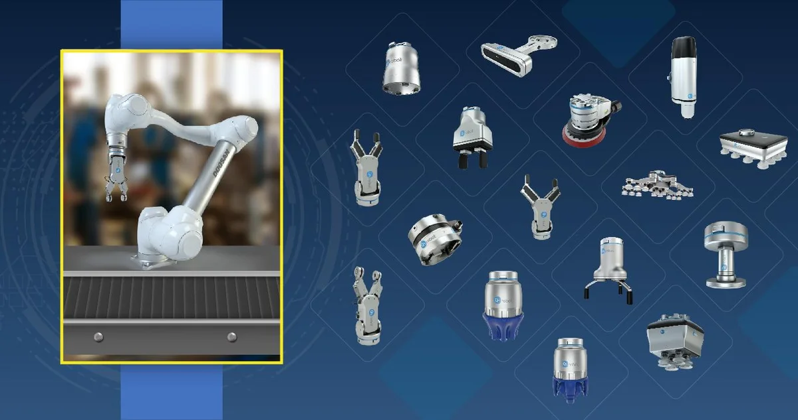

로봇의 구성

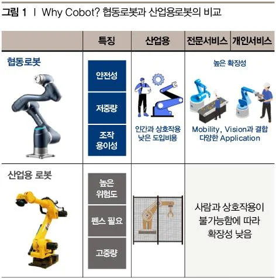

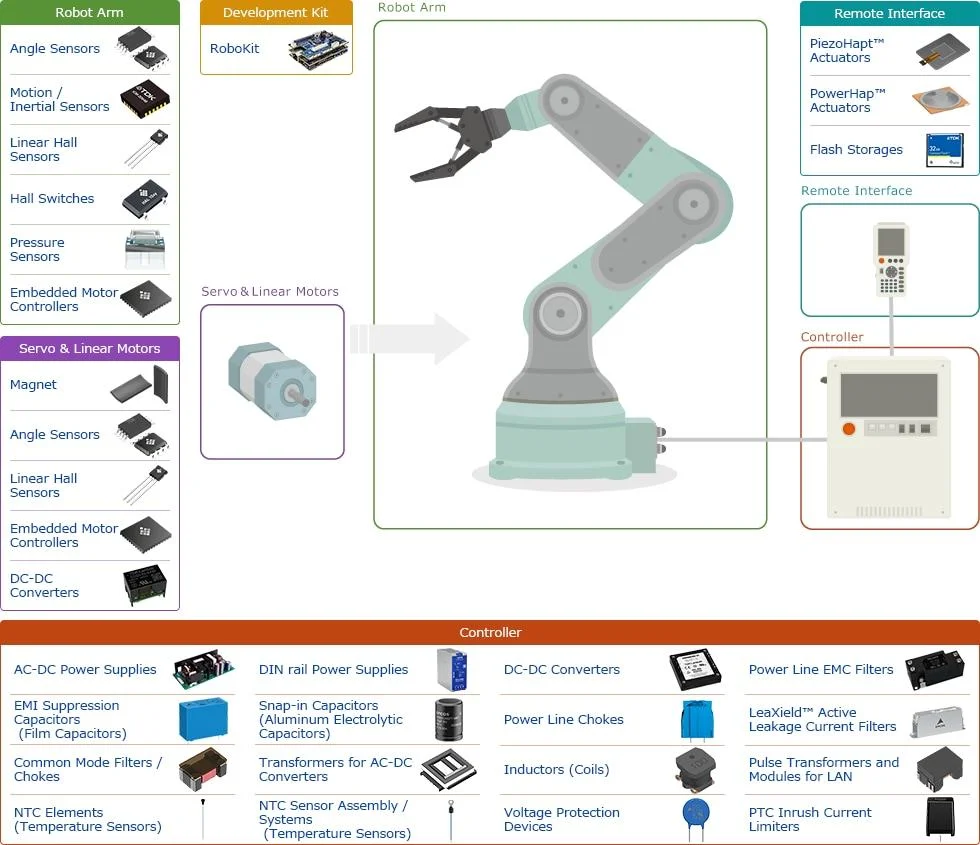

로봇의 조인트(Joint, 관절)
DOF(Degree of Freedom)

- DOF는 물체가 독립적으로 움직일 수 있는 방향의 수
- 즉, 어떤 객체가 공간에서 위치와 방향을 바꾸는 방법의 수
- 이 개념은 특히 로봇의 움직임을 정의할 때 매우 중요

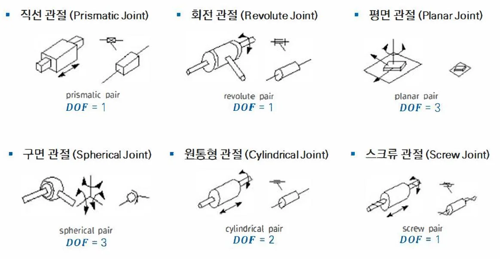

좌표계
우리가 흔히 알고 있는X, Y, Z로 이루어진 좌표이다
해당 좌표는 직선 이동을 할 때 계산이 편하다
X, Y 축에서 원점과 해당 좌표까지의 거리(r)와 해당 점에서
원점으로 이은 선이X축과의 이루는 각(θ)으로 좌표를
표시한다. (z축은 동일), X, Y 평면에서 회전을 계산할 때
용이하다
한 점을 원점까지의 거리를r이라 정의하고 원점까지 이은 선과
Z축과의 각을θ라한다. 그리고 원점과 해당 좌표를 이은 선을X, Y
평면에 수직으로 내린 선과X축과의 각을ϕ라 정의하여 좌표를(r, θ,
ϕ)라 정의한다 회전 운동을 계산하기 용이하다.
직교 좌표, 데카르트 좌표계
(Cartesian Coordinate System)
원통 좌표 좌표계
(r, θ, z), rho-theta
구면좌표계
(r, θ, ϕ)
눈으로 사물을 위치(좌표)를 파악하고 이동 후 물체를 잡는 등의 행위를 하는 것처럼 로봇에게 명령을 수행할 좌표를
로봇 기술자가 입력/파악 후 제어할 수 있어야한다. 기본적인 좌표계에 대한 수학적인 지식을 정리해 보았습니다.

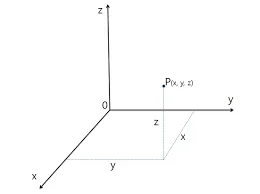

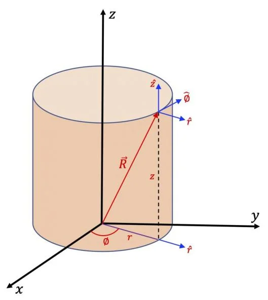

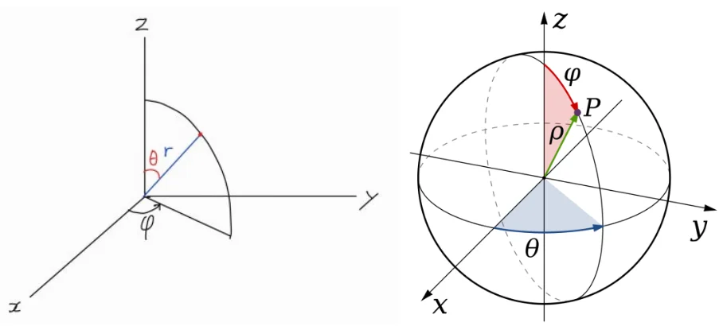

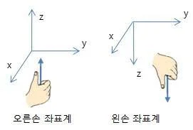

좌표계
앞서 좌표계에 대한 수학적인 배경 지식을 잠깐 설명했지만, 해당 좌표 계산에 민감해하지 말자. 로봇에서의 좌표는 다음과 같이 생각해 볼 수 있다

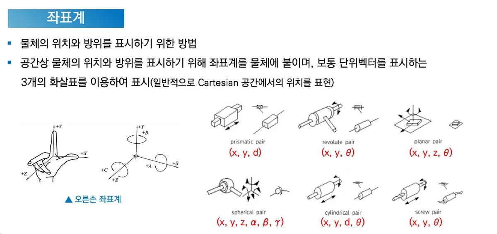

좌표계

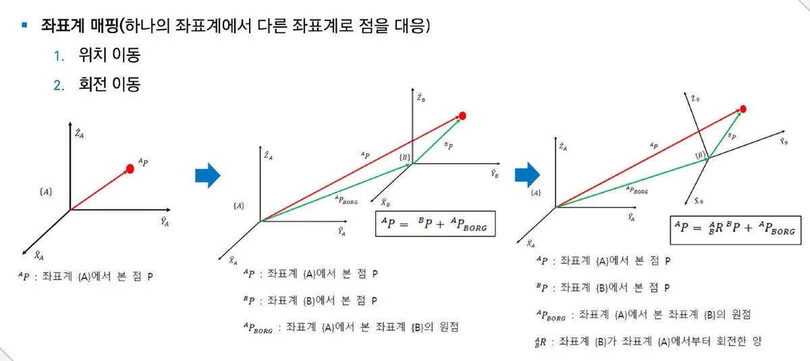

좌표계

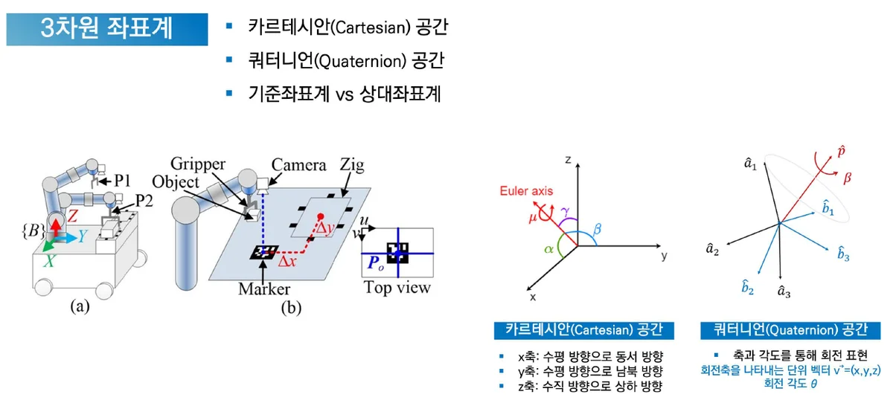

좌표계
Gimber Lock

- 하나의 축이 다른 축과 동일하게 되어 축에 대한 자유도를 상실하게 되는 현상
- 오일러 각은X, Y, Z의회 전 값을 각각의 행렬이 순차적으로 계산됨. 이로 인해Gimber Lock 발생됨
- 가장 바깥쪽(보라색)이Yaw, 가운데 초록색Pitch, 파란색Roll
- 초록색(pitch)가90도또는-90도의 회전을 진행하면,
- 보라색(yaw)과 파란색(roll)이 같은 축을 회전하는 방향이 되어1개축에 대한 자유도가 사라짐 → 3차원 방향 표시 못 하고2차원 방향만 표현

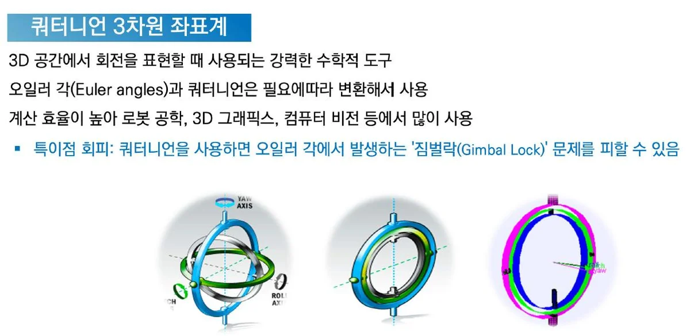

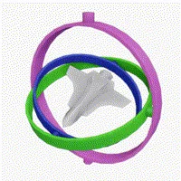

좌표계

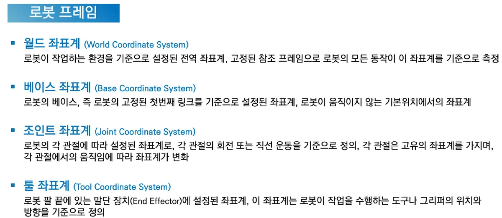

ROS 소개 및 활용

ROS 소개 및 활용

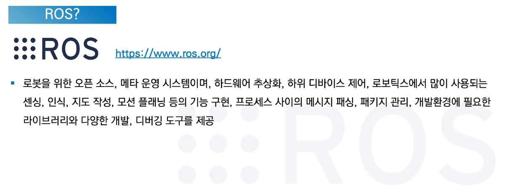

ROS 소개 및 활용

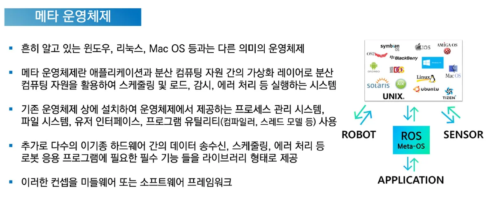

ROS 소개 및 활용

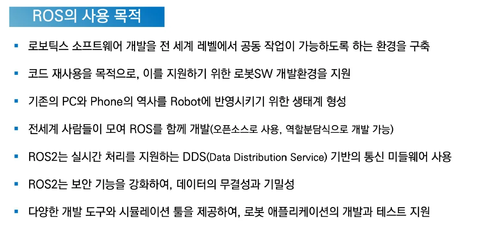

ROS 소개 및 활용

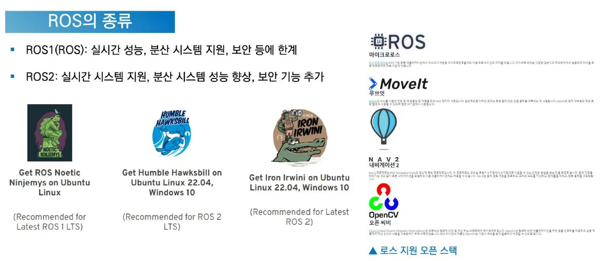

ROS2 참고 자료
vmayoral/ros-robotics-companies: A list of robotics companies using the Robot Operating System (ROS and ROS 2).
https://github.com/vmayoral/ros-robotics-companies
ROS Robotics Companies
ROS 2
https://github.com/ros2
ROS2 설치 매뉴얼
https://teamsparkx.notion.site/ROS2-1137ad24f8c04bffb7f958b8486b89f8
ROS설치 파일.zip

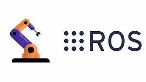

ROS2 실습 설치
https://teamsparkx.notion.site/ROS2-1137ad24f8c04bffb7f958b8486b89f8?pvs=4
*위 링크 참고해서 파일을 다운로드하세요.(링크에서 복사CLI 명령어 복사도 가능해요)

ROS2 실습 설치

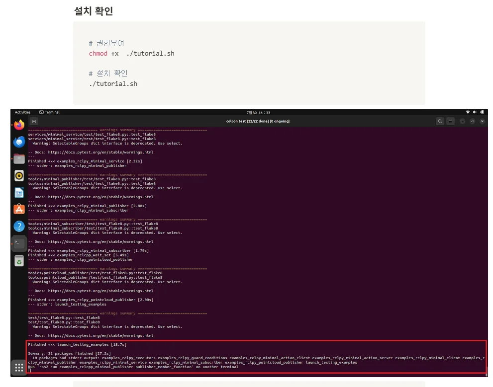

ROS2 실습 설치

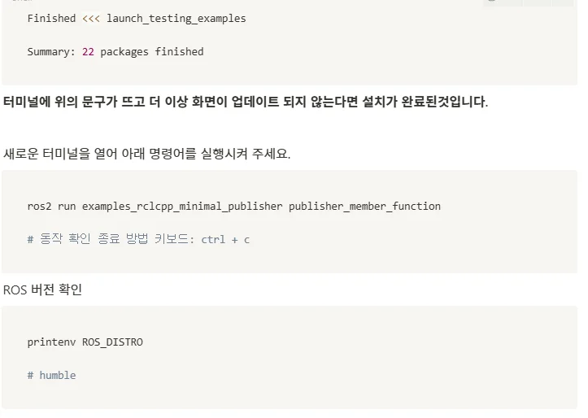

ROS2 실습

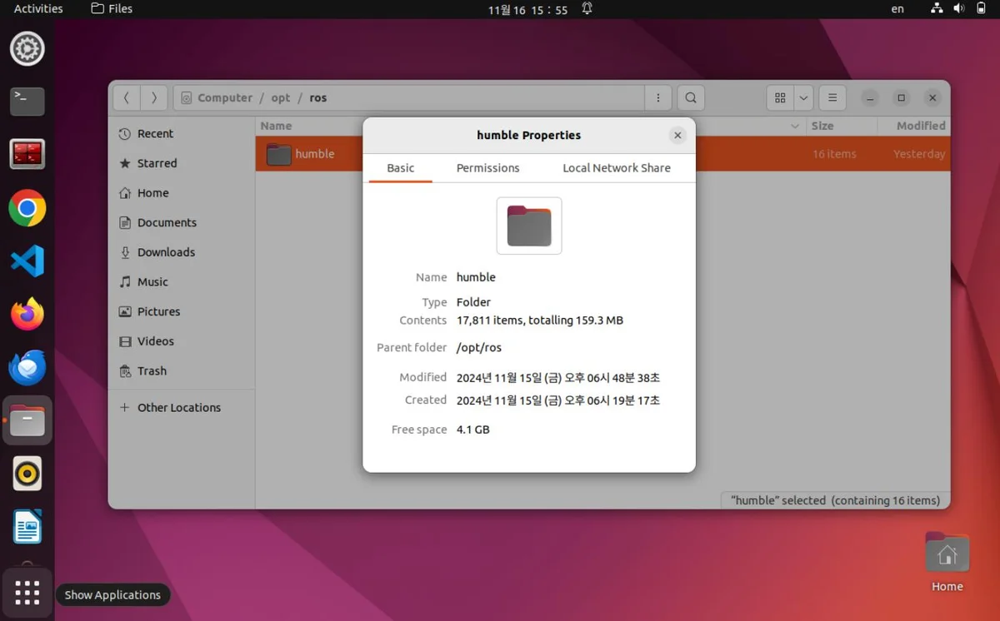

ROS2 실습

ROS2 실습

ROS2 실습
→ 실행 가능한binary 파일
→ 헤더 파일
→ 패키지의 빌드, 환경 설정 파일
→ 소스 코드가 저장되는 디렉토리
→ 다양한 유틸리티 도구들
→ 공유 라이브러리
→ 패키지와 의존성(Dependency) 관리
→ 빌드 설정 파일
→ 환경 설정 파일들

ROS2 실습

ROS2 실습

1. ros2 run demo_nodes_cpp talker
2. ros2 run demo_nodes_cpp listener
3. 해당 디렉토리로 이동
4. source /opt/ros/humble/setup.bash
5. ./talker
6. ./listener

ROS2 실습
1.
./turtlesim_node 실행 시 에러 발생
2.
source /opt/ros/humble/setup.bash 실행후(또는~/.bashrc 확인)
3.
./turtlesim_node 실행하면 정상 실행됨

ROS2 실습
1.
Echo 명령어 실행 및.bashrc 추가된 내용 확인
2.
Ros2 run tab + tab + tab 키입력(자동 완성되는 지 확인)

ROS2 실습
 .bashrc에 추가되어 있는지 확인

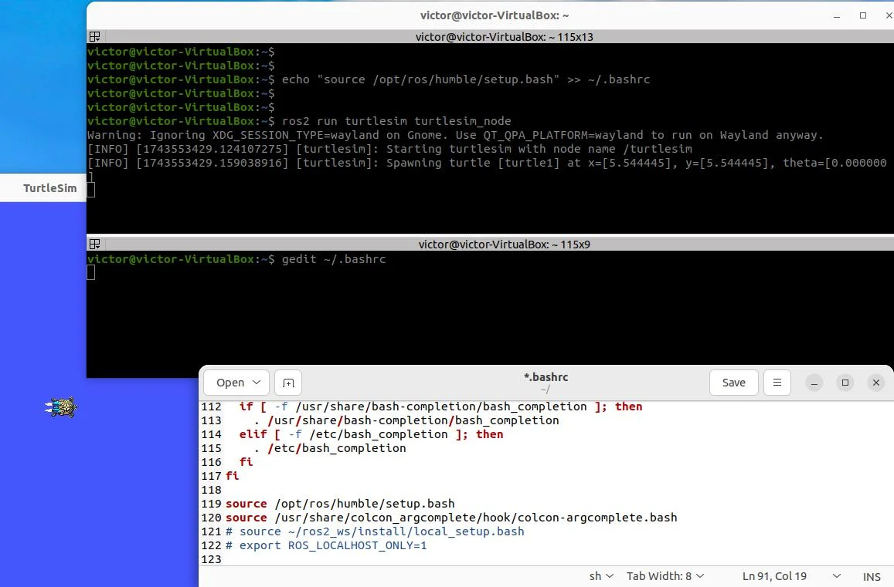

ROS2 실습

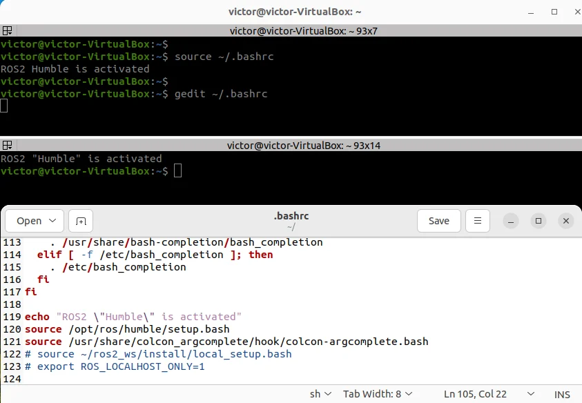

ROS2 실습
Turtlesim 실행후node 확인
turtle_teleop_key 실행 후 키보드로turtle움직여 보기

ROS2 실습

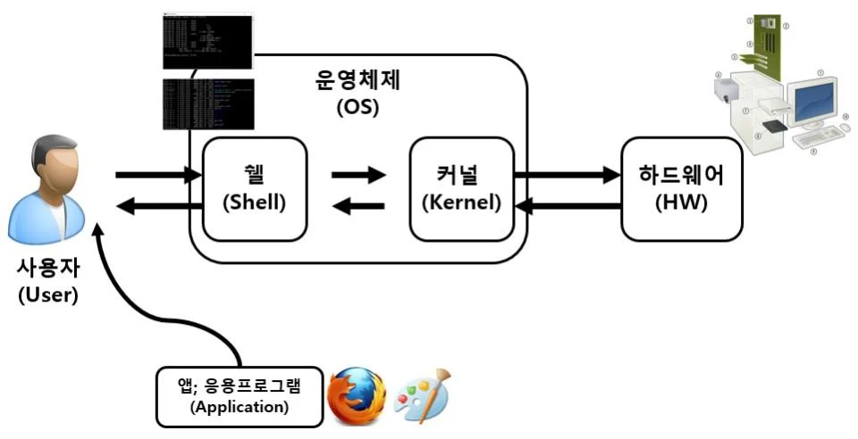

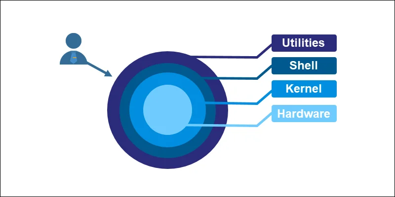

ROS2 실습
:~$ source /opt/ros/humble/setup.bash

- source 명령어는 특정 스크립트 파일을 현재 쉘에서 실행하고, 그 안에 설정된 환경 변수를 쉘 환경에 반영
- bash나zsh 같은 셸 환경에서 특정 파일을 실행하면 해당 파일의 명령이 현재 셸 에로드되므로, 설정된 모든 환경 변수를 현재 셸에서도 사용
- /opt/ros/humble/setup.bash: 이 파일은ROS2가설치된 경로인/opt/ros/humble 안에 있는 환경 설정 스크립트
- setup.bash는ROS 2 패키지를 사용할 때 필요한 환경 변수를 설정하는 역할
- PATH

→ /opt/ros/humble/bin

- LD_LIBRARY_PATH →  /opt/ros/humble/lib
- AMENT_PREFIX_PATH → ament 위치 참조
- PYTHONPATH →
- CMAKE_PREFIX_PATH

ROS2 실습

ROS2 실습
Class, 상속, 생성자 복습
객체(Object)와 인스턴스(Instance)

ROS2 실습
talker code 설명

ROS2 실습
talker code 설명

ROS2 실습

ROS2 실습
Listener code 설명

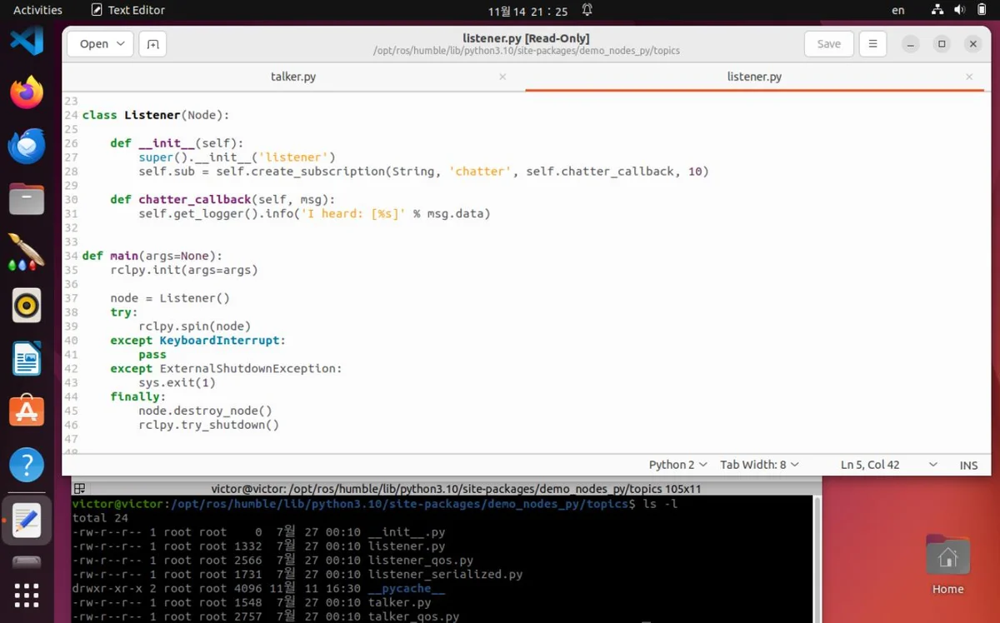

ROS2 실습
Listener code 설명

ROS2 실습
각terminal 창에서ROS_DOMAIN_ID를 바꿔 가며talker와listener 실행해서 메시지 주고받는지 확인

ROS2 실습
talker와listener등 샘플 프로그램이 있는 디렉토리 위치
/opt/ros/humble/share/demo_node_cpp/launch/topics

ROS2 실습

ROS2 실습

수고하셨습니다.

