# 강의_3기_ROS2_기초_5차시

ROKEY BOOT CAMP
ROS2 기초-5차시
Apr, 2025

2
ROKEY BOOT CAMP
훈련일정
오전
오후
1차시
▪로봇의역사
▪컴퓨터구조(Booting, CPU 작동원리, POST)
▪리눅스와운영체계
▪리눅스CLI 실습(디렉토리, 계정, 기본명령어등), Terminator, 커널, 쉘, gedit, bash
▪Application 작동원리(마이크로프로세서, 메모리, 저장장치)
▪리눅스 CLI 실습
2차시
▪리눅스 CLI 실습
▪네트워크와통신(IPV4, IPV6, 소켓, 노드, Hub, TCP, UDP)
▪API, Library, Framework, 프로세스와Thread
▪인터프리터, 컴파일러(소스코드→ Build → 실행파일)
▪소켓프로그래밍실습
▪OSI7 Layer, 프로토콜(RS-232C, RS-485, Ethernet, TCP/UDP, IP)
3차시
▪센서 기초, IoT와Embedded
▪로봇기초, 좌표계
▪로봇센서활용및로봇의 구성(기계기구, 전기전자, 소프트웨어)
▪ROS2 소개및활용
▪ROS2 설치(ros.org) 및demo_node
4차시
▪ROS2 소개및활용
▪ROS2 실습(Talker, Listener)
▪ROS2 패키지설명
▪ROS2 실습(Turtlesim, teleop_key)
5차시
▪ROS2 실습(Turtlesim, Teleop_key 여러개만들기)
▪Topic, Service, Action, Parameter, RQT, RQT_Graph 이론및실습
▪ROS2 실습(Turtlesim, Namespace 여러개만들기)
▪Ros bag and play 실습, my first package build 실습
▪Turtlesim subscribing 실습, ROS의 중요한개발도구(Rviz, GAZEBO 소개)

3
ROKEY BOOT CAMP
ROS2 패키지설명

4
ROKEY BOOT CAMP
ROS2 패키지설명

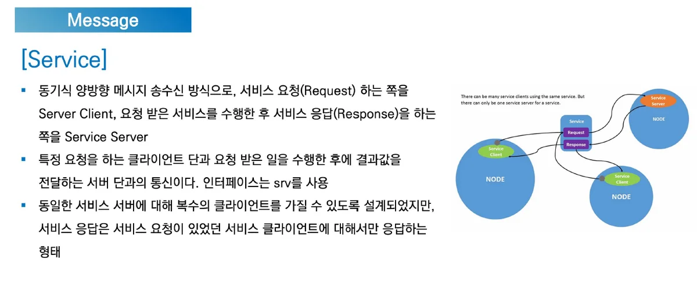

5
ROKEY BOOT CAMP
ROS2 패키지설명

6
ROKEY BOOT CAMP
ROS2 패키지설명

7
ROKEY BOOT CAMP
ROS2 실습
Terminal
Turtlesim
1단계
1개
(Default Namespace)
1개
(Default Namespace)
2단계
1개
(Namespace 지정)
1개
(Namespace 지정)
3단계
1개
2개
4단계
2개
1개씩
5단계
2개
2개씩

8
ROKEY BOOT CAMP
ROS2 실습- turtlesim 1단계
Turtlesim 실행후node 확인

9
ROKEY BOOT CAMP
ROS2 실습
ROKEY
GO!

10
ROKEY BOOT CAMP
ROS2 실습- turtlesim
Turtlesim 실행후node 확인
1

11
ROKEY BOOT CAMP
ROS2 실습
Turtlesim 실행후node 확인
Namespace 설정
2

12
ROKEY BOOT CAMP
ROS2 실습
Turtlesim 실행후node 확인
Namespace + Node 이름설정
2

13
ROKEY BOOT CAMP
ROS2 실습
Turtlesim 실행후node 확인
Namespace + Node 이름설정
2

14
ROKEY BOOT CAMP
ROS2 실습
3

15
ROKEY BOOT CAMP
ROS2 실습
3

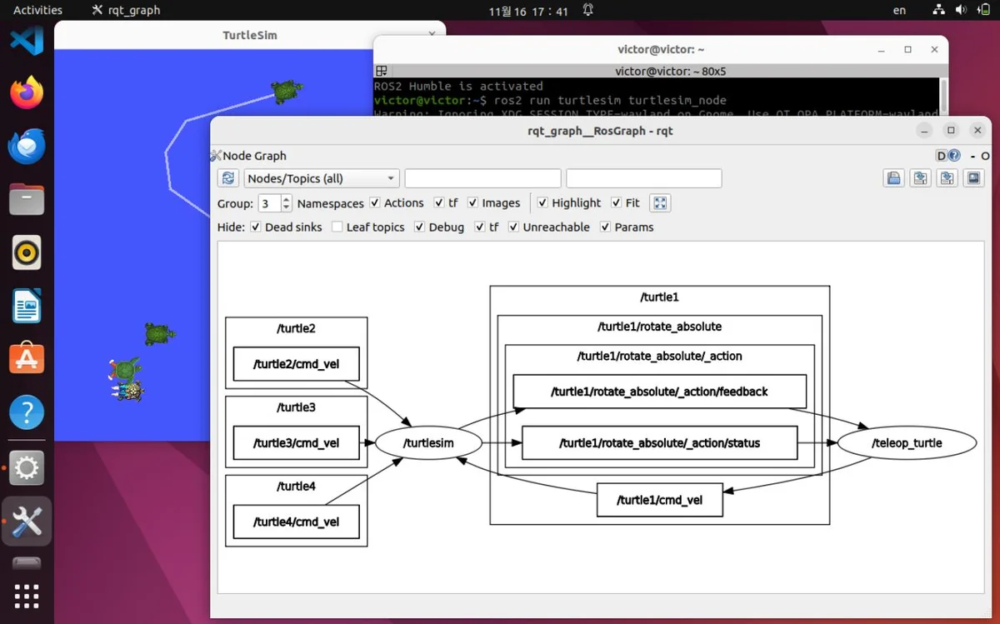

16
ROKEY BOOT CAMP
ROS2 실습
Namespace와Name 설정
3

17
ROKEY BOOT CAMP
ROS2 실습

18
ROKEY BOOT CAMP
ROS2 실습
4

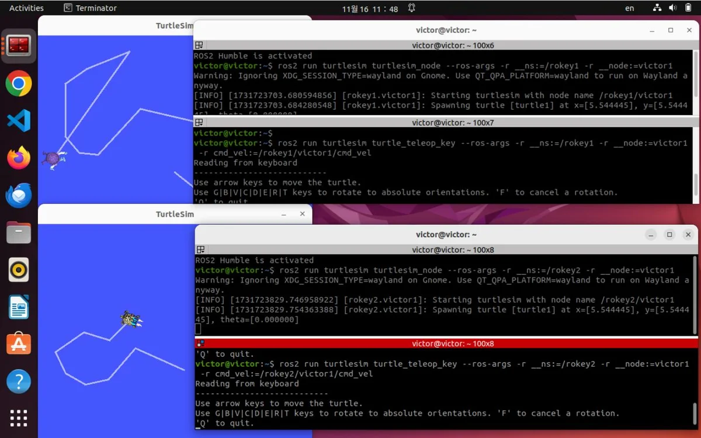

19
ROKEY BOOT CAMP
ROS2 실습
1st Namespace와Name각각설정
5

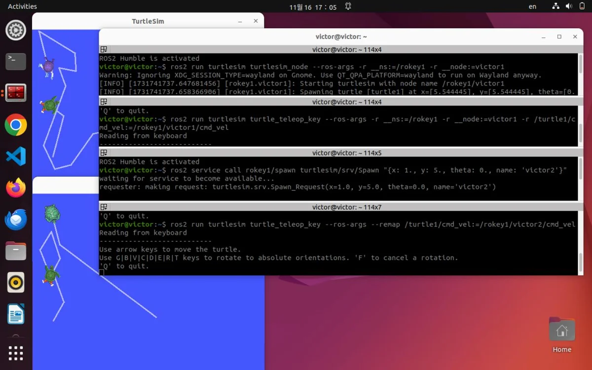

20
ROKEY BOOT CAMP
ROS2 실습
2nd Namespace와Name 각각설정
5

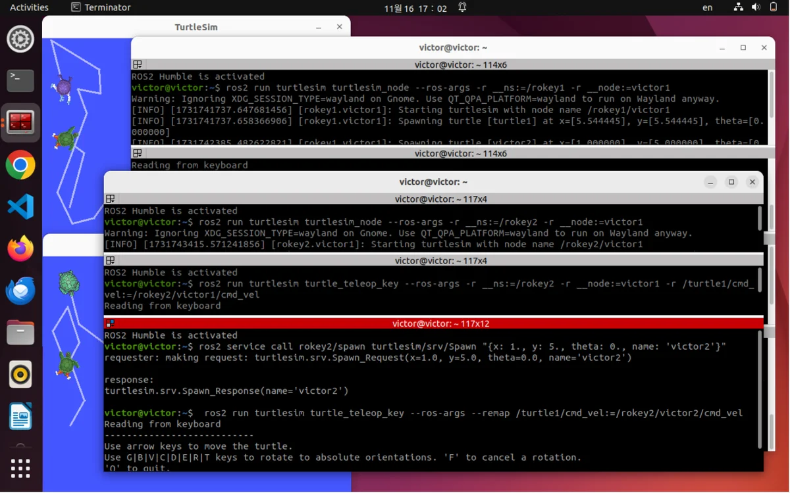

21
ROKEY BOOT CAMP
ROS2 실습
5

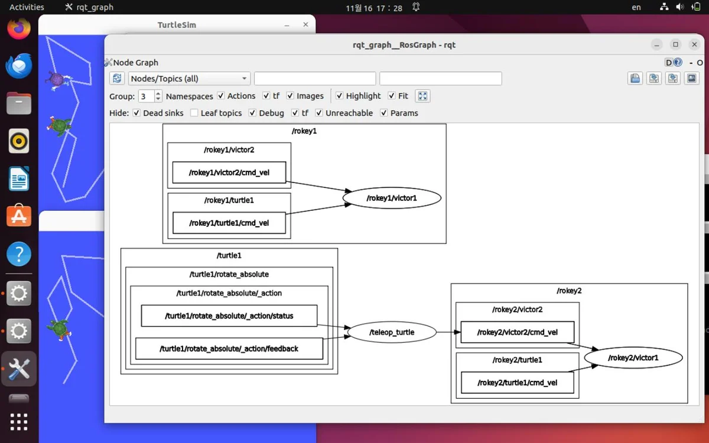

22
ROKEY BOOT CAMP
ROS2 실습– 노드와메시지통신(10장)
노드(node)
▪
아래그림처럼Node A, Node B, Node C 각각의노드들은서로유기적으로Message로연결
▪
수행하고자하는태스크가많아질수록메시지로연결되는노드가늘어나며시스템이확장

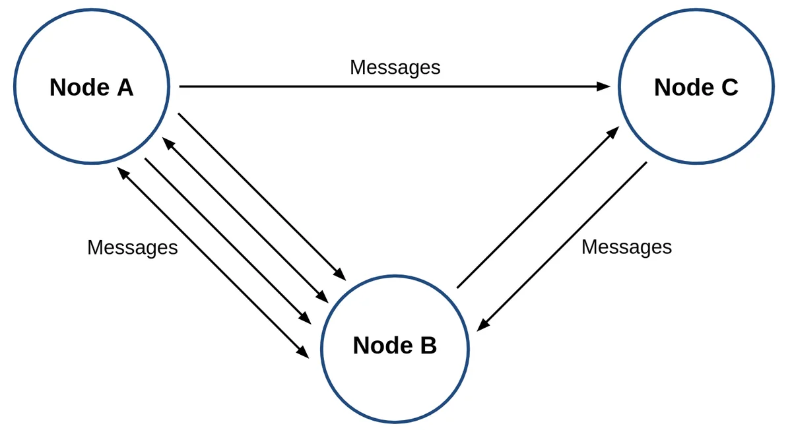

23
ROKEY BOOT CAMP
ROS2 실습– 노드와메시지통신(10장)
토픽(topic)
▪
아래그림의`Node A – Node B`, `Node A – Node C`처럼비동기식단방향메시지송수신방식
▪
msg 메시지형태의메시지를발간하는Publisher
▪
메시지를구독하는Subscriber 간의통신
▪
이는1:N, N:1, N:N 통신도가능
▪
ROS 메시지통신에서가장널리사용되는통신방법이다.

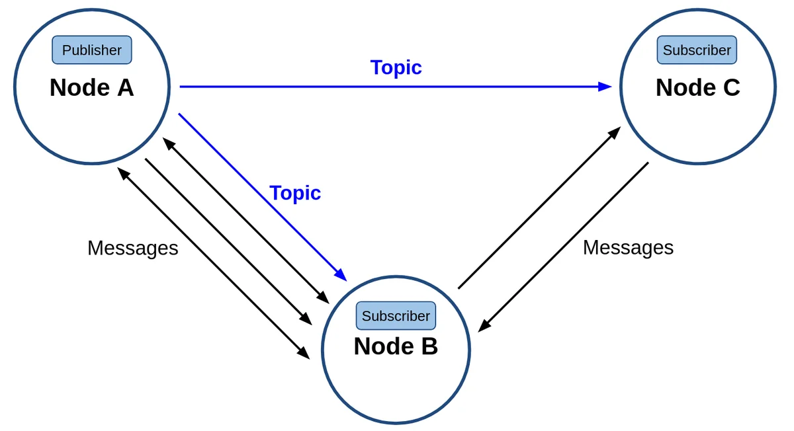

24
ROKEY BOOT CAMP
ROS2 실습– 노드와메시지통신(10장)
서비스(Service)
▪
아래그림의`Node B - Node C`처럼동기식양방향메시지송수신방식
▪
서비스의요청(Request)을하는쪽은Service client
▪
서비스의응답(Response)을하는쪽을Service server
▪
특정요청을하는클라이언트단과요청받은일수행후결과값을전달하는서버단과의통신
▪
서비스요청및응답(Request/Response) 또한위에서언급한msg 메시지의변형으로srv 메시지라고함.

25
ROKEY BOOT CAMP
ROS2 실습– 노드와메시지통신(10장)
액션(Action)
▪
토픽(topic)과서비스(service)의혼합
▪
액션목표및액션결과를전달하는방식은서비스와같고,
▪
액션피드백은토픽과같은메시지전송방식
▪
액션목표/피드백/결과(Goal/Feedback/Result) 메시지또한위에서언급한msg 메시지의변형으로action 메시지라고함.

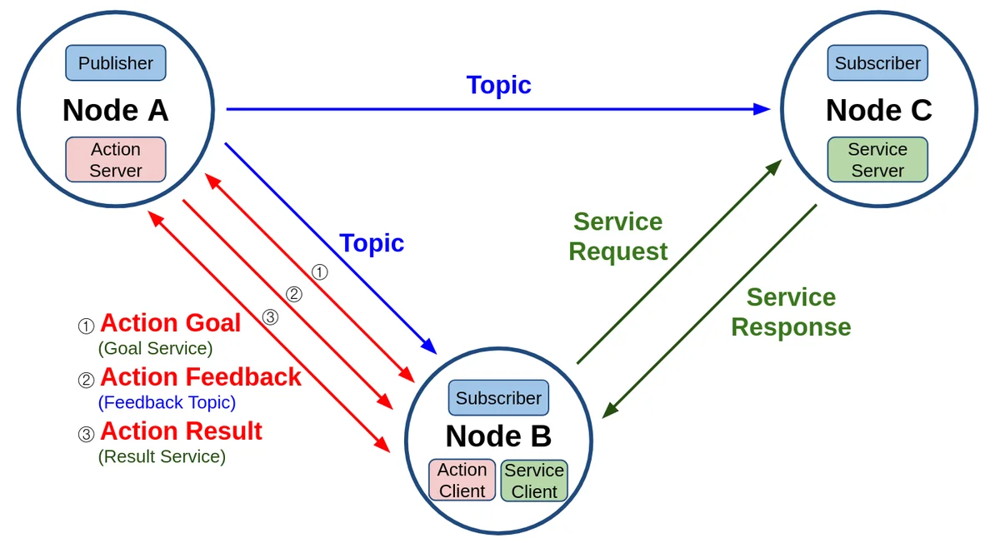

26
ROKEY BOOT CAMP
ROS2 실습– 노드와메시지통신(10장)
파라미터(Parameter)
▪
각노드에파라미터관련Parameter server를실행시켜외부의Parameter client 간의통신으로파라미터를
변경하는것으로서비스와동일
▪
노드내매개변수또는글로벌매개변수를서비스메시지통신방법을사용하여노드내부또는외부에서쉽게
지정(Set) 하거나변경할수있고, 쉽게가져(Get)와서사용할수있게하는점에서목적이다름

27
ROKEY BOOT CAMP
ROS2 실습– 노드와메시지통신(10장)
$ ros2 node list
/turtlesim
/teleop_turtle
$ ros2 topic list
/parameter_events
/rosout
/turtle1/cmd_vel
/turtle1/color_sensor
/turtle1/pose
$ ros2 action list
/turtle1/rotate_absolute
$ ros2 node info /turtlesim
/turtlesim
   Subscribers:
……
$ ros2 node info /teleop_turtle
/turtlesim
Subscribers:
…
$ ros2 service list
/clear
/kill
/reset
/spawn
/teleop_turtle/describe_parameters
/teleop_turtle/get_parameter_types
/teleop_turtle/get_parameters
/teleop_turtle/list_parameters
/teleop_turtle/set_parameters
/teleop_turtle/set_parameters_atomically
/turtle1/set_pen
/turtle1/teleport_absolute
/turtle1/teleport_relative
/turtlesim/describe_parameters
/turtlesim/get_parameter_types
/turtlesim/get_parameters
/turtlesim/list_parameters
/turtlesim/set_parameters
/turtlesim/set_parameters_atomically

28
ROKEY BOOT CAMP
ROS2 실습- ROS2 Topic(11장)
▪
`Node A`처럼하나의이상의토픽을발행
▪
`Publisher` 기능과동시에토픽(예: Topic D)을구독하는`Subscriber` 역할도동시에수행
▪
자신이발행한토픽을셀프구독할수있게구성할수도있음
▪
토픽기능은목적에따라다양한방법으로사용할수있으며이런유연성으로다양한곳에사용중
▪
ROS 프로그래밍시에70% 이상이토픽으로사용됨
▪
통신방식중에가장기본이되며가장널리쓰이는방법
▪
비동기성과연속성을가지기에센서값전송및항시정보를주고받아야하는부분에주로사용

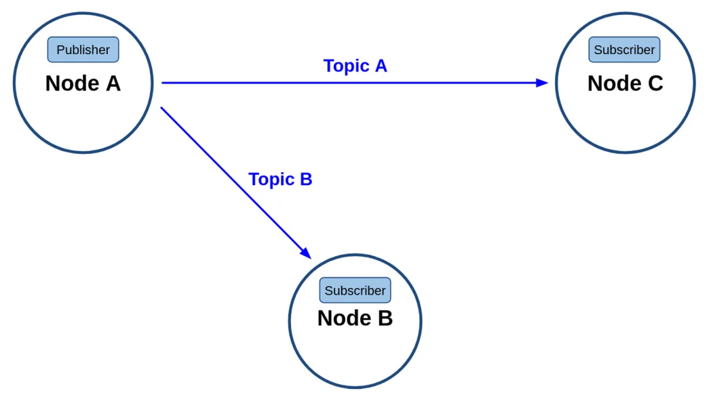

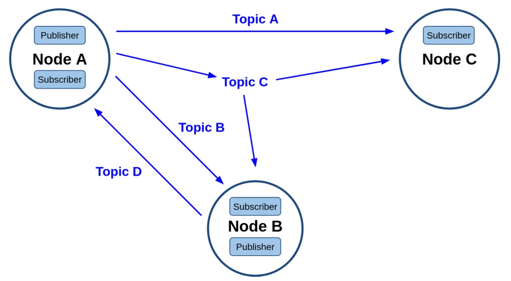

29
ROKEY BOOT CAMP
ROS2 실습- Topic
$ ros2 topic list -t
/parameter_events [rcl_interfaces/msg/ParameterEvent]
/rosout [rcl_interfaces/msg/Log]
/turtle1/cmd_vel [geometry_msgs/msg/Twist]
/turtle1/color_sensor [turtlesim/msg/Color]
/turtle1/pose [turtlesim/msg/Pose]

30
ROKEY BOOT CAMP
ROS2 실습- Topic
$ ros2 topic info /turtle1/cmd_vel
Type: geometry_msgs/msg/Twist
Publisher count: 1
Subscriber count: 1
$ ros2 topic echo /turtle1/cmd_vel
linear:
x: 1.0
y: 0.0
z: 0.0
angular:
x: 0.0
y: 0.0
z: 0.0

31
ROKEY BOOT CAMP
ROS2 실습– Topic
$ ros2 topic pub --once /turtle1/cmd_vel geometry_msgs/msg/Twist "{linear: {x: 2.0, y: 0.0, z: 0.0}, angular: {x: 0.0, y: 0.0, z: 1.8}}"

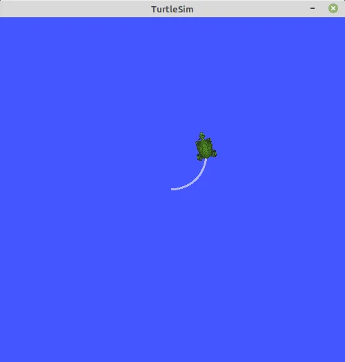

32
ROKEY BOOT CAMP
ROS2 실습- Topic
$ ros2 topic pub --rate 1 /turtle1/cmd_vel geometry_msgs/msg/Twist "{linear: {x: 2.0, y: 0.0, z: 0.0}, angular: {x: 0.0, y: 0.0, z: 1.8}}"

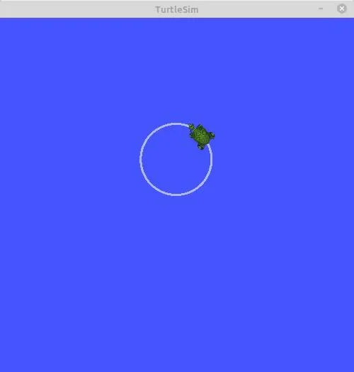

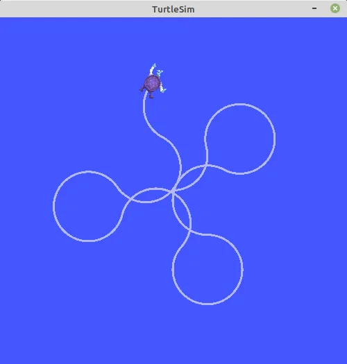

33
ROKEY BOOT CAMP
ROS2 실습- Topic
Turtlesim 실행후topic 발행해보기

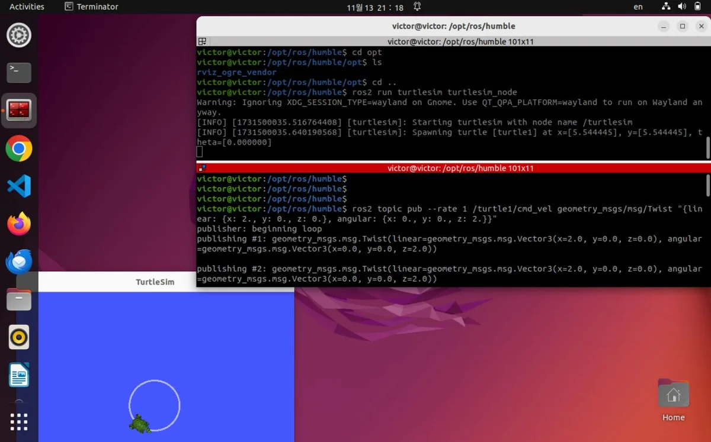

34
ROKEY BOOT CAMP
ROS2 실습– Topic with RQT
Plugins → Visualization → Plot
RQT 실행후pose/x, pose/y 확인

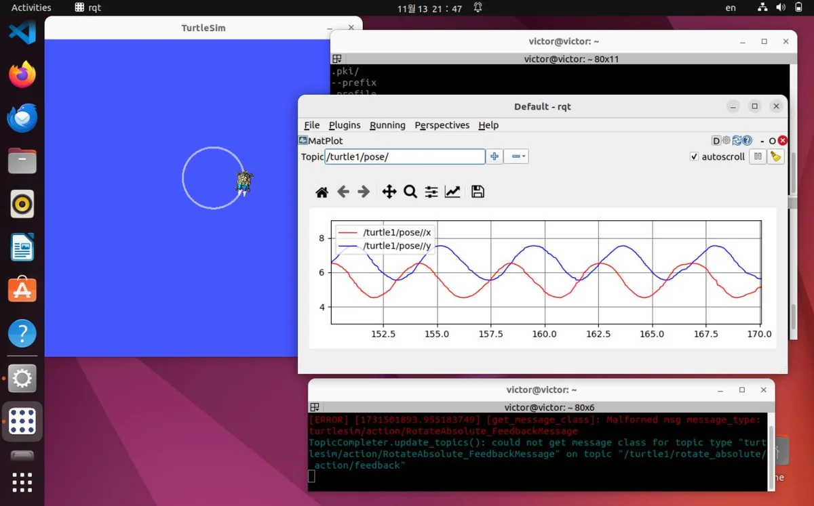

35
ROKEY BOOT CAMP
ROS2 실습– Topic Message with RQT
Plugins → Topics → Message Publisher

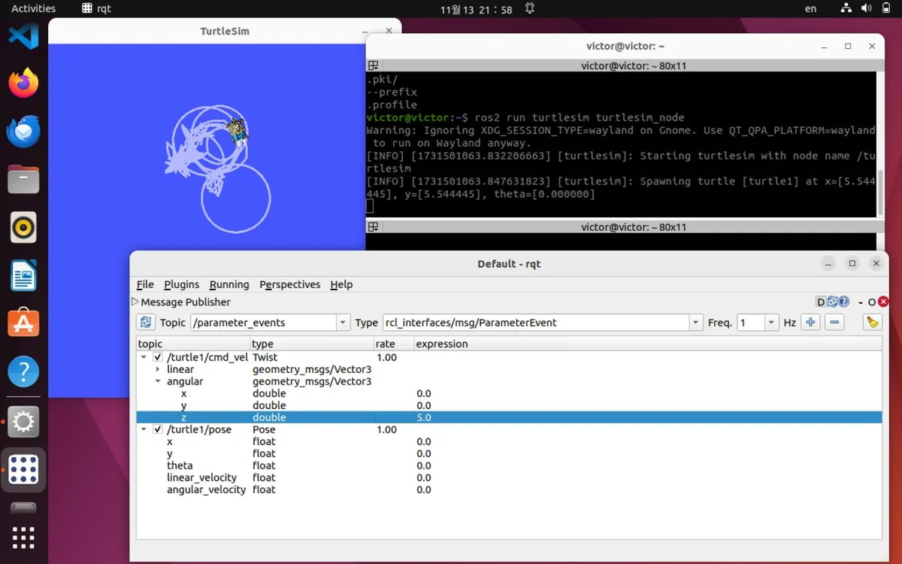

36
ROKEY BOOT CAMP
ROS2 실습– ros bag

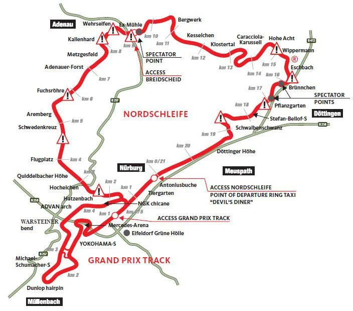

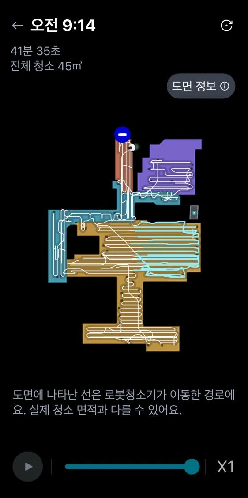

37
ROKEY BOOT CAMP
ROS2 실습– ros2 bag and ros2 play

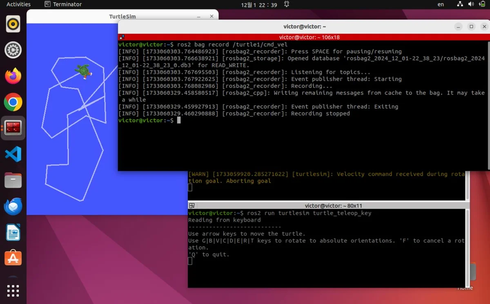

38
ROKEY BOOT CAMP
ROS2 실습– ros2 bag and ros2 play

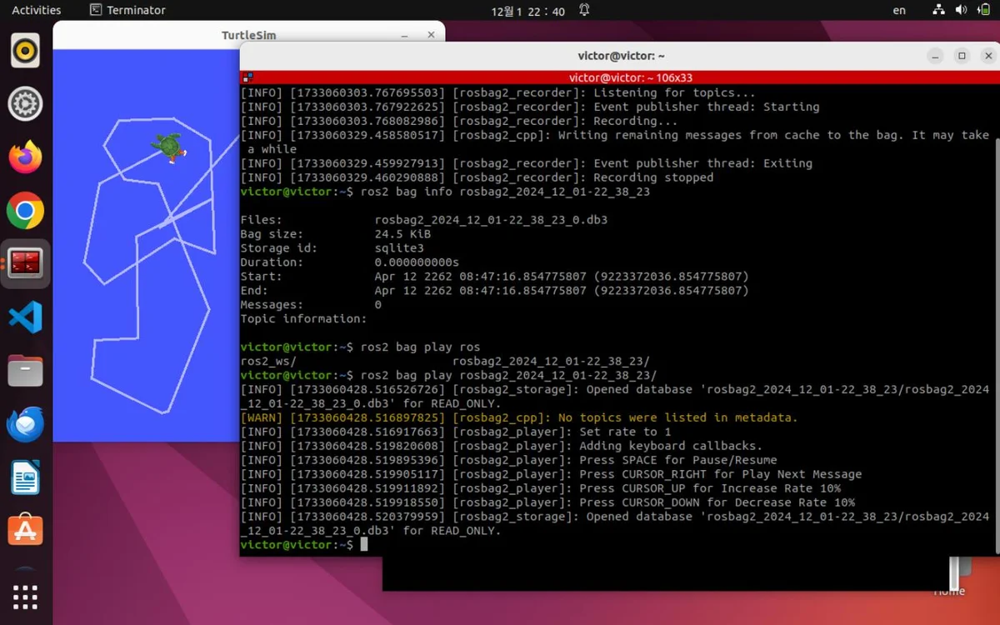

39
ROKEY BOOT CAMP
ROS2 실습- Service
▪
서비스는다음그림과같이동일서비스에대해복수의클라이언트를가질수있도록설계되었다.
▪
단, 서비스응답은서비스요청이있었던서비스클라이언트에대해서만응답을하는형태
▪
Node C의Service Client가Node B의Service Server에게서비스요청을하였다면Node B의
Service Server는요청받은서비스를수행한후Node C의Service Client에게만서비스응답

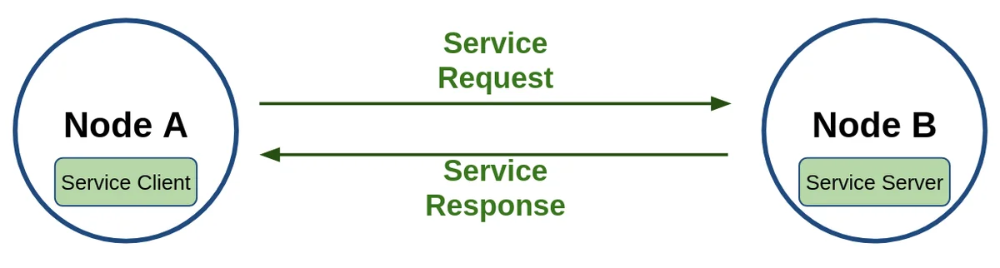

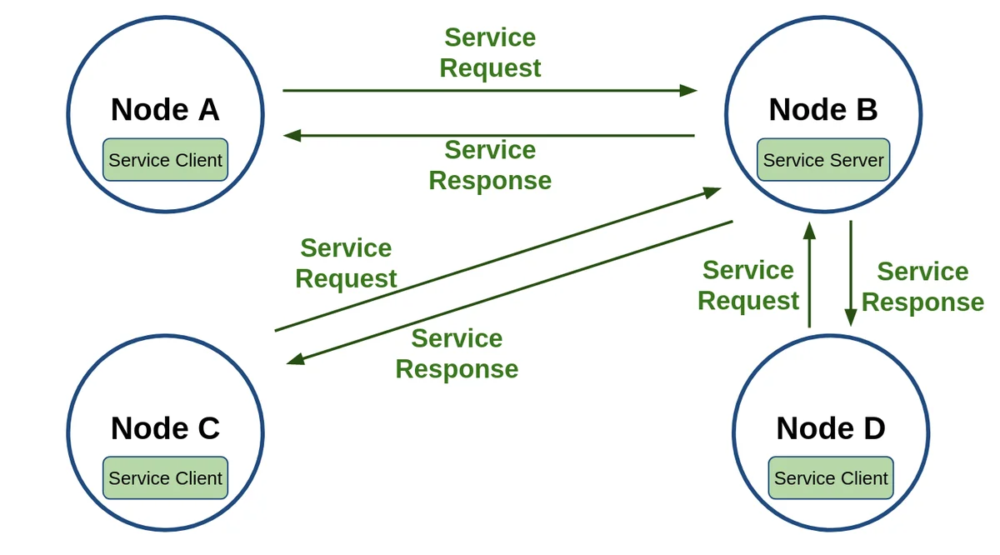

40
ROKEY BOOT CAMP
ROS2 실습- Service
$ ros2 service list
/clear
/kill
/reset
/spawn
/turtle1/set_pen
/turtle1/teleport_absolute
/turtle1/teleport_relative
/turtlesim/describe_parameters
/turtlesim/get_parameter_types
/turtlesim/get_parameters
/turtlesim/list_parameters
/turtlesim/set_parameters
/turtlesim/set_parameters_atomically
$ ros2 run turtlesim turtlesim_node

41
ROKEY BOOT CAMP
ROS2 실습- Service
$ ros2 service list -t
/clear [std_srvs/srv/Empty]
/kill [turtlesim/srv/Kill]
/reset [std_srvs/srv/Empty]
/spawn [turtlesim/srv/Spawn]
/turtle1/set_pen [turtlesim/srv/SetPen]
/turtle1/teleport_absolute [turtlesim/srv/TeleportAbsolute]
/turtle1/teleport_relative [turtlesim/srv/TeleportRelative]
(생략)
$ ros2 service type /clear
std_srvs/srv/Empty
$ ros2 service type /kill
turtlesim/srv/Kill
$ ros2 service type /spawn
turtlesim/srv/Spawn
$ ros2 service find std_srvs/srv/Empty
/clear
/reset
$ ros2 service find turtlesim/srv/Kill
/kill

42
ROKEY BOOT CAMP
ROS2 실습- Service
$ ros2 service call /clear std_srvs/srv/Empty
requester: making request: std_srvs.srv.Empty_Request()
response:
std_srvs.srv.Empty_Response()
$ ros2 run turtlesim turtle_teleop_key

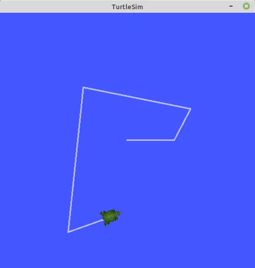

43
ROKEY BOOT CAMP
ROS2 실습- Service
$ ros2 service call /reset std_srvs/srv/Empty
requester: making request: std_srvs.srv.Empty_Request()
response:
std_srvs.srv.Empty_Response()
$ ros2 service call /kill turtlesim/srv/Kill "name: 'turtle1'"
requester: making request: 
turtlesim.srv.Kill_Request(name='turtle1')
response:
turtlesim.srv.Kill_Response()

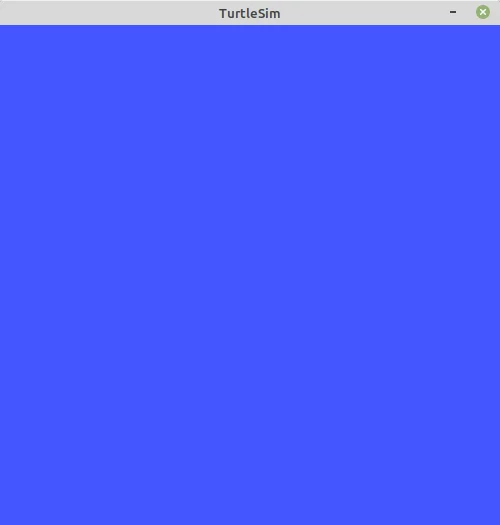

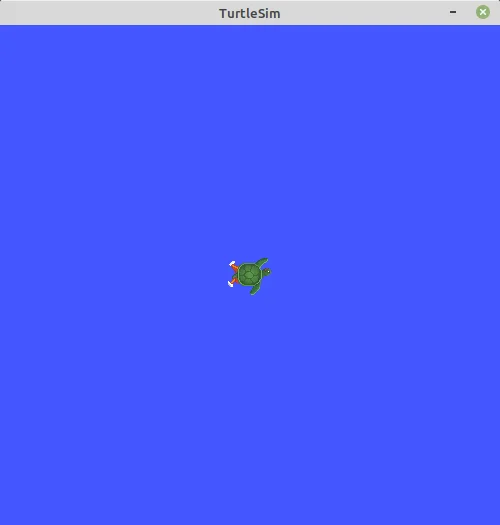

44
ROKEY BOOT CAMP
ROS2 실습- Service
$ ros2 service call /turtle1/set_pen turtlesim/srv/SetPen "{r: 255, g: 255, b: 255, width: 10}"
requester: making request: turtlesim.srv.SetPen_Request(r=255, g=255, b=255, width=10, off=0)
response:
turtlesim.srv.SetPen_Response()

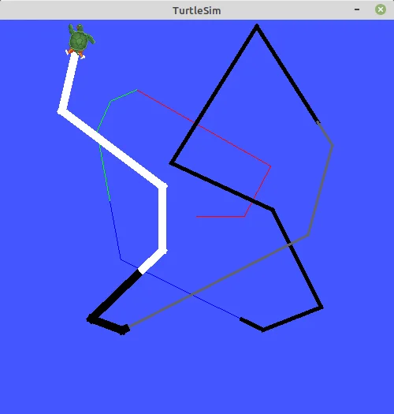

45
ROKEY BOOT CAMP
ROS2 실습- Service
Turtle 친구4명생성해보기
교재 : p148

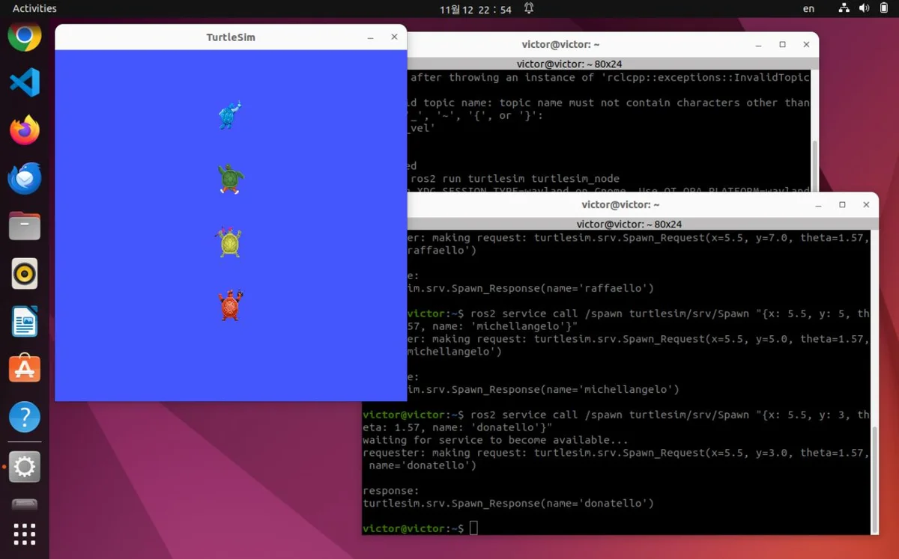

46
ROKEY BOOT CAMP
ROS2 실습– Service with RQT

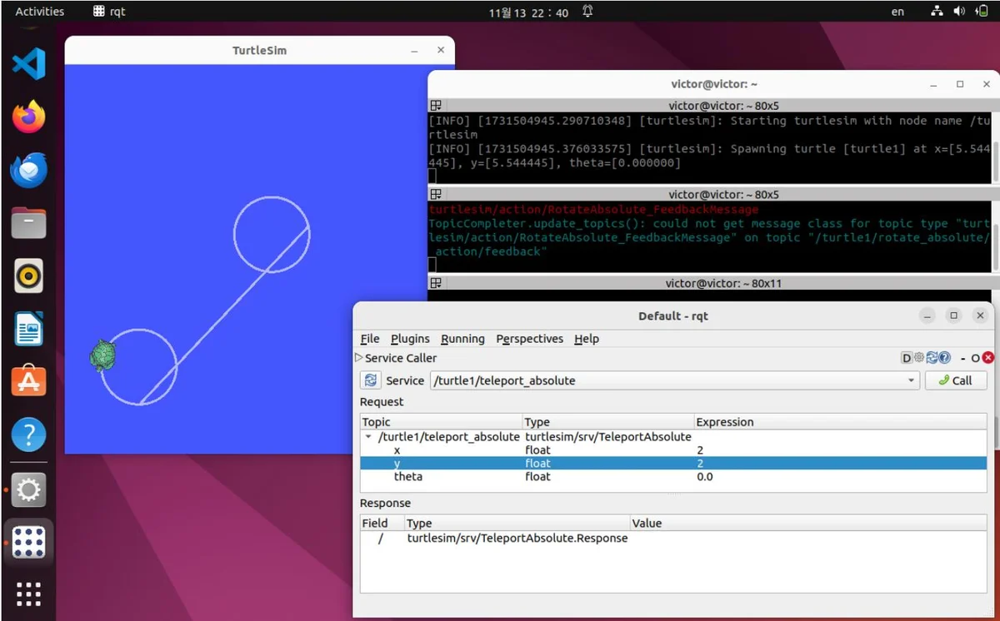

47
ROKEY BOOT CAMP
ROS2 실습- Action
액션(Action)
▪
토픽(topic)과서비스(service)의혼합
▪
액션목표및액션결과를전달하는방식은서비스와같고,
▪
액션피드백은토픽과같은메시지전송방식
▪
액션목표/피드백/결과(Goal/Feedback/Result) 메시지또한위에서언급한msg 메시지의변형으로action 메시지라고함.

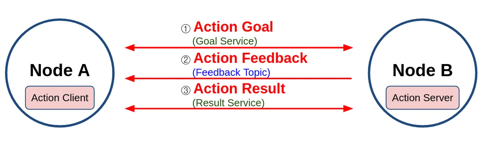

48
ROKEY BOOT CAMP
ROS2 실습- Action
액션의구현방식을더자세히살펴보면다음그림과같이토픽과서비스의혼합이라고볼수있는데ROS 1이토픽만을
사용하였다면ROS 2에서는액션목표, 액션결과, 액션피드백은토픽과서비스가혼합되어있다. 
즉, 다음그림과같이Action Client는Service Client 3개와Topic Subscriber 2개로구성되어있으며, Action Server는
Service Server 3개와Topic Publisher 2개로구성된다. 액션목표/피드백/결과(goal/feedback/result) 데이터는msg 및
srv 인터페이스의변형으로action 인터페이스라고한다.

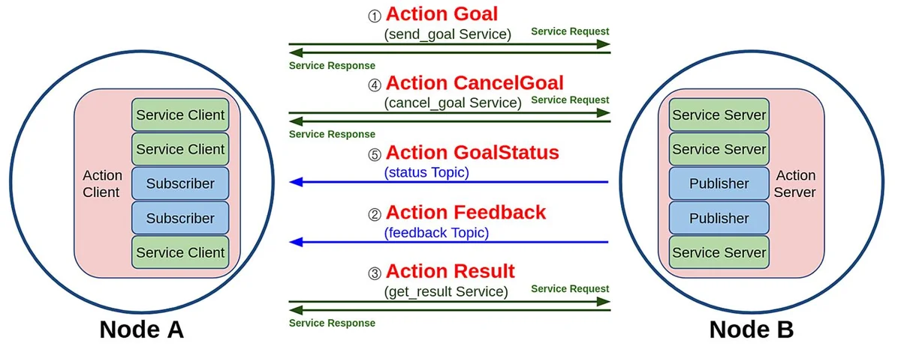

49
ROKEY BOOT CAMP
ROS2 실습- Action
ROS 1에서의액션은목표, 피드백, 결과값을토픽으로만주고받았는데ROS 2에서는토픽과서비스방식을혼합하여사용하였다. 
그이유로토픽으로만액션을구성하였을때토픽의특징인비동기식방식을사용하게되어ROS 2 액션에서새롭게선보이는목표
전달(send_goal), 목표취소(cancel_goal), 결과받기(get_result)를동기식인서비스를사용하기위해서이다. 이런비동기방식을
이용하다보면원하는타이밍에적절한액션을수행하기어려운데이를원활히구현하기위하여목표상태(goal_state)라는것이
ROS 2에서새롭게선보였다. 목표상태는목표값을전달한후의상태머신을구동하여액션의프로스세를쫒는것이다. 여기서
말하는상태머신은Goal State Machine으로다음그림과같이액션목표전달이후의액션의상태값을액션클라이언트에게
전달할수있어서비동기, 동기방식이혼재된액션의처리를원활하게할수있게되어있다.

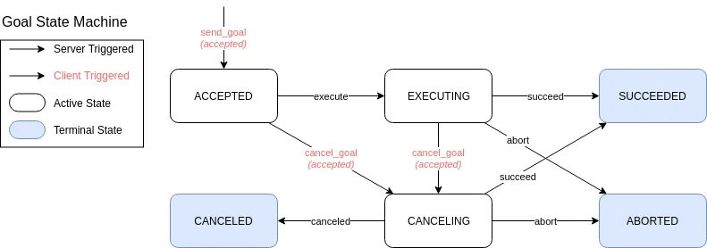

50
ROKEY BOOT CAMP
ROS2 실습- Action
교재p153

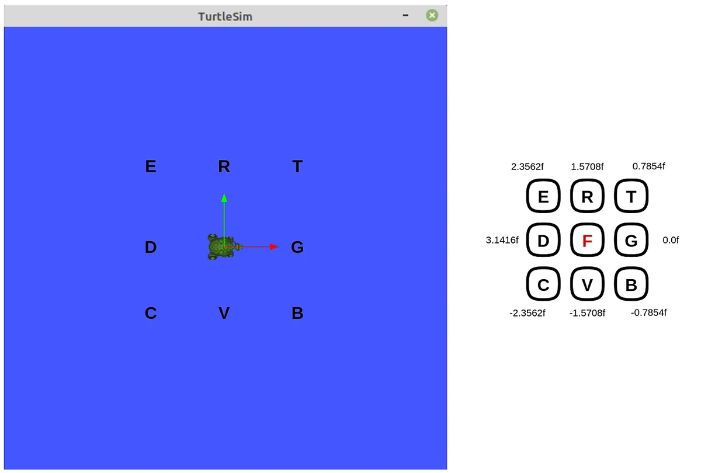

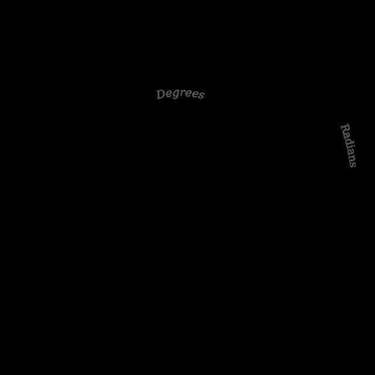

51
ROKEY BOOT CAMP
ROS2 실습- Action
60◦
r
Degree vs Radian
57◦
r <
r =
180◦ =     = 3.14
360◦ = 2   = 6.28
1 rad ≒ 180◦/ 3.14 ≒ 57◦
Ros2에서사용하는단위
▪
Kg
▪
Sec
▪
Meter
▪
Radian
r
52
ROKEY BOOT CAMP
ROS2 실습- Action

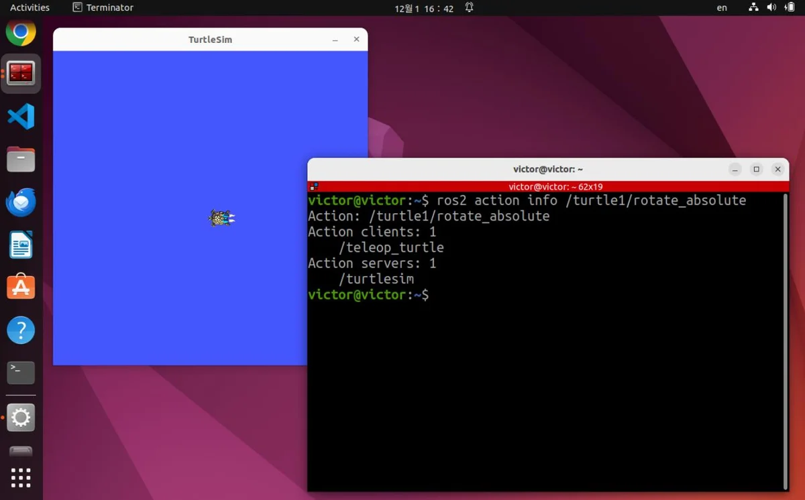

53
ROKEY BOOT CAMP
ROS2 실습- Action

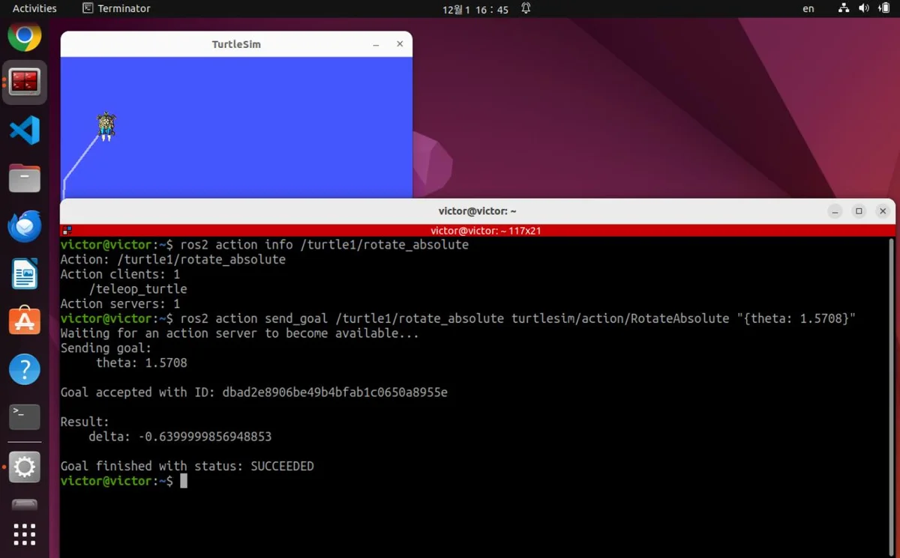

54
ROKEY BOOT CAMP
ROS2 실습- Action

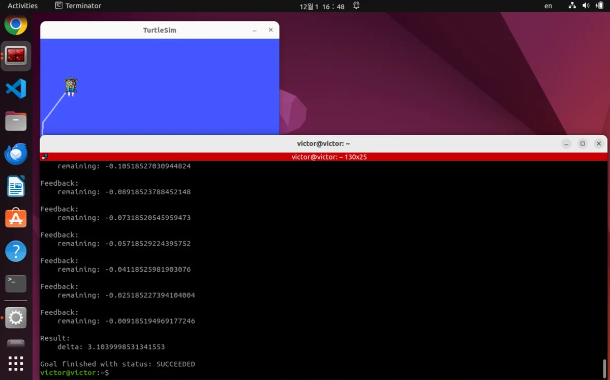

55
ROKEY BOOT CAMP
ROS2 실습- Interface
ROS의노드간에데이터를주고받을때에는토픽, 서비스, 액션이사용되는데이때사용되는데이터의형태를ROS 인터페이스(interface)
이라고한다. ROS 인터페이스에는ROS 2에새롭게추가된IDL(interface definition language)과ROS 1부터ROS 2까지널리사용중인msg, 
srv, action 이있다. 토픽, 서비스, 액션은각각msg, srv, action interface를사용하고있으며정수, 부동소수점, 불리언과같은단순자료형을
기본으로하여메시지안에메시지를품고있는간단한데이터구조및메시지들이나열된배열과같은구조도사용할수있다.
[단순자료형]
• 예) 정수(integer), 부동소수점(floating point), 불(boolean)
• https://github.com/ros2/common_interfaces/tree/humble/std_msgs
[메시지안에메시지를품고있는간단한데이터구조]
• 예) geometry_msgs/msgs/Twist의`Vector3 linear`
• https://github.com/ros2/common_interfaces/blob/humble/geometry_msgs/msg/Twist.msg
[메시지들이나열된배열과같은구조]
• 예) sensor_msgs/msgs/LaserScan 의`float32[] ranges`
• https://github.com/ros2/common_interfaces/blob/humble/sensor_msgs/msg/LaserScan.msg

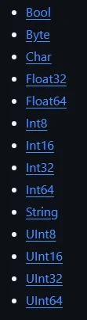

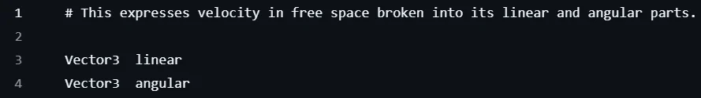

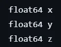

56
ROKEY BOOT CAMP
ROS2 실습- Interface
토픽은고유의인터페이스를가지고있는데이를메시지인터페이스라부르며, 파일로는msg 파일을가르킨다.
예를들어, 위예제에서/turtle1/cmd_vel 토픽은geometry_msgs/msgs/Twist 형태이다. 이름이좀긴데풀어서설명하면기하학관련메시지를모아둔
geometry_msgs 패키지의msgs 분류의Twist 데이터형태라는것이다. 
토픽은고유의인터페이스를가지고있는데이를메시지인터페이스라부르며, 
파일로는msg 파일을가르킨다.
예를들어, 위예제에서/turtle1/cmd_vel 토픽은geometry_msgs/msgs/Twist
형태이다. 이름이좀긴데풀어서설명하면기하학관련메시지를모아둔
geometry_msgs 패키지의msgs 분류의Twist 데이터형태라는것이다. 
Twist 데이터형태를자세히보면Vector3 linear과Vector3 angular 이라고되어
있다. 이는메시지안에메시지를품고있는것으로Vector3 형태에linear
이라는이름의메시지와Vector3 형태에angular 이라는이름의메시지, 즉
2개의메시지가있다는것이며Vector3는다시float64 형태에x, y, z 값이
존재한다. 
다시말해geometry_msgs/msgs/Twist 메시지형태는float64 자료형의
linear.x, linear.y, linear.z, angular.x, angular.y, angular.z 라는이름의메시지인
것이다. 이를통해병진속도3개, 회전속도3개를표현할수있게된다.

57
ROKEY BOOT CAMP
ROS2 실습- Interface
직접 코드로보는방법과$ros2 interface show 명령으로보는방법
교재p161

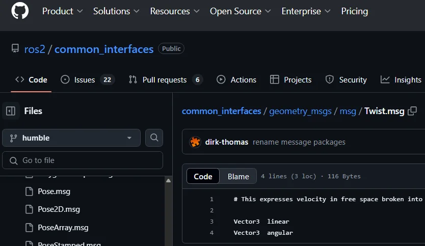

58
ROKEY BOOT CAMP
ROS2 실습- Interface
교재p161
Message interface, msg

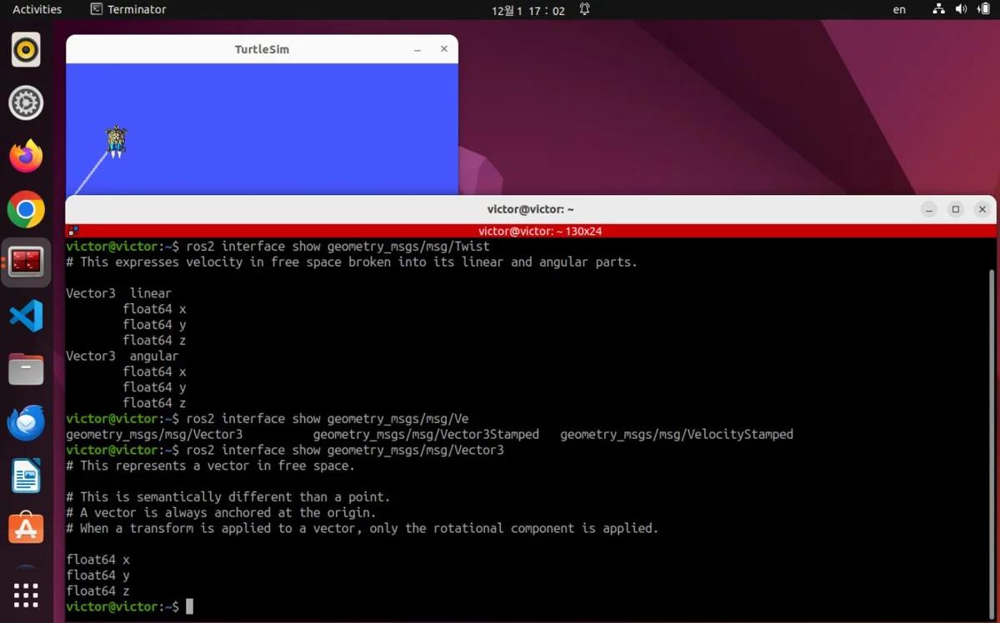

59
ROKEY BOOT CAMP
ROS2 실습- Interface
Interface
▪
list → 현재개발환경의모든msg, srv, action 메시지보여줌
▪
package → msg, srv, action 인터페이스를담고있는패키지목록
▪
package → 옵션에package명을입력하면지정한패키지에포함된interface보여줌
▪
proto → 특정인터페이스형태를입력하면그인터페이스의기본형태를보여줌
Message interface, msg

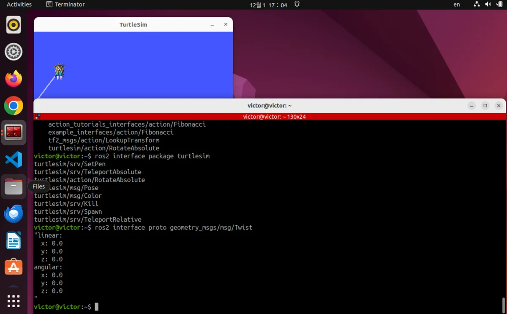

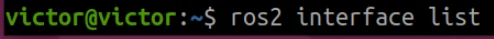

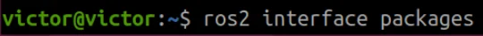

60
ROKEY BOOT CAMP
ROS2 실습- Interface
 요청(Request)
 응답(Response)
 구분
Service interface, srv

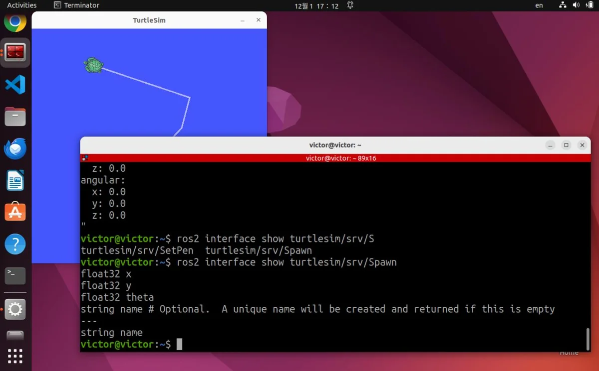

61
ROKEY BOOT CAMP
ROS2 실습- Interface
Action interface, action
 Action 목표
 Action 결과
 Action 피드백
 구분
 구분

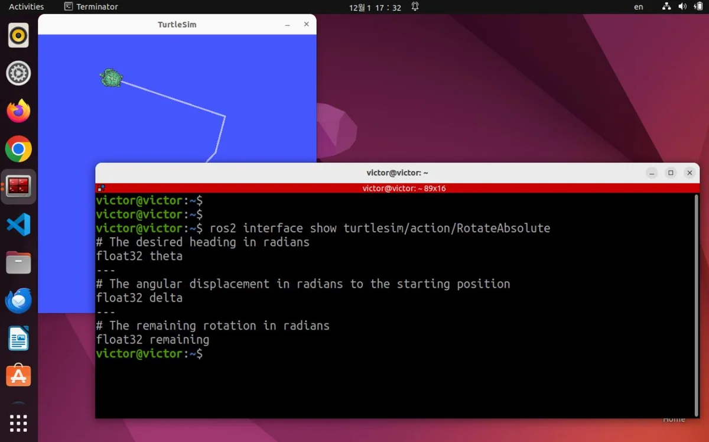

62
ROKEY BOOT CAMP
ROS2 실습- Interface
Node 정보확인
Action list

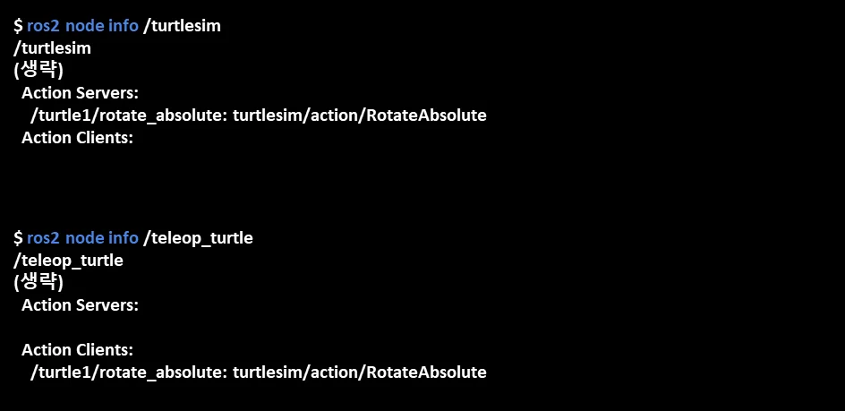

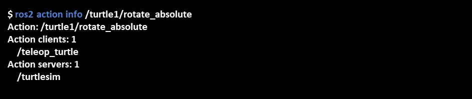

63
ROKEY BOOT CAMP
ROS2 실습- Parameter
파라미터관련기능은RCL(ROS Client Libraries)의기본기능으로다음그림과같이모든노드가자신만의Parameter server를
가지고있고, 그림과같이각노드는Parameter client도포함시킬수있어서자기자신의파라미터및다른노드의파라미터를
읽고쓸수있게된다. 이를활용하면각노드의다양한매개변수를글로벌매개변수처럼사용할수있게되어추가프로그래밍이나
컴파일없이능동적으로변화가능한프로세스를만들수있게된다. 그리고각파라미터는yaml 파일형태의파라미터설정
파일을만들어초기파라미터값설정및노드실행시에파라미터설정파일을불러와서사용할수있기에ROS 2 프로그래밍에
매우유용하게사용할수있다.`
YAML(YAML Ain't Markup Language 또는Yet Another Markup 
Language)은사람이읽기쉬운데이터직렬화형식입니다. 주로구성파일, 
데이터전송, 설정파일등을저장하는데사용됩니다. YAML은JSON과
유사하지만, 더간결하고가독성이뛰어난문법을제공합니다

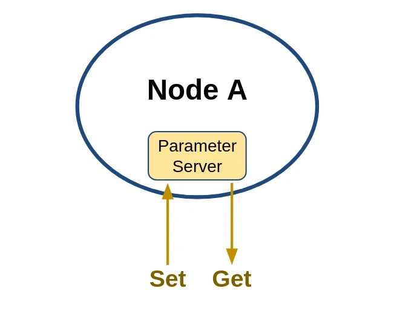


64
ROKEY BOOT CAMP
ROS2 실습– Parameter get & set


65
ROKEY BOOT CAMP
ROS2 실습– Parameter get & set


66
ROKEY BOOT CAMP
ROS2 실습– Parameter get & set


67
ROKEY BOOT CAMP
ROS2 실습– Parameter get & set
Turtlesim parameter 변경후yaml 로딩해보기


68
ROKEY BOOT CAMP
ROS2 실습– Parameter get & set
Turtlesim parameter 변경후yaml 로딩해보기

69
ROKEY BOOT CAMP
ROS2 실습– RQt(Node Graph)

70
ROKEY BOOT CAMP
ROS2 실습– RQt(Topic Monitor)
turtlesim_node 실행
teleop_key 실행
rqt 실행
/turtle1/pose와/turtle1/cmd_vel 체크
키보드로움직이면서value 바뀌는지확인


71
ROKEY BOOT CAMP
ROS2 실습– RQt(Message Publisher)


72
ROKEY BOOT CAMP
ROS2 실습– RQt(Service Caller)

73
ROKEY BOOT CAMP
ROS2 실습– RQt(Parameter Reconfigure)


74
ROKEY BOOT CAMP
ROS2 실습– RQt(Plot)


75
ROKEY BOOT CAMP
ROS2 실습– RQt(image & console)

76
ROKEY BOOT CAMP
ROS2 실습– RQt(Image)
영상: cam2image.webm


77
ROKEY BOOT CAMP
ROS2 실습– RQt(Console)
Turtlesim과teleop_key 실행
cam2image 실행
rqt →Logging →Console에서확인

78
ROKEY BOOT CAMP
ROS2 실습


79
ROKEY BOOT CAMP
ROS2 실습- Build
:~$ mkdir –p ~/ros2_ws/src

80
ROKEY BOOT CAMP
ROS2 실습
:~$ git clone https://github.com/ros/ros_tutorials-git -b humble


81
ROKEY BOOT CAMP
ROS2 실습
$colcon build를하고나면build install log 등3개의디렉토리가생긴다
colcon : Concept of Libraries for Compilers Installation


82
ROKEY BOOT CAMP
ROS2 실습

83
ROKEY BOOT CAMP
ROS2 실습
import rclpy
from rclpy.node import Node
from geometry_msgs.msg import Twist
import sys
import termios
import tty
# 키보드입력을처리하는클래스
class TurtleTeleopKey(Node):
def __init__(self):
super().__init__('turtle_teleop_key')
self.publisher = self.create_publisher(Twist, '/turtle1/cmd_vel', 10)
self.msg = Twist()
self.print_instructions()
def print_instructions(self):
print("Control Your Turtle!")
print("Use arrow keys to move: ")
print("↑: Forward, ↓: Backward, →: Turn Right, ←: Turn Left")
print("Press 'q' to quit.")
def get_key(self):
fd = sys.stdin.fileno()
old_settings = termios.tcgetattr(fd)
try:
tty.setraw(sys.stdin.fileno())
key = sys.stdin.read(1)
finally:
termios.tcsetattr(fd, termios.TCSADRAIN, old_settings)
return key
def run(self):
while True:
key = self.get_key()
if key == 'q':  # 종료
break
elif key == '\x1b[A':  # ↑
self.msg.linear.x = 2.0
self.msg.angular.z = 0.0
elif key == '\x1b[B':  # ↓
self.msg.linear.x = -2.0
self.msg.angular.z = 0.0
elif key == '\x1b[C':  # →
self.msg.linear.x = 0.0
self.msg.angular.z = -2.0
elif key == '\x1b[D':  # ←
self.msg.linear.x = 0.0
self.msg.angular.z = 2.0
else:
self.msg.linear.x = 0.0
self.msg.angular.z = 0.0
self.publisher.publish(self.msg)
print("Exiting...")
def main():
rclpy.init()
node = TurtleTeleopKey()
node.run()
node.destroy_node()
rclpy.shutdown()
if __name__ == '__main__':
main()
Turtle_teleop_key.py(for test only)

84
ROKEY BOOT CAMP
ROS2 실습
Turtle_teleop_key.cpp


85
ROKEY BOOT CAMP
ROS2 실습– package build - my_first_package
※ Package 생성시디렉토리→ ros2_ws/src
※ Build 하는경우working 디렉토리→ ros2_ws

86
ROKEY BOOT CAMP
ROS2 실습
1) 전체패키지를빌드할때
$ cd ~/robot_ws && colcon build --symlink-install
$ cd ~/robot_ws && colcon build --symlink-install --packages-select [패키지이름]
▪vcstool (버전컨트롤시스템툴)
$ wget https://raw.githubusercontent.com/ros2/ros2/humble/ros2.repos
$ vcs import src < ros2.repos
$ sudo rosdep init
$ rosdep update
$ rosdep install --from-paths src -y --ignore-src
$ bloom-release --ros-distro humble --track humble awesome_pkg
2) 해당패키지만빌드할때
▪rosdep (의존성관리툴)
▪bloom (바이너리패키지관리툴)

87
ROKEY BOOT CAMP
ROS2 실습
패키지파일사용방법ROS 2 프로그래밍전에알아둬야할필수사전정보
●
패키지설정파일
package.xml(ROS pkg의필수구성요소)
●
빌드설정파일
CMakeLists.txt(순수Python pkg는CMakeLists.txt 파일없음)
●
파이썬패키지설정파일
setup.py(순수한ROS2 Python pkg에만사용하는배포를위한설정파일)
●
파이썬패키지환경설정파일
setup.cfg(순수한ROS2 Python pkg에만사용하는배포를위한구성파일)
●
RQt 플러그인설정파일
plugin.xml(RQT plugin으로pkg를작성할때의필수구성요소)
●
패키지변경로그파일
CHANGELOG.rst(pkg업데이트내역 기술, 개발 이력추적)
●
라이선스파일
LICENSE(pkg코드에사용된라이센스기술)
●
패키지설명파일
README.md(markdown 파일)

88
ROKEY BOOT CAMP
ROS2 실습– 패키지설정파일(package.xml)
패키지설정파일은ROS 패키지의필수구성요소로서패키지의정보를기술하는파일
기술하는내용으로는패키지이름, 저작자, 라이선스, 의존성패키지등이있으며,
XML 형식으로기술하고파일명은`package.xml`을사용
사용되는빌드툴, 의존성패키지들이모두기술되기에빌드및패키지설치, 사용에있어서매우중요한파일
모든ROS 패키지의필수파일로각패키지당무조건1개의패키지설정파일(package.xml)을포함
<?xml version="1.0"?>
<?xml-model href="http://download.ros.org/schema/package_format3.xsd" 
schematypens="http://www.w3.org/2001/XMLSchema"?>
<package format="3">
<name>my_first_ros_rclcpp_pkg</name>
<version>0.0.0</version>
<description>TODO: Package description</description>
<maintainer email="pyo@robotis.com">pyo</maintainer>
<license>TODO: License declaration</license>
<buildtool_depend>ament_cmake</buildtool_depend>
<depend>rclcpp</depend>
<depend>std_msgs</depend>
<test_depend>ament_lint_auto</test_depend>
<test_depend>ament_lint_common</test_depend>
<export>
<build_type>ament_cmake</build_type>
</export>
</package>
<?xml version="1.0"?>
<?xml-model href="http://download.ros.org/schema/package_format3.xsd" 
schematypens="http://www.w3.org/2001/XMLSchema"?>
<package format="3">
<name>my_first_ros_rclpy_pkg</name>
<version>0.0.0</version>
<description>TODO: Package description</description>
<maintainer email="pyo@robotis.com">pyo</maintainer>
<license>TODO: License declaration</license>
<depend>rclpy</depend>
<depend>std_msgs</depend>
<test_depend>ament_copyright</test_depend>
<test_depend>ament_flake8</test_depend>
<test_depend>ament_pep257</test_depend>
<test_depend>python3-pytest</test_depend>
<export>
<build_type>ament_python</build_type>
</export>
</package>

89
ROKEY BOOT CAMP
ROS2 실습– 패키지설정파일(package.xml)
항목
내용
<?xml>
문서문법을정의하는문구로아래의내용은xml 버전1.0을따르고있다는것을알린다.
<package> 
이구문부터맨끝의</package>까지가ROS 패키지설정부분이다. 세부사항으로format="3" 이라고패키지설정파일의버전을기재한다. ROS 2는3를
사용하면된다.
<name> 
패키지의이름이다. 패키지를생성할때입력한패키지이름이사용된다. 다른옵션도마찬가지지만이는사용자가원할때언제든지변경할수있다.
<version>
패키지의버전이다. 자유롭게지정할수있는데나중에패키지를바이너리패키지로공개한다면버전관리에사용되므로신중할필요가있다.
<description>
패키지의간단한설명이다. 보통2~3 문장으로기술한다.
<maintainer>
패키지관리자의이름과이메일주소를기재한다.
<license> 
라이선스를기재한다. Apache 2.0, BSD, MIT, Boost Software License, GPLv2, GPLv3, LGPLv2.1, LGPLv3, Proprietary 등을기재하면된다.
<url> 
패키지를설명하는웹페이지또는버그관리, 소스코드저장소등의주소를기재한다. 이종류에따라type에website, bugtracker, repository를대입하면된다.
<author>
패키지개발에참여한개발자의이름과이메일주소를적는다. 복수의개발자가참여한경우에는바로다음줄에<author> 태그를이용하여추가로넣음
<buildtool_depend> 빌드툴의의존성을기술한다.
<build_depend> 
패키지를빌드할때필요한의존패키지이름을적는다.
<exec_depend> 
패키지를실행할때필요한의존패키지이름을적는다.
<test_depend>
패키지를테스트할때필요한의존패키지이름을적는다.
<export>
위에서명시하지않은확장태그명을사용할때쓰인다. 빌드타입을적는<build_type>, RViz 플러그인에사용되는<rviz>, RQt 플러그인에사용되는<rqt_gui>, 
deprecated되는패키지일경우유저에게알릴수있는<deprecated> 태그등이있다.

90
ROKEY BOOT CAMP
ROS2 실습– 빌드설정파일(CMakeList.txt)
ROS 2의빌드시스템인ament에서는C++ 프로그래밍언어를사용한패키지나
RQt Plugin의경우CMake(Cross Platform Make)를이용하고있고패키지폴더의
`CMakeLists.txt`라는파일에빌드환경을기술하여사용하고있다.
이빌드설정파일에실행파일생성, 의존성패키지우선빌드, 링크생성등을
설정하게되어있다. ROS에서CMake를이용하는이유는ROS 패키지를멀티
플랫폼에서빌드할수있게하기위함이다. Make가유닉스계열만지원하는것과
달리, CMake는유닉스계열인리눅스, BSD, OS X뿐만아니라윈도우즈계열도
지원하기때문이다. 
또한CMakeLists.txt은Visual Studio, Eclipse, Qt Creator 등다양한IDE에서
기본으로지원하여쉽게사용할수있다.
cmake_minimum_required(VERSION 3.5)
project(my_first_ros_rclcpp_pkg)
# Default to C99
if(NOT CMAKE_C_STANDARD)
set(CMAKE_C_STANDARD 99)
endif()
# Default to C++14
if(NOT CMAKE_CXX_STANDARD)
set(CMAKE_CXX_STANDARD 14)
endif()
if(CMAKE_COMPILER_IS_GNUCXX OR CMAKE_CXX_COMPILER_ID MATCHES "Clang")
add_compile_options(-Wall -Wextra -Wpedantic)
endif()
# find dependencies
find_package(ament_cmake REQUIRED)
find_package(rclcpp REQUIRED)
find_package(std_msgs REQUIRED)
if(BUILD_TESTING)
find_package(ament_lint_auto REQUIRED)
# the following line skips the linter which checks for copyrights
# uncomment the line when a copyright and license is not present in all source files
#set(ament_cmake_copyright_FOUND TRUE)
# the following line skips cpplint (only works in a git repo)
# uncomment the line when this package is not in a git repo
#set(ament_cmake_cpplint_FOUND TRUE)
ament_lint_auto_find_test_dependencies()
endif()
ament_package()

91
ROKEY BOOT CAMP
ROS2 실습– 패키지설정파일(package.xml)
항목
내용
name
패키지의이름
Version
패키지의버전
Packages
의존하는패키지, 하나씩나열해도되지만`find_packages()`를기입해주면자동으로의존하는패키지를찾아준다.
data_files
이패키지에서사용되는파일들을기입하여함께배포한다.
`ROS`에서는주로`resource` 폴더내에있는`ament_index`를위한패키지의이름의빈파일이나`package.xml`, `*.launch.py`, `*.yaml` 등을기입한다.
install_requires
의존하는패키지, 이패키지를`pip`을통해설치할때이곳에기술된패키지들을함께설치하게된다.
`ROS`에서는`pip`로설치하지않기에`setuptools`, `launch`만을기입해준다.
tests_require
테스트에필요한패키지, `ROS`에서는`pytest`를사용한다.
zip_safe
설치시zip 파일로아카이브할지여부를설정한다.
author
author_email
maintainer
maintainer_email
저작자, 관리자의이름과이메일을기입한다.
Keywords
이패키지의키워드, Python Package Index (PyPI) 배포시검색하여이패키지를찾을수있도록한다.
Classifiers
PyPI에등록될메타데이터설정으로`PyPI` 페이지의좌측Meta란에서확인가능하다.
Description
패키지설명을기입한다.
License
라이선스종류를기입한다.
entry_points
플랫폼별로콘솔스크립트를설치하도록콘솔스크립트이름과호출함수를기입한다.
name
패키지의이름

92
ROKEY BOOT CAMP
ROS2 실습– 파이썬패키지설정파일(Setup.py)
from setuptools import setup
package_name = 'my_first_ros_rclpy_pkg'
setup(
name=package_name,
version='0.0.0',
packages=[package_name],
data_files=[
('share/ament_index/resource_index/packages',
['resource/' + package_name]),
('share/' + package_name, ['package.xml']),
],
install_requires=['setuptools'],
zip_safe=True,
maintainer='pyo',
maintainer_email=‘victor@datacore.kr,
description='TODO: Package description',
license='TODO: License declaration',
tests_require=['pytest'],
entry_points={
'console_scripts': [
],
},
)

93
ROKEY BOOT CAMP
ROS2 실습– Publisher & Subscriber(my_first_package)
※ Package 생성시디렉토리→ ~ros2_ws/src
※ Build 하는경우work Space 디렉토리→ ~/ros2_ws


94
ROKEY BOOT CAMP
ROS2 실습– Publisher & Subscriber(my_first_package)


95
ROKEY BOOT CAMP
ROS2 실습– Publisher & Subscriber(my_first_package)


96
ROKEY BOOT CAMP
ROS2 실습– Publisher & Subscriber(my_first_package)
※ source 하지않고실행해보기


97
ROKEY BOOT CAMP
ROS2 실습– Publisher & Subscriber(my_first_package)
※ .bashrc example


98
ROKEY BOOT CAMP
ROS2 실습– Publisher & Subscriber(my_first_package)


99
ROKEY BOOT CAMP
ROS2 실습– Publisher & Subscriber(my_first_package)
command 창에서실행할node name
my_first_node
my_subscriber
→


100
ROKEY BOOT CAMP
ROS2 실습– Publisher & Subscriber(my_first_package)


101
ROKEY BOOT CAMP
ROS2 실습– Publisher & Subscriber(my_first_package)


102
ROKEY BOOT CAMP
ROS2 실습– Publisher & Subscriber(my_first_package)


103
ROKEY BOOT CAMP
ROS2 실습– Publisher & Subscriber(my_first_package)


104
ROKEY BOOT CAMP
ROS2 실습– Publisher & Subscriber(my_first_package)


105
ROKEY BOOT CAMP
ROS2 실습
ROS의중요한개발도구들
•
ROS는GUI기반이아닌, 터미널에서command line 방식으로동작을시킬수있음
•
여기에더해서ROS 사용의효율을높이기위해서다양한개발도구를제공함
rViz
gazebo
rqt


106
ROKEY BOOT CAMP
ROS2 실습
rViz (ROS Visualization Tool)
•
rViz는ROS에서얻어지는데이터를시각화(visualization)하는도구임
•
IMU 데이터의시각화
•
URDF 파일을이용한로봇암동작의시각화
•
라이다 센서데이터시각화를통한SLAM 적용 
https://velog.io/@y2k4388/rViz%EB%A5%BC-%EC%9D%B4%EC%9A%A9%ED%95%9C-%EC%84%BC%EC%84%9C-%EB%8D%B0%EC%9D%B4%ED%84%B0-%EC%8B%9C%EA%B0%81%ED%99%94


107
ROKEY BOOT CAMP
ROS2 실습
Robot URDF 파일을통한로봇암시각화
•
rViz의기능중URDF 파일을읽어서로봇암의동작을시각화하는기능이있음
•
•
URDF(Universal Robot description Format)이란? 
•
URDF는 xml기반의텍스트파일로, 로봇의형태와동작을 정의한파일임
•
ROS 초보자가URDF 파일을작성하기는어렵지만, 
어떤로봇에URDF 파일이존재하면, 
•
이로봇을rViz를통해서가상으로동작시켜볼수있음
•
URDF 파일로할수있는것
•
로봇의구조를정의
•
로봇동작의시각화
•
로봇의충돌모델정의

108
ROKEY BOOT CAMP
ROS2 실습
Robot URDF 파일의구성
•
URDF 파일은다음과같은요소로구성되어있음
•
Link, joint
•
Link 
•
로봇을 구성하는구성요소중하나, 3가지속성이있음
•
<inertial>  링크의관성정보. Link의관성중심, 질량, 관성계수등을기록함
•
<visual> rViz 같은시각화도구에서로봇을시가화할때사용되는속성들을정의함
•
<collision> 물리적인충돌속성정의, 충돌모델정의
•
Joint 
•
Link 와link를연결하는로봇구성요소. URDF는6가지joint 타입이있음
•
<origin> 부모 link에서자식링크에변환정보
•
<parent> 부모 link 이름
•
<child> 자식link 이름
https://wiki.ros.org/urdf/Examples 
https://medium.com/newworld-kim/ros-urdf-b6979bfa31aa


109
ROKEY BOOT CAMP
ROS2 실습
Robot URDF 파일의예– pan-tilt 로봇
<?xml version=“1.0”?>
<robot name=“pan_tilt”>
 
<link name=“base_link”>
 
</link>
 
<joint name=“pan_joint” type=“revolute”>
         </joint>
 
<link name=“pan_link”>
 
</link>
 
<joint name=“tilt_joint” type=“revolute”>
         </joint>
  
<link name=“tilt_link”>
 
</link>
</robot>

110
ROKEY BOOT CAMP
ROS2 실습
URDF 파일pan-tilt 로봇– link - joint 예
<link name="base_link">
    <visual>
     중간생략
 
</visual>
    <collision>
중간생략
    </collision>
중간생략
 </link>
 <joint name="pan_joint" type="revolute">
     <parent link="base_link"/>
     <child link="pan_link"/>
중간생략
</joint>
<link name="pan_link">
중간생략
</link>


111
ROKEY BOOT CAMP
ROS2 실습
URDF 파일pan-tilt 로봇– link 상세
<link name="base_link">
    <visual>
      <geometry>
 
<cylinder length="0.01" radius="0.2"/>
      </geometry>
      <origin rpy="0 0 0" xyz="0 0 0"/>
      <material name="yellow">
        <color rgba="1 1 0 1"/>
      </material>
    </visual>
    <collision>
      <geometry>
 
<cylinder length="0.03" radius="0.2"/>
      </geometry>
      <origin rpy="0 0 0" xyz="0 0 0"/>
    </collision>
    <inertial>
 
<mass value="1"/>
 
<inertia ixx="1.0" ixy="0.0" ixz="0.0" iyy="1.0" iyz="0.0" izz="1.0"/>
    </inertial>
  </link>

112
ROKEY BOOT CAMP
ROS2 실습
URDF 파일pan-tilt 로봇– joint 상세
<joint name="pan_joint" type="revolute">
    <parent link="base_link"/>
    <child link="pan_link"/>
    <origin xyz="0 0 0.1"/>
    <axis xyz="0 0 1" />
    <limit effort="300" velocity="0.1" lower="-3.14" upper="3.14"/>
    <dynamics damping="50" friction="1"/>
  </joint>


ROKEY BOOT CAMP
수고하셨습니다.

