# 강의_3기_ROS2입문_1차시

ROS2 프로그래밍입문

전체목차(9차시)
## 프로그래밍기초
## 인터페이스패키지
## 인터페이스프로그래밍(응용_1)
## 인터페이스프로그래밍(응용_2)
## rclpy 이해
## ROS2 응용
## ROS2 복습(1, 2, 3)
ROS2 프로그래밍입문(1차시)
1. ROS2 프로그래밍기초

## ROS2 프로그래밍기초
1. ROS2 프로그래밍이란?
2. 프로그래밍규칙
3. ROS2 Setup Tips
4. Python을이용한패키지생성
## 로봇SW
ROS2 프로그래밍이란?
로봇SW

## Message
ROS2 프로그래밍이란?
Message ㅡTopic
[Topic]
• 비동기식단방향메시지송수신방식으로, msg 인터페이스
형태의메시지를주고받는Publisher와Subscriber 간의통신
두번째키워드
• ROS2 메시지통신에서가장많이사용하며, 1:1 통신이기본
이지만N:N 통신도가능
• 비동기성과연속성을가지기때문에센서값전송이나항시
정보를주고받아야하는부분에서주로사용

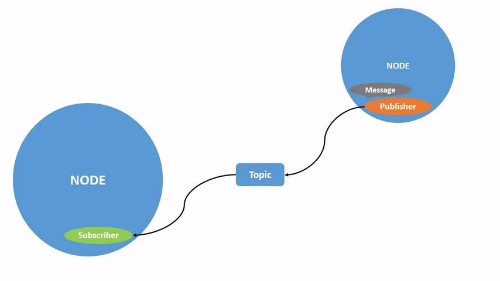

## Message
ROS2 프로그래밍이란?
Message ㅡService
[Service]
• 동기식양방향메시지송수신방식
• 서비스요청(Request)을보내는Service Client, 응답(Response)
을보내는쪽을Service Server로구분
• 인터페이스는srv를사용
• 동일한서비스서버에대해복수의클라이언트를연결할
수있지만, 서비스응답은서비스요청이있었던서비스
클라이언트에대해서만응답함

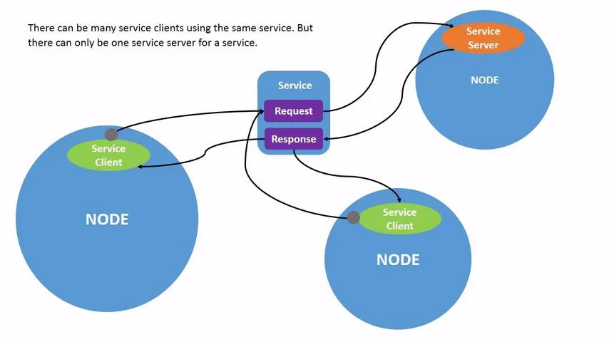

## Message
ROS2 프로그래밍이란?
Message ㅡAction
[Action]
• 비동기식, 동기식양방향메시지송수신방식
• 목표(Goal)를설정하는Action Client와목표를수행하는
Action Server 간의통신
• Action Server는목표수행중중간결과를피드백
(Feedback)으로, 최종결과를결과(Result)로전송

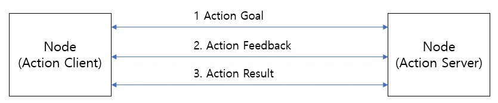

## Message
ROS2 프로그래밍이란?
Message ㅡAction
• ROS2에서의액션은목표전달(send_goal), 목표취소(cancel_goal), 결과받기(get_result)를위한
토픽과서비스통신을혼합하여사용
• 비동기방식에서원하는타이밍에적절한액션수행을위해목표상태(goal_state)에도입
하여, 목표전달후상태머신을구동하여액션프로세스추적
• 즉, 액션목표전달이후액션상태를액션클라이언트에전달하여, 비동기및동기방식이
혼재된액션의처리를지원

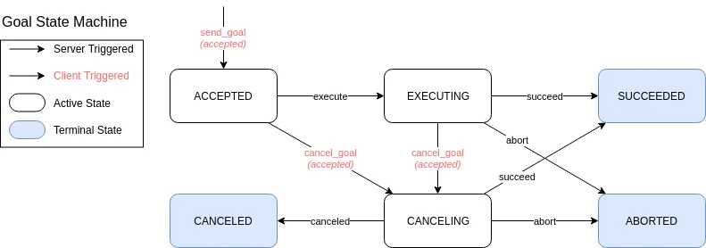

ROS2 프로그래밍이란?
ROS1과ROS2비교

ROS2 프로그래밍이란?
ROS2 Programming
## 주요역할
ROS2에서의프로그래밍역할
• ROS2에서"프로그래밍"의역할은로봇시스템을설계하고제어하는데중요
• ROS2는로봇애플리케이션을개발하는데사용되는오픈소스소프트웨어프레임워크로, 복잡한
로봇작업을분리된모듈로나누어관리할수있게해주며, 이를통해다양한로봇하드웨어와소
프트웨어간의상호작용을쉽게할수있음
1. 노드개발
• ROS2는로봇시스템을여러개의독립적인노드로나누어작업됨
• 각노드는특정작업을수행하며, 프로그래밍을통해이러한노드를작성하고, 다른노드와데이터를
교환하거나상호작용하도록만들수있음
• 예를들어, 센서데이터를처리하는노드, 로봇의모터를제어하는노드등개발가능

ROS2 프로그래밍이란?
ROS2 Programming
## 주요역할
2. 토픽(Topic)과메시지(Message) 관리
• ROS2에서는노드간의통신이토픽을통해이루어짐
• 각노드는특정토픽을구독하거나발행하여데이터송수신
• 프로그래밍을통해토픽과메시지형식을정의하고, 이를통해로봇시스템의다양한부품들이
정보를교환하도록함
3. 서비스(Service)와액션(Action)
• ROS2는비동기작업을처리하는서비스를제공
• 프로그래밍을통해특정요청에대해서버와클라이언트간의요청-응답방식으로통신인터페이스
개발가능
• 또한, 액션을통해긴시간이걸리는작업을비동기적으로처리가능
• 예를들어, 로봇이경로를따라가거나특정작업을완료하는데시간이걸릴때, 이를처리하기위한
프로그래밍이필요

ROS2 프로그래밍이란?
ROS2 Programming
## 주요역할
4. 로봇하드웨어제어
• ROS2는로봇하드웨어를제어하는다양한라이브러리와드라이버를제공
• 프로그래밍을통해로봇의센서, 카메라, 모터, 로봇팔등을제어하는코드를작성가능
• 예를들어, 로봇팔을제어하기위한역기구학(Inverse Kinematics) 알고리즘을구현하거나, LiDAR
센서데이터를처리하는프로그램을작성
5. 로봇동작의논리구현
• ROS2는복잡한로봇동작을관리할수있는강력한도구들을제공
• 이를통해로봇의동작을제어하는논리를작성가능
• 예를들어, 로봇이장애물을회피하면서목적지로가는경로를계획하는알고리즘을프로그래밍
하여개발

ROS2 프로그래밍이란?
ROS2 Programming
## 주요역할
6. 시뮬레이션(Simulation)
• ROS2는Gazebo와같은시뮬레이션도구와함께사용되어실제하드웨어없이로봇을테스트하고
개발
• 프로그래밍을통해시뮬레이션환경에서로봇의동작을제어하고, 실제환경에서의동작을예측
하며, 로봇의성능을평가
7. 분산시스템구현
• ROS2는분산시스템을기반으로설계되어있으며, 이를통해여러컴퓨터가네트워크를통해연결
되어작업을분담
• 프로그래밍을통해여러장치에서실행되는ROS2 노드간의통신을설정하고, 분산환경에서로봇
시스템을조정하는작업수행

ROS2 프로그래밍이란?
ROS2 Programming
## Conclusion
효율적인로봇개발
• 로봇하드웨어와소프트웨어를연결하는데필요한공통인터페이스제공
• 노드라는모듈화된구조를가지며각각의노드는독립적으로개발, 테스트및배포할수있어
대규모시스템에서도협업이용이
• ROS2는전세계적인커뮤니티지원과방대한오픈소스패키지를제공
• ROS2는센서, 액추에이터, 카메라등다양한로봇하드웨어와호환됨
• Gazebo나rviz와같은시뮬레이터와통합하여실제하드웨어없이도복잡한알고리즘을테스트
하고디버깅가능
• Python, C++, MATLAB 등다양한언어를지원하여개발자가선호하는언어를사용할수있음

프로그래밍규칙
Code Style
## 코드스타일가이드
• 오픈소스커뮤니티에서가장많이사용되고있는인기있는가이드라인이존재
• 협업시코드가독성등을위하여코드스타일가이드라인을따르는것이필요
## 기본이름규칙
• 파일이름: 모두소문자로snake_case 규칙따름
• ROS2 인터페이스파일: CamelCases 규칙따름
• 특정목적에의해만들어지는파일:   package.xml
CMakeLists.txt
README.md
LICENSE
CHANGELOG.rst
.gitignore
.travis.yml
*.repos

프로그래밍규칙
Python Style
## 기본규칙
• Python 3(Python 3.5 이상)
## 라인길이
• 최대100 문자
## 이름규칙(Naming)
• CamelCased, snake_case, ALL_CAPITALS 만사용
CamelCased: 타입, 클래스
snake_case: 파일, 패키지, 인터페이스, 모듈, 변수, 함수, 메소드
ALL_CAPITALS: 상수
Python Enhancement Proposals(PEPs)의PEP 8을준수
Wiki 참고: https://wiki.ros.org/PyStyleGuide

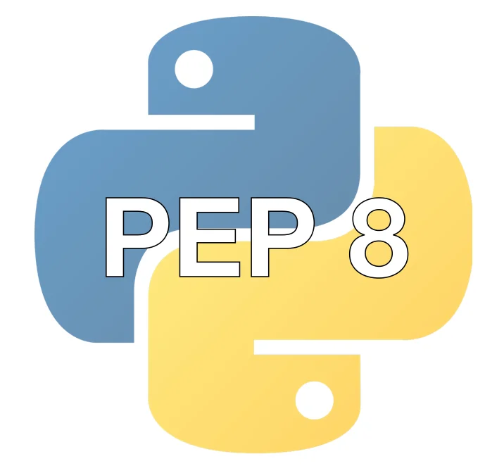

프로그래밍규칙
Python Style
## 주석(Comments)
• 문서주석:"""
• 구현주석: #
## 린터(Linters)
• ament_flake8
## 기타
• 모든문자는큰따옴표(")가아닌작은따옴표(')를사용
## 공백문자(Spaces) vs. 탭(Tabs)
• 기본들여쓰기(indent): 공백문자(space) 4개사용─ 탭(tab)문자사용금지
• 괄호(Brace)
• 자료형에따라적절한괄호(대괄호[ ],중괄호{ },소괄호( )) 사용
• list=[ ]
• dictionary={'age': 30, 'name': '홍길동'}
• tuple=( )
K&R
BSD
GNU

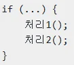

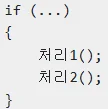

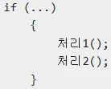

프로그래밍규칙
C++ Style
## C++ Style
Google C++ Style Guide + ROS에맞게약간의수정
Wiki 참고: https://wiki.ros.org/PyStyleGuide
## 기본규칙
• C++14 Standard
## 라인길이
• 최대100 문자
## 이름규칙(Naming)
• CamelCased, snake_case, ALL_CAPITALS 만사용
• CamelCased: 타입, 클래스, 구조체, 열거형
• snakecase: 파일, 패키지, 인터페이스, 네임스페이스, 변수, 함수, 메소드
• ALL_CAPITALS: 상수, 매크로
• 소스파일: ‘.cpp’ 확장자
• 헤더파일: ‘.hpp’ 확장자
• 전역변수(global variable): 되도록사용X, 사용할경우’g’접두어붙이기
• 클래스멤버변수(class member variable): 마지막에밑줄(_) 붙이기

프로그래밍규칙
C++ Style
## 공백문자(Spaces) vs. 탭(Tabs)
• 기본들여쓰기(indent): 공백문자(space) 2개
└ 탭(tab)문자사용금지
•
Class의‘public:’, ‘protected:’, ’private:’:
들여쓰기사용X
## 괄호(Brace)
• 모든if, else, do, while, for 구문: 괄호({}) 사용
## 주석(Comments)
• 문서주석: /* */
• 구현주석: //
## 린터(Linters)
• C++ 코드스타일의자동오류검출:
ament_cpplint, ament_uncrustify
•
정적코드분석: ament_cppcheck
## 기타
• Boost 라이브러리의사용은가능한피하기
• 포인트구문: char * c;처럼사용하기
└ char* c; 이나char *c; 처럼사용하지않는다
• 중첩템플릿: set<list<string>>처럼사용하기
└ set < list <string> > 또는
set < list <string> >처럼
사용하지않는다

프로그래밍규칙
파일명규칙
• 패키지명, 스크립트파일명은snake_case를사용
• 패키지생성시만들어지는파일의경우규칙을따르지
않음

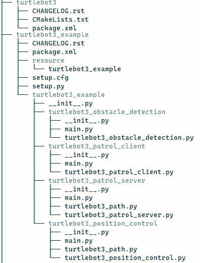

ROS2 Setup Tips
설정스크립트
• ROS2 설정스크립트를사용하지않고
ROS2를실행하여오류가발생하는경우가
종종있음
• 이를방지하기위하여/.bashrc에미리
setup.bash를선언하여사용
• gedit ~/.bashrc 또는nano ~/.bashrc 실행
• 제일하단에아래스크립트추가
. . .

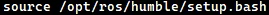

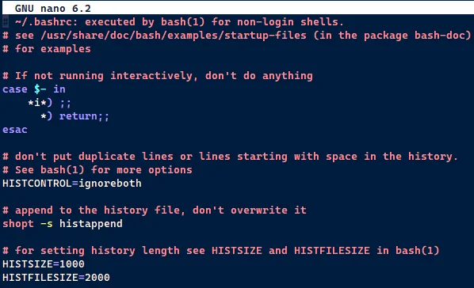

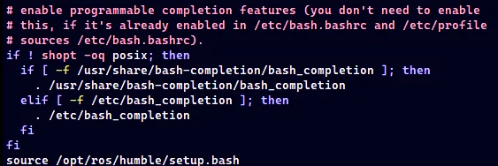

ROS2 Setup Tips
Setup.bash vs local_setup.bash
ROS1에서는setup.bash만사용하여현재워크스페이스의설정스크립트를실행하고, ROS2에서는setup.bash와local_setup.bash
두가지를사용하는데,  setup.bash와local_setup.bash의차이를이해하기위해서는Underlay와Overlay에대한이해가필요
## Underlay
• ROS 환경에서사용가능한기본ROS 설치를말함
(일반적으로ROS Release로설치되는ROS 코어및표준
라이브러리와도구를포함)
•
Underlay는시스템에설치되며,
‘opt/ros/<ROS_DISTRO>’
디렉토리에위치
•
ROS Underlay는기본라이브러리, 도구, 메시지및
서비스정의+기본ROS 기능을제공
## Overlay
• User가설치하거나개발중인패키지를포함하는사용자
지정ROS 작업공간
(사용자는ROS 자체패키지및노드를추가, 확장)
•
사용자홈디렉토리나사용자가지정한다른디렉토리에
위치할수있음
•
ROS패키지개별적빌드및사용자작업공간에설치가능
(사용자지정노드및라이브러리를ROS 환경에추가가능)
•
사용자지정패키지와노드를제공
•
Overlay 개발환경은설치된ROS 패키지들에의존하기에
Underlay 개발환경에종속적
•
설정스크립트(Setup script)라고하는setup.bash의호출
순서및사용방법이조금씩달라짐

ROS2 Setup Tips
Setup.bash vs local_setup.bash
## Setup.bash와local_setup.bash는설정스크립트(Setup script)라고하며, Underlay와Overlay
구분없이모든워크스페이스에존재하며각설정스크립트마다사용목적은조금씩다름
local_setup.bash
•
현재작업중인ROS의워크스페이스의환경설정에사용
•
직접적으로설치된경로가아니므로User가직접작성하거나다운로드한ROS패키지와노드의환경변수를
설정하여해당워크스페이스에사용자지정패키지및노드를실행하는데필요
•
‘install/local_setup.bash’는사용자의워크스페이스디렉토리내에위치해야하며, 해당디렉토리에는build,
install 디렉토리가있어야함
setup.bash
•
‘/opt/ros/humble’에설치된ROS의릴리스환경을설정하는데사용
•
현재터미널세션에ROS의패키지, 라이브러리의환경변수를추가하여해당ROS 릴리스의도구및패키지
를사용할수있게함
→ 요약하자면/opt/ros/humble/setup.bash : ROS의기본설치설정
install/local_setup.bash : 사용자가직접개발하거나다운로드한패키지설정에사용

ROS2 Setup Tips
colcon_cd
## colcon_cd
• 터미널창에서‘colcon_cd’ 명령을사용하면, 셸(shell)의현재워크스페이스를패키지디렉터리
로빠르게변경가능
• ROS1의ros_cd와비슷한기능
• ./bashrc에아래와같이추가

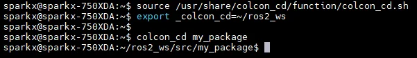

ROS2 Setup Tips
rosdep
## rosdep
• 의존성관리툴인rosdep 명령어를사용하면손쉽게패키지의의존성문제를해결
• rosdep은패키지환경설정파일인package.xml의<depend> 옵션과같은의존성정보를확인
하여의존성패키지들을설치해주기때문에의존성패키지가많은패키지의경우, 위명령어를
사용하면의존성패키지설치및관리에있어서매우편하게사용가능

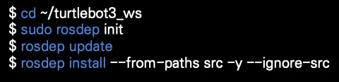

ROS2 Setup Tips
ROS_LOCALHOST_ONLY
## ROS_LOCALHOST_ONLY
• DDS 기반RMW 구현의기본동작은멀티캐스트를통해도달가능한모든노드를검색하도록되어있음
• 이는같은네트워크를사용할때의도치않게같은네트워크내의다른개발자와DDS로연결됨에따라
불편함초래
• ROS_LOCALHOST_ONLY 환경변수를True 설정하는것으로단일컴퓨터안에서만DDS 사용이가능
• 원치않는컴퓨터간의DDS 통신을방지하려면아래와같은설정필요
• ROS2 Humble의다음버전인ROS2 Iron 부터는ROS_LOCALHOST_ONLY를더이상사용하지않음
• 보다세분화된옵션을사용할수있는ROS-AUTOMATIC-DISCOVERY-RANGE로변경
(참고링크: https://docs.ros.org/en/iron/Tutorials/Advanced/Improved-Dynamic-Discovery.html)
•
SUBNET, LOCALHOST, OFF, SYSTEM-DEFAULT, ROS-STATIC-PEERS 값으로세부적설정가능
•
해당기능은추후ROS2 Jazzy로의버전이전시참고
export ROS_LOCALHOST_ONLY=1

ROS2 Setup Tips
ROS_DOMAIN_ID & Namespace
• ROS2에서동일네트워크를여러사용자와공유하는경우, 동일한ROS_DOMAIN_ID를설정하여
토픽정보를공유할수있음
• 독립적인작업이필요한경우, 서로다른ROS_DOMAIN_ID를설정하여정보공유를방지할수있음
• 또는ROS의Namespace 기능을활용하여노드의고유이름을설정하여정보공유를방지할수있음

ROS2 Setup Tips
ROS_DOMAIN_ID
## DDS(Data Distribution Service) 도메인
•
ROS2는DDS라는미들웨어를사용하여노드간의메
시지전달과통신을처리
•
ROS_DOMAIN_ID는DDS 도메인을식별하는데사용
되며, 이는네트워크상의노드들이서로를찾고통신
할수있도록함
## 네트워크분리
•
서로다른ROS_DOMAIN_ID 값을가진노드들은서로
통신할수없음(여러팀이나프로젝트가같은네트워
크환경에서독립적으로작업할수있게해줌)
•
특정응용프로그램이나실험에필요한노드들만통
신하도록제한할수있음
## 컨피규레이션의유연성
•
ROS_DOMAIN_ID 설정을통해동일한물리적네트워크
에서여러ROS2 시스템이공존할수있음
(대규모로봇시스템, 다중로봇실험, 교육환경등
에서유용함)
## 값범위
•
ROS_DOMAIN_ID는0부터232까지의값을가질수있음
(이범위내에서사용자는적절한ID 값을선택할수있
음)
## 환경변수설정
•
일반적으로ROS_DOMAIN_ID는스크립트나셸환경에
서설정됨
•
예를들어, os.environ["ROS_DOMAIN_ID"] = "10"과같은
코드를통해Python 스크립트내에서설정할수있으며,
셸에서
export ROS_DOMAIN_ID=10와같이설정할수도있음

ROS2 Setup Tips
ROS_DOMAIN_ID

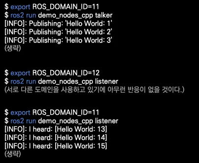

ROS2 Setup Tips
Namespace
## ROS2 Namespace
• ROS2의노드는각각고유의이름을가짐
• 각노드에서사용하는토픽, 서비스, 액션, 파라미터또한고유의이름으로설정됨
• 고유이름에Namespace를붙여독립적으로자신만의네트워크를그룹화가능

ROS2 Setup Tips
Namespace
## 사용방법
• ns 명령사용
1.
ROS의변수중하나인ns(namespace)를입력
2.
복수의namespace 생성

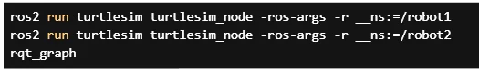

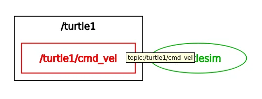

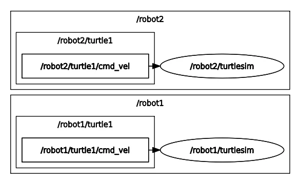

ROS2 Setup Tips
Uninstall
## ROS2 관련패키지들삭제
## ROS2 repository 삭제

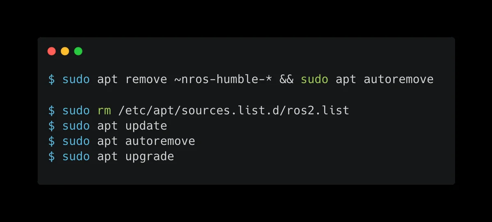

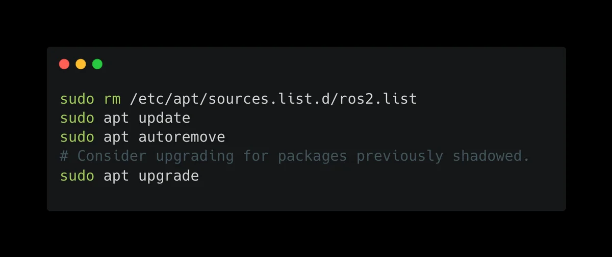

Python을이용한패키지생성
패키지(Package)
• 노드(Node): 실행가능한최소한의프로세서단위
• 패키지(Package): 하나이상의노드가기능적단위
로묶인것

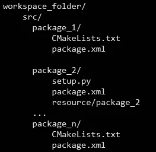

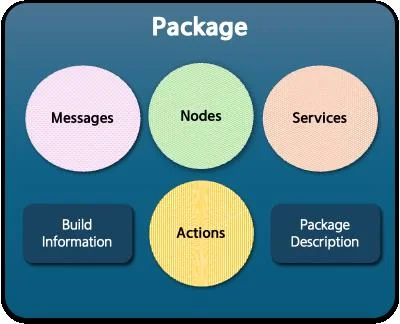

Python을이용한패키지생성
패키지(Package) 구성요소
•
노드(Node)
특정작업(로봇제어, 센서데이터처리, 토픽발
행/구독등)을수행하는실행파일
•
런치파일(Launch file)
여러노드를실행하고, 그들의매개변수, 토픽및
서비스를구성하는Python 파일
•
설정파일(Configuration file)
YAML 파일로노드나노드그룹의매개변수, 토픽,
서비스등을정의
•
라이브러리(Library)
C++ 또는Python 라이브러리로, 메시지정의, 알
고리즘, 드라이버등재사용가능한기능을제공
•
자원(Resource)
이미지, 소리, 모델등의데이터파일로노드나시
각화도구에서사용
•
테스트(Test)
유닛테스트, 통합테스트, 시스템테스트등으로
패키지의정확성과견고성을검증
•
문서(Documentation)
README 파일, 튜토리얼, API 참조등으로사용자
가패키지를이해하고사용할수있도록도움

Python을이용한패키지생성
package.xml
## package.xml
• 패키지에대한메타정보를포함하는파일(패키지의신분증역할)
• 이파일은패키지이름, 버전, 저작자, 라이센스등의정보를정의하며, 패키지의의존성
패키지와메시지, 서비스, 액션등의정의된인터페이스정보도포함
•
사용목적
•
소스코드를실제실행가능한프로그램이나라이브러리로변환하기위해colcon
build를수행하면package.xml을참조하여, 빌드할패키지들사이의의존성해석
및적절한빌드순서결정
•
또한, 패키지의존성설치시rosdep이이파일의정보를기반으로함

Python을이용한패키지생성
setup.py & setup.cfg
## setup.cfg
•
패키지빌드/설치/배포에사용(버전/설명/패키지의존성관리등)
•
setuptools를사용하여패키지를배포준비시필요한정보제공
•
Python 패키지에대한선언적인구성정보를제공하며, setuptools의
빌드및설치과정에서활용
•
주로패키지버전, 설명등이여기에정의됨
## setup.py
•
setuptools를사용하여패키지를배포할준비를할때, 필요한정보를
담고있음
•
Python 패키지에대한프로그래매틱한구성정보를제공하며,
setuptools를통한빌드및설치과정에서사용됨
•
Python 패키지의설치스크립트
•
주로패키지버전, 설명, 의존성등을포함한설치스크립트역할
•
setuptools 라이브러리를사용, 패키지를빌드하고설치하는데필요한
설정포함
## ROS2에서의역할
•
Python 기반의ROS2 패키지에대해colcon
은setup.cfg(및setup.py)를사용하여패키
지의설치를처리
•
setup.cfg, setup.py는setuptools를통해패
키지를빌드하고설치하는방법에대한구
성정보를제공
•
ament_python 패키지빌드타입을사용하
는경우, 파일의설정이빌드과정에영향을
줄수있음

Python을이용한패키지생성
CMakeLists.txt
## 주요역할
• ROS2에서CMakeLists.txt 파일은패키지의빌드규칙을정의하는역할
• ROS2는CMake 빌드시스템을사용하여패키지를빌드하며, CMakeLists.txt는CMake가
각패키지를어떻게컴파일하고링크할지지시하는지침을포함
• 패키지내코드를빌드하는방법을기술하는파일
• 빌드에필요한컴파일러, 라이브러리, 소스파일등을명시하고, 실행파일, 라이브러리,
메시지, 서비스등의빌드대상및의존성관리를설정
• 이파일은빌드프로세스를자동화하기위한CMake 빌드시스템에의해사용

Python을이용한패키지생성
CMakeLists.txt
## 주요역할
• 패키지에필요한최소CMake 버전을지정
• 프로젝트이름과버전을설정
• 빌드해야할타겟(executables, libraries)을정의
• 필요한종속성패키지를찾고링크
• 특정빌드옵션을설정하거나사용자정의빌드규칙추가

Python을이용한패키지생성
CMakeLists.txt
## CMakeLists.txt와setup.py/setup.cfg, package.xml간의비교
•
CMakeLists.txt
•
C/C++ 프로젝트에서주로사용됨
•
코드컴파일및링크설정
•
ROS2 메시지및서비스생성같은더광범위한작업지원
•
빌드시필요한지침을담고있으며, 주로코드컴파일과관련이깊음
•
setup.py/setup.cfg
•
Python 패키지의빌드및설치과정설정에사용됨
•
주로Python 관련설정에집중
•
Pacakge.xml
•
패키지의메타데이터와의존성을관리하는데중점
•
CMakeLists.txt와함께작동하여ROS2 패키지의빌드와배포를가능하게함
## 세파일의공통점
•
CMakeLists.txt, setup.py/setup.cfg, package.xml
모두패키지의빌드및설치과정에서의존성관리와설정정의에사용
Python을이용한패키지생성
패키지(Package) 설정
## pip install .과python3 setup.py install의차이
• pip install .
•
의존성해결: pip는setup.py(setup.cfg) 또는pyproject.toml에명시된패키지의의존성을자동으로
해결하고설치.
•
가상환경친화적: pip는현재활성화된Python 가상환경에패키지를설치하여시스템전체
Python 설치를변경하지않고패키지를안전하게설치할수있게해줌
• python3 setup.py install
•
의존성해결부족: 패키지의존성을자동으로해결하지못하므로수동으로미리설치해야함
•
가상환경과의호환성낮음: 이명령을사용할때도가상환경에설치할수있지만, pip만큼가상
환경과의통합이자연스럽지는않음

Python을이용한패키지생성
패키지(Package) 설정
## setup.py & setup.cfg차이점
setup.py
setup.cfg
접근방식
프로그래밍방식으로패키지설정을제공
선언적방식으로설정을제공
유연성
동적계산과사용자정의명령어를지원하는
높은유연성을제공
보다간단하고명확한패키지설정을지향
사용추세
setup.py의경우패키지의존성을해결해주지않
으므로가능한한setup.py 파일은최소화하거나
제거
현대의Python 패키징은
setup.cfg를통한선언적패키지설정을선호

Python을이용한패키지생성
setup.py
## 프로그래매틱접근
• setup.py는Python 스크립트파일로, 패키지의메타데이터와설치설정을프로그래밍방식
으로정의
• 이는setuptools.setup() 함수를통해이루어짐(from setuptools import setup)
• 패키지이름, 버전, 의존성등을동적으로계산하거나조건부로직을적용할수있는높은
유연성제공
## 직접실행가능
• python setup.py <command> 형식의명령어로직접실행가능
• ex) Python setup.py install
## 사용자정의명령지원
• 사용자가필요에따라setuptools의명령확장기능을사용하여새로운명령어정의가능

Python을이용한패키지생성
setup.cfg
## 선언적접근
• setup.cfg는INI 포맷의구성파일로, 패키지의설정을선언적으로정의
• 패키지의메타데이터와옵션을보다단순하고명확한형식으로지정
• setup.py에비해정적인설정에더적합하며, 조건부로직이나복잡한계산을불가함
## 간소화된설정
• 최근의Python 패키징가이드라인은setup.cfg를사용하여패키지설정을간소화하는추세
• setup.py 파일을최소화하거나완전히제거할수있도록권장
• 이를통해패키지의구성이더읽기쉽고관리하기쉬워짐
## setup.py와의결합사용
• setup.cfg를사용하는경우에도setup.py 파일이여전히필요할수있음
• 예를들어, setuptools 명령어를실행시기본적인setup.py 파일이사용
• 하지만, setup.py 파일은매우간단하게유지되며, 대부분의설정은setup.cfg에서관리됨
