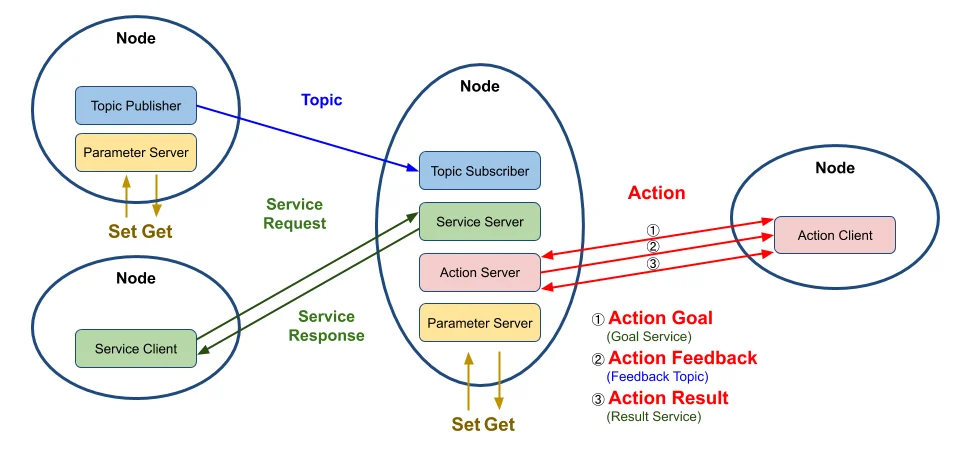
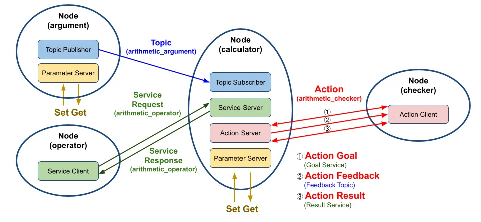
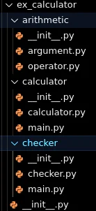

# ROS2 입문 2차시 - 인터페이스 패키지


## 인터페이스패키지

## Python을이용한패키지생성- 실습
- ​Python으로publisher와subscriber node를 생성하고 실행하기 → Topic상으로message를전송/수신하는 역할(talker/listener)


## Package 생성


!!! tip "소스코드 참조"
    이 코드의 전체 내용은 [Pub/Sub & QoS 전체 소스코드](../code-ref/pubsub-qos.md) 페이지에서 확인할 수 있습니다.


## Publisher 다운로드(샘플Package source code 다운로드)
1.
2.

3. 파일 생성 확인


## Publisher Code 분석


## 패키지소스분석
라이브러리 임 포트
- Rclpy : ROS2의python 클라이언트 라이브러리
- Node : ROS2 노드를 정의하기 위한 기본 클래스
- String : std_msgs 패키지에서 제공하는 문자열 메시지 타입 생성자(__init__)
- 노드 이름을'minimal_publisher'로 초기화
- 'topic'이라는 이름의 토픽으로 메시지를 발행하기 위한Publisher를생성
- 0.5초마다timer_callback 함수를 호출하는 타이 머를 설정 MinimalPublisher 클래스 정의
- Node 클래스를 상속받아ROS2 노드를 정의


## 패키지소스분석
- timer_callback 함수 1. 이 콜백 함수는 타이머에 의해 주기적으로 호출 2. 'Hello World: [count]' 형식의 메시지를 생성하고 해당 메시지를 발행 3. 또한 해당 메시지를로 깅하여 화면에 출력

- main 함수 1. ROS2를 초기화 2. MinimalPublisher 클래스의 인스턴스를 생성하고, rclpy.spin()을 사용하여 이 노드를 실행 3. 이 함수는 노드가 종료될 때까지 메시지를 계속 발행하게함 4. 노드와ROS2를 적절히 종료

- 메인 실행
- 스크립트가 직접 실행되면main() 함수를 호출하여 위의 모든 로직을 시작 →요약하면, 이 코드는'Hello World: [count]' 형식의 메시지를0.5초마다'topic'이라는 토픽으로 발행하는 간단한ROS2 Publisher 노드를 정의하고 실행


## 의존성추가
- Package.xml 의존성(dependencies) 추가
- ros2_ws/src/py_pubsub 디렉토리로 아래 하이라이트된 파일들에 대하여 작업 필요


## 의존성추가
- Python을 이용한 패키지 생성 실습
- description, maintainer, license 채우기
- 위 코드 바로 아래 의존성 코드 복사해서 붙여 넣기
- <exec_depend> 태그는 해당ROS 패키지가 실행되기 위해 필요한 의존성을 지정하는데 사용
- rclpy: ROS2의python 클라이언트 라이브러리
- 해당 패키지가 실행될 때rclpy 라이브러리에 의존한다는 것을 나타냄(즉, python을 사용한ROS2 노드를 실행하는 데 필요한 라이브러리)
- std_msgs: ROS에서 기본적으로 제공하는 메시지 타입들의 모음ex) String, Int32, Float64 등
- 해당 패키지가 실행될 때std_msgs 메시지 라이브러리에 의존한다는 것을 나타냄
- 이러한 의존성은 패키지를 빌드하거나 실행할 때 필요한 외부 패키지나 라이브러리를ROS 빌드 도구에게 알려 주는 역할 따라서ROS 빌드 도구는 이 정보를 사용하여 필요한 의존성을 먼저 설치하거나 빌드할 수 있음

## Package.xml  설정


## Package.xml 설정
- test_depend
- <test_depend> 태그는 빌드 및 실행 과정 중이 아닌 테스트 단계에서만 필요한 종속성을 지정
- 이는 패키지 개발 시 테스트 자동화를 위한 환경 구성에 필수적
- ament_copyright
- 이 도구는 소스 코드 파일 내에 적절한 저작권 고지 및 라이센스 헤더가 포함되어 있는지 검사
- ROS2 개발에서는 모든 소스 파일이 올바른 저작권 정보를 포함하도록 권장
- ament_flake8
- ament_flake8는Python 코드의 스타일을 검사하는 도구
- 이는PEP 8—Python 스타일 가이드를 준수하는 지 확인하여 코드의 일관성과 가독성을 높이는 데 도움을 줌
- ament_pep257
- ament_pep257은Python 코드 내의docstrings 이PEP 257—docstring 규칙을 따르는지 검사
- 좋은 문서화 관행을 유지하고 코드의 유지 보수성을 높이는 데 중요한 도구
- python3-pytest
- python3-pytest는Python 코드를 위한 강력한 테스 팅 프레임워크
- 이 종속성은 테스트를 정의하고 실행하는 데 필요하며, 다양한 테스트 케이스를 쉽게 작성하고 실행할 수 있게해 줌
- pytest는 테스트의 설정, 실행, 검증 및 리 포 팅 기능을 제공


## 의존성추가
- Python을 이용한 패키지 생성 실습

## setup.py 설정
- ​setup.py 파일 열고 수정하기(package.xml 파일과 동일하게 작성)
- entry_points 필드 부분에talker 추가하기(추가 후 저장하기) Python을 이용한 패키지 생성 실습

## setup.py 설정
- entry_points
- entry_points는Python의setuptools에서 사용되는 설정의 일부
- 특히python 패키지를 설치할 때 커맨드 라인 스크립트를 자동으로 생성하도록 지시하는데 사용
- console_scripts
- console_scripts는entry_points의 하위 항목으로, 커맨드 라인에서 실행할 수 있는 스크립트를 지정
- 'talker = py_pubsub.publisher_member_function:main'
- 이 항목은'talker'라는 커맨드 라인 명령어를 생성하라는 지시
- 사용자가 커맨드 라인에서talker라고 입력하면, py_pubsub.publisher_member_function 모듈의 main 함수가 실행
- 결과적으로, 이 설정을 사용하여python 패키지를 설치하면, 사용자는 커맨드 라인에서 바로 talker 명령어를 사용하여 해당 기능을 실행할 수 있게 됨
- ROS2에서python 노드를 쉽게 실행할 수 있도록하는 데 특히 유용함
- 이러한 방식을 통해ROS2는Python 스크립트를 바로 실행할 수 있는 실행 가능한 커맨드를 제공


## setup.py 설정
- setuptool이 실행될 때lib 내에 실행 자를 넣으라고 지시
- 결국‘ros2 run’ 실행시, path를 제대로 찾게해 주는 역할


## Subscriber 다운로드
- 새node를 생성하기 위해서ros2_ws/src/py_pubsub/py_pubsub로 이동하고 아래 명령 실행 1. 2. 3. 4.


## Subscriber code 분석


## Subscriber code 분석
- Imports
- import rclpy ROS2의Python 클라이언트 라이브러리를 가져옴
- from rclpy.node import Node Node 클래스를 가져 와 노 드를 생성, 관리하는 데 필요한 기능을 사용
- from std_msgs.msg import String ROS2의 표준 메시지 패키지에서String 메시지 유형을 가져옴
- MinimalSubscriber 클래스
- 이 클래스는ROS2 노드로 동작하며, 주요 기능은 메시지 구독
- __init__ 메서드

1. 노드의 초기화를 수행
2. create_subscription: 주어진 토픽에 대한 구독자를 생성(여기서 토픽 이름은'topic'이고, 메시지 유형은String)
메시지가 토픽에 게시될 때마다listener_callback 함수가 호출됨
- listener_callback 메서드

1. 토픽에 게시된 메시지를 수신할 때 호출되는 콜백 함수
2. 수신된 메시지의 내용을 로그에 출력


## Subscriber code 분석
- main 함수
- ROS2를 초기화
- MinimalSubscriber 클래스의 인스턴스를 생성
- rclpy.spin : 이벤트루프를 시작하여 콜백을 계속 호출하게 됨 (메시지가 게시될 때마다listener_callback 함수가 호출됨)
- destroy_node : 노드를 명시적으로 파괴(선택적, 가비지 수집기에 의해 자동으로 처리될 수 있음)
- rclpy.shutdown : ROS2를 종료하고 모든 리소스를 해제
- 메인 실행
- 스크립트가 직접 실행되면main 함수를 호출(스크립트를 모듈로 임 포트 할 때, main 함수가 자동으로 호출되지 않음)
- 전반적으로 이 코드는ROS2를 사용하여'topic'이라는 토픽에서String 메시지를 구독하고, 해당 메시지의 내용을 로그에 출력하는 간단한 구독자 노드를 구현


## Subscriber node 작성
- Setup.py 수정
- console_script에listener 내용 추가


## Subscriber node 작성
- Setup.py 전체 코드


## 빌드및실행하기
- 의존성 체크
- 새package 빌드


- install/setup.bash를source 수행
- 새로운 터미널을 열어서 입력


토픽, 서비스, 액션 인터페이스
인터페이스(Interface) 신규 작성

## 인터페이스(Interface)
- ROS에서노드 사이에 데이터를 전송 시 사용되는 토픽(Topic), 서비스(Service), 액션(Action) 에서 사용되는 데이터 타입
- 토픽은msg 파일, 서비스는srv 파일, 액션은action 파일에 인터페이스가 정의
- 일반적으로std_msgs나geometry_msgs와 같은 미리 선언된 인터페이스를 바로 사용 가능하나, 필요에 따라 커스 텀 인터페이스 생성 가능
- 단일 패키지를 가진 프로그램에서 사용시, 해당 패키지 포함시키기도하지만, 일반적으로 단 일 패키지를 가지는 프로그램을 만드는 경우는 거의 없음
- 여러 개의 패키지를 가지는 경우, 별도의 인터페이스 패키지를 생성하여 사용하는 것을 추천 (이 경우 여러 패키지들이 만들어진 인터페이스 패키지를 공유하며 사용 가능)


토픽, 서비스, 액션 인터페이스
인터페이스 패키지 생성
- Service, action, msg를 담는 인터페이스 폴더 역시 하나의 패키지로 생성
- 개발 언어가python이라도build-type을ament_cmake로 설정이 필요
- ament_cmake에 는 메시지를include하거나import할 수 있게하는 기능이 있지만, ament_python에는 없음


토픽, 서비스, 액션 인터페이스
인터페이스 패키지 생성
- 아래3개의 폴더 및 파일을 생성
- 파일 명은 반드시 카멜 케이스(CamelCase)만 사용, 만약 첫 문자가 소문자일 경우 빌드 시 오류 발생
- msg/MyMsg.msg
- srv/MySrv.srv
- action/MyAction.action


토픽, 서비스, 액션 인터페이스
인터페이스 패키지 생성
- 생성한 세 개의 폴더 및 파일에 아래와 같이 작성
- msg/MyMsg.msg
- srv/MySrv.srv
- action/MyAction.action


토픽, 서비스, 액션 인터페이스
인터페이스 패키지 생성


토픽, 서비스, 액션 인터페이스
인터페이스 패키지 생성

## Package.xml 파일수정


토픽, 서비스, 액션 인터페이스
인터페이스 패키지 생성

## CMakeLists.txt 파일수정


토픽, 서비스, 액션 인터페이스
인터페이스 패키지 생성

## 빌드


토픽, 서비스, 액션 인터페이스
인터페이스 패키지 생성

## 빌드결과


토픽, 서비스, 액션 인터페이스
인터페이스 패키지 생성

## 빌드결과


토픽, 서비스, 액션 인터페이스 실습

## 새로운패키지를새로생성하여, msg interface 테스트진행
토픽, 서비스, 액션 인터페이스 실습

## my_msg_test.py를생성하고
다음과 같이 작성

토픽, 서비스, 액션 인터페이스 실습

## package.xml
- Package.xml에 앞에 생성한 인터페이스 패키지 추가


토픽, 서비스, 액션 인터페이스 실습

## setup.py
- setup.py에 콘솔 스크립트 추가 토픽, 서비스, 액션 인터페이스 실습

## 빌드및실행
터미널- 1
터미널- 2


토픽, 서비스, 액션 인터페이스

## 패키지설계
- ROS2의 토픽, 서비스, 액션 프로그래밍을 이용해서 각 노드들이 서로 연동되어 구동하는 패키지 설계
- 프로세스를 목적별로 나누어 노드 단위의 프로그램을 작성하고 노 드와 노 드 간의 데이터 통신을 고려하여 설계

## 실습패키지설계
- 계산기 개발
- 현재 시간과 변수a, b를 받아 연산하여 결과 값 도출
- 연산 결과 값을 누적하여 목표치에 도달했을 때 이 결과 값을 표시





토픽, 서비스, 액션 인터페이스

## argument: arithmetic_argument 토픽이름으로현재시간과변수a, b를퍼블리시
## calculator
- 토픽이 생성 시점과 변수a,b를arithmetic_argument 토픽을 통해 수신(subscribe)
- 수신한 변수a,b와operator 노드로부터 요청 값으로 받은 연산자를 통해 계산 수행(a 연산자b)
- 연산 결과를arithmetic_operator 이름의 서비스 응답 값으로operator 노드에 전송
- Checker 노드로부터 액션 목표 값(①action goal)을 수신 후, 저장된 변수(a, b, 연산자)를 활용해 연산한 값을 합산
- 계산이 완료된 결과를arithmetic_checker라는 이름의 액션 피드백(②action feedback)으로 checker 노드에 전송
- 합산된 결과 값이 액션 목표 값을 넘기면 최종 연산 합계를arithmetic_checker라는 이름의 액션 결과 값(③action result)으로checker에전송

## operator: arithmetic_operator 서비스이름으로calculator 노드에게연산자(+-*/)를
서비스 요청 값으로 보내기

## checker: 연산값의합계의한계치를arithmetic_checker 액션이름으로액션목표값으로전달


토픽, 서비스, 액션 인터페이스

## 패키지구성





토픽, 서비스, 액션 인터페이스
토픽, 서비스, 액션 복습

토픽, 서비스, 액션 인터페이스

## 의존패키지설치
## 폴더구성





토픽, 서비스, 액션 인터페이스

## 인터페이스패키지수정
CMakeList.txt
ArithmeticChecker.action
ArithmeticArgument.msg
ArithmeticOperator.srv


토픽, 서비스, 액션 인터페이스

## 설정
Package.xml
Setup.py


토픽, 서비스, 액션 인터페이스

## 파라미터


토픽, 서비스, 액션 인터페이스

## 빌드


토픽, 서비스, 액션 인터페이스

## 실행


토픽, 서비스, 액션 인터페이스

## 실행


---

## Jupyter Notebooks


### py_pubsub

[](https://colab.research.google.com/github/OWNER/study-site/blob/main/notebooks/ros/jupyter_ros/py_pubsub.ipynb)

#### py_pubsub 패키지를 jupyter에서 실행하는 코드입니다.

#### Subscriber code


```python
import rclpy
from rclpy.node import Node
from std_msgs.msg import String


class MinimalSubscriber(Node):

    def __init__(self):
        super().__init__("minimal_subscriber")
        self.subscription = self.create_subscription(
            String, "topic", self.listener_callback, 10
        )
        self.subscription  # prevent unused variable warning

    def listener_callback(self, msg):
        self.get_logger().info(f"I heard: {msg.data}")


# def main(args=None):
#     rclpy.init(args=args)
#     minimal_subscriber = MinimalSubscriber()
#     rclpy.spin(minimal_subscriber)
#     minimal_subscriber.destroy_node()
#     rclpy.shutdown()
```

#### Publisher 코드드


```python
# import rclpy
# from rclpy.node import Node
# from std_msgs.msg import String


class MinimalPublisher(Node):

    def __init__(self):
        super().__init__("minimal_publisher")
        self.publisher_ = self.create_publisher(String, "topic", 10)
        timer_period = 0.5  # seconds
        self.timer = self.create_timer(timer_period, self.timer_callback)
        self.i = 0

    def timer_callback(self):
        msg = String()
        msg.data = f"Hello World: {self.i}"
        self.publisher_.publish(msg)
        self.get_logger().info(f"Publishing: {msg.data}")
        self.i += 1


# def main(args=None):
#     rclpy.init(args=args)
#     minimal_publisher = MinimalPublisher()
#     rclpy.spin(minimal_publisher)
#     minimal_publisher.destroy_node()
#     rclpy.shutdown()
```


```python
import time

rclpy.init()
minimal_subscriber = MinimalSubscriber()
minimal_publisher = MinimalPublisher()

try:
    for _ in range(30):
        rclpy.spin_once(minimal_publisher)
        rclpy.spin_once(minimal_subscriber)
        time.sleep(1.0)
finally:
    minimal_subscriber.destroy_node()
    minimal_publisher.destroy_node()
    rclpy.shutdown()
```

    [INFO] [1745347587.345396758] [minimal_publisher]: Publishing: Hello World: 0
    [INFO] [1745347587.363020318] [minimal_subscriber]: I heard: Hello World: 0
    [INFO] [1745347588.382281375] [minimal_publisher]: Publishing: Hello World: 1
    [INFO] [1745347588.392444829] [minimal_subscriber]: I heard: Hello World: 1
    [INFO] [1745347589.397276489] [minimal_publisher]: Publishing: Hello World: 2
    [INFO] [1745347589.401492075] [minimal_subscriber]: I heard: Hello World: 2
    [INFO] [1745347590.406465800] [minimal_publisher]: Publishing: Hello World: 3
    [INFO] [1745347590.412285797] [minimal_subscriber]: I heard: Hello World: 3
    [INFO] [1745347591.423198741] [minimal_publisher]: Publishing: Hello World: 4
    [INFO] [1745347591.428896320] [minimal_subscriber]: I heard: Hello World: 4
    [INFO] [1745347592.437301431] [minimal_publisher]: Publishing: Hello World: 5
    [INFO] [1745347592.464249416] [minimal_subscriber]: I heard: Hello World: 5
    [INFO] [1745347593.472981225] [minimal_publisher]: Publishing: Hello World: 6
    [INFO] [1745347593.478466727] [minimal_subscriber]: I heard: Hello World: 6
    [INFO] [1745347594.497613850] [minimal_publisher]: Publishing: Hello World: 7
    [INFO] [1745347594.505079717] [minimal_subscriber]: I heard: Hello World: 7
    [INFO] [1745347595.510113455] [minimal_publisher]: Publishing: Hello World: 8
    [INFO] [1745347595.517906515] [minimal_subscriber]: I heard: Hello World: 8
    [INFO] [1745347596.523199037] [minimal_publisher]: Publishing: Hello World: 9
    [INFO] [1745347596.528418310] [minimal_subscriber]: I heard: Hello World: 9
    [INFO] [1745347597.547920403] [minimal_publisher]: Publishing: Hello World: 10
    [INFO] [1745347597.573039215] [minimal_subscriber]: I heard: Hello World: 10
    [INFO] [1745347598.603897191] [minimal_publisher]: Publishing: Hello World: 11
    [INFO] [1745347598.646759026] [minimal_subscriber]: I heard: Hello World: 11
    [INFO] [1745347599.672670776] [minimal_publisher]: Publishing: Hello World: 12
    [INFO] [1745347599.702398701] [minimal_subscriber]: I heard: Hello World: 12
    [INFO] [1745347600.726534768] [minimal_publisher]: Publishing: Hello World: 13
    [INFO] [1745347600.758351270] [minimal_subscriber]: I heard: Hello World: 13
    [INFO] [1745347601.764941660] [minimal_publisher]: Publishing: Hello World: 14
    [INFO] [1745347601.778125855] [minimal_subscriber]: I heard: Hello World: 14
    [INFO] [1745347602.787342286] [minimal_publisher]: Publishing: Hello World: 15
    [INFO] [1745347602.796627497] [minimal_subscriber]: I heard: Hello World: 15
    [INFO] [1745347603.809495917] [minimal_publisher]: Publishing: Hello World: 16
    [INFO] [1745347603.813750236] [minimal_subscriber]: I heard: Hello World: 16
    [INFO] [1745347604.825612163] [minimal_publisher]: Publishing: Hello World: 17
    [INFO] [1745347604.829793945] [minimal_subscriber]: I heard: Hello World: 17
    [INFO] [1745347605.848952911] [minimal_publisher]: Publishing: Hello World: 18
    [INFO] [1745347605.869222031] [minimal_subscriber]: I heard: Hello World: 18
    [INFO] [1745347606.884785328] [minimal_publisher]: Publishing: Hello World: 19
    [INFO] [1745347606.902707266] [minimal_subscriber]: I heard: Hello World: 19
    [INFO] [1745347607.908448828] [minimal_publisher]: Publishing: Hello World: 20
    [INFO] [1745347607.922098954] [minimal_subscriber]: I heard: Hello World: 20
    [INFO] [1745347608.929721433] [minimal_publisher]: Publishing: Hello World: 21
    [INFO] [1745347608.934622211] [minimal_subscriber]: I heard: Hello World: 21
    [INFO] [1745347609.941516718] [minimal_publisher]: Publishing: Hello World: 22
    [INFO] [1745347609.947172148] [minimal_subscriber]: I heard: Hello World: 22
    [INFO] [1745347610.952531499] [minimal_publisher]: Publishing: Hello World: 23
    [INFO] [1745347610.957460791] [minimal_subscriber]: I heard: Hello World: 23
    [INFO] [1745347611.964997774] [minimal_publisher]: Publishing: Hello World: 24
    [INFO] [1745347611.969349325] [minimal_subscriber]: I heard: Hello World: 24
    [INFO] [1745347613.006396495] [minimal_publisher]: Publishing: Hello World: 25
    [INFO] [1745347613.019271631] [minimal_subscriber]: I heard: Hello World: 25
    [INFO] [1745347614.027281606] [minimal_publisher]: Publishing: Hello World: 26
    [INFO] [1745347614.033271141] [minimal_subscriber]: I heard: Hello World: 26
    [INFO] [1745347615.049126482] [minimal_publisher]: Publishing: Hello World: 27
    [INFO] [1745347615.055239037] [minimal_subscriber]: I heard: Hello World: 27
    [INFO] [1745347616.066164864] [minimal_publisher]: Publishing: Hello World: 28
    [INFO] [1745347616.076176764] [minimal_subscriber]: I heard: Hello World: 28
    [INFO] [1745347617.081895438] [minimal_publisher]: Publishing: Hello World: 29
    [INFO] [1745347617.085371150] [minimal_subscriber]: I heard: Hello World: 29
### PublisherTest

[](https://colab.research.google.com/github/OWNER/study-site/blob/main/notebooks/ros/jupyter_ros/PublisherTest.ipynb)

```python
import rclpy
from geometry_msgs.msg import Twist

if not rclpy.ok():  # 또는 hasattr(rclpy, '_rclpy') 등으로 체크
    rclpy.init()
test_node = rclpy.create_node('pub_test')
```

    1745315536.778231 [25]    python3: selected interface "lo" is not multicast-capable: disabling multicast
```python
msg = Twist()
print(msg)
```

    geometry_msgs.msg.Twist(linear=geometry_msgs.msg.Vector3(x=0.0, y=0.0, z=0.0), angular=geometry_msgs.msg.Vector3(x=0.0, y=0.0, z=0.0))
```python
msg.linear.x = 0.0
print(msg)
```

    geometry_msgs.msg.Twist(linear=geometry_msgs.msg.Vector3(x=0.0, y=0.0, z=0.0), angular=geometry_msgs.msg.Vector3(x=0.0, y=0.0, z=0.0))
```python
pub = test_node.create_publisher(Twist, '/turtle1/cmd_vel', 10)
```


```python
msg.linear.x = 2.0
msg.angular.z = 2.0
pub.publish(msg)

```


```python
cnt = 0
def timer_callback():
    global cnt

    cnt += 1

    print(cnt)
    pub.publish(msg)

    if cnt > 5:
        raise Exception('publisher stop')
```


```python
timer_period = 0.1
timer = test_node.create_timer(0.1, timer_callback)
rclpy.spin(test_node)
```

    1
    2
    3
    4
    5
    6
    ---------------------------------------------------------------------------

    Exception                                 Traceback (most recent call last)

    Cell In[7], line 3
          1 timer_period = 0.1
          2 timer = test_node.create_timer(0.1, timer_callback)
    ----> 3 rclpy.spin(test_node)


    File /opt/ros/humble/local/lib/python3.10/dist-packages/rclpy/__init__.py:226, in spin(node, executor)
        224     executor.add_node(node)
        225     while executor.context.ok():
    --> 226         executor.spin_once()
        227 finally:
        228     executor.remove_node(node)


    File /opt/ros/humble/local/lib/python3.10/dist-packages/rclpy/executors.py:751, in SingleThreadedExecutor.spin_once(self, timeout_sec)
        750 def spin_once(self, timeout_sec: float = None) -> None:
    --> 751     self._spin_once_impl(timeout_sec)


    File /opt/ros/humble/local/lib/python3.10/dist-packages/rclpy/executors.py:748, in SingleThreadedExecutor._spin_once_impl(self, timeout_sec)
        746 handler()
        747 if handler.exception() is not None:
    --> 748     raise handler.exception()


    File /opt/ros/humble/local/lib/python3.10/dist-packages/rclpy/task.py:254, in Task.__call__(self)
        251 if inspect.iscoroutine(self._handler):
        252     # Execute a coroutine
        253     try:
    --> 254         self._handler.send(None)
        255     except StopIteration as e:
        256         # The coroutine finished; store the result
        257         self.set_result(e.value)


    File /opt/ros/humble/local/lib/python3.10/dist-packages/rclpy/executors.py:447, in Executor._make_handler.<locals>.handler(entity, gc, is_shutdown, work_tracker)
        444 gc.trigger()
        446 try:
    --> 447     await call_coroutine(entity, arg)
        448 finally:
        449     entity.callback_group.ending_execution(entity)


    File /opt/ros/humble/local/lib/python3.10/dist-packages/rclpy/executors.py:361, in Executor._execute_timer(self, tmr, _)
        360 async def _execute_timer(self, tmr, _):
    --> 361     await await_or_execute(tmr.callback)


    File /opt/ros/humble/local/lib/python3.10/dist-packages/rclpy/executors.py:107, in await_or_execute(callback, *args)
        104     return await callback(*args)
        105 else:
        106     # Call a normal function
    --> 107     return callback(*args)


    Cell In[6], line 11, in timer_callback()
          8 pub.publish(msg)
         10 if cnt > 5:
    ---> 11     raise Exception('publisher stop')


    Exception: publisher stop
```python
cnt = 0
phase = 0  # 짝수: 직진 / 홀수: 회전

def timer_callback():
    global cnt, phase

    print(f"[{cnt}] Phase: {phase}")

    if phase % 2 == 0:
        # 직진 단계
        msg.linear.x = 2.0
        msg.angular.z = 0.0
    else:
        # 회전 단계 (120도 회전 → 약 1.5초 동안 angular.z = 2.0)
        msg.linear.x = 0.0
        msg.angular.z = 1.5

    pub.publish(msg)
    cnt += 1

    # 각 단계의 지속 시간 설정 (0.1초 타이머 기준)
    if (phase % 2 == 0 and cnt >= 20):      # 직진 2초
        cnt = 0
        phase += 1
    elif (phase % 2 == 1 and cnt >= 15):    # 회전 1.5초
        cnt = 0
        phase += 1

    if phase >= 6:
        print("삼각형 그리기 완료 - shutdown")
        rclpy.shutdown()

timer = test_node.create_timer(0.1, timer_callback)
rclpy.spin(test_node)
```

    [0] Phase: 0
    [1] Phase: 0
    [2] Phase: 0
    [3] Phase: 0
    [4] Phase: 0
    [5] Phase: 0
    [6] Phase: 0
    [7] Phase: 0
    [8] Phase: 0
    [9] Phase: 0
    [10] Phase: 0
    [11] Phase: 0
    [12] Phase: 0
    [13] Phase: 0
    [14] Phase: 0
    [15] Phase: 0
    [16] Phase: 0
    [17] Phase: 0
    [18] Phase: 0
    [19] Phase: 0
    [0] Phase: 1
    [1] Phase: 1
    [2] Phase: 1
    [3] Phase: 1
    [4] Phase: 1
    [5] Phase: 1
    [6] Phase: 1
    [7] Phase: 1
    [8] Phase: 1
    [9] Phase: 1
    [10] Phase: 1
    [11] Phase: 1
    [12] Phase: 1
    [13] Phase: 1
    [14] Phase: 1
    [0] Phase: 2
    [1] Phase: 2
    [2] Phase: 2
    [3] Phase: 2
    [4] Phase: 2
    [5] Phase: 2
    [6] Phase: 2
    [7] Phase: 2
    [8] Phase: 2
    [9] Phase: 2
    [10] Phase: 2
    [11] Phase: 2
    [12] Phase: 2
    [13] Phase: 2
    [14] Phase: 2
    [15] Phase: 2
    [16] Phase: 2
    [17] Phase: 2
    [18] Phase: 2
    [19] Phase: 2
    [0] Phase: 3
    [1] Phase: 3
    [2] Phase: 3
    [3] Phase: 3
    [4] Phase: 3
    [5] Phase: 3
    [6] Phase: 3
    [7] Phase: 3
    [8] Phase: 3
    [9] Phase: 3
    [10] Phase: 3
    [11] Phase: 3
    [12] Phase: 3
    [13] Phase: 3
    [14] Phase: 3
    [0] Phase: 4
    [1] Phase: 4
    [2] Phase: 4
    [3] Phase: 4
    [4] Phase: 4
    [5] Phase: 4
    [6] Phase: 4
    [7] Phase: 4
    [8] Phase: 4
    [9] Phase: 4
    [10] Phase: 4
    [11] Phase: 4
    [12] Phase: 4
    [13] Phase: 4
    [14] Phase: 4
    [15] Phase: 4
    [16] Phase: 4
    [17] Phase: 4
    [18] Phase: 4
    [19] Phase: 4
    [0] Phase: 5
    [1] Phase: 5
    [2] Phase: 5
    [3] Phase: 5
    [4] Phase: 5
    [5] Phase: 5
    [6] Phase: 5
    [7] Phase: 5
    [8] Phase: 5
    [9] Phase: 5
    [10] Phase: 5
    [11] Phase: 5
    [12] Phase: 5
    [13] Phase: 5
    [14] Phase: 5
 삼각형 그리기 완료 - shutdown
```python

```


```python

```


### SubscriptionTest

[](https://colab.research.google.com/github/OWNER/study-site/blob/main/notebooks/ros/jupyter_ros/SubscriptionTest.ipynb)

```python
import rclpy # Ros2를 python에서 사용할 수 있게 해주는 module
from turtlesim.msg import Pose
```


```python
if not rclpy.ok():  # 또는 hasattr(rclpy, '_rclpy') 등으로 체크
    rclpy.init()
test_node = rclpy.create_node('sub_test')
```

    [WARN] [1744163682.294190713] [rcl.logging_rosout]: Publisher already registered for provided node name. If this is due to multiple nodes with the same name then all logs for that logger name will go out over the existing publisher. As soon as any node with that name is destructed it will unregister the publisher, preventing any further logs for that name from being published on the rosout topic.
```python
def callback1(data):
    print('---')
    print('/turtle1/pose :',data)
    print('x : ', data.x)
    print('y : ', data.y)
    print('theta : ', data.theta)
```


```python
cnt = 0
def callback2(data):
    global cnt
    cnt += 1
    print('>', cnt, '-> X :' , data.x, ',Y : ', data.y)
    if cnt > 3:
        raise Exception('subscription Stop')
```


```python
test_node.create_subscription(Pose, '/turtle1/pose',callback1,10)
```

    <rclpy.subscription.Subscription at 0x755184771b70>

```python
# node 연결
# <data_type> <topic_name> <callback> <QoS History>
test_node.create_subscription(Pose, '/turtle1/pose',callback2,10)
```

    <rclpy.subscription.Subscription at 0x7551847f0370>

```python
rclpy.spin_once(test_node)
```

    > 6 -> X : 5.544444561004639 ,Y :  5.544444561004639
    ---------------------------------------------------------------------------

    Exception                                 Traceback (most recent call last)

    Cell In[27], line 1
    ----> 1 rclpy.spin_once(test_node)


    File /opt/ros/humble/local/lib/python3.10/dist-packages/rclpy/__init__.py:206, in spin_once(node, executor, timeout_sec)
        204 try:
        205     executor.add_node(node)
    --> 206     executor.spin_once(timeout_sec=timeout_sec)
        207 finally:
        208     executor.remove_node(node)


    File /opt/ros/humble/local/lib/python3.10/dist-packages/rclpy/executors.py:751, in SingleThreadedExecutor.spin_once(self, timeout_sec)
        750 def spin_once(self, timeout_sec: float = None) -> None:
    --> 751     self._spin_once_impl(timeout_sec)


    File /opt/ros/humble/local/lib/python3.10/dist-packages/rclpy/executors.py:748, in SingleThreadedExecutor._spin_once_impl(self, timeout_sec)
        746 handler()
        747 if handler.exception() is not None:
    --> 748     raise handler.exception()


    File /opt/ros/humble/local/lib/python3.10/dist-packages/rclpy/task.py:254, in Task.__call__(self)
        251 if inspect.iscoroutine(self._handler):
        252     # Execute a coroutine
        253     try:
    --> 254         self._handler.send(None)
        255     except StopIteration as e:
        256         # The coroutine finished; store the result
        257         self.set_result(e.value)


    File /opt/ros/humble/local/lib/python3.10/dist-packages/rclpy/executors.py:447, in Executor._make_handler.<locals>.handler(entity, gc, is_shutdown, work_tracker)
        444 gc.trigger()
        446 try:
    --> 447     await call_coroutine(entity, arg)
        448 finally:
        449     entity.callback_group.ending_execution(entity)


    File /opt/ros/humble/local/lib/python3.10/dist-packages/rclpy/executors.py:372, in Executor._execute_subscription(self, sub, msg)
        370 async def _execute_subscription(self, sub, msg):
        371     if msg:
    --> 372         await await_or_execute(sub.callback, msg)


    File /opt/ros/humble/local/lib/python3.10/dist-packages/rclpy/executors.py:107, in await_or_execute(callback, *args)
        104     return await callback(*args)
        105 else:
        106     # Call a normal function
    --> 107     return callback(*args)


    Cell In[18], line 7, in callback2(data)
          5 print('>', cnt, '-> X :' , data.x, ',Y : ', data.y)
          6 if cnt > 3:
    ----> 7     raise Exception('subscription Stop')


    Exception: subscription Stop
```python
# 노드 구독 once는 한번만 그냥 spin은 무한 반복
rclpy.spin(test_node)
```

    > 1 -> X : 5.544444561004639 ,Y :  5.544444561004639
    > 2 -> X : 5.544444561004639 ,Y :  5.544444561004639
    > 3 -> X : 5.544444561004639 ,Y :  5.544444561004639
    > 4 -> X : 5.544444561004639 ,Y :  5.544444561004639
    ---------------------------------------------------------------------------

    Exception                                 Traceback (most recent call last)

    Cell In[20], line 2
 1 # 노드 구독 once는 한 번만 그냥 spin은 무한 반복
    ----> 2 rclpy.spin(test_node)


    File /opt/ros/humble/local/lib/python3.10/dist-packages/rclpy/__init__.py:226, in spin(node, executor)
        224     executor.add_node(node)
        225     while executor.context.ok():
    --> 226         executor.spin_once()
        227 finally:
        228     executor.remove_node(node)


    File /opt/ros/humble/local/lib/python3.10/dist-packages/rclpy/executors.py:751, in SingleThreadedExecutor.spin_once(self, timeout_sec)
        750 def spin_once(self, timeout_sec: float = None) -> None:
    --> 751     self._spin_once_impl(timeout_sec)


    File /opt/ros/humble/local/lib/python3.10/dist-packages/rclpy/executors.py:748, in SingleThreadedExecutor._spin_once_impl(self, timeout_sec)
        746 handler()
        747 if handler.exception() is not None:
    --> 748     raise handler.exception()


    File /opt/ros/humble/local/lib/python3.10/dist-packages/rclpy/task.py:254, in Task.__call__(self)
        251 if inspect.iscoroutine(self._handler):
        252     # Execute a coroutine
        253     try:
    --> 254         self._handler.send(None)
        255     except StopIteration as e:
        256         # The coroutine finished; store the result
        257         self.set_result(e.value)


    File /opt/ros/humble/local/lib/python3.10/dist-packages/rclpy/executors.py:447, in Executor._make_handler.<locals>.handler(entity, gc, is_shutdown, work_tracker)
        444 gc.trigger()
        446 try:
    --> 447     await call_coroutine(entity, arg)
        448 finally:
        449     entity.callback_group.ending_execution(entity)


    File /opt/ros/humble/local/lib/python3.10/dist-packages/rclpy/executors.py:372, in Executor._execute_subscription(self, sub, msg)
        370 async def _execute_subscription(self, sub, msg):
        371     if msg:
    --> 372         await await_or_execute(sub.callback, msg)


    File /opt/ros/humble/local/lib/python3.10/dist-packages/rclpy/executors.py:107, in await_or_execute(callback, *args)
        104     return await callback(*args)
        105 else:
        106     # Call a normal function
    --> 107     return callback(*args)


    Cell In[18], line 7, in callback2(data)
          5 print('>', cnt, '-> X :' , data.x, ',Y : ', data.y)
          6 if cnt > 3:
    ----> 7     raise Exception('subscription Stop')


    Exception: subscription Stop
```python

```


---

## Code Examples


### `turtlesim/my_first_package/`

[View full source on GitHub](https://github.com/OWNER/study-site/tree/main/source/turtlesim/my_first_package/){ .md-button }

#### `turtlesim/my_first_package/my_first_package/my_first_node.py`

```python
def main():
    print('Hi from my_first_package.')


if __name__ == '__main__':
    main()

```

#### `turtlesim/my_first_package/my_first_package/__init__.py`

```python

```

#### `turtlesim/my_first_package/my_first_package/my_first_publisher.py`

```python
import rclpy as rp
from rclpy.node import Node
from geometry_msgs.msg import Twist


class TurtlesimPublisher(Node):

    def __init__(self):
        super().__init__("turtlesim_publisher")
        self.publisher = self.create_publisher(Twist, "/turtle1/cmd_vel", 10)

        timer_period = 0.5
        self.timer = self.create_timer(timer_period, self.timer_callback)

    def timer_callback(self):
        msg = Twist()
        msg.linear.x = 2.0
        msg.angular.z = 2.0
        self.publisher.publish(msg)


def main():
    rp.init(args=None)

    turtlesim_publisher = TurtlesimPublisher()
    rp.spin(turtlesim_publisher)

    turtlesim_publisher.destroy_node()
    rp.shutdown()

if __name__ == "__main__":
    main()

```
