# 강의_3기_ROS2입문_2차시


ROS2 프로그래밍입문(2차시)
2. 인터페이스패키지


▶인터페이스패키지
1.  Python을이용한패키지생성실습
2.  인터페이스패키지
3.  인터페이스패키지설계
Contents
00
00


Python을이용한패키지생성실습
01
01
▶Python을이용한패키지생성- 실습
•
​Python으로publisher와subscriber node를생성하고실행하기
→ Topic상으로message를전송/수신하는역할(talker/listener)


Python을이용한패키지생성실습
02
01
▶Package 생성
1. ros2_ws/src 디렉토리생성
2. py_pubsub package를생성
3. 생성된Package 확인
4. Tree를이용한내부구조확인


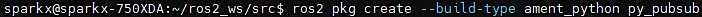

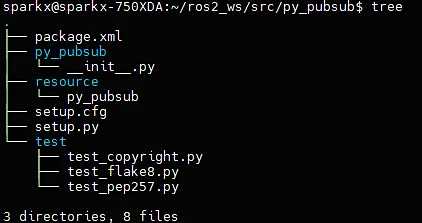


Python을이용한패키지생성실습
03
01
▶Publisher 다운로드(샘플Package source code 다운로드)
1.
2.
3. 파일생성확인
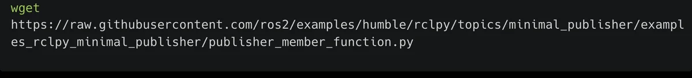


Python을이용한패키지생성실습
04
01
▶Publisher Code 분석


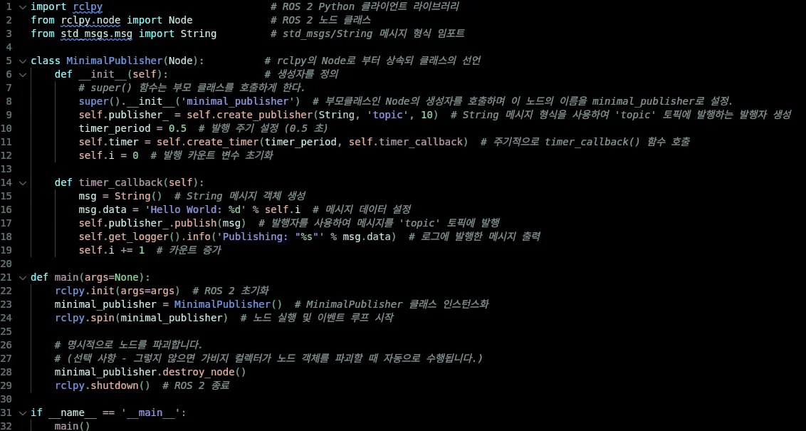


Python을이용한패키지생성실습
05
01
▶패키지소스분석
라이브러리임포트
•
Rclpy : ROS2의python 클라이언트라이브러리
•
Node : ROS2 노드를정의하기위한기본클래스
•
String : std_msgs 패키지에서제공하는문자열메시지타입
생성자(__init__)
•
노드이름을'minimal_publisher'로초기화
•
'topic'이라는이름의토픽으로메시지를발행
하기위한Publisher를생성
•
0.5초마다timer_callback 함수를호출하는타이
머를설정
MinimalPublisher 클래스정의
•
Node 클래스를상속받아ROS2 노드를정의
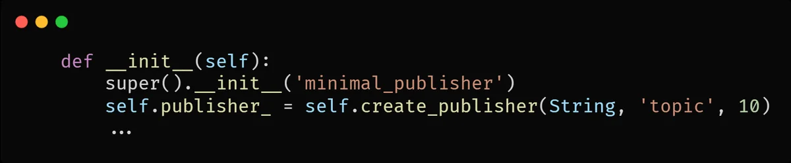


Python을이용한패키지생성실습
06
01
▶패키지소스분석
• timer_callback 함수
1.
이콜백함수는타이머에의해주기적으로호출
2.
'Hello World: [count]' 형식의메시지를생성하고해당메시지를발행
3.
또한해당메시지를로깅하여화면에출력
• main 함수
1.
ROS2를초기화
2.
MinimalPublisher 클래스의인스턴스를생성하고, rclpy.spin()을사용하여이노드를실행
3.
이함수는노드가종료될때까지메시지를계속발행하게함
4.
노드와ROS2를적절히종료
• 메인실행
•
스크립트가직접실행되면main() 함수를호출하여위의모든로직을시작
→요약하면, 이코드는'Hello World: [count]' 형식의메시지를0.5초마다'topic'이라는토픽으로
발행하는간단한ROS2 Publisher 노드를정의하고실행

Python을이용한패키지생성실습
07
01
▶의존성추가
•
Package.xml 의존성(dependencies) 추가
•
ros2_ws/src/py_pubsub 디렉토리로아래하이라이트된파일들에대하여작업필요

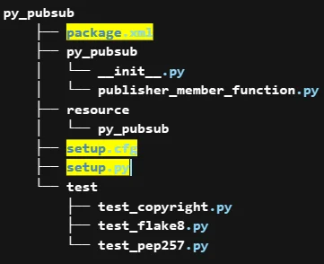


Python을이용한패키지생성실습
08
01
▶의존성추가
•
Package.xml  설정
Python을이용한패키지생성실습
09
01
•
description, maintainer, license 채우기
•
위코드바로아래의존성코드복사해서붙여넣기
•
<exec_depend> 태그는해당ROS 패키지가실행되기위해필요한의존성을지정하는데사용
•
rclpy: ROS2의python 클라이언트라이브러리
•
해당패키지가실행될때rclpy 라이브러리에의존한다는것을나타냄(즉, python을사용한ROS2 노드를실행하는데필요한라이브러리)
•
std_msgs: ROS에서기본적으로제공하는메시지타입들의모음ex) String, Int32, Float64 등
•
해당패키지가실행될때std_msgs 메시지라이브러리에의존한다는것을나타냄
•
이러한의존성은패키지를빌드하거나실행할때필요한외부패키지나라이브러리를ROS 빌드도구에게알려주는역할따라서ROS 
빌드도구는이정보를사용하여필요한의존성을먼저설치하거나빌드할수있음
▶Package.xml  설정


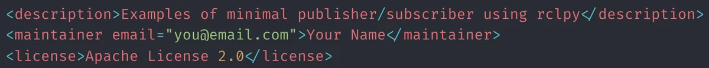


Python을이용한패키지생성실습
10
01
▶Package.xml 설정
•
test_depend
•
<test_depend> 태그는빌드및실행과정중이
아닌테스트단계에서만필요한종속성을지정
•
이는패키지개발시테스트자동화를위한환경
구성에필수적
•
ament_copyright
•
이도구는소스코드파일내에적절한저작권
고지및라이센스헤더가포함되어있는지검사
•
ROS2 개발에서는모든소스파일이올바른저작
권정보를포함하도록권장
•
ament_flake8
•
ament_flake8는Python 코드의스타일을검사하
는도구
•
이는PEP 8—Python 스타일가이드를준수하는
지확인하여코드의일관성과가독성을높이는
데도움을줌
•
ament_pep257
•
ament_pep257은Python 코드내의docstrings
이PEP 257—docstring 규칙을따르는지검사
•
좋은문서화관행을유지하고코드의유지보수
성을높이는데중요한도구
•
python3-pytest
•
python3-pytest는Python 코드를위한강력한
테스팅프레임워크
•
이종속성은테스트를정의하고실행하는데
필요하며, 다양한테스트케이스를쉽게작성
하고실행할수있게해줌
•
pytest는테스트의설정, 실행, 검증및리포팅
기능을제공


Python을이용한패키지생성실습
11
01
▶의존성추가
•
setup.py 설정
Python을이용한패키지생성실습
12
01
▶setup.py 설정
•
​setup.py 파일열고수정하기(package.xml 파일과동일하게작성)
•
entry_points 필드부분에talker 추가하기(추가후저장하기)
Python을이용한패키지생성실습
13
01
▶setup.py 설정
•
entry_points
•
entry_points는Python의setuptools에서사용되는설정의일부
•
특히python 패키지를설치할때커맨드라인스크립트를자동으로생성하도록지시하는데사용
•
console_scripts
•
console_scripts는entry_points의하위항목으로, 커맨드라인에서실행할수있는스크립트를지정
•
'talker = py_pubsub.publisher_member_function:main'
•
이항목은'talker'라는커맨드라인명령어를생성하라는지시
•
사용자가커맨드라인에서talker라고입력하면, py_pubsub.publisher_member_function 모듈의
main 함수가실행
•
결과적으로, 이설정을사용하여python 패키지를설치하면, 사용자는커맨드라인에서바로
talker 명령어를사용하여해당기능을실행할수있게됨
•
ROS2에서python 노드를쉽게실행할수있도록하는데특히유용함
•
이러한방식을통해ROS2는Python 스크립트를바로실행할수있는실행가능한커맨드를제공


Python을이용한패키지생성실습
14
01
▶setup.py 설정
•
setuptool이실행될때lib 내에실행자를넣으라고지시
•
결국‘ros2 run’ 실행시, path를제대로찾게해주는역할


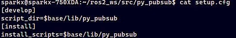


Python을이용한패키지생성실습
15
01
▶Subscriber 다운로드
•
새node를생성하기위해서ros2_ws/src/py_pubsub/py_pubsub로이동하고아래명령실행
1.
2.
3.
4.


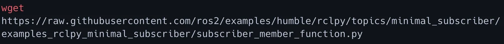

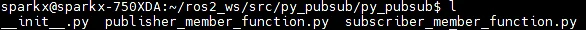
Python을이용한패키지생성실습
16
01
▶Subscriber code 분석

Python을이용한패키지생성실습
17
01
▶Subscriber code 분석
•
Imports
•
import rclpy ROS2의Python 클라이언트라이브러리를가져옴
•
from rclpy.node import Node Node 클래스를가져와노드를생성, 관리하는데필요한기능을사용
•
from std_msgs.msg import String ROS2의표준메시지패키지에서String 메시지유형을가져옴
•
MinimalSubscriber 클래스
•
이클래스는ROS2 노드로동작하며, 주요기능은메시지구독
•
__init__ 메서드
1. 노드의초기화를수행
2. create_subscription: 주어진토픽에대한구독자를생성(여기서토픽이름은'topic'이고, 메시지유형은String)
메시지가토픽에게시될때마다listener_callback 함수가호출됨
•
listener_callback 메서드
1. 토픽에게시된메시지를수신할때호출되는콜백함수
2. 수신된메시지의내용을로그에출력


Python을이용한패키지생성실습
18
01
▶Subscriber code 분석
•
main 함수
•
ROS2를초기화
•
MinimalSubscriber 클래스의인스턴스를생성
•
rclpy.spin : 이벤트루프를시작하여콜백을계속호출하게됨
(메시지가게시될때마다listener_callback 함수가호출됨)
•
destroy_node : 노드를명시적으로파괴(선택적, 가비지수집기에의해자동으로처리될수있음)
•
rclpy.shutdown : ROS2를종료하고모든리소스를해제
•
메인실행
•
스크립트가직접실행되면main 함수를호출(스크립트를모듈로임포트할때, main 함수가자동으로
호출되지않음)
•
전반적으로이코드는ROS2를사용하여'topic'이라는토픽에서String 메시지를구독하고, 해당
메시지의내용을로그에출력하는간단한구독자노드를구현


Python을이용한패키지생성실습
19
01
▶Subscriber node 작성
•
Setup.py 수정
•
console_script에listener 내용추가

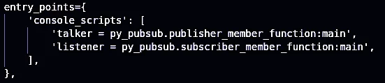


Python을이용한패키지생성실습
20
01
▶Subscriber node 작성
•
Setup.py 전체코드

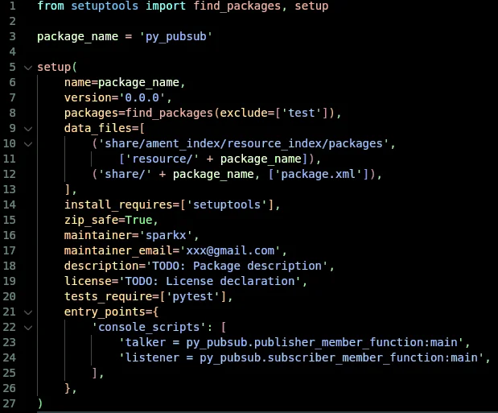


Python을이용한패키지생성실습
21
01
▶빌드및실행하기
•
의존성체크
•
새package 빌드


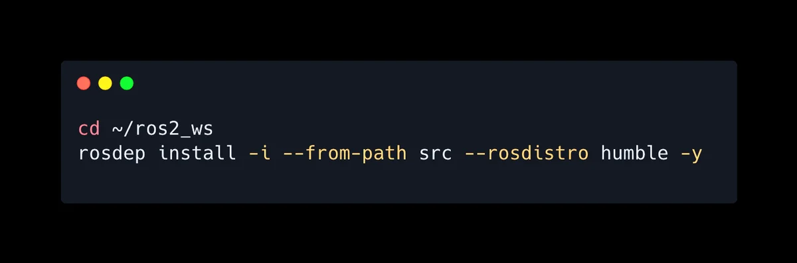

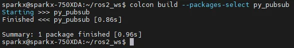


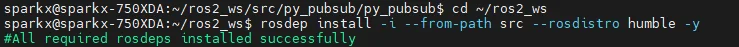


Python을이용한패키지생성실습
22
01
•
install/setup.bash를source 수행
•
새로운터미널을열어서입력

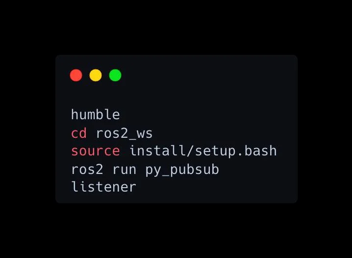


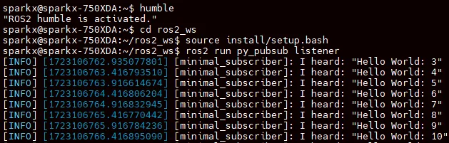

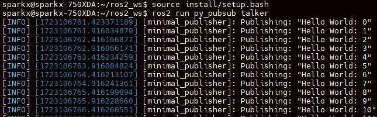


02
23
토픽, 서비스, 액션인터페이스
인터페이스(Interface) 신규작성
▶인터페이스(Interface)
•
ROS에서노드사이에데이터를전송시사용되는토픽(Topic), 서비스(Service), 액션(Action)
에서사용되는데이터타입
•
토픽은msg 파일, 서비스는srv 파일, 액션은action 파일에인터페이스가정의
•
일반적으로std_msgs나geometry_msgs와같은미리선언된인터페이스를바로사용가능
하나, 필요에따라커스텀인터페이스생성가능
•
단일패키지를가진프로그램에서사용시, 해당패키지포함시키기도하지만, 일반적으로단
일패키지를가지는프로그램을만드는경우는거의없음
•
여러개의패키지를가지는경우, 별도의인터페이스패키지를생성하여사용하는것을추천
(이경우여러패키지들이만들어진인터페이스패키지를공유하며사용가능)


02
24
토픽, 서비스, 액션인터페이스
인터페이스패키지생성
•
Service, action, msg를담는인터페이스폴더역시하나의패키지로생성
•
개발언어가python이라도build-type을ament_cmake로설정이필요
•
ament_cmake에는메시지를include하거나import할수있게하는기능이있지만, 
ament_python에는없음


02
25
토픽, 서비스, 액션인터페이스
인터페이스패키지생성
•
아래3개의폴더및파일을생성
•
파일명은반드시카멜케이스(CamelCase)만사용, 만약첫문자가소문자일경우빌드시오류발생
•
msg/MyMsg.msg
•
srv/MySrv.srv
•
action/MyAction.action


02
26
토픽, 서비스, 액션인터페이스
인터페이스패키지생성
•
생성한세개의폴더및파일에아래와같이작성
•
msg/MyMsg.msg
•
srv/MySrv.srv
•
action/MyAction.action


02
27
토픽, 서비스, 액션인터페이스
인터페이스패키지생성


02
28
토픽, 서비스, 액션인터페이스
인터페이스패키지생성
▶Package.xml 파일수정

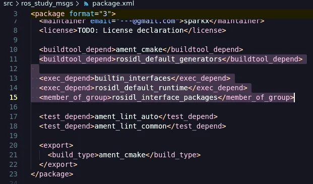


02
29
토픽, 서비스, 액션인터페이스
인터페이스패키지생성
▶CMakeLists.txt 파일수정


02
30
토픽, 서비스, 액션인터페이스
인터페이스패키지생성
▶빌드

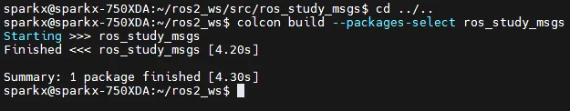


02
31
토픽, 서비스, 액션인터페이스
인터페이스패키지생성
▶빌드결과

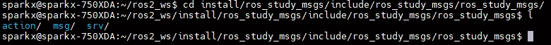
02
32
토픽, 서비스, 액션인터페이스
인터페이스패키지생성
▶빌드결과


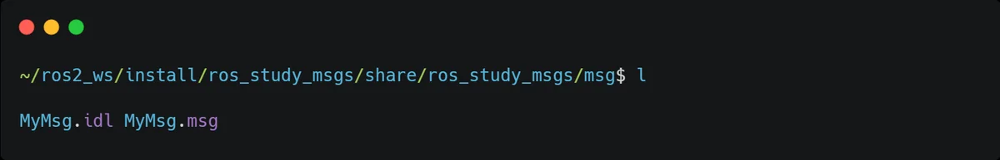


토픽, 서비스, 액션인터페이스실습
33
02
▶새로운패키지를새로생성하여, msg interface 테스트진행
토픽, 서비스, 액션인터페이스실습
34
02
▶my_msg_test.py를생성하고
다음과같이작성

토픽, 서비스, 액션인터페이스실습
35
02
▶package.xml
•
Package.xml에앞에생성한인터페이스패키지추가

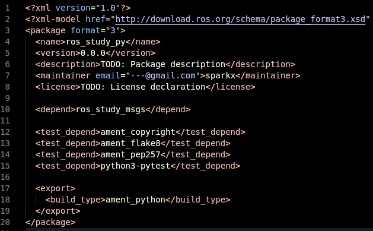


토픽, 서비스, 액션인터페이스실습
36
02
▶setup.py
•
setup.py에콘솔스크립트추가
토픽, 서비스, 액션인터페이스실습
37
02
▶빌드및실행
터미널- 1
터미널- 2

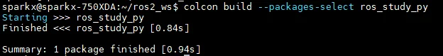

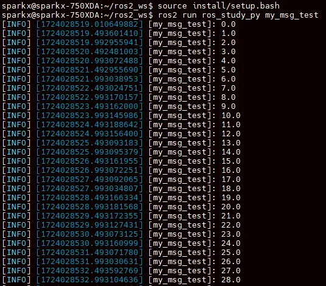

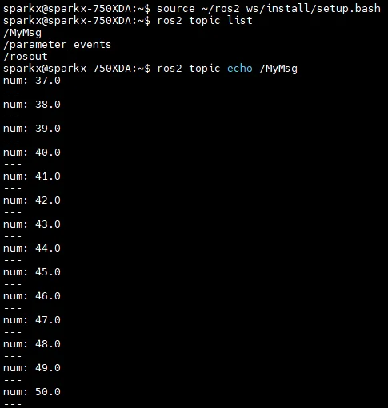


03
38
토픽, 서비스, 액션인터페이스
패키지설계
▶패키지설계
•
ROS2의토픽, 서비스, 액션프로그래밍을이용해서각노드들이서로연동되어구동하는패키지설계
•
프로세스를목적별로나누어노드단위의프로그램을작성하고노드와노드간의데이터통신을고려
하여설계
▶실습패키지설계
•
계산기개발
•
현재시간과변수a, b를받아연산하여
결과값도출
•
연산결과값을누적하여목표치에
도달했을때이결과값을표시


03
39
토픽, 서비스, 액션인터페이스
패키지설계
▶argument: arithmetic_argument 토픽이름으로현재시간과변수a, b를퍼블리시
▶calculator
•
토픽이생성시점과변수a,b를arithmetic_argument 토픽을통해수신(subscribe)
•
수신한변수a,b와operator 노드로부터요청값으로받은연산자를통해계산수행(a 연산자b)
•
연산결과를arithmetic_operator 이름의서비스응답값으로operator 노드에전송
•
Checker 노드로부터액션목표값(①action goal)을수신후, 저장된변수(a, b, 연산자)를활용해
연산한값을합산
•
계산이완료된결과를arithmetic_checker라는이름의액션피드백(②action feedback)으로
checker 노드에전송
•
합산된결과값이액션목표값을넘기면최종연산합계를arithmetic_checker라는이름의액션
결과값(③action result)으로checker에전송
▶operator: arithmetic_operator 서비스이름으로calculator 노드에게연산자(+-*/)를
서비스요청값으로보내기
▶checker: 연산값의합계의한계치를arithmetic_checker 액션이름으로액션목표값으로전달


03
40
토픽, 서비스, 액션인터페이스
패키지설계
▶패키지구성


03
41
토픽, 서비스, 액션인터페이스
토픽, 서비스, 액션복습

03
42
토픽, 서비스, 액션인터페이스
패키지설계
▶의존패키지설치
▶폴더구성


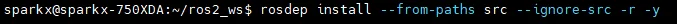

03
43
토픽, 서비스, 액션인터페이스
패키지설계
▶인터페이스패키지수정
CMakeList.txt
ArithmeticChecker.action
ArithmeticArgument.msg
ArithmeticOperator.srv


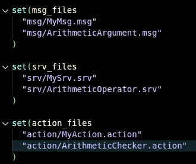


03
44
토픽, 서비스, 액션인터페이스
패키지설계
▶설정
Package.xml
Setup.py


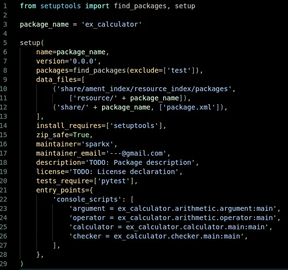


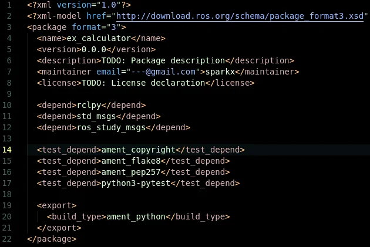


03
45
토픽, 서비스, 액션인터페이스
패키지설계
▶파라미터


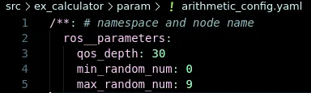


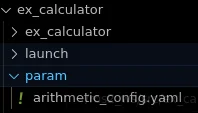


03
46
토픽, 서비스, 액션인터페이스
패키지설계
▶빌드


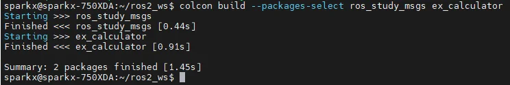

03
47
토픽, 서비스, 액션인터페이스
패키지설계
▶실행


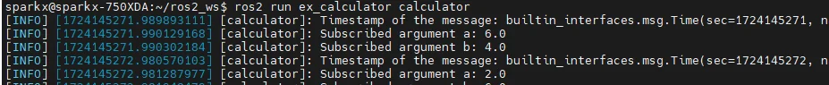


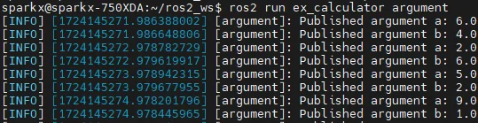


03
48
토픽, 서비스, 액션인터페이스
패키지설계
▶실행


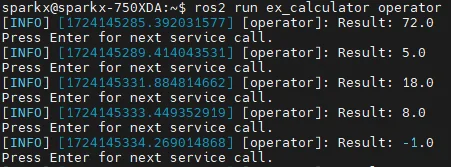


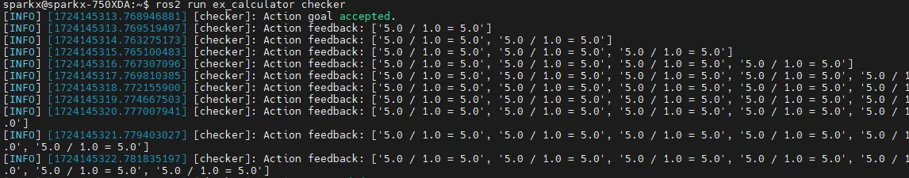


---

## Jupyter Notebooks


### py_pubsub

[](https://colab.research.google.com/github/OWNER/study-site/blob/main/notebooks/ros/jupyter_ros/py_pubsub.ipynb)

#### py_pubsub 패키지를 jupyter에서 실행하는 코드입니다.

#### Subscriber code


```python
import rclpy
from rclpy.node import Node
from std_msgs.msg import String


class MinimalSubscriber(Node):

    def __init__(self):
        super().__init__("minimal_subscriber")
        self.subscription = self.create_subscription(
            String, "topic", self.listener_callback, 10
        )
        self.subscription  # prevent unused variable warning

    def listener_callback(self, msg):
        self.get_logger().info(f"I heard: {msg.data}")


# def main(args=None):
#     rclpy.init(args=args)
#     minimal_subscriber = MinimalSubscriber()
#     rclpy.spin(minimal_subscriber)
#     minimal_subscriber.destroy_node()
#     rclpy.shutdown()
```

#### Publisher 코드드


```python
# import rclpy
# from rclpy.node import Node
# from std_msgs.msg import String


class MinimalPublisher(Node):

    def __init__(self):
        super().__init__("minimal_publisher")
        self.publisher_ = self.create_publisher(String, "topic", 10)
        timer_period = 0.5  # seconds
        self.timer = self.create_timer(timer_period, self.timer_callback)
        self.i = 0

    def timer_callback(self):
        msg = String()
        msg.data = f"Hello World: {self.i}"
        self.publisher_.publish(msg)
        self.get_logger().info(f"Publishing: {msg.data}")
        self.i += 1


# def main(args=None):
#     rclpy.init(args=args)
#     minimal_publisher = MinimalPublisher()
#     rclpy.spin(minimal_publisher)
#     minimal_publisher.destroy_node()
#     rclpy.shutdown()
```


```python
import time

rclpy.init()
minimal_subscriber = MinimalSubscriber()
minimal_publisher = MinimalPublisher()

try:
    for _ in range(30):
        rclpy.spin_once(minimal_publisher)
        rclpy.spin_once(minimal_subscriber)
        time.sleep(1.0)
finally:
    minimal_subscriber.destroy_node()
    minimal_publisher.destroy_node()
    rclpy.shutdown()
```

    [INFO] [1745347587.345396758] [minimal_publisher]: Publishing: Hello World: 0
    [INFO] [1745347587.363020318] [minimal_subscriber]: I heard: Hello World: 0
    [INFO] [1745347588.382281375] [minimal_publisher]: Publishing: Hello World: 1
    [INFO] [1745347588.392444829] [minimal_subscriber]: I heard: Hello World: 1
    [INFO] [1745347589.397276489] [minimal_publisher]: Publishing: Hello World: 2
    [INFO] [1745347589.401492075] [minimal_subscriber]: I heard: Hello World: 2
    [INFO] [1745347590.406465800] [minimal_publisher]: Publishing: Hello World: 3
    [INFO] [1745347590.412285797] [minimal_subscriber]: I heard: Hello World: 3
    [INFO] [1745347591.423198741] [minimal_publisher]: Publishing: Hello World: 4
    [INFO] [1745347591.428896320] [minimal_subscriber]: I heard: Hello World: 4
    [INFO] [1745347592.437301431] [minimal_publisher]: Publishing: Hello World: 5
    [INFO] [1745347592.464249416] [minimal_subscriber]: I heard: Hello World: 5
    [INFO] [1745347593.472981225] [minimal_publisher]: Publishing: Hello World: 6
    [INFO] [1745347593.478466727] [minimal_subscriber]: I heard: Hello World: 6
    [INFO] [1745347594.497613850] [minimal_publisher]: Publishing: Hello World: 7
    [INFO] [1745347594.505079717] [minimal_subscriber]: I heard: Hello World: 7
    [INFO] [1745347595.510113455] [minimal_publisher]: Publishing: Hello World: 8
    [INFO] [1745347595.517906515] [minimal_subscriber]: I heard: Hello World: 8
    [INFO] [1745347596.523199037] [minimal_publisher]: Publishing: Hello World: 9
    [INFO] [1745347596.528418310] [minimal_subscriber]: I heard: Hello World: 9
    [INFO] [1745347597.547920403] [minimal_publisher]: Publishing: Hello World: 10
    [INFO] [1745347597.573039215] [minimal_subscriber]: I heard: Hello World: 10
    [INFO] [1745347598.603897191] [minimal_publisher]: Publishing: Hello World: 11
    [INFO] [1745347598.646759026] [minimal_subscriber]: I heard: Hello World: 11
    [INFO] [1745347599.672670776] [minimal_publisher]: Publishing: Hello World: 12
    [INFO] [1745347599.702398701] [minimal_subscriber]: I heard: Hello World: 12
    [INFO] [1745347600.726534768] [minimal_publisher]: Publishing: Hello World: 13
    [INFO] [1745347600.758351270] [minimal_subscriber]: I heard: Hello World: 13
    [INFO] [1745347601.764941660] [minimal_publisher]: Publishing: Hello World: 14
    [INFO] [1745347601.778125855] [minimal_subscriber]: I heard: Hello World: 14
    [INFO] [1745347602.787342286] [minimal_publisher]: Publishing: Hello World: 15
    [INFO] [1745347602.796627497] [minimal_subscriber]: I heard: Hello World: 15
    [INFO] [1745347603.809495917] [minimal_publisher]: Publishing: Hello World: 16
    [INFO] [1745347603.813750236] [minimal_subscriber]: I heard: Hello World: 16
    [INFO] [1745347604.825612163] [minimal_publisher]: Publishing: Hello World: 17
    [INFO] [1745347604.829793945] [minimal_subscriber]: I heard: Hello World: 17
    [INFO] [1745347605.848952911] [minimal_publisher]: Publishing: Hello World: 18
    [INFO] [1745347605.869222031] [minimal_subscriber]: I heard: Hello World: 18
    [INFO] [1745347606.884785328] [minimal_publisher]: Publishing: Hello World: 19
    [INFO] [1745347606.902707266] [minimal_subscriber]: I heard: Hello World: 19
    [INFO] [1745347607.908448828] [minimal_publisher]: Publishing: Hello World: 20
    [INFO] [1745347607.922098954] [minimal_subscriber]: I heard: Hello World: 20
    [INFO] [1745347608.929721433] [minimal_publisher]: Publishing: Hello World: 21
    [INFO] [1745347608.934622211] [minimal_subscriber]: I heard: Hello World: 21
    [INFO] [1745347609.941516718] [minimal_publisher]: Publishing: Hello World: 22
    [INFO] [1745347609.947172148] [minimal_subscriber]: I heard: Hello World: 22
    [INFO] [1745347610.952531499] [minimal_publisher]: Publishing: Hello World: 23
    [INFO] [1745347610.957460791] [minimal_subscriber]: I heard: Hello World: 23
    [INFO] [1745347611.964997774] [minimal_publisher]: Publishing: Hello World: 24
    [INFO] [1745347611.969349325] [minimal_subscriber]: I heard: Hello World: 24
    [INFO] [1745347613.006396495] [minimal_publisher]: Publishing: Hello World: 25
    [INFO] [1745347613.019271631] [minimal_subscriber]: I heard: Hello World: 25
    [INFO] [1745347614.027281606] [minimal_publisher]: Publishing: Hello World: 26
    [INFO] [1745347614.033271141] [minimal_subscriber]: I heard: Hello World: 26
    [INFO] [1745347615.049126482] [minimal_publisher]: Publishing: Hello World: 27
    [INFO] [1745347615.055239037] [minimal_subscriber]: I heard: Hello World: 27
    [INFO] [1745347616.066164864] [minimal_publisher]: Publishing: Hello World: 28
    [INFO] [1745347616.076176764] [minimal_subscriber]: I heard: Hello World: 28
    [INFO] [1745347617.081895438] [minimal_publisher]: Publishing: Hello World: 29
    [INFO] [1745347617.085371150] [minimal_subscriber]: I heard: Hello World: 29
### PublisherTest

[](https://colab.research.google.com/github/OWNER/study-site/blob/main/notebooks/ros/jupyter_ros/PublisherTest.ipynb)

```python
import rclpy 
from geometry_msgs.msg import Twist

if not rclpy.ok():  # 또는 hasattr(rclpy, '_rclpy') 등으로 체크
    rclpy.init()
test_node = rclpy.create_node('pub_test')
```

    1745315536.778231 [25]    python3: selected interface "lo" is not multicast-capable: disabling multicast
```python
msg = Twist()
print(msg)
```

    geometry_msgs.msg.Twist(linear=geometry_msgs.msg.Vector3(x=0.0, y=0.0, z=0.0), angular=geometry_msgs.msg.Vector3(x=0.0, y=0.0, z=0.0))
```python
msg.linear.x = 0.0
print(msg)
```

    geometry_msgs.msg.Twist(linear=geometry_msgs.msg.Vector3(x=0.0, y=0.0, z=0.0), angular=geometry_msgs.msg.Vector3(x=0.0, y=0.0, z=0.0))
```python
pub = test_node.create_publisher(Twist, '/turtle1/cmd_vel', 10)
```


```python
msg.linear.x = 2.0
msg.angular.z = 2.0
pub.publish(msg)

```


```python
cnt = 0
def timer_callback():
    global cnt

    cnt += 1

    print(cnt)
    pub.publish(msg)

    if cnt > 5:
        raise Exception('publisher stop')
```


```python
timer_period = 0.1
timer = test_node.create_timer(0.1, timer_callback)
rclpy.spin(test_node)
```

    1
    2
    3
    4
    5
    6
    ---------------------------------------------------------------------------

    Exception                                 Traceback (most recent call last)

    Cell In[7], line 3
          1 timer_period = 0.1
          2 timer = test_node.create_timer(0.1, timer_callback)
    ----> 3 rclpy.spin(test_node)


    File /opt/ros/humble/local/lib/python3.10/dist-packages/rclpy/__init__.py:226, in spin(node, executor)
        224     executor.add_node(node)
        225     while executor.context.ok():
    --> 226         executor.spin_once()
        227 finally:
        228     executor.remove_node(node)


    File /opt/ros/humble/local/lib/python3.10/dist-packages/rclpy/executors.py:751, in SingleThreadedExecutor.spin_once(self, timeout_sec)
        750 def spin_once(self, timeout_sec: float = None) -> None:
    --> 751     self._spin_once_impl(timeout_sec)


    File /opt/ros/humble/local/lib/python3.10/dist-packages/rclpy/executors.py:748, in SingleThreadedExecutor._spin_once_impl(self, timeout_sec)
        746 handler()
        747 if handler.exception() is not None:
    --> 748     raise handler.exception()


    File /opt/ros/humble/local/lib/python3.10/dist-packages/rclpy/task.py:254, in Task.__call__(self)
        251 if inspect.iscoroutine(self._handler):
        252     # Execute a coroutine
        253     try:
    --> 254         self._handler.send(None)
        255     except StopIteration as e:
        256         # The coroutine finished; store the result
        257         self.set_result(e.value)


    File /opt/ros/humble/local/lib/python3.10/dist-packages/rclpy/executors.py:447, in Executor._make_handler.<locals>.handler(entity, gc, is_shutdown, work_tracker)
        444 gc.trigger()
        446 try:
    --> 447     await call_coroutine(entity, arg)
        448 finally:
        449     entity.callback_group.ending_execution(entity)


    File /opt/ros/humble/local/lib/python3.10/dist-packages/rclpy/executors.py:361, in Executor._execute_timer(self, tmr, _)
        360 async def _execute_timer(self, tmr, _):
    --> 361     await await_or_execute(tmr.callback)


    File /opt/ros/humble/local/lib/python3.10/dist-packages/rclpy/executors.py:107, in await_or_execute(callback, *args)
        104     return await callback(*args)
        105 else:
        106     # Call a normal function
    --> 107     return callback(*args)


    Cell In[6], line 11, in timer_callback()
          8 pub.publish(msg)
         10 if cnt > 5:
    ---> 11     raise Exception('publisher stop')


    Exception: publisher stop
```python
cnt = 0
phase = 0  # 짝수: 직진 / 홀수: 회전

def timer_callback():
    global cnt, phase

    print(f"[{cnt}] Phase: {phase}")

    if phase % 2 == 0:
        # 직진 단계
        msg.linear.x = 2.0
        msg.angular.z = 0.0
    else:
        # 회전 단계 (120도 회전 → 약 1.5초 동안 angular.z = 2.0)
        msg.linear.x = 0.0
        msg.angular.z = 1.5

    pub.publish(msg)
    cnt += 1

    # 각 단계의 지속 시간 설정 (0.1초 타이머 기준)
    if (phase % 2 == 0 and cnt >= 20):      # 직진 2초
        cnt = 0
        phase += 1
    elif (phase % 2 == 1 and cnt >= 15):    # 회전 1.5초
        cnt = 0
        phase += 1

    if phase >= 6:
        print("삼각형 그리기 완료 - shutdown")
        rclpy.shutdown()
        
timer = test_node.create_timer(0.1, timer_callback)
rclpy.spin(test_node)
```

    [0] Phase: 0
    [1] Phase: 0
    [2] Phase: 0
    [3] Phase: 0
    [4] Phase: 0
    [5] Phase: 0
    [6] Phase: 0
    [7] Phase: 0
    [8] Phase: 0
    [9] Phase: 0
    [10] Phase: 0
    [11] Phase: 0
    [12] Phase: 0
    [13] Phase: 0
    [14] Phase: 0
    [15] Phase: 0
    [16] Phase: 0
    [17] Phase: 0
    [18] Phase: 0
    [19] Phase: 0
    [0] Phase: 1
    [1] Phase: 1
    [2] Phase: 1
    [3] Phase: 1
    [4] Phase: 1
    [5] Phase: 1
    [6] Phase: 1
    [7] Phase: 1
    [8] Phase: 1
    [9] Phase: 1
    [10] Phase: 1
    [11] Phase: 1
    [12] Phase: 1
    [13] Phase: 1
    [14] Phase: 1
    [0] Phase: 2
    [1] Phase: 2
    [2] Phase: 2
    [3] Phase: 2
    [4] Phase: 2
    [5] Phase: 2
    [6] Phase: 2
    [7] Phase: 2
    [8] Phase: 2
    [9] Phase: 2
    [10] Phase: 2
    [11] Phase: 2
    [12] Phase: 2
    [13] Phase: 2
    [14] Phase: 2
    [15] Phase: 2
    [16] Phase: 2
    [17] Phase: 2
    [18] Phase: 2
    [19] Phase: 2
    [0] Phase: 3
    [1] Phase: 3
    [2] Phase: 3
    [3] Phase: 3
    [4] Phase: 3
    [5] Phase: 3
    [6] Phase: 3
    [7] Phase: 3
    [8] Phase: 3
    [9] Phase: 3
    [10] Phase: 3
    [11] Phase: 3
    [12] Phase: 3
    [13] Phase: 3
    [14] Phase: 3
    [0] Phase: 4
    [1] Phase: 4
    [2] Phase: 4
    [3] Phase: 4
    [4] Phase: 4
    [5] Phase: 4
    [6] Phase: 4
    [7] Phase: 4
    [8] Phase: 4
    [9] Phase: 4
    [10] Phase: 4
    [11] Phase: 4
    [12] Phase: 4
    [13] Phase: 4
    [14] Phase: 4
    [15] Phase: 4
    [16] Phase: 4
    [17] Phase: 4
    [18] Phase: 4
    [19] Phase: 4
    [0] Phase: 5
    [1] Phase: 5
    [2] Phase: 5
    [3] Phase: 5
    [4] Phase: 5
    [5] Phase: 5
    [6] Phase: 5
    [7] Phase: 5
    [8] Phase: 5
    [9] Phase: 5
    [10] Phase: 5
    [11] Phase: 5
    [12] Phase: 5
    [13] Phase: 5
    [14] Phase: 5
    삼각형 그리기 완료 - shutdown
```python

```


```python

```


### SubscriptionTest

[](https://colab.research.google.com/github/OWNER/study-site/blob/main/notebooks/ros/jupyter_ros/SubscriptionTest.ipynb)

```python
import rclpy # Ros2를 python에서 사용할 수 있게 해주는 module
from turtlesim.msg import Pose
```


```python
if not rclpy.ok():  # 또는 hasattr(rclpy, '_rclpy') 등으로 체크
    rclpy.init()
test_node = rclpy.create_node('sub_test')
```

    [WARN] [1744163682.294190713] [rcl.logging_rosout]: Publisher already registered for provided node name. If this is due to multiple nodes with the same name then all logs for that logger name will go out over the existing publisher. As soon as any node with that name is destructed it will unregister the publisher, preventing any further logs for that name from being published on the rosout topic.
```python
def callback1(data):
    print('---')
    print('/turtle1/pose :',data)
    print('x : ', data.x)
    print('y : ', data.y)
    print('theta : ', data.theta)
```


```python
cnt = 0
def callback2(data):
    global cnt
    cnt += 1
    print('>', cnt, '-> X :' , data.x, ',Y : ', data.y)
    if cnt > 3:
        raise Exception('subscription Stop')
```


```python
test_node.create_subscription(Pose, '/turtle1/pose',callback1,10)
```

    <rclpy.subscription.Subscription at 0x755184771b70>

```python
# node 연결
# <data_type> <topic_name> <callback> <QoS History>
test_node.create_subscription(Pose, '/turtle1/pose',callback2,10)
```

    <rclpy.subscription.Subscription at 0x7551847f0370>

```python
rclpy.spin_once(test_node)
```

    > 6 -> X : 5.544444561004639 ,Y :  5.544444561004639
    ---------------------------------------------------------------------------

    Exception                                 Traceback (most recent call last)

    Cell In[27], line 1
    ----> 1 rclpy.spin_once(test_node)


    File /opt/ros/humble/local/lib/python3.10/dist-packages/rclpy/__init__.py:206, in spin_once(node, executor, timeout_sec)
        204 try:
        205     executor.add_node(node)
    --> 206     executor.spin_once(timeout_sec=timeout_sec)
        207 finally:
        208     executor.remove_node(node)


    File /opt/ros/humble/local/lib/python3.10/dist-packages/rclpy/executors.py:751, in SingleThreadedExecutor.spin_once(self, timeout_sec)
        750 def spin_once(self, timeout_sec: float = None) -> None:
    --> 751     self._spin_once_impl(timeout_sec)


    File /opt/ros/humble/local/lib/python3.10/dist-packages/rclpy/executors.py:748, in SingleThreadedExecutor._spin_once_impl(self, timeout_sec)
        746 handler()
        747 if handler.exception() is not None:
    --> 748     raise handler.exception()


    File /opt/ros/humble/local/lib/python3.10/dist-packages/rclpy/task.py:254, in Task.__call__(self)
        251 if inspect.iscoroutine(self._handler):
        252     # Execute a coroutine
        253     try:
    --> 254         self._handler.send(None)
        255     except StopIteration as e:
        256         # The coroutine finished; store the result
        257         self.set_result(e.value)


    File /opt/ros/humble/local/lib/python3.10/dist-packages/rclpy/executors.py:447, in Executor._make_handler.<locals>.handler(entity, gc, is_shutdown, work_tracker)
        444 gc.trigger()
        446 try:
    --> 447     await call_coroutine(entity, arg)
        448 finally:
        449     entity.callback_group.ending_execution(entity)


    File /opt/ros/humble/local/lib/python3.10/dist-packages/rclpy/executors.py:372, in Executor._execute_subscription(self, sub, msg)
        370 async def _execute_subscription(self, sub, msg):
        371     if msg:
    --> 372         await await_or_execute(sub.callback, msg)


    File /opt/ros/humble/local/lib/python3.10/dist-packages/rclpy/executors.py:107, in await_or_execute(callback, *args)
        104     return await callback(*args)
        105 else:
        106     # Call a normal function
    --> 107     return callback(*args)


    Cell In[18], line 7, in callback2(data)
          5 print('>', cnt, '-> X :' , data.x, ',Y : ', data.y)
          6 if cnt > 3:
    ----> 7     raise Exception('subscription Stop')


    Exception: subscription Stop
```python
# 노드 구독 once는 한번만 그냥 spin은 무한 반복
rclpy.spin(test_node)
```

    > 1 -> X : 5.544444561004639 ,Y :  5.544444561004639
    > 2 -> X : 5.544444561004639 ,Y :  5.544444561004639
    > 3 -> X : 5.544444561004639 ,Y :  5.544444561004639
    > 4 -> X : 5.544444561004639 ,Y :  5.544444561004639
    ---------------------------------------------------------------------------

    Exception                                 Traceback (most recent call last)

    Cell In[20], line 2
          1 # 노드 구독 once는 한번만 그냥 spin은 무한 반복
    ----> 2 rclpy.spin(test_node)


    File /opt/ros/humble/local/lib/python3.10/dist-packages/rclpy/__init__.py:226, in spin(node, executor)
        224     executor.add_node(node)
        225     while executor.context.ok():
    --> 226         executor.spin_once()
        227 finally:
        228     executor.remove_node(node)


    File /opt/ros/humble/local/lib/python3.10/dist-packages/rclpy/executors.py:751, in SingleThreadedExecutor.spin_once(self, timeout_sec)
        750 def spin_once(self, timeout_sec: float = None) -> None:
    --> 751     self._spin_once_impl(timeout_sec)


    File /opt/ros/humble/local/lib/python3.10/dist-packages/rclpy/executors.py:748, in SingleThreadedExecutor._spin_once_impl(self, timeout_sec)
        746 handler()
        747 if handler.exception() is not None:
    --> 748     raise handler.exception()


    File /opt/ros/humble/local/lib/python3.10/dist-packages/rclpy/task.py:254, in Task.__call__(self)
        251 if inspect.iscoroutine(self._handler):
        252     # Execute a coroutine
        253     try:
    --> 254         self._handler.send(None)
        255     except StopIteration as e:
        256         # The coroutine finished; store the result
        257         self.set_result(e.value)


    File /opt/ros/humble/local/lib/python3.10/dist-packages/rclpy/executors.py:447, in Executor._make_handler.<locals>.handler(entity, gc, is_shutdown, work_tracker)
        444 gc.trigger()
        446 try:
    --> 447     await call_coroutine(entity, arg)
        448 finally:
        449     entity.callback_group.ending_execution(entity)


    File /opt/ros/humble/local/lib/python3.10/dist-packages/rclpy/executors.py:372, in Executor._execute_subscription(self, sub, msg)
        370 async def _execute_subscription(self, sub, msg):
        371     if msg:
    --> 372         await await_or_execute(sub.callback, msg)


    File /opt/ros/humble/local/lib/python3.10/dist-packages/rclpy/executors.py:107, in await_or_execute(callback, *args)
        104     return await callback(*args)
        105 else:
        106     # Call a normal function
    --> 107     return callback(*args)


    Cell In[18], line 7, in callback2(data)
          5 print('>', cnt, '-> X :' , data.x, ',Y : ', data.y)
          6 if cnt > 3:
    ----> 7     raise Exception('subscription Stop')


    Exception: subscription Stop
```python

```


---

## Code Examples


### `turtlesim/my_first_package/`

[View full source on GitHub](https://github.com/OWNER/study-site/tree/main/source/turtlesim/my_first_package/){ .md-button }

#### `turtlesim/my_first_package/my_first_package/my_first_node.py`

```python
def main():
    print('Hi from my_first_package.')


if __name__ == '__main__':
    main()

```

#### `turtlesim/my_first_package/my_first_package/__init__.py`

```python

```

#### `turtlesim/my_first_package/my_first_package/my_first_publisher.py`

```python
import rclpy as rp
from rclpy.node import Node
from geometry_msgs.msg import Twist


class TurtlesimPublisher(Node):

    def __init__(self):
        super().__init__("turtlesim_publisher")
        self.publisher = self.create_publisher(Twist, "/turtle1/cmd_vel", 10)

        timer_period = 0.5
        self.timer = self.create_timer(timer_period, self.timer_callback)

    def timer_callback(self):
        msg = Twist()
        msg.linear.x = 2.0
        msg.angular.z = 2.0
        self.publisher.publish(msg)


def main():
    rp.init(args=None)

    turtlesim_publisher = TurtlesimPublisher()
    rp.spin(turtlesim_publisher)

    turtlesim_publisher.destroy_node()
    rp.shutdown()

if __name__ == "__main__":
    main()

```
