# 강의_3기_ROS2입문_3차시


ROS2 프로그래밍입문(3차시)

3. 인터페이스프로그래밍(응용_1)


## 인터페이스프로그래밍(응용_1)
1.  인터페이스프로그래밍(ex_- calculator)
2.  Launch 프로그래밍
인터페이스프로그래밍
토픽프로그래밍

## 토픽퍼블리셔/ 토픽서브스크라이버

토픽프로그래밍
토픽퍼블리셔코드

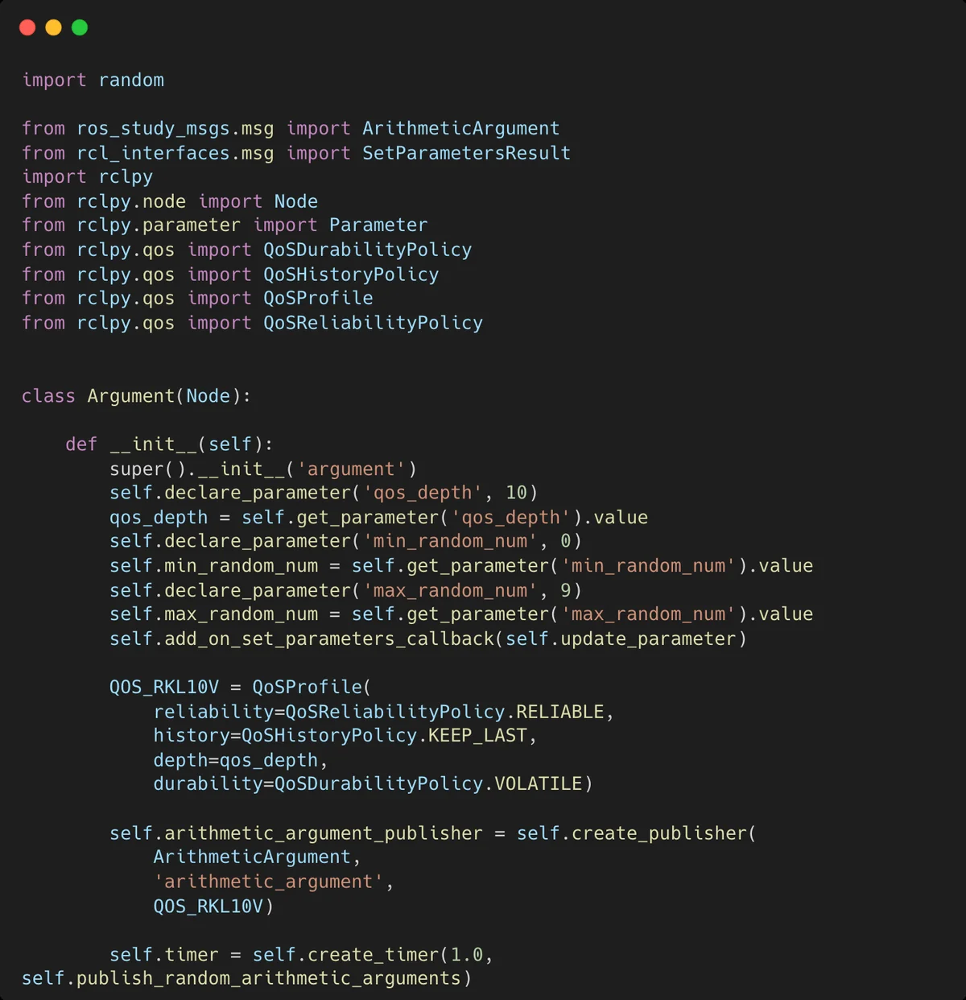


## Argument 클래스설정
- Node클래스를rclpy.node 모듈에서상속
- 생성자에'argument'라는노드이름으로노드 초기화

## QoS 설정
- rclpy.qos 모듈의QoSProfile 클래스를이용하여 토픽퍼블리셔의QoS 설정값적용
- QoS 설정값: RELIABLE, KEEP_LAST, DEPTH 10, VOLATILE 토픽프로그래밍 토픽퍼블리셔코드
- Node 클래스의create_publisher 함수를사용 하여퍼블리셔선언
- 토픽타입: ArithmeticArgument
- 토픽이름: 'arithmetic_argument
- 'QoS 설정: 이전에설정한QOS_RKL10V 사용

## ararithmetic_argument_publisher 선언
## create_timer 함수를이용하여1초마다publish_random_arithmetic_arguments 함수실행설정
## create_publisher에서의설정들은퍼블리시를위한기본설정
## 실제토픽발행이이루어지는부분은publish_random_arithmetic_arguments 함수
토픽프로그래밍
토픽퍼블리셔코드


- 타이머콜백함수로1초마다실행
- msg 변수를ArithmeticArgument() 클래스로생성(지난‘토픽, 서 비스, 액션인터페이스’ 강좌에서작성한msg 인터페이스활용)
- 토픽생성시간을get_clock().now().to_msg()로가져와 msg.stamp에기록
- 랜덤함수로0~9 사이의숫자를float로변환하여 msg.argument_a와msg.argument_b에저장

## publish_random_arithmetic_arguments 함수
- 실제로토픽발행이이루어지는함수로우리가발행시간 및변수a, b를저장한msg 메시지를퍼블리시한다는의미

## arithmetic_argument_publisher.publish(msg) 함수
- get_logger().info() 를사용하여디버깅목적으로변수a, b 값을터미널에표시

## 로그출력
토픽프로그래밍
토픽퍼블리셔코드
토픽프로그래밍
토픽퍼블리셔코드
- 토픽퍼블리셔노드와마찬가지로Node 클래스상속
- 생성자에서'calculator'라는이름으로노드초기화
- 토픽서브스크라이버, 서비스서버, 액션서버를포함 하여코드가길기때문에전체코드는생략
- 여기서는토픽서브스크라이버관련코드만설명
- Calculator 클래스설정
- QoSProfile 클래스를이용하여토픽서브스크라이버의 QoS 설정적용
- QoS 설정값: RELIABLE, KEEP_LAST, DEPTH 10, VOLATILE (토픽퍼블리셔와동일설정)
- QoS에대한자세한내용은'DDS의QoS(Quality of Service)' 강좌참고
- 제일중요한설정으로Node 클래스의create_subscription 함수를이용하여서브스크라이버로선언
- get_arithmetic_argument라는콜백함수를지정하여퍼블 리셔로부터메시지를서브스크라이브할때마다실행되 는함수를지정
- ReentrantCallbackGroup으로callback_group을지정하여 콜백함수를병렬로실행할수있게해주며뒤에서설정
- 이후설명할MultiThreadedExecutor와함께사용됨
- arithmetic_argument_subscriber 설정
- callback_group
- MutuallyExclusiveCallbackGroup이기본설정으로사용됨
- MutuallyExclusiveCallbackGroup: 한번에하나의콜백함 수만실행하도록제한
- ReentrantCallbackGroup: 제한없이콜백함수를병렬로 실행가능 토픽프로그래밍 토픽서브스크라이버코드 토픽프로그래밍 토픽서브스크라이버코드
- 콜백함수인이함수는'arithmetic_argument'이라는토픽 이름에ArithmeticArgument 타입의메시지를서브스크라 이브하게되면실행됨
- 서브스크라이브한msg의argument_a와argument_b를 멤버변수에저장하고, get_logger().info() 함수를이용하여 토픽으로받은시간, 변수a, b 값을화면에표시
- get_arithmetic_argument 토픽프로그래밍 토픽퍼블리셔& 서브스크라이버복습

## 토픽퍼블리셔
(데이터를송신하는프로그램)
- Node 설정
- create_publisher 설정
- 퍼블리시함수작성

## 토픽서브스크라이버
(데이터를수신하는프로그램)
- Node 설정
- create_subscription 설정
- 서브스크라이브함수작성


## 이번목표
- 실행노드를어떻게설정하여사용가능하게만드는지설명
- calculator: 이강좌에서다룬토픽서브스크라이버노드
- argument: 토픽퍼블리셔노드 토픽프로그래밍 노드실행코드


## entry_points 설정
- setup.py의entry_points는실행가능한콘솔스크립트이름과호출함수를지정
- 'ros2 run' 명령어로각노드를실행할수있도록4개의노드entry_points 추가

## 노드파일경로
- argument 노드: ex_calculator 패키지의arithmetic 폴더의argument.py main문에실행코드포함
- operator 노드: ex_calculator 패키지의arithmetic 폴더의operator.py main문에실행코드포함
- calculator 노드: ex_calculator 패키지의calculator 폴더의main.py main문에실행코드포함
- checker 노드: ex_calculator 패키지의checker 폴더의main.py main문에실행코드포함 토픽프로그래밍 노드실행코드


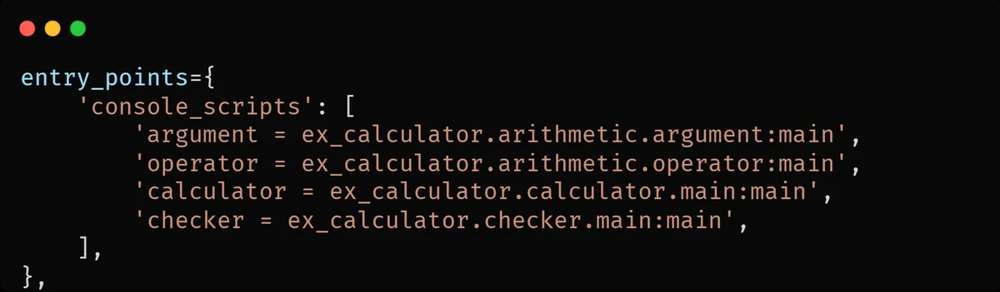


## argument 노드
- main 함수로rclpy.init를이용하여초기화
- Argument 클래스를argument라는이름으로 생성
- rclpy.spin 함수를이용하여생성한노드를spin 시켜지정된콜백함수실행
- 종료(ctrl + c)와같은인터럽트시그널예외상 황에서는argument를소멸시키고 rclpy.shutdown 함수로노드를종료 토픽프로그래밍 노드실행코드

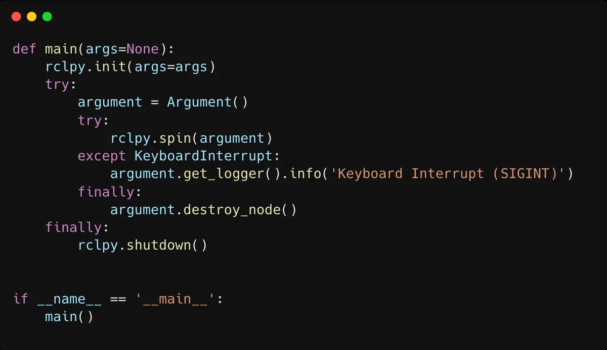


토픽프로그래밍
노드실행코드

## calculator 노드초기화
- rclpy.init를이용하여ROS2 초기화
- Calculator 클래스를calculator라는이름으로생성
- MultiThreadedExecutor를사용하여4개스레드로구성된executor 생성

## MultiThreadedExecutor 설정
- 스레드풀(thread pool)을사용하여콜백을병렬로실행
- num_threads로스레드수를지정가능
- 콜백을병렬로처리가능하여ReentrantCallbackGroup과함께사용시병렬실행 지원

## 콜백함수의병렬처리설정
- create_subscription(), create_service(), ActionServer(), create_timer() 등의함수로설정 된콜백함수들의병렬처리가능

## executor와노드실행
- calculator 노드를MultiThreadedExecutor에추가
- executor.spin()으로노드를실행하여지정된콜백함수실행가능’

## 종료처리
- 인터럽트시그널(Ctrl + C) 발생시, executor, calculator의액션서버(별도소멸 필요), calculator 노드를소멸
- rclpy.shutdown으로노드를종료


서비스프로그래밍
서비스클라이언트/서버

1.    operator node
arithmetic_operator 이라는서비스이름으로calculator 노드에게연산자(+, -, *, /)를서비스
요청(Request) 값으로보냄

2.    calculator node
서브스크라이브하여저장하고있는변수a, b와operator 노드로부터요청값으로받은연산자
를이용하여계산(a 연산자b)하고operator 노드에게연산의결과값을서비스응답(Response)
값으로보냄
서비스요청을하는서비스클라이언트와서비스응답을하는서비스서버를작성해볼것이다.
여기서서비스요청값으로는연산자(+, -, *, /)를임의로선택후에보낼것이고기존에저장한
변수a, b를요청값으로받은연산자로계산하여결과값을서비스응답값으로보내는프로그
램을짜볼것이다. 강좌진행에앞서서서비스에대한자세한내용은‘ROS2 서비스(service)’
강좌를참고하도록하자


서비스프로그래밍
서비스클라이언트/서버


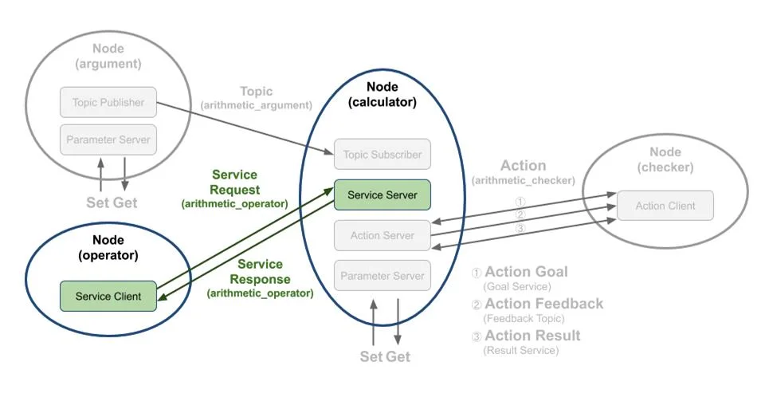


서비스프로그래밍
서비스서버코드
src/ex_calculator/ex_calculator/calculator/calculator.py


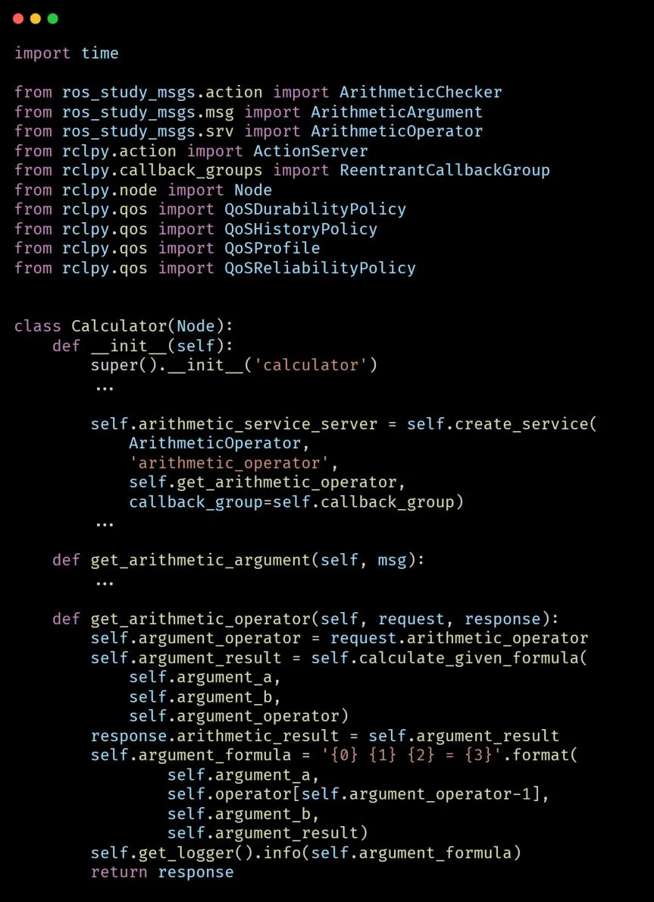


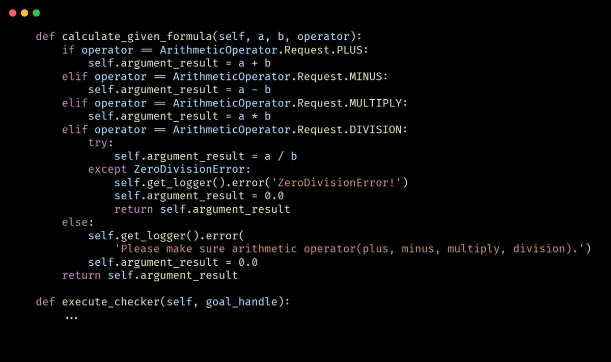


서비스프로그래밍
서비스서버코드
src/ex_calculator/ex_calculator/calculator/calculator.py

## calculator 노드초기화
- 변수(a, b)와operator 노드로부터요청값으로받은연산자 를이용해계산수행
- 연산결과를operator 노드에서비스응답값으로전송

## 서비스서버설정코드
- 서비스서버선언: arithmetic_service_server를Node 클래스 의create_service 함수로선언
- 서비스타입: ArithmeticOperator
- 서비스이름: 'arithmetic_operator’
- 콜백함수: get_arithmetic_operator (서비스요청시실행)
- callback_group 설정: 멀티스레드병렬콜백함수실행지원
- 콜백을병렬로처리가능하여ReentrantCallbackGroup과함께 사용시병렬실행지원

## 콜백함수역할
- 콜백함수인get_arithmetic_operator이실제서비스요청에 해당되는특정수행코드가수행되는부분


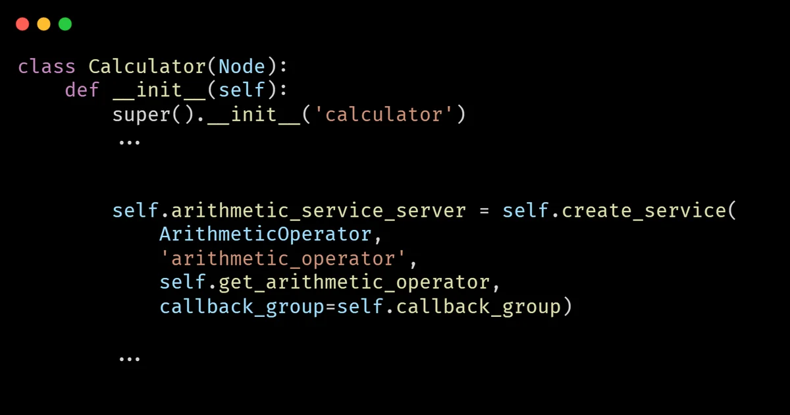


서비스프로그래밍
서비스서버코드
src/ex_calculator/ex_calculator/calculator/calculator.py

## get_arithmetic_operator 함수
- 매개변수:
- request와response는ArithmeticOperator() 클래스로생성된인터 페이스
- request: 서비스요청데이터
- response: 서비스응답데이터

## 함수의역할
- 서비스요청시실행되는콜백함수
- request에서받은연산자와, 토픽서브스크라이버가전달받아 저장한변수(a, b)를사용해연산수행
- 연산결과를서비스응답값(response)으로반환

## 연산과정
- request.arithmetic_operator를calculate_given_formula 함수에 전달하여연산수행연산결과를response.arithmetic_result에 저장
- 관련수식을**get_logger().info()**를통해문자열로출력하여 화면에표시


서비스프로그래밍
서비스서버코드
src/ex_calculator/ex_calculator/calculator/calculator.py

## calculate_given_formula 함수와같이인수a와b, 그리고연산자(operator)를가지고
사칙연산을수행후결과값을반환


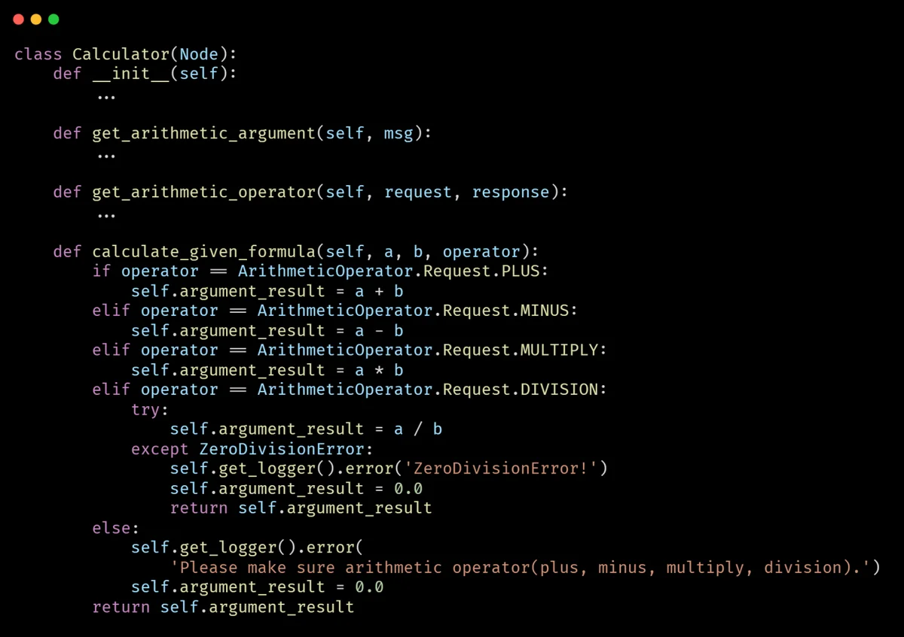


서비스프로그래밍
서비스서버실행코드
src/ex_calculator/ex_calculator/calculator/main.py
- 서비스서버(calculator 노드) : 토픽서브스 크라이버, 서비스서버, 액션서버를역할을 하는복합기능의노드
- 실행코드에대한설명은이전강좌인'토픽 프로그래밍(Python)' 참조

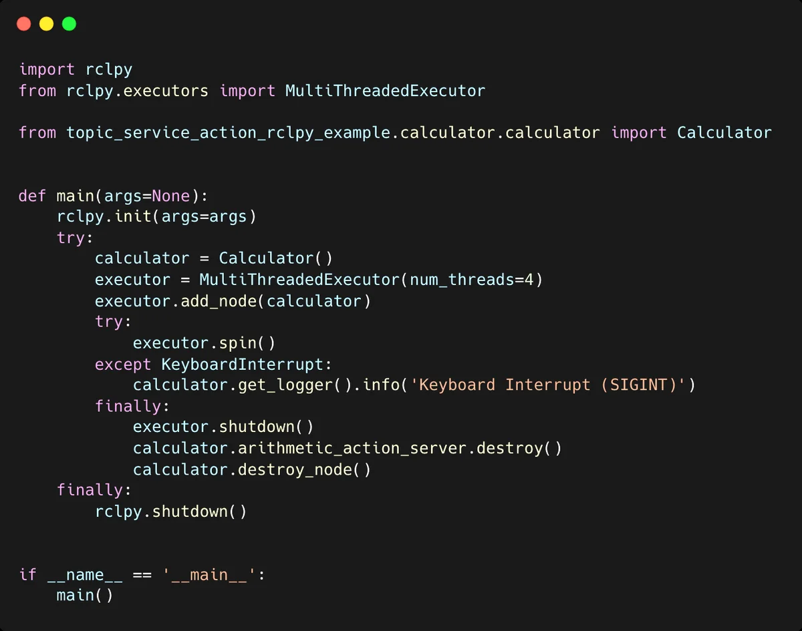


서비스프로그래밍
서비스클라이언트코드
src/ex_calculator/ex_calculator/arithmetic/operator.py


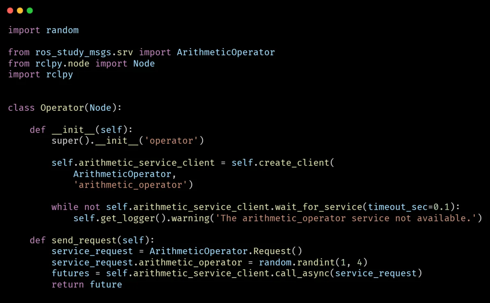


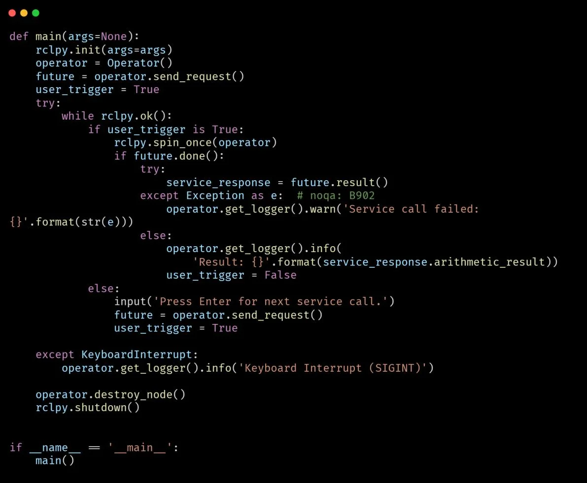


서비스프로그래밍
서비스클라이언트코드
src/ex_calculator/ex_calculator/arithmetic/operator.py

## Operator 클래스초기화
- rclpy.node 모듈의Node 클래스상속
- 생성자에서노드이름을'operator'로초기화

## arithmetic_service_client 설정
- Node 클래스의create_client 함수를이용하여서비스클라이언트로선언
- 서비스의타입: ArithmeticOperator(서비스서버와동일)로선언하였고
- 서비스이름: ‘arithmetic_operator’로선언하였다

## wait_for_service 함수
- 서비스요청가능여부를위해0.1초간격으로서비스서버가실행되어있는지확인


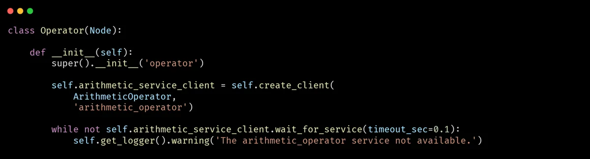


서비스프로그래밍
서비스클라이언트코드
src/ex_calculator/ex_calculator/arithmetic/operator.py

## 서비스클라이언트의목적: 서비스서버에게연산에필요한연산자를전달
## 서비스요청설정: 서비스인터페이스ArithmeticOperator.Request() 클래스로
service_request를선언후random.randint() 함수를이용하여특정연산자를
self.request의arithmetic_operator 변수에저장

## send_request 함수: 실질적인서비스클라이언트의실행코드로서비스요청값을서버에
보내고응답값을수신

## call_async(self.request) 함수로서비스요청수행
## 서비스상태및응답값을담은futures를반환


서비스프로그래밍
서비스클라이언트노드실행코드
src/ex_calculator/setup.py

## operator 노드(서비스클라이언트노드)
- 'ex_calculator' 패키지의일부로, 패키지설정파일의'entry_points'에콘솔스크립트의이름 과호출함수를기입(ex_calcurator.arithmetic.operator:main)하여'ros2 run' 과같은노드실행 명령어를통하여각각의노드를실행
- ex_calculator 패키지의arithmetic 폴더에operator.py의main문에실행코드가담겨져있음


서비스프로그래밍
서비스클라이언트노드실행코드
src/ex_calculator/ex_calculator/arithmetic/operator.py
- rclpy.init를이용하여초기화
- Operator 클래스를operator라는이름으로생성한 후future = operator.send_request()로서비스요청 을전송후응답값수신
- rclpy.spin_once 함수로노드를주기적으로spin시켜 지정된콜백함수가실행
- 각spin마다노드의콜백함수가실행
- 서비스응답값을수신시future의done 함수를이용 해요청값을제대로받았는지확인
- 결과값을service_response = future.result()로저장
- get_logger().info() 함수를이용하여화면에서비스 응답값에해당되는연산결과값을표시
- ‘ctrl + c'와같은인터럽트시그널예외상황에서 operator를소멸시키고rclpy.shutdown 함수로노드 를종료


서비스프로그래밍
서비스클라이언트노드실행코드
src/ex_calculator/ex_calculator/arithmetic/operator.py
- 서비스클라이언트는한번실행후종료되는 방식으로, 토픽과같은지속적인수행은없음
- 다만, 예제에서는원하는시점에서비스요청 을다시보낼수있도록user_trigger 변수와 input(＇xxxxx＇)을사용해반복실행가능하 게구성
- 최초1회에한해서사용자입력없이바로임 의의연산자를서비스요청값으로송신
- 그이후노드가종료되기전까지, 사용자의입 력을받을때마다임의의연산자를랜덤으로 선택해서비스요청값으로송신
- 즉. 최초요청후서비스재요청이필요할경우, 터미널창에서엔터키를눌러operator 실행
- 연산자선택은사칙연산자(+, -, * , /)  중하나 가랜덤으로선택되어송신됨

액션프로그래밍
액션클라이언트/서버
다음그림과같은액션목표(action goal)를지정하는액션클라이언트와액션목표를받아특
정태스크를수행하면서중간결과값에해당되는액션피드백(action feedback)과최종결과값
에해당되는액션결과(action result)를전송하는액션서버를작성해볼것이다.


액션프로그래밍
액션서버코드
src/ex_calculator/ex_calculator/calculator/calculator.py


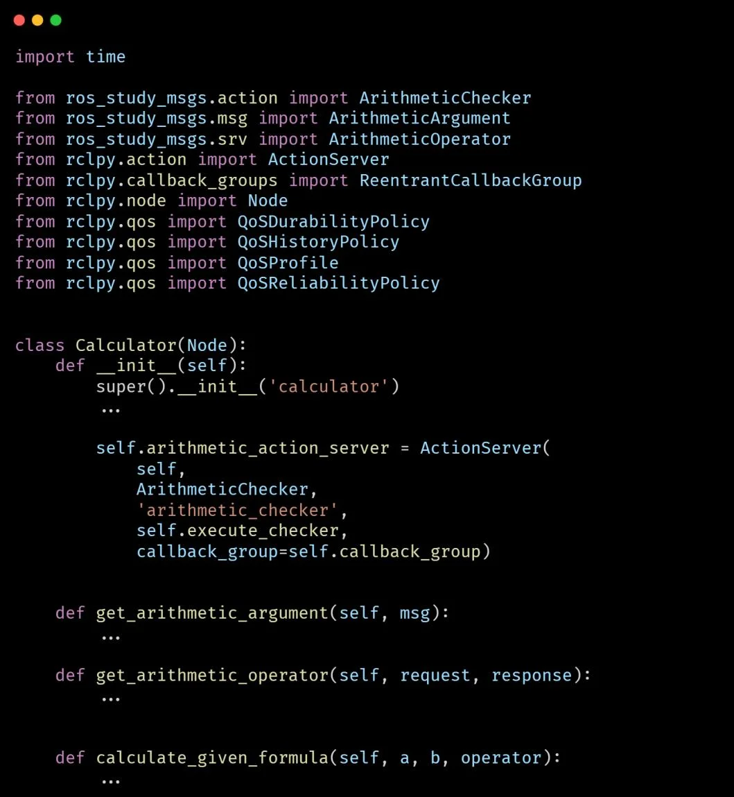

액션프로그래밍
액션서버코드
src/ex_calculator/ex_calculator/calculator/calculator.py

## arithmetic_action_server : rclpy.action
모듈의ActionServer 클래스를이용하여
액션서버로선언
- 액션타입: ArithmeticChecker
- 액션이름: 'arithmetic_checker’
- 콜백함수: execute_checker(액션클라이언트로 부터액션목표를받으면실행됨)
- 멀티스레드병렬콜백함수실행을위한 callback_group 설정적용

## 이러한설정들은액션서버를위한기본
설정이고실제액션목표를받은후에
실행되는콜백함수는execute_checker
함수임을알아두자


액션프로그래밍
액션서버코드
src/ex_calculator/ex_calculator/calculator/calculator.py

## goal_handle 매개변수
- rclpy.action 모듈의ServerGoalHandle 클래스로 생성된액션상태처리용으로execute, succeed, abort, canceled 등액션상태에따른관련함수 호출가능
- publish_feedback을통해피드백퍼블리시가능 Get_logger().info() 함수를이용해터미널창에 액션서버시작표시 ArithmeticChecker.Feedback()을통해액션피 드백을보낼feedback_msg 변수선언 실제피드백에해당되는 feedback_msg.formula와연산합계값을담을 total_sum 변수초기화 goal_handle를이용하여 goal_handle.request.goal_sum에서액션목표 값을불러옴

## ## ## ## 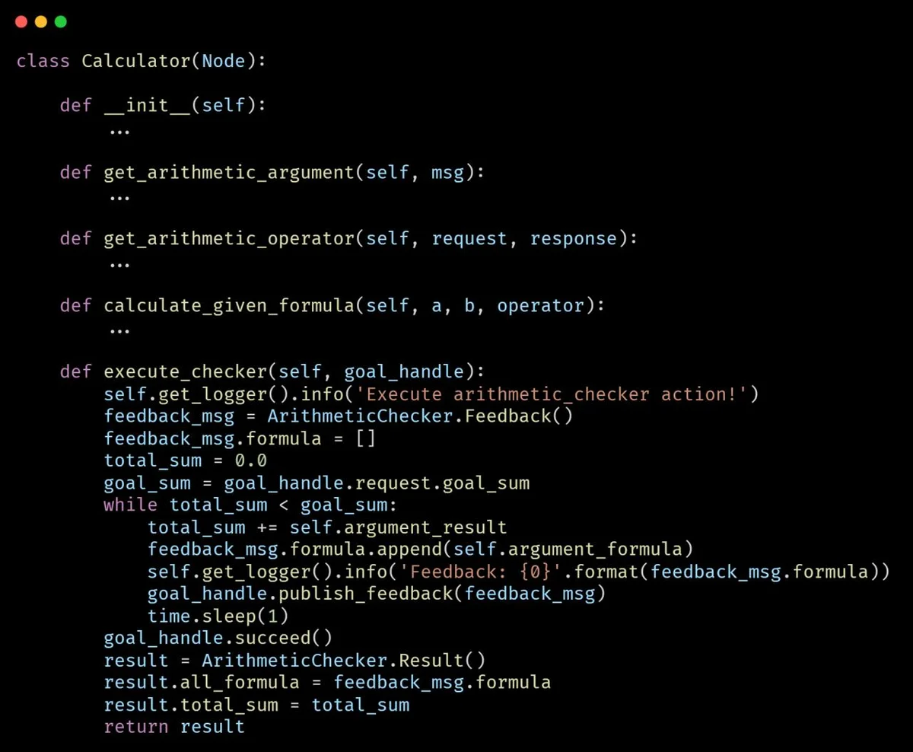


액션프로그래밍
액션서버코드
src/ex_calculator/ex_calculator/calculator/calculator.py

## •
total_sum: argument_result(매번계산되는
연산결과값)를누적한합계
액션목표값(goal_sum)과total_sum이
액션목표값(goal_sum)을넘을때까지
연산식(argument_formula)을액션피드
백(feedback_msg.formula)에저장

## 피드백값은디버깅을위해
get_logger().info()을통해터미널창에출
력후goal_handle.publish_feedback() 함
수를통해액션클라이언트로전송


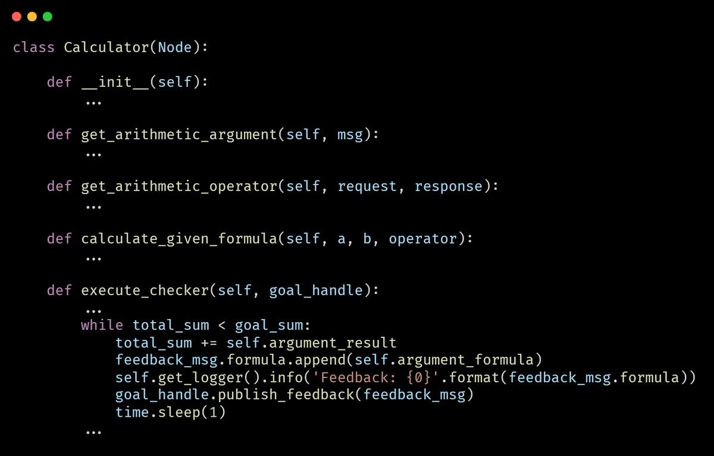


액션프로그래밍
액션서버코드
src/ex_calculator/ex_calculator/calculator/calculator.py

## 액션목표를달성했다는상태전환함수인
goal_handle.succeed()를실행시켜액션
클라이언트에게현재의액션상태를알림

## 액션결과값인all_formula에계산식전체
를저장하고total_sum에연산합계를저
장하여액션결과값인result은리턴


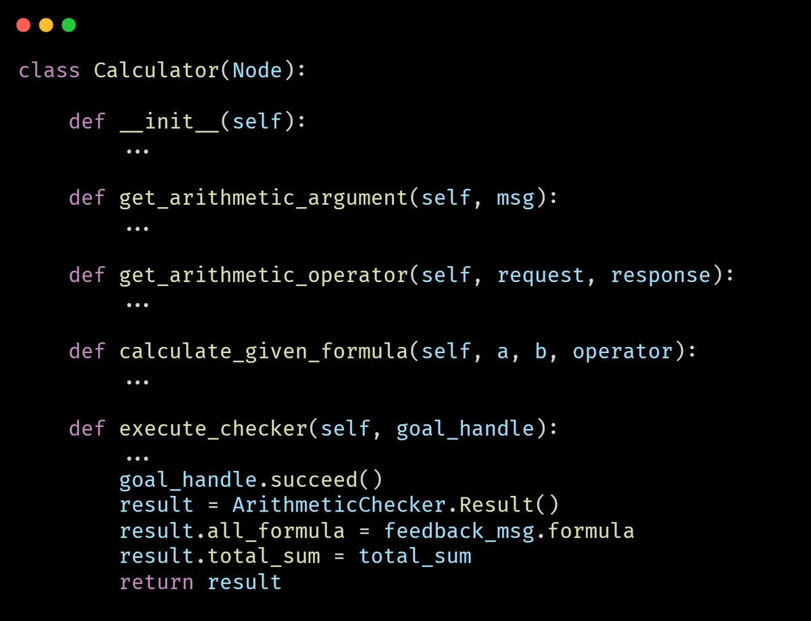


액션프로그래밍
액션서버실행코드
src/ex_calculator/ex_calculator/calculator/main.py

## 액션서버인calculator 노드는토픽서브
스크라이버, 서비스서버, 액션서버를역
할을하는복합기능의노드

## 해당코드에대한설명은토픽프로그래밍
(Python) 강좌참조


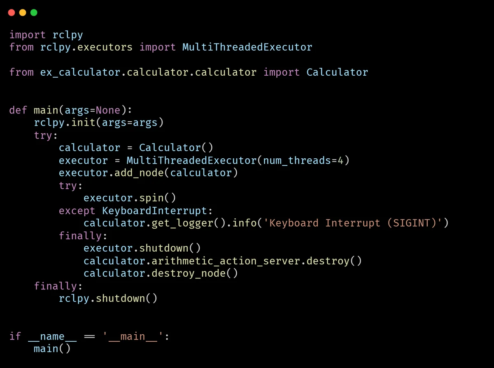


액션프로그래밍
액션클라이언트코드
src/ex_calculator/ex_calculator/checker/checker.py


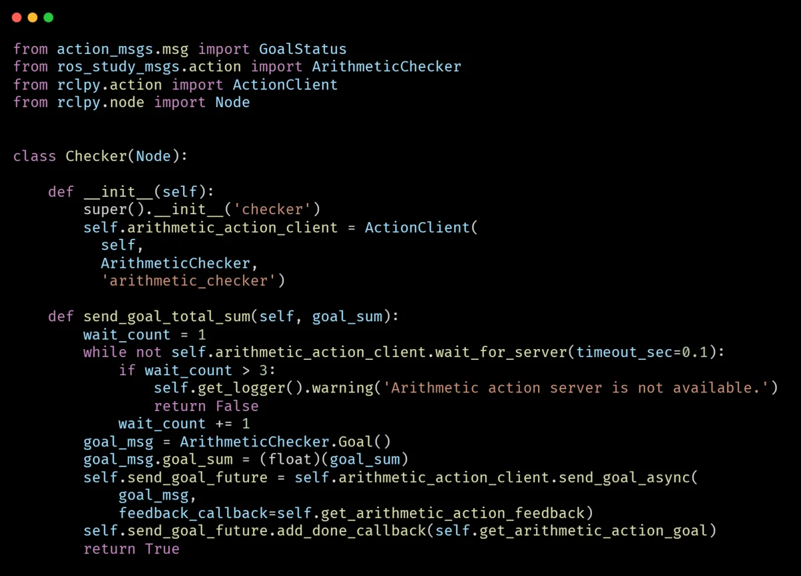


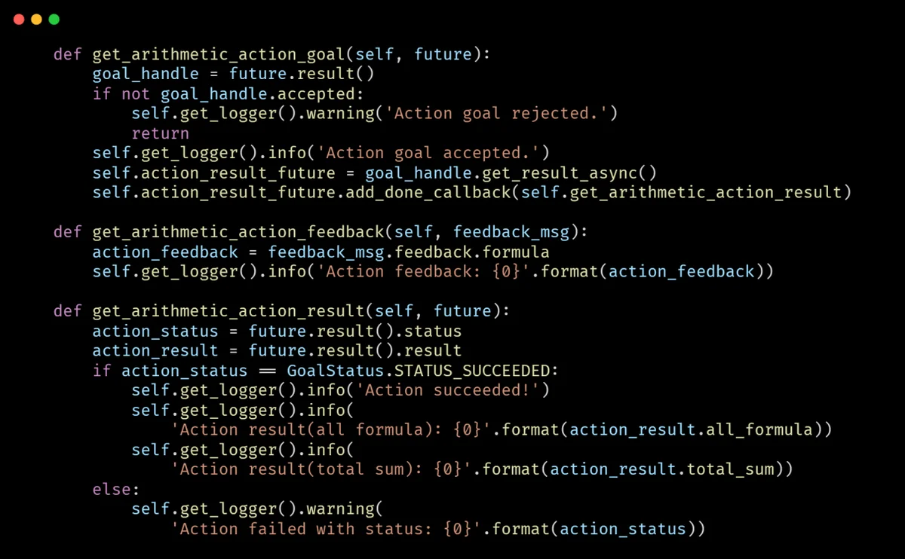


액션프로그래밍
액션클라이언트코드
src/ex_calculator/ex_calculator/checker/checker.py

## Checker 클래스
- rclpy.node 모듈의Node 클래스를상속
- 생성자에서노드이름을‘checker'로초기화

## 액션클라이언트에서수행하는액션목표
는토픽과달리, 필요시에만비정기적으로
실행됨

## 여기서는예시를위해액션목표를main
함수에서한번만실행

## rclpy.action모듈의ActionClient 클래스
이용하여액션클라이언트선언
- 액션타입: ArithmeticChecker
- 액션이름: 'arithmetic_checker’


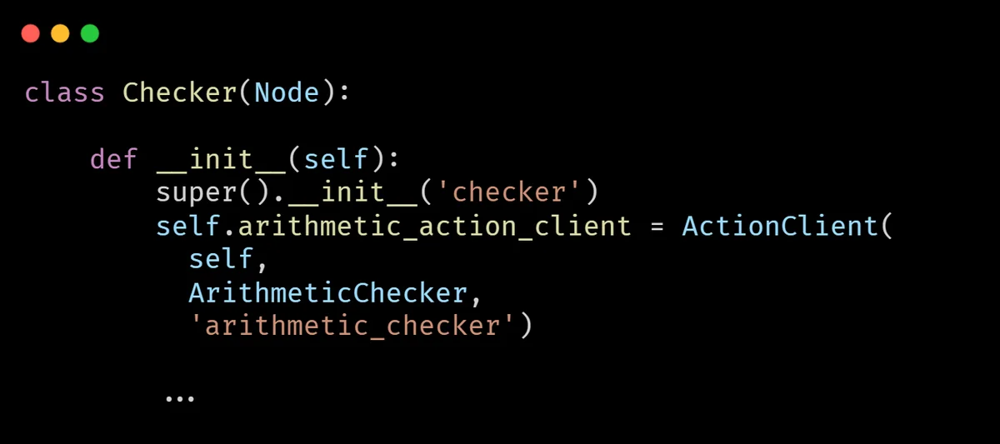


액션프로그래밍
액션클라이언트코드
src/ex_calculator/ex_calculator/checker/checker.py

## send_goal_total_sum 함수
- 액션목표를액션서버에게전송하고, 액션피드백및결과값을받기위한 콜백함수지정

## 액션클라이언트가액션서버에연결
시도를함

## 연결에문제가있을때에while문을
반복하게되고문제없이연결되었을
때에는다음구문으로넘어감


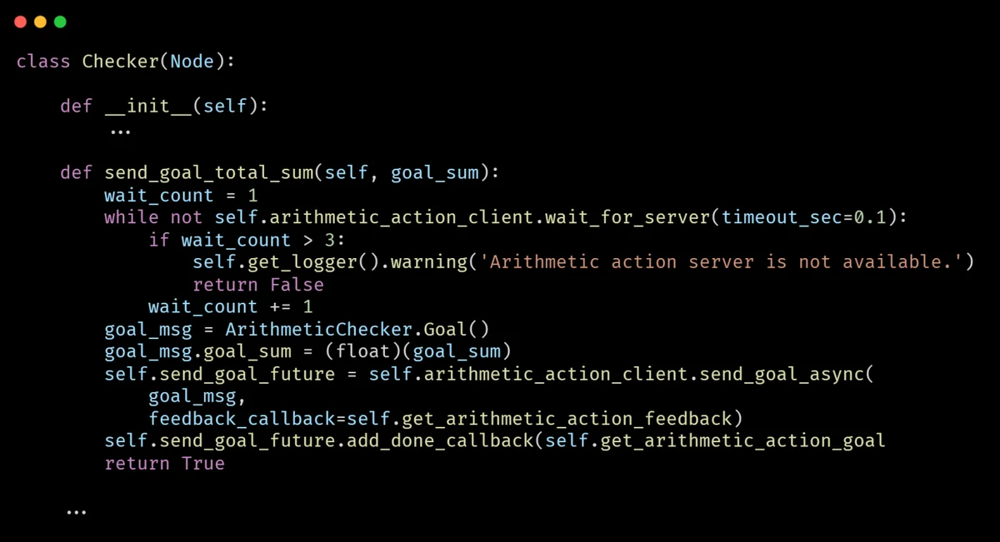

액션프로그래밍
액션클라이언트코드
src/ex_calculator/ex_calculator/checker/checker.py

## 액션메시지설정
- ArithmeticChecker.Goal() 클래스로액션메시 지(goal_msg) 선언
- goal_msg.goal_sum으로액션목푯값설정

## 비동기액션전송및피드백설정
- ActionClient 클래스의send_goal_async 함수 를이용해설정해둔액션메시지를매개변 수로전달
- 액션피드백을수신을위한콜백함수로 get_arithmetic_action_feedback 지정

## 액션결과수신설정
- send_goal_async으로선언된비동기작업 (future task)인send_goal_future의 add_done_callback 함수를통해액션결과값 을받을때사용할콜백함수로 get_arithmetic_action_goal를선언

1. 액션클라이언트선언: arithmetic_action_client
2. 액션목푯값전달함수선언: send_goal_future
3. 액션피드백값콜백함수선언: get_arithmetic_action_feedback
4. 액션상태값콜백함수선언: get_arithmetic_action_goal
5. 액션결과값콜백함수선언: get_arithmetic_action_result


액션프로그래밍
액션클라이언트코드
src/ex_calculator/ex_calculator/checker/checker.py

## 액션피드백값콜백함수
- 액션피드백을액션서버로부터전달받 으면get_arithmetic_action_feedback 콜백 함수실행
- 피드백인feedback_msg.feedback.formula 값을받아get_logger().info()으로터미널창 에출력

## 액션상태값콜백함수
- 비동기작업(future task)으로생성된 send_goal_future에대해add_done_callback 함수를사용해콜백함수설정
- 이콜백함수는액션서버가액션목푯값을 수신했을때Goal State Machine의상태가 accepted인지확인하여처리
- 액션목푯값을문제없이전달된경우, 액션 결과를받을콜백함수를 get_arithmetic_action_result로설정


액션프로그래밍
액션클라이언트코드
src/ex_calculator/ex_calculator/checker/checker.py

## 앞서지정한"액션결과값콜백함수"
는비동기future task로현재의상태값
(status)과결과값(result)을수신

## 상태값이STATUS_SUCCEEDED 일때
액션서버로부터전달받은액션결과값
인계산식(action_result.all_formula)과
연산합계(action_result.total_sum)를
터미널창에출력

액션프로그래밍
액션클라이언트노드실행코드
src/ex_calculator/setup.py

## 액션클라이언트노드인checker 노드는
'ex_calculator' 패키지의일부로패키지
설정파일내부의'entry_points'에실행
가능한콘솔스크립트의이름과호출함
수로기입(checker=
ex_calculator.checker.main:main)

## 이와같이argument, operator,
calculator 노드도작성하여'ros2 run' 과
같은노드실행명령어를통해각각의노
드를실행가능하도록함

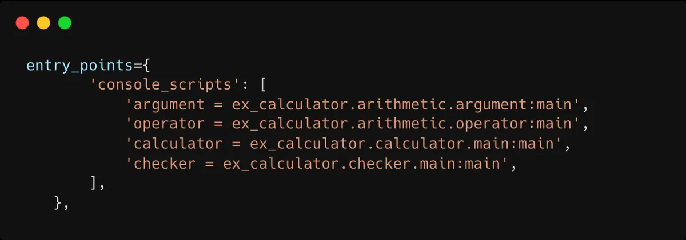


액션프로그래밍
액션클라이언트노드실행코드
src/ex_calculator/ex_calculator/checker/main.py

## main 함수실행코드:
- rclpy.init를통해ROS2 노드초기화
- Checker 클래스를checker라는이름으로생성
- 액션목푯값을전달하는send_goal_total_sum 함수실행

## 실행인자(args.goal_total_sum) 사용
- 프로그램의실행시인자를사용해사용자가노드를실행 시킬때액션목푯값을설정가능.
- 목표값이지정되지않았을경우기본값으로50이입력됨
- 실행인자에대한자세한설명은추후강좌에서다룰예정

## 콜백함수실행및유지
- rclpy.spin 함수를이용하여rclpy의콜백함수가지속적으로 실행되도록설정

## 종료및자원해제
- 종료시('Ctrl + c'와같은인터럽트시그널) checker 객체 소멸및rclpy.shutdown 함수로노드종료
- 추가적으로토픽이나서비스와는달리액션클라이언트는 'checker.arithmetic_action_client.destroy()' 와같이별도로소 멸시켜야함


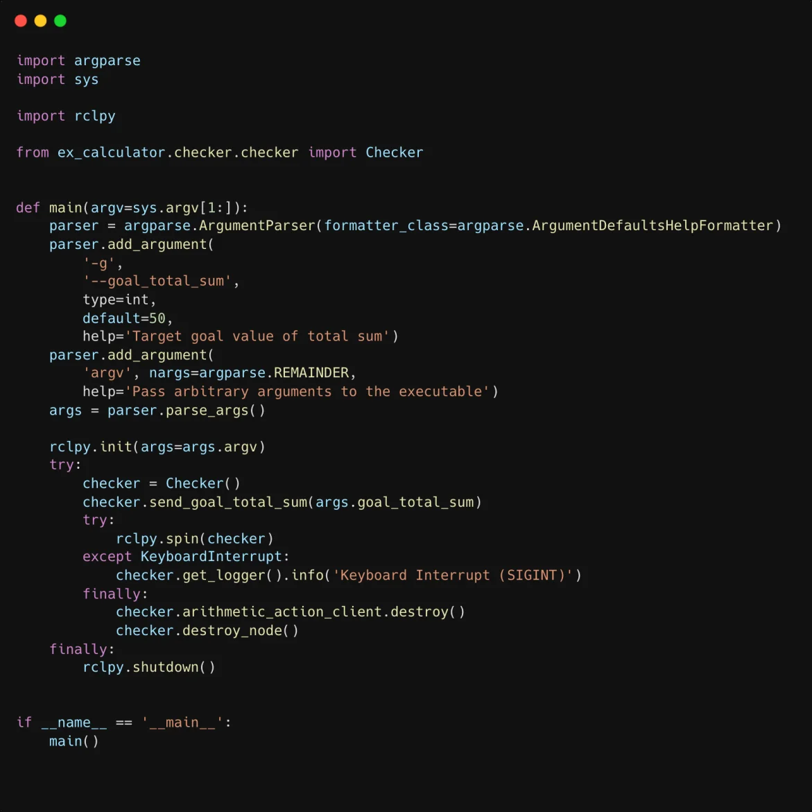


파라미터프로그래밍
파라미터
우리는이전강좌에서토픽, 서비스, 액션관련프로그래밍을익히기위하여argument, operator, calculator,
checker 노드를작성해보았다. 이들노드중에서다음그림과같이argument 노드와calculator 노드는파
라미터를사용하고있다. argument 노드는QoS 설정과랜덤으로생성되는변수a, b의랜덤생성범위를파
라미터를이용했었고calculator 노드는QoS 설정을사용하였다. 우리는여기서argument 노드에서사용되
는파라미터에대해자세히알아볼것이다.


파라미터프로그래밍
파라미터설정
1.
declare_parameter 함수
2.
get_parameter 함수
3.
add_on_set_parameters_callback 함수

## argument 노드에서파라미터를선언하고파라미터값이변경되는함수에대해
자세히알아보자

## Argument 클래스의생성자부분에서다음과같은코드가있다. ROS2에서파라
미터를사용하려면하기와같이크게3가지의요소가필요

## 1번의declare_parameter 함수는노드에서사용할파라미터의고유이름을지
정하고초깃값설정(파라미터에대한설명이들어가는descriptor은생략함)

## 2번의get_parameter 함수는노드에서사용할파라미터의파라미터고유이름
을이용해불러옴. 이는주로launch 파일에서선언된*.yaml 형태의파라미터
파일의값을불러오는데사용됨

## 3번의add_on_set_parameters_callback 함수는서비스형태로파라미터변경
요청이있을때사용되는함수로지정된콜백함수를호출


파라미터프로그래밍
파라미터설정
src/ex_calculator/ex_calculator/checker/main.py

파라미터프로그래밍
파라미터설정
src/ex_calculator/ex_calculator/checker/main.py

## 파라미터선언및초기설정
- declare_parameter 함수로'max_random_num'과 같은파라미터선언
- 노드실행시get_parameter 함수가지정된파라 미터파일에서초깃값을불러와설정

## 파라미터변경요청처리
- 파라미터변경요청발생시 add_on_set_parameters_callback을통해지정된 콜백함수인update_parameter 함수실행
- update_parameter 콜백함수에서는변경하려는 파라미터의이름과타입이동일한경우해당파 라미터값변경

## argument 노드에서는파라미터값으로QoS
설정과랜덤으로생성되는변수a, b의랜덤
생성범위를파라미터를이용하여설정.

## min_random_num 값과max_random_num
값을이용하여퍼블리시할때변수a, b의랜
덤생성범위를변경함


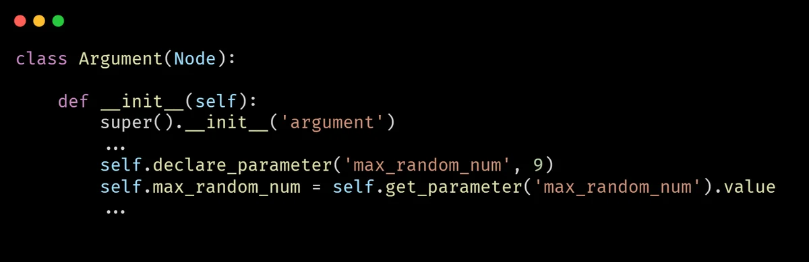

파라미터프로그래밍
파라미터설정파라미터사용방법(CLI)

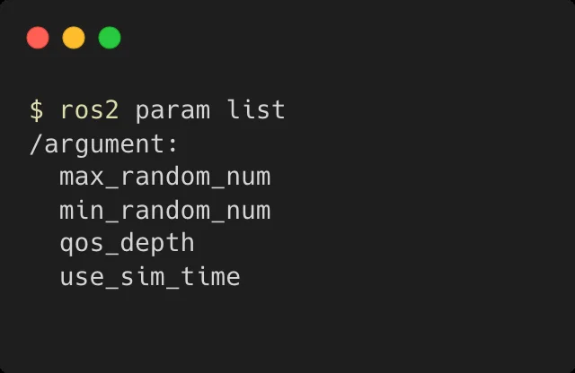

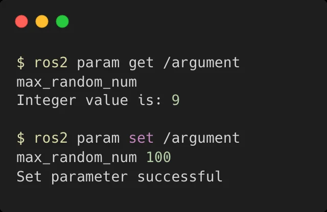

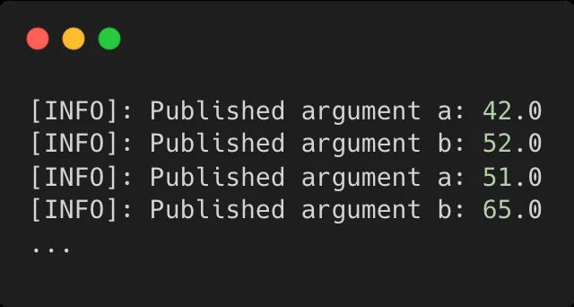


파라미터프로그래밍
파라미터사용방법(서비스클라이언트)

## 앞설명에서는CLI를이용하여파라미터를조회하고, 변경하고읽는실습을진행했다.
그러나파라미터는CLI뿐만아니라다른노드의소스코드에서도읽고변경할수있다.
예를들어SetParameters라는인터페이스를이용하면서비스클라이언트와유사한
방식으로서비스요청을통해파라미터를변경할수있다.

## 여기서클라이언트를선언하고서비스를요청하는방식은기존의서비스클라이언트
와완전히동일하다. 다만, 서비스요청값에파라미터의이름, 형태, 값을지정하는게
다르다. 이와관련된세부내용은set_max_random_num_parameter 함수에서확인
가능하다. 해당함수에서는Parameter 클래스를사용해name, type, integer_value
등을매개변수로설정한다. 이를통해A 노드에서B 노드의파라미터를변경할수있
게된다.


파라미터프로그래밍
기본파라미터설정방법(launch 설정)

## 참고로새롭게지정된*.yaml 파일및*.launch.py 파일을
ROS 파일시스템에맞추어설치하게하려면하기와같이
python 패키지설정파일'setup.py'에옵션을추가해야
한다.

## launch 파일에특정파라미터파일을추가하면, 노드를실행
할때해당파일의파라미터이름과값을참조하여자동으로
초기화가능
src/ex_calculator/launch/arithmetic.launch.py


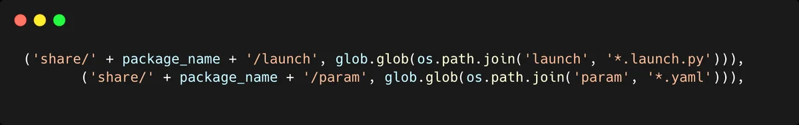


실행인자프로그래밍

## 실행인자
- 프로그램실행시추가로입력되는인수로, main 함수의매개변수로사용됨
- 실행명령어와함께전달되어프로그램동작에영향을줌

## 예시: $ ros2 run ex_calculator checker –g 100
- ros2 run: ROS2 명령어
- ex_calculator: 패키지이름
- checker: 실행할노드
- -g 100: 실행인자, 여기서는GOAL_TOTAL_SUM 값을100으로설정
- Parameter 매개변수
- Argument 실행인자

## 참고로파라미터(parameter)는매개변수로풀이하고아규먼트(argument)
는실행인자라풀이된다. C++ 언어에서는이들의분류를더확실히하는
편인데Parameter는함수선언시사용되고Argument는함수호출시의
인수라고생각하면된다


실행인자프로그래밍
ROS2 에서의실행인자처리

## C++
- main 함수에서argc를통해인자개수를받고, argv로 인자를배열형태로받는형식으로인자처리
- argc와argv를rclcpp의init 함수에인자로전달

## Python(인수무시할때)
- 두번째예제와같이args를None으로설정후에rclpy 모듈의init 함수에바로넘김

## Python(인수사용할때)
- argv의첫번째인자(실행명및실행경로정보)를삭제 한후argv에저장.
- 수정된argv를rclpy모듈의init 함수에넘김
- 이때C++과는달리argparse 모듈을이용해실행인자 를위한구문해석프로그램작성필요 ※   참고로argc, argv, args는다음과같은의미로사용됨
- argc argument count
- argv argument vector or value
- args arguments


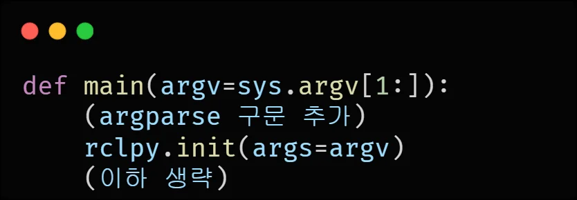


실행인자프로그래밍
실행인자의구문해석

## 실행인자구문
- Checker 노드의main 함수에서실행인자처리코 드가구현되어있음
- 해당코드를통해실행인자를다루어볼것
- 실행인자의구문해석프로그램은python의 argparse 모듈을이용하여파서를선언후사용할 실행인자값을지정하는것이주를이룸
- 이를순서대로나열하면다음과같음 1. 파서만들기(parser = argparse.ArgumentParser) 2. 인자추가하기(parser.add_argument) 3. 인자파싱하기(args = parser.parse_args()) 4. 인자사용하기(args.xxx) src/ex_calculator/ex_calculator/checker/main.py


실행인자프로그래밍
실행인자의구문해석

1.  파서만들기
- argparse 모듈의ArgumentParser 객체를parser라는이 름으로선언
- 여기서formatter_class으로argparse 모듈의가장기본 적인형식을사용하도록설정 src/ex_calculator/ex_calculator/checker/main.py

2.  인자추가하기
3.  인자파싱하기
- parse_args() 메서드를통해인자를파싱

4.  인자사용하기
- 인자를사용하려면args 변수를통해파싱하여대입
- 예를들어add_argument로추가한'--goal_total_sum’  인자 는'args.goal_total_sum’ 형태로사용가능
- add_argument() 메서드를호출하고인자의내용을채워 실행인자추가가능.
- 인자이름: -g(줄인이름), --goal_total_sum(풀네임)
- 데이터타입: int형
- 기본값: 50
- 설명: 지정인자에대한설명추가(프로그램을실행시'-h'와 같이실행인자에대한도움말을실행하면볼수있는문구)


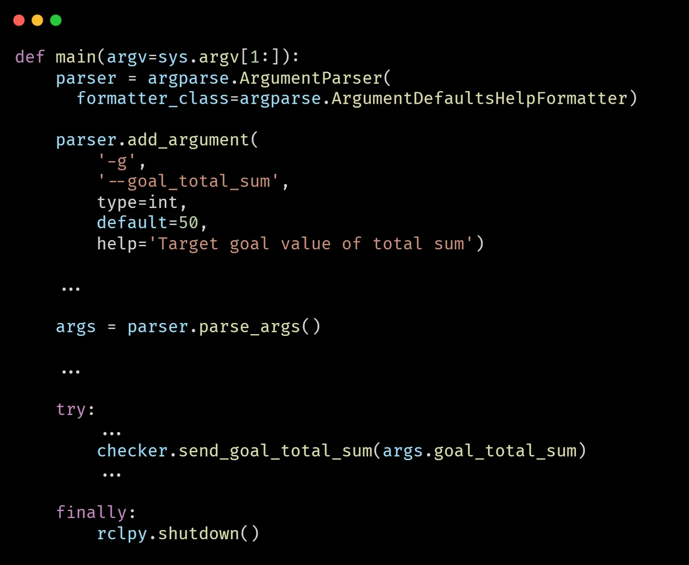

런치프로그래밍
ROS2 Launch System

## ROS2에서노드실행:
- ros2 run 명령어를사용하여특정패키지의하나의노드를실행가능
- 이명령어로도단일노드실행에는문제가없지만, 일반적으로ROS에서는여러노드를동시에실행하며 상호작용하게설정하는경우가많음
- 기존패키지의노드를사용하거나다양한옵션을입력하여실행하는경우도빈번함
- 이를위해하나이상의정해진노드를실행시킬수있는'launch' 라는개념이존재
- 더불어, 노드를실행할때패키지의매개변수나노드이름변경, 노드네임스페이스설정, 환경변수변경 등의옵션을사용할수있음
- ROS1에서는roslaunch로*.launch XML 파일을사용해노드를설정하며, 태그별옵션을제공
- 반면ROS2에서는더다양한환경과기능을추가하기위하여기존XML 방식이외에Python 방식도추가됨

## 이강좌에서는기존XML 방식보다더활용도가높은Python 방식을다룸
## ROS2 Launch System에대한더자세한설명은참고자료문서및코드를참고
▷https://design.ros2.org/articles/roslaunch.html
▷https://design.ros2.org/articles/roslaunch_xml.html
▷https://github.com/ros2/launch/tree/master/launch_yaml
▷https://github.com/ros2/launch


런치프로그래밍
ROS2 Launch System

## 새로운런치파일생성:
- 'ex_calculator' 패키지에새로운launch 파일을생성
- launch 파일의역할
- argument 노드와calculator 노드를실행
- 두노드에서사용할파라미터파일을설정

## launch 파일생성방법
- 원하는패키지에launch 이라는폴더가있어야함
- 해당폴더에'*.launch.py' 형식의launch 파일생성
- 여기서는'arithmetic.launch.py' 이라는파일명을사용
- 'arithmetic.launch.py' 파일은하기위치에위치해있음 └ ex_calculator/launch/arithmetic.launch.py

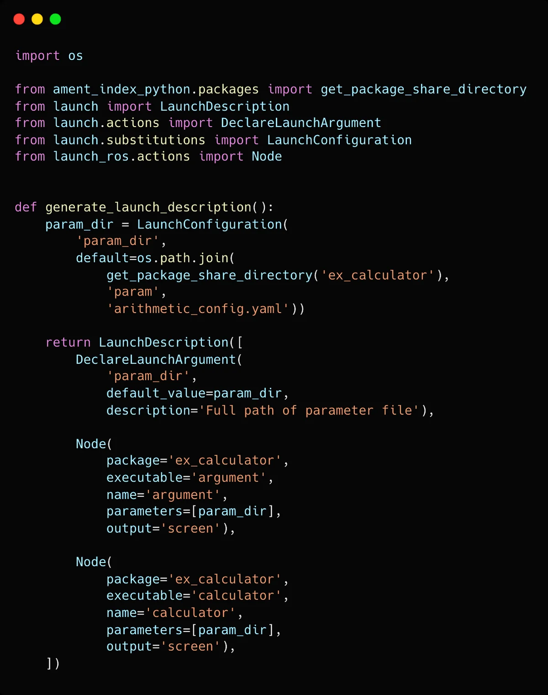


런치프로그래밍
launch 작성

## launch 파일의기본구조:
- generate_launch_description 메소드를정의하여사용
- 메소드내용으로'LaunchConfiguration' 클래스를이용하여 필요시실행관련설정선언
- 메소드의리턴값으로는'LaunchDescription' 클래스로반환

## 'arithmetic.launch.py' 파일의LaunchConfiguration 설정
- 'LaunchConfiguration' 클래스의생성자로'param_dir' 라는파라미터디렉토리를설정하는부분
- 'ex_calculator' 패키지의'param'폴더에위치한 'arithmetic_config.yaml' 파라미터설정파일을의미
- 해당파일의내용은앞서다룬'파라미터프로그래밍 (Python)’ 참고

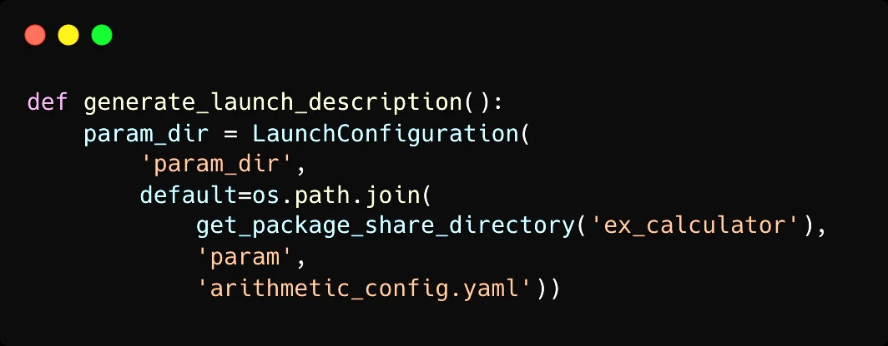

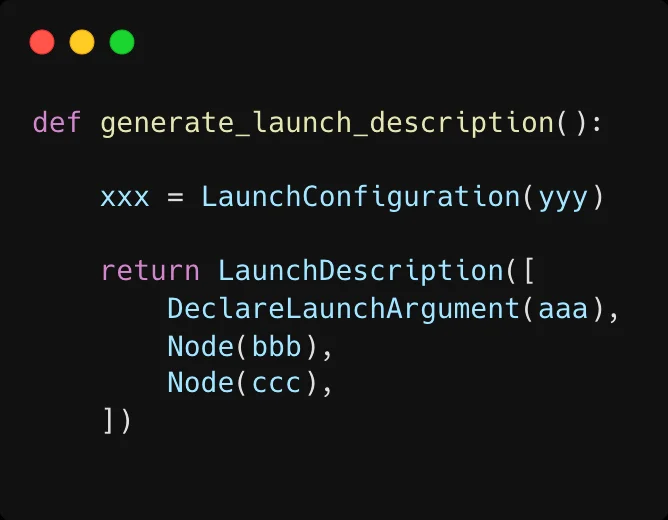


런치프로그래밍
launch 작성

## remappings 기능(원본코드에는존재하지않음) :
- 특정이름을변경할수있는기능
- 다음예제와같이'/arithmetic_argument' 토픽 이름을'/argument' 이라는토픽이름으로변경 할수있음
- 내부코드변경없이토픽, 서비스, 액션등의 고유이름을변경할수있는유용한기능이므 로알아두기추천 런치프로그래밍 launch 작성

## launch의namespace 기능:
- 노드, 토픽, 서비스, 액션, 파라미터등의고유이름을독립적 으로그룹핑하여네트워크를구성할수있는기능
- 변경방법
- 방법1 : 각노드를실행시킬때ROS 변수중하나인 ns(namespace)를입력하여변경
- 방법2 : launch 파일로실행시킬때namespace 라는항목을변경

## namespace 설정방법
- LaunchConfiguration와DeclareLaunchArgument을통해 namespace를지정
- 예제에서는환경변수로지정한'ROS_NAMESPACE' 변수를 읽어오도록설정
- 'export ROS_NAMESPACE=robot_1' 과같은구문을터미널에서 실행하거나＇~/.bashrc에미리등록
- Node 클래스에서namespace를지정하면실행시모든노 드이름과해당노드의토픽, 서비스, 액션, 파라미터등고유 이름이변경됨
- 활용예: namespace는복수의로봇을사용할때동일프로 그램을이용할때고유이름을사용함에있어서중복됨을 피할수있고데이터를구분지어사용할수있음


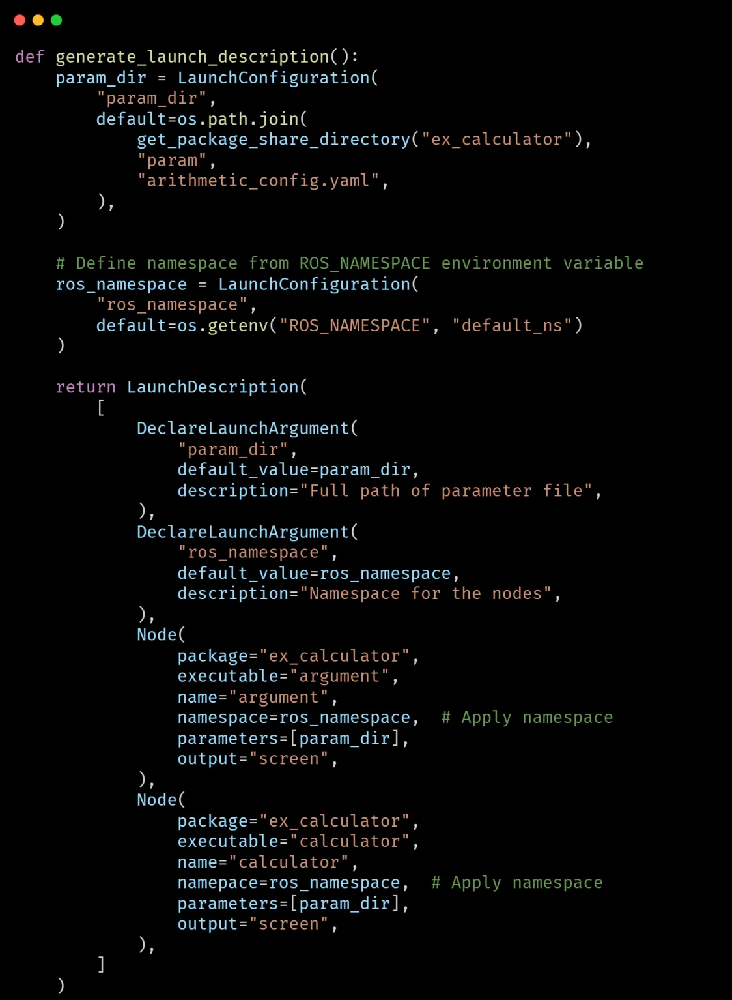


런치프로그래밍
launch 작성

## generate_launch_description 함수
의return 값이너무많을경우
LaunchDescription의add_action
함수를이용하여정리가능

## 이렇게구성하면예제와같이좀더
간결해짐


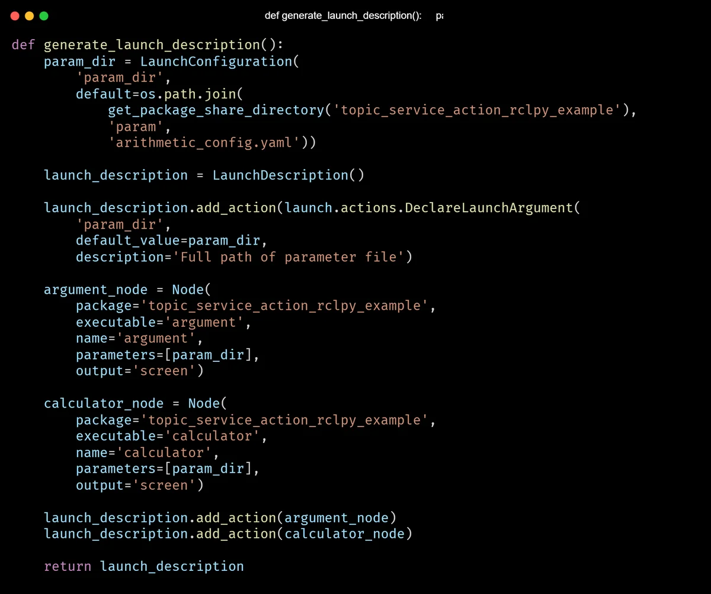


런치프로그래밍
launch 작성

## 런치파일에서다른런치파일불러오기:
- 현재패키지의런치파일불러오기:
- 예를들어, 현재패키지가aaaaa라면, IncludeLaunchDescription을사용하여 xxxxx.launch.py와yyyyy.launch.py를불러올수있음

## 다른패키지의런치파일불러오기:
- 예를들어, bbbbb 패키지의zzzzz.launch.py 파일을불 러올때는IncludeLaunchDescription과함께 get_package_share_directory 함수를사용
- get_package_share_directory 함수에불러올패키지명 을입력하여특정패키지의런치파일을가져옴

## 런치파일모듈화의장점
- 하나의런치파일에서동일패키지의노드실행뿐아니 라, 다른패키지의런치파일을불러와실행할수있음
- 특히, 직접작성하지않은패키지의런치파일을수정없 이불러와사용할수있어편리함
- 널리사용되는유용한기능이므로참고할것


런치프로그래밍
패키지빌드

## Launch 파일사용을위한설치필요성:
- Launch 파일은Python 파일이므로빌드자체는필요하지않음
- 그러나ROS2 에코시스템에서사용하기위해서는패키지빌드를통해정해진위치에설치해야함 install(DIRECTORY launch DESTINATION share/${PROJECT_NAME}/ )

## 언어에따른Launch 파일설정방법:
- C++ (RCLCPP 패키지계열) :
- C++을사용하는경우, CMakeLists.txt의install 구문에launch 폴더명만기재하여설정가능
- Python (rclpy 패키지계열) :
- Python을사용하는경우에는별도의설정이필요하며, 이후에설명예정


런치프로그래밍
패키지빌드

## rclpy 패키지계열
- Python 패키지설정파일(setup.py)의data_files 옵션에launch 폴더를지정
- 효과: 패키지소스코드내launch 폴더에있는*.launch.py 파일들이설치폴더에복사되어위치하게됨


런치프로그래밍
launch 작성

## 런치파일을실행하려면ROS2의CLI 명령어중'ros2 launch'를사용하며사용방법
은다음과같음

## 위강좌에서설명한예제파일을실행시키려면다음과같이사용가능
## 즉ex_calculator 패키지의arithmetic.launch.py 런치파일을실행시키라는의미
## 이를실행시키면위에서설명한것처럼파라미터파일을공유하여사용하게되며
argument 노드와calculator 노드를한번에실행시키게됨


---

## Jupyter Notebooks


### triangle_turtle

[](https://colab.research.google.com/github/OWNER/study-site/blob/main/notebooks/ros/jupyter_ros/triangle_turtle.ipynb)

```python
import rclpy
from geometry_msgs.msg import Twist
import time
```


```python

if not rclpy.ok():  # 또는 hasattr(rclpy, '_rclpy') 등으로 체크
    rclpy.init()
node = Node('triangle_turtle')
pub = node.create_publisher(Twist, '/turtle1/cmd_vel', 10)
msg = Twist()
```

    [WARN] [1745315101.346933587] [rcl.logging_rosout]: Publisher already registered for provided node name. If this is due to multiple nodes with the same name then all logs for that logger name will go out over the existing publisher. As soon as any node with that name is destructed it will unregister the publisher, preventing any further logs for that name from being published on the rosout topic.
```python
def main():
    rclpy.init()

    # 노드 생성
    node = rclpy.create_node('triangle_drawer')
    publisher = node.create_publisher(Twist, '/turtle1/cmd_vel', 10)

    move_cmd = Twist()
    turn_cmd = Twist()

    move_cmd.linear.x = 2.0
    turn_cmd.angular.z = 2.0

    # 삼각형 그리기
    for _ in range(3):
        publisher.publish(move_cmd)
        time.sleep(1.5)

        publisher.publish(Twist())  # 정지
        time.sleep(0.5)

        publisher.publish(turn_cmd)
        time.sleep(1.2)

        publisher.publish(Twist())  # 정지
        time.sleep(0.5)

    print("삼각형 그리기 완료")

    node.destroy_node()
    rclpy.shutdown()

if __name__ == '__main__':
    main()

```


    ---------------------------------------------------------------------------

    RuntimeError                              Traceback (most recent call last)

    Cell In[66], line 34
         31     rclpy.shutdown()
         33 if __name__ == '__main__':
    ---> 34     main()


    Cell In[66], line 2, in main()
          1 def main():
    ----> 2     rclpy.init()
          4     # 노드 생성
          5     node = rclpy.create_node('triangle_drawer')


    File /opt/ros/humble/local/lib/python3.10/dist-packages/rclpy/__init__.py:88, in init(args, context, domain_id, signal_handler_options)
         86     else:
         87         signal_handler_options = SignalHandlerOptions.NO
    ---> 88 context.init(args, domain_id=domain_id)
         89 # Install signal handlers after initializing the context because the rclpy signal
         90 # handler only does something if there is at least one initialized context.
         91 # It is desirable for sigint or sigterm to be able to terminate the process if rcl_init
         92 # takes a long time, and the default signal handlers work well for that purpose.
         93 install_signal_handlers(signal_handler_options)


    File /opt/ros/humble/local/lib/python3.10/dist-packages/rclpy/context.py:70, in Context.init(self, args, initialize_logging, domain_id)
         65     raise RuntimeError(
         66         'Domain id ({}) should not be lower than zero.'
         67         .format(domain_id))
         69 if self.__context is not None:
    ---> 70     raise RuntimeError('Context.init() must only be called once')
         72 self.__context = _rclpy.Context(
         73     args if args is not None else sys.argv,
         74     domain_id if domain_id is not None else _rclpy.RCL_DEFAULT_DOMAIN_ID)
         75 if initialize_logging and not self._logging_initialized:


    RuntimeError: Context.init() must only be called once
```python
node.create_timer(0.1, timer_callback)
threading.Thread(target=rclpy.spin, args=(node,)).start()
```


```python

```


---

## Code Examples


### `turtlesim/tultle_move/`

[View full source on GitHub](https://github.com/OWNER/study-site/tree/main/source/turtlesim/tultle_move/){ .md-button }

#### `turtlesim/tultle_move/tultle_move/__init__.py`

```python

```

#### `turtlesim/tultle_move/tultle_move/dist_turtle_action_server.py`

```python
import rclpy as rp
import time
import math

from rclpy.action import ActionServer
from rclpy.node import Node
from rclpy.executors import MultiThreadedExecutor

from turtlesim.msg import Pose
from turtle_msgs.action import DistTurtle
from geometry_msgs.msg import Twist
from tultle_move.subscriber_t import TurtlesimSubscriber

class TurtleSub_Action(TurtlesimSubscriber):
    def __init__(self, ac_server):
        super().__init__()
        self.ac_server = ac_server

    def callback(self, msg):
        self.ac_server.current_pose = msg

class DistTurtleServer(Node):

    def __init__(self):
        super().__init__('dist_turtle_action_server')
        self.total_dist = 0.0
        self.is_first_time = True
        self.current_pose = Pose()
        self.previous_pose = Pose()
        self.publisher = self.create_publisher(
            Twist,
            '/turtle1/cmd_vel',
            10
        )
        self._action_server = ActionServer(
            self,
            DistTurtle,
            'dist_turtle',
            self.execute_callback
        )

    def calc_diff_pose(self):
        if self.is_first_time:
            self.previous_pose.x = self.current_pose.x
            self.previous_pose.y = self.current_pose.y
            self.is_first_time = False

        dx = self.current_pose.x - self.previous_pose.x
        dy = self.current_pose.y - self.previous_pose.y
        diff_dist = math.sqrt(dx**2 + dy**2)
# ... (58 more lines)
```

#### `turtlesim/tultle_move/tultle_move/multi_thread.py`

```python
import rclpy as rp
from rclpy.executors import MultiThreadedExecutor
from rclpy.node import Node
from tultle_move.publisher_t import TurtlesimPublisher
from tultle_move.subscriber_t import TurtlesimSubscriber

def main(args=None):
    rp.init()

    sub = TurtlesimSubscriber()
    pub = TurtlesimPublisher()

    executor = MultiThreadedExecutor()

    executor.add_node(sub)
    executor.add_node(pub)

    try:
        executor.spin()

    finally:
        executor.shutdown()
        pub.destroy_node()
        rp.shutdown()

if __name__=='__main__':
    main()
```
