# 강의_3기_ROS2입문_4차시


ROS2 프로그래밍입문(4차시)

4. 인터페이스프로그래밍(응용- 2)


## 인터페이스프로그래밍(응용_2)
1.  인터페이스프로그래밍(hangman)
Python을이용한패키지생성실습

## Python을이용한행맨게임_실습
-
Topic, Service, Action을이용하여행맨(Hang-man) 게임만들기


Hang-man - 실습

## Hang-man
1. Hangman은단어나문구를추측하는고전적인단어게임
2. 게임의목적은플레이어가주어진단어를맞추는것
3. 단어선택: 한명의플레이어(또는시스템)가특정단어를선택
4. 추측: 다른플레이어는이단어를맞추기위해알파벳한글자씩추측
맞는글자를추측하면, 해당글자가단어에위치한곳에표시됨. 틀린글자를추측할
때마다기회가줄어듦

5. 목숨(기회) : 보통틀린추측이반복될때마다목숨이하나씩줄어들어모든목숨소진
시게임에서패배

6. 게임종료: 단어를모두맞추거나, 기회가다소진될때까지추측을반복모든글자를
맞추면승리, 모든기회가소진되면패배


Hang-man - 실습

## Hang-man 구조도
Letter
publisher
User input
Word
service
Action
client
Action
server
topic publish
progress
game_progress
request

Hang-man - 실습

## Letter Publisher
-
a부터z까지의알파벳을순서대로publish

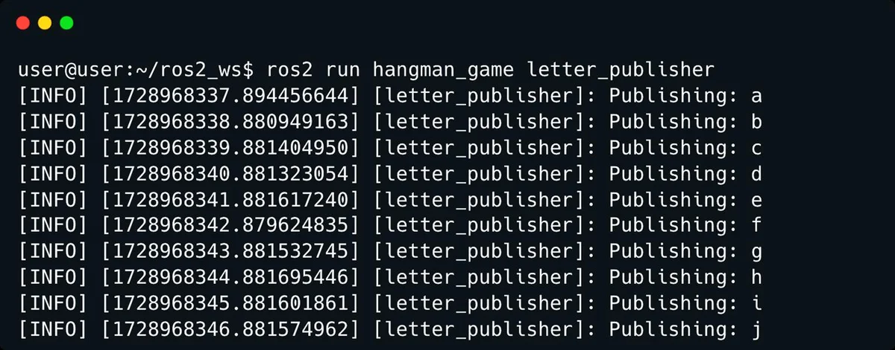


Hang-man - 실습

## Word Service
-
임의의단어를선택, 행맨게임진행, 진행상황publish
Hang-man - 실습

## Action Client
-
Goal 설정, action server와의상호작용을통해행맨게임진행상태업데이트
Hang-man - 실습

## Action Server
-
사용자의진행상황을관리, 임의진행상태를추적, 게임결과를클라이언트에게전달
Hang-man - 실습

## 코드구조
-
패키지생성

Hang-man - 실습

## 코드구조
-
전체코드의구조는다음과같음
-
일부파일은지금부터생성예정

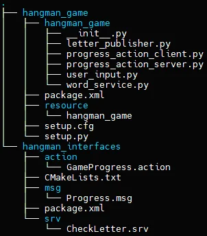


Hang-man - 실습

## hangman_interfaces
-
hangman_interfaces/srv/CheckLetter.srv
-
updated_word_state: 현재상태ex) p y _ _ o n
-
is_correct : 현재user input으로들어온글자가선택된단어내에존재하는지에대한
bool 타입자료형
-
message : 맞았으면“Correct”를띄우고틀리면“WRONG”을띄움
Hang-man - 실습

## hangman_interfaces
-
hangman_interfaces/msg/Progress.msg
-
current_state : 현재상태ex) p y _ _ o n
-
attempts_left : 목숨(남은시도횟수)
-
game_over : 목숨이다소진되었는지
-
won : 게임에서이겼는지(목숨소진이전에정답을맞추었는지)


Hang-man - 실습

## hangman_interfaces
-
hangman_interfaces/action/GameProgress.action
-
game_over : 목숨이다소진되었는지
-
won : 게임에서이겼는지(목숨소진이전에정답을맞추었는지)
Hang-man - 실습

## hangman_game
-
hangman_game/hangman_game/letter
_publisher.py의전체코드


Hang-man - 실습

## hangman_game
-
hangman_game/hangman_game/letter_publisher.py 모듈별설명
-
__init__함수: Node 클래스를상속받아LetterPublisher 클래스를정의하고필요한퍼블리셔와타이머를설정

Hang-man - 실습

## hangman_game
-
hangman_game/hangman_game/letter_publisher.py 모듈별설명
-
publish_letter 함수: 현재알파벳문자를letter_topic 토픽에퍼블리시하는함수


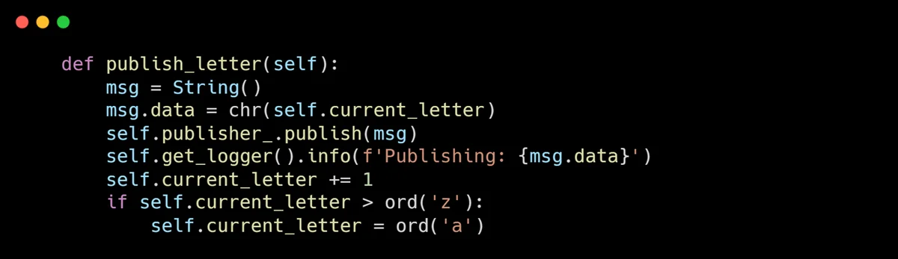


Hang-man - 실습

## hangman_game
-
hangman_game/hangman_game/letter_publisher.py 모듈별설명
-
main 함수: ROS2 시스템을초기화하고, LetterPublisher 노드를실행


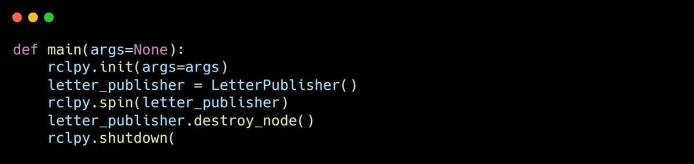


Hang-man - 실습

## hangman_game
-
hangman_game/hangman_game/word
_service.py의전체코드


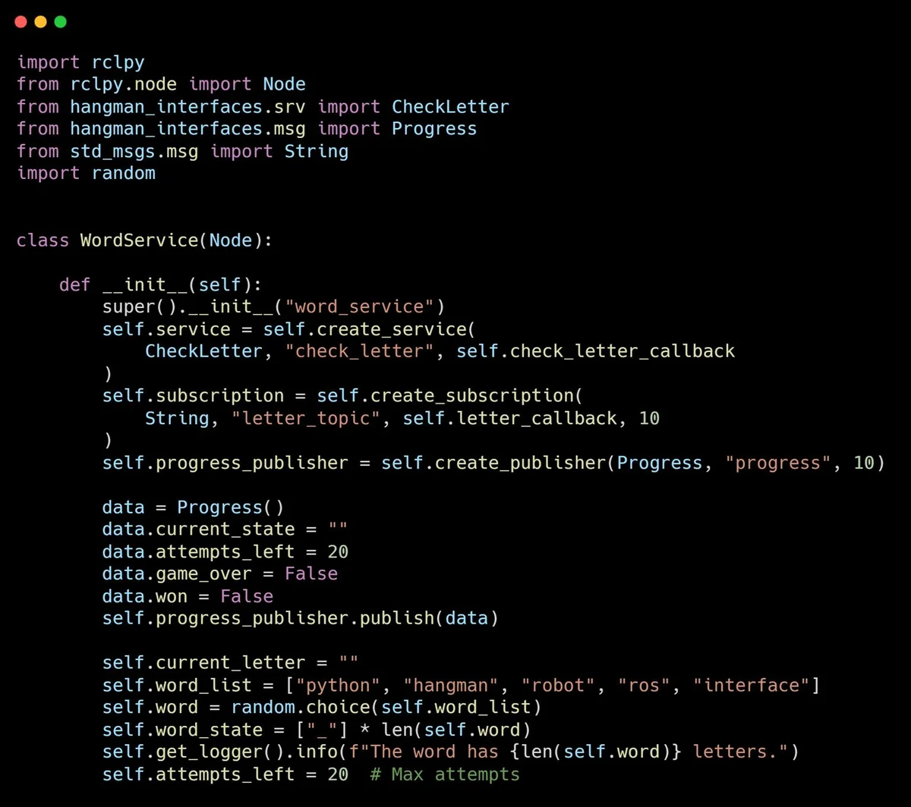


Hang-man - 실습

## hangman_game
-
hangman_game/hangman_game/word
_service.py의전체코드


Hang-man - 실습

## hangman_game
-
hangman_game/hangman_game/word
_service.py의전체코드


Hang-man - 실습

## hangman_game
-
hangman_game/hangman_game/word_service.py 모듈별설명
-
__init__함수: ROS2의Node 클래스를상속받아WordService라는이름의노드를정의후내부에
서비스서버와퍼블리셔, 서브스크라이버를정의


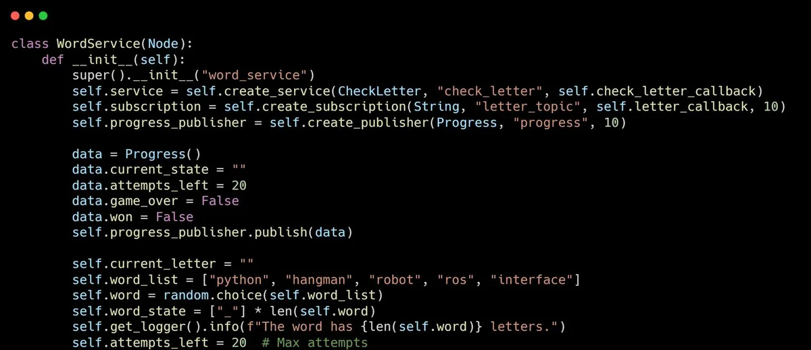


Hang-man - 실습

## hangman_game
-
hangman_game/hangman_game/word_service.py 모듈별설명
-
letter_callback함수: letter_topic 토픽에서수신된메시지를처리하여self.current_letter에저장


Hang-man - 실습

## hangman_game
-
hangman_game/hangman_game/word
_service.py 모듈별설명
-
check_letter_callback 함수: 서비스요청
을처리하며, 수신한문자가현재단어에
포함되어있는지확인하고게임상태를
업데이트. 업데이트된상태는Progress
메시지를통해퍼블리시


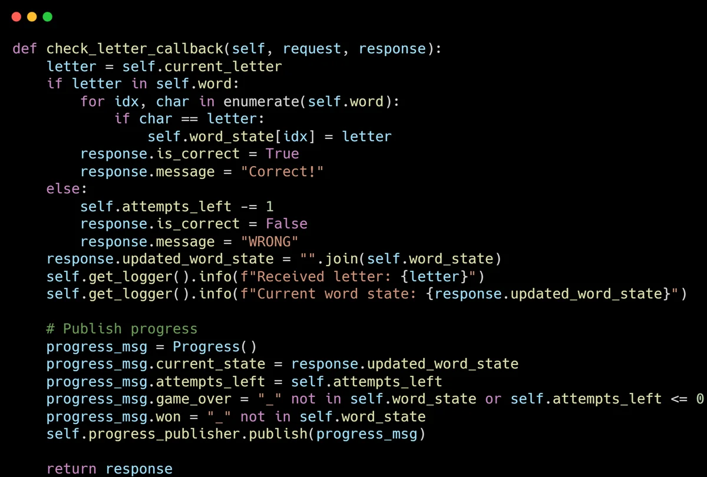


Hang-man - 실습

## hangman_game
-
hangman_game/hangman_game/word_service.py 모듈별설명
-
main 함수: ROS2 시스템을초기화하고WordService 노드를실행


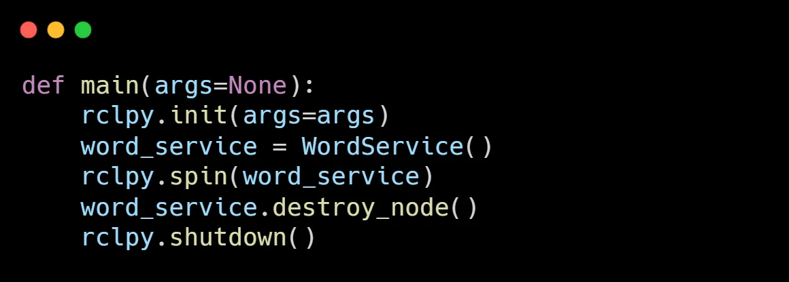


Hang-man - 실습

## hangman_game
-
hangman_game/hangman_game/user_
input.py 전체코드

Hang-man - 실습

## hangman_game
-
hangman_game/hangman_game/user_input.py 모듈별설명
-
__init__ 함수: Node 클래스를상속받아UserInput이라는노드를정의. 이노드는CheckLetter 서비스에
문자확인요청을보냄

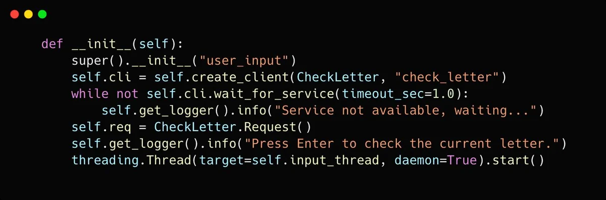


Hang-man - 실습

## hangman_game
-
hangman_game/hangman_game/user_input.py 모듈별설명
-
input_thread 함수: 사용자로부터Enter 키입력을기다리며, 입력이들어오면send_request
메서드를호출하여현재요청을서비스로보냄

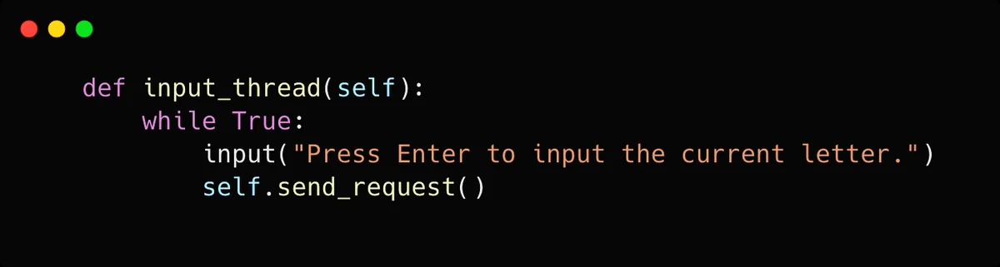


Hang-man - 실습

## hangman_game
-
hangman_game/hangman_game/user_input.py 모듈별설명
-
send_request 함수: CheckLetter 서비스에비동기적으로요청을보내어, 현재선택된문자가
단어에포함되어있는지확인


Hang-man - 실습

## hangman_game
-
hangman_game/hangman_game/user_input.py 모듈별설명
-
main 함수: ROS2 시스템을초기화하고UserInput 노드를실행하여사용자입력을
기다리며, 서비스요청을반복적으로보낼수있는구조를만듦

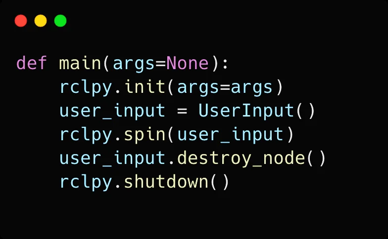


Hang-man - 실습

## hangman_game
-
hangman_game/hangman_game/
progress_action_client.py 전체코드

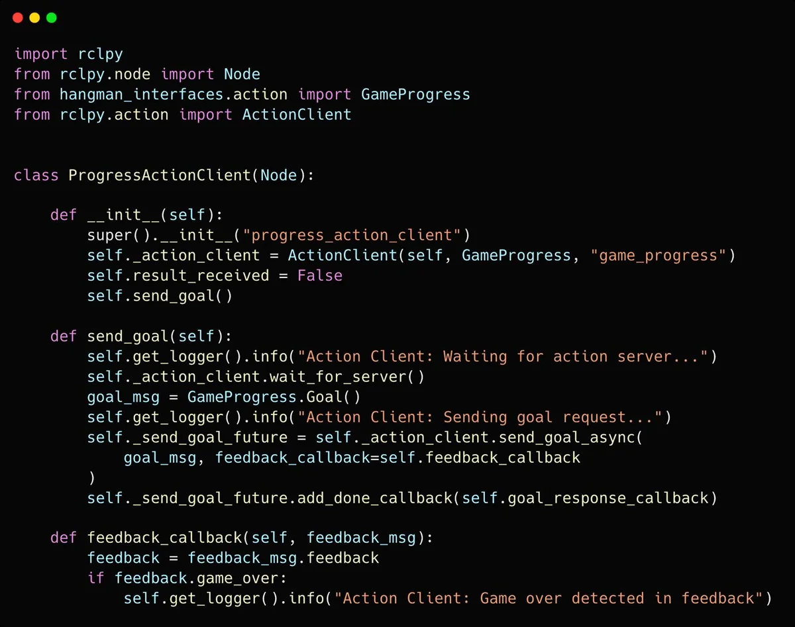


Hang-man - 실습

## hangman_game
-
hangman_game/hangman_game/
progress_action_client.py 전체코드

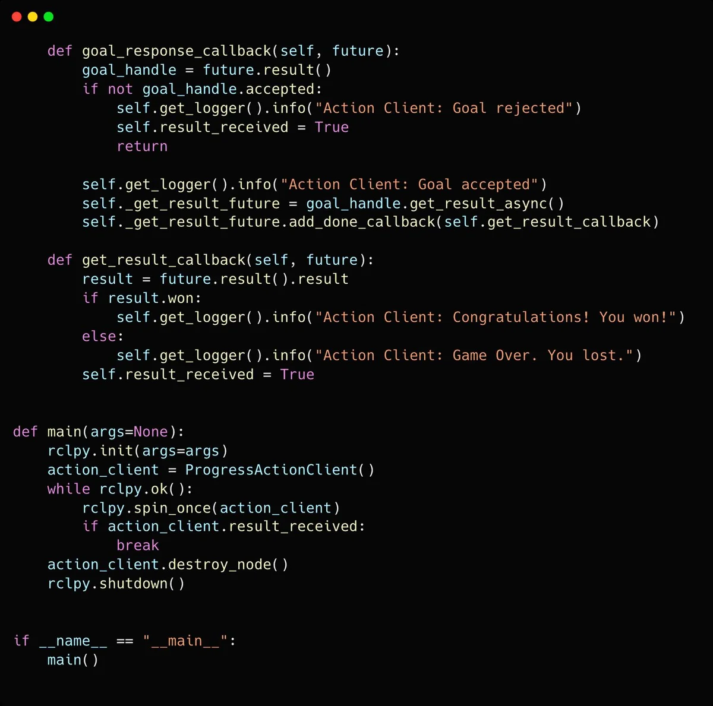


Hang-man - 실습

## hangman_game
-
hangman_game/hangman_game/progress_action_client.py 모듈별설명
-
__init__ 함수: 노드를초기화하고액션클라이언트를생성하여, 게임진행목표를서버에전송할
준비를함

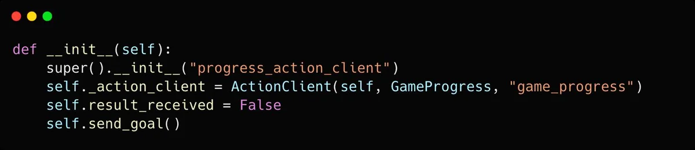


Hang-man - 실습

## hangman_game
-
hangman_game/hangman_game/progress_action_client.py 모듈별설명
-
send_goal 함수: GameProgress 액션서버에목표를전송하고, 목표전송후에피드백콜백과완료
콜백을설정하여서버응답을처리

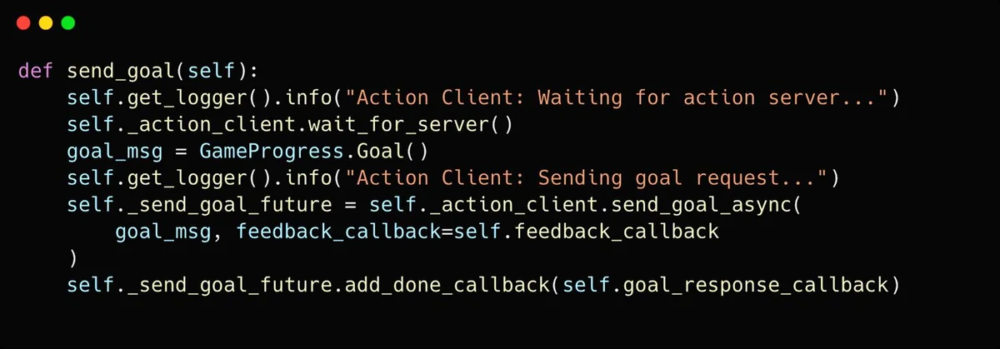


Hang-man - 실습

## hangman_game
-
hangman_game/hangman_game/progress_action_client.py 모듈별설명
-
Feedback_callback 함수: 서버에서수신한피드백메시지를처리하여, 게임종료상태를확인하고로깅

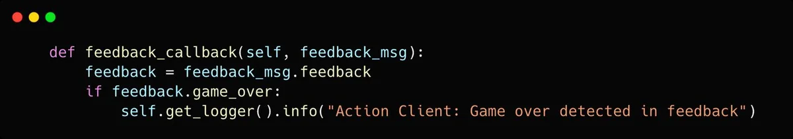


Hang-man - 실습

## hangman_game
-
hangman_game/hangman_game/progress_action_client.py 모듈별설명
-
goal_response_callback 함수: 서버가목표를수락했는지확인하고, 수락된경우최종결과를비동기적으로
요청하며결과콜백을설정

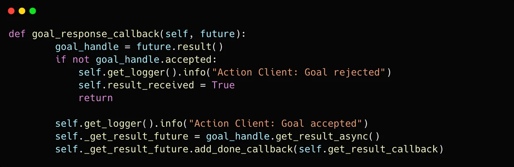


Hang-man - 실습

## hangman_game
-
hangman_game/hangman_game/progress_action_client.py 모듈별설명
-
get_result_callback 함수: 서버에서수신한최종결과를확인하고, 승리또는패배에따라로깅을진행

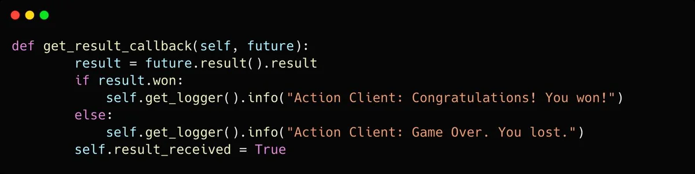


Hang-man - 실습

## hangman_game
-
hangman_game/hangman_game/progress_action_client.py 모듈별설명
-
main 함수: ROS2 시스템을초기화하고ProgressActionClient 노드를실행하여목표를
전송하고결과가수신될때까지이벤트루프를유지

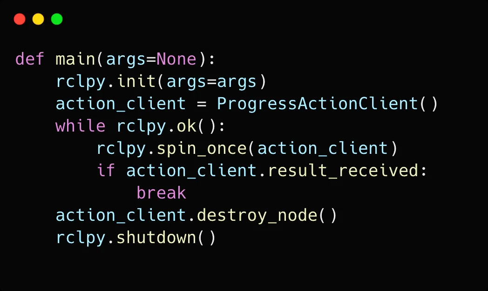


Hang-man - 실습

## hangman_game
-
hangman_game/hangman_game/
progress_action_server.py 전체코드

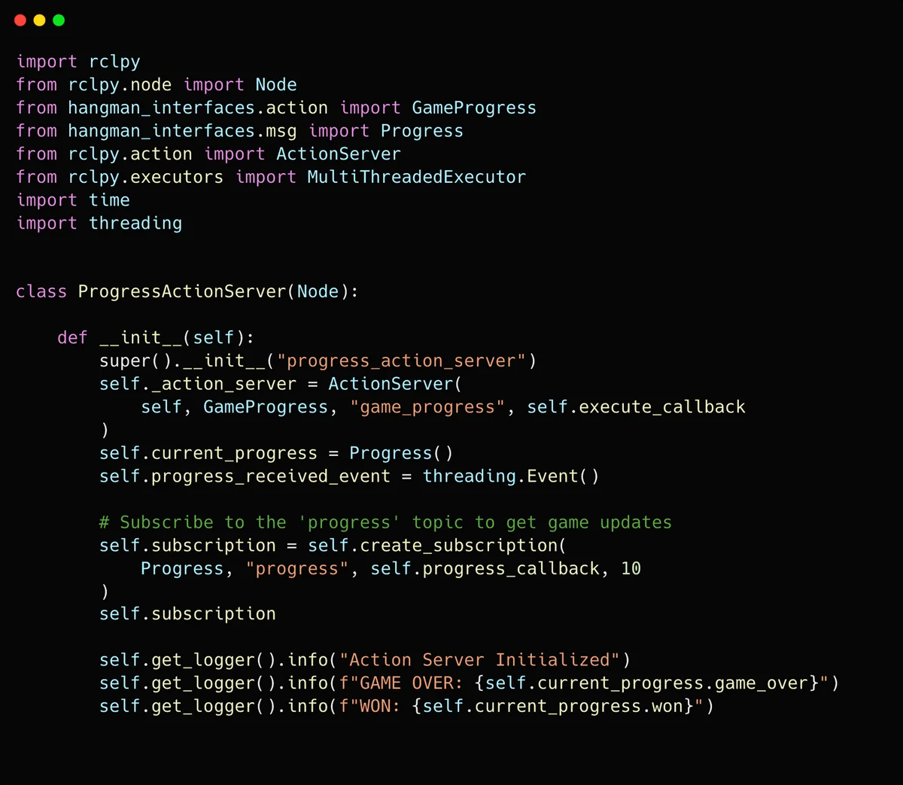


Hang-man - 실습

## hangman_game
-
hangman_game/hangman_game/
progress_action_server.py 전체코드


Hang-man - 실습

## hangman_game
-
hangman_game/hangman_game/
progress_action_server.py 전체코드


Hang-man - 실습

## hangman_game
-
hangman_game/hangman_game/progress_action_server.py 모듈별설명
-
__init__ 함수: 노드를초기화하고GameProgress 액션서버와progress 토픽을구독하여
게임진행상태를관리

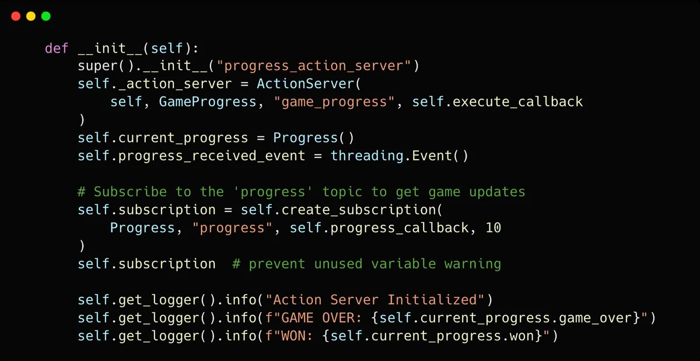


Hang-man - 실습

## hangman_game
-
hangman_game/hangman_game/progress_action_server.py 모듈별설명
-
progress_callback 함수: progress 토픽으로부터수신한메시지를처리하여,
current_progress에게임상태를업데이트하고로깅

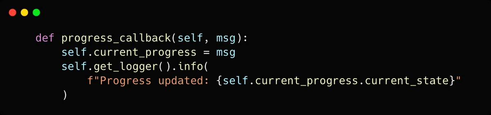


Hang-man - 실습

## hangman_game
-
hangman_game/hangman_game/pro
gress_action_server.py 모듈별설명
-
execute_callback 함수:
클라이언트의목표요청을수신하고, 게
임진행상황을주기적으로피드백하며,
게임종료시최종결과를반환. 주기적
으로feedback_msg를통해게임상태를
클라이언트에전달

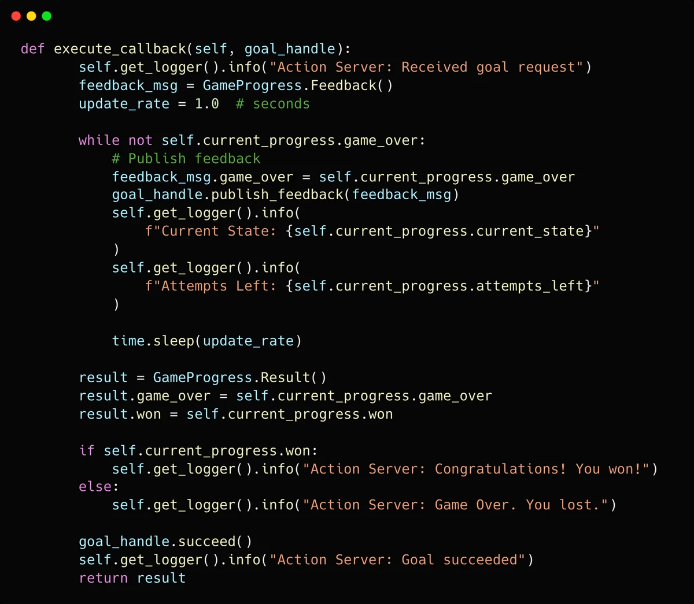


Hang-man - 실습

## hangman_game
-
hangman_game/hangman_game/progress_action_server.py 모듈별설명
-
main 함수: ROS2 시스템을초기화하고ProgressActionServer 노드를실행하여목표
요청과토픽구독을동시에처리할수있도록멀티스레드실행자를사용

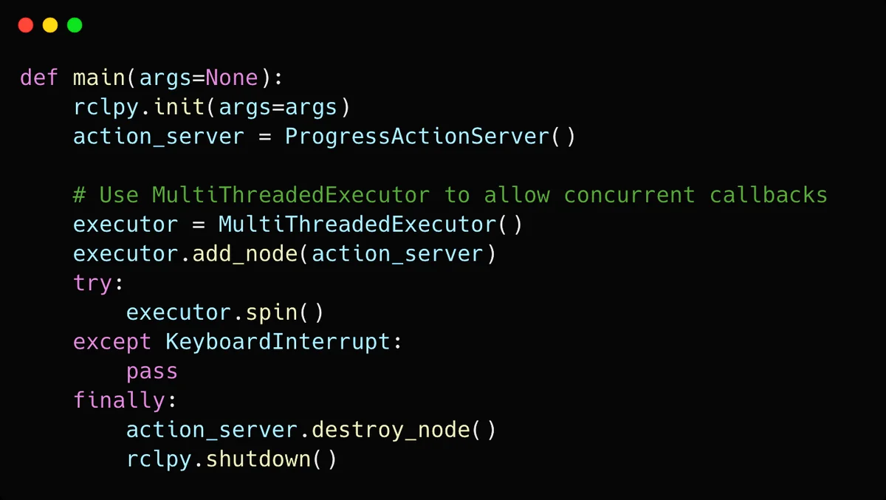


Hang-man - 실습

## hangman_game
-
hangman_game/setup.py
-
entry_points를다음과같이변경


Hang-man - 실습

## hangman_game
-
hangman_interfaces/CMakeLists.txt


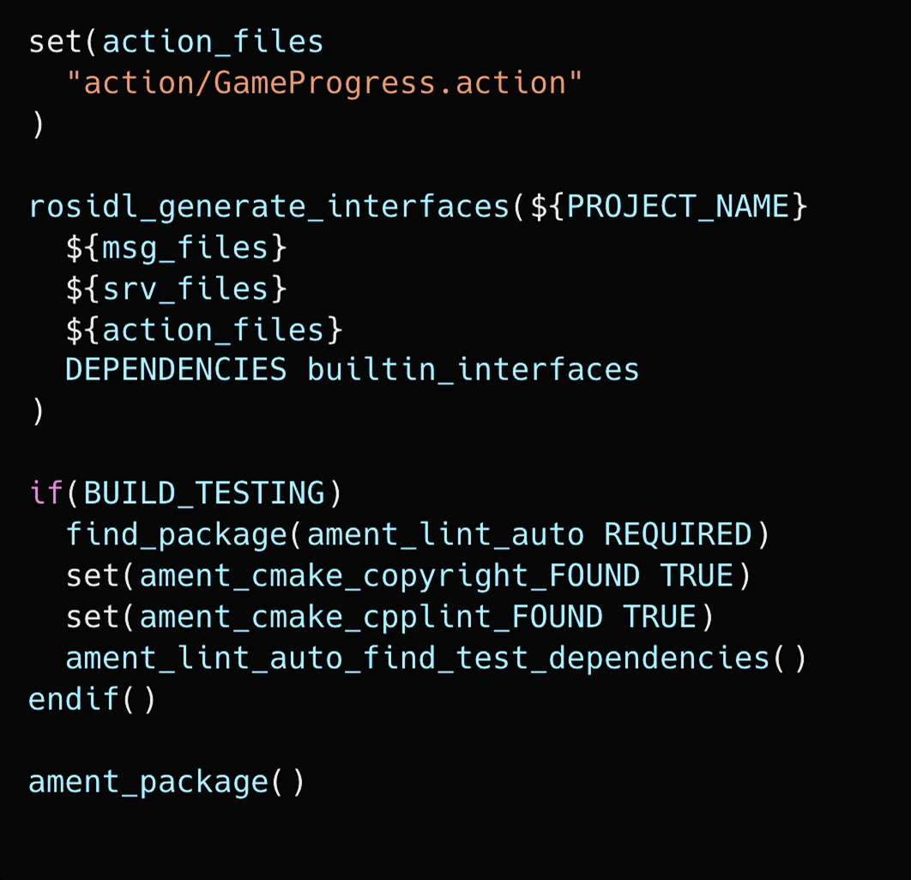


Hang-man - 실습

## hangman_game
-
hangman_interfaces/package.xml

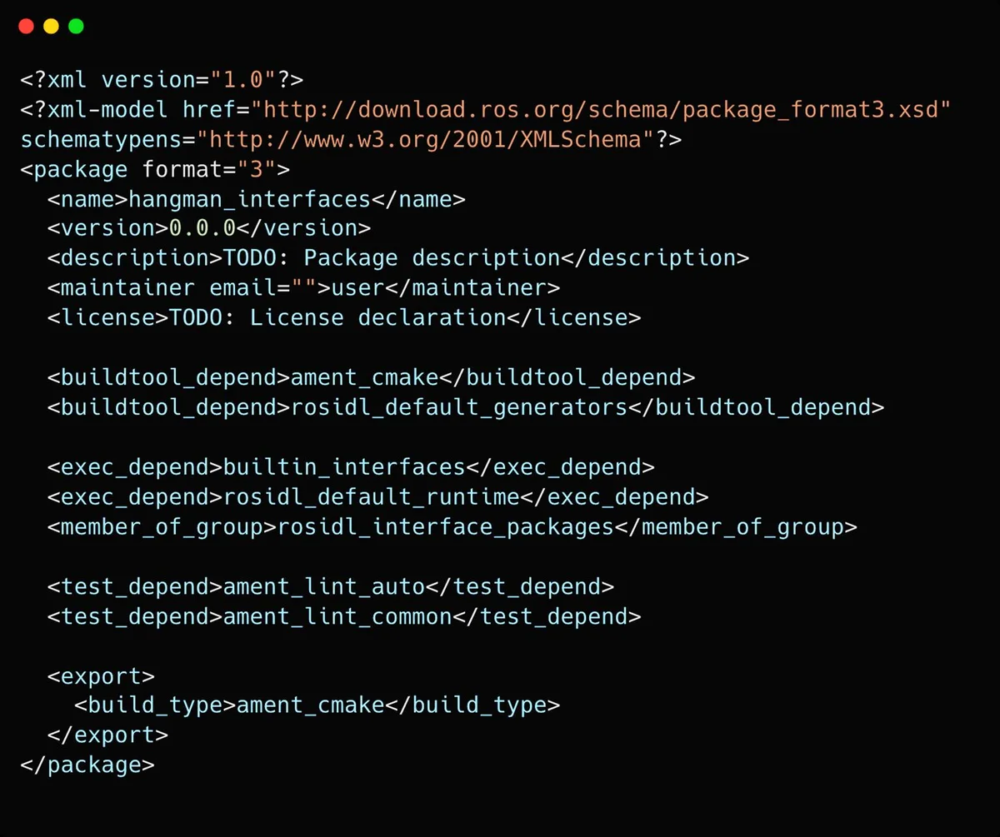


Hang-man - 실습

## hangman_game
1.   colcon 빌드후setup.bash 적용
2.   letter publisher 실행
3.   새로운터미널에서word service 실행


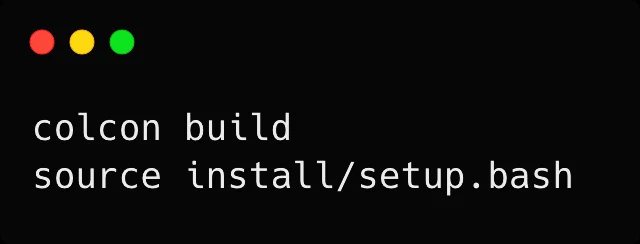


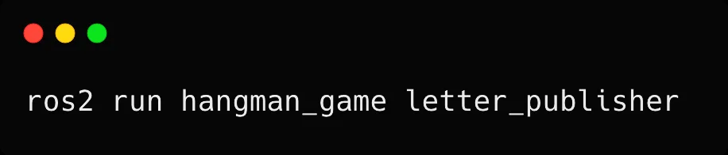


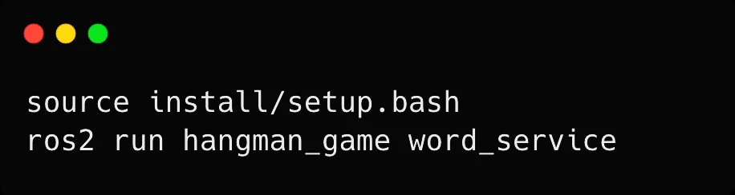


Hang-man - 실습

## hangman_game
4. 새로운터미널에서action server 실행
5. 새로운터미널에서action client 실행
6.   새로운터미널에서user input 실행


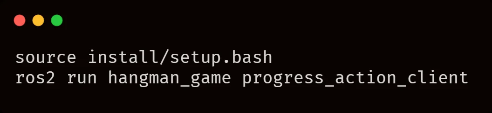


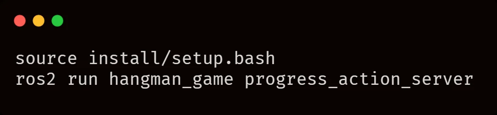


Hang-man - 실습

## hangman_game
-
실행화면
user_input
word_service


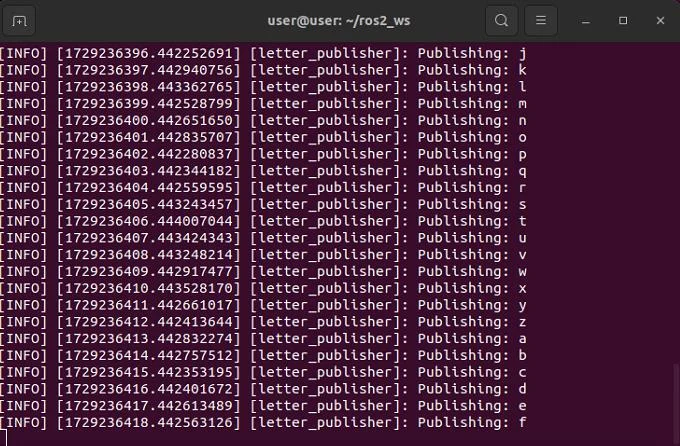


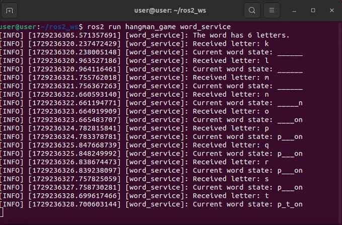


Hang-man - 실습

## hangman_game
-
실행화면
action_server
action_client


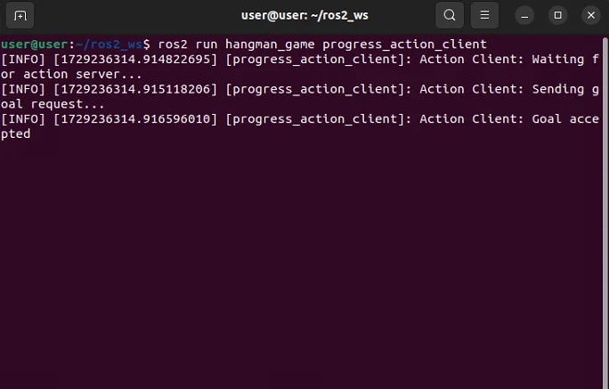


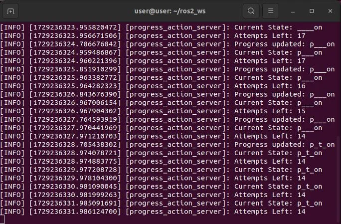


Hang-man - 실습

## hangman_game
-
실행화면
user_input


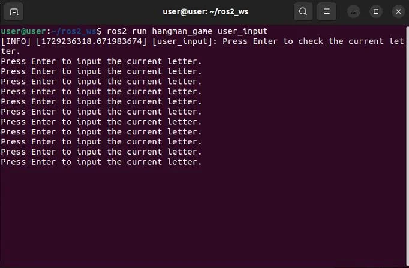


---

## Jupyter Notebooks


### ros2_function

[](https://colab.research.google.com/github/OWNER/study-site/blob/main/notebooks/ros/jupyter_ros/ros2_function.ipynb)

다음은 **ROS 2 Humble**에서 자주 사용하는 **Topic, Service, Action** 관련 Python API 함수들을 정리한 노트. 개발할 때 빠르게 참고할 수 있도록 요약.

### Topic 관련 함수
#### 퍼블리셔(Publisher)


```python
publisher = self.create_publisher(MsgType, 'topic_name', qos_profile)
publisher.publish(msg)
```

- `create_publisher(MsgType, topic_name, qos_profile)`: 퍼블리셔 생성
- `publish(msg)`: 메시지 전송

#### 서브스크라이버(Subscriber)


```python
self.subscription = self.create_subscription(
    MsgType,
    'topic_name',
    self.callback,
    qos_profile)
```

- `create_subscription(MsgType, topic_name, callback, qos_profile)`: 서브스크라이버 생성
- `callback(msg)`: 수신 메시지 처리 함수

### Service 관련 함수
#### 클라이언트(Client)


```python
self.cli = self.create_client(SrvType, 'service_name')

# 서비스 요청 준비
req = SrvType.Request()
req.param = value

# 서버가 준비될 때까지 대기
while not self.cli.wait_for_service(timeout_sec=1.0):
    self.get_logger().info('Waiting for service...')

# 요청 보내기
future = self.cli.call_async(req)
future.add_done_callback(response_callback)
```

- `create_client(SrvType, service_name)`: 서비스 클라이언트 생성
- `SrvType.Request()`: 요청 메시지 생성
- `call_async(req)`: 비동기 요청

#### 서버(Server)


```python
self.srv = self.create_service(SrvType, 'service_name', self.callback)
```

- `create_service(SrvType, service_name, callback)`: 서비스 서버 생성
- `callback(request, response)`: 요청 처리 함수
- `response.param = value` → 응답 내용 설정

### Action 관련 함수
#### 액션 클라이언트(Action Client)


```python
self._action_client = ActionClient(self, ActionType, 'action_name')

# 서버 대기
self._action_client.wait_for_server()

# goal 생성
goal_msg = ActionType.Goal()
goal_msg.param = value

# goal 전송
self._send_goal_future = self._action_client.send_goal_async(
    goal_msg,
    feedback_callback=self.feedback_callback)

# 결과 기다리기
self._send_goal_future.add_done_callback(self.goal_response_callback)
```

- `ActionClient(self, ActionType, action_name)`: 액션 클라이언트 생성
- `send_goal_async(goal_msg, feedback_callback)`: 목표 전송
- `goal_response_callback(future)`: 응답 처리
- `feedback_callback(feedback_msg)`: 피드백 수신 처리
- `get_result_async()`: 결과 요청

#### 액션 서버(Action Server)


```python
self._action_server = ActionServer(
    self,
    ActionType,
    'action_name',
    execute_callback=self.execute_callback)
```

- `ActionServer(self, ActionType, action_name, execute_callback)`: 액션 서버 생성
- `execute_callback(goal_handle)`: goal 처리 함수
  - 내부에서 `goal_handle.publish_feedback()`으로 피드백 전송
  - `goal_handle.succeed()` 또는 `goal_handle.abort()`
  - `return result` 로 결과 전달

#### 참고용 예시 메시지 타입
- Topic: `std_msgs.msg.String`, `sensor_msgs.msg.Image`
- Service: `example_interfaces.srv.AddTwoInts`
- Action: `example_interfaces.action.Fibonacci`


---

## Code Examples


### `py_pubsub_qos/`

[View full source on GitHub](https://github.com/OWNER/study-site/tree/main/source/py_pubsub_qos/){ .md-button }

#### `py_pubsub_qos/py_pubsub_qos/__init__.py`

```python

```

#### `py_pubsub_qos/py_pubsub_qos/publisher_member_function.py`

```python
# Copyright 2016 Open Source Robotics Foundation, Inc.
#
# Licensed under the Apache License, Version 2.0 (the "License");
# you may not use this file except in compliance with the License.
# You may obtain a copy of the License at
#
#     http://www.apache.org/licenses/LICENSE-2.0
#
# Unless required by applicable law or agreed to in writing, software
# distributed under the License is distributed on an "AS IS" BASIS,
# WITHOUT WARRANTIES OR CONDITIONS OF ANY KIND, either express or implied.
# See the License for the specific language governing permissions and
# limitations under the License.

import rclpy
from rclpy.node import Node

from std_msgs.msg import String

from std_msgs.msg import String
from rclpy.qos import QoSDurabilityPolicy
from rclpy.qos import QoSHistoryPolicy
from rclpy.qos import QoSProfile
from rclpy.qos import QoSReliabilityPolicy

qos_profile = QoSProfile(reliability=QoSReliabilityPolicy.RELIABLE, history=QoSHistoryPolicy.KEEP_ALL, depth=10, durability=QoSDurabilityPolicy.TRANSIENT_LOCAL)


class MinimalPublisher(Node):

    def __init__(self):
        super().__init__("minimal_publisher")
        self.publisher_ = self.create_publisher(String, "topic", qos_profile)
        timer_period = 0.5  # seconds
        self.timer = self.create_timer(timer_period, self.timer_callback)
        self.i = 0

    def timer_callback(self):
        msg = String()
        msg.data = "Hello World: %d" % self.i
        self.publisher_.publish(msg)
        self.get_logger().info('Publishing: "%s"' % msg.data)
        self.i += 1


def main(args=None):
    rclpy.init(args=args)

    minimal_publisher = MinimalPublisher()

# ... (12 more lines)
```

#### `py_pubsub_qos/setup.py`

```python
from setuptools import find_packages, setup

package_name = "py_pubsub_qos"

setup(
    name=package_name,
    version="0.0.0",
    packages=find_packages(exclude=["test"]),
    data_files=[
        ("share/ament_index/resource_index/packages", ["resource/" + package_name]),
        ("share/" + package_name, ["package.xml"]),
    ],
    install_requires=["setuptools"],
    zip_safe=True,
    maintainer="sparkx",
    maintainer_email="mh9716@naver.com",
    description="TODO: Package description",
    license="TODO: License declaration",
    tests_require=["pytest"],
    entry_points={
        "console_scripts": [
            "talker = py_pubsub_qos.publisher_member_function:main",
            "listener = py_pubsub_qos.subscriber_member_function:main",
        ],
    },
)

```
