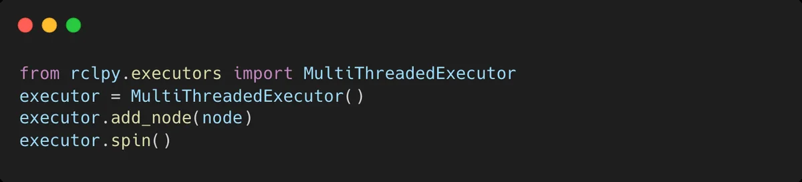
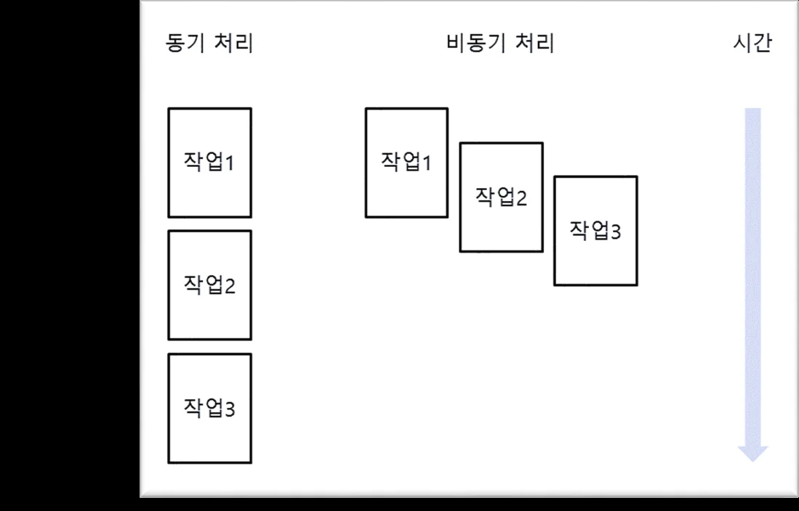
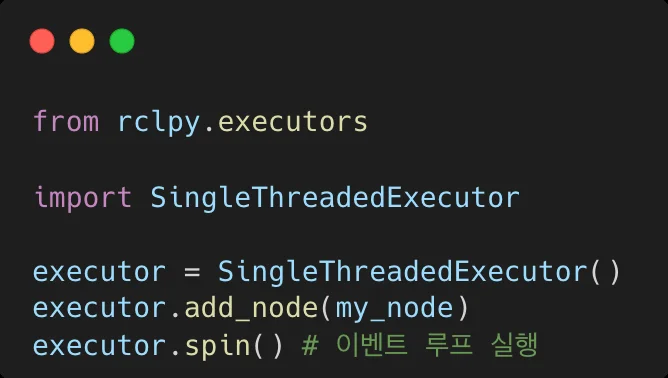
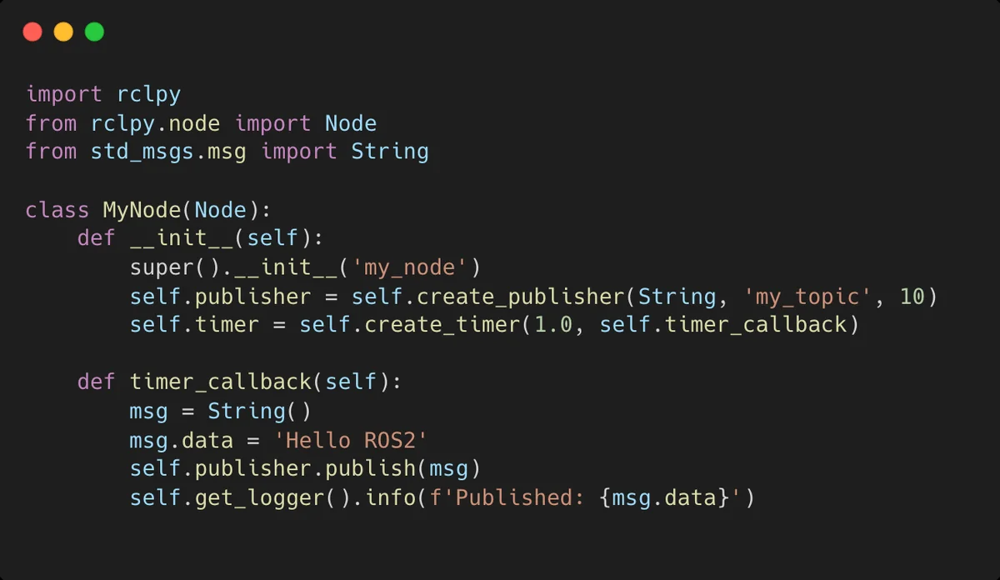
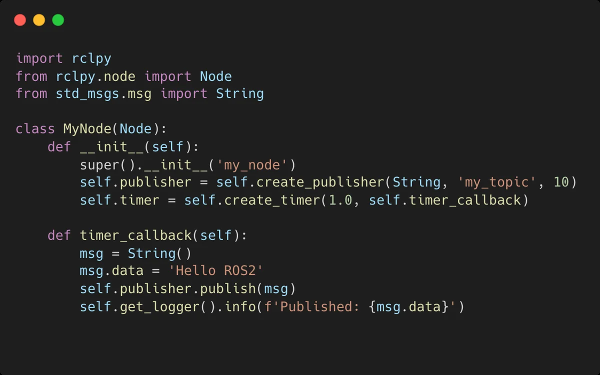

# 강의_3기_ROS2입문_5차시


ROS2 프로그래밍입문(5차시)

5. rclpy 이해


## rclpy 이해
1.  rclpy
2.  Multi Thread
3.  Executor
rclpy
rclpy 란?

## rclpy 정의
- ROS2의Python 클라이언트라이브러리로, 노드를만들고통신할수있도록돕는핵심요소
- C++로작성된ROS2의코어라이브러리(rcl)를Python 환경에서활용할수있도록래핑 (wrapping)한것이특징
- 사용자들은Python의간결한문법과다양한라이브러리를ROS2 기반시스템에쉽게통합


rclpy

## rclpy 구성요소
- 노드(Node) ROS2 시스템의기본실행단위. 노드는각각 고유의이름을가지며, pub/sub, service/client 등을통한통신을담당
- 퍼블리셔(Publisher)와서브스크라이버 (Subscriber) 퍼블리셔는데이터토픽을통해전송하고, 서브 스크라이버는이를수신. rclpy에서는간단한 API로pub/sub를설정
- 서비스(Service)와클라이언트(Client) 서비스는요청-응답방식의통신을처리하며, 클라이언트는특정요청을보내고응답대기
- 액션(Action) 긴시간동안실행되는작업을요청하고그결 과를받을수있는기능. 주로Motion Planning 과같은작업에사용
- 파라미터서버(Parameter Server) ROS2 시스템에서전역적혹은로컬파라미터 를설정하고가져올수있는시스템


rclpy
노드의구현및실행흐름
Multi Thread
Multi Thread 지원

## 고급사용법
- 멀티스레드지원
- rclpy는멀티스레드실행지원가능
- 예를들어, 서비스와퍼블리셔가동일한노드내에서동시에작동하는경우, MultiThreadedExecutor를사용가능




Multi Thread
비동기서비스호출

## 고급사용법
- 비동기서비스호출
- rclpy는asyncio와통합가능
- 이를통해비동기적으로서비스를호출하고처리




Multi Thread
Multi Thread 지원

## Best practice
- 노드이름관리
- 노드이름은고유해야하므로, 노드를생성할때는시스템내다른노드들과충돌하지않도록 이름을신중히설정
- 예를들어, 서비스와퍼블리셔가동일한노드내에서동시에작동하는경우, MultiThreadedExecutor를사용가능
- 타이머주기관리
- 타이머콜백(Callback) 주기는너무짧게설정하지않도록주의
- 지나치게빠른주기는CPU부하의과도한증가의원인
- 에러핸들링
- ROS2 환경은네트워크및하드웨어상태에따라불안정할수있으므로, 예외상황에대한철저 한에러핸들링이필수


Multi Thread
최적화

## 최적화팁
- 토픽QoS 설정
- 네트워크환경이나메시지의중요도에따라QoS(Quality of Service) 설정을맞춰야함
- 예를들어, 메시지유실이치명적이지않은센서데이터의경우Best Effort 방식을사용할수있음
- 파라미터최적화
- 파라미터서버를활용해, 노드의설정값을유연하게바꾸면서성능튜닝가능


Executor
Executor 란?
- Executor란?
- ROS2에서콜백을실행하는구성요소
- 메시지수신, 서비스요청처리, 타이머이벤트등다양한이벤트에대한응답실행
- 역할
- 노드가구독하는데이터나이벤트를적절한콜백으로처리하여메시지의QoS를지원(메시지전 달의신뢰성, 우선순위, 지속성을설정가능)
- 시스템의비동기처리와효율성보장
- 유형
- SingleThreadExecutor : 단일스레드에서콜백을순차적으로처리
- MultiThreadExecutor : 여러스레드에서콜백을병렬적으로처리


Executor
ROS2계층구조

## ROS2 계층구조
1. User code : 사용자가작성한코드
2. rcl : 클라이언트라이브러리로, 사용자코드와미들웨어를연결
3. rmw : 미들웨어와클라이언트간의인터페이스역할. 미들웨어와의
상호작용을추상화

4. rmw adapter : RMW와미들웨어를연결하는중간계층역할. 이를
통해ROS2는특정DDS 구현체에종속되지않고, 다양한미들웨어를
지원할수있는유연성을가짐

5. Middleware : 실제메시지전달과QoS 설정을처리하는계층
- 미들웨어: 분산네트워크에서애플리케이션또는구성요소간에하나이상 의종류의통신또는연결을가능하게하는소프트웨어. ROS2에서는노드간 의메시지송수신및이벤트처리를담당


Executor
Executor 동작과정

## 동작과정
1. wait : 미들웨어에메시지가도착할때까지대기
2. take : 새로운메시지도착시, 해당메시지를가져옴. 이과
정에서미들웨어에저장된메시지가클라이언트로전달됨

3. execute : 메시지처리를위한콜백함수(onGoal, nextCmd,
processOdom) 실행


Executor
Executor의종류

## SingleThreadedExecutor : 단일스레드에서콜백을실행
- 하나의스레드만사용하여이벤트를처리하므로, 콜백이완료될때까지다른작업을처리할수 없음
- 주로처리속도가중요한것이아니거나, 콜백이충돌하지않도록하기위해단일스레드환경에 서사용

## StaticSingleThreadedExecutor : 단일스레드에서정적으로콜백을실행
- 정적단일스레드실행자는구독, 타이머, 서비스서버, 액션서버등의노드구조를스캔하는런타임 비용을최적화
- 노드가추가될때콜백스캔을한번만수행되며, 다른두Executer는이러한변화를정기적으로스캔
- 정적단일스레드실행자는초기화중에모든구독, 타이머등을생성하는노드와함께사용해야함





Executor
Multi Thread Executor

## MultiThreadedExecutor : 여러스레드에서콜백을병렬로실행
- 여러스레드가동시에실행되기때문에복잡한작업이나멀티태스킹환경에서유리
- 그러나다중스레드간의자원경쟁이나동기화문제가발생할수있으므로, 적절한 동기화처리(locking) 필요


Executor
Executor 기본동작

## Executor 동작순서
1. 이벤트감지: 노드에서수신된토픽, 서비스요청, 타이머이벤트등을감지
2. 콜백큐생성: 이벤트가발생할때마다대응하는콜백을큐(queue)에수집
3. 콜백실행: 큐에있는콜백을적절한순서대로실행. SingleThreadedExecutor는하나씩
처리하고, MultiThreadedExecutor는병렬로처리


Executor

## Executor 사용예
- SingleThreadedExecutor를사용하는간단한퍼블리셔노드
- 이벤트는1초마다발생하여메시지를퍼블리싱




Executor

## Executor 와spin 차이점
Executor
spin()
역할
콜백관리및실행
이벤트루프실행
설명

노드에포함된콜백(토픽, 서비스, 타이머등)을관리하고,
이벤트가발생하면적절한콜백을실행하는역할수행

SingleThreadedExecutor와MultiThreadedExecutor
같은다양한종류가있으며, 콜백을실행하는방식에따라
동작방식이달라짐

Executor가이벤트를처리하는루프를실행

spin()이호출되면노드는콜백이발생하기를기다리며,
이벤트가감지될때콜백을실행

Executor가동작할수있는환경을유지하는루프이며,
명시적으로종료하거나프로그램이종료될때까지계속실행


Executor

## Executor 와spin 차이점
- 여기서executor는노드에서발생하는콜백을관리하고실행하는역할수행
- Executor.spin()은노드의이벤트루프를돌려서콜백이발생할때처리되도록함



Executor
Executor 와spin 의관계

## 관계
- Executor는콜백을처리하는"관리자"이고, spin()은해당Executor가콜백을계속해서 처리하도록하는"루프"
- Executor는콜백을실행하는규칙과방식을정의하고, spin()은그규칙에따라Executor 가동작하도록해주는실행메커니즘 SingleThreadedExecutor + spin(): 한번에하나의콜백만처리 MultiThreadedExecutor + spin(): 여러콜백을동시에처리

## 멀티스레드와의연관성
- spin()을사용하면Executor가콜백을처리하는동안계속해서대기하지만, MultiThreadedExecutor를사용하면여러콜백을동시에병렬로처리할수있음
- 이때도spin()을호출하여이벤트루프가유지되지만, 여러스레드가동시에동작하면 서여러콜백을병렬처리가능


Executor
결론

## Conclusion
- rclpy는ROS2에서Python을활용해로봇시스템을신속하게구축할수있는강력한도구
- ROS2의유연한통신모델과결합하면복잡한로봇애플리케이션을손쉽게설계하고확장가능
- Executor와spin()은서로다는개념이지만, 함께사용되어ROS2 시스템에서콜백을효율적으로 관리하고실행


---

## Jupyter Notebooks


### ServiceClientTest

[](https://colab.research.google.com/github/OWNER/study-site/blob/main/notebooks/ros/jupyter_ros/ServiceClientTest.ipynb)

```python
import rclpy as rp
from turtlesim.srv import TeleportAbsolute
rp.init()
```


```python
teset_node = rp.create_node('client_test')
```


```python

```


---

## Code Examples


### `py_srvcli/`

[View full source on GitHub](https://github.com/OWNER/study-site/tree/main/source/py_srvcli/){ .md-button }

#### `py_srvcli/py_srvcli/__init__.py`

```python

```

#### `py_srvcli/py_srvcli/client_member_function.py`

```python
import sys

from example_interfaces.srv import AddTwoInts
import rclpy
from rclpy.node import Node


class MinimalClientAsync(Node):

    def __init__(self):
        super().__init__("minimal_client_async")
        self.cli = self.create_client(AddTwoInts, "add_two_ints")
        while not self.cli.wait_for_service(timeout_sec=1.0):
            self.get_logger().info("service not available, waiting again...")
        self.req = AddTwoInts.Request()

    def send_request(self, a, b):
        self.req.a = a
        self.req.b = b
        return self.cli.call_async(self.req)


def main():
    rclpy.init()

    minimal_client = MinimalClientAsync()
    future = minimal_client.send_request(int(sys.argv[1]), int(sys.argv[2]))
    rclpy.spin_until_future_complete(minimal_client, future)
    response = future.result()
    minimal_client.get_logger().info(
        "Result of add_two_ints: for %d + %d = %d"
        % (int(sys.argv[1]), int(sys.argv[2]), int(response.sum))
    )

    minimal_client.destroy_node()
    rclpy.shutdown()

```

#### `py_srvcli/py_srvcli/service_member_function.py`

```python
from example_interfaces.srv import AddTwoInts

import rclpy
from rclpy.node import Node


class MinimalService(Node):

    def __init__(self):
        super().__init__("minimal_service")
        self.srv = self.create_service(
            AddTwoInts, "add_two_ints", self.add_two_ints_callback
        )

    def add_two_ints_callback(self, request, response):
        response.sum = request.a + request.b
        self.get_logger().info("Incoming request\na: %d b: %d" % (request.a, request.b))

        return response


def main():
    rclpy.init()

    minimal_service = MinimalService()

    rclpy.spin(minimal_service)

    rclpy.shutdown()


if __name__ == "__main__":
    main()

```
