# 강의_3기_ROS2입문_6차시


ROS2 프로그래밍입문(6차시)

6. ROS2 응용


## ROS2 응용
1.  ROS2 bag 이해및사용법
2.  Jupyter를이용한프로그래밍
ROS2 bag 이해및사용법
Bag 파일이란?

## BAG 파일이란?
-
ROS2 BAG은시스템의토픽에게시된데이터를기록하기위한플랫폼기능
-
각토픽에서수집된데이터를데이터베이스에저장하며, 이를재생하여테스트및
실험결과를재현할수있음


ROS2 bag 이해및사용법
명령어

## BAG 파일레코딩
-
다음명령어는“topic_name”에서수신되는메시지를“my_bag.bag”라는이름의BAG
파일에레코딩함

## BAG 파일재생
-
다음명령어는“my_bag.bag”라는이름의BAG 파일을재생함

## BAG 파일정보표시
-
다음명령어는“my_bag.bag”라는이름의BAG 파일의정보를표시함


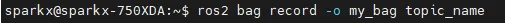


신규ROS2 cli 작성법

## ROS2 BAG(Turtlesim)
-
Turtle의움직임을BAG 파일에기록하기
-
기록된BAG 파일을이용하여turtle 움직이기
실습


BAG 파일만들기

## 준비단계
-
다음실습은여러터미널을사용하여진행됩니다.
혼란을방지하기위해, 터미널좌측상단의버튼을눌러미리3개의
터미널을열어두는것을권장합니다.
실습


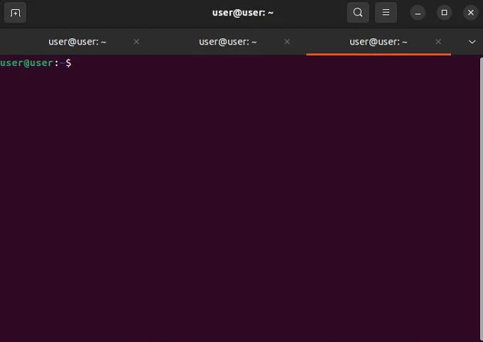


BAG 파일만들기

## 첫번째터미널에서turtlesim_node 실행
실습


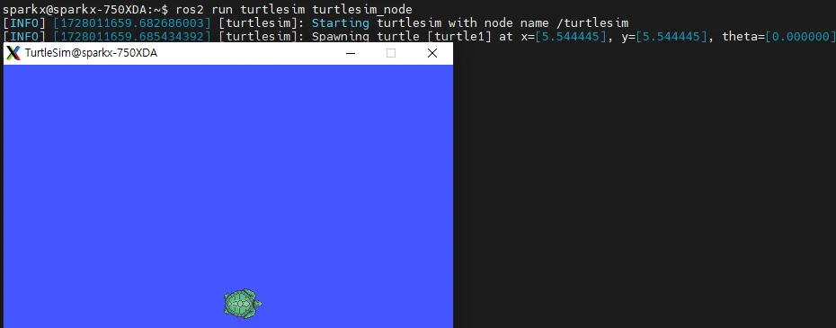


BAG 파일만들기

## 두번째터미널에서turtle_teleop_key 실행
실습

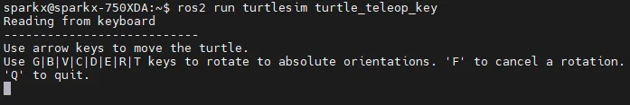


BAG 파일만들기

## 세번째터미널에서다음명령어를이용하여/turtle1/cmd_vel 토픽기록
-
/turtle1/cmd_vel이라는이름을가진토픽을turtle_bag이라는이름의BAG 파일에기록
-
주의사항: 반드시“Subscribed to topic ‘/turtle1/cmd_vel’” 이뜨는지확인할것
실습

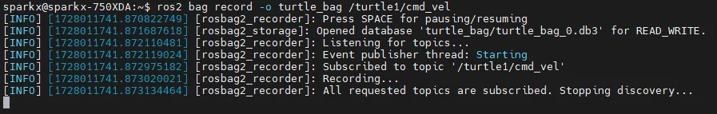


BAG 파일만들기

## 레코딩
-
두번째터미널로이동하여방향키를사용해turtle을임의로이동시키기
실습

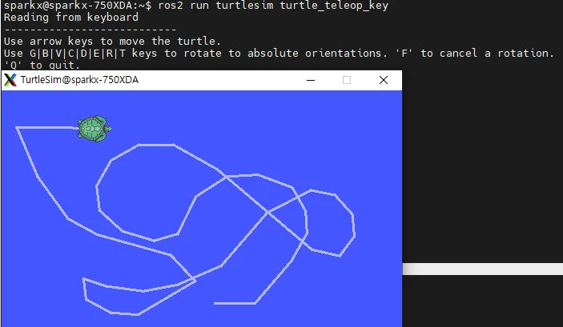


BAG 파일만들기

## 세번째터미널에서실행되고있는record 종료
-
종료는ctrl + c 사용
실습

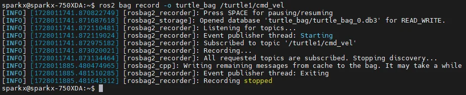


BAG 파일만들기

## 세번째터미널에서저장된BAG 파일확인
실습
BAG 파일만들기

## BAG 재생
-
첫번째터미널에서실행중인turtlesim을종료후재실행
실습

BAG 파일만들기

## 세번째터미널에서다음명령어를이용하여저장되어있는BAG 파일재생
-
간혹인터럽트등의이유로turtle의궤적이기록당시와정확히일치하지않을수있음
-
이문제를방지하려면turtle의움직임을기록할때, 각명령이완전히완료된후다음명령을
실행해야함
실습

신규ROS2 cli 작성법

## ROS2 BAG(2D, 3D, Lidar)
-
2D 카메라, 3D 카메라, Lidar를이용하여기록된BAG 파일실행하기
실습


BAG 파일실습

## BAG 파일에기록된2d 카메라정보불러오기
-
아래제공된링크에서rosbag2_video.tar.gz 파일을다운로드받은후압축풀기
https://drive.google.com/drive/folders/1zjGVRD5YQkiM_yLwjGOGRF5cruz8-Wsn
-
다운로드된압축파일의압축풀기
실습


BAG 파일실습

## BAG 파일에기록된2d 카메라정보불러오기
-
압축풀린bag 파일의정보확인
-
Bag 파일반복재생
실습


BAG 파일실습

## BAG 파일에기록된2d 카메라정보불러오기
-
새로운터미널에서rviz 실행
실습


BAG 파일실습

## BAG 파일에기록된2d 카메라정보불러오기
-
Rviz에서add버튼을누른후Image 선택후OK 버튼누르기
실습

BAG 파일실습

## BAG 파일에기록된2d 카메라정보불러오기
-
사이드바에서이미지의topic name을“＼video_frames”
로바꾸기
-
하단의Image 창에영상이재생되는것을확인
영상출처: https://www.youtube.com/watch?v=29iFysOZg3Q
실습

BAG 파일실습

## BAG 파일에기록된3d 카메라정보불러오기
-
아래제공된링크에서realsense.tar.gz 파일을다운로드받은후압축풀기
https://drive.google.com/drive/folders/1zjGVRD5YQkiM_yLwjGOGRF5cruz8-Wsn
-
다운로드된압축파일의압축풀기
실습


BAG 파일실습

## BAG 파일에기록된2d 카메라정보불러오기
-
압축풀린bag 파일의정보확인
-
Bag 파일반복재생
실습


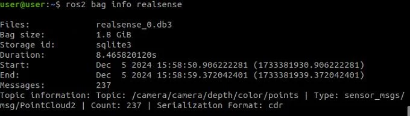

BAG 파일실습

## BAG 파일에기록된2d 카메라정보불러오기
-
새로운터미널에서rviz 실행
실습
BAG 파일실습

## BAG 파일에기록된2d 카메라정보불러오기
-
Global Options의FixedFrame을‘camera_depth_optical_frame’으로바꾸기
실습

BAG 파일실습

## BAG 파일에기록된3d 카메라정보불러오기
-
ADD → By topic → camera → camera → depth → color → points → PointCloud2
선택후OK 버튼클릭
실습

BAG 파일실습

## BAG 파일에기록된3d 카메라정보불러오기
실습

BAG 파일실습

## BAG 파일에기록된3d 카메라정보불러오기(특정시점)
실습


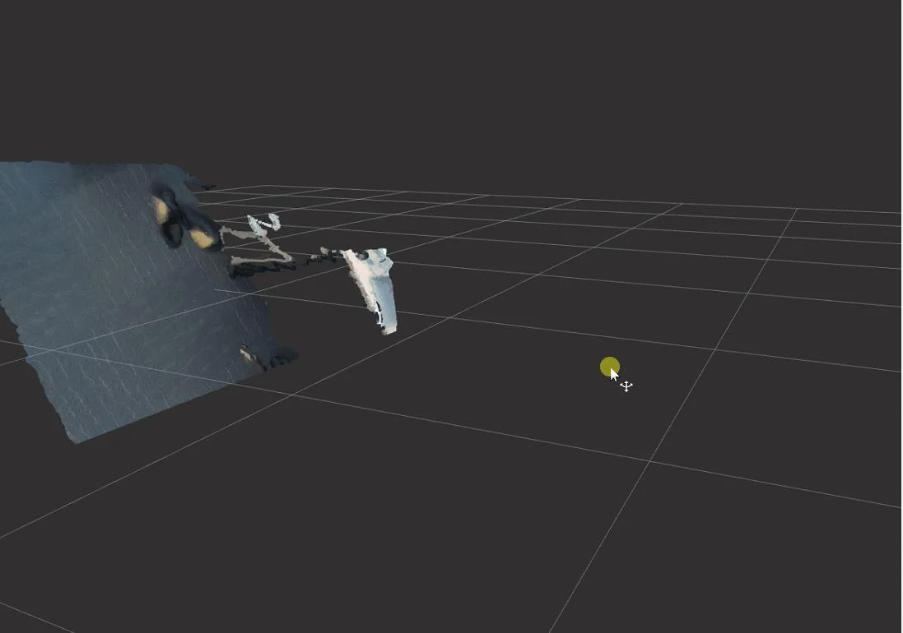


BAG 파일실습

## BAG 파일에기록된lidar 정보불러오기
-
아래제공된링크에서race_car.tar.gz 파일을다운로드받은후압축풀기
https://drive.google.com/drive/folders/1zjGVRD5YQkiM_yLwjGOGRF5cruz8-Wsn
-
다운로드된압축파일의압축풀기
실습


BAG 파일실습

## BAG 파일에기록된lidar 정보불러오기
-
압축풀린bag 파일의정보확인
-
Bag 파일반복재생
실습


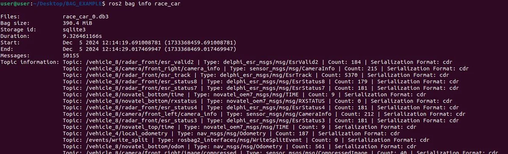


BAG 파일실습

## BAG 파일에기록된lidar 정보불러오기
-
새로운터미널에서rviz 실행
실습


BAG 파일실습

## BAG 파일에기록된lidar 정보불러오기
-
Global Options의FixedFrame을‘luminar_front’로바꾸기
실습


BAG 파일실습

## BAG 파일에기록된lidar 정보불러오기
-
ADD → by topic → vehicle8 → luminar_front_points → PointCloud2 선택후OK 버튼클릭
실습


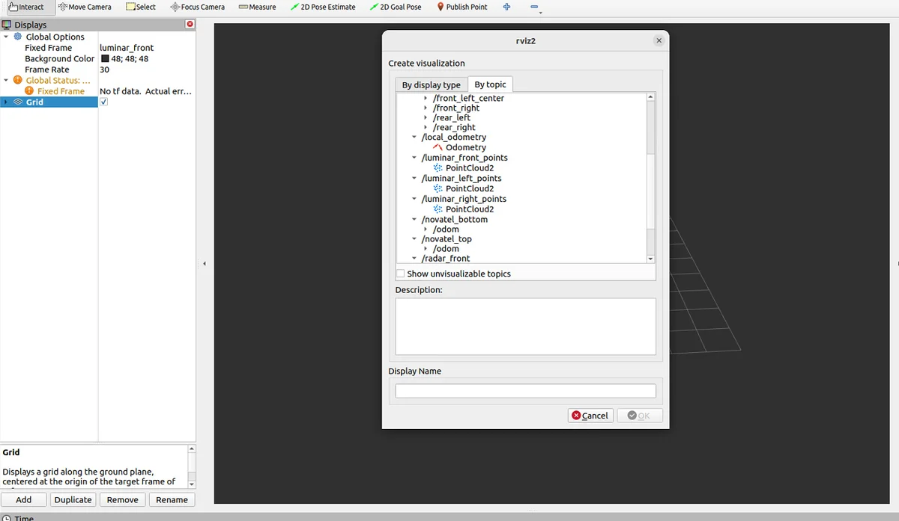


BAG 파일실습

## BAG 파일에기록된lidar 정보불러오기
-
사이드바의PointCloud2에서Size(m)을0.1로변경
실습


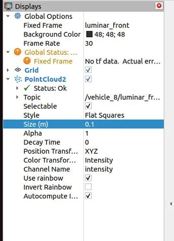


BAG 파일실습

## BAG 파일에기록된lidar 정보불러오기
-
사이드바의PointCloud2에서Size(m)을0.1로변경
실습


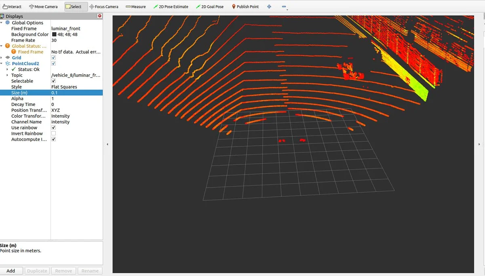


BAG 파일실습

## BAG 파일에기록된lidar 정보불러오기
-
실제RGB 영상과의비교
실습


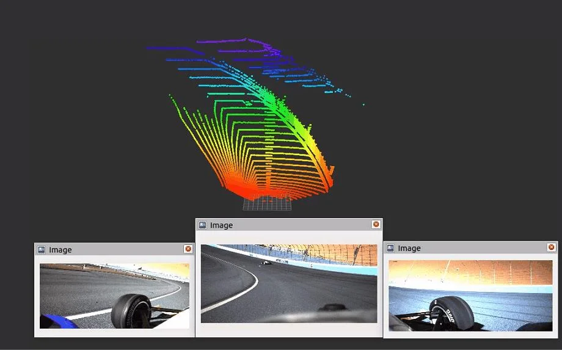


## Visual Studio Code
1. 터미널에서아래명령을이용해pip을설치
2. 터미널에서아래명령을이용해pip을최신버전으로유지
3. 터미널에서아래명령을이용해jupyter 설치
4. 설치가완료되면재부팅
Jupyter를이용한프로그래밍
VSCode에서Jupyter 사용


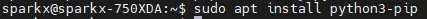


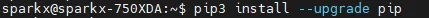

## Visual Studio Code
Jupyter를이용한프로그래밍
VSCode에서Jupyter 사용
-
재부팅후vscode를실행
-
VS Code에서
‘extension’ 탭으로이동한
후, 'Jupyter' 검색
-
검색결과에서나타나는Jupyter를선택하고
‘Install' 버튼을눌러설치

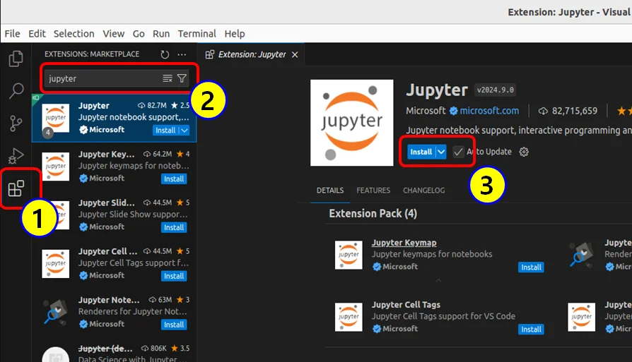


## Visual Studio Code
Jupyter를이용한프로그래밍
VSCode에서Jupyter 사용
-
Vscode의좌상단에서newfile을클릭하여
새로운파일을만듦
-
파일명은HelloWorld.ipynb로설정

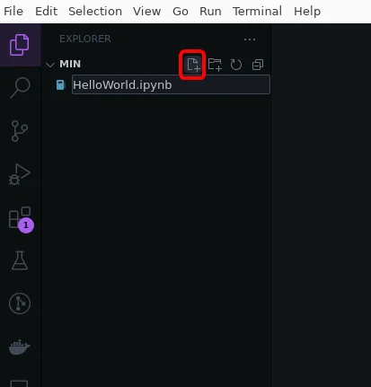


## Visual Studio Code
Jupyter를이용한프로그래밍
VSCode에서Jupyter 사용
-
아래와같이빈칸에print("Hello World")를입력후shift + enter를입력
-
Select Kernel창에서“Python Environments”를선택

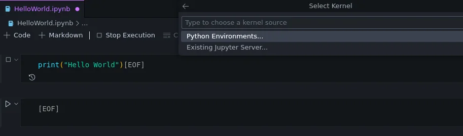


## Visual Studio Code
Jupyter를이용한프로그래밍
VSCode에서Jupyter 사용
-
나열된Python 버전중하나를선택(되도록Global Env를선택하는것을추천)

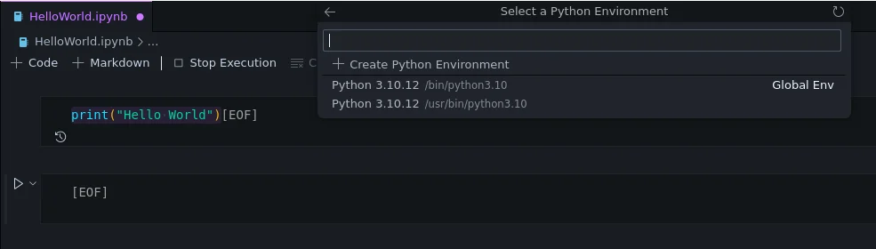


## Visual Studio Code
Jupyter를이용한프로그래밍
VSCode에서Jupyter 사용
-
이후python 코드가성공적으로실행되는것을확인가능

## Visual Studio Code - extension
Jupyter를이용한프로그래밍
VSCode에서Jupyter 사용
-
Extension의주요역할및기능
-
프로그래밍언어지원추가: 추가언어를지원하거나기존언어의기능을확장
(예: Python, YAML등)
-
생산성향상도구: 코딩, 탐색, 리팩토링, 반복작업을자동화해생산성향상
(예: XML Tools, Markdown All in One)
-
특정기술또는프레임워크지원: 특정프레임워크나기술을위한추가기능제공
(예: ROS, URDF)
-
자동화및DevTools: 반복작업을자동화하거나개발환경을확장(예: Colcon Tasks)


## Visual Studio Code - extension
Jupyter를이용한프로그래밍
VSCode에서Jupyter 사용
-
ROS2의간편한이용을위한extension설치
-
Python : 디버깅, 코드서식지정, 리팩토링, 단위테스트등
-
ROS : ROS 개발지원
-
URDF : URDF/xacro 지원
-
Colcon Tasks: setup scripts를자동으로환경에맞게run 함
-
XML Tools: XML 포맷팅, XML tree view를제공
-
YAML: YAML 지원
-
Markdown All in One : Markdown지원


## Visual Studio Code - extension
Jupyter를이용한프로그래밍
VSCode에서Jupyter 사용
-
Python Extension 설치(Python)
-
Vscode의extention 탭에서코드명(ms-python.python)을검색후install을눌러설치

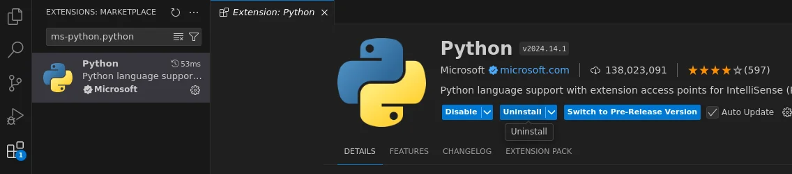


## Visual Studio Code - extension
Jupyter를이용한프로그래밍
VSCode에서Jupyter 사용
-
Python Extension 설치(ROS)
-
Vscode의extention 탭에서코드명(ms-iot.vscode-ros)을검색후install을눌러설치

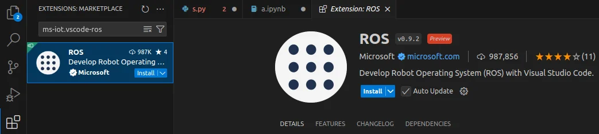


## Visual Studio Code - extension
Jupyter를이용한프로그래밍
VSCode에서Jupyter 사용
-
Python Extension 설치(URDF)
-
Vscode의extention 탭에서코드명(smilerobotics.urdf)을검색후install을눌러설치

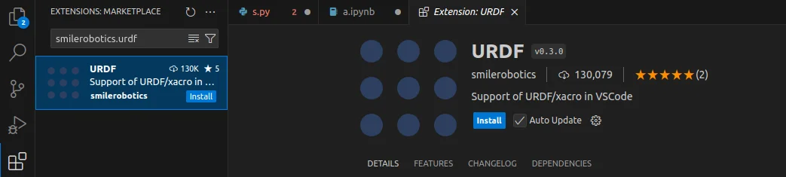


## Visual Studio Code - extension
Jupyter를이용한프로그래밍
VSCode에서Jupyter 사용
-
Python Extension 설치(Colcon Tasks)
-
Vscode의extention 탭에서코드명(deitry.colcon-helper)을검색후install을눌러설치

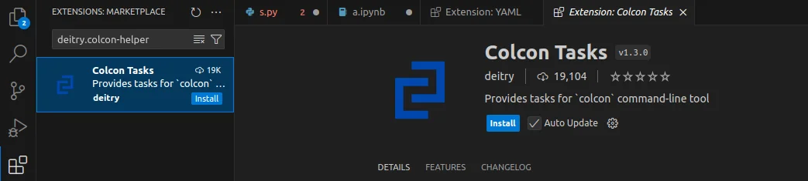


## Visual Studio Code - extension
Jupyter를이용한프로그래밍
VSCode에서Jupyter 사용
-
Python Extension 설치(XML Tools)
-
Vscode의extention 탭에서코드명(dotjoshjohnson.xml)을검색후install을눌러설치

## Visual Studio Code - extension
Jupyter를이용한프로그래밍
VSCode에서Jupyter 사용
-
Python Extension 설치(YAML)
-
Vscode의extention 탭에서코드명(redhat.vscode-yaml)을검색후install을눌러설치

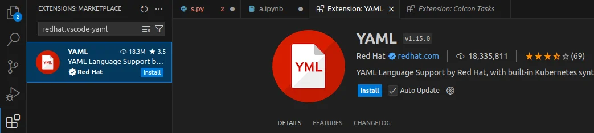


## Visual Studio Code - extension
Jupyter를이용한프로그래밍
VSCode에서Jupyter 사용
-
Python Extension 설치(Markdown)
-
Vscode의extention 탭에서코드명(yzhang.markdown-all-in-one)을검색후install을눌러설치

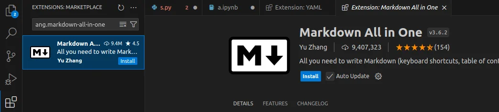


## Visual Studio Code - extension
Jupyter를이용한프로그래밍
VSCode에서Jupyter 사용
-
User settings 설정
-
Vscode에서ctrl + shift + p를누른후‘open user settings’을선택
-
엔터를눌러settings.json파일을열기

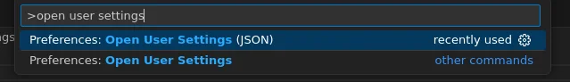


## Visual Studio Code - extension
Jupyter를이용한프로그래밍
VSCode에서Jupyter 사용
-
User settings 설정
-
settings.json 파일을아래와같이수정
-
다만, 이미동일한내용이있는경우추가할필요없음
-
저장후vscode를재시작

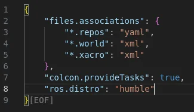


## Vscode 실행
Jupyter를이용한프로그래밍
Python으로토픽구독하기

## 새로운터미널을열어ros2 run 명령으로turtlesim 패키지의turtlesim_node를실행
준비

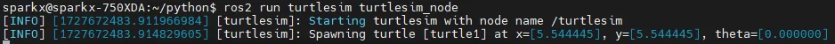


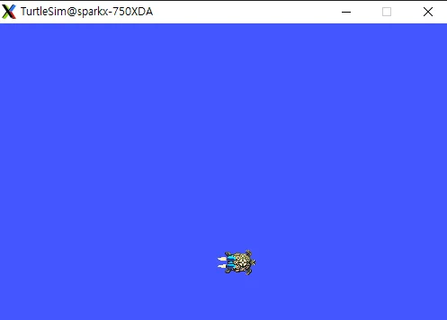


## Vscode에서jupyter notebook 실행
Jupyter를이용한프로그래밍
Python으로토픽구독하기
준비

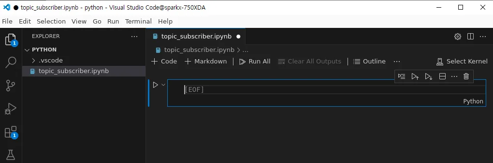


## 구독을위해필요한모듈import (코드실행: shift + enter)
Jupyter를이용한프로그래밍
Python으로토픽구독하기
토픽구독하기

## 터미널에서아래명령어를이용하여topic list 조회


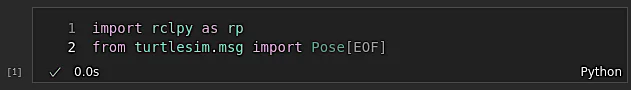


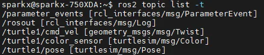


## rclpy의초기화및‘/sub_test’ 노드생성
Jupyter를이용한프로그래밍
Python으로토픽구독하기
토픽구독하기

## 터미널에서‘/sub_test’ 노드가생성되었음을확인


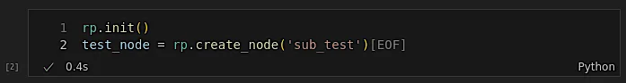


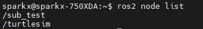


## Subscription에서실행할callback 함수작성
Jupyter를이용한프로그래밍
Python으로토픽구독하기
토픽구독하기
‘data’의구성요소는x, y, theta, linear, angular velocity로구성되어있으므로x, y, theta를
확인하고싶을때에는data.x, data.y, data.theta로조회가능

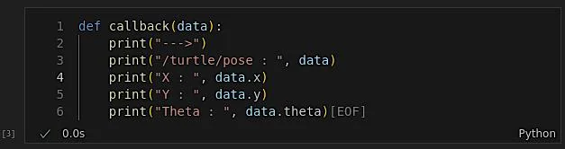


Jupyter를이용한프로그래밍
Python으로토픽구독하기
토픽구독하기
Pose : 데이터타입
turtle1/pose : 토픽이름
callback : 토픽이들어오면실행할함수
10 : QoS History
(메시지를얼마나저장할지결정하는인자)

## 토픽subscriber 만들기
## test_node 구독

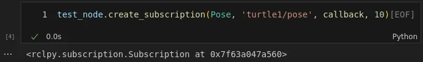

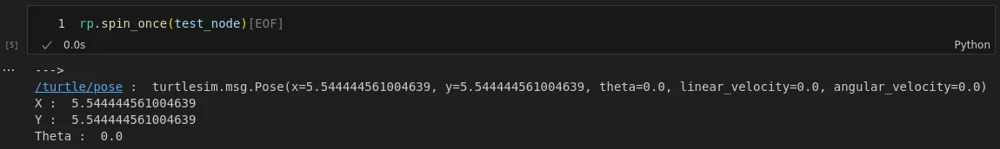

Jupyter를이용한프로그래밍
Python으로토픽발행하기

## Vscode 실행
## ‘ros2 run’ 명령으로turtlesim 패키지의turtlesim_node를실행

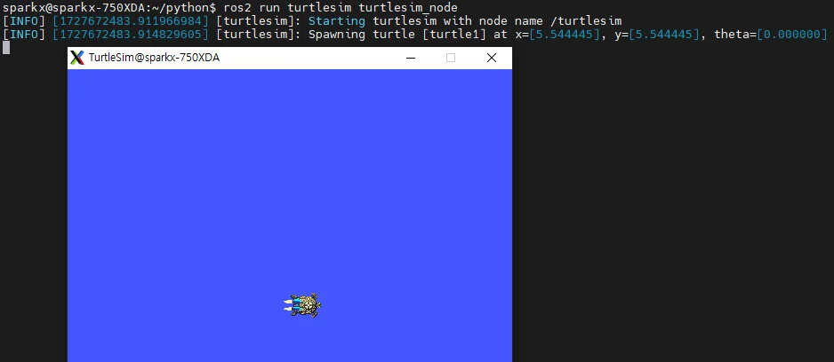


Jupyter를이용한프로그래밍
Python으로토픽발행하기

## Vscode에서jupyter notebook 실행
준비

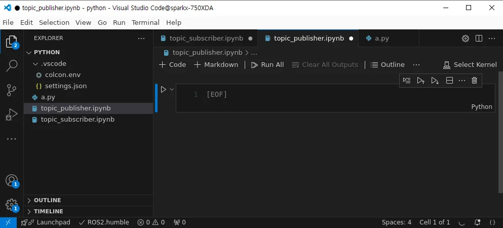


Jupyter를이용한프로그래밍
Python으로토픽발행하기

## 필요모듈import 및노드초기화
토픽발행하기

## cmd_vel 토픽의데이터타입인Twist 선언
cmd_vel: 로봇의속도를제어하기위해사용되는ROS 토픽


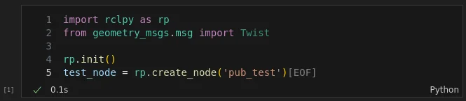


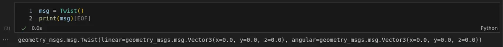


Jupyter를이용한프로그래밍
Python으로토픽발행하기

## x축선형속도를2.0으로설정한후, 해당값을발행할메시지로준비
토픽발행하기

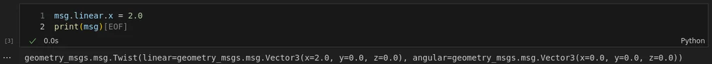


Jupyter를이용한프로그래밍
Python으로토픽발행하기

## 토픽발행
토픽발행하기

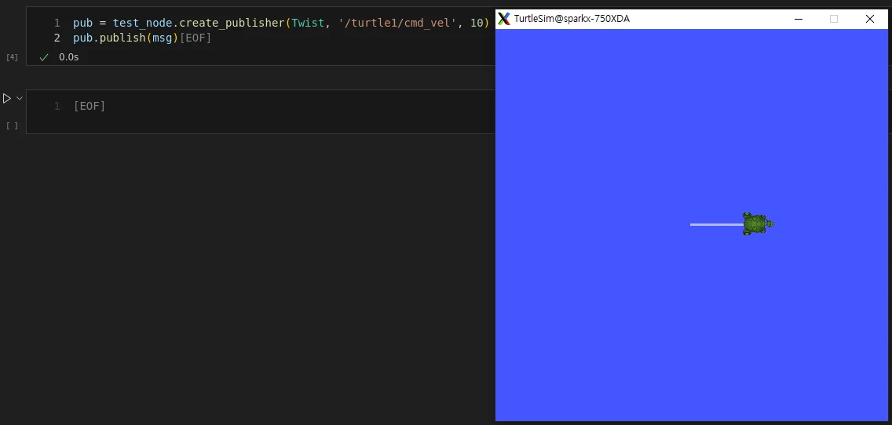


Jupyter를이용한프로그래밍
Python으로토픽발행하기

## 추가동작도가능
토픽발행하기

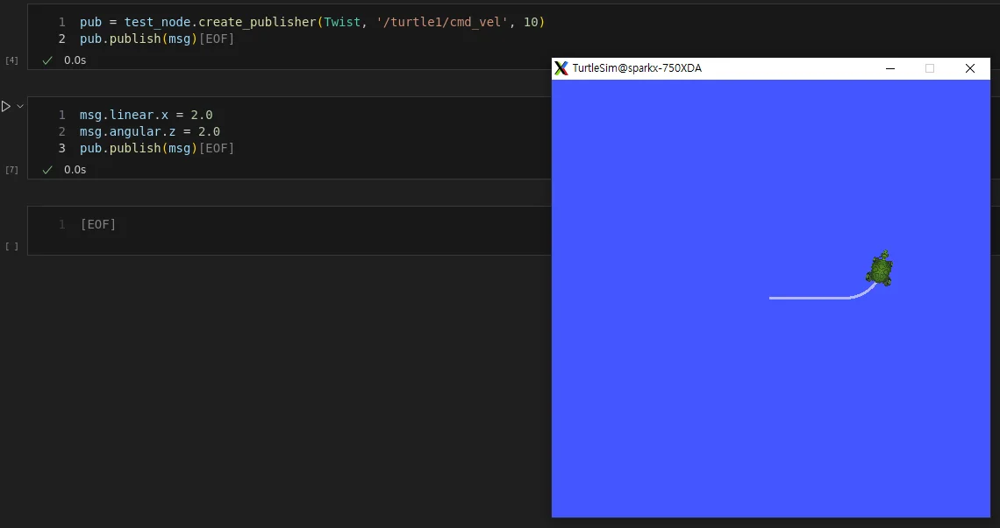


Jupyter를이용한프로그래밍
Python으로토픽발행하기
토픽발행하기

## Timer를이용해토픽발행하기
timer_callback 함수가5번이상호출되지않도록cnt를이용한조건문을넣어줌

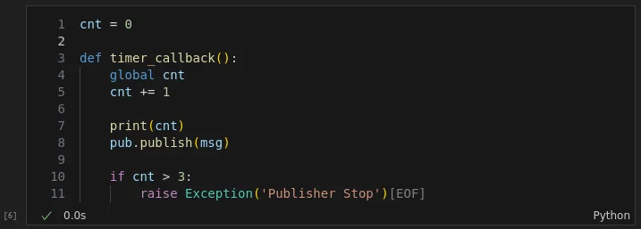


Jupyter를이용한프로그래밍
Python으로토픽발행하기
토픽발행하기

## Timer를이용해토픽발행하기
create_timer를이용해2초마다timer_callback 함수실행
rp.spin: ‘rp.spin_once’와는달리
토픽을지속적으로수신하므로,
중간에직접멈추거나멈춤조건
을설정해주어야함

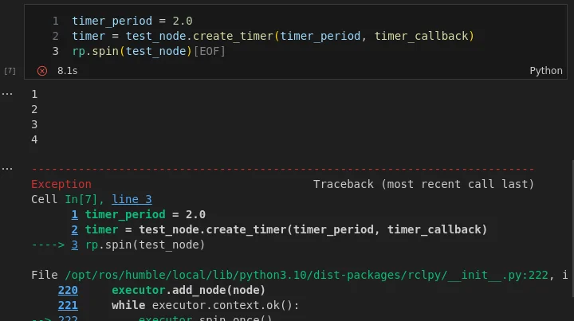

Jupyter를이용한프로그래밍
Python으로토픽발행하기
토픽발행하기

## 노드종료시키기
Jupyter notebook의경우노트북을종료시키기직전에node를종료시켜야함


Jupyter를이용한프로그래밍
Python으로서비스클라이언트다루기
준비

## vscode 실행
## ‘ros2 run’ 명령으로turtlesim 패키지의turtlesim_node를실행


Jupyter를이용한프로그래밍
Python으로서비스클라이언트다루기
서비스클라이언트생성

## TeleportAbsolute :
## rclpy 초기화및노드생성
‘/turtle1/teleport_absolute’ 서비스를사용하기위한모듈import


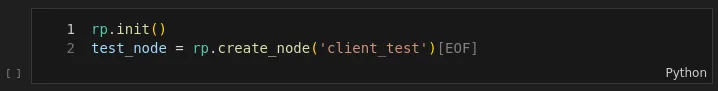


Jupyter를이용한프로그래밍
Python으로서비스클라이언트다루기
서비스클라이언트생성

## ‘/turtle1/teleport_absolute’라는서비스에연결하는클라이언트를생성
## TeleportAbsolute 서비스에대한request 객체를생성
TeleportAbsolute : Turtle을특정좌표(x, y)와방향(θ)으로즉시텔레포트시키는서비스타입

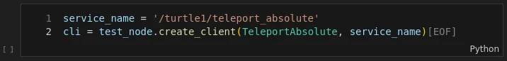

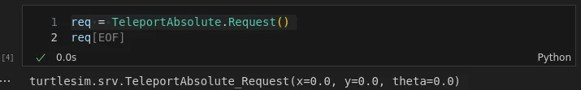


Jupyter를이용한프로그래밍
Python으로서비스클라이언트다루기
서비스클라이언트생성

## Request 객체의x 좌표를1.0, y 좌표를1.0, theta(회전각)를3.14로설정

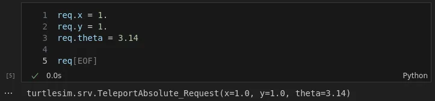


Jupyter를이용한프로그래밍
Python으로서비스클라이언트다루기
서비스클라이언트생성

## 설정req의x 성분만3.0으로바꾼후call_async를통해서비스를호출

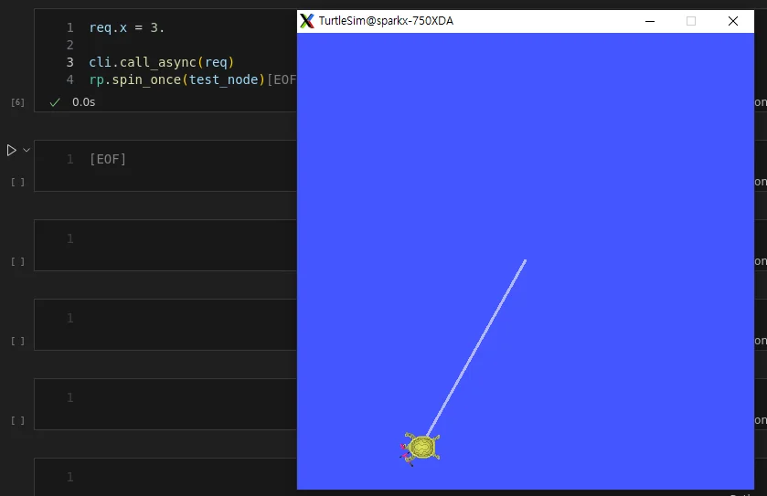


Jupyter를이용한프로그래밍
Python으로서비스클라이언트다루기
서비스클라이언트생성

## 서비스가준비될때까지대기후비동기요청을호출하며test_node에서스핀을실행
wait_for_service: 지정한서비스가사용가능할때까지대기하는함수

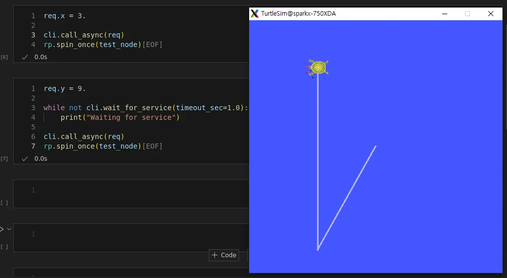


Jupyter를이용한프로그래밍
Python으로서비스클라이언트다루기
서비스클라이언트생성

## 노드종료시키기

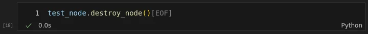


Jupyter를이용한프로그래밍
Python으로액션서버다루기

## vscode 실행
준비

## ‘ros2 run’ 명령으로turtlesim 패키지의turtlesim_node를실행

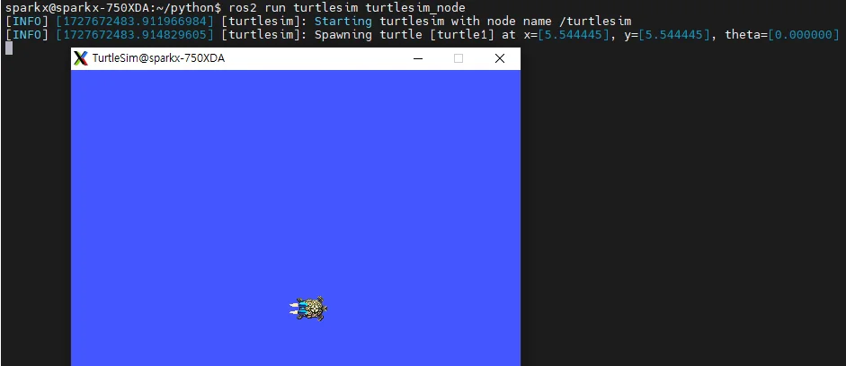


Jupyter를이용한프로그래밍
Python으로액션서버다루기

## action_server.ipynb파일생성
액션서버생성
action_server를구현하기위한모듈import
-
TurtleRotateServer 클래스정의
/turtle1/rotate_absolute에대해
회전명령을처리하는액션서버
goal_callback, cancel_callback 메서드로
goal과cancel 상태반환f정


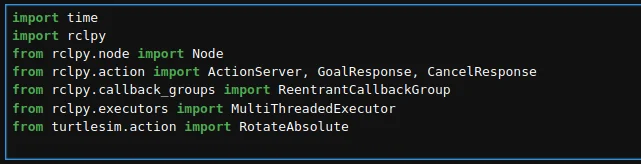


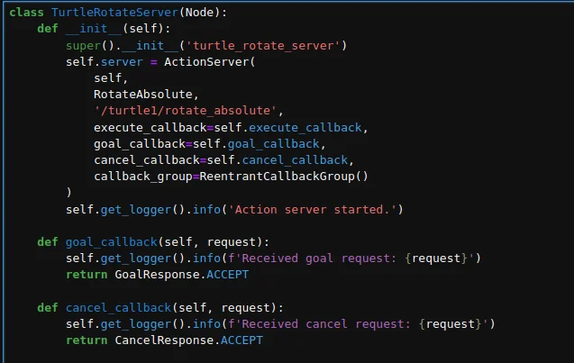


Jupyter를이용한프로그래밍
Python으로액션서버다루기

## execute_callback() 메서드정의
액션서버생성
명령을실행하고, 10초동안남은진행상태를피드백으로클라이언트에전달
실행도중취소요청이들어오면작업을취소하고, 성공적으로완료되면결과를반환


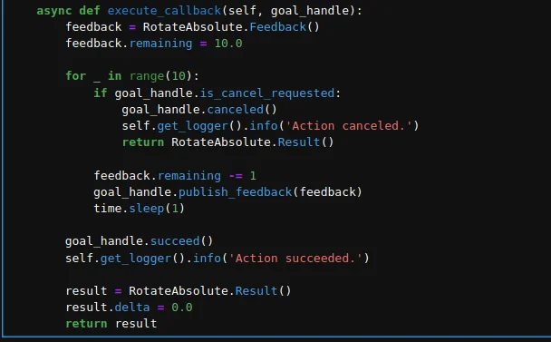


Jupyter를이용한프로그래밍
Python으로액션서버다루기

## 액션서버초기화및인스턴스생성
액션서버생성
로그메시지: 액션서버가성공적으로시작되었음

## 액션서버실행
독립된스레드에서클라이언트의요청대기
로그메시지: 클라이언트에서요청을수신했으며, 작업이성공적으로완료되었음

## 액션서버종료
터미널에서ctrl+c를누르는것과같음


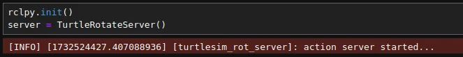


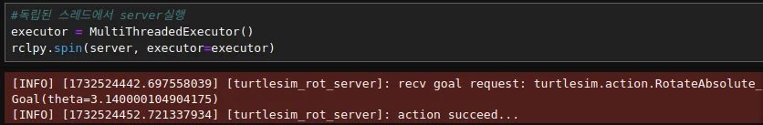


Jupyter를이용한프로그래밍
Python으로액션클라이언트다루기

## 필요한모듈import (Ros2와액션메시지)
액션클라이언트생성

## TurtleRotateClient 클래스정의
액션클라이언트를초기화
/turtle1/rotate_absolute 액션서버와통신설정
send_goal : 목표각도를설정하고서버로전송


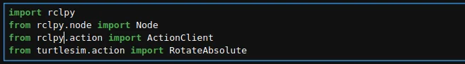


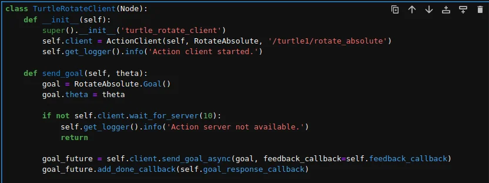


Jupyter를이용한프로그래밍
Python으로액션클라이언트다루기

## TurtleRotateClient 클래스의주요메서드들
액션클라이언트생성
goal_response_callback : 서버에서각도정보를수신했는지확인
feedback_callback : 액션실행중발생하는피드백로그를기록
result_callback : 액션완료후결과를처리하고ROS 노드를종료


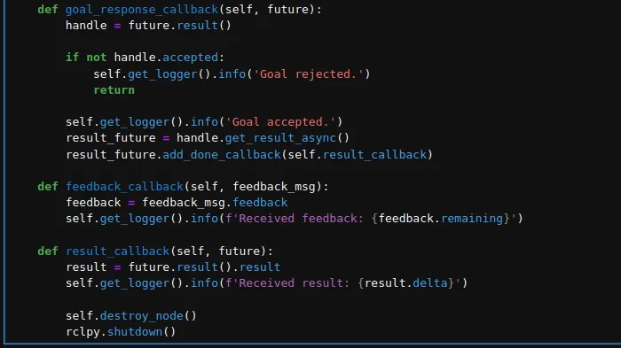


Jupyter를이용한프로그래밍
Python으로액션클라이언트다루기

## 액션클라이언트초기화및인스턴스생성
액션클라이언트생성
로그메시지: 액션클라이언트가성공적으로시작되었음

## 액션클라이언트실행후종료


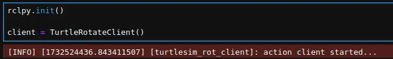


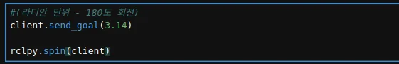


Jupyter를이용한프로그래밍
Python으로액션클라이언트다루기

## 액션클라이언트실행
액션클라이언트생성
액션서버피드백
회전하는도중에지속적으로중간실행결과를
피드백받을수있음
(실행전)
(실행후)


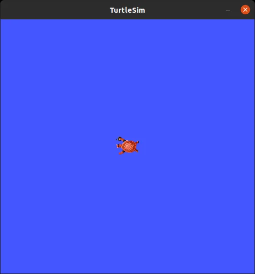


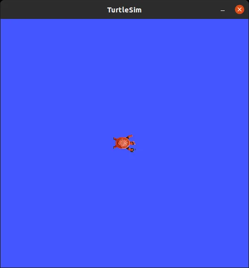


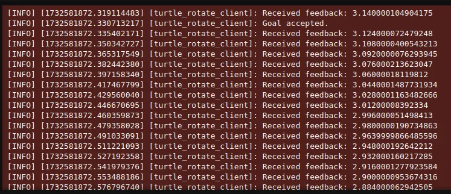


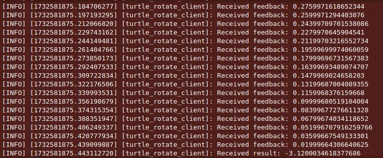


---

## Code Examples


### `ros2env/`

[View full source on GitHub](https://github.com/OWNER/study-site/tree/main/source/ros2env/){ .md-button }

#### `ros2env/ros2env/__init__.py`

```python

```

#### `ros2env/ros2env/verb/__init__.py`

```python
from ros2cli.plugin_system import PLUGIN_SYSTEM_VERSION
from ros2cli.plugin_system import satisfies_version


class VerbExtension:
    """
    The extension point for 'env' verb extensions.

    The following properties must be defined:
    * `NAME` (will be set to the entry point name)

    The following methods must be defined:
    * `main`

    The following methods can be defined:
    * `add_arguments`
    """

    NAME = None
    EXTENSION_POINT_VERSION = "0.1"

    def __init__(self):
        super(VerbExtension, self).__init__()
        satisfies_version(PLUGIN_SYSTEM_VERSION, "^0.1")

    def add_arguments(self, parser, cli_name):
        pass

    def main(self, *, args):
        raise NotImplementedError()

```

#### `ros2env/ros2env/command/__init__.py`

```python

```
