# 강의_3기_ROS2입문_7차시


ROS2 프로그래밍입문(7차시)
7. ROS2 복습_1


## ROS2 복습_1
1.  ROS2 소개및기본사용법
2.  ROS2 인터페이스(Topic, Server, Action)
ROS2 소개및기본사용법
Topic
## 최적화팁
ROS2 소개및기본사용법
Service


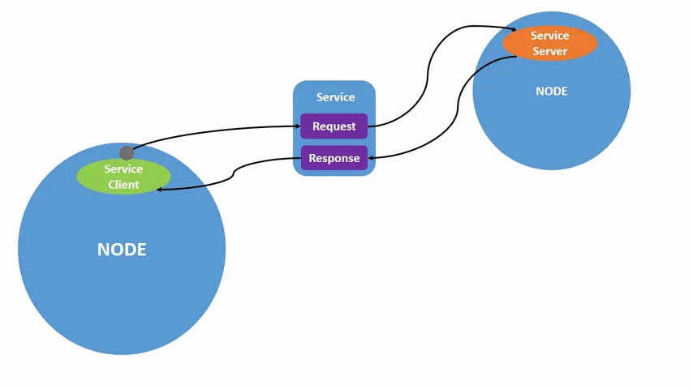

ROS2 소개및기본사용법
Action

ROS2 인터페이스(Topic, Service, Action)
최적화
• ROS2에서의액션은목표전달(send_goal), 목표취소(cancel_goal), 결과받기(get_result)를위한
토픽과서비스통신을혼합하여사용
• 비동기방식에서원하는타이밍에적절한액션수행을위해목표상태(goal_state)에도입
하여, 목표전달후상태머신을구동하여액션프로세스추적
## Message

프로그래밍규칙
Python Style
## 기본규칙
• Python 3(Python 3.5 이상)
## 라인길이
• 최대100 문자
## 이름규칙(Naming)
• CamelCased, snake_case, ALL_CAPITALS 만사용
CamelCased: 타입, 클래스
snake_case: 파일, 패키지, 인터페이스, 모듈, 변수, 함수, 메소드
ALL_CAPITALS: 상수
Python Enhancement Proposals(PEPs)의PEP 8을준수
Wiki 참고: https://wiki.ros.org/PyStyleGuide

ROS2 Setup Tips
rosdep
## rosdep
• 의존성관리툴인rosdep 명령어를사용하면손쉽게패키지의의존성문제를해결
• rosdep은패키지환경설정파일인package.xml의<depend> 옵션과같은의존성정보를확인
하여의존성패키지들을설치해주기때문에의존성패키지가많은패키지의경우, 위명령어를
사용하면의존성패키지설치및관리에있어서매우편하게사용가능


ROS2 Setup Tips
Namespace
## 사용방법
• ns 명령사용
1.
ROS의변수중하나인ns(namespace)를입력
2.
복수의namespace 생성


Python을이용한패키지생성실습
## Package 생성
1. ros2_ws/src 디렉토리생성
2. py_pubsub package를생성
3. 생성된Package 확인
4. Tree를이용한내부구조확인


Python을이용한패키지생성
package.xml
## package.xml
• 패키지에대한메타정보를포함하는파일(패키지의신분증역할)
• 이파일은패키지이름, 버전, 저작자, 라이센스등의정보를정의하며, 패키지의의존성
패키지와메시지, 서비스, 액션등의정의된인터페이스정보도포함
•
사용목적
•
소스코드를실제실행가능한프로그램이나라이브러리로변환하기위해colcon
build를수행하면package.xml을참조하여, 빌드할패키지들사이의의존성해석
및적절한빌드순서결정
•
또한, 패키지의존성설치시rosdep이이파일의정보를기반으로함


Python을이용한패키지생성실습
•
description, maintainer, license 채우기
•
위코드바로아래의존성코드복사해서붙여넣기
•
<exec_depend> 태그는해당ROS 패키지가실행되기위해필요한의존성을지정하는데사용
•
rclpy: ROS2의python 클라이언트라이브러리
•
해당패키지가실행될때rclpy 라이브러리에의존한다는것을나타냄(즉, python을사용한ROS2 노드를실행하는데필요한라이브러리)
•
std_msgs: ROS에서기본적으로제공하는메시지타입들의모음ex) String, Int32, Float64 등
•
해당패키지가실행될때std_msgs 메시지라이브러리에의존한다는것을나타냄
•
이러한의존성은패키지를빌드하거나실행할때필요한외부패키지나라이브러리를ROS 빌드도구에게알려주는역할따라서ROS
빌드도구는이정보를사용하여필요한의존성을먼저설치하거나빌드할수있음
## Package.xml  설정


Python을이용한패키지생성
setup.py & setup.cfg
## setup.cfg
•
패키지빌드/설치/배포에사용(버전/설명/패키지의존성관리등)
•
setuptools를사용하여패키지를배포준비시필요한정보제공
•
Python 패키지에대한선언적인구성정보를제공하며, setuptools의
빌드및설치과정에서활용
•
주로패키지버전, 설명등이여기에정의됨
## setup.py
•
setuptools를사용하여패키지를배포할준비를할때, 필요한정보를
담고있음
•
Python 패키지에대한프로그래매틱한구성정보를제공하며,
setuptools를통한빌드및설치과정에서사용됨
•
Python 패키지의설치스크립트
•
주로패키지버전, 설명, 의존성등을포함한설치스크립트역할
•
setuptools 라이브러리를사용, 패키지를빌드하고설치하는데필요한
설정포함
## ROS2에서의역할
•
Python 기반의ROS2 패키지에대해colcon
은setup.cfg(및setup.py)를사용하여패키
지의설치를처리
•
setup.cfg, setup.py는setuptools를통해패
키지를빌드하고설치하는방법에대한구
성정보를제공
•
ament_python 패키지빌드타입을사용하
는경우, 파일의설정이빌드과정에영향을
줄수있음


Python을이용한패키지생성
CMakeLists.txt
## CMakeLists.txt와setup.py/setup.cfg, package.xml간의비교
•
CMakeLists.txt
•
C/C++ 프로젝트에서주로사용됨
•
코드컴파일및링크설정
•
ROS2 메시지및서비스생성같은더광범위한작업지원
•
빌드시필요한지침을담고있으며, 주로코드컴파일과관련이깊음
•
setup.py/setup.cfg
•
Python 패키지의빌드및설치과정설정에사용됨
•
주로Python 관련설정에집중
•
Pacakge.xml
•
패키지의메타데이터와의존성을관리하는데중점
•
CMakeLists.txt와함께작동하여ROS2 패키지의빌드와배포를가능하게함
## 세파일의공통점
•
CMakeLists.txt, setup.py/setup.cfg, package.xml
모두패키지의빌드및설치과정에서의존성관리와설정정의에사용
Python을이용한패키지생성실습
## 패키지소스분석
• timer_callback 함수
1.
이콜백함수는타이머에의해주기적으로호출
2.
'Hello World: [count]' 형식의메시지를생성하고해당메시지를발행
3.
또한해당메시지를로깅하여화면에출력
• main 함수
1.
ROS2를초기화
2.
MinimalPublisher 클래스의인스턴스를생성하고, rclpy.spin()을사용하여이노드를실행
3.
이함수는노드가종료될때까지메시지를계속발행하게함
4.
노드와ROS2를적절히종료
• 메인실행
•
스크립트가직접실행되면main() 함수를호출하여위의모든로직을시작


Python을이용한패키지생성실습
## 의존성추가
•
​setup.py 설정

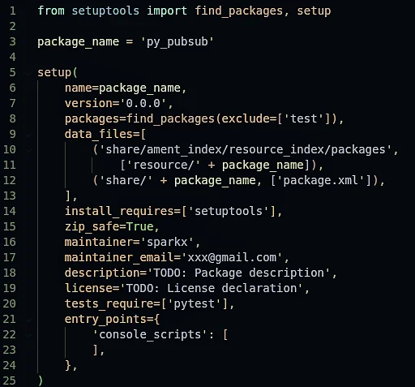


Python을이용한패키지생성실습
## setup.py 설정
•
​setup.py 파일열고수정하기(package.xml 파일과동일하게작성)
•
entry_points 필드부분에talker 추가하기(추가후저장하기)


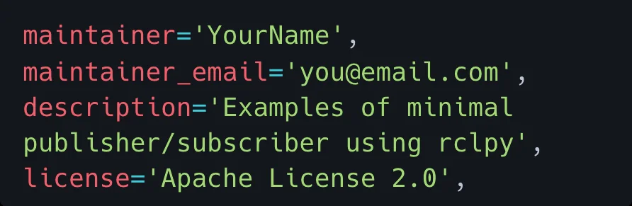


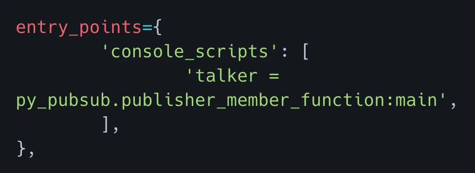


Python을이용한패키지생성실습
## setup.py 설정
•
entry_points
•
entry_points는Python의setuptools에서사용되는설정의일부
•
특히python 패키지를설치할때커맨드라인스크립트를자동으로생성하도록지시하는데사용
•
console_scripts
•
console_scripts는entry_points의하위항목으로, 커맨드라인에서실행할수있는스크립트를지정
•
'talker = py_pubsub.publisher_member_function:main'
•
이항목은'talker'라는커맨드라인명령어를생성하라는지시
•
사용자가커맨드라인에서talker라고입력하면, py_pubsub.publisher_member_function 모듈의
main 함수가실행
•
결과적으로, 이설정을사용하여python 패키지를설치하면, 사용자는커맨드라인에서바로
talker 명령어를사용하여해당기능을실행할수있게됨
•
ROS2에서python 노드를쉽게실행할수있도록하는데특히유용함
•
이러한방식을통해ROS2는Python 스크립트를바로실행할수있는실행가능한커맨드를제공


Python을이용한패키지생성실습
## Subscriber code 분석
•
Imports
•
import rclpy ROS2의Python 클라이언트라이브러리를가져옴
•
from rclpy.node import Node Node 클래스를가져와노드를생성, 관리하는데필요한기능을사용
•
from std_msgs.msg import String ROS2의표준메시지패키지에서String 메시지유형을가져옴
•
MinimalSubscriber 클래스
•
이클래스는ROS2 노드로동작하며, 주요기능은메시지구독
•
__init__ 메서드
1. 노드의초기화를수행
2. create_subscription: 주어진토픽에대한구독자를생성(여기서토픽이름은'topic'이고, 메시지유형은String)
메시지가토픽에게시될때마다listener_callback 함수가호출됨
•
listener_callback 메서드
1. 토픽에게시된메시지를수신할때호출되는콜백함수
2. 수신된메시지의내용을로그에출력


Python을이용한패키지생성실습
## Subscriber code 분석
•
main 함수
•
ROS2를초기화
•
MinimalSubscriber 클래스의인스턴스를생성
•
rclpy.spin : 이벤트루프를시작하여콜백을계속호출하게됨
(메시지가게시될때마다listener_callback 함수가호출됨)
•
destroy_node : 노드를명시적으로파괴(선택적, 가비지수집기에의해자동으로처리될수있음)
•
rclpy.shutdown : ROS2를종료하고모든리소스를해제
•
메인실행
•
스크립트가직접실행되면main 함수를호출(스크립트를모듈로임포트할때, main 함수가자동으로
호출되지않음)
•
전반적으로이코드는ROS2를사용하여'topic'이라는토픽에서String 메시지를구독하고, 해당
메시지의내용을로그에출력하는간단한구독자노드를구현


토픽, 서비스, 액션인터페이스
인터페이스(Interface) 신규작성
## 인터페이스(Interface)
•
ROS에서노드사이에데이터를전송시사용되는토픽(Topic), 서비스(Service), 액션(Action)
에서사용되는데이터타입
•
토픽은msg 파일, 서비스는srv 파일, 액션은action 파일에인터페이스가정의
•
일반적으로std_msgs나geometry_msgs와같은미리선언된인터페이스를바로사용가능
하나, 필요에따라커스텀인터페이스생성가능
•
단일패키지를가진프로그램에서사용시, 해당패키지포함시키기도하지만, 일반적으로단
일패키지를가지는프로그램을만드는경우는거의없음
•
여러개의패키지를가지는경우, 별도의인터페이스패키지를생성하여사용하는것을추천
(이경우여러패키지들이만들어진인터페이스패키지를공유하며사용가능)


토픽, 서비스, 액션인터페이스
인터페이스패키지생성
•
Service, action, msg를담는인터페이스폴더역시하나의패키지로생성
•
개발언어가python이라도build-type을ament_cmake로설정이필요
•
ament_cmake에는메시지를include하거나import할수있게하는기능이있지만,
ament_python에는없음


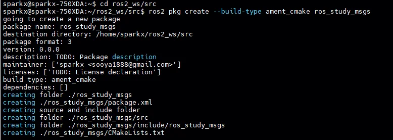
토픽, 서비스, 액션인터페이스
인터페이스패키지생성
•
아래3개의폴더및파일을생성
•
파일명은반드시카멜케이스(CamelCase)만사용, 만약첫문자가소문자일경우빌드시오류발생
•
msg/MyMsg.msg
•
srv/MySrv.srv
•
action/MyAction.action

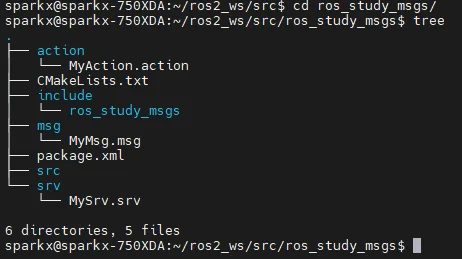


토픽, 서비스, 액션인터페이스
인터페이스패키지생성
•
생성한세개의폴더및파일에아래와같이작성
•
msg/MyMsg.msg
•
srv/MySrv.srv
•
action/MyAction.action


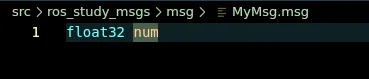


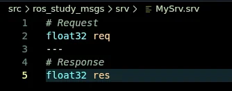


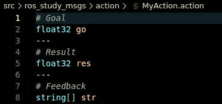


토픽, 서비스, 액션인터페이스
패키지설계
## 인터페이스패키지수정
CMakeList.txt
ArithmeticChecker.action
ArithmeticArgument.msg
ArithmeticOperator.srv


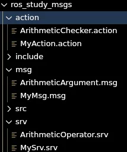


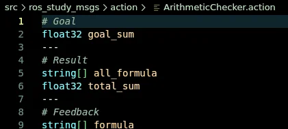


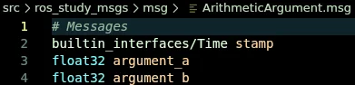


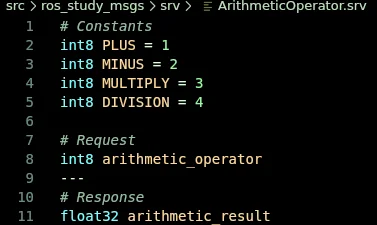


토픽, 서비스, 액션인터페이스
인터페이스패키지생성


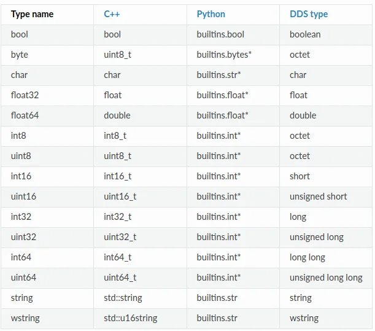


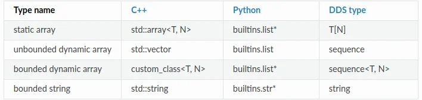


토픽, 서비스, 액션인터페이스
인터페이스패키지생성
## Package.xml 파일수정


토픽, 서비스, 액션인터페이스
인터페이스패키지생성
## CMakeLists.txt 파일수정


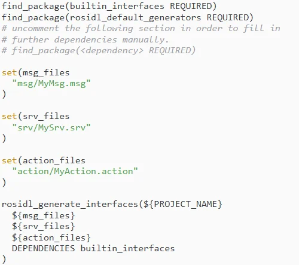

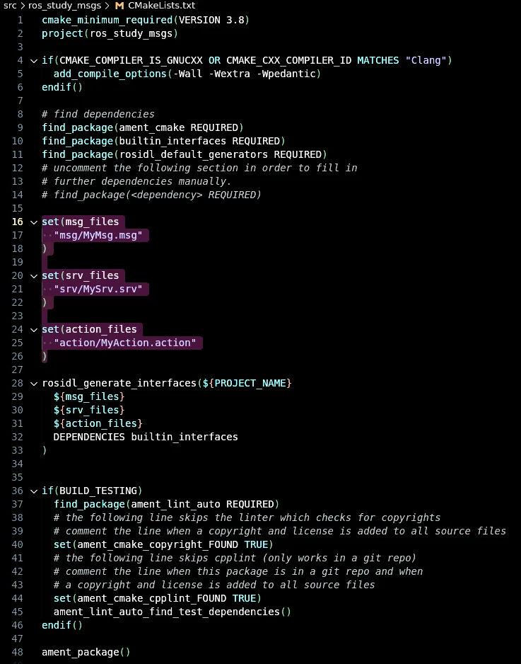


Python을이용한패키지생성실습
## Visual Studio Code 를이용한패키지생성연습
•
py_pubsub 패키지개선하기
•
my_ros_msgs 패키지실습


---

## Jupyter Notebooks


### 7차시_예제_주피터노트북_py_pubsub

[](https://colab.research.google.com/github/OWNER/study-site/blob/main/notebooks/ros/7차시_수업코드_개선_/7차시 수업코드(개선)/7차시_예제_주피터노트북_py_pubsub.ipynb)

#### py_pubsub 패키지를 jupyter에서 실행하는 코드입니다.

#### Subscriber code


```python
import rclpy
from rclpy.node import Node
from std_msgs.msg import String


class MinimalSubscriber(Node):

    def __init__(self):
        super().__init__("minimal_subscriber")
        self.subscription = self.create_subscription(
            String, "topic", self.listener_callback, 10
        )
        self.subscription  # prevent unused variable warning

    def listener_callback(self, msg):
        self.get_logger().info(f"I heard: {msg.data}")


# def main(args=None):
#     rclpy.init(args=args)
#     minimal_subscriber = MinimalSubscriber()
#     rclpy.spin(minimal_subscriber)
#     minimal_subscriber.destroy_node()
#     rclpy.shutdown()
```

#### Publisher 코드드


```python
# import rclpy
# from rclpy.node import Node
# from std_msgs.msg import String


class MinimalPublisher(Node):

    def __init__(self):
        super().__init__("minimal_publisher")
        self.publisher_ = self.create_publisher(String, "topic", 10)
        timer_period = 0.5  # seconds
        self.timer = self.create_timer(timer_period, self.timer_callback)
        self.i = 0

    def timer_callback(self):
        msg = String()
        msg.data = f"Hello World: {self.i}"
        self.publisher_.publish(msg)
        self.get_logger().info(f"Publishing: {msg.data}")
        self.i += 1


# def main(args=None):
#     rclpy.init(args=args)
#     minimal_publisher = MinimalPublisher()
#     rclpy.spin(minimal_publisher)
#     minimal_publisher.destroy_node()
#     rclpy.shutdown()
```


```python
import time

rclpy.init()
minimal_subscriber = MinimalSubscriber()
minimal_publisher = MinimalPublisher()

try:
    for _ in range(30):
        rclpy.spin_once(minimal_publisher)
        rclpy.spin_once(minimal_subscriber)
        time.sleep(1.0)
finally:
    minimal_subscriber.destroy_node()
    minimal_publisher.destroy_node()
    rclpy.shutdown()
```

    [INFO] [1745347587.345396758] [minimal_publisher]: Publishing: Hello World: 0
    [INFO] [1745347587.363020318] [minimal_subscriber]: I heard: Hello World: 0
    [INFO] [1745347588.382281375] [minimal_publisher]: Publishing: Hello World: 1
    [INFO] [1745347588.392444829] [minimal_subscriber]: I heard: Hello World: 1
    [INFO] [1745347589.397276489] [minimal_publisher]: Publishing: Hello World: 2
    [INFO] [1745347589.401492075] [minimal_subscriber]: I heard: Hello World: 2
    [INFO] [1745347590.406465800] [minimal_publisher]: Publishing: Hello World: 3
    [INFO] [1745347590.412285797] [minimal_subscriber]: I heard: Hello World: 3
    [INFO] [1745347591.423198741] [minimal_publisher]: Publishing: Hello World: 4
    [INFO] [1745347591.428896320] [minimal_subscriber]: I heard: Hello World: 4
    [INFO] [1745347592.437301431] [minimal_publisher]: Publishing: Hello World: 5
    [INFO] [1745347592.464249416] [minimal_subscriber]: I heard: Hello World: 5
    [INFO] [1745347593.472981225] [minimal_publisher]: Publishing: Hello World: 6
    [INFO] [1745347593.478466727] [minimal_subscriber]: I heard: Hello World: 6
    [INFO] [1745347594.497613850] [minimal_publisher]: Publishing: Hello World: 7
    [INFO] [1745347594.505079717] [minimal_subscriber]: I heard: Hello World: 7
    [INFO] [1745347595.510113455] [minimal_publisher]: Publishing: Hello World: 8
    [INFO] [1745347595.517906515] [minimal_subscriber]: I heard: Hello World: 8
    [INFO] [1745347596.523199037] [minimal_publisher]: Publishing: Hello World: 9
    [INFO] [1745347596.528418310] [minimal_subscriber]: I heard: Hello World: 9
    [INFO] [1745347597.547920403] [minimal_publisher]: Publishing: Hello World: 10
    [INFO] [1745347597.573039215] [minimal_subscriber]: I heard: Hello World: 10
    [INFO] [1745347598.603897191] [minimal_publisher]: Publishing: Hello World: 11
    [INFO] [1745347598.646759026] [minimal_subscriber]: I heard: Hello World: 11
    [INFO] [1745347599.672670776] [minimal_publisher]: Publishing: Hello World: 12
    [INFO] [1745347599.702398701] [minimal_subscriber]: I heard: Hello World: 12
    [INFO] [1745347600.726534768] [minimal_publisher]: Publishing: Hello World: 13
    [INFO] [1745347600.758351270] [minimal_subscriber]: I heard: Hello World: 13
    [INFO] [1745347601.764941660] [minimal_publisher]: Publishing: Hello World: 14
    [INFO] [1745347601.778125855] [minimal_subscriber]: I heard: Hello World: 14
    [INFO] [1745347602.787342286] [minimal_publisher]: Publishing: Hello World: 15
    [INFO] [1745347602.796627497] [minimal_subscriber]: I heard: Hello World: 15
    [INFO] [1745347603.809495917] [minimal_publisher]: Publishing: Hello World: 16
    [INFO] [1745347603.813750236] [minimal_subscriber]: I heard: Hello World: 16
    [INFO] [1745347604.825612163] [minimal_publisher]: Publishing: Hello World: 17
    [INFO] [1745347604.829793945] [minimal_subscriber]: I heard: Hello World: 17
    [INFO] [1745347605.848952911] [minimal_publisher]: Publishing: Hello World: 18
    [INFO] [1745347605.869222031] [minimal_subscriber]: I heard: Hello World: 18
    [INFO] [1745347606.884785328] [minimal_publisher]: Publishing: Hello World: 19
    [INFO] [1745347606.902707266] [minimal_subscriber]: I heard: Hello World: 19
    [INFO] [1745347607.908448828] [minimal_publisher]: Publishing: Hello World: 20
    [INFO] [1745347607.922098954] [minimal_subscriber]: I heard: Hello World: 20
    [INFO] [1745347608.929721433] [minimal_publisher]: Publishing: Hello World: 21
    [INFO] [1745347608.934622211] [minimal_subscriber]: I heard: Hello World: 21
    [INFO] [1745347609.941516718] [minimal_publisher]: Publishing: Hello World: 22
    [INFO] [1745347609.947172148] [minimal_subscriber]: I heard: Hello World: 22
    [INFO] [1745347610.952531499] [minimal_publisher]: Publishing: Hello World: 23
    [INFO] [1745347610.957460791] [minimal_subscriber]: I heard: Hello World: 23
    [INFO] [1745347611.964997774] [minimal_publisher]: Publishing: Hello World: 24
    [INFO] [1745347611.969349325] [minimal_subscriber]: I heard: Hello World: 24
    [INFO] [1745347613.006396495] [minimal_publisher]: Publishing: Hello World: 25
    [INFO] [1745347613.019271631] [minimal_subscriber]: I heard: Hello World: 25
    [INFO] [1745347614.027281606] [minimal_publisher]: Publishing: Hello World: 26
    [INFO] [1745347614.033271141] [minimal_subscriber]: I heard: Hello World: 26
    [INFO] [1745347615.049126482] [minimal_publisher]: Publishing: Hello World: 27
    [INFO] [1745347615.055239037] [minimal_subscriber]: I heard: Hello World: 27
    [INFO] [1745347616.066164864] [minimal_publisher]: Publishing: Hello World: 28
    [INFO] [1745347616.076176764] [minimal_subscriber]: I heard: Hello World: 28
    [INFO] [1745347617.081895438] [minimal_publisher]: Publishing: Hello World: 29
    [INFO] [1745347617.085371150] [minimal_subscriber]: I heard: Hello World: 29
### 7차시_주피터완성본_py_srvcli

[](https://colab.research.google.com/github/OWNER/study-site/blob/main/notebooks/ros/7차시_수업코드_개선_/7차시 수업코드(개선)/7차시_주피터완성본_py_srvcli.ipynb)

## Service code 를 주피터에서 실행될수 있도록 수정한 코드
실행방법 : 코드를 실행하고 다음 셀에서 정수를 입력하고 실행한다.


```python
import rclpy
from rclpy.node import Node
from rclpy.executors import SingleThreadedExecutor
from example_interfaces.srv import AddTwoInts
import threading
import time

# Client Node
class MinimalClientAsync(Node):
    def __init__(self):
        super().__init__("minimal_client_async")
        self.cli = self.create_client(AddTwoInts, "add_two_ints")
        while not self.cli.wait_for_service(timeout_sec=1.0):
            self.get_logger().info("Service not available, waiting again...")
        self.req = AddTwoInts.Request()

    def send_request(self, a, b):
        self.req.a = a
        self.req.b = b
        return self.cli.call_async(self.req)

# 전역에서 init()은 한 번만 호출
if not rclpy.ok():
    rclpy.init()

executor = SingleThreadedExecutor()

def run_client(a, b):
    client_node = MinimalClientAsync()
    future = client_node.send_request(a, b)
    executor.add_node(client_node)

    def spin_until_future_complete():
        while rclpy.ok() and not future.done():
            executor.spin_once(timeout_sec=0.1)
            time.sleep(0.1)

    # spin을 백그라운드에서 실행
    spin_thread = threading.Thread(target=spin_until_future_complete)
    spin_thread.start()
    spin_thread.join()

    if future.done():
        response = future.result()
        client_node.get_logger().info(
            f"Result of add_two_ints: for {a} + {b} = {response.sum}"
        )
        print(f"✅ {a} + {b} = {response.sum}")

    executor.remove_node(client_node)
    client_node.destroy_node()

```


```python
run_client(3, 5)
```

    ✅ 3 + 5 = 8


    [WARN] [1745447581.357879883] [rcl.logging_rosout]: Publisher already registered for provided node name. If this is due to multiple nodes with the same name then all logs for that logger name will go out over the existing publisher. As soon as any node with that name is destructed it will unregister the publisher, preventing any further logs for that name from being published on the rosout topic.
    [INFO] [1745447581.414803233] [minimal_service]: Incoming request: a = 3, b = 5
    [INFO] [1745447581.543660360] [minimal_client_async]: Result of add_two_ints: for 3 + 5 = 8


---

## Code Examples


### `7차시_수업코드_개선_/`

[View full source on GitHub](https://github.com/OWNER/study-site/tree/main/source/7차시_수업코드_개선_/){ .md-button }

#### `7차시_수업코드_개선_/7차시 수업코드(개선)/7차시_py_srvcli_코드수정_mission_수정본/py_srvcli/py_srvcli/__init__.py`

```python

```

#### `7차시_수업코드_개선_/7차시 수업코드(개선)/7차시_py_srvcli_코드수정_mission_수정본/py_srvcli/py_srvcli/client_member_function.py`

```python
import sys

from example_interfaces.srv import AddTwoInts
import rclpy
from rclpy.node import Node


class MotorControlClient(Node):

    def __init__(self):
        super().__init__("motor_control_client")
        self.cli = self.create_client(AddTwoInts, "motor_start")
        while not self.cli.wait_for_service(timeout_sec=1.0):
            self.get_logger().info("서버연결이 어렵습니다. 잠시만 기다려주세요...")
        self.req = AddTwoInts.Request()

    def send_request(self, a, b):
        self.req.a = a
        self.req.b = b
        return self.cli.call_async(self.req)


def main():

    rclpy.init()

    motor_control_client = MotorControlClient()
    future = motor_control_client.send_request(int(sys.argv[1]), int(sys.argv[2]))
    rclpy.spin_until_future_complete(motor_control_client, future)
    response = future.result()

    if int(sys.argv[1]) == 1:
        motor_control_client.get_logger().info("왼쪽 모터가 회전을 시작했습니다.")
    else:
        motor_control_client.get_logger().info("왼쪽 모터가 정지 했습니다. ")

    if int(sys.argv[2]) == 1:
        motor_control_client.get_logger().info("오른쪽 모터가 회전을 시작했습니다.")
    else:
        motor_control_client.get_logger().info("오른쪽 모터가 정지 했습니다.  ")

    motor_control_client.destroy_node()
    rclpy.shutdown()

```

#### `7차시_수업코드_개선_/7차시 수업코드(개선)/7차시_py_srvcli_코드수정_mission_수정본/py_srvcli/py_srvcli/service_member_function.py`

```python
from example_interfaces.srv import AddTwoInts

import rclpy
from rclpy.node import Node


class MotorControlServer(Node):

    def __init__(self):
        super().__init__("motor_control_server")
        self.srv = self.create_service(
            AddTwoInts, "motor_start", self.motor_start_callback
        )

    def motor_start_callback(self, request, response):
        response.sum = request.a + request.b
        self.get_logger().info(
            "Motor control(숫자 입력)\nleft(1:start, 2:stop): %d right(1:start, 2: stop): %d"
            % (request.a, request.b)
        )

        return response


def main():
    rclpy.init()

    motor_control_server = MotorControlServer()

    rclpy.spin(motor_control_server)

    rclpy.shutdown()


if __name__ == "__main__":
    main()

```
