# 강의_3기_ROS2입문_9차시


ROS2 프로그래밍입문(9차시)
9. ROS2 복습_3


▶ROS2 복습_3
1.  인터페이스프로그래밍(hangman)
2.  rclpy 복습
3.  ROS2 응용복습
Contents
00
00


Hang-man - 실습
01
01
▶Hang-man 구조도
Letter
publisher
User input
Word 
service
Action
client
Action 
server
topic publish
progress
game_progress
request


Hang-man - 실습
02
01
▶코드구조
•
전체코드의구조는다음과같음
•
일부파일은지금부터생성예정
▶hangman_interfaces
•
hangman_interfaces/msg/Progress.msg
•
current_state : 현재상태ex) p y _ _ o n
•
attempts_left : 목숨(남은시도횟수)
•
game_over : 목숨이다소진되었는지
•
won : 게임에서이겼는지(목숨소진이전에정답을맞추었는지)


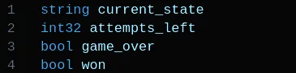


Hang-man - 실습
03
01
▶hangman_interfaces
•
hangman_interfaces/srv/CheckLetter.srv
•
updated_word_state: 현재상태ex) p y _ _ o n 
•
is_correct : 현재user input으로들어온글자가선택된단어내에존재하는지에대한
bool 타입자료형
•
message : 맞았으면“Correct”를띄우고틀리면“WRONG”을띄움


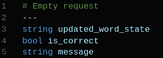


Hang-man - 실습
04
01
▶hangman_interfaces
•
hangman_interfaces/action/GameProgress.action
•
game_over : 목숨이다소진되었는지
•
won : 게임에서이겼는지(목숨소진이전에정답을맞추었는지)


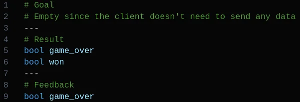


Hang-man - 실습
05
01
▶hangman_game
•
hangman_game/hangman_game/letter
_publisher.py의전체코드


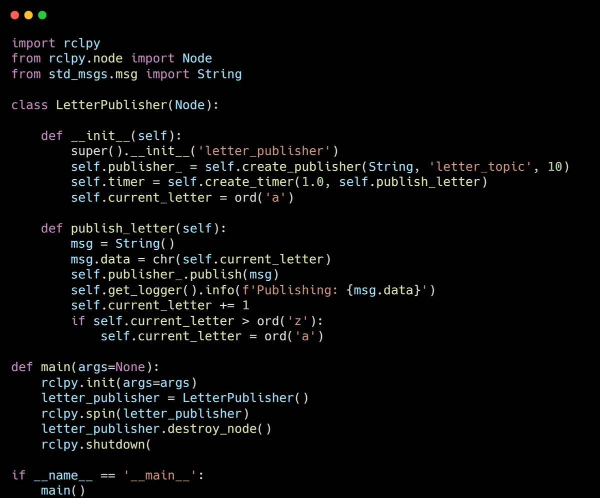


Hang-man - 실습
06
01
▶hangman_game
•
hangman_game/hangman_game/word
_service.py의전체코드


Hang-man - 실습
07
01
▶hangman_game
•
hangman_game/hangman_game/word
_service.py의전체코드


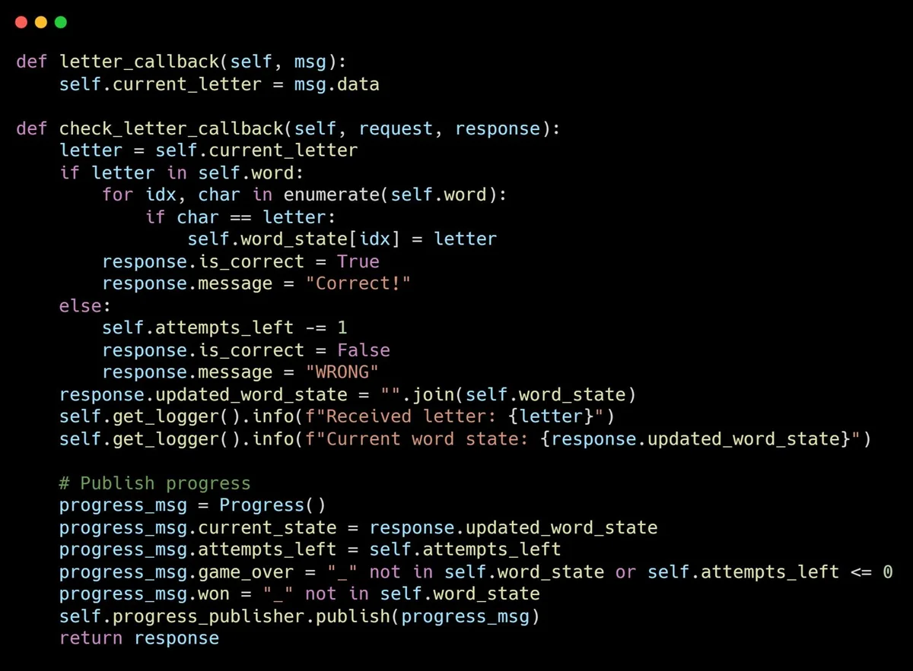


Hang-man - 실습
08
01
▶hangman_game
•
hangman_game/hangman_game/word
_service.py의전체코드


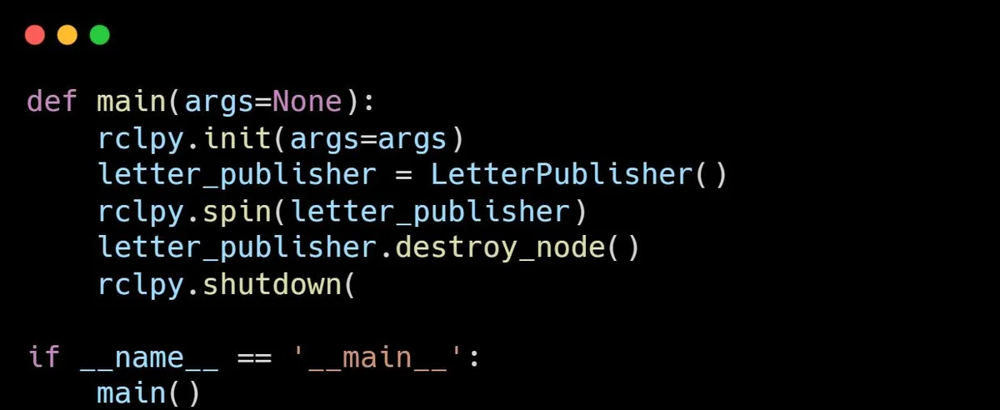


Hang-man - 실습
09
01
▶hangman_game
•
hangman_game/hangman_game/user_
input.py 전체코드


Hang-man - 실습
10
01
▶hangman_game
•
hangman_game/hangman_game/
progress_action_client.py 전체코드


Hang-man - 실습
11
01
▶hangman_game
•
hangman_game/hangman_game/
progress_action_client.py 전체코드


Hang-man - 실습
12
01
▶hangman_game
•
hangman_game/hangman_game/ 
progress_action_server.py 전체코드


Hang-man - 실습
13
01
▶hangman_game
•
hangman_game/hangman_game/ 
progress_action_server.py 전체코드


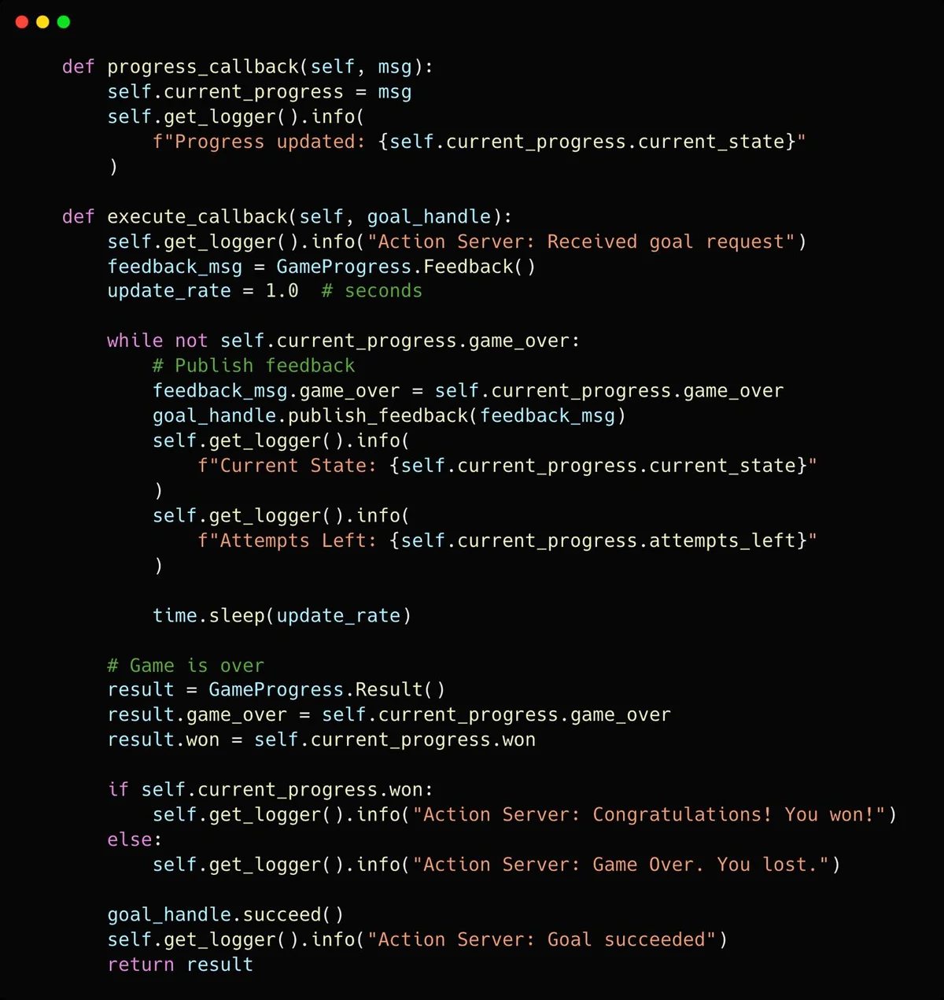


Hang-man - 실습
14
01
▶hangman_game
•
hangman_game/hangman_game/
progress_action_server.py 전체코드


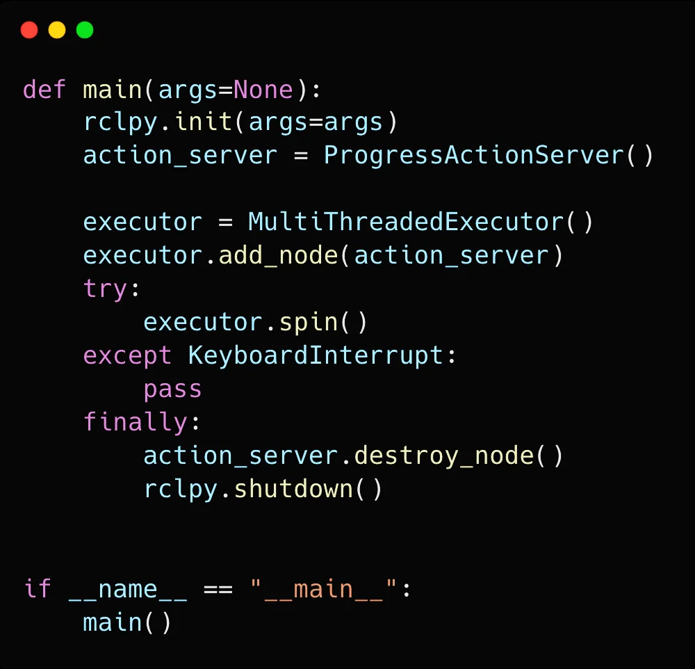


Hang-man - 실습
15
01
▶hangman_game
•
hangman_game/setup.py
•
entry_points를다음과같이변경


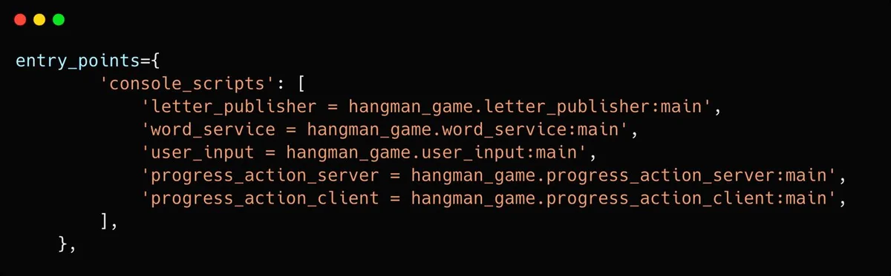


Hang-man - 실습
16
01
▶hangman_game
•
hangman_interfaces/CMakeLists.txt


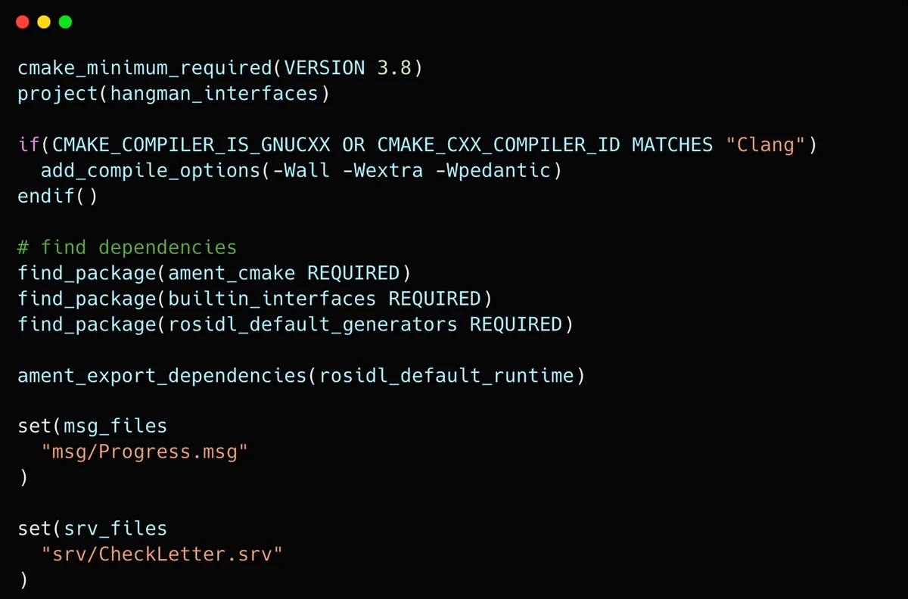


Hang-man - 실습
17
01
▶hangman_game
•
hangman_interfaces/package.xml


02
18
Executor
ROS2계층구조
▶ROS2 계층구조
1. User code : 사용자가작성한코드
2. rcl : 클라이언트라이브러리로, 사용자코드와미들웨어를연결
3. rmw : 미들웨어와클라이언트간의인터페이스역할. 미들웨어와의
상호작용을추상화
4. rmw adapter : RMW와미들웨어를연결하는중간계층역할. 이를
통해ROS2는특정DDS 구현체에종속되지않고, 다양한미들웨어를
지원할수있는유연성을가짐
5. Middleware : 실제메시지전달과QoS 설정을처리하는계층
•
미들웨어: 분산네트워크에서애플리케이션또는구성요소간에하나이상
의종류의통신또는연결을가능하게하는소프트웨어. ROS2에서는노드간
의메시지송수신및이벤트처리를담당


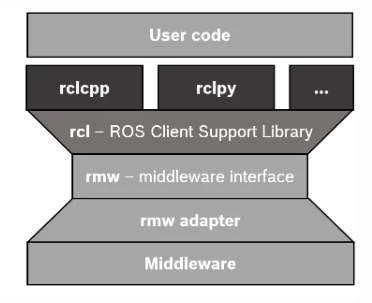


02
19
Executor
Executor 동작과정
▶동작과정
1. wait : 미들웨어에메시지가도착할때까지대기
2. take : 새로운메시지도착시, 해당메시지를가져옴. 이과
정에서미들웨어에저장된메시지가클라이언트로전달됨
3. execute : 메시지처리를위한콜백함수(onGoal, nextCmd, 
processOdom) 실행


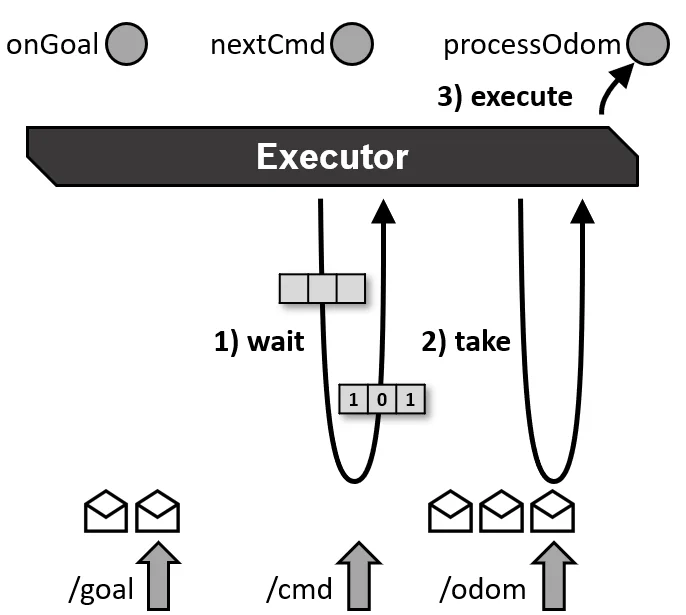


02
20
Executor
Executor의종류
▶SingleThreadedExecutor : 단일스레드에서콜백을실행
•
하나의스레드만사용하여이벤트를처리하므로, 콜백이완료될때까지다른작업을처리할수
없음
•
주로처리속도가중요한것이아니거나, 콜백이충돌하지않도록하기위해단일스레드환경에
서사용
▶StaticSingleThreadedExecutor : 단일스레드에서정적으로콜백을실행
•
정적단일스레드실행자는구독, 타이머, 서비스서버, 액션서버등의노드구조를스캔하는런타임
비용을최적화
•
노드가추가될때콜백스캔을한번만수행되며, 다른두Executer는이러한변화를정기적으로스캔
•
정적단일스레드실행자는초기화중에모든구독, 타이머등을생성하는노드와함께사용해야함


02
21
Executor
Multi Thread Executor
▶MultiThreadedExecutor : 여러스레드에서콜백을병렬로실행
•
여러스레드가동시에실행되기때문에복잡한작업이나멀티태스킹환경에서유리
•
그러나다중스레드간의자원경쟁이나동기화문제가발생할수있으므로, 적절한
동기화처리(locking) 필요


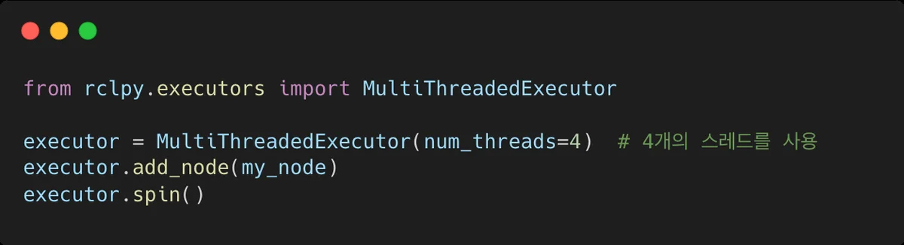


02
22
Executor
Executor 기본동작
▶Executor 동작순서
1. 이벤트감지: 노드에서수신된토픽, 서비스요청, 타이머이벤트등을감지
2. 콜백큐생성: 이벤트가발생할때마다대응하는콜백을큐(queue)에수집
3. 콜백실행: 큐에있는콜백을적절한순서대로실행. SingleThreadedExecutor는하나씩
처리하고, MultiThreadedExecutor는병렬로처리


02
23
Executor
Executor 사용예
▶Executor 사용예
•
SingleThreadedExecutor를사용하는간단한퍼블리셔노드
•
이벤트는1초마다발생하여메시지를퍼블리싱


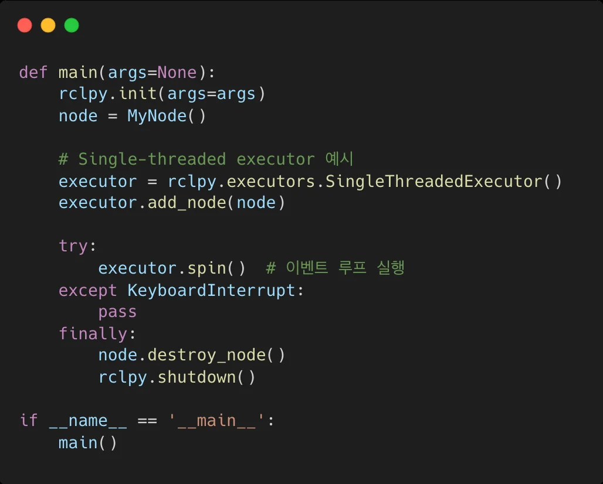


02
24
Executor
Executor 와spin 차이점
▶Executor 와spin 차이점
Executor
spin()
역할
콜백관리및실행
이벤트루프실행
설명

노드에포함된콜백(토픽, 서비스, 타이머등)을관리하고, 
이벤트가발생하면적절한콜백을실행하는역할수행

SingleThreadedExecutor와MultiThreadedExecutor
같은다양한종류가있으며, 콜백을실행하는방식에따라
동작방식이달라짐

Executor가이벤트를처리하는루프를실행

spin()이호출되면노드는콜백이발생하기를기다리며, 
이벤트가감지될때콜백을실행

Executor가동작할수있는환경을유지하는루프이며, 
명시적으로종료하거나프로그램이종료될때까지계속실행


02
25
Executor
Executor 와spin 의관계
▶관계
•
Executor는콜백을처리하는"관리자"이고, spin()은해당Executor가콜백을계속해서
처리하도록하는"루프"
•
Executor는콜백을실행하는규칙과방식을정의하고, spin()은그규칙에따라Executor
가동작하도록해주는실행메커니즘
SingleThreadedExecutor + spin(): 한번에하나의콜백만처리
MultiThreadedExecutor + spin(): 여러콜백을동시에처리
▶멀티스레드와의연관성
•
spin()을사용하면Executor가콜백을처리하는동안계속해서대기하지만, 
MultiThreadedExecutor를사용하면여러콜백을동시에병렬로처리할수있음
•
이때도spin()을호출하여이벤트루프가유지되지만, 여러스레드가동시에동작하면
서여러콜백을병렬처리가능


03
26
ROS2 bag 이해및사용법
명령어
▶BAG 파일레코딩
•
다음명령어는“topic_name”에서수신되는메시지를“my_bag.bag”라는이름의BAG 
파일에레코딩함
▶BAG 파일재생
•
다음명령어는“my_bag.bag”라는이름의BAG 파일을재생함
▶BAG 파일정보표시
•
다음명령어는“my_bag.bag”라는이름의BAG 파일의정보를표시함


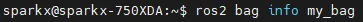


BAG 파일만들기
27
04
▶세번째터미널에서다음명령어를이용하여저장되어있는BAG 파일재생
•
간혹인터럽트등의이유로turtle의궤적이기록당시와정확히일치하지않을수있음
•
이문제를방지하려면turtle의움직임을기록할때, 각명령이완전히완료된후다음명령을
실행해야함
실습


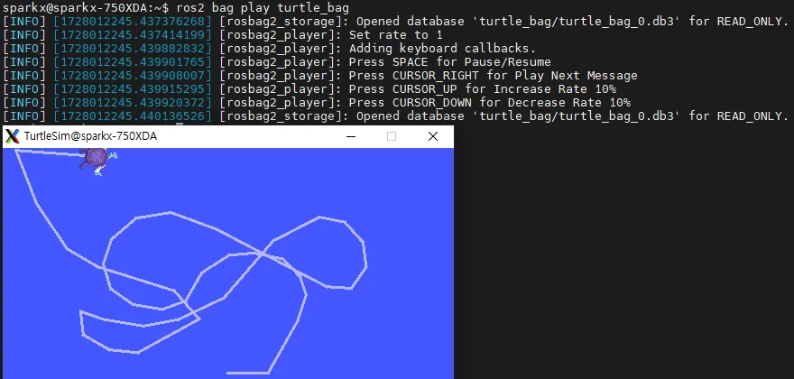


BAG 파일실습
28
04
▶BAG 파일에기록된2d 카메라정보불러오기
•
아래제공된링크에서rosbag2_video.tar.gz 파일을다운로드받은후압축풀기
https://drive.google.com/drive/folders/1zjGVRD5YQkiM_yLwjGOGRF5cruz8-Wsn
•
다운로드된압축파일의압축풀기
실습


BAG 파일실습
29
04
▶BAG 파일에기록된2d 카메라정보불러오기
•
압축풀린bag 파일의정보확인
•
Bag 파일반복재생
실습


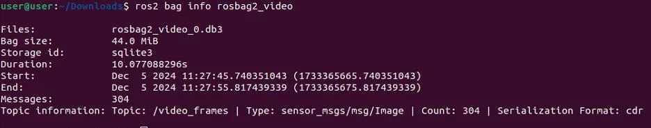


BAG 파일실습
30
04
▶BAG 파일에기록된2d 카메라정보불러오기
•
새로운터미널에서rviz 실행
실습


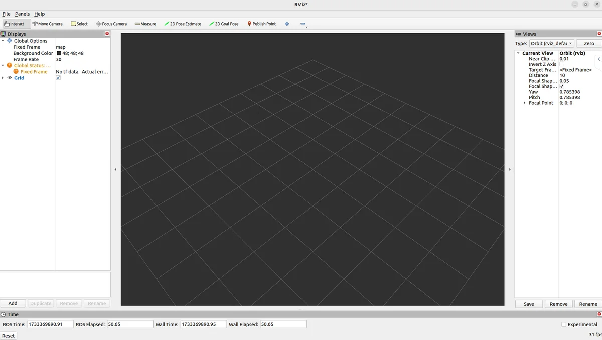


BAG 파일실습
31
04
▶BAG 파일에기록된2d 카메라정보불러오기
•
Rviz에서add버튼을누른후Image 선택후OK 버튼누르기
실습


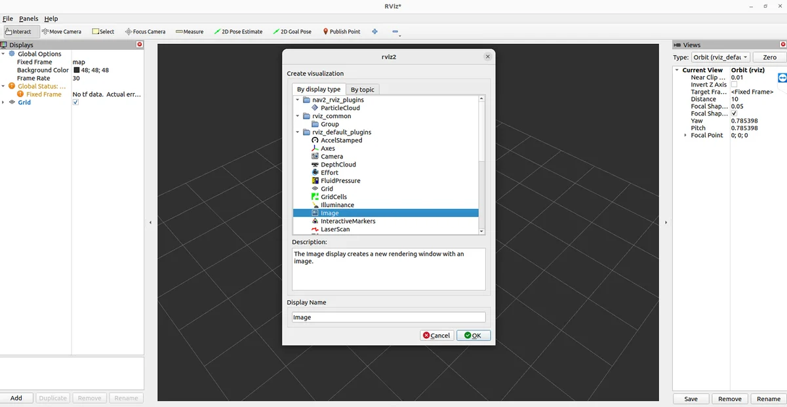


BAG 파일실습
32
04
▶BAG 파일에기록된2d 카메라정보불러오기
•
사이드바에서이미지의topic name을“＼video_frames”
로바꾸기
•
하단의Image 창에영상이재생되는것을확인
영상출처: https://www.youtube.com/watch?v=29iFysOZg3Q
실습


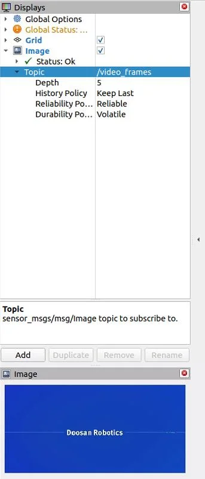


33
▶Visual Studio Code - extension
05
Jupyter를이용한프로그래밍
VSCode에서Jupyter 사용
•
Extension의주요역할및기능
•
프로그래밍언어지원추가: 추가언어를지원하거나기존언어의기능을확장
(예: Python, YAML등)
•
생산성향상도구: 코딩, 탐색, 리팩토링, 반복작업을자동화해생산성향상
(예: XML Tools, Markdown All in One)
•
특정기술또는프레임워크지원: 특정프레임워크나기술을위한추가기능제공
(예: ROS, URDF)
•
자동화및DevTools: 반복작업을자동화하거나개발환경을확장(예: Colcon Tasks)


34
▶Visual Studio Code - extension
06
프로그래밍응용
Service 와Action 에서의Client  차이
항목
Service Client
Action Client
목적
요청-응답1회성호출
장시간작업의관리
단계수
1단계(call_async)
3단계(send_goal_async → Go
alHandle → get_result_async)
중간상태
없음
진행상태(feedback), 취소등
처리가능
.result() 위치
call_async 후future에서
get_result_async 후future에
서
피드백처리
불가
가능(feedback_callback)
쓰임새
빠른계산요청(예: IK)
장기제어작업(예: 궤적추종)


---

## Jupyter Notebooks


### 9차시_1_ROS2_API함수정리

[](https://colab.research.google.com/github/OWNER/study-site/blob/main/notebooks/ros/jupyter_ros/9차시_1_ROS2_API함수정리.ipynb)

**ROS 2 Humble**에서 자주 사용하는 **Topic, Service, Action** 관련 Python API 함수들을 정리한 노트.

개발할 때 빠르게 참고할 수 있도록 요약.

### Topic 관련 함수
#### 퍼블리셔(Publisher)


```python
publisher = self.create_publisher(MsgType, 'topic_name', qos_profile)
publisher.publish(msg)
```

- `create_publisher(MsgType, topic_name, qos_profile)`: 퍼블리셔 생성
- `publish(msg)`: 메시지 전송

#### 서브스크라이버(Subscriber)


```python
self.subscription = self.create_subscription(
    MsgType,
    'topic_name',
    self.callback,
    qos_profile)
```

- `create_subscription(MsgType, topic_name, callback, qos_profile)`: 서브스크라이버 생성
- `callback(msg)`: 수신 메시지 처리 함수

### Service 관련 함수
#### 클라이언트(Client)


```python
self.cli = self.create_client(SrvType, "service_name")

# 서비스 요청 준비
req = SrvType.Request()
req.param = value

# 서버가 준비될 때까지 대기
while not self.cli.wait_for_service(timeout_sec=1.0):
    self.get_logger().info("Waiting for service...")

# 요청 보내기
future = self.cli.call_async(req)
future.add_done_callback(response_callback)
```

- `create_client(SrvType, service_name)`: 서비스 클라이언트 생성
- `SrvType.Request()`: 요청 메시지 생성
- `call_async(req)`: 비동기 요청

- cli.call_async()는 ROS 2에서 서비스 클라이언트가 비동기적으로 서비스 요청을 보낼 때 사용하는 메서드입니다.
- cli.call_async(req)는 서비스 서버에 요청을 보내고, 결과를 기다리는 Future 객체를 반환합니다.
- 결과는 나중에 add_done_callback()이나 spin_until_future_complete()로 받습니다.

#### Service Request(서비스 요청)

서비스 클라이언트 + add_done_callback()


```python
future = cli.call_async(req)
future.add_done_callback(response_callback)
```

핵심 요약
```bash
항목	         설명
call_async(req)	비동기 서비스 호출, Future 반환
반환값	Future 객체 (future.result()로 결과 얻음)
처리 방법	rclpy.spin_once() 루프 안에서 future.done() 체크
```

#### Service 서버(Server)


```python
self.srv = self.create_service(SrvType, 'service_name', self.callback)
```

- `create_service(SrvType, service_name, callback)`: 서비스 서버 생성
- `callback(request, response)`: 요청 처리 함수
- `response.param = value` → 응답 내용 설정

| 역할       | 서버                                | 클라이언트                          |
|------------|-------------------------------------|-------------------------------------|
| 생성       | `create_service()`                  | `create_client()`                  |
| 요청 핸들링 | `callback(request, response)`       | `req = Request(); call_async(req)` |
| 응답 전송   | `return response`                   | `future.result()`로 결과 받음       |
| 필드 설정   | `response.param = value`            | `req.param = value`                |


### Action 관련 함수
#### 액션 클라이언트(Action Client)


```python
self._action_client = ActionClient(self, ActionType, "action_name")

# 서버 대기
self._action_client.wait_for_server()

# goal 생성
goal_msg = ActionType.Goal()
goal_msg.param = value

# goal 전송
self._send_goal_future = self._action_client.send_goal_async(
    goal_msg, feedback_callback=self.feedback_callback
)

# 결과 기다리기
self._send_goal_future.add_done_callback(self.goal_response_callback)
```

- `ActionClient(self, ActionType, action_name)`: 액션 클라이언트 생성
- `send_goal_async(goal_msg, feedback_callback)`: 목표 전송
- `goal_response_callback(future)`: 응답 처리
- `feedback_callback(feedback_msg)`: 피드백 수신 처리
- `get_result_async()`: 결과 요청

액션 클라이언트 + send_goal_async()


```python
goal_future = action_client.send_goal_async(goal_msg)
goal_future.add_done_callback(goal_response_callback)
```

```bash
add_done_callback(fn)	Future가 완료될 때 호출할 함수를 등록
fn(future)	콜백 함수는 future 객체를 인자로 받음
쓰임새	비동기 서비스/액션 결과 처리
```

액션 클라이언트 실행 흐름
```bash
send_goal_async(goal_msg)
        └──> feedback_callback() ← 피드백 받을 때마다 호출
        └──> goal_response_callback(future)
                  └──> get_result_async()
                          └──> get_result_callback(future)
```

콜백 예시 전체 코드


```python
def goal_response_callback(future):
    goal_handle = future.result()
    if not goal_handle.accepted:
        print('❌ Goal was rejected')
        return

    print('✅ Goal accepted')
    result_future = goal_handle.get_result_async()
    result_future.add_done_callback(get_result_callback)

def get_result_callback(future):
    result = future.result().result
    print(f'🎉 Result: {result.sequence}')

goal_future = action_client.send_goal_async(goal_msg)
goal_future.add_done_callback(goal_response_callback)
```

#### 액션 서버(Action Server)


```python
self._action_server = ActionServer(
    self,
    ActionType,
    'action_name',
    self.execute_callback,        # execute 단계에서 실행됨
    goal_callback=self.on_goal,   # goal 도착시 실행
)
```

- `ActionServer(self, ActionType, action_name, execute_callback)`: 액션 서버 생성
- `execute_callback(goal_handle)`: goal 처리 함수
  - 내부에서 `goal_handle.publish_feedback()`으로 피드백 전송
  - `goal_handle.succeed()` 또는 `goal_handle.abort()`
  - `return result` 로 결과 전달

액션 서버 콜백

여기서도 결국 executor가:

1. goal이 오면 → wait

2. goal을 DDS에서 → take

3. self.on_goal(goal_request) 실행 → execute

이 줄은 ROS 2의 액션 서버를 구현할 때 필요한 핵심 클래스와 상수를 임포트하는 구문


```python
from rclpy.action import ActionServer, GoalResponse, CancelResponse
```

```bash
ActionServer	액션 서버를 생성하는 클래스. 노드 안에서 특정 액션 타입을 처리할 수 있게 만듦
GoalResponse	goal을 수락할지, 거부할지를 나타내는 상수 (ACCEPT, REJECT)
CancelResponse	클라이언트가 요청한 goal 취소 요청에 대해 응답하는 상수 (ACCEPT, REJECT)
```

```bash
GoalResponse 상수
GoalResponse.ACCEPT
GoalResponse.REJECT
CancelResponse 상수
CancelResponse.ACCEPT
CancelResponse.REJECT
```

```bash
 rclpy.spin(node)을 호출하면:

while rclpy.ok():
    # 1. wait: DDS WaitSet으로부터 이벤트 기다림
    # 2. take: 누가 publish한 메시지 등 도착함
    # 3. execute: 등록된 콜백 함수 실행
```

#### 참고용 예시 메시지 타입
- Topic: `std_msgs.msg.String`, `sensor_msgs.msg.Image`
- Service: `example_interfaces.srv.AddTwoInts`
- Action: `example_interfaces.action.Fibonacci`

### ROS 2에서의 goal_handle

goal_handle은 action 서버가 클라이언트로부터 받은 목표(goal)에 대해 추적 및 상태를 관리하기 위해 사용하는 객체입니다.

작동 흐름 요약

1. 클라이언트가 send_goal_async(goal_msg)로 goal 전송

2. 서버는 execute_callback(goal_handle) 호출

3. 서버는 goal_handle.request를 통해 전달된 goal 내용을 읽음

동작 흐름
```bash
Client                        Server
  │                             │
  ├── send_goal_async() ──────▶│
  │                             │
  │        Future (goal_handle) │
  ├◀───────────────────────────┤
  │                             │
  ├─ goal_handle.get_result_async() ──▶ (결과 기다림)
  ```

goal_handle에서 자주 쓰는 속성과 메서드
```bash
속성/메서드	설명
goal_handle.request	클라이언트가 보낸 goal 요청 내용
goal_handle.accepted	이 goal이 수락되었는지 여부
goal_handle.publish_feedback(feedback_msg)	클라이언트에 피드백 보내기
goal_handle.succeed()	goal이 정상적으로 완료됨을 알림
goal_handle.abort()	goal 수행 중 실패를 알림
goal_handle.canceled()	클라이언트가 goal을 취소했음을 알림
goal_handle.is_cancel_requested	클라이언트가 취소 요청을 했는지 확인
ActionServer	액션 서버 생성 클래스
goal_callback	goal을 수락할지 거절할지 결정
cancel_callback	클라이언트가 goal을 취소하려고 할 때 처리
execute_callback	실제 작업 수행 / 피드백 보내고 결과 반환

```

예제 흐름 (서버에서)


```python
def goal_callback(self, goal_request):
    self.get_logger().info(f"Goal received: {goal_request}")
    return GoalResponse.ACCEPT

def cancel_callback(self, goal_handle):
    self.get_logger().info("Cancel request received.")
    return CancelResponse.ACCEPT

async def execute_callback(self, goal_handle):
```


### 9차시_2_주피터노트북_사용시_주의사항

[](https://colab.research.google.com/github/OWNER/study-site/blob/main/notebooks/ros/jupyter_ros/9차시_2_주피터노트북_사용시_주의사항.ipynb)

## 주피터 노트북으로 ROS2 사용시 주의해야할 사항들 정리
#### rclpy 초기화/종료
ROS 2 Python 노드를 작성할 때


```python
rclpy.init()
node = rclpy.create_node('my_node')
rclpy.spin(node)
node.destroy_node()
rclpy.shutdown()
```

#### Jupyter에서는 이렇게 나눠서 실행


```python
import rclpy
from rclpy.node import Node
```


```python
rclpy.init()
```


```python
class MyNode(Node):
    def __init__(self):
        super().__init__('my_node')
        self.get_logger().info('Node initialized!')

node = MyNode()
```

#### 콜백이 있다면 spin 필요


```python
rclpy.spin(node)
```

#### 종료 시점에 수동으로


```python
node.destroy_node()
rclpy.shutdown()
```

 rclpy.spin()은 블로킹이기 때문에, Jupyter에서는 rclpy.spin_once()를 주기적으로 호출하는 방식이 더 적합할 수 있음 (아래 예시 참고)

그다음 셀에서


```python
import time
for _ in range(10):
    rclpy.spin_once(node)
    time.sleep(1.0)
```

####Publisher/Subscriber 사용

퍼블리셔 예시


```python
from std_msgs.msg import String

publisher = node.create_publisher(String, 'chatter', 10)

msg = String()
msg.data = 'Hello from Jupyter!'
publisher.publish(msg)
```

서브스크라이버 예시


```python
def callback(msg):
    print(f"Received: {msg.data}")

subscriber = node.create_subscription(String, 'chatter', callback, 10)
```

launch나 lifecycle 관련 노드 실행은 피하거나 별도로

Launch file 기반으로 실행되는 복잡한 노드는 Jupyter에서 직접 실행하기 어렵기 때문에, 

ROS Launch로 띄우고 Jupyter에서 통신만 하는 식이 더 적합

### 요약: Jupyter에서 ROS 2 노드 실행 체크리스트

- ROS 환경 활성화	setup.bash source 후 jupyter lab 실행
- rclpy.init()/shutdown() 수동 관리	셀 분리해서 실행
- rclpy.spin() 대신 spin_once() + loop	인터랙티브 실행 가능
- 블로킹 함수 주의	spin()은 막히기 때문에 반복문으로 대체
- 타이머/퍼블리셔/서브스크라이버는 가능	대부분 잘 작동
- launch 파일은 별도로 실행	Jupyter에서는 통신 위주로 활용


### 9차시_3_cam_실행

[](https://colab.research.google.com/github/OWNER/study-site/blob/main/notebooks/ros/jupyter_ros/9차시_3_cam_실행.ipynb)

ROS 2 Humble - 카메라 이미지 퍼블리셔 & 서브스크라이버

사용 메시지 타입: sensor_msgs/msg/Image

이미지 처리 라이브러리: cv_bridge, OpenCV

카메라 데이터: 직접 캡처(OpenCV) 또는 실제 카메라 노드 사용 가능

ros2 pkg create --build-type ament_python my_cam_pubsub --dependencies rclpy sensor_msgs cv_bridge

1. 퍼블리셔 노드 (카메라 데이터 publish)

2. 서브스크라이버 노드 (카메라 데이터 수신)

설치 필요 패키지

```bash
sudo apt install ros-humble-cv-bridge python3-opencv
```

setup.py 수정

console_script 에 아래내용 추가
```bash
'cam_pub = my_cam_pubsub.cam_pub:main',
'cam_sub = my_cam_pubsub.cam_sub:main',
```

#### colcon build 실행

```bash
colcon build --symlink-install --packages-select my_cam_pubsub 

source install/setup.bash
```

#### 실행 명령어(터미널 3개 열고실행)

```bash
ros2 run my_cam_pubsub cam_pub

다른 Terminal 에서

ros2 run my_cam_subsub cam_sub

rqt 에서 Image 출력력

rviz 에서 Image 출력
```

### 테스트 순서
- 퍼블리셔 노드 실행 (카메라 영상 송출)
- 서브스크라이버 노드 실행 (영상 수신 및 출력)
- rqt 실행
- image view 시청


### 9차시_4_hangman_api_list

[](https://colab.research.google.com/github/OWNER/study-site/blob/main/notebooks/ros/jupyter_ros/9차시_4_hangman_api_list.ipynb)

## hangman_game/letter_publisher.py


```python
self.publisher_ = self.create_publisher(String, 'letter_topic', 10)
self.timer = self.create_timer(1.0, self.publish_letter)
```

letter_topic이라는 이름의 토픽을 만들고, std_msgs/msg/String 타입의 데이터를 퍼블리시할 퍼블리셔 객체 생성

10: 큐 사이즈 (토픽 메시지 버퍼 용량)

1초마다 self.publish_letter()를 실행하는 타이머 생성


```python
msg = String()
msg.data = chr(self.current_letter)
self.publisher_.publish(msg)
```

현재 알파벳 문자를 메시지에 담아 letter_topic으로 퍼블리시

## hangman_game/word_service.py


```python
self.service = self.create_service(CheckLetter, "check_letter", self.check_letter_callback)
self.subscription = self.create_subscription(String, "letter_topic", self.letter_callback, 10)
self.progress_publisher = self.create_publisher(Progress, "progress", 10)
```

check_letter라는 이름으로 서비스 서버 생성 (요청 받으면 check_letter_callback 실행)

서비스 타입: CheckLetter.srv (예: 문자 체크)

letter_topic을 구독하고, 새로운 메시지가 올 때 letter_callback을 호출함

progress라는 토픽에 퍼블리시할 퍼블리셔 생성 (Progress.msg 타입 사용)


```python
data = Progress()
self.progress_publisher.publish(data)
```

초기 Progress 메시지를 퍼블리시 (ex: 게임 시작 상태)


```python
 # Publish progress
progress_msg = Progress()
progress_msg.current_state = response.updated_word_state
progress_msg.attempts_left = self.attempts_left
self.progress_publisher.publish(progress_msg)
```

서비스 처리 결과(updated_word_state, 남은 시도 수)를 포함해 progress 토픽으로 게임 진행 상황 퍼블리시

## hangman_game/user_input.py


```python
self.cli = self.create_client(CheckLetter, "check_letter")
while not self.cli.wait_for_service(timeout_sec=1.0):
self.get_logger().info("Service not available, waiting...")
self.req = CheckLetter.Request()
```

check_letter 서비스를 호출할 수 있는 클라이언트 생성

서비스 서버가 뜰 때까지 대기 (1초마다 확인)

CheckLetter 서비스의 요청 메시지 인스턴스를 생성


```python
future = self.cli.call_async(self.req)
future.add_done_callback(self.callback_future)
```

비동기 방식으로 서비스 요청을 보내고 결과를 기다리는 Future 객체 반환
서비스 호출이 완료되면 결과 처리를 위한 콜백 등록


```python
response = future.result()
```

Future에서 실제 응답 데이터 추출 (보통 콜백 함수 내에서 사용)

## hangman_game/progress_action_server.py


```python
self._action_server = ActionServer(self, GameProgress, "game_progress", self.execute_callback)
```

game_progress라는 이름의 액션 서버 생성

액션 타입: GameProgress.action

콜백: 목표 수신 시 execute_callback() 실행


```python
self.subscription = self.create_subscription(Progress, "progress", self.progress_callback, 10)
```

progress 토픽을 구독해 게임 진행 상황을 모니터링

#### Action Server 의 주요 정의부(execute_callback함수)


```python
def execute_callback(self, goal_handle):
```

액션 서버에서 클라이언트로부터 goal을 받았을 때 호출되는 함수


```python
feedback_msg = GameProgress.Feedback()
```


```python
goal_handle.publish_feedback(feedback_msg)
```

피드백 메시지를 액션 클라이언트에 전송


```python
goal_handle.succeed()
```

액션 목표가 성공적으로 완료되었음을 알림

## hangman_game/progress_action_client.py


```python
self._action_client = ActionClient(self, GameProgress, "game_progress")
self.send_goal()
```

game_progress 액션 서버에 연결할 액션 클라이언트 생성

goal을 서버로 보낼 함수 호출


```python
self._action_client.wait_for_server()
goal_msg = GameProgress.Goal()
```

서버가 준비될 때까지 대기

액션 목표를 담을 메시지 인스턴스 생성


```python
self._send_goal_future = self._action_client.send_goal_async(goal_msg,feedback_callback=self.feedback_callback)
self._send_goal_future.add_done_callback(self.goal_response_callback)
```

비동기 방식으로 goal 전송, 피드백 수신용 콜백 설정

goal 전송 결과(수락 여부) 처리를 위한 콜백 등록


```python
def goal_response_callback(self, future):
```


```python
goal_handle = future.result()
```

goal 전송 결과에서 goal handle 추출


```python
def goal_response_callback(self, future):
```


```python
self._get_result_future = goal_handle.get_result_async()
self._get_result_future.add_done_callback(self.get_result_callback)
```

목표 결과를 비동기로 요청

목표 처리 결과 수신 시 실행할 콜백 등록


```python
def get_result_callback(self, future):
```


```python
result = future.result().result
```

액션 처리 결과 추출


---

## Code Examples


### `hangman_game/`

[View full source on GitHub](https://github.com/OWNER/study-site/tree/main/source/hangman_game/){ .md-button }

#### `hangman_game/hangman_game/__init__.py`

```python

```

#### `hangman_game/hangman_game/letter_publisher.py`

```python
# hangman_game/letter_publisher.py

import rclpy
from rclpy.node import Node
from std_msgs.msg import String

class LetterPublisher(Node):

    def __init__(self):
        super().__init__('letter_publisher')
        self.publisher_ = self.create_publisher(String, 'letter_topic', 10)
        self.timer = self.create_timer(1.0, self.publish_letter)
        self.current_letter = ord('a')

    def publish_letter(self):
        msg = String()
        msg.data = chr(self.current_letter)
        self.publisher_.publish(msg)
        self.get_logger().info(f'Publishing: {msg.data}')
        self.current_letter += 1
        if self.current_letter > ord('z'):
            self.current_letter = ord('a')

def main(args=None):
    rclpy.init(args=args)
    letter_publisher = LetterPublisher()
    rclpy.spin(letter_publisher)
    letter_publisher.destroy_node()
    rclpy.shutdown()

if __name__ == '__main__':
    main()

```

#### `hangman_game/hangman_game/progress_action_client.py`

```python
# hangman_game/progress_action_client.py

import rclpy
from rclpy.node import Node
from hangman_interfaces.action import GameProgress
from rclpy.action import ActionClient


class ProgressActionClient(Node):

    def __init__(self):
        super().__init__("progress_action_client")
        self._action_client = ActionClient(self, GameProgress, "game_progress")
        self.result_received = False
        self.send_goal()

    def send_goal(self):
        self.get_logger().info("Action Client: Waiting for action server...")
        self._action_client.wait_for_server()
        goal_msg = GameProgress.Goal()
        self.get_logger().info("Action Client: Sending goal request...")
        self._send_goal_future = self._action_client.send_goal_async(
            goal_msg, feedback_callback=self.feedback_callback
        )
        self._send_goal_future.add_done_callback(self.goal_response_callback)

    def feedback_callback(self, feedback_msg):
        feedback = feedback_msg.feedback
        if feedback.game_over:
            self.get_logger().info("Action Client: Game over detected in feedback")

    def goal_response_callback(self, future):
        goal_handle = future.result()
        if not goal_handle.accepted:
            self.get_logger().info("Action Client: Goal rejected")
            self.result_received = True
            return

        self.get_logger().info("Action Client: Goal accepted")
        self._get_result_future = goal_handle.get_result_async()
        self._get_result_future.add_done_callback(self.get_result_callback)

    def get_result_callback(self, future):
        result = future.result().result
        if result.won:
            self.get_logger().info("Action Client: Congratulations! You won!")
        else:
            self.get_logger().info("Action Client: Game Over. You lost.")
        self.result_received = True

# ... (15 more lines)
```


### `hangman_interfaces/`

[View full source on GitHub](https://github.com/OWNER/study-site/tree/main/source/hangman_interfaces/){ .md-button }

#### `hangman_interfaces/srv/CheckLetter.srv`

```text
# Empty request
---
string updated_word_state
bool is_correct
string message

```

#### `hangman_interfaces/action/GameProgress.action`

```text
# Goal
# Empty since the client doesn't need to send any data
---
# Result
bool game_over
bool won
---
# Feedback
bool game_over

```

#### `hangman_interfaces/msg/Progress.msg`

```text
string current_state
int32 attempts_left
bool game_over
bool won

```


### `my_cam_pubsub/`

[View full source on GitHub](https://github.com/OWNER/study-site/tree/main/source/my_cam_pubsub/){ .md-button }

#### `my_cam_pubsub/my_cam_pubsub/__init__.py`

```python

```

#### `my_cam_pubsub/my_cam_pubsub/cam_pub.py`

```python
import rclpy
from rclpy.node import Node
from sensor_msgs.msg import Image
from cv_bridge import CvBridge
import cv2


class CameraPublisher(Node):

    def __init__(self):
        super().__init__("camera_publisher")
        self.publisher = self.create_publisher(Image, "camera/image_raw", 10)
        self.timer = self.create_timer(0.1, self.timer_callback)  # 10Hz
        self.cap = cv2.VideoCapture(0)
        self.bridge = CvBridge()

    def timer_callback(self):
        ret, frame = self.cap.read()
        if not ret:
            self.get_logger().error("Failed to read from camera")
            return

        msg = self.bridge.cv2_to_imgmsg(frame, encoding="bgr8")
        self.publisher.publish(msg)
        self.get_logger().info("Published image")


def main():
    rclpy.init()
    node = CameraPublisher()
    rclpy.spin(node)
    node.cap.release()
    node.destroy_node()
    rclpy.shutdown()


if __name__ == "__main__":
    main()

```

#### `my_cam_pubsub/my_cam_pubsub/cam_sub.py`

```python
import rclpy
from rclpy.node import Node
from sensor_msgs.msg import Image
from cv_bridge import CvBridge
import cv2


class CameraSubscriber(Node):

    def __init__(self):
        super().__init__("camera_subscriber")
        self.subscription = self.create_subscription(
            Image, "camera/image_raw", self.listener_callback, 10
        )
        self.bridge = CvBridge()

    def listener_callback(self, msg):
        frame = self.bridge.imgmsg_to_cv2(msg, desired_encoding="bgr8")
        # cv2.imshow("Camera Feed", frame)
        cv2.waitKey(1)


def main():
    rclpy.init()
    node = CameraSubscriber()
    rclpy.spin(node)
    node.destroy_node()
    rclpy.shutdown()
    # cv2.destroyAllWindows()


if __name__ == "__main__":
    main()

```
