# 강의_3기_ROS2_실습_1_4차시

1
ROS-2 프로그래밍실습
ROKEY BOOT CAMP

ROS2 프로그래밍실습목차
1
주제: ROS2 CLI
▪
ROS2 CLI / CLI 명령종류및사용법
주제: ROS2 심화기능1
▪
신규ROS2 CLI(ros2env.zip)
2
주제: ROS2 심화기능1
▪
Intra-Process Communication
▪
DDS의QoS(Quality of Service) 이해및활용법
주제: ROS2 심화기능1
▪
DDS의QoS(Quality of Service) 이해및활용법
▪
QoS 실습예제(QoS(py_pubsub.zip))
3
주제: ROS2 심화기능2
▪
Component
▪
RQt Plugin 사용법및실습(rqt_example.zip)
주제: ROS2 심화기능2
▪
RQt Plugin 사용법및실습(rqt_example.zip)
4
주제: ROS2 심화기능2
▪
Lifecycle(노드관리)에대한이해및활용법
▪
Security(ROS2의보안)
주제: 시뮬레이션개발
▪
Urdf, tf2
5
주제: 시뮬레이션개발
▪
Gazebo, SLAM, Nav2
주제: 두산로봇과ROS2
▪
ROS2를활용한두산로봇의기본명령어
6
주제: ROS2와OpenCV
▪
OpenCV + ROS2 연동및기능구현
주제: ROS2와OpenCV
▪
Lane detect 구현및ROS2 통합실습
7
주제: ROS2와3차원영상및시각화
▪
Point Cloud 개념이해(2D, 3D RViz)
▪
Open3D
▪
ROS2 정기평가

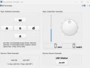

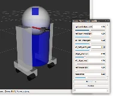

4
ROS-2 프로그래밍실습강의자료
ROKEY BOOT CAMP
1 ~ 4 차시

5
ROS2 CLI
ROS2 신규CLI 작성법
Intra-process communication
QoS
Component
Contents
RQt plugin
Lifecycle
Security

6
ROS2 CLI
(Command Line Interface)

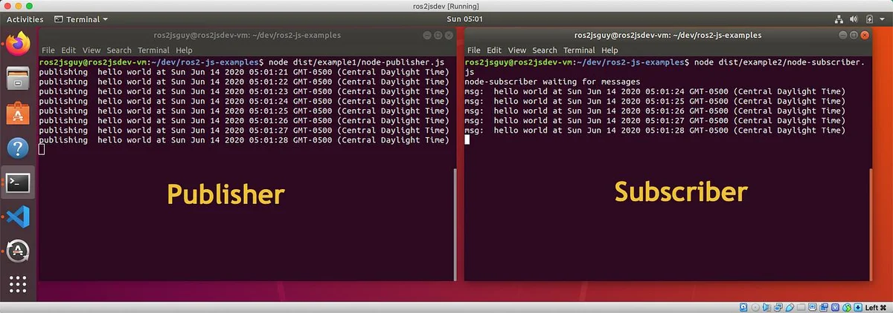

ROS2 CLI 사용법
▪ROS2 CLI 명령어
▪
verbs: 동작을지정하며, 수행할작업의유형을나타냄. run, topic, service등이올수있음
▪
sub-verbs: 특정동작에대한세부동작(sub-verb)을지정함. Verbs가topic인경우pub, echo, list 등이올수있음
▪
options: 명령어의실행방식을설정하는추가파라미터. –h, --node-name, --qos 등이올수있음
▪
arguments: 실행할때필요한인수를지정함. 특정노드의이름이나토픽의이름, 서비스이름등이올수있음
ROS2 CLI
ROS2 CLI사용법

▪ROS2 CLI 명령어
▪
-h 옵션을이용하면verbs, sub-verbs, option등에대하여더자세히알수있음
ROS2 CLI
ROS2 CLI사용법

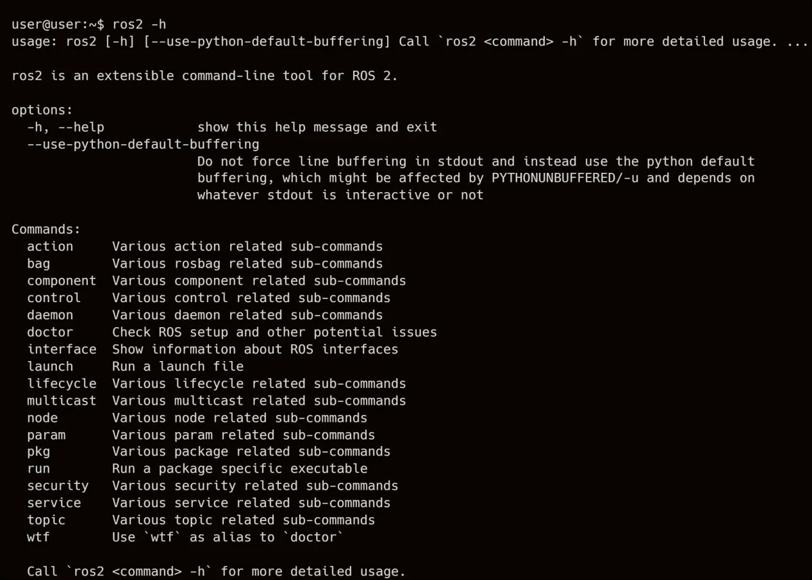

ROS2 CLI 실행명령어
ROS2 CLI
ROS2 CLI실행명령어
▪ROS2 CLI + arguments
ros2cli + [verbs]
[arguments]
기능
ros2 run
<package> <executable>
특정패키지의특정노드실행
(1개의노드)
* executable에따라복수노드도실행가능
ros2 launch
<package> <launch-file>
특정패키지의
특정런치파일실행
(0개~ 복수개의노드)

▪ROS2 CLI + arguments 예시
▪
ROS2에서turtlesim 시뮬레이터를실행하는기본명령어
▪
ROS2의demo_nodes_cpp 패키지에서talker_listener.launch.py 파일을실행
ROS2 CLI
ROS2 CLI실행명령어

ROS2 CLI
ROS2 CLI정보명령어
▪ROS2 CLI + sub-verbs
ros2cli + [verbs]
[sub-verbs]
기능
ros2 pkg
create
새로운ROS2 패키지생성
executables
지정패키지의실행파일목록출력
list
사용가능한패키지목록출력
prefix
지정패키지의저장위치출력
xml
지정패키지의패키지정보파일(xml) 출력
ros2 node
info
실행중인노드중지정한노드의정보출력
list
실행중인모든노드의목록출력
ros2 topic
bw
지정토픽의대역폭측정
delay
지정토픽의지연시간측정
echo
지정토픽의데이터출력
find
지정타입을사용하는토픽이름출력
hz
지정토픽의주기측정
info
지정토픽의정보출력
list
사용가능한토픽목록출력
pub
지정토픽의토픽발행
type
지정토픽의토픽타입출력
ROS2 CLI 정보명령어

ROS2 CLI
ROS2 CLI정보명령어
ros2cli + [verbs]
[sub-verbs]
기능
ros2 service
call
지정서비스의서비스요청전달
find
지정서비스타입의서비스출력
list
사용가능한서비스목록출력
type
지정서비스의타입출력
ros2 action
info
지정액션의정보출력
list
사용가능한액션목록출력
send_goal
지정액션의액션목표전송
ros2 interface
list
사용가능한모든인터페이스목록출력
package
특정패키지에서사용가능한인터페이스목록출력
packages
인터페이스패키지들의목록출력
proto
지정패키지의프로토타입출력
show
지정인터페이스의데이터형태출력
▪ROS2 CLI + sub-verbs

ROS2 CLI
ROS2 CLI정보명령어
▪ROS2 CLI 실습

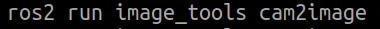

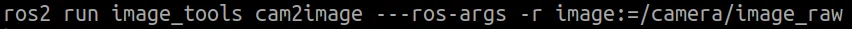

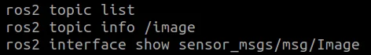

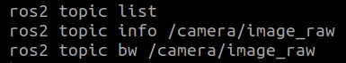

ROS2 CLI
ROS2 CLI정보명령어
ros2cli + [verbs]
[sub-verbs]
기능
ros2 param
delete
지정파라미터삭제
describe
지정파라미터정보출력
dump
지정파라미터저장
get
지정파라미터읽기
list
사용가능한파라미터목록출력
set
지정파라미터쓰기
ros2 bag
info
저장된rosbag 정보출력
play
rosbag 기록
record
rosbag 재생
▪ROS2 CLI + sub-verbs

ROS2 CLI 정보명령어
ROS2 CLI
ROS2 CLI정보명령어
▪ROS2 CLI + sub-verbs 예시
▪
turtlesim 패키지에서실행가능한모든노드및실행파일들을나열
▪
/turtlesim 노드에대한정보를표시함. 노드의이름, 관련된토픽, 서비스및파라미터정보확인가능
(turtlesim 시뮬레이터가실행중이어야함)

ROS2 CLI 기능보조명령어
ROS2 CLI
ROS2 CLI기능정보명령어
▪ROS2 CLI + verbs + sub-verbs
ros2cli + [verbs]
[sub-verbs] (options)
기능
ros2 extensions
(-a)
(-v)
ros2cli의extension 목록출력
(ros2cli개발용으로사용, 일반적사용x)
ros2 extension_points
(-a)
(-v)
ros2cli의extension point 목록출력
(ros2cli개발용으로사용, 일반적사용x)
ros2 daemon
start
daemon 시작
status
daemon 상태보기
stop
daemon 정지
ros2 multicast
receive
multicast 수신
send
multicast 전송
※ CLI 후반부에실습

ROS2 CLI
ROS2 CLI기능정보명령어
▪ROS2 CLI + verbs + sub-verbs
ros2cli + [verbs]
[sub-verbs] (options)
기능
ros2 doctor
hello
(-r)
(-rf)
(-iw)
ROS 설정및네트워크, 패키지버전, rmw 미들웨어등과같은
잠재적문제를확인하는도구
ros2 wtf
hello
(-r)
(-rf)
(-iw)
doctor와동일함
(ros2 doctor의alias)
(WTF: Where's The Fire)
ros2 lifecycle
get
라이프사이클정보출력
list
지정노드의사용가능한상태전이목록출력
nodes
라이프사이클을사용하는노드목록출력
set
라이프사이클상태전환트리거

ROS2 CLI
ROS2 CLI기능정보명령어
ros2cli + [verbs]
[sub-verbs]
기능
ros2 component
list
실행중인컨테이너와컴포넌트목록출력
load
지정컨테이너노드의특정컴포넌트실행
standalone
표준컨테이너노드로특정컴포넌트실행
types
사용가능한컴포넌트들의목록출력
unload
지정컴포넌트의실행중지
ros2 security
create_key
보안키생성
create_keystore
보안키저장소생성
create_permission
보안허가파일생성
generate_artifacts
보안정책파일을이용하여보안키및보안허가파일생성
generate_policy
보안정책파일(policy.xml) 생성
list_keys
보안키목록출력
▪ROS2 CLI + verbs + sub-verbs

ROS2 CLI
ROS2 CLI기능보조명령어
▪ROS2 CLI + verbs + sub-verbs 예시
▪
ROS2에서사용할수있는모든extension들을나열함
▪
ROS2 시스템의상태를진단하고문제를확인하는도구
ROS2 CLI 기능보조명령어

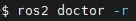

ROS2 CLI
ROS2 CLI실습
▪run은특정패키지의특정노드를실행하는명령어
▪
turtlesim 패키지의turtle_sim node를실행
▪
turtlesim 패키지의turtle_teleop_key를실행
ros2 run

ROS2 CLI
ROS2 CLI실습
▪launch는특정패키지의특정런치파일을실행하는명령어. 복수개의노드실행이나또다른패키지의다른런치
파일을불러와실행가능
▪
turtlesim 패키지의turtle_sim node를실행
▪
ROS2에서demo_nodes_cpp 패키지에포함된talker_listener.launch.py 파일을실행하여두개의노드를동시에시작
ros2 launch

ROS2 CLI
ROS2 CLI실습
▪pkg는지정패키지의정보를얻거나패키지를생성하는데사용되는명령어
▪
ament python 빌드형태의rclpy, std_msgs 패키지에의존성을가진my_ros_pkg 패키지를생성
▪
turtlesim 패키지에포함된실행파일목록을확인
▪
설치된패키지및본인이직접작성한패키지중사용가능한모든패키지의목록을확인
▪
turtlesim 패키지의저장위치를확인
▪
turtlesim 패키지의패키지정보파일(package.xml)을확인
ros2 pkg

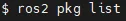

ROS2 CLI
ROS2 CLI실습
▪node는노드의정보를얻는데사용하는명령어
▪
실행중인모든노드의목록을확인
▪
/turtlesim 노드의정보를확인
ros2 node

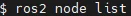

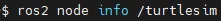

ROS2 CLI
ROS2 CLI실습
▪topic은토픽의구성, 대역폭, 지연시간, 인터페이스형태등의정보를얻거나특정토픽을송신
및수신하는데사용되는명령어
▪
/turtle1/cmd_vel 토픽의대역폭을확인
▪
/turtle1/cmd_vel 토픽의데이터를확인
▪
지정한geometry_msgs/msg/Twist 인터페이스를사용하고있는토픽명을확인
▪
/turtle1/cmd_vel 토픽의주기를확인
ros2 topic
▪
예제가정상적으로동작하기위해서는turtlesim_node와turtle_teleop_key노드가실행되어있어야함
▪
만일아무것도뜨지않을경우turtle_teleop_key를이용해turtle을이동

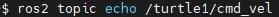

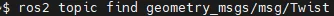

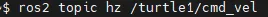

ROS2 CLI
ROS2 CLI실습
▪
/turtle1/cmd_vel 토픽의인터페이스형태, 토픽의퍼블리시및서브스크라이브정보를확인
▪
현재개발환경에서동작중인모든노드들의토픽이름을확인
▪
현재개발환경에서동작중인모든노드들의인터페이스형태와함께토픽이름을확인
▪
/turtle1/cmd_vel 토픽을퍼블리시한다. 테스트용으로주로사용
▪
/turtle1/cmd_vel 토픽의인터페이스형태를확인
예제가정상적으로동작하기위해서는turtlesim_node와turtle_teleop_key노드가실행되어있어야함

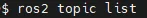

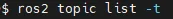

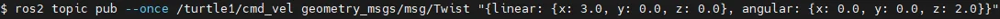

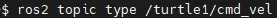

ROS2 CLI
ROS2 CLI실습
▪service는서비스의정보를얻거나직접서비스요청을테스트해볼수있는명령어
▪
turtlesim/srv/SetPen 인터페이스형태를사용하고있는/turtle1/set_pen 서비스를특정값을요청값으로콜
▪
std_srvs/srv/Empty 인터페이스형태의서비스를사용하는서비스명을확인
▪
현재개발환경에서동작중인모든노드들의서비스이름을확인
▪
현재개발환경에서동작중인모든노드들의인터페이스형태와함께서비스이름을확인
▪
/clear 서비스의인터페이스형태를확인
ros2 service

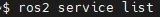

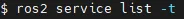

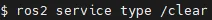

ROS2 CLI
ROS2 CLI실습
▪action은액션의정보를얻거나직접액션목표전달을테스트해볼수있는명령어
▪
turtle1/rotate_absolute 액션을사용하는액션서버및클라이언트노드이름및개수를확인
▪
현재개발환경에서동작중인모든노드들의액션이름을확인
▪
현재개발환경에서동작중인모든노드들의인터페이스형태와액션이름을확인
▪
turtlesim/action/RotateAbsolute 인터페이스형태를사용하는/turtle1/rotate_absolute 액션에특정값으로
액션목표를전달
ros2 action

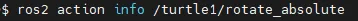

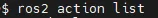

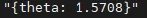

ROS2 CLI
ROS2 CLI실습
▪interface는토픽/서비스/액션에서사용하는인터페이스의정보를얻는데사용되는명령어
▪
현재개발환경의모든msg, srv, action 인터페이스를확인
▪
지정한turtlesim 패키지에포함된인터페이스들을확인
▪
Msg, srv, action 인터페이스를담고있는패키지의목록을확인
▪
지정한geometry_msgs/msg/Twist 인터페이스의기본형태를확인
▪
지정한각메시지의인터페이스및메시지이름을확인
ros2 interface

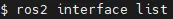

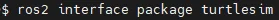

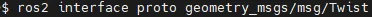

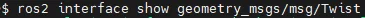

ROS2 CLI
ROS2 CLI실습
▪param은파라미터의정보를확인하고파라미터를설정하거나읽어오는등의일을수행할수있는명령어
▪
사용가능한모든파라미터목록을확인
▪
/turtlesim 노드의background_r 파라미터의값을읽어옴
▪
/turtlesim 노드의background_r 파라미터를250이라는값으로설정
ros2 param

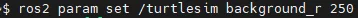

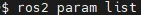

ROS2 CLI
ROS2 CLI실습
▪
파라미터가어떤형태, 목적, 인터페이스형태, 최소/최댓값을갖는지확인
▪
/turtlesim 노드의PARAMETER 1이라는이름을갖는파라미터를삭제(현재는삭제가능한파라미터가없음)
▪
현재폴더에/turtlesim노드의파라미터들을yaml 형태로저장. 특정이름을지정하지않으면지정한노드이름으로파일이생성됨
ros2 param

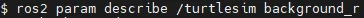

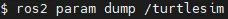

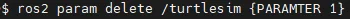

ROS2 CLI
ROS2 CLI실습
▪bag은토픽을저장하거나재생할때사용하는명령어
▪
원하는토픽을‘my_turtle’이라는이름으로저장
▪
모든토픽을저장하고싶다면“-a”옵션사용
▪
‘my_turtle’이라는rosbag 파일의정보를확인
▪
지정한rosbag 파일을재생
ros2 bag

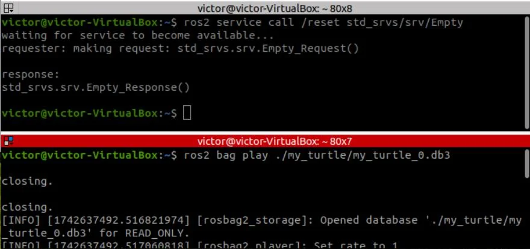

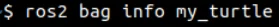

ROS2 CLI
ROS2 CLI실습
▪extensions 명령어는ros2cli 개발용으로사용되는명령어로, ROS2 CLI에추가할수있는확장(extensions) 
목록을보여주고관리하는역할
▪
현재설치된extension의간단한목록을표시
▪
로드에실패했거나호환되지않는extension도표시
ros2 extensions
※ CLI 후반부에실습

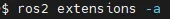

ROS2 CLI
ROS2 CLI실습
▪
extension_points 명령어는ros2cli 개발용으로사용되는명령어로, extension points(확장가능한지점) 목록을보여주는역할
▪
현재사용가능한extension points 목록을표시
ros2 extension_points

ROS2 CLI
ROS2 CLI실습
▪
Daemon은ROS2 도구들의빠른실행을위해도입된툴로주로백그라운드에서실행되는프로그램이나프로세스를말함
▪
ROS2 Daemon 프로세스는노드들을발견하고연결하는역할을하며, 특히다음과같은명령어로관리할수있음
▪
Daemon을시작
▪
Daemon 상태를확인
▪
Daemon을정지
ros2 daemon
▪시스템에서실행중인노드들의정보를유지하고관리하는역할
▪이를통해새로운노드나도구가실행될때, 데몬이기존의노드정보를제공하여탐색
시간을단축시키고시스템의전반적인응답성을향상시킴
▪통신, 관리, 서비스제공등의역할

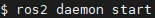

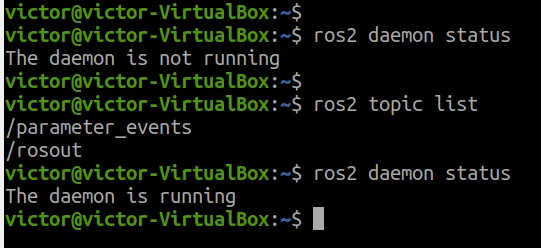

ROS2 CLI
ROS2 CLI실습
▪multicast는ROS2 DDS 테스트용으로나온명령어로Multicast 송/수신테스트에사용되는명령어
▪
단일UDP 멀티캐스트패킷수신(송신된패킷을받기전까지대기함)
▪
단일UDP 멀티캐스트패킷송신(새로운터미널을열어송신시기존터미널에서수신대기중인터미널이패킷을수신함)
ros2 multicast

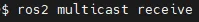

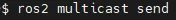

ROS2 CLI
ROS2 CLI실습
▪
doctor는ROS2 설정및네트워크, 패키지버전, RMW 등과같은ROS2 개발환경의잠재적문제를진단및점검하는명령어
▪
네트워크연결확인
▪
-r 옵션은report를의미하며체크한모든아이템을확인함
▪
-rf 옵션은report-fail을의미하며체크할때실패한아이템을확인함
▪
-iw 옵션은include-warnings를의미하며경고성아이템을확인함
ros2 doctor

ROS2 CLI
ROS2 CLI실습
▪wtf는What’s The Fast를의미하며, 성능최적화및데이터전송성능을개선하는도구
▪데이터전송속도, 지연시간, 대역폭사용효율등을개선
▪
네트워크연결확인
▪
-r 옵션은report를의미하며체크한모든아이템을확인함
▪
-rf 옵션은report-fail을의미하며체크할때실패한아이템을확인함
▪
-iw 옵션은include-warnings를의미하며경고성아이템을확인함
ros2 wtf

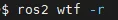

ROS2 CLI
ROS2 CLI실습
▪Lifecycle은노드의수명주기(lifecycle)를관리하는명령어
▪기본적으로노드는4개의상태(state), Unconfigured, Inactive, Active, Finalized로구분
▪
실행중인노드의lifecycle 상태를가져오기
▪
/lc_talker 노드의상태전이가가능한lifecycle 목록을출력
▪
Lifecycle 상태를가지고있는노드목록을출력
▪
/lc_talker 노드의lifecycle 상태를configure 상태로의전환을트리거
ros2 lifecycle
▪
예제를위해다음명령어로lifecycle_talker 예제노드를실행
▪
ros2 run lifecycle lifecycle_talker
※ CLI 후반부에실습
▪unconfigured : 초기상태
▪inactive : 설정은됐지만, 동작은멈춰진상태
▪active : 노드가실제로동작중
▪finalized : 노드가종료되고리소스정리된상태
▪errorprocessing : 에러발생후에러복구중인상태

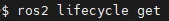

ROS2 CLI
ROS2 CLI실습
▪
Component는여러노드를단일프로세스에서실행하여시스템의효율성과성능을향상시키는방식
▪
컴포넌트의목록조회, 로드, 언로드등의작업을수행할수있음
▪
실행중인컨테이너와컴포넌트목록출력
▪
지정컨테이너노드의특정컴포넌트실행
▪
표준컨테이너노드로특정컴포넌트실행
▪
사용가능한컴포넌트들의목록출력
▪
지정컴포넌트의실행중지
ros2 component
▪컴포넌트노드는여러노드를하나의프로세스내에서실행할수있도록설계된ROS2의기능
▪이를통해노드간의통신오버헤드를줄이고, 시스템의자원활용을최적화할수있음
▪이러한방식을**컴포지션(Composition)**이라고함
※ CLI 후반부에실습

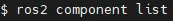

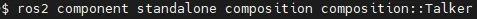

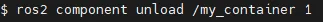

ROS2 CLI
ROS2 CLI실습
▪
Security는SROS의유틸리티로, DDS-Security를ROS2에서사용하기위해필요한도구를모아둔것
ros2 security
▪
ros2 security는ROS 2에서보안기능을설정하고관리하는명령어
▪
ROS 2는DDS (Data Distribution Service)를기반으로하지만기본적으로보안이비활성화
▪
이를활성화하려면SROS 2 (Secure ROS 2) 및DDS-Security 표준을사용해야함.
▪
보안기능을활성화하면인증(Authentication), 암호화(Encryption), 액세스제어(Access Control) 등의기능을사용할수있음
[ ROS 2 보안기능활용예시]
1) 자율주행로봇데이터보호
▪
카메라, LiDAR 센서데이터를암호화하여보호
▪
외부에서허가되지않은노드가데이터를읽거나수정하지못하도록설정
2) 산업용로봇시스템보안
▪로봇제어명령을허가된노드에서만보낼수있도록제한
▪공장네트워크에서보안이유지되도록암호화된통신사용
3) 클라우드연동IoT 시스템보안강화
▪클라우드에서ROS 2 기반로봇과안전하게통신
▪TLS 및DDS 보안프로토콜을적용하여외부공격으로부터보호
※ CLI 후반부에실습

ROS2 CLI의빠른실행
ROS2 CLI의빠른실행
▪홈폴더(~/)의.bashrc 파일에자주사용하는ROS2 CLI 명령어를단축명령어로지정해두면특정ROS2 
CLI를빠르게실행가능
▪~/.bashrc 파일에아래명령어를추가
alias
※ 터미널창2개이상띄우고
source ~/.bashrc 해보기

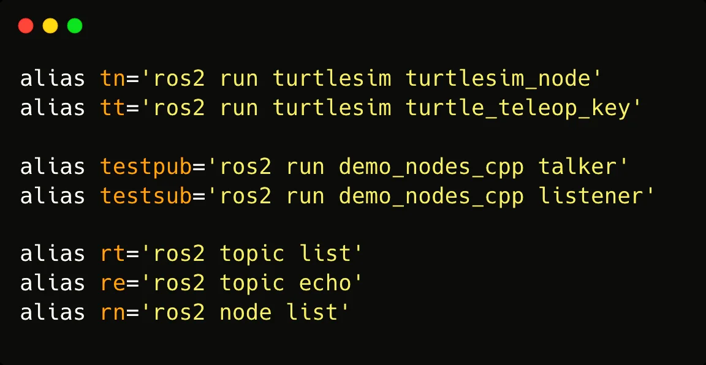

ROS2 CLI의빠른실행
ROS2 CLI의빠른실행
▪홈폴더(~/)의.bashrc 파일에자주사용하는ROS2 CLI 명령어를단축명령어로지정해두면특정ROS2 
CLI를빠르게실행가능
▪
~/.bashrc 파일을저장한다음현재셀세션에설정을적용
▪
앞서지정한단축키를이용하여명령어를빠르게사용가능
alias

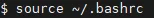

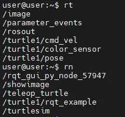

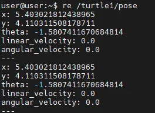

CLI에서arguments 사용하기
CLI에서arguments 사용하기
▪
ROS arguments는주로run 또는launch 명령어와같은ROS2 실행명령어와함께사용되며“--ros-args” 옵션을통해지정
▪
많이사용되는ROS arguments
▪
-r __ns:=사용할네임스페이스
▪
-r __node:=변경할노드이름
▪
-r 본래의토픽/서비스/액션명:=변경할이름
▪
-p 파라미터이름:=변경할파라미터값
▪
--params-file 파라미터파일
ROS arguments

CLI에서arguments 사용하기
CLI에서arguments 사용하기
▪아래와같은설정으로파라미터설정
▪네임스페이스: /tutorial
▪변경할노드이름: my_turtle
▪turtle1/cmd_vel을cmd_vel로퍼블리시되도록수정
▪background_b 파라미터를0으로변경
ROS arguments 예제

CLI에서arguments 사용하기
CLI에서arguments 사용하기
[ TURTLESIM 1마리상태에서rqt_graph 이후앞페이지command 실행후rqt_graph확인

CLI에서arguments 사용하기
CLI에서arguments 사용하기
▪yaml 파일로파라미터재설정
▪
아래와같은yaml파일생성
▪
yaml파일의설정을이용하여turtlesim 실행
ROS arguments 예제

CLI에서arguments 사용하기
CLI에서arguments 사용하기

신규ROS2 cli 작성법
신규ROS2 cli 작성법
▪앞에서ROS2 CLI 명령어의개념, 사용법및종류에대해학습하였음
▪지금부터는새로운ROS2 CLI 명령어를생성하는방법을탐구하고자함
소개

▪
ros2 env라는기존에없던ROS2 CLI를만들기
신규ROS2 cli 작성법
※ 필요한파일: ros2env.zip

✓실행예제
1. ros2 폴더의src폴더로이동하여ros2env 패키지생성
2. ros2env 폴더로이동하여vscode 실행
3. ros2env 폴더안에command 폴더생성후env.py 파일과__init__.py 파일생성
VS Code

Build 하고실행해보기
DOMAIN_ID 바꿔서실행해보기

✓실행예제– env.py
1. env.py: 인터페이스(CLI)에서확장기능을추가하는EnvCommand 클래스를정의
CLI의“env” 메인명령을정의( $ros2 env list or $ros2 env set)

✓실행예제– env.py
2. add_arguments 함수
▪
파서(parser)에서브명령어를동적으로추가하여확장가능한구조를만듦
ros2env.verb는서브커맨드들이모여있는python Module 경로임
▪ros2env.verb.list
▪ros2env.verb.set

✓실행예제– env.py
3. add_subparsers_on_demand 함수
▪ROS2 CLI(Command Line Interface)에서서브명령어(보통
'verb'라불림)를필요에따라동적으로로드하고추가하는역할을함
▪ros2env.verb아래에서플러그인(verb)를찾고인스턴스화하고
argparse의subparser로등록해주는함수
[ 주요인자]
▪parser: 메인명령어의파서객체. 이파서객체에서브명령어를추가하여명령어
라인에서사용할수있도록함
▪
cli_name: CLI 도구의이름을문자열로전달(ros2 env 같은상위명령어이름)
▪
attribute_name(_verb): 서브명령어(verb)의이름을속성으로사용하여이
속성을기준으로실행할명령어를결정
▪
module_name(ros2env.verb ): 서브명령어(verb) 구현이들어있는모듈의이름
▪
required: 서브명령어가필수인지여부를결정. False로설정할경우서브
명령어가없을때기본적으로도움말이출력됨
ros2env.verb로부터필요한시점에서command를가져옴

✓실행예제– env.py
4. main 메서드
▪
서브명령어가주어지지않은경우도움말을출력하고, 주어진경우해당서브명령어의main 메서드를호출하여실행
ros2 env list나ros2 env set에서list와set
args._verb에사용자가입력한하위명령어(verb)가들어옴. 서브커맨드입력여부검사
만약사용자가서브커맨드를입력하지않았다면help 출력

✓실행예제– list.py
1. verb폴더생성후안에list.py파일생성

✓실행예제– list.py
2. list.py: ros2env 패키지의일부로, ROS2 환경변수들을출력하는ListVerb 클래스를정의
ros2 env –r
ros2 env –d
ros2 env –a

✓실행예제– list.py
3. code import
▪
get_all_env_list, get_dds_env_list, get_ros_env_list : 각각모든환경변수, DDS 관련
환경변수, ROS 관련환경변수를반환하는함수들
▪
VerbExtension: ROS2 CLI 명령어확장기능을제공하는기본클래스
* DDS: 네트워크에연결된여러장치들이데이터를주고받을수있게해주는통신기술
※ 왜ros2env.api 모듈로별도분리해서사용하는지확인해보자!!!

✓실행예제– list.py
4. ListVerb 클래스
▪
ros2env와관련된명령어로환경변수를리스트로출력할수있는기능을제공

✓실행예제– list.py
5. add_arguments 함수
▪
ros2 list 명령어를실행할때사용할수있는옵션을정의
▪-a, --all: 모든환경변수를출력하도록설정하는플래그
▪-r, --ros-env: ROS 관련환경변수만출력하도록설정하는플래그
▪-d, --dds-env: DDS 관련환경변수만출력하도록설정하는플래그
▪각옵션은action="store_true"로설정되어, 명령어에옵션을포함할경우
True 값을가지며, 그렇지않을경우False 값을가짐
▪help 매개변수는각옵션의설명을제공하여ros2 list --help로명령어에
대한도움말을볼때사용됨

✓실행예제– list.py
6. main 메서드
▪
명령어실행의main 로직을담당
▪
args 인자로전달된옵션값에따라특정환경변수리스트를가져옴
7. 예시사용법
▪
모든환경변수출력: ros2 list –a
▪
ROS 관련환경변수출력: ros2 list –r
▪
DDS 관련환경변수출력: ros2 list -d
▪
args.ros_env가True일경우, get_ros_env_list() 함수를
호출하여ROS 관련환경변수를가져옴
▪
args.dds_env가True일경우, get_dds_env_list() 함수를
호출하여DDS 관련환경변수를가져옴
▪
두옵션모두False일경우(즉, --all 옵션이거나아무옵션도
사용하지않은경우), get_all_env_list()를호출하여모든
환경변수를가져옴

✓실행예제– api/__init__.py
1. api 폴더생성후__init__.py 파일생성

✓실행예제– api/__init__.py
1.
__init__.py: ROS2와관련된환경변수를읽고설정

✓실행예제– api/__init__.py
2. get_ros_env_list 함수
▪
ROS2와관련된환경변수인ROS_VERSION, ROS_DISTRO, ROS_PYTHON_VERSION 값을가져옴
▪
os.getenv() 함수를사용하여각환경변수를읽어옴
▪
세환경변수를문자열로포맷팅하여반환

✓실행예제– api/__init__.py
3.
get_dds_env_list 함수
▪
이함수는DDS와관련된환경변수인ROS_DOMAIN_ID와RMW_IMPLEMENTATION 값을가져옴
▪
ROS2에서DDS를설정하기위한역할을함
▪
환경변수값이없을경우'None'을반환하도록하여, 존재여부를확인
* RMW_IMPLEMENTATION: ROS2가데이터를주고받을때어떤방식을사용할지정하는환경변수

✓실행예제– api/__init__.py
4.
get_all_env_list 함수
▪
이함수는앞서설명한get_ros_env_list()와get_dds_env_list()를호출하여, 모든ROS 및DDS 관련환경변수를가져옴
▪
두함수의반환값을결합하여모든환경변수를하나의문자열로반환

✓실행예제– api/__init__.py
5. set_ros_env 함수
▪
이함수는env_name과env_value라는두인자를받아해당환경변수를설정
▪
os.environ 딕셔너리에값을직접할당하여환경변수를설정하며, os.getenv()로설정된값을다시확인하여반환
▪
환경변수설정후반환값을통해변수명과설정된값을문자열형태로확인가능

✓실행예제– set.py
1. 이전에만들어두었던verb 폴더안에set.py 파일생성

✓실행예제– set.py
2.
set.py: ros2env 패키지를사용하여ROS2 Humble에서환경변수를설정하고출력하는기능을제공

✓실행예제– set.py
3.
code import
▪
get_all_env_list: 모든ROS와DDS 관련환경변수를가져오는함수. 환경변수를조회하여현재설정상태확인가능
▪
set_ros_env: 특정ROS 환경변수를설정하는함수. 환경변수의이름과값을입력하여새로운설정가능
▪
VerbExtension: ROS2 CLI 확장명령어를구현하기위한기본클래스. 이클래스는ros2 <verb>와같은형식으로명령어를확장할
수있도록지원하며, ROS2 Humble에서SetVerb 명령어를추가하는데사용됨

✓실행예제– set.py
4.
SetVerb 클래스
▪
ROS 환경변수를설정하는데사용되는클래스로, VerbExtension을상속받아ROS2 명령어확장을구현함

✓실행예제– set.py
5.
add_arguments 함수
▪
ROS2 명령어에필요한옵션과인수를정의
▪
parser.add_argument() 함수를통해두개의필수인자를추가
✓
env_name: 설정할환경변수의이름을입력. ROS_VERSION, ROS_DISTRO 등의변수명이해당됨
✓
value: 환경변수에설정할값. 사용자가ros2 set <env_name> <value> 형식으로입력한값이여기에전달됨
▪
help 매개변수는각인자의설명을제공. ros2 set --help 명령어로실행됨

✓실행예제– set.py
6.
main 함수
▪
실행의주로직을담당하는함수. args 인자로전달된env_name과value 값을사용하여특정ROS 환경변수를설정
▪
env_name 또는value 값이있는경우에만환경변수를설정
•
환경변수설정: set_ros_env(args.env_name, args.value) 함수가호출되어해당환경변수에값을설정
▪
get_all_env_list() 함수를호출하여모든환경변수의현재상태를가져오고, [Current ROS environment variable]: 메시지와함께출력

✓실행예제– verb/__init__.py
1. verb 폴더안에__init__.py 파일생성

✓실행예제– verb/__init__.py
2.
__init__.py: ROS2 Humble에서env 명령어에대한확장포인트를정의하기위한파일로ROS2 CLI 
확장을위한기본템플릿으로사용됨

✓실행예제– verb/__init__.py
3.
code import
▪
PLUGIN_SYSTEM_VERSION: 현재사용중인ROS2 CLI 플러그인시스템의버전을나타냄
▪
satisfies_version: 플러그인시스템의버전과확장의버전이호환되는지검사하는함수. 특정버전규칙을
따르는지확인하여, 버전불일치로인한오류를방지

✓실행예제– verb/__init__.py
4.
VerbExtension 클래스
▪
ROS2 CLI 확장시스템에서명령어확장을위한기본클래스로사용됨
▪
NAME : 확장의이름을설정할때사용되는속성
▪
EXTENSION_POINT_VERSION : 이확장이구현하는확장포인트의버전

✓실행예제– verb/__init__.py
5.
__init__ 함수
▪
satisfies_version 함수를사용해현재플러그인시스템버전이EXTENSION_POINT_VERSION과
호환되는지확인
6. add_arguments 함수
▪
ROS2 명령어에필요한인자들을정의하기위한메서드. 기본클래스에서는비어있으며, 구체적인확장에서
필요에따라이메서드를오버라이드하여구현함

✓실행예제– verb/__init__.py
7.
main 함수
▪
각명령어확장에서반드시구현해야하는메서드로, 명령어의주요로직을수행하는함수
▪
기본클래스에서는NotImplementedError를발생시켜
이메서드가반드시하위클래스에서오버라이드되어야함을알림

✓복습Override(Object Oriented Programming)
Override란?
▪상속받은부모클래스(슈퍼클래스)의메서드를, 자식클래스(서브클래스)에서다시정의함
▪자식클래스에서상속받은메서드를내스타일로다시작성하는것
Override가필요한이유?
▪부모클래스는일반적/ 공통적인기능을정의
▪자식클래스는특수화/ 구체적인기능을하고싶을때
▪코드재상용성을높이고, 다형성(Polymorphism)도구현
다형성? 하나의인터페이스(메서드이름)가여러형태로동작하는것

✓복습Override vs Overload
※ C++, Java에서는Overload지원하나Python에서는엄밀하게보면지원하지않으나source code내에서분기하는형태로구현가능

✓복습interface와추상클래스
Interface란?
▪이런기능들을갖춘객체여야한다고선언
▪어떤기능을구현해야하는지약속만정해놓은것
Interface가필요한이유?
▪여러개발자가같은시스템안에서다양한기능을추가
▪개발자각자의방식으로메서드이름, 동작방식정한다면?
▪코드재사용, 일정규모이상프로젝트협업필수!!!
구현체
구현체
※ Python에서는interface keyword가없으며대신추상클래스를사용
※ Interface는규칙(틀)만제공하나추상클래스는틀+ 기본기능제공

✓실행예제– setup.py
1. setup.py의entry_points를아래와같이수정
env라는이름으로ros2env/command/env.py 파일안의EnvCommand 클래스를등록(ros2 env 명령이동작)
extention_point 등록. ros2env/verb.py파일안의VerbExtention클래스를연결. Verb가어떤인터페이스를사용하는지알려줌
서브명령어(verb)를등록하는부분. ros2env/verb/list.py와ros2env/verb/list.py 2개클래스. ros2 env list와ros2 env set 입력가능

✓실행예제– setup.py
2. 터미널을열어패키지를빌드하고, 새로빌드된패키지를사용
3. 아래명령어들을실행하여제대로빌드가되었음을확인

86
Intra-Process Communication

▪ROS는복수개의node를사용하여개발이이루어짐
▪단일컴퓨팅시스템에서복수개의node 사용시
▪데이터통신을위한작업으로인한전체적인성능저하및메모리사용량증가하는단점
▪ROS2에서는이를해결하기위해IPC(Intra-Process Communication)제공
▪예, 모바일로봇: 라이다데이터노드, 모터제어노드, 로봇위치추종노드, 경로생성노드등......
Intra-process communication
Intra-process communication

▪ROS에서서로다른프로세스의아이디를확인해보면명확히다른것을확인가능
Intra-process communication

Intra-process communication
▪
서로다른프로세스는송수신되는데이터가여러번메모리에복사되어성능저하가발생
두노드간의일반적인데이터흐름
이과정에서여러번의메모리복사가발생하며,
특히대용량데이터(이미지, LiDAR 포인트클라우드등) 전송시
메모리사용량증가와성능저하발생
[ 기본적인데이터복사]
일반적으로ROS 2에서노드간에데이터를전달할때, 메시지는다음과같은단계를거침
1. 퍼블리셔가메시지를생성
▪사용자가메시지를생성하면, 해당데이터가메모리에서특정주소에저장됨
2. DDS 미들웨어를통한데이터전달
1.
ROS2는DDS(Data Distribution Service)를사용하여메시지를전달함
2.
일반적인DDS 구현에서는데이터를네트워크버퍼또는공유메모리로복사하여송신함
3. 구독자가데이터를수신
1.
수신된데이터는다시사용자프로그램의메모리로복사됨
2.
여러개의구독자가존재할경우, 각구독자에게별도로복사됨

▪
IPC를이용하면복수개의노드를단일프로세스에서처리하여해당문제를해결
Intra-process communication
zero-copy
[ Zero-Copy란? ]
데이터복사를최소화하여성능을최적화하는기술
ROS 2에서는Fast DDS SHM (Shared Memory) 및Cyclone DDS Iceoryx 등의DDS 미들웨어에서지원
[ Zero-Copy 방식의데이터흐름]
1. 퍼블리셔가메시지를생성하면, 데이터가공유메모리(SHM, Shared Memory)에저장됨
2. DDS는데이터를네트워크로전송하지않고, 같은프로세스또는동일한머신내의구독자들에게참조방식으로전달
3. 구독자는데이터를복사없이직접참조하여사용함
4. 즉, 데이터가한번만생성되고여러구독자가이를직접읽을수있어메모리복사가필요없음

Intra-process communication
프로세스1개
▪노드2개(Producer, Consumer)가1개프로세스에있음
▪publisher →subscriber
▪메모리복사없이빠르게메시지전달(메모리주소)
메시지address 1개
https://github.com/ros2/demos/tree/humble/intra_process_demo/src
https://github.com/ros2/demos/tree/humble/intra_process_demo/src

Intra-process communication
Topic1
Topic2
pipe1
노드
pipe2
노드
publishing
subscribing
publishing
subscribing
메시지address 1개

▪다음명령어를이용하여이미지파이프라인을실행
Image pipeline demo
Intra-process communication
이예제는총3개노드로구성되어있음
▪
camera_node : OpenCV 라이브러리를이용하여카메라입력값을받아
sensor_msg::msg::Image 메시지타입으로publishing해주는역할
▪
watermark_node : camera_node에서publishing하는이미지를
subscribing하고이미지에text추가하여publishing
▪
Image_view_node : camera_node에서publishing하는이미지를
subscribing하여cv::imshow를통해보여줌
camera_node
watermark_node
image_view_node
camera_node
watermark_node
image_view_node

▪
첫번째터미널은모두같은pid와동일한주소값
Intra-process communication
Image pipeline demo
pid는process id의약자로컴퓨터에서실행중인
각프로세스를구별하기위해부여된고유한번호
▪
두번째터미널은camera_node와watermark_node는같은프로세스에서zero-copy로이미지송수신하지만,
image_view_node는다른프로세스에서실행되며참조하는메모리주소도다름
camera_node
watermark_node
image_view_node

96
QoS
(Quality of Service)

QoS
DDS의QoS
DDS의서비스품질(QoS, Quality of Service)
▪QoS(Quality of Service)란쉽게말해‘데이터통신옵션’
▪ROS2는TCP 방식과UDP 방식을선택적으로사용가능
▪
TCP: 신뢰성(Reliability) 중심
▪
UDP: 속도중심
▪이를위해ROS2에서는DDS의QoS 도입
▪
퍼블리셔또는서브스크라이버선언시QoS를매개변수로지정하여원하는통신방식설정가능
▪
QoS로바꿀수있는것은데이터전송시실시간성(real time) 설정관련부분, 대역폭옵션, 데이터지속성, 중복성등이있음

DDS의QoS
QoS의종류
▪현재DDS에서설정가능한QoS 항목으로는22가지가있음
▪대표적인QoS 항목
▪
Reliability : ROS2에서는신뢰도를우선(reliable)으로설정하거나통신속도최우선(best effort)으로설정
▪
History : 정해진크기만큼데이터를보관하는기능(=depth)
▪
Durability : 데이터수신하는서브스크라이버가생성되기전, 데이터의사용유무를설정
▪
Deadline : 정해진주기내데이터의발신및수신이없는경우이벤트함수실행
▪
Lifespan : 정해진주기내수신되는데이터에만유효판정, 이외데이터는삭제
▪
Liveliness : 정해진주기내노드또는토픽의생사를확인
QoS의종류

History
DDS의QoS
ROS2에서사용하는QoS 옵션
▪Values
▪예시
History
데이터를몇개나보관할지결정하는QoS 옵션
KEEP_LAST
정해진메시지큐사이즈(depth) 만큼데이터보관
- depth: 메시지큐사이즈(KEEP_LAST 설정일경우에만유효)
KEEL_ALL
모든데이터보관(최대사이즈는DDS 벤더마다다름)

Reliability
DDS의QoS
ROS2에서사용하는QoS 옵션
▪Values
▪예시
Reliability
신뢰성또는속도우선설정
BEST_EFFORT
데이터송신에집중. 전송속도를중시하며네트워크에따라유실발생가능성
RELIABLE
데이터수신에집중. 신뢰성중시하며유실발생시재전송을통해수신보장

Durability
DDS의QoS
ROS2에서사용하는QoS 옵션
▪Values
▪예시
Durability
데이터수신하는서브스크라이버가생성되기전, 데이터의사용유무를설정
TRANSIENT_LOCAL
Subscription이생성되기전데이터도보관(Publisher에만적용가능)
VOLATILE
Subscription이생성되기전데이터는무효

Deadline
DDS의QoS
ROS2에서사용하는QoS 옵션
▪Values
▪예시
Deadline
정해진주기내데이터의발신및수신이없는경우이벤트함수실행
deadline_duration
Deadline을확인하는주기

Lifespan
DDS의QoS
ROS2에서사용하는QoS 옵션
▪Values
▪예시
Lifespan
정해진주기내수신되는데이터에만유효판정, 이외데이터는삭제
lifespan_duration
Lifespan을확인하는주기

Liveliness
DDS의QoS
ROS2에서사용하는QoS 옵션
▪Values
▪예시
Liveliness
정해진주기내노드또는토픽의생사를확인
liveliness
자동또는매뉴얼로확인할지지정하는옵션(3가지중선택)
(AUTOMATIC, MANUAL_BY_NODE, MANUAL_BY_TOPIC)
lease_duration
Liveliness를확인하는주기

rmw_qos_profile
DDS의QoS
rmw_qos_profile 사용과유저QoS 프로파일사용
▪
RMW QoS Profile: ROS2의RMW에서가장많이사용하는QoS 설정을하나의세트로표현한것
▪
목적에따라Default, Sensor Data, Service, Action Status, Parameters, Parameters Events의6가지로구분
Default
Sensor Data
Service
Action Status
Parameters
Parameter
Events
Reliability
RELIABLE
BEST_EFFORT
RELIABLE
RELIABLE
RELIABLE
RELIABLE
History
KEEP_LAST
KEEP_LAST
KEEP_LAST
KEEP_LAST
KEEP_LAST
KEEP_LAST
Depth
(History)
10
5
10
1
1000
1000
Durability
VOLATILE
VOLATILE
VOLATILE
TRANSIENT
LOCAL
VOLATILE
VOLATILE

DDS의QoS
DDSVendor Directory
▪
1989년에설립된국제표준화기구
▪
분산시스템, 모델링언어, 미들웨어등다양한표준을개발및관리
▪
대표적인표준중하나가DDS(Data Distribution Service)
The DDS Foundation Announces 20th Anniversary of the DDS
Object Management Group Publishes Anything-As-A-Service Glossary
https://www.omg.org
https://www.dds-foundation.org
▪
OMG가만든미들웨어통신표준
▪
실시간성, 높은신뢰성, 확장성
▪
로봇뿐만아니라항공우주, 국방, 자동차, 산업자동화등다양한분야활용
ROS2] ros2 topic list
로떠야할
 
topic
이뜨지않는
 
 
error(+ daemon
의역할
 
)
▪
ROS1에서의통신인프라관련한계점과문제점(네트워크확장성, 신뢰성부족)
▪
OMG가표준화한DDS를기본통신프로토콜로채택
▪
ROS2의Publisher, Subscriber 통신, 서비스호출, 액션서버등저수준통신이DDS기반으로작동
▪
DDS구현체들위에RMW(ROS Middleware Interface)라는추상화레이어
▪
이로인해다양한DDS Vendor를선택할수있음
▪
선택한이유: 다양한QoS, 멀티캐스트, P2P통신, 보안(암호화, 인증), 실시간성, 다양한상용/오픈소스구현체존재
https://docs.ros.org
eProsima: Middleware, Robots and AI
https://www.eprosima.com
Eclipse Cyclone DDS 0.11.0 documentation — Eclipse Cyclone DDS, 0.11.0
https://cyclonedds.io
RTI Connext DDS Community · GitHub
https://www.rti.com

DDS의QoS
DDS& QoS
DDS
(Data Distribution Service)
QoS
(Quality of Service)
개념
▪ROS2 기본통신미들웨어로중앙서버없이분산네트워크에서데이터를교환
▪DDS는ROS2의기본통신프로토콜
▪DDS통신의품질을조정하는설정으로, 메시지신뢰성, 내구성, 저장개수등을관리
▪DDS를통해통신품질을조정하는방식
▪QoS설정에따라DDS의동작방식이달라지며각애플리케이션에맞는성능을최적화
▪네트워크환경과응용프로그램의요구사항에따라적절한QoS를설정해야함
특징
실시간데이터교환을위한미들웨어표준, ROS2의통신기반이되는핵심기술
▪QoS 주요설정6종류
Reliability(신뢰성), Durability(내구성), History(데이터저장개수),
Lifespan(수명), Deadline(데드라인), Liveliness(활성상태)
기타
▪Publisher-subscriber 모델
▪Brokerless(중앙서버없음)
▪자동발견(Discovery) :  네트워크상의노드들이서로를자동으로인식하고연결
▪신뢰성& 확장성: 다양한QoS 설정을통해신뢰성과성능을조절
▪BEST_EFFORT + VOLITILE : 카메라영상스트리밍(실시간성우선, 일부프레임손실가능)
▪RELIABLE + TRANSIENT_LOCAL : 로봇센서데이터(정확한수신보장, 최신데이터유지)
▪KEEP_LAST(10 + LIFESPAN(5s) : 5초동안최신10개의데이터를유지하는센서데이터
RTI Connext DDS Community · GitHub

rmw_qos_profile
DDS의QoS
rmw_qos_profile 사용과유저QoS 프로파일사용
▪
예를들어, 센서와같이지속성이높으며순간적으로데이터를빠르게전달해야하는경우아래와같이설정

rmw_qos_profile
DDS의QoS
rmw_qos_profile 사용과유저QoS 프로파일사용
▪실제파이썬코드에서사용은다음과같이'qos_profile_sensor_data' 모듈을import하여사용함

유저QoS 프로파일
DDS의QoS
rmw_qos_profile 사용과유저QoS 프로파일사용
▪사전정의한rmw_qos_profile 이외에도유저가직접설정하여새로운프로파일을만들어사용가능
▪아래와같은QoS 모듈을import
▪코드에서'QoSProfile'을선언하여원하는옵션을커스텀하게설정

유저QoS 프로파일
DDS의QoS
rmw_qos_profile 사용과유저QoS 프로파일사용
▪다음'create_publisher'와같은함수를사용할때'rmw_qos_profile' 대신유저가정의한커스텀
QoS 프로파일을매개변수로사용
▪유저QoS 프로파일을사용하는것이커스터마이징에용이하기때문에, 실제개발시더많이사용됨

QoS programming
▪
Topic, Service, Action의QoS 설정
⇢예제코드중심의QoS 프로그래밍코드분석
※ 필요한파일: py_pubsub_qos.zip

Topic
QoS Programming
Topic, Service, Action의QoS 설정
▪Topic의기본QoS 설정은RMW QoS Profile의기본설정과동일
▪
즉, Reliability는RELIABLE , History는KEEP_LAST에Depth = 10을따르며Durability는VOLATILE이기본
▪배포한패키지ex_calculator의예시를보면다음과같음
▪
ex_calculator/ex_calculator/arithmetic/argument.py

Service
QoS Programming
Topic, Service, Action의QoS 설정
▪ROS2 Service의경우, 특별한케이스외에는기본QoS 사용
▪/opt/ros/humble/local/lib/python3.10/dist-packages/rclpy/node.py →line 1436~1444

Service
QoS Programming
Topic, Service, Action의QoS 설정
▪qos_profile_services_default는RMW의qos_profiles과types.h 헤더파일에서확인할수있음
▪/opt/ros/humble/include/rmw/rmw/qos_profiles.h →line 64

QoS Programming
Topic, Service, Action의QoS 설정

Service
QoS Programming
Topic, Service, Action의QoS 설정
▪qos_profile_services_default는RMW의qos_profiles과types.h 헤더파일에서확인할수있음
▪/opt/ros/humble/include/rmw/rmw/types.h

Action
QoS Programming
Topic, Service, Action의QoS 설정
▪액션은토픽과서비스를모두사용하는복합형태
▪
액션토픽의경우qos_profile_services_default를기본설정
▪
피드백퍼블리셔의경우QoSProfile (depth = 10) 혹은rmw_qos_profile_default를초기값으로사용
▪
액션상태퍼블리셔의경우, 전용프로파일인qos_profile_action_status_default를기본값으로사용
▪
파이썬의경우, goal_service_qos_profile, result_service_qos_profile, cancel_service_qos_profile, 
feedback_pub_qos_profile, status_pub_qos_profile에대한기본설정을사용
▪/opt/ros/humble/local/lib/python3.10/dist-packages/rclpy/action/server.py

Action
QoS Programming
Topic, Service, Action의QoS 설정
▪/opt/ros/humble/local/lib/python3.10/dist-packages/rclpy/action/server.py

실습
QoS Programming
QoS 실습
▪6가지QoS에대해실습
▪
ROS2에서기본적으로제공하는데모QoS를이용하여, QoS 설정값변화에따른결과를확인할수있음
1.
History
2.
Reliability
3.
Durability
4.
Deadline
5.
Lifespan
6.
Liveliness

History
QoS Programming
QoS 실습
▪데이터전송시점이후보관할데이터의정책을설정하는옵션
▪KEEP_LAST: Depth로설정한만큼사이즈의데이터보관(최근몇개까지만저장)
▪KEEP_ALL: 모든데이터보관(시스템메모리한도까지)
▪제공된'py_pubsub' 코드를활용하여History QoS 설정실습
▪Publisher와Subscriber의QoS 프로파일값을변경
메시지를몇개까지버퍼에저장할지를설정하는옵션

✓py_pubsub/src/publisher_member_function.py 설정
▪Repository 생성
▪qos_ws/src 폴더를만든후해당폴더로이동
▪제공된코드파일의압축풀기

✓py_pubsub/src/publisher_member_function.py 설정
▪QoS profile 변경
▪
Publisher에는QoS(Quality of Service) 프로파일의기본값으로rmw_qos_profile_default로사용
▪
'create_publisher'의3번째인자에10을넣어주면, depth가10인기본프로파일'QoSProfile(depth=10)'이입력되는구조

✓py_pubsub/src/publisher_member_function.py 설정
▪QoS profile 변경
▪History의값을KEEP_LAST로변경하고싶다면, 다음과같이작성
▪KEEP_ALL로변경하고싶다면
ros_tutorials

✓py_pubsub/src/publisher_member_function.py 설정
▪QoS profile 변경
▪작성한QoS profile을적용하려면, create_publisher 부분에작성한qos_profile을인자로전달
▪이번예제에서는History 값을KEEP_ALL로설정하여테스트
▪publisher 노드를실행한후한참이지나도모든데이터가subscriber에게전달되는지확인

✓py_pubsub/src/publisher_member_function.py 
▪퍼블리셔QoS profile 변경
▪Reliability는RELIABLE로변경
▪History는다시KEEP_ALL로변경
▪Durability를TRANSIENT_LOCAL로변경
▪
RELIABLE: 손실을방지하고신뢰도를우선시함
▪
KEEP_ALL : 모든데이터보관
▪
VOLATILE: Subscription이생성되기전데이터도보관

✓py_pubsub/src/subscriber_member_function.py 설정
▪QoS profile 변경
▪서브스크라이버에도마찬가지로, QoS 프로파일을적용
[ 활용사례]
▪
카메라가0.01초마다사진을Publishing, Subscriber는딥러닝Inference 0.1초소요
→최근5개데이터만버퍼에저장해두고그이전데이터는버림
▪
로봇이경로명령(move to waypoint)를보내고있는경우하나라도메시지를놓치면문제
발생→이때KEEP_ALL로모든데이터(waypoint) 보관
▪
배터리잔량, 온도센서모니터링등→과거이력데이터보다는지금실시간현재상태만
모니터링하고싶은경우→가장최신메시지1개만받음

✓빌드후py_pubsub 실행
▪빌드
▪Talker 실행
▪Listener 실행(Talker의Publish 메시지가10개이상발행된뒤실행)

✓History 결과확인
▪Talker
▪Listener
※ QosHistoryPolicy를KEEP_ALL과KEEP_LAST로옵션을변경해서build 후실행해서비교해보기
QoSHistoryPolicy 설정
Depth 적용여부
메시지저장방식
KEEP_ALL
X
(무시됨)
모든메시지를저장
(RMW에따라차이는있지만시스템메모리에의해제한)
KEEP_LAST
O
(필수설정)
최근depth 개수만유지

Reliability
QoS Programming
QoS 실습
▪TCP처럼손실을방지하면서신뢰도를우선시(전달보장) : RELIABLE
▪UDP처럼손실을감안하고통신속도를우선시(데이터유실허용, 실시간성) : BEST_EFFORT
▪이번예제에서는인위적으로네트워크손실을발생한뒤, BEST_EFFORT를진행
▪ROS2에서기본적으로제공하는'demo_node_cpp' 패키지를활용
메시지를얼마나신뢰성있게전달할지를설정하는옵션
[ 활용사례]
▪
BEST_EFFORT(약간의손실을감수하더라도지연없는빠른처리가더중요한경우)
①
카메라영상스트리밍(frame 몇개누락되어도괜찮음)
②
LiDAR 센서데이터
③
주행중실시간거리센서
④
드론영상중계
[ 활용사례]
▪
RELIABLE(모든메시지는반드시전달되어야하는경우)
①
로봇제어명령(STOP, TURN, MOVE)
②
지도데이터전송(SLAM map)
③
긴급정지신호(Emergency Stop)
④
산업용로봇공정제어신호

✓Reliable 테스트
▪tc 명령어를통한데이터손실명령
▪이번예제에서는45%의손실로설정→※ 테스트후에반드시원복해주어야함
▪Best effort 옵션의Listener 실행(Listener 먼저실행)
▪Talker 실행

✓Reliable 결과확인
▪Talker
▪Listener

✓Reliable 결과확인
▪결과해석
▪Listener가먼저실행되어, Talker가발행하기를대기하였음
▪그러나, 데이터손실에의해1 ~ 5번째의데이터가손실
▪Listener는손실된데이터를받지못한결과를확인할수있음
▪데이터손실명령복원
▪추후원활한네트워크통신을위해데이터손실명령초기화
▪명령어의add 부분을delete로변경하여복원

✓Reliable 결과확인
▪데이터손실명령복원확인
▪Listener와Talker를다시실행하여데이터손실명령어가제대로복원되었는지확인하기
▪Listener
▪Talker

Durability
QoS Programming
QoS 실습
▪
Subscriber가생성되기전, 데이터를사용할지폐기할지에대한QoS 옵션
▪
TRANSIENT_LOCAL : Publisher가마지막으로보낸메시지를메모리에저장. 새로운Subscriber가연결되면전달(Publisher에만적용가능)
▪
VOLATILE : Subscriber가연결되기전데이터는사용하지않고버림. 새로연결되면새로운메시지부터받음
▪
'py_pubsub' 패키지에서QoS 프로파일을변경하여적용
▪
VOLATILE 로설정하는예제실행
Publisher가보낸메시지를얼마나오래저장해서새로운Subscriber에게줄것인가
[ 활용사례]
▪
TRANSIENT_LOCAL
①
새로운Subscriber가붙었을때지금현재로봇의상태를알고싶을때
②
SLAM 후완성된맵을Publishing 하는노드
③
나중에들어오는네비게이션노드가맵을받아야하는경우
[ 활용사례]
▪
VOLATILE
①
과거영상프레임은의미가없고실시간프레임만받고싶을때
②
Publisher : /camera/image_raw
③
Subscriber : 영상Viewer

✓py_pubsub/src/publisher_member_function.py 설정
▪퍼블리셔QoS profile 변경
▪History는다시KEEP_LAST로변경
▪durability를VOLATILE로변경
▪
KEEP_LAST : 정해진메시지큐사이즈만큼데이터보관
▪
VOLATILE : Subscriber가생성되기전데이터는사용하지않음

✓빌드후py_pubsub 실행
▪빌드
▪Talker 실행
▪Listener 실행(Talker의Publish 메시지가10개이상발행된뒤실행)

✓Durability 테스트결과확인
▪Talker
▪Listener
Durability
Depth 적용여부
메시지저장방식
VOLATILE
X
(무시됨)
메시지는발행될때만존재,
새로운구독자는이전메시지받을수없음
TRANSIENT_LOCAL
O
최근depth 개수만유지

History와Durability의관계
QoS Programming
QoS 실습
History
Durability
개념
▪얼마나많은메시지(몇개)를보관할까?
▪새로등장한Subscriber에게이전메시지를줄지안줄지를결정
종류
▪KEEP_LAST : 마지막n개저장(Depth)
▪KEEP_ALL : 가능한모든메시지저장
▪VOLATILE : 새로운메시지만받음
▪TRANSIENT_LOCAL : Publisher가최근발행한메시지저장하고나중에등장한Subscriber에게메시지보내
줌(개수는History에서결정)
예시
▪VOLOTILE + KEEP_LAST(10) →Publisher는최근10개메시지저장. New Subscriber가나중에붙으면? 과거데이터못받음
▪TRANSIENT_LOCAL + KEEP_LAST(10) →Publisher는최근10개메시지저장. New Subscriber가나중에붙으면? 최근10개중가능한메시지다시보내줌
사례
▪센서스트리밍(LiDAR등) →VOLATILE + KEEP_LAST(depth 적당히)
▪중요한공지사항(경고/에러메시지) →TRANSIENT_LOCAL + KEEP_LAST(1 ~ 몇개)
▪초기설정정보(맵데이터, Config) →TRANSIENT_LOCAL + KEEP_ALL(메모리여유있는경우)
※ Durability가TRANSIENT_LOCAL이어야New Subscriber가과거메시지를받을수있다! 얼마나받을수있는지는History(Depth)에따라!

Deadline
QoS Programming
QoS 실습
▪정해진주기내데이터의발신및수신이없는경우, EventCallback 함수를실행하는QoS 옵션
▪ROS2의기본패키지quality_of_service_demo의deadline.py 예제살펴보기
▪/opt/ros/humble/lib/python3.10/site-packages/quality_of_service_demo_py/deadline.py
정해진시간안에메시지가도착해야한다. 설정한시간내도착하지않으면이벤트발생
[ 활용사례]
▪
100ms마다센서값을Publishing하는노드가센서고장으로1초동안데이터를못보낸다면
▪
Subscriber는센서가문제있다는것을알수있음→센서데이터감시
▪
로봇의Heartbeat 또는제어명령: Robot이일정주기로살아있다는메시지를보내야하거나500ms 이상끊어지면로봇은안정상멈춰야할수도있음. 
▪
500ms 동안새로운명령이없으면로봇이Emergency Stop 모드로전환해야할수도
▪
환자의Vital Sign 데이터를주기적으로받아야하는모니터링시스템→데이터가일정주기이상끊어지면즉시경고발생

✓deadline.py – main 함수

✓deadline.py 분석
▪주기설정
▪'parsed_args.deadline'을통해사용자가정의한주기를설정할수있음
▪'Duration' 객체로주기정보를갖는변수'deadline'의선언
▪만약, deadline을500으로설정시, 500/1000초= 0.5초로설정되는코드
▪QoS 프로파일설정
▪deadline 인자에, 'Duration' 객체로선언된변수'deadline' 할당

✓deadline.py 분석
▪Callback 함수선언및Talker, Listener 선언
▪Timer로Publishing/Pause 반복설정
▪Talker가publish_for_seconds 동안메시지를보낸다음pause_for_seconds 동안발행을멈춤→의도적으로deadline 위반상황발생시킴

✓터미널에서Deadline 데모실행
▪Deadline 0.7초, 데이터발행기간3초, 일시정지0초로설정해보자
▪
deadline 700 : deadline 시간700ms
▪
publish-for : talker가몇초간발행할지
▪
pause-for : talker가몇초간멈출지
▪
실행시/qos_talker와/qos_listener 노드가함께실행
▪
0.7초내데이터가수신되지않을경우EventCallback 함수실행
▪
3초동안데이터가발신되고0초동안일시정지이기때문에, 결국쉴틈없이데이터를발신

✓터미널에서Deadline 데모실행
▪Deadline 0.7초, 데이터발행기간3초, 일시정지0초로설정해보자
▪실행결과
▪데이터가쉴틈없이발신및수신되기때문에이벤트함수호출이되지않음

✓터미널에서Deadline 데모실행
▪Deadline 0.7초, 데이터발행기간3초, 일시정지1초로설정해보자
▪일시정지시간을늘려인위적으로deadline을넘어보자
▪즉, 3초동안발행하다1초동안쉬게된다면어떤결과가나오는지확인

✓터미널에서Deadline 데모실행
▪Deadline 0.7초, 데이터발행기간3초, 일시정지1초로설정해보자
▪실행결과
[ 활용]
Deadline QoS 설정을사용하면,
토픽을정해진시간안에Publishing 못하거나Subscribing하지못할때,
이벤트콜백함수호출하여특정루틴을수행하게할수있다.

Lifespan
QoS Programming
QoS 실습
▪정해진주기내수신되는데이터만유효판정, 이외데이터는삭제하는QoS 옵션
▪ROS2의기본패키지quality_of_service_demo의lifespan.py 예제살펴보기
▪/opt/ros/humble/lib/python3.10/site-packages/quality_of_service_demo_py/lifespan.py
[ 활용사례]
▪
카메라프레임, LiDAR 스캔을오래된데이터를받으면의미없으므로200ms이상된데이터는버리고최신데이터만받고싶을때
▪
로봇의위치정보(/odom)같은경우1초이상된데이터는현재위치와차이가있으므로버려야할수도있음
▪
장비상태알림이5초이상지연되면의미없을수도있으므로lifespan을5초로설정
▪
로봇팔을움직이는명령은1초가지난명령인경우무시
메시지의유효기간(수명)을지정하는옵션. Publisher가데이터발행한순간부터lifespan이지나면그데이터는무효

✓lifespan.py – main 함수

✓lifespan.py 분석
▪주기설정
▪'parsed_args.lifespan'을통해사용자가정의한주기를설정할수있음
▪'Duration' 객체로주기정보를갖는변수' lifespan'의선언
▪만약, lifespan을500으로설정시, 500/1000초= 0.5초로설정되는코드
▪QoS 프로파일설정
▪
lifespan 인자에, 'Duration' 객체로선언된변수'lifespan' 할당
▪
reliability는RELIABLE(반드시전달), durability는TRANSIENT_LOCAL(New Subscriber에게데이터전달)로설정

✓터미널에서Lifespan 데모실행
▪Lifespan 1초, 데이터발행개수10개, 3초후Listener 시작
▪
실행시/qos_talker와/qos_listener 노드가함께실행
▪
1초안에수신되는데이터만유효판정, 이외데이터는publisher의메시지큐에서삭제
▪
Talker는순차적으로10개의데이터를발행
▪
Listener는3초후시작하도록설정
▪
즉, Lifespan이1초로설정되어있기때문에‘4’ Publishing 후Listener가시작되어도Listener가‘4’를받을수있음
▪
1초이전의데이터들은모두삭제되어수신받지못함
▪
Lifespan을2000으로변경해서테스트해보기

✓터미널에서Lifespan 데모실행
▪Lifespan 실행결과
▪Listener는‘5’가발행된이후에도Talker의‘4, 5’를성공적으로수신받았음을확인

✓터미널에서Lifespan 데모실행

Liveliness
QoS Programming
QoS 실습
▪
정해진주기내노드또는토픽의생사를확인하는QoS 옵션
▪
Publisher가여전히활성상태인지를Subscriber가확인할수있도록하는QoS 정책
▪
특정시간동안응답하지않으면“비활성화됨“ 상태로판단함(liveliness_lease_duration 안에최소1번은신호를보내야함)
▪
Liveliness 설정값(자동또는매뉴얼로확인할지결정)
▪
AUTOMATIC
: 기본옵션. Publisher 가메시지를보낼때자동으로활성상태로간주됨(RMW가알아서Publisher를감시)
▪
MANUAL_BY_TOPIC
: Publisher가특정주기마다DDS에게“나는살아있다＂는신호를보내는방식(rclpy.assert_liveliness 메서드를호출)
▪
ROS2의기본패키지quality_of_service_demo의liveliness.py 예제살펴보기
▪
/opt/ros/humble/lib/python3.10/site-packages/quality_of_service_demo_py/liveliness.py
[ 활용사례]
▪
로봇제어명령감시: Publisher가죽었을경우즉시로봇모터를멈춤
▪
센서데이터생존확인: 센서로부터데이터전송이없으면즉시다른예비센서로스위치또는경고메시지
▪
멀티로봇통신안정성: 각로봇/드론이서로위치/상태를공유하는경우특정로봇이통신에서사라지면즉시알아채서경로재설정또는팀전략수정
▪
시스템운영중어떤노드가죽으면빠르게디버깅해야함
Publisher가아직살아있음을Subscriber에게어떻게보장할지정하는방법
GitHub
https://github.com/ros2/rclpy/blob/rolling/rclpy/rclpy/publisher.py
https://github.com/ros2/rclpy/blob/rolling/rclpy/rclpy/publisher.py
GitHub

✓liveliness.py – main 함수
/opt/ros/humble/lib/python3.10/site-packages/quality_of_service_demo_py/liveliness.py
[ Liveliness의역할]
Liveliness는다음과같은상황에서중요하게사용됩니다.
1.
실시간시스템에서중요정보감지
▪
예를들어, 자율주행자동차에서센서데이터를발행하는노드가멈추면
즉시이를감지하고적절한조치를취할수있음.
2.
발행자의상태모니터링
▪
발행자가정상적으로데이터를제공하고있는지확인하는역할
3.
데이터갱신주기보장
▪
특정시간내에발행자가데이터를보내지않으면구독자는이를감지하고
대체데이터소스를사용할수도있음.

✓liveliness.py 분석
▪주기설정
▪
'parsed_args.liveliness_lease_duration'을통해사용자가정의한주기를설정할수있음
▪
'Duration' 객체로주기정보를갖는변수' lifespan'의선언
▪
'POLICY_MAP' 딕셔너리에서사용자가입력한정책(parsed_args.policy)을가져옴
▪QoS 프로파일설정
▪
동일한qos_profile을사용
▪
depth=10, Liveliness는명령어로
실행시설정할수있도록함

✓터미널에서Liveliness 데모실행
▪Liveliness 1초설정, 실행2초후퍼블리셔노드종료, 자동으로확인
▪실행결과
▪
Publisher가1000ms마다메시지를Publishing
▪
2초가지나면퍼블리셔노드인qos_talker가종료
▪
이때Listener는liveliness로설정한1초주기동안노드가죽었다는것을자동으로확인

✓터미널에서Liveliness 데모실행
▪Liveliness 1초설정, 실행2초후퍼블리셔노드종료, 수동으로확인
▪실행결과
▪
AUTOMATIC 때와비슷하나, 노드를죽이지않고퍼블리시만되지않도록설정했을때의결과가위와같음

QoS Programming
QoS 정리
Duration은ROS2에서시간간격(time span)을표현하는전용타입
1. 로봇처럼실시간성이중요한시스템에서는1ms 미만의정밀한시간제어필요
2. 단순한시간의길이. 내부적으로는nanoseconds 단위로관리
3. 명확성:  float 데이터타입을사용하면단위에대한혼란(sec/ms) 발생
4. 일관성: QoS설정은모두Duration 사용
5. 성능최적화: RMW는nano초기반시간계산을빠르게수행
[ Duration 객체]

QoS
설명
옵션
Reliability
UDP처럼통신속도를최우선할지
TCP처럼데이터손실방지하며신뢰도를우선할지
▪BEST_EFFORT(속도우선)
▪RELIABLE(신뢰도우선)
History
통신상태에따라정해진사이즈만큼의데이터를보관
▪KEEP_LAST
▪KEEP_ALL
Durability
데이터를수신하는Subscriber가생성되기전의데이터를
사용할지폐기할지에대한설정
▪TRANSIENT_LOCAL
▪VOLATILE(휘발성)
Deadline
정해진주기안데데이터가발신및수신되지않을경우이벤트함수를실행시킴
deadline_duration(단위:ms) (700, 1000등)
Lifespan
정해진주기안에서수신되는데이터만유효판정하고그렇지않은데이터는삭제
lifespan_duration(단위:ms) (700, 1000 등)
Liveliness
정해진주기안에서노드혹은토픽의생사를확인
Liveliness(AUTOMATIC, MANUAL_BY_TOPIC)
QoS Programming
QoS 정리

ROS2 CLI
ROS2 CLI실습
▪Component는실행중인컨테이너와컴포넌트목록을확인하거나실행및중지를할수있는명령어
▪
실행중인컨테이너와컴포넌트목록출력
▪
지정컨테이너노드의특정컴포넌트실행
▪
표준컨테이너노드로특정컴포넌트실행
▪
사용가능한컴포넌트들의목록출력
▪
지정컴포넌트의실행중지
ros2 component
▪
예제를위해다음명령어로component 예제패키지의런치파일실행
▪
ros2 launch composition composition_demo.launch.py
▪컴포넌트노드는여러노드를하나의프로세스내에서실행할수있도록설계된ROS2의기능
▪이를통해노드간의통신오버헤드를줄이고, 시스템의자원활용을최적화할수있음
▪노드수가많아서프로세스수를줄이고싶을때, 통신성능이매우중요한경우
▪p39 참조

ROS2 CLI
ROS2 CLI실습
ros2 component
컨테이너실행
컴포넌트확인
교재:  ROS2로시작하는로봇프로그래밍(p533)

ROS2 CLI
ROS2 CLI실습
▪
Talker 컴포넌트를컨테이너에적재
▪
적재가완료되면컨테이너를실행시켰던터미널창에Publishing 됨

ROS2 CLI
ROS2 CLI실습
▪
Listener 컴포넌트도컨테이너에적재
▪
적재가완료되면컨테이너를실행시켰던터미널창에로그확인

ROS2 CLI
ROS2 CLI실습
▪
Talker 컴포넌트에namespace를붙여서실행
▪
라이브러리를불러오지않음
▪
이미talker 컨포넌트가공유라이브러리로메모리에적재되어있어서
▪
해당메모리에접근할수있고(Zero-copy)
▪
네임스페이스옵션만변경하여실행시킴

ROS2 CLI
ROS2 CLI실습

ROS2 CLI
ROS2 CLI실습

ROS2 CLI
ROS2 CLI실습

169
RQt
※ 필요한파일: rqt_example.zip

RQt
▪RQt
▪
플러그인형태로다양한도구및인터페이스를구현할수있는ROS의GUI(Graphical User Interface) 프레임워크
▪
토픽, 서비스, 액션같은ROS2 통신을시각적으로보고조작(디버깅, 모니터링, 개발)
▪
ROS + Qt의합성어
▪
여러Plugin을통해다양한기능제공
▪
크로스플랫폼지원
RQt 플러그인
RQt
크로스플랫폼의장점
▪운영체제에구애받지않고개발가능
▪한번개발하면여러OS에서실행가능(코드수정최소화)
▪ROS 2가지원하는다양한환경에서사용가능
RQt는ROS2 시스템을GUI로“보고”, “조작하고”, “디버깅＂하는데필수적인도구모음

RQt 플러그인스타일의장점
▪
표준화된GUI 절차제공
▪
GUI 시작및종료처리용이함
▪
다양한옵션저장및복원가능
▪
API 제공
▪
RQt 플러그인API 사용시위기능들을비교적쉽게구현가능
RQt 플러그인
RQt 플러그인(RQt Plugin)
[ 활용]
▪노드/토픽연결상태를rqt_graph로점검
▪센서데이터(LiDAR 거리값)을rqt_plot을실시간확인
▪서비스호출실습시rqt_service_caller 사용
▪디버깅시rqt_consol로에러메시지모니터링
▪파라미터튜닝할때rqt_reconfigure로실시간수정
ros2_ws/rqt_example/package.xml

RQt 패키지
RQt 플러그인
RQt 플러그인(RQt Plugin)
▪기본적으로사용할RQt 플러그인ROS2 패키지는다음과같음
패키지이름
설명
RQt 패키지
‘rqt_gui’, ‘rqt_gui_cpp’, ‘rqt_gui_py’, ‘rqt_py_common’ 패키지포함
rqt_gui
여러rqt 위젯을단일창에도킹할수있는위젯패키지
rqt_gui_cpp
C++ 클라이언트라이브러리를사용하여제작할수있는RQt GUI 플러그인API 제공
rqt_gui_py
Python 클라이언트라이브러리를사용하여제작할수있는RQt GUI 플러그인API 제공
rqt_py_common
Python으로작성된RQt 플러그인에서공용으로사용되는기능을모듈로제공하는패키지
rqt_common_plugins
rqt_action, rqt_bag 등20여개의RQt 플러그인을포함하는메타패키지
qt_gui_core
qt_gui, qt_gui_cpp, qt_gui_py_common, qt_gui_app, qt_dotgraph 등을담은메타패키지
python_qt_binding
QtCore, QtGui, QtWidgets 등을사용할때Python 언어기반의Qt API를제공하는바인딩패키지

python_qt_binding
RQt 플러그인
RQt 플러그인(RQt Plugin)
▪Qt Python API 사용
▪
Python으로Qt API 사용시Qt C++ API 대신, Python으로바인딩된API 사용
▪
대표적Qt Python API : PyQt, PySide
▪Python_qt_binding 패키지의장점
▪
PyQt와PySide를구분없이사용가능
▪
필요시두바인딩API 간전환가능
▪RQt 플러그인패키지사용순서
1. rqt_gui_py.plugin 모듈의Plugin 클래스상속
2. qt_gui.plugin 모듈의Plugin 클래스상속
3. python_qt_binding.QtCore 모듈의Qobject 클래스상속
▪PyQt와PySide는C++ 기반Qt 라이브러리를Python에서사용할수있도록바인딩한것이다.
▪바인딩(binding)이란Python과C++ 사이에서데이터를변환하고호출할수있도록해주는기술

RQt 개발환경
RQt 플러그인
RQt 플러그인(RQt Plugin)
▪RQt 플러그인개발환경
▪
Ubuntu 22.04 LTS, ROS2 Humble 기준
▪
`ros-humble-desktop`을설치하였다면, RQt 개발환경은설치되어있음
▪
만약설치가되어있지않다면, 다음명령어를통해설치

RQt 플러그인작성순서
RQt 플러그인작성순서
Python Style
1.
RQt 플러그인패키지생성
1.
2.
3.
일반적인패키지생성과다르지않지만, RQt 플러그인의기본기능관련및GUI 관련패키지는의존성패키지로포함
4.
특히, Python 언어로작성하지만, RQt 플러그인의일부로작성하기때문에, 빌드형태는`ament_cmake`로설정
2.
패키지설정파일수정
해당섹션에서는플러그인작성순서를소개하고있다. 제공된코드를받은후파일의존재유무만확인해보자.
$ cd ~/ros2_ws/src
$ ros2 pkg create rqt_example –build-type ament_cmake –dependencies rclpy rqt_gui rtq_ggi_py python_qt_binding
~/ros2_ws/src/rqt_example/package.xml

RQt 플러그인작성순서
RQt 플러그인작성순서
Python Style
3.
플러그인파일생성
4.
빌드설정파일수정
5.
스크립트폴더및파일생성
6.
리소스폴더및UI 파일생성
~/ros2_ws/src/rqt_example/plugin.xml
~/ros2_ws/src/rqt_example/package.xml
~/ros2_ws/src/rqt_example/scripts/rqt_example
~/ros2_ws/src/rqt_example/resource/rqt_example.ui
7.
소스폴더및파일생성
8.
런치폴더및런치파일생성
~/ros2_ws/src/rqt_example/src/rqt_example/__init__.py
~/ros2_ws/src/rqt_example/src/rqt_example/examples.py
~/ros2_ws/src/rqt_example/src/rqt_example/examples_widget.py
~/ros2_ws/src/rqt_example/launch/rqt_plugin.launch.py

rqt_example
RQt 예제구성
RQt example

rqt_example 실행화면
RQt 예제구성
RQt example

rqt_example
RQt 예제구성
RQt example
▪
RQt 기본GUI 위젯사용
▪
Push button, Radio button, Slider, Dial, LCD 숫자, Label
▪
ROS2 기반빌드
▪
ROS2의토픽Publisher와Subscriber, 서비스서버와
클라이언트를함께사용

파일트리구조
RQt 예제구성
RQt example
교재: p547 GUI 개발MVC(Model, View, Controller)

RQt 예제구성
RQt 예제UI살펴보기
▪
또는직접Ubuntu 파일탐색기에서더블클릭하여실행
▪
설치된모든플러그인을강제로다시검색
ros2_ws

RQt 예제구성
RQt 예제설정파일살펴보기
패키지설정파일수정
RQt에이패키지에서제공하려는플러그인을추가하는기능
ros2_ws

RQt 예제구성
RQt 예제설정파일살펴보기
▪
터미널창에`rqt`라고입력하여, RQt를실행
▪
메뉴옵션에서Plugins > Actions, Configuration, Introspection 등세부항목실행가능한RQt 플러그인들확인가능
▪
각플러그인을마우스클릭만으로실행할수있음
✓
rqt_example 패키지의RQt 플러그인또한그림과같이Plugins 메뉴에포함및실행가능
✓
이를위해선RQt 플러그인파일plugin.xml을생성하고알맞은태그를작성
RQt 플러그인파일생성

RQt 예제구성
RQt 예제설정파일살펴보기
▪
Group 태그가메뉴의세부항목이되며<label>, <icon>, <statustip>이해당RQt 플러그인의속성이됨
RQt 플러그인파일생성
ros2_ws

RQt 예제구성
RQt 예제설정파일살펴보기
▪
빌드설정파일CMakeLists.txt 도일반적인ROS 패키지와유사
▪
plugin.xml, resource, launch 폴더및하위파일들을share 폴더에설치
▪
Scripts 폴더의rqt_example 파일을lib 폴더에설치
빌드설정파일수정
ros2_ws

스크립트폴더및파일생성
▪
스크립트폴더에는RQt 플러그인을지정하고종료하는코드를기술
▪
RQt의진입코드라고볼수있으며, rqt_gui 중main module의Main 클래스를이용하여RQt 플러그인기능사용
▪
메인코드인examples 모듈의Examples 클래스호출
RQt 예제구성
RQt 예제설정파일살펴보기
ros2_ws

리소스폴더및UI 파일생성
▪
Qt의ui 파일은XML 태그를이용
▪
수작업으로작업하지는않고qtcreator에서손쉽게구성할수있다.
RQt 예제구성
RQt 예제설정파일살펴보기
ros2_ws

소스폴더및파일생성
▪rqt_example의메인소스코드에해당하는파일들
▪다음섹션에서상세한설명
RQt 예제구성
RQt 예제설정파일살펴보기
ros2_ws
ros2_ws
ros2_ws

런치폴더및런치파일생성
▪런치파일은turtlesim 패키지의turtlesim_node 노드와함께연동하여테스트가능하도록구성
▪turtlesim_node 노드의토픽과맞추기위해namespace를`turtle1`으로설정
RQt 예제구성
RQt 예제설정파일살펴보기
ros2_ws

RQt 메인소스코드
RQt 예제소스코드분석
RQt 메인소스코드
ros2_ws
ros2_ws

examples.py
RQt 예제소스코드분석
RQt 메인소스코드

examples.py
RQt 예제소스코드분석
RQt 메인소스코드
▪
Examples 클래스는`rqt_gui_py.plugin` 모듈의Plugin 클래스를상속
▪
ROS RQt 플러그인기본기능제공
▪
플러그인관리, 초기화및종료와같은기능처리
▪
def __init__(self, context):  super(Examples, self).__init__(context)
▪
부모클래스(Plugin)의생성자를호출하여초기화
▪
Context는RQt에서제공하는실행컨텍스트로RQt본체와함께도킹되어사용될수있게해주고플러그인의환경정보를포함한다.
▪
Self.setObjectName(‘RQt example’)
▪
플러그인의객체이름을‘RQt example’로설정한다.
▪
이이름은RQt에서플러그인을관리할때사용한다.
▪
ExamplesWidget 클래스는작성하고자하는UI를포함한실제코드가담긴클래스
▪
ExamplesWidget 객체를생성하여widget에저장.
▪
이노드가ExamplesWidget 클래스내에서rclpy의Node 역할을하는것(실제GUI 요소를포함하는위젯클래스)
▪
Context.node 를전달하여ROS2노드와연결

RQt 예제소스코드분석
RQt 메인소스코드
▪
Serial_number = context.serial_number()
▪
Context.serial_number()를호출하여플러그인의시리얼번호를가져온다.
▪
만약시리얼번호가1보다크면, 창제목, windowTitle()에시리얼번호를추가한다.
▪
이기능은동일한플러그인을여러개실행할때, 각플러그인창을구별할수있도록한다. 예, RQt example, RQt example(2).........
▪
Context.add_widget(self.widget)
▪
Context.add_widget(self.widget)을호출하여ExamplesWidget을RQt 인터페이스에추가한다.
▪
이렇게해야GUI가RQt창에표시된다.
▪
Def shutdown_plugin(self):
▪
RQt 플러그인이종료될때실행된다.
▪
메서드를호출하여위젯의종료처리를수행한다.
examples.py

examples_widget.py
RQt 예제소스코드분석
RQt 메인소스코드
▪
ExamplesWidget 클래스는앞서설명한GUI 화면구성을담당하는rqt_example.ui 파일을호출및화면에띄우는역할
▪
다음과같은내용들을포함
▪
Topic publisher, topic subscriber, service server, service client, timer, push button, radio button 등

examples_widget.py
RQt 예제소스코드분석
RQt 메인소스코드
▪
Line : 34 ~ 36 
▪
ament_index_python.resources 모듈의get_resource 함수를이용하여, `rqt_example` 패키지의`rqt_example.ui` 
파일을loadUi 함수로불러옴(패키지경로를가져옴)
▪
이를통해qtcreator로미리만들어둔UI를화면에띄울수있는것(.ui파일을로드해서Widget에적용)

examples_widget.py
RQt 예제소스코드분석
RQt 메인소스코드
▪
Line : 48 ~ 52
▪
예제에서사용할ros 요소들을선언
▪
키보드의키w, a, s, d, x, space bar 또는각버튼을클릭하여,
로봇의병진속도(linear) 및회전속도(angular)를변경할수있도록Publishing($ros2 interface show geometry_msgs/msg/Twist)
▪
Subscriber는이속도값을수신받아slider와dial과같은인디케이터로표현하거나LCD 숫자형태로값을표시
▪
서비스의경우, radio button 두개가있는데, 이들중하나를선택하면해당값을서비스request 값으로보냄
▪
서비스response값으로가상의LED가켜지고꺼짐을나타낼수있는True, False를반한

examples_widget.py
RQt 예제소스코드분석
RQt 메인소스코드
▪
Line : 54 ~ 60
▪
해당코드는특정콜백함수를정기적으로실행할timer류에대한선언
▪
send_velocity : w, a, s, d, x, space bar 키또는버튼클릭에의해변경된속도값publishing 함수(100ms마다호출)
▪
publish_timer는send_velocity 함수를콜백함수로설정함으로써주기적으로퍼블리시함
▪
update_indicators : Subscribing한속도값을처리하는함수
▪
update_timer는update_indicators 함수를콜백함수로설정, 30ms마다GUI 갱신

examples_widget.py
RQt 예제소스코드분석
RQt 메인소스코드
▪
Line : 146 ~ 154
▪
send_velocity 함수는이와같이geometry_msgs 패키지의Twist 인터페이스를사용
▪
지정된병진속도와회전속도를각각linear.x 와angular.z로지정하여Publishing하는역할
▪
토픽Publishing 주기는100ms(0.1sec)

examples_widget.py
RQt 예제소스코드분석
RQt 메인소스코드
▪
Line : 156 ~ 161
▪
update_indicators 함수는이와같이slider 형태, dial 형태, LCD number 형태의위젯으로구성
▪
각위젯의값으로는서브스크라이브한병진(linear) 속도와회전(angular) 속도를사용
▪
해당함수의토픽값을GUI 형태로볼수있게됨

examples_widget.py
RQt 예제소스코드분석
RQt 메인소스코드
▪
Line : 85 ~ 86
▪
update_indicators 함수에서사용된병진속도및회전속도는이와같이get_velocity 함수가토픽을수신할때마다업데이트
▪
이함수에서사용된인터페이스는토픽퍼블리셔와마찬가지로Twist 인터페이스

examples_widget.py
RQt 예제소스코드분석
RQt 메인소스코드
▪
Line : 63 ~ 77
▪
push_button으로지정된w, a, s, d, x 버튼을마우스를눌렀을때호출되는함수들을지정
▪
또한, 해당하는키보드자판을눌렀을때동일효과를주기위한short cut 설정

examples_widget.py
RQt 예제소스코드분석
RQt 메인소스코드
▪
Line : 103 ~ 117
▪
각push_button을눌렀을때실행되는함수는이와같으며, 현재의병진속도와회전속도를변화시킴
▪
단위는SI 단위로, 병진속도에m/sec, 회전속도에는rad/sec

examples_widget.py
RQt 예제소스코드분석
RQt 메인소스코드
▪
Line : 79 ~ 83
▪
LED ON, LED OFF 버튼을눌렀을때call_led_service라는서비스클라이언트의요청함수를지정한구문
▪
push_button과비슷하게LED ON은키보드의`o` 자판, OFF는`f` 자판을숏컷으로설정

examples_widget.py
RQt 예제소스코드분석
RQt 메인소스코드
▪
Line : 119 ~ 144
▪
call_led_service 함수는radio button의클릭상태를보고request 값으로True 또는False를지정하여요청

examples_widget.py
RQt 예제소스코드분석
RQt 메인소스코드
▪
서비스클라이언트의요청을받아처리하는함수
▪
SetBool 서비스인터페이스를사용하며request.data 값에따라버튼의상태를변경한후클라이언트에게반환
▪
버튼상태와색상변경이성공적으로완료되면, 그결과를`success`와`message` 변수에담아서비스클라이언트에반환
▪
Line : 88 ~ 101

examples_widget.py
RQt 예제소스코드분석
RQt 메인소스코드
▪
Line : 163 ~ 169
▪
examples.py의shutdown_plugin 함수가호출하는함수
▪
rqt_example 노드를실행한터미널창에서ctrl + c (SIGINT) 신호또는UI화면에서의창닫기버튼을눌러종료할때호출됨

패키지빌드
RQt 플러그인예제실행
Turtlesim Node 연동예제
▪cd ~/rqt_example
▪colcon build
▪source install/setup.bash

패키지빌드
RQt 플러그인예제실행
Turtlesim Node 연동예제
▪
아래명령어를통해기본적인rqt_example이실행되는지확인
▪
만약`qt_gui_main() found no plugin matching~`과같은에러발생시
→$ `rqt --force-discover` 명령어실행
또는
→`rm ~/.config/ros.org/rqt_gui.ini`  명령어로설정파일삭제

런치파일실행
RQt 플러그인예제실행
Turtlesim Node 연동예제
▪
ros2 launch rqt_example turtlesim.launch.py

런치파일실행
RQt 플러그인예제실행
Turtlesim Node 연동예제

RQt 플러그인예제실행
Turtlesim Node 연동예제
▪
키보드조작후값이변경되는지확인
런치파일실행

런치파일실행
RQt 플러그인예제실행
Turtlesim Node 연동예제
▪
새로운터미널을열고, source install/setup.bash 후,
▪
ros2 topic echo /turtle1/cmd_vel 을통해, 토픽에발행되는값확인

RQt 플러그인예제실행
Turtlesim Node 연동실습
▪
키보드, 병진속도, 회전속도증가/감소단위값수정해서Build 해보기
코드수정해서Build 후실행해보기
https://github.com/ros-visualization
https://github.com/ros-visualization

216
Lifecycle

▪Lifecycle
▪
ROS2에서는노드의상태관리를위해Lifecycle 인터페이스제공
▪
노드는주요상태(Unconfigured, Inactive, Active, Finalized)와전환상태(Configuring, CleaningUp 등)를가짐
▪
노드를체계적으로관리및상태전환을통해노드를구성, 활성화, 비활성화, 정리가능
Lifecycle
Lifecycle
[ 사용목적]
▪
노드가준비중인지
▪
아직데이터수집안한상태인지
▪
안전하게작동가능한상태인지
▪
위와같이노드의상태변화를명확하게관리

▪OS는복수개의프로세스를효율적으로관리하기위해프로세스의상태를정의하고, 상태의전환을조율함
▪프로세스의상태는프로세서, 메모리와같은자원의할당여부에따라정의됨
▪프로세스의상태는처리순서, 교착상태, 메모리할당등에의해전환될수있음
Lifecycle
Lifecycle

▪ROS2에서는Lifecycle 인터페이스를통해노드의상태확인이나재실행, 교체가가능
▪예시: 카메라센서를통해받은이미지정보를발간하는노드
▪
먼저노드를동작시키기전에카메라와의통신을위한포트가제대로잡혔는지확인
▪
만약노드가동작되는도중에에러가발생하였다면잠시그동작을멈추고에러를해결한다음재시작
▪
주변환경의변화로인해에러를해결할수없다면해당노드는종료시키고준비된다른노드를동작
Lifecycle
Lifecycle

▪노드의상태와상태전환(Transition)
▪
파란박스: 주요상태
▪
노란박스: 전환상태
▪
검정색화살표: 전환을나타냄
▪
파란색화살표: 전환성공시주요상태의변화
▪
빨간색화살표: 전환실패시주요상태의변화
▪
빨간색작은원: 에러가발생할수있는상태
Lifecycle
Lifecycle

주요상태
Lifecycle
Lifecycle
▪Unconfigured: 노드가생성된직후의상태, 에러발생이후다시조정될수있는상태
▪Inactivate: 노드가동작을수행하지않는상태. 파라미터등록, 토픽발간과구독추가
삭제등을(재)구성할수있는상태
▪Activate: 노드가동작을수행하는상태.
▪Finalized: 노드가메모리에서해제되기직전상태노드가파괴되기전디버깅이나내부
검사를진행할수있는상태

▪Configuring: 노드를구성하기위해필요한설정수행
▪CleaningUp: 노드가처음생성되었을때상태와동일하게만드는과정수행
▪Activating: 노드가동작을수행하기전마지막준비과정수행
▪Deactivating : 노드가동작을수행하기전으로돌아가는과정수행
▪ShuttingDown: 노드가파괴되기전필요한과정수행
▪ErrorProcessing: 사용자코드가동작되는상태에서발생하는에러를해결하기위한과정수행
전환상태
Lifecycle
Lifecycle

▪노드의상태와상태전환
▪
Create: 노드를생성하고초기상태로설정
▪
Configure: 노드를구성하여준비상태로만듦
▪
Cleanup: 노드를초기화하여이전상태로되돌림
▪
Activate: 노드를활성화하여기능을수행할수있게함
▪
Deactivate: 노드를비활성화하여동작을멈춤
▪
Shutdown: 노드를안전하게종료하는과정
▪
Destroy: 노드를메모리에서완전히제거
Lifecycle
Lifecycle
▪전환

▪다음명령어로노드들을실행(각기다른터미널에서실행)
Lifecycle
Lifecycle

▪lc_client를실행시킬시lc_talker의상태가configure →Inactive →Activate  →Inactive 
Active →Inactivate →Finalized의순서로전환되는것을확인가능
Lifecycle
Lifecycle

ROS2 CLI
ROS2 CLI실습
▪Security는SROS의유틸리티로, DDS-Security를ROS2에서사용하기위해필요한도구를모아둔것
▪
보안키저장소생성
▪
보안키생성
▪
환경변수구성
ros2 security
~/sros2_demo/demo_keystore/enclaves디렉토리확인해보기
Terminator 2개실행해서진행: menu →broadastall

ROS2 CLI
ROS2 CLI실습
▪환경변수3가지
1.
ROS_SECURITY_KEYSTORE : 보안설정파일을보관하는폴더를지정. demo_keystore
2.
ROS_SECURITY_ENABLE : 보안설정의On/Off 기능으로true/false 형태로설정. Default는false
3.
ROS_SECURITY_STRATEGY : 보안설정방법. Enforce로설정하면보안설정파일이없는메시지통신은금지, 
Permissive의경우비보안참여자로참석시킴.
※ 위환경변수3가지는노드를실행할때마다매번각터미널에서선언해야함.
ROS2 보안기능을지속적으로사용할예정이라면~/.bashrc에추가해야함

ROS2 CLI
ROS2 CLI실습
▪Security는SROS의유틸리티로, DDS-Security를ROS2에서사용하기위해필요한도구를모아둔것
▪
talker node 실행하여데모를시작
▪
새로운터미널에서listener node 실행
▪이노드들은인증및암호화를사용하여통신함
(해당노드들은적절한키와인증서를생성하였으므로통신이가능)

ROS2 CLI
ROS2 CLI실습
192.168.1.99
192.168.1.32
192.168.1.55
192.168.1.78

ROKEY BOOT CAMP
수고하셨습니다.

