# 강의_3기_ROS2_실습_4_5차시

ROS-2 프로그래밍 실습 강의 자료
4 ~ 5 차시

로봇의 시각적 모델 만들기(URDF R2D2)
움직일 수 있는 로봇 모델 만들기
Xacro 사용하기
URDF와 robot_state_publisher 사용하기
My_URDF 패키지 생성하기
TF(Transform)
Robot Simulation
(Gazebo, Lidar, SLAM, NAV2)
충돌 및 관성 속성 추가

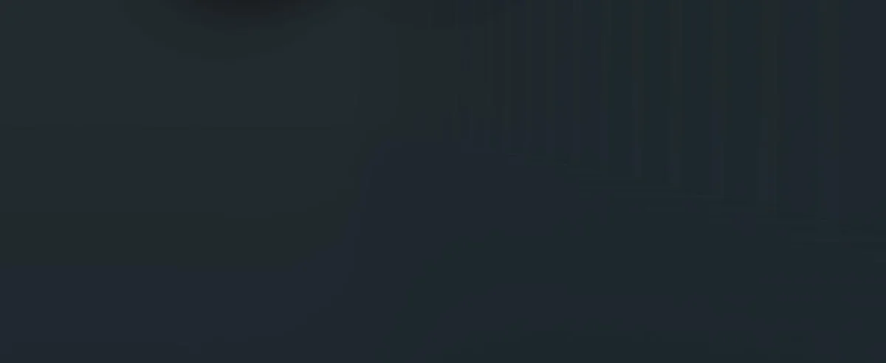

Transformations(좌표 변환)
tf2 소개

- tf2: ROS2에서 여러 좌표 프레임 간의 변환과 관계를 추적하고 관리하는 라이브러리 tf2
- 로봇 시스템은 일반적으로 세계 프레임, 기본 프레임, 그리 퍼 프레임, 헤드 프레임 등과 같이 시간에 따라 변경되는 많은 3D 좌표 프레임을 가짐
- tf2는 시간에 따른 이러한 모든 프레임을 추적하고 다음과 같은 질문을 할 수 있도록함 Q1. 5초 전 world frame 대비 head frame은 어디에 있는가? Q2. Gripper에 있는 물체의 포즈는 내 base에 비해 어떤가? Q3. Map frame에서 base frame의 현재 포즈는 어떤가?
- 로봇 위치 추적 (Localization) : map → odom → base_link 변환을 통해 로봇 위치 확인
- 센서 데이터 정렬 (Sensor Fusion) : LiDAR, 카메라, IMU 데이터를 로봇 본체 좌표계로 변환
- 로봇 암(Arm) 조작: 다 관절 로봇의 각 관절 간 변환을 사용하여 위치 계산
- 드론 및 이동 로봇: GPS 데이터 변환, IMU 데이터 보정 활용 분야

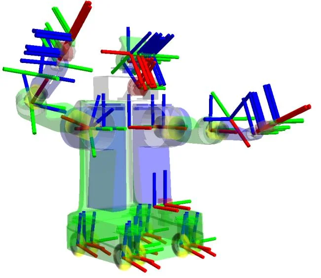

Transformations(좌표 변환)
tf2 소개
✓
World Frame

- World Frame은 좌표계에서 가장 기본이 되는 기준 좌표계(Reference Frame)
- 절대 좌표계(Fixed Coordinate System)
- 다른 모든 프레임(로봇의 위치, 센서 데이터 등)이 world frame을 기준으로 상대적 표현됨
- 로봇의 동작에 따라 여러 종류의 world frame이 존재(SLAM →map, 바퀴 기반 →odom, GPS →earth) ✓ World Frame의 종류
- Map : SLAM, Localization에서 사용되는 대표적인 world frame. 자율 주행 로봇의 경로 계획(Path Planning)
- Odom : 바퀴 기반 이동(Odometry)에서 사용되는 world frame. 시간이 지나면서 누적 오차 발생(Drift). 단기적 위치 변화 추적에 유용
- World : Gazebo 같은 시뮬레이션에서 사용됨. Map과 비슷하지만 물리적 환경에서 존재하는 것은 아님.
- Earth : GPS데이터를 사용할 때 적용되는 글로벌 좌표계. 위도/경도 데이터를 변환하여 로봇 위치를 추적. 자율 주행 드론, 자동차 등
- Base_link : 로봇 본체 프리임
- Earth → Map : GPS 기반 위치 추적. 고정된 월드 프레임
- Map →Odom : Localization 을 통해 Odometry 보정
- Odom →base_link : 로봇의 현재 위치 ✓ 다른 프레임 간 관계

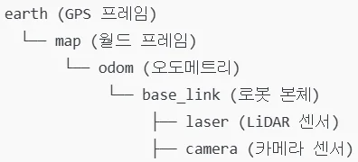

Transformations(좌표 변환)
tf2 소개
tf2

- Frame : 좌표계(예, map, odom, base_link, camera_link)
- Transform :한 프레임에서 다른 프레임으로의 변환 관계(회전 + 이동)
- TF Tree : 여러 프레임이 계층적으로 연결된 구조
- tf 기본 개념 [ tf tree 예]
- map → odom 변환: SLAM이나 Localization에서 로봇의 위치 제공
- odom →base_link : 변환 : 로봇의 본체 중심 좌표
- base_link →camera_link, lidar_link 변환 : 센서 위치
- TF 브로드 캐스터: 프레임 간의 변환을 주기적으로 브로드 캐스트
- TF 리스너: 다른 노드에서 TF정보를 구독하여 변환을 확인
- TF 변환 적용 : 특정 프레임 간 좌표 변환 수행
- tf 핵심 기능
- RViz2에서 TF를 시각화하여 디버깅 가능
- 센서 데이터 정렬, 로봇 네 이게 이 션, 로봇 암 조작 등에 필수적
- Broadcaster와 Listener를 사용하여 변환 데이터를 송수신

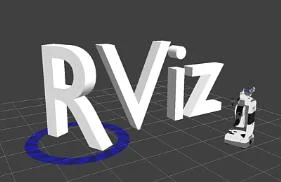

- view_frames 및 tf2_echo 도구를 사용하여 프레임 간의 관계를 시각적으로 분석하는 방법과, rviz2를 사용하여 프레임을 시각화하기
- View_frames는 현재 tf에 존재하는 모든 프레임과 그 연결 관계를 시각화해 주는 도구(좌표계 지도) Turtlesim 예제

✓Turtlesim 예제

1. 데모 패키지와 종속 파일들 설치

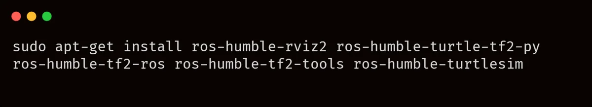

✓Turtlesim 예제

2. 터미널에서 다음 명령어 실행

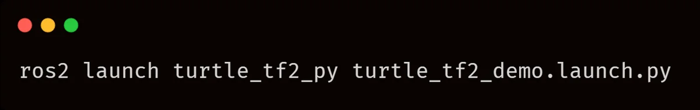

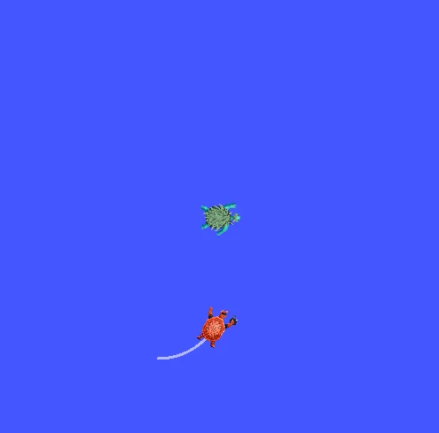

✓Turtlesim 예제

3. 두 번째 터미널을 열어 teleopkey를 실행시켜 거북
이를 움직이면 거북이가 따라오는 것을 관찰 가능

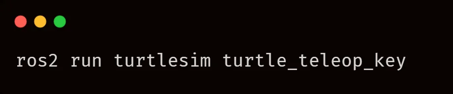

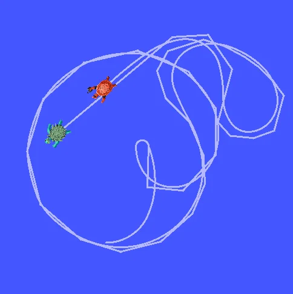

✓Turtlesim 예제

1. tf2 라이브러리를 사용하여 세 개의 좌표 프레임(world frame, turtle1 frame, turtle2 frame)을 생성
2. tf2 브로드 캐스터를 통해 거북이 좌표 프레임을 게시하고, tf2 리스너를 이용해 거북이 프레임 간의 차이를 계산한 뒤, 한
거북이가 다른 거북이를 따라가도록 설정

3. 지금부터 3가지 방법(view_frame, tf2_echo, rviz)을 통해 이 데모를 만드는 데 tf2가 어떻게 사용되었는지 확인해 보자

✓Turtlesim 예제 – view_frames

1. view_frames는 ROS를 통해 tf2가 브로드 캐스트 하는 프레임의 다이어그램을 생성
2. 다음 명령어를 이용하여 tf2가 브로드 캐스트 하는 프레임의 다이어그램을 생성

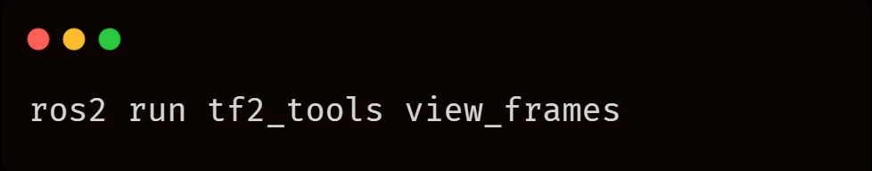

✓Turtlesim 예제– view_frames

3. 생성된“frames_2024-10-*****.pdf” 파일 열기

- Broadcaster : 특정 frame변환 정보를 puslishing하는 노드
- Average rate : transform 이 broadcast되는 평균 속도(hz)
- Buffer length : tf2가 transform 데이터를 유지하는 기간(초)
- Most recent tf : 가장 최근에 받은 transform의 timestamp
- Oldest transform : 가장 오래된 transform의 timestamp

✓Turtlesim 예제– view_frames

4. 해당 파일을 통해 tf2에서 브로드 캐스트하는 세 개의 프레임을 확인 가능

- World frame: turtle1과 turtle2 frame의 부모frame
- view_frames는 가장 오래되고 가장 최근의 프레임 변환이 수신된 시기와 디버깅 목적으로 tf2 프레임이 tf2에 게시되는 속도에 대한 진단 정보를 보고함

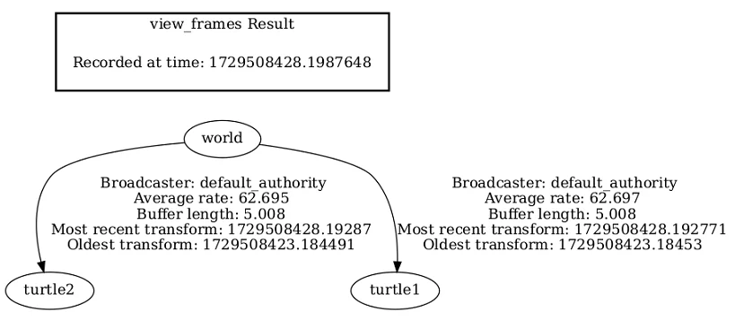

✓Turtlesim 예제– tf2_echo

1. tf2_echo는 ROS를 통해 브로드 캐스트된 두 프레임 간의 변환을 보고함
2. 다음 명령어를 이용하여 tf2_echo 실행(turtle2 기준으로 turtle1의 위치 좌표를 보여 줌)

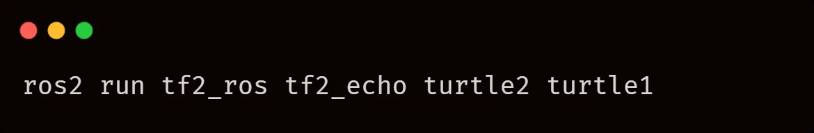

✓Turtlesim 예제– tf2_echo

3. 다음과 같은 출력을 통해 tf2_echo 리스너가 ROS2를 통해 broadcasting 된 프레임을 수신할 때 transform이 표
시되는 것을 관찰 가능

- Timestamp
- Turtle2 좌표계 기준으로 turtle1위치(m 단위)
- Turtle2 기준으로 turtle1이 어떤 방향으로 회전되어 있는지 (x, y, z) 좌표 Quaternion 좌표(x, y, z, w) RPY : Roll(x축 중심), Pitch(y축 중심), Yaw(z축 중심) Yaw(z축 중심)의 경우 평면에서는 방향 틀기

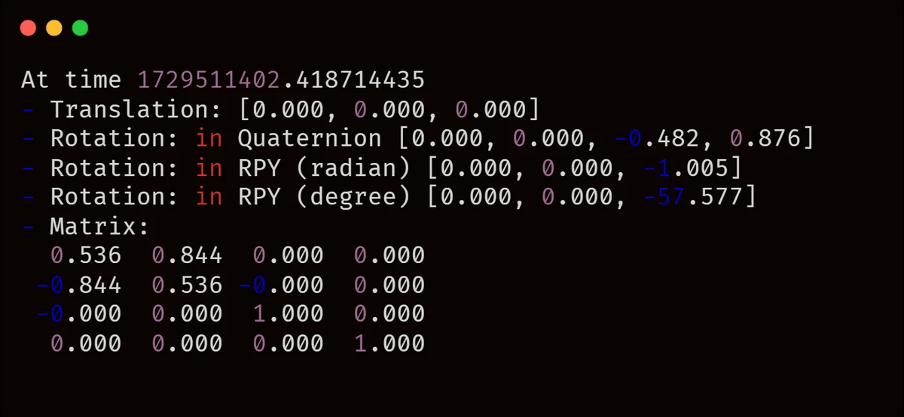

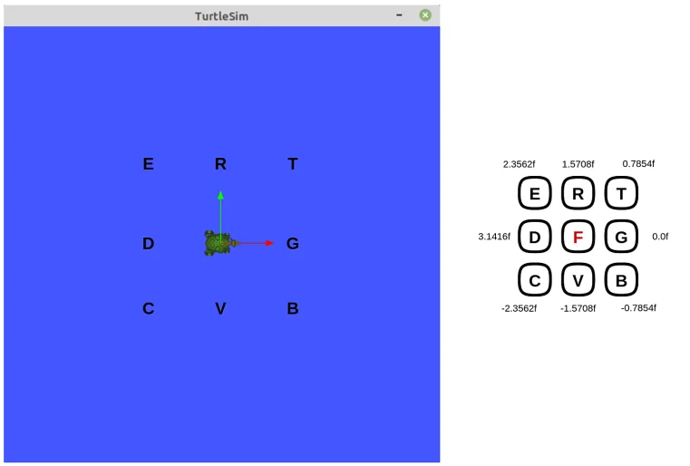

✓Turtlesim 예제– rviz

1. Rviz2 역시 tf2 프레임을 검사하는 데 유용한 시각화 도구로 사용 가능

- -d 옵션을 사용하여 구성 파일로 시작하여 rviz2를 사용하여 거북이 프레임을 관찰 가능

2. 앞의 상태를 계속 유지한 상태에서 다른 터미널 창에서 다음 명령어를 통해 rviz2 실행

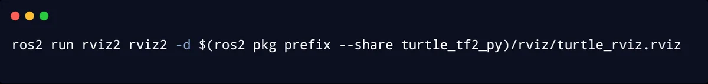

✓Turtlesim 예제– rviz
3.
사이드 바를 통해 tf2에서 broadcast
된 frame을 관찰 가능하며, 거북이를
움직이면 rviz에서도 frame이 움직이
는 것을 관찰 가능
[ 실습해 보기 ]

- Show Names : check box 체크 →이름 보기
- Marker Scale 값 바꿔 보기 : 1 →5
- Teleop_key 움직이며 Rviz에서 turtle 움직임 관찰하기(World좌표) X축 (Red) Y축 (Green) Z축 (Blue)

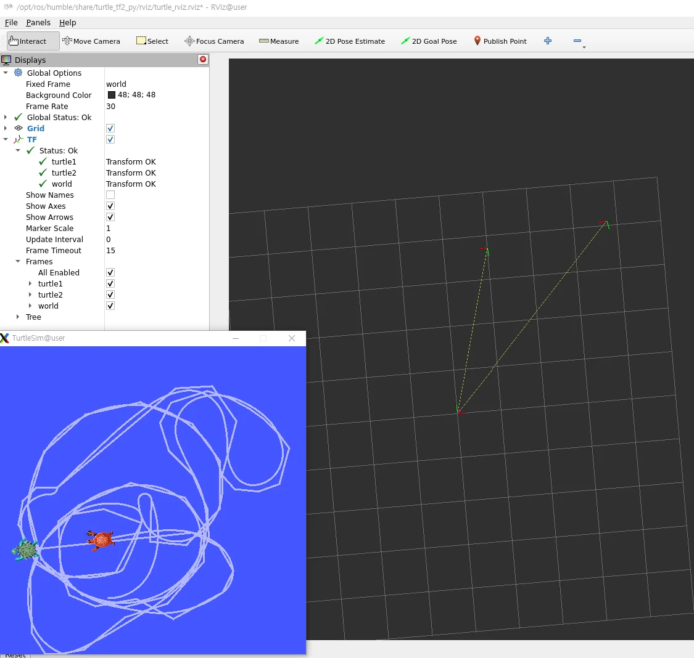

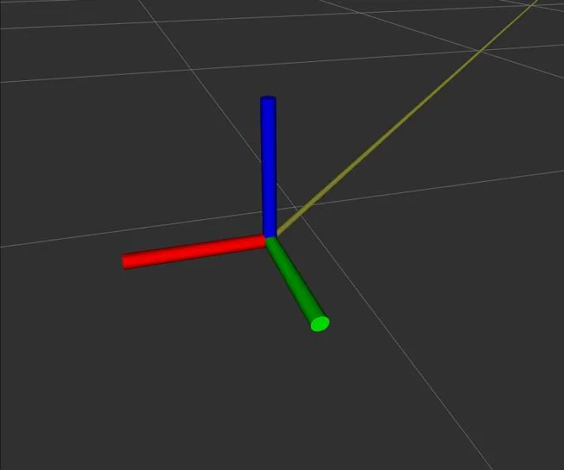

✓Turtlesim 예제– rviz
[ 실습해 보기 ]

- RQT의 pose에서 turtle1과 2의 좌표 확인해 보기
- ros2 topic echo turtle1/pose

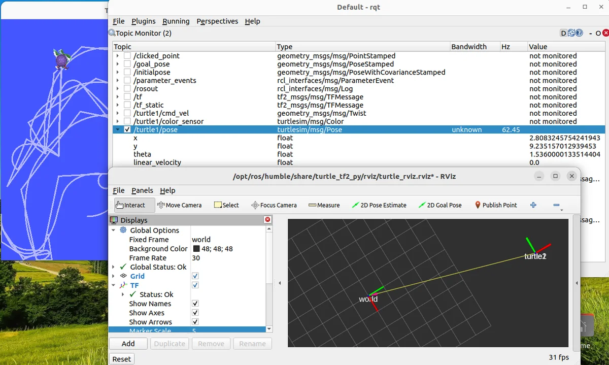

URDF
URDF
URDF

- URDF(Universal Robot Description Format)는 ROS에서 로봇의 형상과 구성을 지정하기 위한 파일 형식
- 로봇의 링크(link), 조인트(joint), 센서, 액추에이터 등의 물리적 요소들을 정의하여 로봇의 3D 모델을 시뮬레이션하거나 실제 로봇 제어 시스템에서 사용할 수 있게 도와줌
- 주요 구성 요소는 다음과 같음
- 링크(link) : 로봇의 물리적인 부분을 나타내며, 고체 물체로 이해할 수 있음. 각 링크는 모양, 관성, 마찰 특성 등과 같은 속성들을 가짐.
- 조인트(joint) : 두 링크를 연결하여 로봇이 움직일 수 있게하는 연결 점. 회전 운동이나 직선 운동을 정의할 수 있음
- 재질 및 텍스처 : 로봇의 각 링크에 적용할 재질이나 텍스처를 정의하여 외형을 시뮬레 이 션에서 표현할 수 있음
- 센서 및 액추에이터 : URDF 파일을 확장하여 센서나 액추에이터와 같은 로봇의 기능적 요소들을 정의할 수 있음

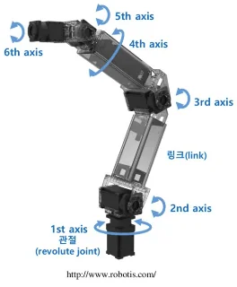

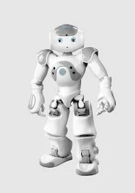

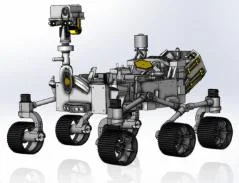

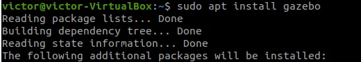

- rviz를 통해 확인 가능한 로봇의 시각적 모델 만들기 로봇의 시각적 모델 만들기

✓로봇의 시각적 모델 만들기
- 본 섹션에서는 아래와 같이 생긴 로봇을 URDF를 이용하여 만들 예정

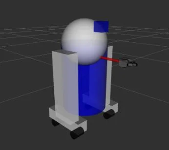

✓로봇의 시각적 모델 만들기 1

1. 다음 명령어를 이용하여 urdf-tutorial 설치
2. 다음 명령어를 이용하여 urdf 파일 실행

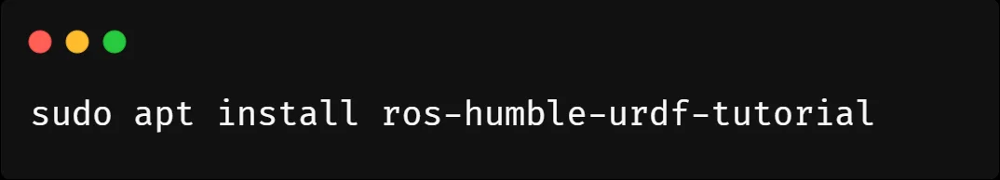

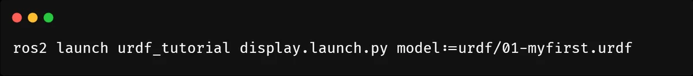

✓로봇의 시각적 모델 만들기 1

3. 실행 결과

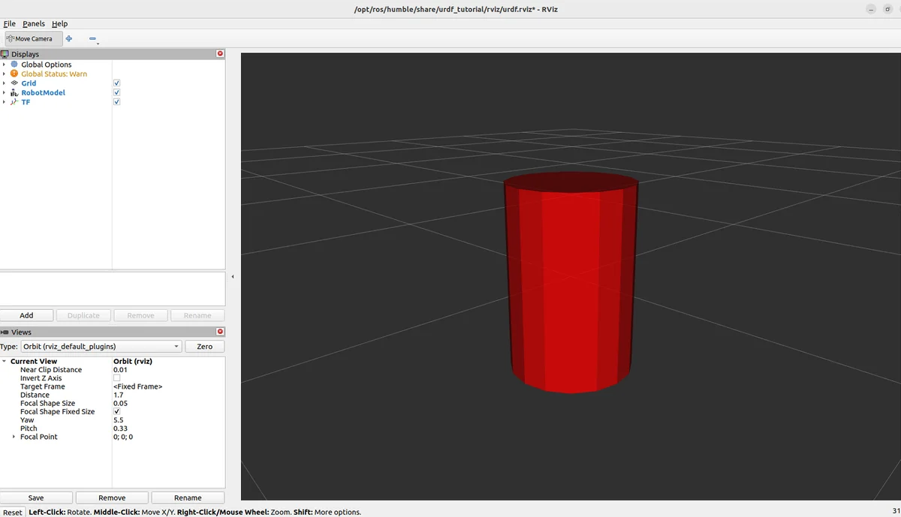

✓로봇의 시각적 모델 만들기 1 – 코드
- 다음 명령어를 이용하여 urdf 파일의 코드 확인(아래 링크를 통해서도 확인 가능) https://github.com/ros/urdf_tutorial/blob/ros2/urdf/01-myfirst.urdf https://github.com/ros/urdf_tutorial/blob/ros2/urdf/01-myfirst.urdf GitHub

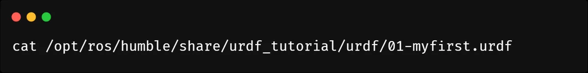

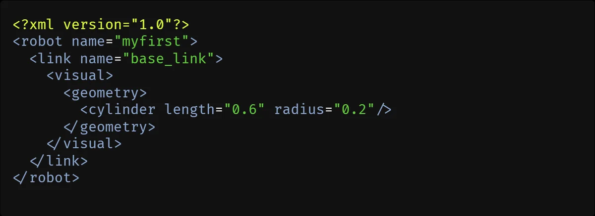

✓로봇의 시각적 모델 만들기 1 – 코드
- XML 버전 선언
- Robot 태그: URDF 파일을 사용할 때 로봇을 구별할 수 있는 이름 선언
- 링크 선언: 링크의 이름 선언 후 geometry 태그 안에서 cylinder 태그를 사용해 길이 0.6m, 반지 름 0.2m의 원기둥을 선언

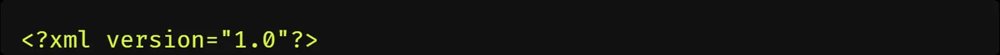

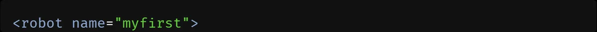

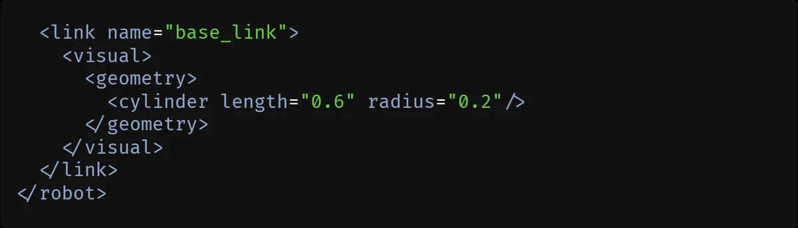

✓로봇의 시각적 모델 만들기 2

- 다음 명령어를 이용하여 두 번째 urdf 파일 실행

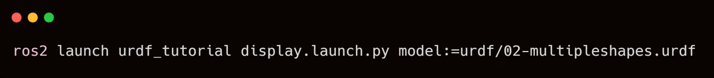

✓로봇의 시각적 모델 만들기 2

- 실행 결과(왼쪽의 tf 혹은 RobotModel등의 체크 박스 해제 유무에 따라 다소 다르게 보일 수도 있습니다)

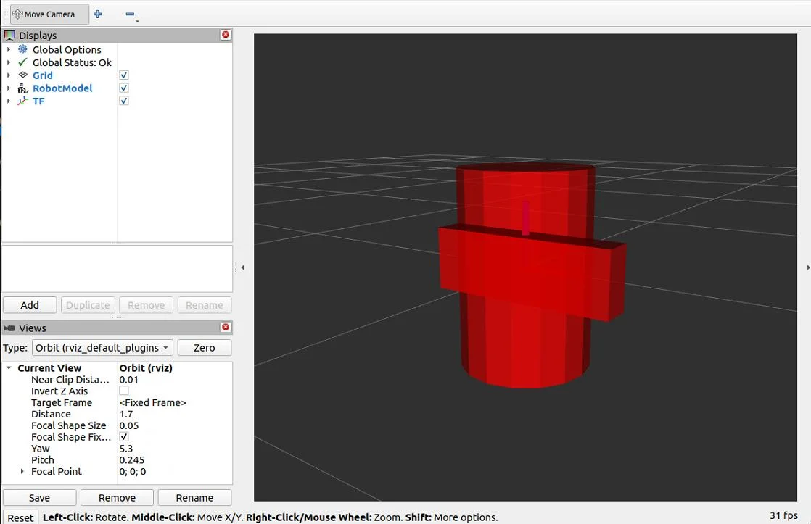

✓로봇의 시각적 모델 만들기 2 - 코드

- 다음 명령어를 이용하여 urdf 파일의 코드 확인(링크를 통해서도 확인 가능) 크기 정보(X=0.6, Y=0.1, Z=0.2) Joint 정의 https://github.com/ros/urdf_tutorial/tree/ros2/urdf https://github.com/ros/urdf_tutorial/tree/ros2/urdf GitHub

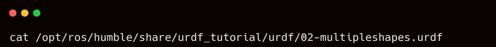

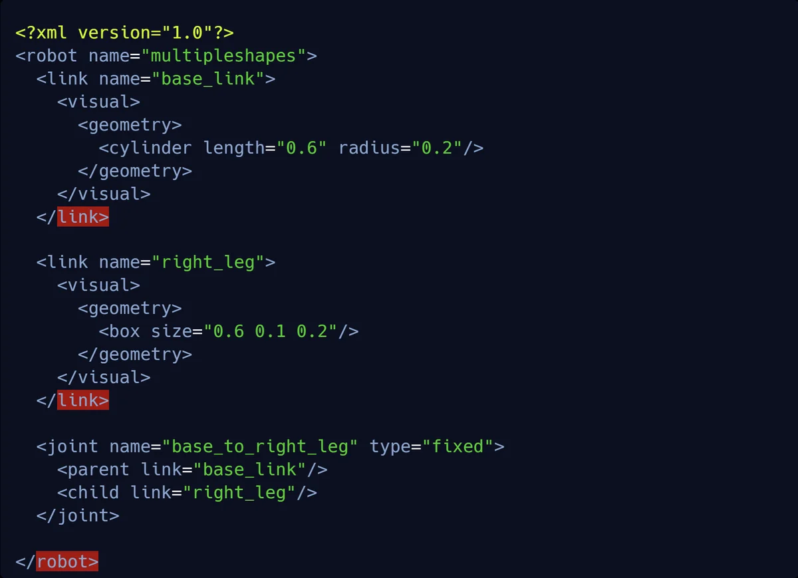

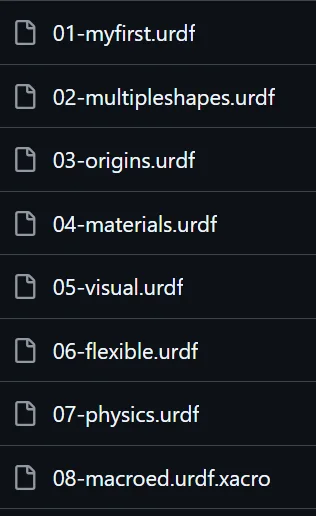

✓로봇의 시각적 모델 만들기 2 – 코드

- right_leg 링크 : 링크의 이름 선언 후 geometry 태그 안에서 box 태그를 사용해 x, y, z의 크기가 각각 0.6, 0.1, 0.2인 박스 선언 X Y Z

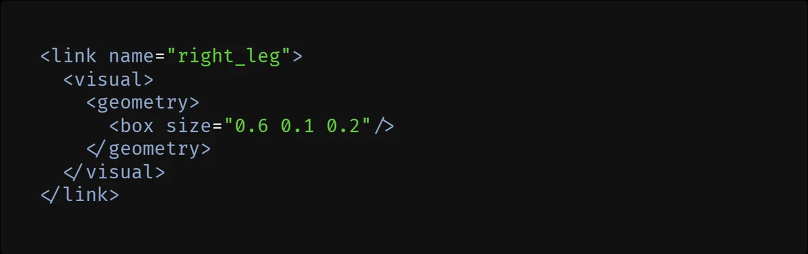

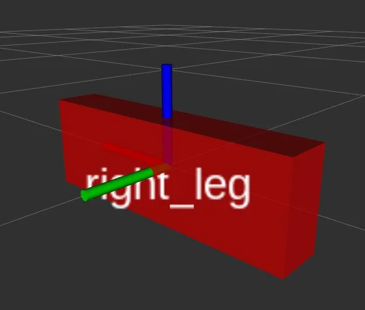

✓로봇의 시각적 모델 만들기 2 – 코드

- base와 right_leg를 연결하는 조인트: 조인트 이름 선언 후 type=“fixed”를 통해 고정 조인트임을 선언
- Parent link와 child link를 통해 어느 링크가 부모이고 어느 링크가 자식임을 선언 • Parent link(부모 링크) : 특정 joint를 기준으로 상위에 위치하는 링크로, Joint가 연결되는 주체 링크이며, joint의 움직임에 따라 child link를 제어하거나 지원 • Child link(자식 링크) : 특정 joint를 기준으로 하위에 위치하는 링크로, Parent link로부터 동역학적 영향을 전달받음

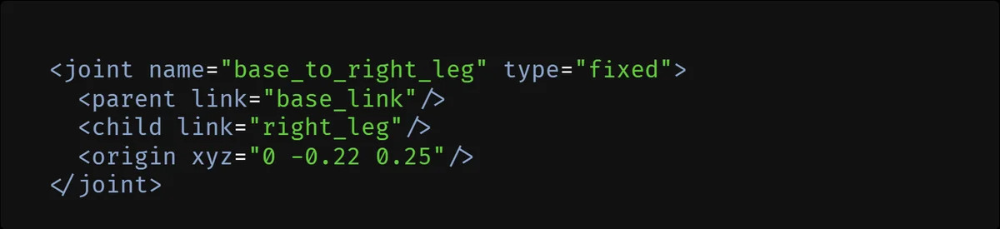

✓로봇의 시각적 모델 만들기3

1. 다음 명령어를 이용하여 세 번째 urdf 파일 실행: 다리의 위치를 알맞게 조정해 준 파일

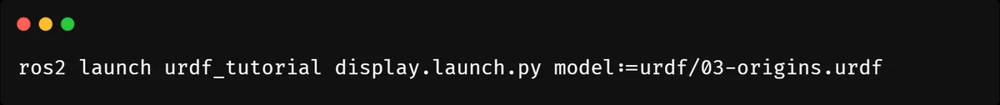

✓로봇의 시각적 모델 만들기 3

2. 실행 결과(왼쪽의 tf 혹은 RobotModel등의 체크 박스 해제 유무에 따라 다소 다르게 보일 수도 있습니다)

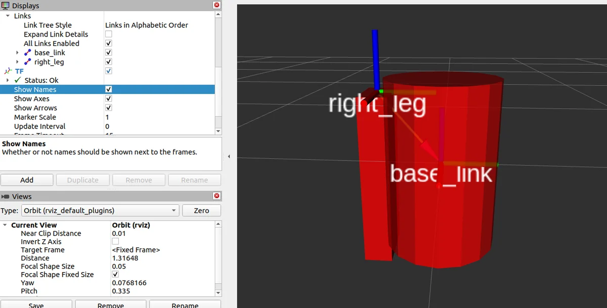

✓로봇의 시각적 모델 만들기 3 – 코드

- 다음 명령어를 이용하여 urdf 파일의 코드 확인(링크를 통해서도 확인 가능)

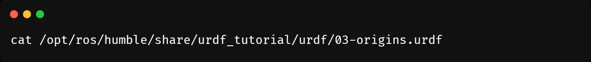

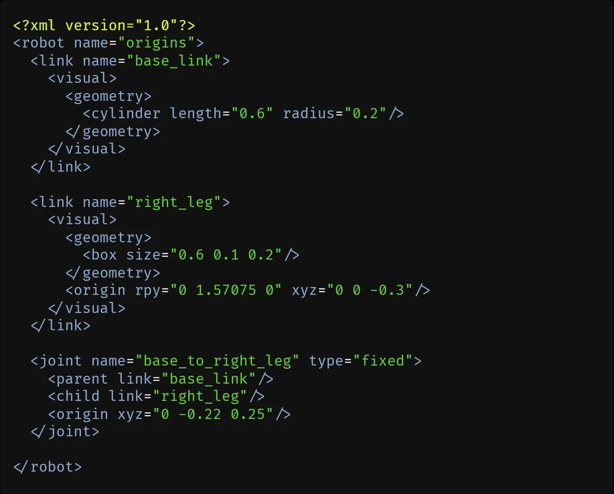

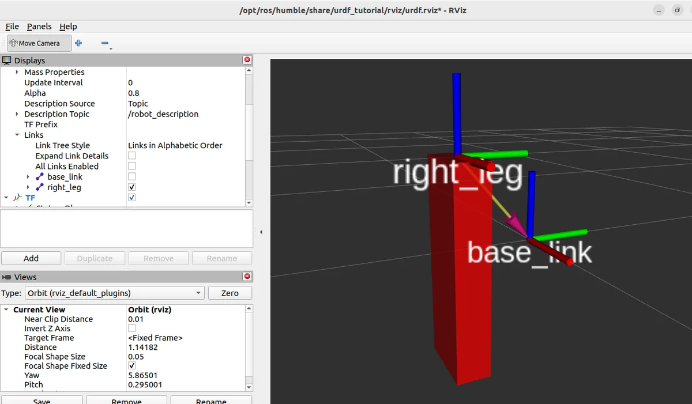

✓로봇의 시각적 모델 만들기 3 – 코드
- Origin 추가 : 기존 링크에 origin을 통해 해당 부분이 공간상에서 어디에 위치하고 어떻게 회전되어 있는 지를 선언

1. link에서의 origin

- 링크의 좌표계를 기준으로 시각적 요소(박스 형태의 다리)의 위치와 자세를 정의
- 링크의 좌표계는 부모 링크의 좌표계에서 조인트를 통해 정의됨 2. joint에서의 origin :
- 자식 링크(child link)의 좌표계가 부모 링크의 좌표계에서 어떻게 배치되는지 정의 Y축으로 90도(1.57rad) 회전, Z방향으로 -0.3만큼 이동 Base좌표계 기준으로 Y방향으로 -0.22(왼쪽), Z방향으로 0.25 만큼 이동

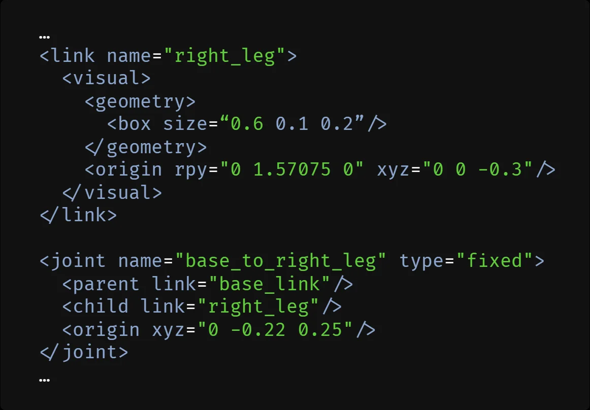

✓로봇의 시각적 모델 만들기 4

1. 다음 명령어를 이용하여 네 번째 urdf 파일 실행: 로봇에 색 정보와 오른쪽 다리를 추가한 파일

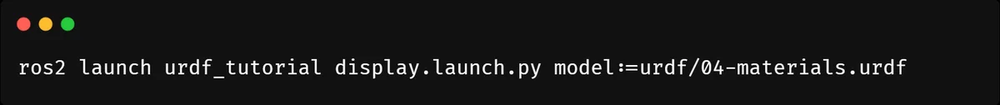

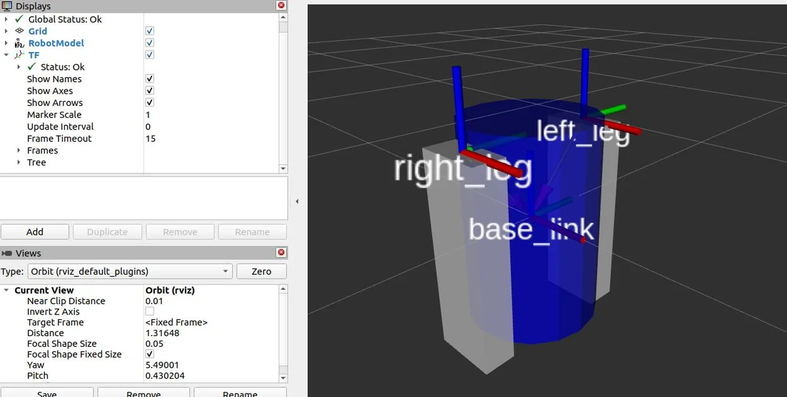

✓로봇의 시각적 모델 만들기 4

2. 실행 결과(왼쪽의 tf 혹은 RobotModel등의 체크 박스 해제 유무에 따라 다소 다르게 보일 수도 있습니다)

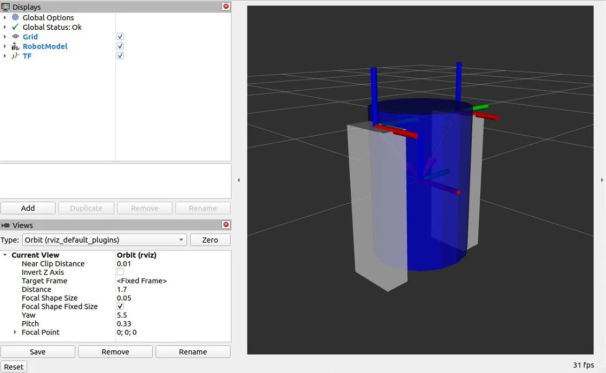

✓로봇의 시각적 모델 만들기4
- 다음 명령어를 이용하여 urdf 파일의 코드 확인(링크를 통해서도 확인 가능)

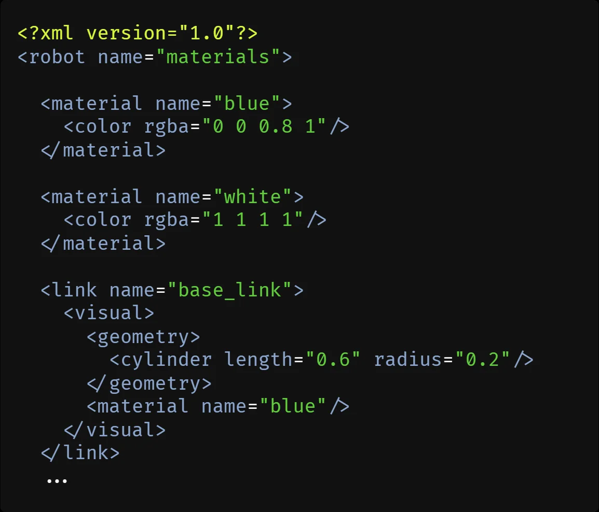

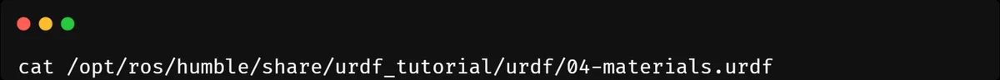


✓로봇의 시각적 모델 만들기 4 – 코드
- 재질(material) 정의 : 파란색 재질과 빨간색 재질 선언. 값은 rgba로 빨강, 초록, 파랑, 투명 도 순으로 나열되어 있음 0 : 투명, 1 : 불투명


✓로봇의 시각적 모델 만들기 4 – 코드
- 왼쪽, 오른쪽 동일하게 선언

- Base_link(원통) 위쪽에 두 개의 다리(right_leg, left_leg)가 고정됨
- Right_leg는 오른쪽(-0.22, 0.25), left_leg는 왼쪽(0.22, 0.25)에 위치
- 두 다리는 Y축 기준 90도(1.57rad) 회전하여 긴 면이 Z축을 바라보게 됨


✓로봇의 시각적 모델 만들기 5

1. 다음 명령어를 이용하여 다섯 번째 urdf 파일 실행: 로봇에 여러 부속품들 추가


✓로봇의 시각적 모델 만들기 5

2. 실행 결과(왼쪽의 tf 혹은 RobotModel등의 체크 박스 해제 유무에 따라 다소 다르게 보일 수도 있습니다)


✓로봇의 시각적 모델 만들기 5 – 코드
- 다음 명령어를 이용하여 urdf 파일의 코드 확인(링크를 통해서도 확인 가능)


✓로봇의 시각적 모델 만들기 5 – 코드
- 다음과 같이 그리 퍼, 머리 등 여러 부속이 추가되어 있음 DAE파일(COLLADA)

- Digital Asset Exchange. 3D 모델 파일
- XML형식으로 저장되어 3D소프트웨어 간 데이터 교환을 쉽게해 줌
- 기하학적 정보 외 재질, 조명, 애니매이션 등도 포함
- URDF와 함께 사용하며 화려한 시각 모델을 표현
- COLLAborative Design Activity STL파일(STereoLithography)
- 3D 프린팅 및 CAD프로그램에서 널리 사용되는 파일 형식
- 재질, 색상, 애니매이션 정보는 없고 오직 기하학적 정보만 있음
- 3D프린팅에서 가장 많이 사용되고 COLLADA파일보다 단순함
- Gazebo에서 사용


✓로봇의 시각적 모델 만들기 – CAD

1. 실제 현업에서는 손으로 일일이 URDF 파일을 만드는 경우는 적음
2. URDF에는 3D모델이 없고 외부 참조만 함
3. CAD 및 모델링 프로그램에서 URDF 모델을 Export 해서 사용함
4. ROS 핵심 유지 관리자는 이러한 패키지를 유지 관리하지 않으므로 본 수업에서는 다루지 않음
5. 다만, 아래 링크를 참조하면 더 자세한 정보를 얻을 수 있음
https://docs.ros.org/en/humble/Tutorials/Intermediate/URDF/Exporting-an-URDF-File.html
목적
추천 프로그램
로봇 부품, 기계 구조
FreeCAD. Fusion360
복잡한 모양. 텍스 쳐까지 표현
Blender
가볍게 초보용 모델링
TinkerCAD(STL만)
건축물 모델, 구조물 표현
SketchUp
STL
DAE
Blender
FreeCAD
Fusion360
SolidWorks
ThinkerCAD
MeshLab
Blender
SkechUp
Maya
3ds Max
FreeCAD

- 이동식 조인트 만들기 움직일 수 있는 로봇 모델 만들기

✓움직일 수 있는 로봇 모델 만들기
- 본 섹션에서는 이전 튜토 리얼에서 만들었던 로봇이 움직일 수 있도록 만들 예정


✓움직일 수 있는 로봇 모델 만들기

1. 다음 명령어를 이용하여 urdf 파일 실행


✓움직일 수 있는 로봇 모델 만들기

2. 실행 결과(왼쪽의 tf 혹은 RobotModel등의 체크 박스 해제 유무에 따라 다소 다르게 보일 수도 있습니다)


✓움직일 수 있는 로봇 모델 만들기 - 코드
- 다음 명령어를 이용하여 urdf 파일의 코드 확인(링크를 통해서도 확인 가능)


✓움직일 수 있는 로봇 모델 만들기– 코드
- joint type: 다음과 같이 joint의 type을 지정해 주어야함


✓움직일 수 있는 로봇 모델 만들기– 코드

- 머리 • 머리의 경우 연속 조인트(continuous joint)로 모델링 됨 • 연속 조인트의 경우 모든 각도를 취할 수 있으므로 상세한 제한은 기록하지 않음 continuous joint

✓움직일 수 있는 로봇 모델 만들기– 코드
- 그리퍼
- 그리 퍼의 경우 회전 조인트(revolute joint)로 모델링 됨(limit가 있음)
- 조인트의 토크(effort), 하한(lower), 상한(upper) 그리고 최대 속도(velocity) 등을 정의함 revolute joint


✓움직일 수 있는 로봇 모델 만들기– 코드
- 그리 퍼 암
- 그리 퍼 암의 경우 축을 따라 직선 운동을 하는 프리스메틱 조인트(prismatic joint)로 모델링 됨
- limit에 사용되는 단위로 revolute joint와 달리 미터 사용 prismatic joint 0.38m 안쪽(마이너스 방향)으로 들어가도록 설계


✓움직일 수 있는 로봇 모델 만들기
- GUI 슬라이더: GUI 슬라이더는 다음과 같은 원리로 동작됨
- GUI가 URDF를 구문 분석하고 고정되지 않은 모든 조인트와 제한 값(limit)을 찾음
- 슬라이더의 값을 사용하여 ‘sensor_msgs/msg/JointState’ 메시지를 발행
- 발행된 메시지는 robot_state_publisher 패키지에 의해 처리됨(각 관절 값에 따라 로봇의 트랜스 폼 계산)
- 변환 트리(transform tree)를 사용하여 Rviz에서 로봇의 모든 파트를 시각적으로 표시


구분
Joint State Publisher
Robot state Publisher
역할
로봇의 모든 관절(Joint) 상태(위치)를 Publishing
/joint_states를 받아서 링크들 사이의 좌표 변환(TF)를 계산해서 Publishing
발행하는 토픽
각 Joint의 Position값을 담은 메시지를 생성하고 발행
/joint_states
Sensor_msgs/msg/JointState
/tf
→움직이는 변환 정보
tf/_static →고정된 링크간 변환
Tf2_msgs/msg/TFMessage
구독하는 토픽
/joint_states
Robot_description
robot_description 파라메터(joint 이름, 타입, 제한)를
읽어서(URDF) 슬라이더(gui) 생성
/joint_states를 받고 UDRF읽고 Link-Joint 구조(Tree)를 Parsing
TF 계산 후 /tf Publishing
기타
Sensor_msgs/msg/JointState
Header : 시간, frame_id
Name : 조인트들의 이름
Position : 각 조인트의 현재 위치
Velocity : 각 조인트의 속도
Effort : 각 조인트에 걸리고 있는 힘(토크)
robot_state_publisher는 robot_description parameter(URDF 담고 있는 문자
열)를 읽음link-joint tree 저장
/joint_states 토픽 구독(각 조인트의 현재 위치 값)
조인트 값을 기준으로 3D위치와 방향(TF)계산
각 링크에 대해 /tf 토픽 발행
joint_state_publisher
/joint_state
링크 간 계산(tf)
/tf
/tf_static
로봇 모델 + 움직임 시각화
robot_state_publisher
RViz
topic
topic
※ 만약 mobile robot처럼 base_link가 움직인다면?
→Robot_state_publisher는 base_link만 관리. Localization(map) 또는 Odometry(odom)가 TF를 publishing 함


- 링크에 충돌 및 관성 속성을 추가하기
- 조인트에 조인트 역학(joint dynamics)를 추가하기 충돌 및 관성 속성 추가

✓충돌 및 관성 속성 추가

- URDF 모델에 기본적인 물리적 속성을 추가하는 방법과 충돌 속성을 지정하는 방법을 알아보자
- 충돌(collision)은 일반적으로 관성 태그(inertial tag)를 추가하여 사용

✓충돌 및 관성 속성 추가 - 코드
- 다음 명령어를 이용하여 urdf 파일의 코드 확인(링크를 통해서도 확인 가능)


✓충돌 및 관성 속성 추가 - 코드

- geometry: 링크의 충돌 영역의 기하학적 형태를 정의 • cylender: 원기둥 형태 사용
- inertia: 관성 텐서를 정의 • mass: 질량(kg) • ixx, iyy, izz : 각각 x, y, z축을 중심으로 하는 회전 저항 • ixy, ixz, iyz : 관성 곱(product of inertia)으로, 링크가 주축 이외의 축에 대해 어떻게 회전하는지를 나타냄(대칭 물체는 모두 0) • 관성 텐서는 링크의 회전 운동 방정식을 결정하는 데 사용됨. • 정확한 관성 값을 제공함으로써 시뮬레이션에서 링크의 회전 움직임이 현실적으로 표현할 수 있음


- Xacro를 사용하여 URDF 코드를 단순화하기 Using Xacro
- XACRO (XML Macros)는 URDF파일을 더 효율적으로 작성할 수 있도록 도와주는 XML 기반의 매크로 언어
- ROS2에서 로봇 모델을 생성할 때 URDF를 직접 작성하는 대신,
- XACRO를 사용하면 재사용 가능한 코드 블록을 정의하고
- 이를 통해 코드의 중복을 줄이며 유지 보수성을 높일 수 있음
- Xacro, URDF, SRDF 알아보기

✓Using Xacro

- 본 섹션에서는 Xacro를 이용하여 코드를 단순화하는 방법을 진행할 예정
- Xacro는 다음과 같은 장점을 가짐 • 재사용성 향상 : 공통된 요소를 매크로로 정의하여 여러 곳에서 재사용 가능 • 가독성 향상 : 파일의 구조를 더 명확하게 만들어 이해하기 쉬움 • 유지 보수 용이 : 변경 사항을 한 곳에서 수정하면 전체에 반영되므로 관리가 편리 • Xacro는 다음 명령어로 설치 가능(대부분의 경우 이미 설치되어 있을 가능성이 높음)


✓Using Xacro
1.
Xacro는 XML용 매크로 언어
2.
일반적으로 *.xacro 파일을 작성 후 다음의 명령어를 이용하여 urdf로 변환 후 사용
URDF
SRDF
XACRO
Universal Robot Description Format
Semantic Robot Description Format
XML Macro
로봇의 물리적 구조(모델) 정의
로봇의 의미론적(운동학적) 정보 정의
URDF의 확장 버전(코드 재사용성 증가)
링크, 조인트, 관성, 충돌 모델 등
운동학 그룹, 충돌 회피 설정, 엔드 이펙터 설정
URDF
Gazebo, Rviz, Moveit!
Moveit!
Gazebo, Rviz, Moveit!
로봇의 구조를 정의하는 기본 파일
URDF를 기반으로 Moveit!을 위한
의미론적 설정을 추가하는 파일
URDF를 생성하는 도구
URDF
URDF를 SRDF로 변환 불가능. 수작업
Xacro파일을 URDF로 변환해야
Gazebo, Rviz, Movtit!등에서 사용 가능
URDF 시뮬레이션은 가능하지만 경로 계획 수행 불가
Moveit!같은 경로 계획 도구 사용하려면 SRDF필요
Xacro는 URDF를 생성하는 도구
실제 사용되는 로봇 모델 파일은 아님
※ 예, SolidWorks등 CAD 소프트웨어 로봇 모델 생성 →Xacro (변환) →URDF (수작업 변환) →SRDF
※ 파일 변환 관계 : xacro →urdf 명령어로 파일 변환 가능한 반면 urdf →xacro 수동 변환 가능

✓Using Xacro - Constants

- 본 섹션에서는 Xacro에 서 상수를 어떻게 다루는지 알아볼 예정
- 이전 R2D2 예제에서는 다음과 같이 중복이 일어남(ex: cylinder의 길이와 반지름을 두 번 지정함). 이러한 경우 하나의 값을 변경하려면 다른 하나도 같이 변경해 주어야함
- 따라서 왼쪽의 코드를 변경하여 상수 역할을 하는 속성을 지정한 오른쪽 코드와 같이 변경하는 것이 좋음


✓Using Xacro - Constants

- 상수의 경우 처음 두 줄에 지정되며, 이 값은 거의 모든 곳에서 어떤 수준에서든 사용 전이나 후에 정의 가능
- 상수는 “${}”의중 괄호 안에 상수를 집어넣는 방식으로 사용 가능

✓Using Xacro - Constants

- 본 섹션에서는 Xacro에서 수식을 다루는 방법에 대하여 알아볼 예정
- Xacro에서는 기본 사 칙 연산, 부호 반전(unary minus), 괄호(parenthesis)등을 사용하여 복잡한 표현 식 작성 가능
- 반지름 = 실린더의 직경 / 2
- xyz중 x값은 reflect * (width + 0.02)


✓Using Xacro - Macros

- 본 섹션에서는 Xacro 매크로를 다루는 방법에 대하여 알아볼 예정
- Xacro 매크로는 ‘<xacro:macro>’ 태그를 사용하여 정의되며, 특정 기능을 수행하는 코드 블록으로, 필요할 때마다 매크로를 호출하여 해당 코드를 재사용이 가능하도록하는 것
- 즉 매크로는 python의 함수와 비슷한 역할을 한다고 볼 수 있음
- 단순한 매크로의 예시: 1. 다음 제공된 것은 단순한 Xacro 매크로로, default_origin이라는 이름을 가진 매크로를 정의한 것. 2. ‘<xacro:default_origin />’를 호출 시 ‘<origin xyz="0 0 0" rpy="0 0 0"/>’가 해당 위치에 삽입 됨


✓Using Xacro - Macros

- 더 나아가 매크로에 파라미터를 넣고자할 경우 다음과 같은 방법 사용 가능 1. 파라미터를 사용하고자할 때 매크로 이름 뒤에 ‘params’를 추가 가능 2. 이 경우<xacro:default_inertial mass="10"/>를 호출 시 해당 위치에 오른쪽 코드가 삽입됨


- URDF에서 모델링된 보행 로봇을 시뮬레이션하고 Rviz에서 확인하기
- robot_state_publishe는 URDF(Xacro)로 정의된 로봇 모델의 상태를 퍼블리시하는 ROS2 패키지
- 로봇의 링 트와 조인트 상태를 기반으로 TF 트리를 자동으로 생성하여 다른 ROS2 노드들이 알 수 있도록
- ROS2에서 로봇을 시뮬레이션하고 TF트리를 구성하려면 필수 Using URDF with robot_state_publisher [ 역할 ]
- URDF기반으로 TF정보 Publishing
- 로봇의 조인트 상태를 받아 TF 트리 업데이트
- Rviz에서 로봇 모델을 시각화
- 다른 ROS 패키지에서 로봇의 위치와 자세를 참조할 수 있도록함

✓Using URDF with robot_state_publisher

- 본 섹션에서는 걷는 로봇을 모델링하고, 상태를 tf2 메시지로 게시하고, Rviz에서 시뮬레이션을 관찰할 예정
- 진행 과정은 다음과 같음 1. 로봇 어셈블리를 설명하는 URDF 모델 생성 2. 동작을 시뮬레이션하고 JointState와 변환을 게시하는 노드 작성 3. robot_state_publisher를 사용하여 전체 로봇 상태를 /tf2에 게시 • robot_state_publisher: URDF 파일을 사용하여 로봇의 상태(특히 조인트 상태)를 퍼블리시하는 노드로, 로봇의 각 조인트 상태와 링크 간의 변환을 계산한하여TF 프레임으로 퍼블리시함 urdf_revolution.zip을 우측과 같이 디렉토리에 압축 풀고 복사 → ※ 필요한 파일 : urdf_revolution.zip


✓Using URDF with robot_state_publisher
1.
폴더 생성 후 src 폴더 안에서 패키지 생성
2.
URDF 파일 생성(wget 뒤의 링크가 너무 길어 입력하기 어려우면 별도 제공 받은 파일을 이용해 보자)
※ urdf_revolution.zip을 ros2_ws/src아래 폴더에 압축을 풀었다면 이 과정은 생략하고 colcon build만 진행하면 됨
revolution
revolution


✓Using URDF with robot_state_publisher
3.
src/urdf_revolution/urdf_revolution/state_publisher.py 파일에 다음 코드 작성
로봇의 위치를 원형 궤도로 이동하도록 x, y 좌표를 업데이트→
yaw(회전각) 값을 쿼터 니 언으로 변환 →
joint_state, 좌표 변환 정보 퍼블리시
Sphere 상단 높이 왕복
Tilt : 앞으로 숙이는 반복 동작
Swivel : sphere 자체 회전
Angle : sphere가 odom기준 공전
[ 실습 ]
※ tilt, height, swivel, angle 각각 주석 처리 후 build해서 동작 확인해 보기


✓Using URDF with robot_state_publisher
3.
src/urdf_revolution/urdf_revolution/state_publisher.py 파일에 다음 코드 작성


✓Using URDF with robot_state_publisher
4.
src/urdf_revolution/launch/demo.launch.py 파일에 다음 코드 작성


✓Using URDF with robot_state_publisher

5. setup.py에 필요한 모듈 가져오기
6. data_files에 다음 코드 추가
7. console_scripts에 다음 코드 추가
revolution.state_publisher:main’


✓Using URDF with robot_state_publisher

8. 패키지 설치
9. 설정 파일 가져오기
revolution
ros2 topic echo /tf | grep -A 10 "child_frame_id: body"


✓Using URDF with robot_state_publisher

10. launch파일 실행
11. 새로운 터미널을 열어 rviz 실행 (뒤에 나오는 파일 경로는 사용자마다 다를 수 있습니다)


✓Using URDF with robot_state_publisher

12. 실행 결과


✓My_URDF 패키지 생성해서 Humanoid 만들어 보기
※ 필요한 파일 : my_urdf.zip


✓URDF 패키지 수정하기

1. robot_1.launch.py : 폴더 및 파일 만들기
2. Robot_1.xacro 복사하기
3. setup.py 수정하기


✓URDF 패키지 수정하기


✓Build 후 실행해 보기


✓RViz에서 설정하기


✓RViz에서 Humanoid Robot 확인하기


✓robot_1.launch.py로 실행하기


✓robot_1.launch.py로 실행하기


ROS2 시뮬레이션
Gazebo
Gazebo

- Gazebo는 로봇 시뮬레이션을 위한 강력한 도구
- ROS2 Humble과 함께 사용하는 Gazebo 버전은 Gazebo-Ignition
- Gazebo 설치 sudo apt install ros-humble- gazebo*


- ROS2와 통합하면 실제 로봇 하드웨어 없이도 다양한 로봇 시스템을 개발, 테스트, 디버깅 할 수 있는 강력할 시뮬레이션 환경을 제공
- Gazebo의 주요 기능 1. 물리 엔진 제공(ODE, Bullet, DART) 2. 센서 시뮬레이션 3. 3D환경 4. 로봇 모델 시뮬레이션
- ROS2와 Gazebo 통합 패키지
- Gazebo_ros_pkgs ROS2 시뮬레이션 Gazebo Gazebo


ROS2 시뮬레이션
Gazebo 폴더에 있는world 로딩해 보기


ROS2 시뮬레이션
Gazebo

- ROS2와 Gazebo 연동 테스트 [ Gazebo –verbose 옵션 ] 더 많은 로그와 내부 상태 정보를 터미널에 출력해 주는 옵션이며 기본 실행(gazebo)과 비교해서 백 엔드에서 어떤 일이 일어나고 있는지를 알 수 있도록 도와 주는 옵션. 1차 디버깅 도구


1. 가제 보를 시작하면 접지 면만 있는 세상
ROS2 시뮬레이션
Gazebo


Gazebo는 Gazebo에 객체를 추가하기 위한 두 가지 메커니즘을 제공

1. 렌 더 창 위에 있는 간단한 모양의 집합
2. 모델 데이터베이스를 Insert 통하는 방법으로,
 왼쪽 상단 모서리에 있는 탭
ROS2 시뮬레이션
Gazebo 객체 추가


ROS2 시뮬레이션
Gazebo

3. 렌 더 창 위의 적절한 아이콘을 클릭하면 상자, 구, 원통을 월드에 추가


Insert 모델 데이터베이스에 접근하려면 왼쪽 상단 모서리에 있는 탭
각 모델의 포즈는 이동 및 회전 도구를 통해 변경
ROS2 시뮬레이션
Gazebo

4. 모델 데이터베이스에서 모델 추가


5. 마음에 드는 세계를 완성하면File 메뉴를 통해 저장

- gazebo my_world.sdf

6. 저장된 world는 명령 줄에서 로드
ROS2 시뮬레이션
Gazebo

- 지금 메뉴를 선택File하고, Save World As 새 파일 이름을 입력하라는 팝업
- my_world.sdf 입력하고 확인을 클릭 SDF(Simulation Description Format)
- 시뮬레이션 world와 로봇의 물리적 특성, 외형, 동작 등을 정의하는 데 사용되는 표준 포맷
- URDF는 로봇 자체를 중심으로 정의하는 반면, SDF는 world 전체, 센서, 플러그인, 조명 등 더 많은 요소 포함
- World, model, link, joint, sensor, plugin등의 주요 요소가 있음
- Odom →base_link : 변환 : 로봇의 본체 중심 좌표
- URDF는 Gazebo에서 사용할 때 변환이 필요하지만 SDF는 직접 사용 가능 ROS2 시뮬레이션 Gazebo 폴더에 있는world 로딩해 보기


ROS2 시뮬레이션
Gazebo 폴더에 있는world 로딩해 보기


ROS2와 로봇 시뮬레이션

- 로봇 시뮬레이션 컴퓨터상에서 가상의 환경을 이용하여 로봇의 동작, 센서 데이터, 환경을 개발하고 테스트하는 기술
- Gazebo ROS2를 활용할 수 있는 로봇 시뮬레이션 물리 엔진과 3D 그래픽을 지원함
- 장점
- 비용 절감: 로봇 프로토타입을 제작하거나 테스트하는 비용 절감
- 안전성 : 사람이나 장비에 대한 사고 위험 경감
- 개발 효율 : 여러 대의 로봇을 테스트하거나 개발하여 효율 증가
- 유연성 : 날씨, 지형, 장애물 등 다양한 시나리오 실험 로봇 시뮬레이션

- Gazebo 시뮬레이션의 구성 요소 World 시뮬레이션 환경을 정의하는 파일 환경의 지형, 조명, 물리 엔진 설정 등이 포함됨 로봇 모델을 정의하는 파일 urdf나 sdf 확장자로 표현됨 링크, 조인트, 센서 등을 구성할 수 있음 플러그인 Gazebo에서 제공하는 로봇 제어API를 이용할 수 있음 (World Plugin, Model Plugin, Sensor Plugin, System Plugin) Gazebo를 포함한 여러 구성 요소를 한꺼번에 실행하기 위해 주로 launch파일을 통해 프로젝트를 설정하고 실행함 launch.py ROS2와 로봇 시뮬레이션 로봇 모델


- Turtlebot3
- 두산 로봇 팔 ROS2와 로봇 시뮬레이션 Fulfillment Center Doosan Robot Simulation 실습


Gazebo Simulation과 SLAM

- SLAM은...
- Simultaneous Localization and Mapping의 약자로 동시적 위치 추적 및 지도 생성이라는 뜻
- 사용 기술
- Localization : 로봇이 현재 위치를 추정하는 과정
- Mapping : 주변 환경에 대해 지도를 생성하는 과정
- Sensor Fusion : 라이다, 카메라, IMU 센서, GPS, 적외선, 초음파 센서 등 다양한 센서 데이터를 통합하여 정확도를 높이는 기술 Localization Mapping Sensor Fusion SLAM


Gazebo Simulation과 SLAM
SLAM
Simultaneous Localization : 로봇의 자세(position + orientation)를 획득하는 것

- Mapping: 환경 정보(지도)를 획득하는 것
- 로봇의 자세(위치+ 방향)와 환경 지도를 동시에 획득하는 기술
- SLAM에서는 아무것도 주어지지 않음
- 로봇의 자세· 지도Landmark의 위치 모두 오차를 갖게 됨
- 오차를 어떻게든 보정해 가면서 로봇의 자세와 환경 정보를 모두 정확하게 알아내는 것
- Localization에서는 환경 정보(지도)가 주어져야함
- 주어진 지도 안에서 로봇이 ‘어디에 위치’하고 ‘어떤 방향’을 바라보고 있는지 알아내는 것
- 지도로부터 획득된 센서 관측 데이터를 이용하여 오차를 보정해 가면서 로봇의 위치와 방향을 정확하게 알아내는 것
- Mapping에서는 로봇의 자세(위치와 방향)이 주어져야함
- 주어진 로봇의 위치와 방향을 기반으로 ‘주변 환경에 대한 정보’를 알아내는 것
- 센서 관측 데이터와 주어진 로봇 자세를 이용하여 오차를 보정해 가면서 환경 정보를 정확하게 알아내는 것 Localization Mapping Chicken and Egg Problem


- Loop Closure
- 로봇은 계속 움직이면서 오차 누적됨
- 어느 순간 예전에 왔던 장소로 다시 되돌아오게 도는데
- 이때 그 장소를 알아보지 못하면 지도는 점점 더 오류가 커짐
- 돌아온 장소를 인식하고 과거와 현재의 지도를 연결(정합)하는 작업
- Kidnapped Robot Problem 이전의 이미지와 특징 점을 매칭하여 유사 도가 높으면 같은 지점이라고 판단하고 누적된 오차를 보정하여 정확도를 개선해야함 Why?
- 물리적 이동(부딪힘이나 인위적인 이동)
- 센서 오류
- 껐다 켰을 때
- 여러 공간이 비슷한 경우 지도를 작성할 때는 kidnapped problem이 발생하지 않도록 주의를 기울여야함 로봇이 갑작스럽게 다른 위치로 납치(이동)되었을 때 자신의 위치를 파악하지 못하는 상황 Gazebo Simulation과 SLAM
- 좋은 초기 위치 추정 제공→Cartographer는 초기 위치 추정에 크게 의존
- 센서 구성 최적화(센서 품질 및 다양한 센서 조합) →Sensor Fusion(LiDAR + IMU + Odom)
- LIDAR scan match 품질 높이기
- Loop closure 및 submap 파라미터 조정, Global localization Trigger
- 위와 같은 방법으로 위치 유실 감지 및 회복 전략 구현


Gazebo Simulation과 SLAM
SLAM은 어떻게 해결?
추정과 반복을 사용해서 해결
위치와 지도를 동시에 ＂조금씩” 추정하면서 점점 더 정확하게 만들어 감

- Localization : 먼저 주변 환경에 대한 정보를 알아야함
- Mapping : 먼저 현재 로봇의 위치와 방향에 대한 정보를 알아야

1. 초기화(Initialization) : 로봇이 임의의 위치에서 시작. 센서 데이터(LiDAR, 카메라) 수집
2. 동시 추정(Simultaneous Estimation) : 현재 센서 데이터를 기반으로 자기 위치 추정 동시에 주변 지도 업데이트
3. 루프 클로징(Loop Closing) : 전에 방문한 위치를 다시 방문하면 과거의 지도와 현재의 지도를 정렬해 오류를 줄임
4. 루프 클로징은 오류 누적을 정정하는 핵심 단계
5. 최적화(Graph Optimization) : 시간에 따라 쌓인 위치와 맵 데이터를 그래프 형대로 모델링 하고 그래프 최적화를 통해 위치와 맵을 동시에 정제
SLAM의 일반적인 해결 방식

Gazebo Simulation과 SLAM

- NAV는...
- Navigation은 SLAM을 활용하여 로봇을 원하는 위치까지 자동으로 도달하게 제어하는 것
- 사용 기술
- Path Planning : 목표 지점까지 최적의 경로를 찾는 과정
- Behavior Tree : 로봇의 동작을 트리 형태로 구성하여 유동적으로 관리하고 제어하는 알고리즘
- Trajectory Tracking : 계획된 경로를 따라 로봇을 제어하는 기술 Path Planning Behavior Tree Trajectory Tracking NAV Path : 어디를 지나갈지를 결정한 경로(좌표) 목록 Trajectory : 어디를 언제, 어떤 속도로 지나갈지 실제 움직임 궤적


Gazebo Simulation과 SLAM
SLAM & NAV
SLAM
(Simultaneous Localization & Mapping)
Nav2
(Navigation)
역할
맵을 생성하며 로봇의 위치를 추정
이미 존재하는 맵에서 경로를 계획하고 이동
입력 데이터
센서 정보(LiDAR, IMU등)
맵, 로봇 위치, 목표 위치
출력 결과
2D맵, 로봇 위치(/map, /tf)
이동 경로, 속도 명령(/cmd_vel)
실행 시점
맵이 없는 환경에서 최초 탐색에 사용
맵이 준비된 이후 목표 지점으로 이동할 때 사용
대표 패키지
slam_toolbox, cartographer, gmapping
nav2_bringup, bt_navigator, planner_server

SLAM : Visual
관련 영상
https://www.youtube.com/watch?v=yi-y8qTgtiw
Gazebo Simulation과 SLAM : 기초 이론

- 카메라에서 얻은2D, 3D 이미지 데이터를 사용하여 환경의 고유한 특징 점을 추출하는SLAM 특징 점을 다른 프레임(이미지)에서 다시 찾아내고, 이를 비교해 로봇의 상대적 위치를 계산
- 장점: 카메라만으로 저비용 시스템 구현 가능
- 한계: 조명, 기상, 텍스처 없는 평면에서 정확도 감소


Gazebo Simulation과 SLAM : 기초 이론

- 라이다에서 거리 데이터를 통해3D 점구름, point cloud를 생성하는SLAM 이전 프레임과 현재 프레임에서 얻은 포인트 클라우드 데이터를 비교하여, 로봇의 상대적 위치와 환경 지도를 동시에 계산
- 장점: 어두운 환경에서 정확한 거리를 측정
- 한계: 비용이 높고 외부 노이즈에 민감함 SLAM for efficient Lidar Labeling | Sama SLAM : LiDAR 항목 2D Lidar 3D Lidar 스캔 방식 단일 평면(수평 또는 수직) 수직 및 수평 방향 모두에서 거리 측정 동작 방식 한 개의 레이저가 일정한 각도로 2D 평면을 스캔 여러 개의 레이저가 다양한 각도에서 공간을 스캔하여 3D데이터 생성 출력 데이터 거리 및 각 도 정보를 포함한 2D포인트(2D 맵) 거리, 각도 고도 정도를 포함한 3D 포인트 클라우드(3D맵) 메시지 타입, 토픽 sensor_msgs/LaserScan, /scan sensor_msgs/PointCloud2, /points or /velodyne_points 스캔 범위 수m ~ 수십m(보통 360° 수평 스캔) 수m ~ 수백m(30°~120°수직+ 360°수평) 적용 분야 실내 자율 주행, SLAM, 충돌 방지 실외 자율 주행 차량 드론 등에서 정밀 공간 인식 적용 사례 실내, 저비용 로봇, 간단한 SLAM, 단순한 장애물 회피 복잡한 공간 인식 필요, 정밀한 3D맵, 구조물 인식 참고 영상 Light Detection and Ranging : 레이저 빛을 쏴서 물체에 반사되어 돌아오는 시간(Time of Flight)을 측정해서 거리(depth)를 계산하는 센서


Gazebo Simulation과 SLAM : 기초 이론

- LiDAR SLAM의 종류 SLAM : LiDAR 특징 GMapping Cartographer 호환성 주로 ROS1 ROS1 & ROS2 모두 호환 맵 환경 2D, static한 상황에 유리 2D & 3D 정확도 센서나 Odometry 오류에 민감함 오류에 대해 비교적 강건하고 정확함 로컬 라 이제 이 션 대략적인 위치 추정 더 정확한 위치 추정 적용 분야 / 환경 저사양 하드웨어/ 단순한 실내 환경 고정밀 맵이 필요한 복잡한 환경 / 정밀 지도 개발자 Google이 개발한 실시간 SLAM 성능 기본적인 환경에서 충분 복잡하고 넓은 환경에서도 우수 오도메트리(Odometry)
- 로봇이 센서 데이터를 기반으로 자신의 이동 거리와 방향을 추정하는 기술
- 주로 바퀴의 회전 정도(Wheel Encoder)를 기준으로 측정(바퀴가 회전한 거리)
- 왼쪽 바퀴와 오른쪽 바퀴의 이동 거리를 비교 →직선, 회전, 곡선인지 계산
- 바퀴의 미끄러짐이나 로봇의 회전 오차(Drift) 등으로 인해 누적 오차가 발생할 수 있음
- GPS는 실내에서 불가. IMU의 경우 자세는 잘 측정하지만 오차가 빠르게 누적
- 단독 사용 어려움. 복잡한 환경에서는 IMU, SLAM과 보완 필요. Kalman Filter는 비선형 상태 추정 알고리즘(확률적으로 정확한 상태 추정)
- Odometry는 로봇 바퀴 회전 량 IMU등을 이용해 자기 위치 추정 →Kalman Filter로 더 정밀하고 신뢰도 높은 상태(속도, 위치 등)를 추정 ※ 이번 실습에서는 Cartographer를 사용할 예정 ※ Kalman Filter

1. Prediction(예측 단계) : 이전 상태로부터 현재 상태를 예측
(속도가 이 정도니까 지금쯤 이 위치에 있을 것 같다)

2. Correction(업데이트 단계) : 실제 센서로 측정된 값을 바탕으로 예측 값 보정
(GPS값과는 약간 다르니 중간쯤으로 값을 조정)


Gazebo Simulation과 SLAM : 기초 이론

- 수행하고자하는 과제와 환경에 따라 라이다 센서의 파라미터 초기화 SLAM : LiDAR [라이다 센서의 주요 파라미터] Angle parameters(각도)
- Angular Resolution : 한 스캔 회전에서 연속된 두 포인트 간의 각도 차이(작을 수록 더 정밀)
- Field of View(FOV) : 시야각. LiDAR가 커버할 수 있는 전체 회전 각도(270°FOV는 뒤쪽 90°는 못 봄)
- Vertical Angle : 수직 각도. 3D LiDAR의 경우 여러 개의 수직 레이저 빔이 있고 수직 각도 범위도 중요함 Time parameters(시간)
- Scam Rate : 1초에 몇 번 전체 스캔을 수행하는지? 10Hz →10회/초당
- Timestamp : 각 포인트나 스캔이 언제 수집되었는지 기록. 움직이는 로봇의 위치 보정을 위해 동기화 필요
- Time of Flight : 빛이 물체에 반사되어 돌아오는 데 걸린 시간. 이 값으로 거리를 계산 Range parameters(거리)
- Minimum Range, Maximum Range : 감지 가능한 최소 및 최대 거리(ex, 0.3m ~ 100m, ±2cm)
- Accuracy / Precision : 거리 측정의 오차. 정밀도가 높을 수록 안정적인 맵 생성
- Noise, Signal Strength : 먼 거리나 어두운 물체에서 측정 신호가 약할 수 있어 노이즈가 커질 수 있음 Step0. 센서 초기화 Step1. 데이터 수집 Step2. 특징 점 추출 Step3. 특징 점 매칭 Step4. 지도 업데이트


Gazebo Simulation과 SLAM : 기초 이론
SLAM : LiDAR
Step0. 센서 초기화
Step1. 데이터 수집
Step2. 특징 점 추출
Step3. 특징 점 매칭
Step4. 지도 업데이트
최대 영역
최소 영역

- 라이다 센서로distance 정보 수집
- 2D, 3D 포인트 클라우드 형태로 들어옴.
- Topic으로 퍼블리시되며 SLAM Node가 구독함


- 전체 점을 다 쓰면 계산 량이 너무 많고, 모든 점이 의미 있는 정보를 담고 있지는 않음
- 그러므로 의미 있는 지형적 정보가 담긴 점들만 선택하는 전략 특징 점을 찾는 방법: 곡률 분석(Curvature)
- Edge Features : 모서리, 경계선, 급격한 고도 변화가 있는 부분. 즉, 곡률이 높은 점. 평면에 해당하는 점은 특징 점에서 제외
- Planar Features : 평평한 바닥, 벽 등 주변보다 곡률이 낮음 점 곡률𝐶는 다음과 같이𝑝𝑖(현재 위치)에 대한 주변 점들의 평균 값의 차이로 계산 즉, 특정 점이 주변 점들에 비해 구분되는 값을 가진다면 곡률𝐶는커짐 Gazebo Simulation과 SLAM : 기초 이론
- 수집한 정보(Point Cloud)에 대해 의미 있는 특징 점 추출(코너, 평면, 경계선 등) SLAM : LiDAR Step0. 센서 초기화 Step1. 데이터 수집 Step2. 특징 점 추출 Step3. 특징 점 매칭 Step4. 지도 업데이트 𝐶= 𝑝𝑖−𝑀𝑒𝑎𝑛(𝑝) 𝑛


Gazebo Simulation과 SLAM : 기초 이론

- Point Cloud Registration과ICP를 이용하여 특징 점 매칭 SLAM : LiDAR Step0. 센서 초기화 Step1. 데이터 수집 Step2. 특징 점 추출 Step3. 특징 점 매칭 Step4. 지도 업데이트
- 현재 프레임의 특징 점과 이 전 프레임에 있는 특징 점 계산(2개 스캔 간 위치 차이를 보정)
- 즉, 서로 다른 시점에서 얻은 포인트 클라우드 데이터 간의 공통적인 구조(특징)을 찾아서 상대 위치를 계산하는 과정
- ICP, NDT등 매칭 알고리즘 사용
- 이 과정을 통해 로봇의 현재 위치(Pose)를 추정하고 전체 지도를 점점 정밀하게 업데이트 수행 ICP란?(Iterative Closest Points)
- 두 개의 포인트 클라우드 간의 위치 및 자세를 맞추기 위해 반복적으로 가장 가까운 점끼리 매칭한 뒤 변환 행렬을 계산해 정렬하는 알고리즘
- 라이다가 이동하며 수집한 어떤Point Cloud를다른Point Cloud의 공간으로 변환하는 과정 P1= Q×P2+ r →P2를P1으로 변환(Q는 회전 행렬, r은 이동 행렬)
- 이때Point to Point ICP의 경우 점과 점 사이의 유클리드 거리를 최소화하는 방향으로 변환 행렬을 찾는 것으로 가장 기본적인 알고리즘
- 한계: 두 포인트 클라우드가 충분히 가깝지 않거나 점의 수가 많으면 계산 비용이 커질 수 있음 ※ Loop Closure : 로봇이 예전 위치로 되돌아 왔을 때 사용 →장기 누적 오차 보정


Gazebo Simulation과 SLAM : 기초 이론

- 포인트 클라우드 데이터를 시간 순으로 누적하여 점진적으로 지도를 작성 Occupancy Grid Mapping의3가지 기본 가정 1. Cell을 구성하는 영역은Occupied이거나Free 둘 중 하나의 상태만을 가짐(binary variable) 2. Cell은 정적이며 시간이 지나도 변하지 않음 3. 각 셀은 독립적으로 처리됨 SLAM : LiDAR Step0. 센서 초기화 Step1. 데이터 수집 Step2. 특징 점 추출 Step3. 특징 점 매칭 Step4. 지도 업데이트 추정된 위치를 기준으로 새로운 센서 데이터를 기존 맵에 통합 이때 지도의 신뢰도를 높이기 위해Occupancy Grid Mapping 알고리즘을 사용 Occupancy Grid Mapping
- 로봇이 주변 환경을 2D격자 지도(Grid Map)형태로 표현할 때 사용하는 방법
- 지도를 다수의cell 단위(2차원 배열)로 쪼개서 각 셀의 점유 확률을 계산
- 점유 확률은 해당cell을 장애물이 점유하고 있을 확률을 뜻하며
- 센서 데이터와 로봇의 위치에 따라 결정됨
- 맵이 다 완성되면 cell에 지정된 확률에 따라 Occupied/Free로 결정됨


Gazebo Simulation과 SLAM : 기초 이론

- 카메라와 라이다 그리고 다른 센서들의 데이터를 융합하여 상호 보완적으로SLAM을수행 SLAM : Sensor Fusion
- 특히 딥 러닝 모델로 여러 데이터를 직접 결합하여 지도를 작성하는End-to-end 모델에 사용
- 필요한 이유

1. 정확도 향상: 센서 단독 정보 보다 융합 정보가 신뢰도 높음
2. 강건성 : 하나의 센서가 오류 발생해도 다른 센서로 보완 가능
3. 다양한 정보 수집 : 위치, 방향, 거리, 속도, 형태 등 복합 정보 처리

- 장점: 조명 변화, 외부 환경에 더 강건한 시스템
- 한계: 데이터 처리 량 증가로 실시간 구현 문제(각 센서들을 어떻게 동기화시킬 것인가?)
- 대표적인 알고리즘 : Kalman Filter, Particle Filter, Graph-based Optimization, Deep Learning기반 Fusion Camera Data LiDAR Data GPS Data Map Data 센서 역할 LiDAR 고정밀 거리 측정, 장애물 인식 Camera 차선, 신호등, 객체 분류 IMU 차량 자세, 회전 정보 GPS 전역 위치 ※ 위 센서들을 융합해서 정확한 차량 위치 및 주변 인식 수행 활용 분야 : 자율 주행 차량, 무인 항공기, 산업용 로봇 등 예, Tesla, Waymo, NViDIA DriveWorks, Baidu Apollo 로봇의 위치(pose) 생성된 지도(map) [ 전통적인 Sensor Fusion 방식 ]

1. 각각의 센서 전처리
2. 각각의 센서 데이터 특징 추출
3. Feature Fusion(특징 결합)
4. 위치 추정 / 지도 작성(SLAM)


Gazebo Simulation과 SLAM : 기초 이론
Nav2는ROS2기반의 자율 네비게이션 모듈

- 모듈형 소프트웨어 프레임워크
- 자율 주행(Autonomous navigation)을 가능하게해 줌 ※ 주요 기능 3가지
- 로봇의 현재 위치를 파악(Localization)
- 목표 위치까지 갈 수 있는 경로를 계획(Path Planning)
- 그 경로를 따라 로봇을 실제로 움직임(Path Execution / Control) ※ 주요 구성 요소
- LifeCycle Manager(수명 주기 관리) • Nav2의 모든 노드의 상태를 제어 • Behavior Tree의노드를 초기화하고 관리
- Behavior Tree • 전체 navigation 행동을 조율하는 노드 • Nav2의 핵심 제어 로직이 구현된 부분(목표 수신 →경로 계획 →이동) • 논리 흐름을 트리 형태로 구성하고Navigation server와 통신하며 여러 작업을 제어함 Navigation
- Navigation Servers • Recovery server : 경로 재설정이나 비상 상황에서 로봇을 복구함 • Planner server : 지도 정보를 기반으로 경로를 생성 • Controller server : 로봇이 경로를 따라 주행하도록 실시간 제어 • Smoother server : 경로의 급격한 변화에 대해 로봇의 움직임을 최적화
- 기타 노드 • amcl : Adaptive Monte Carlo Localization • waypoint_follower : 여러 지점을 따라가는 방식의 경로 지원


Gazebo Simulation과 SLAM : 기초 이론

- Behavior Tree는 어떤 대상의 상태를 제어하는 알고리즘으로 주로 게임에서 NPC를 자율적으로 제어하기 위해 사용 아래 링크에서Nav2에서default로 불러오는BT(behavior tree) 파일 다운(xml 형식) https://github.com/ros-navigation/navigation2/blob/main/nav2_bt_navigator/behavior_trees/navigate_to_pose_w_replanning_and_recovery.xml 아래 링크에서nav2의behavior tree의 속성을 정의해 주는 xml파일 다운 https://github.com/ros-navigation/navigation2/blob/main/nav2_behavior_tree/nav2_tree_nodes.xml Navigation - Nav2의 Behavior Tree를 시각화하기
- Step1 : Behavior Tree 관련 파일 다운 받기 https://www.behaviortree.dev/ https://www.behaviortree.dev/ https://py-trees.readthedocs.io/en/devel/index.html https://py-trees.readthedocs.io/en/devel/index.html https://github.com/behaviortree/behaviortree.CPP https://github.com/splintered-reality https://github.com/splintered-reality


Gazebo Simulation과 SLAM : 기초 이론
의존성 설치
Groot설치
Navigation - Nav2의 Behavior Tree를 시각화하기

- Step2 : Groot 다운 받기


Gazebo Simulation과 SLAM : 기초 이론
Navigation - Nav2의 Behavior Tree를 시각화하기
맨 마지막 줄 make 입력 후 엔터 키 누르면 아래와 같이 진행되는 화면이 나옴


Gazebo Simulation과 SLAM : 기초 이론
Navigation - Nav2의 Behavior Tree를 시각화하기
cmake 입력 후 엔터 키 눌렀는데 아래와 같이 에러가 표시되면 우측 화면 설치 후 다시 cmake 진행하면 됨


Gazebo Simulation과 SLAM : 기초 이론
Navigation - Nav2의 Behavior Tree를 시각화하기
다시 cmake 와 make 입력 후 엔터 키 누르면 아래와 같이 build가 진행됨


Gazebo Simulation과 SLAM : 기초 이론
Navigation - Nav2의 Behavior Tree를 시각화하기
Groot 실행(editor mode 선택)

- Step3 : Groot 실행


Gazebo Simulation과 SLAM : 기초 이론
Navigation - Nav2의 Behavior Tree를 시각화하기
내려받기 버튼을 누르고nav2_tree_nodes.xml를선택

- Step3 : Groot 실행


Gazebo Simulation과 SLAM : 기초 이론
Load Tree버튼을 누르고navigate_to_pose … and_recovery.xml 선택
실행 결과
Navigation - Nav2의 Behavior Tree를 시각화하기

- Step3 : Groot 실행


Gazebo Simulation과 SLAM : 기초 이론
Nav2의BT는크게2개의 서브 트리로 나눌 수 있음
Navigation - Nav2의 Behavior Tree를 시각화하기
오른쪽(복구 트리: 동작 실패 시 대응)
왼쪽(액션 트리: 로봇의 동작을 수행)

- Step4 : Groot로 BT 분석


BT의Node 종류는 다음과 같다.
Control node - 하위 노드의flow를제어

- Sequence : 하위 노드의 동작을 순차적으로 실행하는 데 하나라도 실패하면false를반환(To Do List)
- Fallback : 하위 노드의 동작이 실패하더라도 계속 다음 동작을 수행하며 하나라도true면true를반환(Plan A →B →C) Leaf node - BT의 말단 노드로서, 실제 로직을 수행하는 실질적인 동작(액션)이나 상태 확인(조건) 역할을 함
- Action Node - 동작을 실행하고true(동작 완료), false(동작 실패), running(동작 수행 중)등을 반환
- Condition Node - 동작을 실행하지는 않고 상태를check하여true(조건 만족), false(조건 만족하지 않음)을반환(장애물/배터리가 있는가?) Gazebo Simulation과 SLAM : 기초 이론 Navigation - Nav2의 Behavior Tree를 시각화하기
- Step4 : Groot로 BT 분석


Gazebo Simulation과 SLAM : 기초 이론
Navigation - Nav2의 Behavior Tree를 시각화하기
MainTree
네비게이션 작업을 실행함
PipelineSequence(왼쪽 서브 트리)
(1) Controller와Planner를선택
(2) 주어진 목표에 따라 경로 계산(ComputePathToPose)
(3) 계산된 경로를 따라 이동(FollowPath)
→실패 시 코스트 맵을 초기화(ClearEntireCostMap)
ReactiveFallback(오른쪽 서브 트리)
(1) PipelineSequence수행 도중 문제가 발생하면 실행됨
(2) Controller나Planner의복 구가 필요한지 판단
(WouldController/PlannerRecoveryHelper)
(3) 상황에 따라 코스트 맵 초기화, Spin(회전), Wair(대기), Backup(후진)을수행

- Step4 : Groot로 BT 분석

Gazebo Simulation과 SLAM : 기초 이론

- Nav2의 주요 작업을 수행하는4가지 서버
- Planner Server : Dijkstra나 A*(경로 탐색 알고리즘)등을 사용하여 로봇 위치에서 목표 지점까지의 최적 경로 계산
- Controller Server : DWA 알고리즘을 사용하여 경로를 따라가기 위한 local planning을 구함(cmd_vel 생성)
- Smoother Server : Planner가 생성한 경로를 입력으로 받아, 로봇 주변 환경 정보를 나타내는 costmap을 기반으로 경로를 더 부드럽게 변경
- Recovery Server : 네비게이션 실패 시 clear costmap이나 회전, 후진 등의 복구 동작을 실행 Navigation – Nav2의 주요 서버 Dijkstra(다 익스 트라) →다음 page에 A*와 함께 설명
- 최단 경로 탐색 알고리즘
- 인공위성 GPS 소프트웨어 등에서 가장 많이 사용됨
- 특정한 하나의 정점에서 다른 모든 정점으로 가는 최단 경로를 알려 주는 탐색 알고리즘 Costmap
- Map에 비용을 표시하여robot이 이동할 때 참고할 수 있게 구성한 것
- 고비용: 장애물과 가까움
- 저비용: 장애물 없음, 자유롭게 움직일 수 있는 영역 DWA(Dynamic Window Approach) → 다음 page 설명
- 로봇의 동역학 제약(속도, 가속도)을 고려하여 로컬에서 최적의 속도 명령을 선택하는 알고리즘
- 로봇이 실시간으로 충돌 없이 주변 장애물을 피하면서 목적지를 향해 안정적으로 이동할 수 있도록 선속도, 각속도 조합을 매 순간 계산하는 방식 경로 생성 → 경로 보정 → 경로 추종 → 장애 회복 Plan → Controller → Smoother → Recovery ※ cost function : 어떤 시스템이나 모델의 출력이 정답과 얼마나 차이가 있는지 수치적으로 나타내는 함수 →함수 : MSE, MAE, Binary Cross Entropy, Categorical Cross Entropy) →모델의 성능 기준, 학습 방향을 결정하는 기준, 학습이 제대로 되고 있는지 판단하는 지표


Gazebo Simulation과 SLAM : 기초 이론

- Planner Server : A* A* vs Dijkstra Navigation – Nav2의 주요 서버 https://qiao.github.io/PathFinding.js/visual/ A*(A-star)는 출발 꼭짓점에서 목표 꼭짓점까지의 경로를 찾기 위해 고안된 알고리즘으로, 각 꼭짓점에 대한 평가 함수 𝑓𝑥는 다음과 같음: 𝑓𝑥= 𝑔𝑥+ ℎ(𝑥) • 𝑔𝑥: 출발점에서 현재 점(x)까지의 거리 • ℎ(𝑥) : 현재점(x)에서 목적지까지의 예상 거리 A*는 경로를 생성 시𝑓𝑥가최소화되는 방향으로 경로를 생성한다. 즉 목적지 방향으로의 탐색을 우선시하며, 그로 인해 모든 경로를 탐색하는Dijkstra에 비해 빠른 성능을 보인다. 아래 링크에 가서 직접 경로 찾아 보기(실습해 보기) https://qiao.github.io/PathFinding.js/visual/ A* Dijkstra Ref. KNN 알고리즘


Gazebo Simulation과 SLAM : 기초 이론
Navigation – Nav2의 주요 서버

- Controller server : DWA(Dynamic Window Approach) DWA는2D 평면 상의 로봇을 제어하여 실시간으로 장애물을 회피하고 목적지에 도달하는 알고리즘 로봇이 가질 수 있는 최대의 선 속도(v)와 최대의 각 속도(w)를 이용하여 다음time step까지 이동할 수 있는 영역을 만들고 이 영역을dynamic window라고 함 이 영역 내에서 (1) 로봇의 방향을 목표 방향과 최대로 일치시키고 (2) 장애물과 부딪히지 않고 (3) 최대의 속도로 운행할 수 있게 로봇을 제어 [ 핵심 개념 ]

1. 속도 샘플링: 로봇의 선, 각속도에서 가능한 후보 샘플링(Dynamic Window)
2. 모션 시뮬레이션 : 각 후보 속도 조합에 대해 시뮬레이션(어디로 움직이는지 예측)
3. 평가 함수 : 각 시뮬레이션 궤적을 평가해서 점수화
4. 최적 궤적 선택 : 가장 높은 점수를 받은 궤적의 선속도(v), 각속도(w)를 로봇에 적용


Gazebo Simulation과 SLAM
✓3D Camera & SLAM
스테레오 카메라(Link)
Using rtabmap visual slam using zed2i camera
RTAB-Map (Real-Time Appearance-Based Mapping)
OpenCV 및 PCL(Point Cloud Library) 기반으로 구현된 그래프 기반 SLAM 알고리즘
[ 동작 방식 ]

1. 센서 입력 처리 : 카메라, LiDAR등 데이터 수신 후 프레임 처리
2. 루프 클로징 : 새 프레임 입력 때마다 이 전 프레임과 유사 도 비교 후 장면 재인식
3. 포즈 그래프 최적화 : 노드 간의 상대 위치 정보는 엣지로 표현되고 그래프 정렬 및 지도 수정
4. 지도 구성 : 최적화된 포즈 그래프를 바탕으로 포인트 클라우드 데이터를 통합하여 3D 맵 작성
※ 개인 PC의 사양에 따라 작동 안 되는 경우가 있음


Gazebo Simulation과 SLAM

- Sky blue Color : 위치 인식
- Yellow Color : 특징 점 인식
- Sky blue Point : 앞 뒤 이미지 매칭되었을 때
- Sky blue Line : 이동 경로 ✓3D Camera & SLAM 참고 영상 RTAB iPhone 영상(iPhone으로 맵 그리기)


Gazebo Simulation과 SLAM
✓실습 환경 구축
Gazebo 패키지 설치
Turtlebot3 패키지 설치
Cartographer 패키지 설치
Navigation2 패키지 설치
의존성 확인 및 설치

- --from-paths src : src/ 아래의 패키지들을 분석함
- --ignore-src : 소스 코드는 건드리지 않고 시스템 패키지만 설치
- -r : 오류가 발생해도 계속 진행(retry)
- -y : 설치할 건지 물어 보지 않고 자동으로 yes 다운 받은 realsense_warehouse_ws.zip 압축 풀기 및 build Downloads 폴더에 있는 압축 파일을 home 디렉토리에 그대로 압축 풀기 /home/victor/realsense_warehouse_ws realsense_warehouse_ws$ 위치에서 아래 명령어 실행!!!


Gazebo Simulation과 SLAM
✓실습 환경 구축


Gazebo Simulation과 SLAM
✓실습 환경 구축
realsense_warehouse_ws.zip을 풀면 이와 같은 파일을 확인할 수 있음
[주요 파일에 대한 설명]

- Launch : gazebo를 시뮬레이션할 런치 파일
- Models : 맵을 구성할 모델이 저장된 파일
- Rviz : rviz설정이 저장된 파일
- Urdf : 로봇 모델의 링크와 조인트 정보 등이 저장된 파일
- Worlds : 맵을 구성하는 파일


Gazebo Simulation과 SLAM
✓런치 파일 실행
Gazebo World와 Turtlebot Waffle을 불러옴


Gazebo Simulation과 SLAM
✓실습 환경 구축
turtlebot3_no_roof_aws.launch.py에 해당 코드를 추가
Gazebo world를 구성할 때 필요한model들의 경로를 설정하는 코드임
만약 위 코드가 정상적으로 작동하지 않는다면 해당 명령어로 직접 모델 파일을 추가해야함
모델을 불러올 수 없다는 오류 발생 시


Gazebo Simulation과 SLAM
✓런치 파일 실행
Error Control


Gazebo Simulation과 SLAM
✓Cartographer실행
SLAM 라이브러리 중 하나


Gazebo Simulation과 SLAM
✓Keyboard Controller실행
키보드로 로봇을 조종해서 지도를 탐색할 수 있음


Gazebo Simulation과 SLAM
✓Keyboard Controller실행

1. 자동으로 맵을 탐색하는 명령어
2. 로봇이 탐색한 영역에 대해 지도 생성


Gazebo Simulation과 SLAM
✓GIMP로map 편집
부정확한 부분에 대해 수작업으로 편집할 수 있음
GIMP는 .pgm파일 편집을 지원함
Trinary(세 가지 상태)
개념 : 맵을 저장할 때 픽셀 값을 세 가지 상태로만 구분할지 설정하는 옵션

- 0(검정색) : 비어 있음
- 127(회색) : Unknown(알 수 없음)
- 255(흰색) : Occupied(장애물 있음)
- True = 단순 3단계, False = grayscale Negate 개념 : 맵 이미지의 색상을 반전할지 여부를 설정하는 옵션
- 흰색(255) : Free(비어 있음)
- 검정색(0) : Occupied(장애물) GIMP(GNU Image Manipulation Program)
- 맵 이미지(.pgm)를 편집하거나, 직접 지도를 만들거나 수정하는 보조 도구
- 그 후 .pgm과 .yaml파일을 함께 ROS에서 사용


Gazebo Simulation과 SLAM
✓NAV2 실행
생성된 Map을 바탕으로 Nav2 실행


Gazebo Simulation과 SLAM
✓NAV2 실행
Result : Costmap
Result에 표시된 화면은Costmap으로
로봇의 입장에서map을 다양한 영역으로 나눈 것
검정 색 선: 장애물
하늘색 영역: 로봇이 장애물에 부딪히지 않기 위해 확보하는 안전 거리
붉은색 영역: 로봇이 가지 않으려는 경향을 보이는 영역(무조건 가지 않는 것은 아님)
이 영역들은 로봇의 회전 반경과 같은 물리적 속성에 의해 결정됨
2D Pose Estimate를 이용하여 로봇의 초기 위치와 방향 설정


Gazebo Simulation과 SLAM
✓NAV2 실행
Nav2 Goal을 설정하면 로봇이 해당 위치와 방향에 맞게 도착함
Rviz에서 Nav2Goal 버튼을 선택한 뒤
원하는 위치와 방향을 지정


Gazebo Simulation과 SLAM : 기초 이론
Visual Slam

Gazebo Simulation과 SLAM : 기초 이론
SLAM : Visual

- Visual SLAM의 종류 특징 ORB (Oriented FAST and Rotated BRIEF) RTAB (RealTime Appearance-Based Mapping) 사용 카메라 주로 단안(모노) 카메라 또는 Stereo Camera RGB-D카메라 혹은 양안(스테레오) 카메라 깊이 감지 깊이 감지 범위가 짧음 깊이 정보를 더 잘 감지함 병렬 처리 작업을 병렬적으로 처리 단계별 수행으로 상대적으로 처리 시간이 오래 걸림 맵 생성과 최적화 중요한 위치(키 프레임)를 선택, 맵을 만들고 수정 더 밀도 있는 3D 매핑을 수행하여 정확도를 높임 정확도 야외 환경에서 정확도 감소 야외 환경에서도 강건함 기타 정밀한 위치 추정과 맵핑이 필요한 경우 실시간 처리와 대규모 환경에서의 확장성이 중요한 경우 활용 사례 연구 개발, 정밀 네비게이션 실시간 로봇 내비게이션, 3D맵핑 ROS통합 가능하지만 복잡할 수 있음 매우 용이(ROS2 package제공)하고 주로 많이 사용함 이번 실습에서는 RTAB-MAP을 사용할 예정 RGB-D Camera란? : 깊이(Depth)와 컬러(RGB) 데이터를 모두 실시간으로 받아들이는 카메라

Gazebo Simulation과 SLAM : 기초 이론
Step0. 센서 초기화
Step1. 데이터 수집
Step2. 특징 점 추출
Step3. 특징 점 매칭
Step4. 카메라 포즈 추정
Step5. 지도 업데이트
카메라의 파라미터를 초기화시키기 위해 카메라 캘 리브 레이 션을 수행
Camera Calibration
카메라의 파라미터를 추정하는 과정
카메라의 내부/외부 파라미터를 정확히 알아야
2D이미지를3D공간으로 변환할 때 왜곡 없이 계산할 수 있음
정확한 카메라 캘 리브 레이 션은SLAM의 정확도를 높임
내부 파라미터: 카메라의 초점 거리, 왜곡 계수 등
외부 파라미터: 카메라가 대상을 촬영하고 있는 자세(위치나 방향)
SLAM : Visual


Gazebo Simulation과 SLAM : 기초 이론
카메라로 이미지 수집
SLAM : Visual
Step0. 센서 초기화
Step1. 데이터 수집
Step2. 특징 점 추출
Step3. 특징 점 매칭
Step4. 카메라 포즈 추정
Step5. 지도 업데이트


Gazebo Simulation과 SLAM : 기초 이론
특징점: 이미지에서 다른 지점과 달리 고유하게 인식 가능한 지점(uniquely recognizable)
특징점(Feature Point)을 찾는 방법: Self-similarity
이미지 내에서 작은 영역을 지정하여 각각의 위치에서의 유사 도를 분석하는 것

1. 균일한 영역
영역을 이동시켜도
픽셀의 변화가 거의 없음

2. 경계선 영역
수직 혹은 수평 방향 중 하나
의 이동 방향에 대해서만
픽셀 변화가 존재함

3. 코너 영역
모든 이동 방향에 대해서
픽셀 변화가 존재함
강한 특징 점으로 간주
SLAM : Visual
Step0. 센서 초기화
Step1. 데이터 수집
Step2. 특징 점 추출
Step3. 특징 점 매칭
Step4. 카메라 포즈 추정
Step5. 지도 업데이트
※ Self-Similarity : Visual SLAM에서 특정 장면이나 환경 내에서 서로 다른 위치에 유사한 시각적 패턴이 반복되는 현상


Gazebo Simulation과 SLAM : 기초 이론
Feature Description →Feature Matching(특징 매칭, descriptor 비교)

- 이미지의 특징 점을 검출한 후 그 주변의 시각적 정보를 정형화된 벡터로 표현(모서리, 경계선, 텍스처 패턴 등)
- 서로 다른 프레임에서 같은 지점을 찾기 위해 사용(matching)
- 구성 요소 : Feature Detector(특징 점 찾고), Feature Descriptor 계산(해당 위치 주변을 수치적으로 표현)
- 확대/축소/조명/회전 등의 변화에 강건해야함 SIFT Descriptor(Scale-Invariant Feature Transform)
- Feature Descriptor중의 하나
- 크기(Scale)와 회전(Rotation) 변화에 강인한 특징을 가짐
- 특징 점 주변으로16x16 영역을 설정
- 그래 디 언 트 방향 히스토그램을 기반으로 특징을 표현(128차원 벡터)
- 해당 영역을4개의 블록으로 분할→각 블록마다8개의 방향 벡터를 분석→이를 이용하여 유사 도가 높은 특징 점끼리 짝을 지음 P.S. 잘못 매칭된 특징 점을 거르는 작업이 중요함 SLAM : Visual Step0. 센서 초기화 Step1. 데이터 수집 Step2. 특징 점 추출 Step3. 특징 점 매칭 Step4. 카메라 포즈 추정 Step5. 지도 업데이트 ※ Feature Detection →Feature Description →Feature Matching →Pose Estimation / Mapping (ORB, SIFT, BRIEF) (가장 비슷한 쌍 찾음) (카메라 위치 및 맵 생성) (피처 검출)


Gazebo Simulation과 SLAM : 기초 이론
이미지의 정보를 통해 카메라의 내, 외부 파라미터와 자세를 추정
카메라의 초점 거리를 알고 싶을 때 다음과 같이 행렬 연산을 통해 구할 수 있음
이러한 방식을 통해 카메라 캘 리브 레이 션을 수행
SLAM : Visual
Step0. 센서 초기화
Step1. 데이터 수집
Step2. 특징 점 추출
Step3. 특징 점 매칭
Step4. 카메라 포즈 추정
Step5. 지도 업데이트


Gazebo Simulation과 SLAM : 기초 이론
카메라가 실제 물리 세상에 어떤 자세(position, orientation)로 놓여 있는지 알면
피사체의 실제 물리 좌표계 추정 가능
행렬R (회전 행렬)
카메라를 월드 좌표계로 변환하기 위해
얼마나 회전시킬지 정의
행렬t (이동 행렬)
카메라를 월드 좌표계로 변환하기 위해
얼마나 이동시킬지 정의
정리
내부 파라미터를 통해 이미 지상의 좌표를
카메라 기준 좌표계로 바꾸고
외부 파라미터를 통해 카메라 기준 좌표를
월드 기준 좌표계로 변환함
SLAM : Visual
Step0. 센서 초기화
Step1. 데이터 수집
Step2. 특징 점 추출
Step3. 특징 점 매칭
Step4. 카메라 포즈 추정
Step5. 지도 업데이트


Gazebo Simulation과 SLAM : 기초 이론
두 개의 이미지에 나타난 동일한 특징 점의 삼차원 위치를 추정
인간의 두 눈을 이용한 깊이 추정과 유사한 동작 원리
렌즈가 하나인 단안 카메라의 경우 시간에 따라
여러 장의 사진을 찍고 그것을 분석하여
삼차원의 위치를 추정함
SLAM : Visual
Step0. 센서 초기화
Step1. 데이터 수집
Step2. 특징 점 추출
Step3. 특징 점 매칭
Step4. 카메라 포즈 추정
Step5. 지도 업데이트


Gazebo Simulation과 SLAM : 기초 이론
이식을 통해 두 이미지의 같은 지점에 대한
상대적 위치를 표현하는 기본 행렬F를 구할 수 있음
기본 행렬 F에 대해 카메라의 내부 행렬K를 고려한
필수 행렬E를 구하기
또한 필수 행렬E는 카메라의 한 시점을
다른 카메라의 시점으로 이동하고 회전시킨 것이기 때문에
이동 행렬과 회전 행렬의 곱으로 표현될 수 있음
필수 행렬E를 특이 값 분해(SVD)하여 회전과 이동 추출하여
두 카메라의 상대적 위치 계산
SLAM : Visual
Step0. 센서 초기화
Step1. 데이터 수집
Step2. 특징 점 추출
Step3. 특징 점 매칭
Step4. 카메라 포즈 추정
Step5. 지도 업데이트
벡터 u=[x,y,1]
이미지 평면 상의 좌표
행렬R (회전 행렬)
카메라를 월드 좌표계로 변환하기 위해
얼마나 회전시킬지 정의
행렬t (이동 행렬)
카메라를 월드 좌표계로 변환하기 위해
얼마나 이동시킬지 정의
※ 특이 값 분해(SVD, Singular Value Decomposition)
선형 대수에서 아주 중요한 개념
Visual SLAM에서도 많이 쓰임(카메라 Pose추정, 차원 축소, 노이즈 제거)
임의의 m x n 실수 행렬 A를 세 개의 행렬로 분해

Gazebo Simulation과 SLAM : 기초 이론
카메라를 이동시키면서 자세를 추정하고
이미지의 특징 점을 추적하면서 지도를 작성함
SLAM : Visual
Step0. 센서 초기화
Step1. 데이터 수집
Step2. 특징 점 추출
Step3. 특징 점 매칭
Step4. 카메라 포즈 추정
Step5. 지도 업데이트


Gazebo Simulation과 SLAM : 기초 이론
Cycle Consistency
이미지#1 →이미지#2 →이미지#3 →이미지#1
위 경우 원래의 피처로 정확히 돌아와야함
Epipolar Constraint
카메라#1이 대상을 바라보는 직선을
카메라#2의 평면에project했을때
그 직선 위에 카메라#2가 바라보는 대상이 위치해야함
(삼각 측량에 의한 제약)
불일치 Feature 제거
SLAM : 정확도 향상


Gazebo Simulation과 SLAM
실습
✓실습 환경 구축

- RTAB_MAP 설치 vslam_ws.zip의 압축을 풀고 해당 폴더로 이동한 뒤 다음 명령어 실행 ※ PC의 사양에 따라 작동 안 되는 경우가 있음 git clone --branch humble-devel https://github.com/introlab/rtabmap_ros.git src/rtabmap_ros


Gazebo Simulation과 SLAM
실습
✓실습 환경 구축
패키지 빌 드하기
시간이 오래 걸릴 수 있음
빌 드 에러 발생 시
기타 파일들을 지우고 다시 실행


Gazebo Simulation과 SLAM
실습
✓실습 환경 구축
실행 에러 발생 시
Gazebo관련 프로세스 종료 후 재시도
런치 파일 실행


Gazebo Simulation과 SLAM
실습
✓실습 환경 구축
실행 결과


Gazebo Simulation과 SLAM
실습
✓실습 환경 구축
RQt로 토픽 데이터 확인하기
Plugins →visualization →ImageView선택 →camera/depth/image_raw 선택


Gazebo Simulation과 SLAM
실습
✓실습 환경 구축
depth camera 결과


Gazebo Simulation과 SLAM
실습
✓실습 환경 구축
/camera/image_raw선택
rgb 카메라 결과


Gazebo Simulation과 SLAM
실습
✓실습 환경 구축
키보드로 터 틀 봇 제어
Loop Closure를 위해 터 틀 봇을 이동시키며
원래 자리로 되돌아옴


Gazebo Simulation과 SLAM
실습
✓실습 환경 구축
View 옵션을 조정
터미널을 종료하면 자동으로 데이터가 저장되며 다음의 명령어로 확인할 수 있음


Gazebo Simulation과 SLAM
실습
✓실습 환경 구축
View 옵션을 조정
LoopClosure를
감지하고 인덱스를
짝 지어 보여 줌
두 이미지의 특징 점을
찾고 매칭함
로봇의 자취를 그림
3D로 depth를 시각화
(3D view는 리소스
로딩 등의 이유로 잘
보이지 않을 수 있음)
매칭된 특징 점이 가장 많은
pair를 감지하면
loop closure로 판단


수고하셨습니다.


