# 강의_3기_ROS2_실습_5_7차시

ROS-2 프로그래밍 실습 강의자료
5 ~ 7 차시

OpenCV와 ROS2연동
Lane Detection
두산 Robot Simulation 실습
Open3D
두산 로봇팔과 시뮬레이션 실습
- 로봇 팔(Manipulator)
인간의 팔 동작과 기능을 모방하도록 설계된 장치
관절, 구동 장치, 작업 도구로 구성되어 작업을 높은 정밀도와 효율성으로 수행할 수 있음
주로 반복적이거나 위험한 작업에서 사용됨
- 그리퍼
로봇 팔의 가장 대표적인 작업 도구
사람의 손과 유사하며 물체를 쥐고 조작할 수 있음
용도에 알맞은 다양한 크기와 구조의 그리퍼가 있음

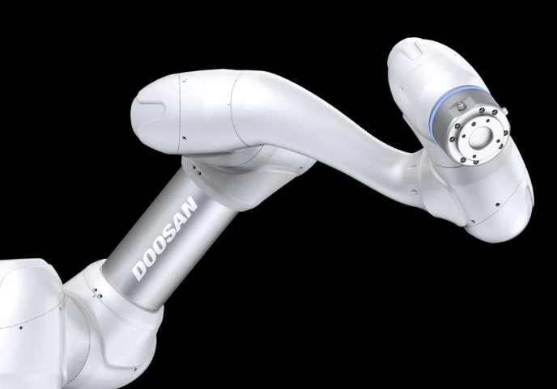

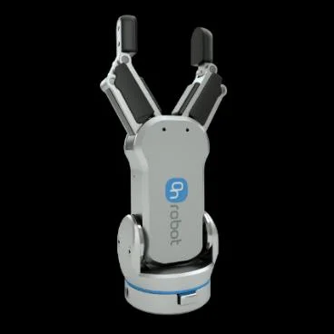

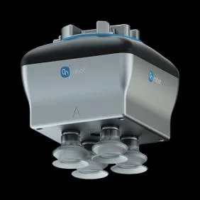

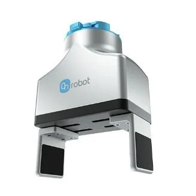

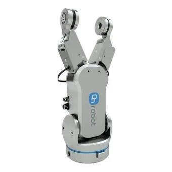

두산 로봇팔과 시뮬레이션 실습
- 로봇 공학 및 자율주행에서의 좌표계(Coordinate System)
1.
World 좌표계
- 작업 환경 전체의 기준이 되는 전역(절대) 좌표계
- 로봇, 물체, 센서 등 모든 요소들의 절대적인 위치를 표현하는 기준. 작업 공간의 특정 위치에 고정
2.
Base 좌표계
- 로봇 자체의 기준 좌표계. 로봇의 바닥이나 첫번째 관절에 위치
3.
Joint 좌표계
- 각 관절(Joint)마다 정의된 로컬 좌표계. 관절에서의 움직임에 따라 변함
- Forward Kinematics, Inverse Kinematics 계산이 중요
4.
Tool 좌표계
- 로봇팔 끝단(end effector, tool)에 정의된 좌표계
- 일반적으로 Gripper, Drill, 용접기 등의 말단 장치 기준
5.
Map 좌표계
- 로봇이 만들어낸 또는 주어진 2D/3D 맴 기준 좌표계. 주로  SLAM, Navigation에서 사용
6.
Odometry 좌표계
- 로봇의 출발 시점을 원점으로 하는 좌표계. 시간이 지남에 따라 오차가 누적됨. 바퀴 회전 등을 통해 추정된 위치를 기준으로 한 로컬 좌표계
7.
기타 좌표계 : Sensor좌표계(LiDAR, IMU등의 센서 고유 좌표계), Camera 좌표계(카메라의 렌즈 중심을 원점으로 하여 Z축이 보는 방향) 등

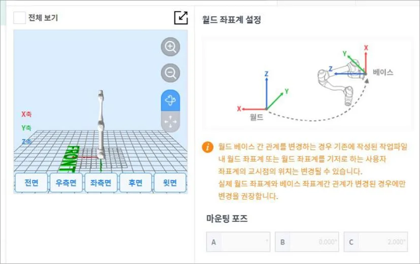

두산 로봇팔과 시뮬레이션 실습
- 로봇 모션
1. MoveJ
로봇의 각 관절이 현재 각도에서 목표 각도로 동시에 이동 후 동시에 멈춤
목표 관절 각도를 입력[Joint1, Joint2, … Joint6]
2. MoveL
로봇 TCP를 직선을 유지하며 목표점까지 이동
목표 위치 및 회전 값을 입력: [X, Y, Z, Rx, Ry, Rz]
3. MovePeriodic
일정한 진폭과 주기로 왕복 이동
TCP란?
Tool Center Point의 약자로 로봇에 장착된 도구의 위치와 방향을 카르테시안 좌표계로 표현함
Rx, Rx, Rz

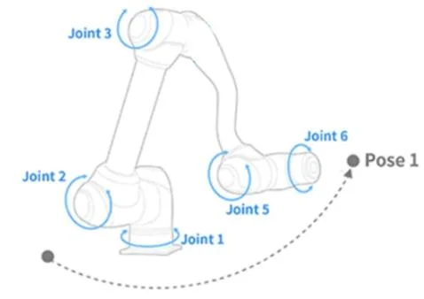

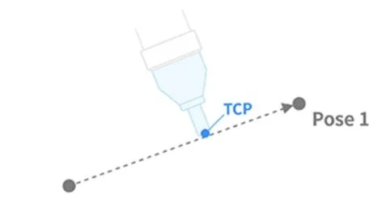

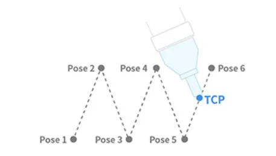

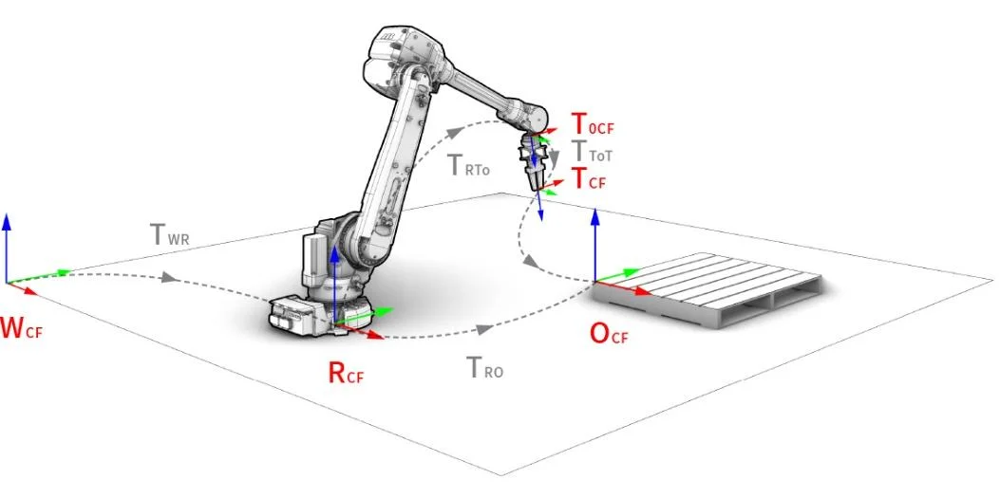

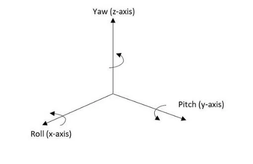

두산 로봇팔과 시뮬레이션 실습
- MoveJ vs MoveL
Type
MoveJ
MoveL
제어
방식
로봇의 모든 관절이 현재 각도에서
목표 각도로 동시에 이동 후 동시에 멈춤
로봇 끝단의 TCP가 선택한 좌표계에 대해 선형 모션(Linear motion)으로 이동
장점
이동 속도가 빠름
로봇 특이점(Singularity)의 영향을 받지 않음
TCP의 이동 경로를 직선으로 유지하므로,
로봇의 이동 경로를 미리 인지할 수 있음
목표 위치를 위치 및 회전(X, Y, Z, A, B, C)으로 표기하므로 대략적인 로봇 끝단의 위치
를 예측할 수 있음
단점
모든 축이 동시에 목표 각도로 회전하기 때문에
이동 경로를 예측할 수 없음
목표 각도를 각 축의 각도로 표기하므로
로봇 끝단의 위치 및 로봇 자세를 예측하기 어려움
MoveJ에 비해 상대적으로 모션의 속도가 느림
로봇 특이점(Singularity)의 영향을 받음
용도
로봇 특이점(Singularity)의 영향을 받지 않으므로 특이점 회피 시 사용
원거리를 이동할 때에 적합함
물체 회피 및 미세한 이동에 적합함
동작
예시
특이점이란?
작업공간의 제한이나 구조적 한계로로봇을 제어할 수 없는 상태를 의미함

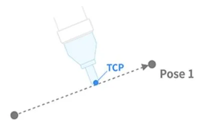

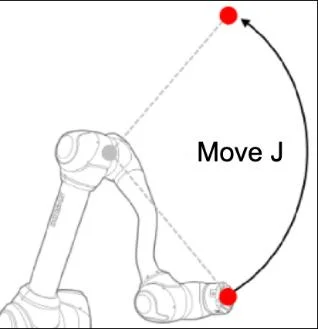

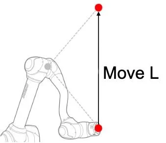

두산 로봇팔과 시뮬레이션 실습
- 특이점(Singularity)
- 다관절 로봇에서 특이점(Singularity)란 간단하게 설명하면 로봇이 이동 중 자신의 다음 자세를 계산하기 어려워하는 위치(또는 점)
- 다관절 로봇의 경우 로봇의 끝단을 기준으로 이동하는 동안의 각 관절의 각도를 계산
- 예를 들면 아래 그림 1의 상태에서 로봇이 빨간 점으로 이동하고자 할 때, 로봇은 그림 2처럼 다음 자세를 A 자세가 되도록 각 관절을 움직
여야 하는 건지 B 자세로 움직여야 하는 건지 판단을 할 수가 없는 상태가 되며 이 위치(또는 점)를 특이점이라고 함

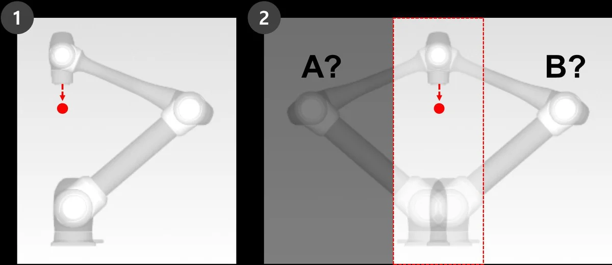

두산 로봇팔과 시뮬레이션 실습
- 로봇 제어 기초 개념
1. ACC(가속도)
로봇 관절의 속도 변화량을 제어하는 파라미터
가속도가 너무 크면 로봇이 정지 상태에서 급격하게 자세를 바꾸기 때문에 위험할 수 있음
2. VEL(속도)
로봇 관절의 속도를 제어하는 파라미터
속도가 너무 크면 동작 중 더 위험한 안전사고를 발생시킬 수 있음
3. Sync Operation(동기 구동)
실행 중인 모션 명령어가 완전히 끝난 후 다음 명령어로 이동
4. Async Operation(비동기 구동)
명령을 실행하자마자 바로 다음 명령 실행(예, 로봇 arm 이동 중 그리퍼 동작)
5. Radius(반경)
반경(mm)을 설정하여 도착점에 도달하기 전 반경 구간에서는 비동기 구동을 활성화
6. Blending Mode(블랜딩 모드)
반경(Radius)을 적용했을 때
선행 모션을 유지하여 중첩 실행할 것인지(Duplicate)
선행 모션을 무시하고 덮어씌울 것인지(Override)를 선택하는 옵션
연속된 움직임을 보다 부드럽고 자연스럽게 수행. 각 지점에서 정지하지 않고 꺾이지 않게 부드럽게 이어지는 경로 생성

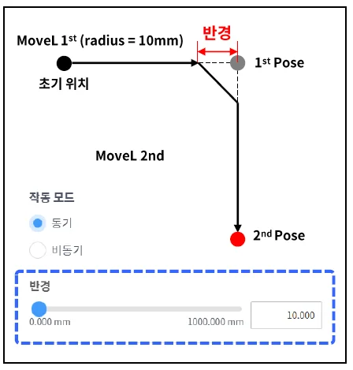

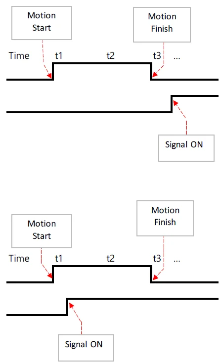

두산 로봇팔과 시뮬레이션 실습
- Sync vs Async
Sync
한 번에 하나의 모션 명령어만
수행하는 것으로 기본값으로 설정되어 있음
제어의 예측 가능성이 높음
Async
한 번에 여러 개의 모션 명령어를
수행하는 것으로 모션이 부드럽게 연결됨
동작을 빠르게 수행하여 작업 효율의 증대
But 제어 로직이 복잡해질 수 있음

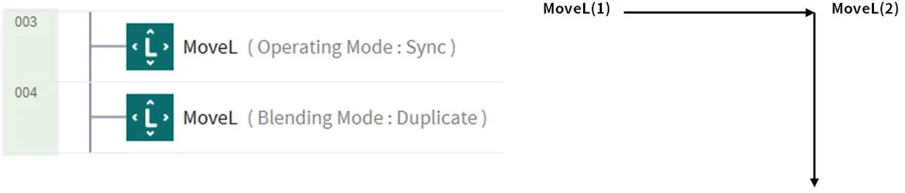

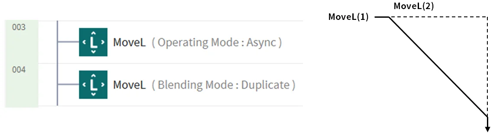

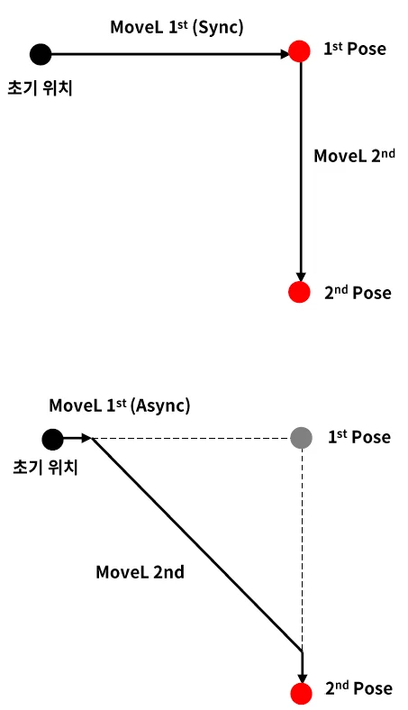

두산 로봇팔과 시뮬레이션 실습
- Blending Option : Duplicate vs Override
Duplicate
- TCP가 반경에 진입했을 때
- 선행 모션을 유지하면서 후행 모션을 실행
- 작업 연속성을 고려한 복잡한 동작 구현에 적합
- 정확도가 중요한 연속경로(용접, 그리기)
- 각 점을 거의 찍으면서 부드럽게 곡선으로 이동
Override
- TCP가 반경에 진입했을 때
- 선행 모션을 덮어쓰는 식으로 후행 모션을 실행
- 즉각적인 작업전환으로 비상상황 대처에 적합
- 속도가 중요한 연속작업(Palletizing, Pick & Place)
- 미리 방향을 틀어서 이동

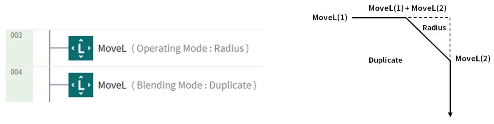

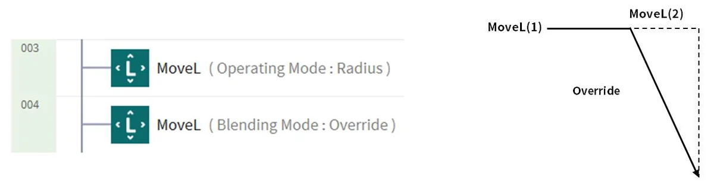

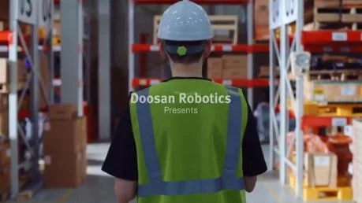

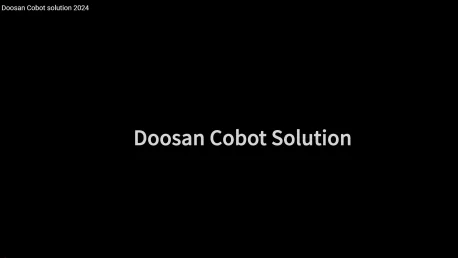

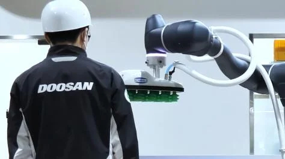

두산 로봇팔과 시뮬레이션 실습
- 로봇 외력 (External Force)
로봇이 환경과 상호작용하거나 외부에서 힘이 가해질 때 로봇에 작용하는 힘이나 토크
1. Compliance Control (순응 제어)
외력에 순응하며 로봇의 움직임을 조절(용수철원리)
외력이 사라지면 로봇이 원래의 목표 위치로 복귀
강성(stiffness)에 따라 부드럽게 반응하는 정도를 조절할 수 있음
주로 충돌 방지, 부드러운 이동, 그리고 안전성이 필요한 환경에서 활용
2. Force Control (힘 제어)
로봇이 외력에 대해 평형을 이루도록 힘을 제어
로봇의 자세가 특이점 영역에 들어가면
힘 제어가 불가능할 수 있으므로 자세 변경 필요
강성이란?
외력에 대해 얼마나 부드럽게 반응할 것인가를 결정하는 파라미터
강성이 작을수록 로봇이 더 부드럽게 작동하고 원상태로 복귀하는 시간이 길어짐
K = F/X
(K는 강성, F는 외력, X는 이동거리
K는 스프링 상수의 역할)

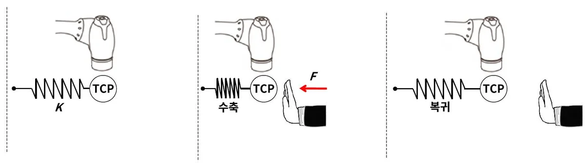

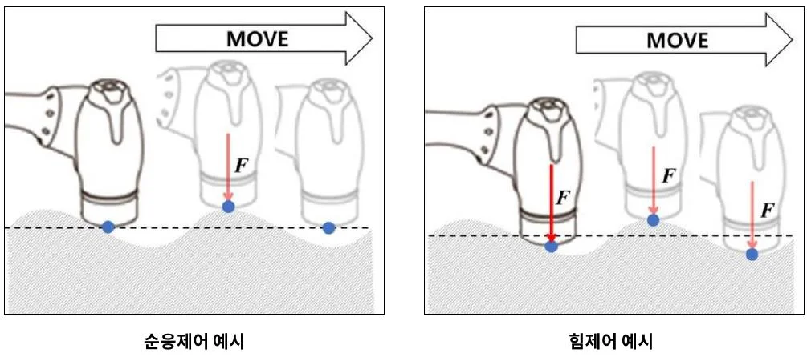

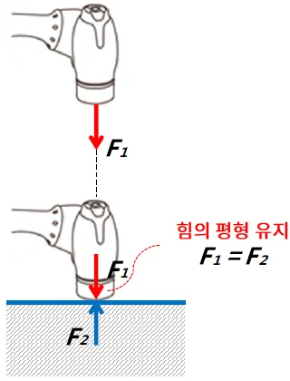

실습
✓실습환경 소개
- 로봇 모델
- m0609
하중 6kg, 최대반경 900mm
6축(6개의 joint) 구성
두산 로봇팔과 시뮬레이션 실습
작업 반경에 따라서 최대 가반하중이 달라지기 때문에 이에 유의해야 함
작업반경
가반하중(Payload)
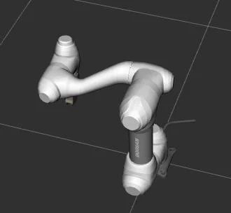

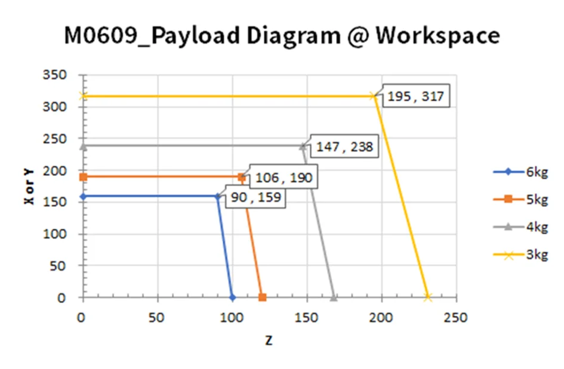

실습
✓실습환경 구축
두산 로봇팔과 시뮬레이션 실습
1.
우측 링크 접속 후 Terminal창에서 순서대로 실행(아래 2번 부터)
2.
01_Install_docker.sh
3.
02_Install_ros_and_dr.sh
4.
source ~/.bashrc
5.
cd ros2_ws
6.
colcon build
7.
source install/setup.bash
8.
source ~/.bashrc
9.
ros2 launch dsr_bringup2 dsr_bringup2_rviz.launch.py mode:=virtual host:=127.0.0.1 port:=12345 model:=m0609
10. Rviz화면에 Doosan Robot이 보이면 새로운 Terminal창에서 아래 명령어 실행
11. cd ros2_ws
12. source install/setup.bash
13. export PYTHONPATH=$PYTHONPATH:~/ros2_ws/install/common2/lib/common2/imp →.bashrc에 직접 추가하기
14. ros2 run example dance
https://boundless-binder-063.notion.site/ROS-and-DR-1389786e552e800480e8d88cfb5f2fb5
- 설치 순서(우측 링크 접속 후 아래 요약내용에 따라 순서대로 실행)
※ 필요한파일 : cpp_qt_plugin.zip
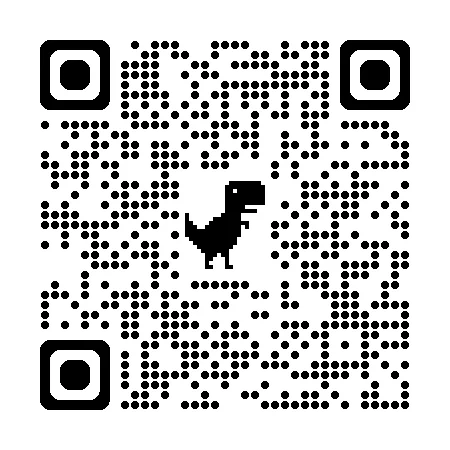

실습
✓실습환경 실행
두산 로봇팔과 시뮬레이션 실습
- 빌드 및 패키지 실행
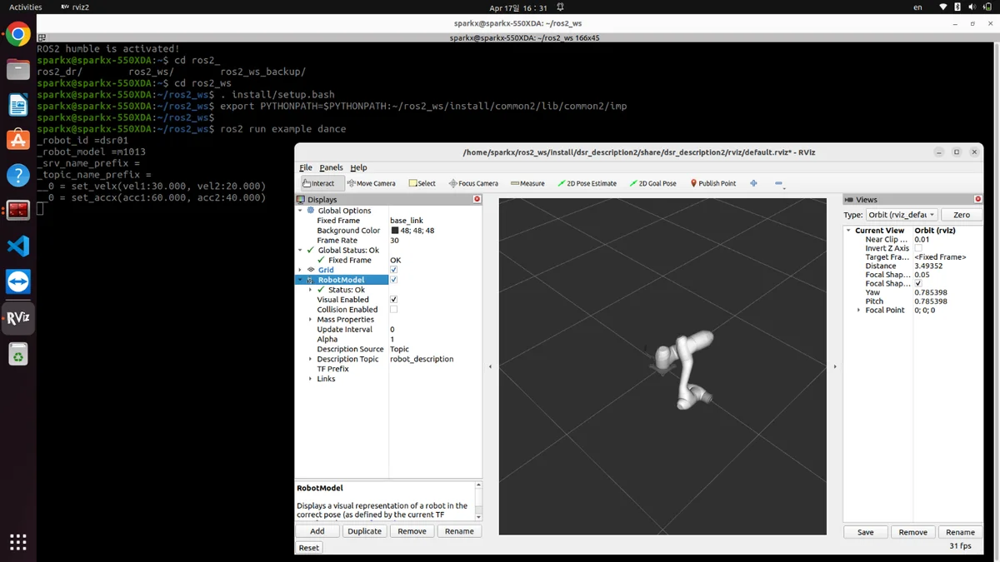

실습
✓실습환경 구축
두산 로봇팔과 시뮬레이션 실습
- Error Control
해당 에러 발생 시
아래 명령어로 환경변수 설정
기타 에러 발생 시
Gazebo simulation 강제 종료 후
다시 실행
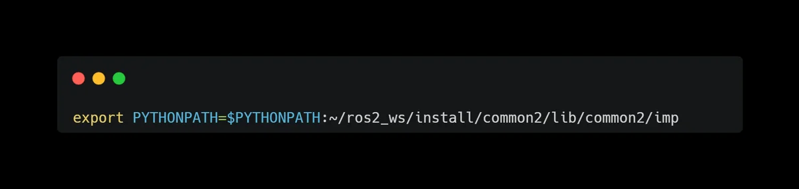

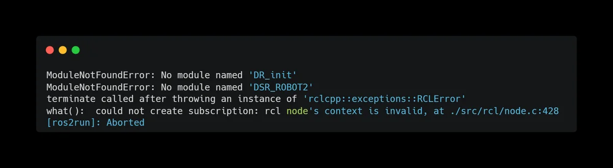

실습
✓실습환경 구축
두산 로봇팔과 시뮬레이션 실습
- GUI 컨트롤러 환경 구축 및 GUI 컨트롤러 실행
※ cpp_qt_plugin.zip을 ros2_ws 디렉토리에 압축풀기
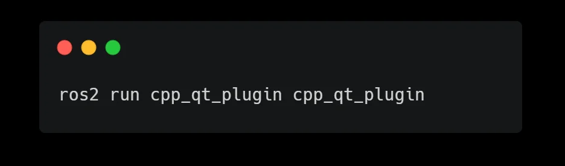

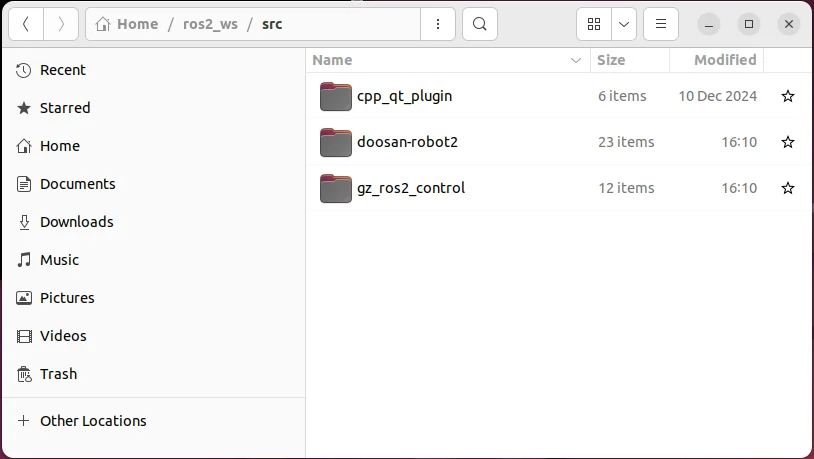

실습
✓실습환경 실행
두산 로봇팔과 시뮬레이션 실습
- Rviz 및 GUI 컨트롤러 실행
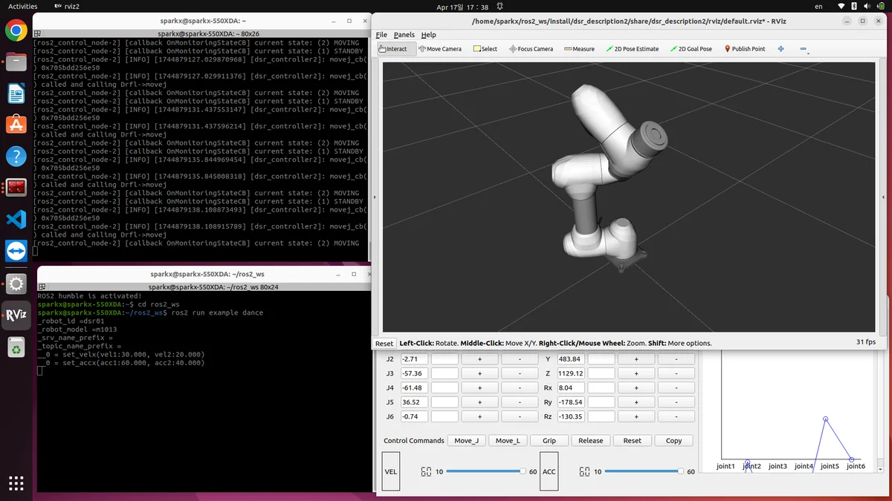

실습
✓실습환경 실행
두산 로봇팔과 시뮬레이션 실습
- Joint값 변경 후 Move_J 실행
해당 그래프는각 Joint의 변화를 시각화함
※ 필히 example dance를 종료해야 GUI의 값 수정사항이 적용되어 Robot이 동작
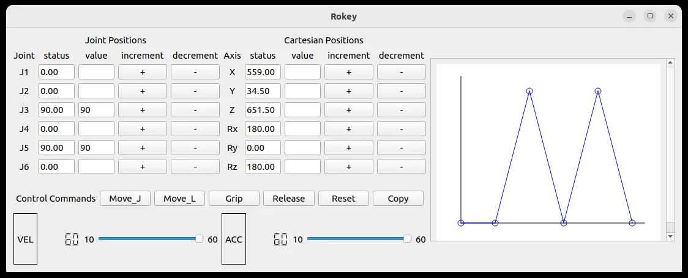

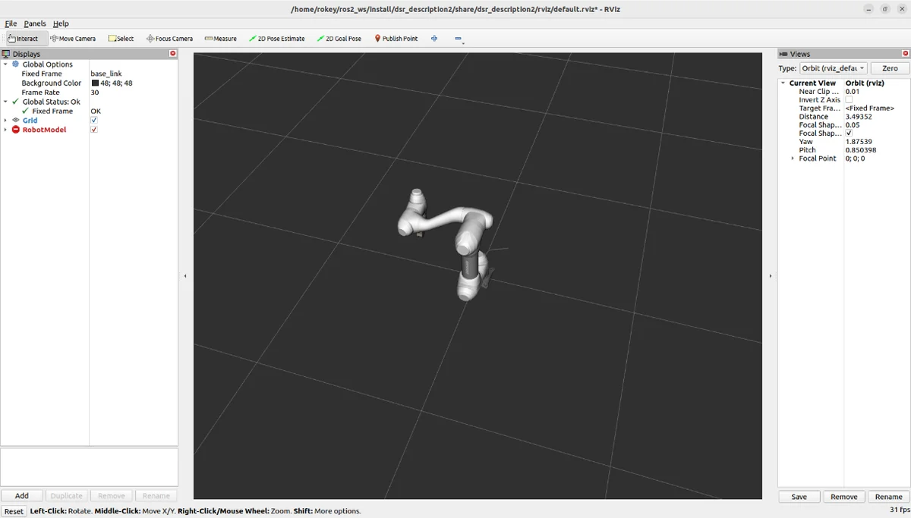

실습
✓실습환경 실행
두산 로봇팔과 시뮬레이션 실습
- copy 버튼으로 값 복사
Ctrl+V를 하면 현재의 Joint값과 TCP의 좌표를 붙여 넣을 수 있음
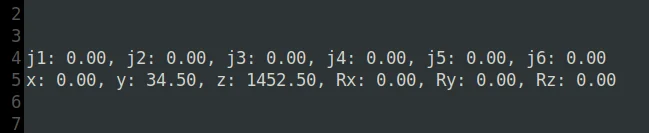

실습
✓실습환경 실행
두산 로봇팔과 시뮬레이션 실습
- 속도 및 가속도 조절
슬라이드 바를 이용해서 속도와 가속도를 변경한 뒤 reset버튼 클릭
더 느리게 움직이는 것을 확인할 수 있음
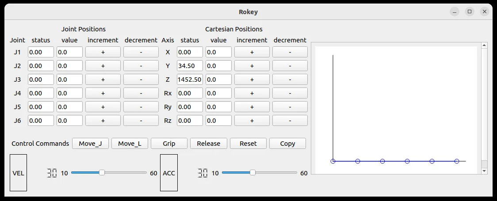

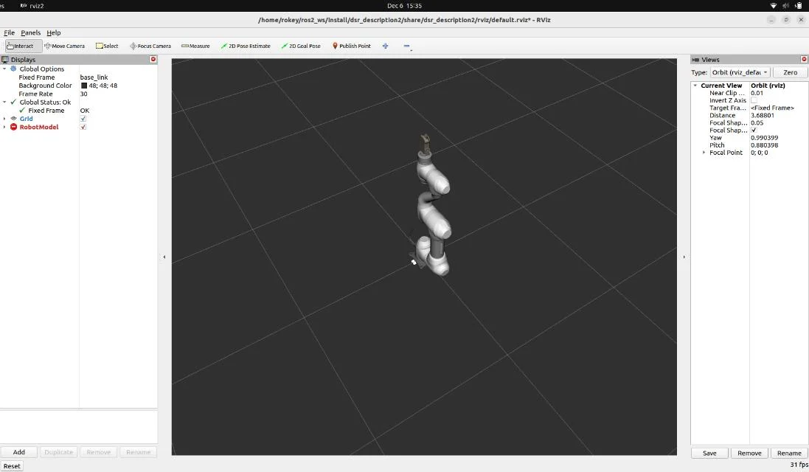

실습
✓실습환경 실행
두산 로봇팔과 시뮬레이션 실습
- RQt로 시각화
Plugin -> Visualization -> Plot 선택
Topic에
/dsr01/msg/current_posx/data[0]
…
/dsr01/msg/current_posx/data[5]
를 추가
current_posx는 TCP의 카르테시안 좌표를 나타냄
빨간 사각형의 그래프 버튼을 눌러
그래프를 더 직관적으로 확인할 수 있도록
다음과 같이 축의 정보를 설정
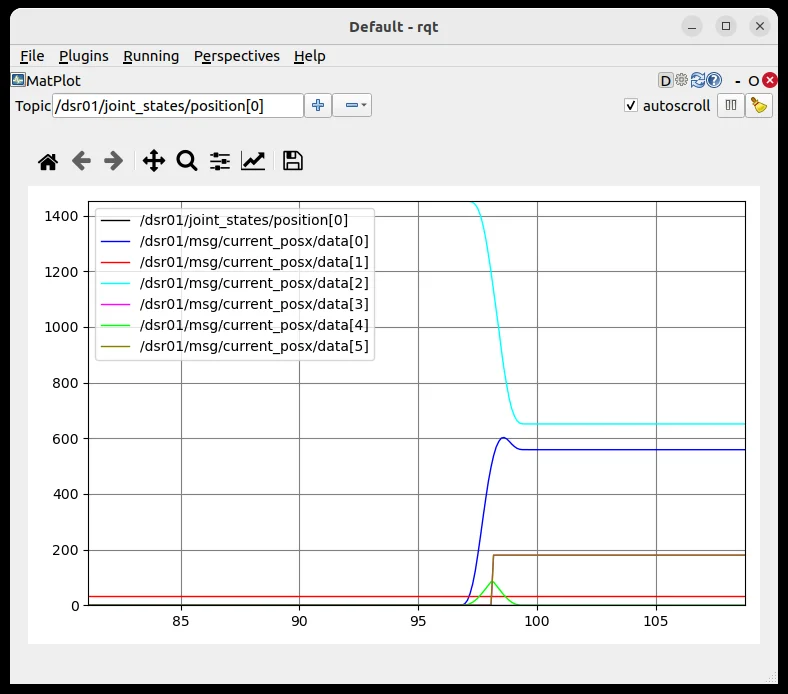

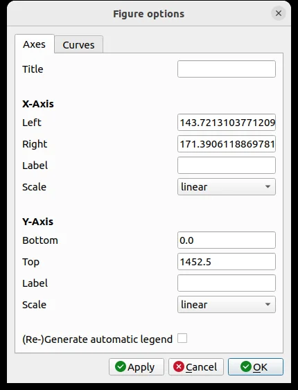

OpenCV와 ROS2 연동

opencv/src의하위디렉토리
publisher와subscriber 구조
OpenCV와 ROS2
실습 환경 구축
- opencv.zip 한눈에 보기
※ $home에 opencv 워크스페이스새로 만들기
※ 필요한파일 : opencv.zip

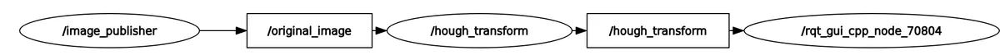

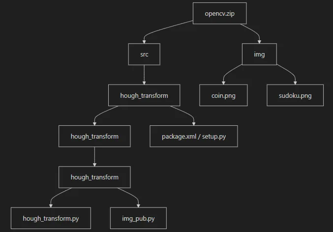
- Step 1. opencv 디렉토리로 이동
- Step 3. colcon build
- Step 2. opencv.zip파일의 압축을 해제후
/src와 /img 파일을 opencv 로 옮기기
- Step 4. source install/setup.bash
OpenCV와ROS2
실습
✓실습 환경 구축

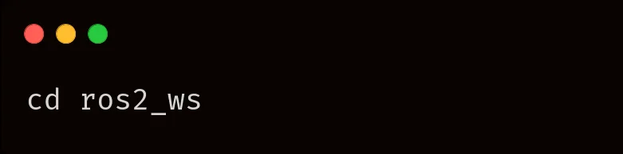

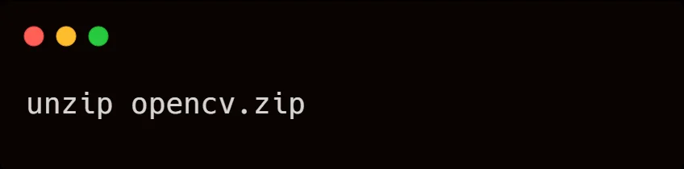

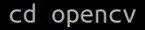

- Step 5. 각각의 터미널에 다음과 같은 명령어를 입력
OpenCV와ROS2
실습

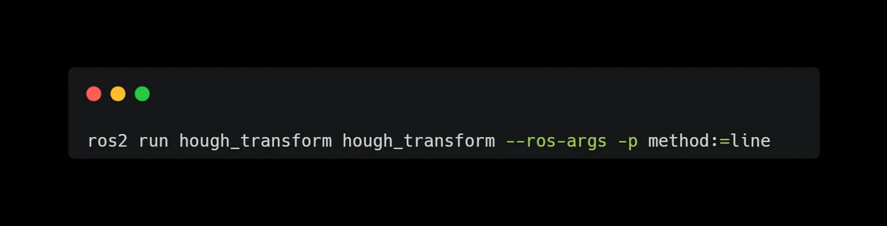


- Step 6. rqt 세팅
OpenCV와ROS2
실습


- Step 7.  토픽 선택
/hough_transform
OpenCV와ROS2
실습


- Step 8. 결과확인: 원본 이미지 vs 허프 변환 이미지
직선을검출해서초록색으로표현함
HoughLinesP()의파라미터를조절하여정확도를높일수있음
OpenCV와ROS2
실습


- Step 9. 결과확인: 노드 그래프
OpenCV와ROS2
실습
그래프가 제대로 보이지 않는다면 Nodes/Topics (active)로 변경 후 새로고침 버튼을 클릭


- Appendix. 직선이외에 circle도 감지 가능
OpenCV와ROS2
실습


- Appendix. 결과 확인
OpenCV와ROS2
실습
※ sudoku.png로 circle검출해보기, coin.png로 line 검출해보기
※ 그 외 다른 그림으로 해보기


OpenCV
- OpenCV
- 컴퓨터 비전 작업을 위한 Python 라이브러리
- 컴퓨터비전
- 인간의 눈 ‘보다’와 인간의 뇌 ‘생각하다’를 처리하는 것
- 카메라를 통해 이미지 데이터를 받아서 전처리/인식/분석 등을 수행함
- 자율 주행, 얼굴 인식 등 다양한 분야에서 활용됨
OpenCV와 ROS2
OpenCV란?


- OpenCV의 특징
좌상단이 (0, 0)으로 원점
OpenCV는 numpy배열
형식으로 표현
주로 numpy배열에 대한
행렬 연산을 수행
OpenCV와 ROS2
OpenCV란?
OpenCV 좌표계
데이터 타입
데이터 연산
( 0 ,  0 )


- 이미지에서 경계를 찾는 방법으로, 밝기 변화가 큰 부분을 찾아 edge로
감지하여 물체의 윤곽을 추출
- Threshold는 얼마나 강한 밝기 변화가 있어야 edge로 인정할지를 결정
하는 기준
Case1
밝기 변화가 threshold1보다 작으면 edge가 아닌 것으로 간주
Case2
밝기 변화가 threshold2보다 크면 강한 edge로 간주
Case3 :
밝기 변화가 threshold1보다 크고 threshold2보다 작으면 약한 edge로 간주
약한 edge는 주변에 강한 edge가 있으면 연결하고 그렇지 않으면 edge가 아닌 것으로 간주
✓Canny Edge란?
OpenCV와 ROS2
Threshold 설정Tip
- 두 값을 너무 낮게 설정하면 →노이즈도 전부 edge로 간주
- 두 값을 너무 높게 설정하면 →진짜 edge까지 놓칠 수 있음
- 일반적으로 Lower는  Upper의 0.4 ~ 0.5로 설정(50, 150)


✓허프 변환이란? Line
- 직선의 방정식을 만들어서 그 직선을 지나는 점의 개수가Threshold
(임계값)을 넘기면 직선으로 판단함
- 수학적 형태를 이루는 점들의 집합을 찾는 방법
- 점이 흩어져 있는 복잡한 이미지에서 찾고 싶은 패턴(직선, 원, 타원)
을 수학적으로 그 패턴을 만족하는 점들을 모아서 찾는 방법
- 끝점좌표(x1, y1, x2, y2)를 반환해서 바로 직선을 그릴 수 있음
Rho(Ρ해상도, 픽셀)와 Theta(θ해상도, 라디안)
직선을 얼마나 촘촘히 계산할 것인가를 설정하는 파라미터
값이 클수록 정확도는 증가하지만 연산량이 늘어남
threshold
직선이 되기 위한 점의 최소 개수를 정의하는 파라미터
threshold값이 작아질수록 더 많은 직선이 검출됨
(ex, 50 = 50개 이상만 모이면 직선으로 인정)
minLineLength(검출할 최소 선분 길이)
직선 길이가 n이상일 때 직선으로 판별하는 파라미터
minLineLength값이 작아질수록 더 많은 직선이 검출됨
(ex, 50=선분 길이가 50픽셀보다 짧으면 무시)
maxLineGap(선분간 최대 허용간격)
각 픽셀 사이의 거리가 n이상일 때 직선으로 판별하는 파라미터
작을수록 뭉쳐있는 픽셀 덩어리를 직선으로 인식할 확률이 큼
(ex, 10=10픽셀 정도의 빈틈은 무시하고 선을 이어서 본다)
OpenCV와 ROS2
y = mx + b →극좌표계로 표현
Ρ(rho) = x cos θ + y sin θ(theta)
Ref. HoughLines(image, rho, theta, threshold)


이미지에서 edge를 검출하고 각 edge에 속한 점들에 대해
가능한 모든 원의 중심과 반지름을 계산
원의 중심으로 검출된 수가 threshold를 넘기면
그 좌표에서의 값이 원의 중심과 반지름이 됨
✓허프 변환이란? Circle
OpenCV와 ROS2
Edge 검출(Canny, Sobel, Laplacian) →Line or Circle(Hough Transform)


✓허프 변환이란? Circle
method
보통 OpenCV에서는 HOUGH_GRADIENT만 사용함
dp(해상도 축소 비율)
허프 변환의 해상도 비율을 설정하는 파라미터로, 값이 작을수록 더 높은
해상도로 원을 탐지하여 정확도가 증가하지만, 연산량이 늘어남.
보통 1이나 1.5정도 사용
minDist(검출된 원들 간 최소 거리)
검출된 원들 사이의 중심점 거리의 최소값을 설정하는 파라미터로, minDist
값이 작을수록 서로 가까운 원들이 많이 검출될 수 있으며, 중복된 원이 검출
될 가능성이 큼(ex, 50= 중심 간 거리가 50픽셀 이상 떨어진 원만 따로 인정)
Param1(Canny Edge 검출의 높은 임계값)
Canny edge 검출기의 상한 임계값을 설정하는 파라미터로, param1 값이
작을수록 더 약한 edge도 검출됨.
Param2(원 후보로 인정할 허프 누적기의 투표 수 임계값)
원 검출을 위한 허프 변환의 임계값을 설정하는 파라미터로, 값이 작을수록
원이 될 가능성이 있는 더 많은 후보가 검출되지만 노이즈가 많아질 수 있음.
높으면 더 강한 원만 찾음. (ex, 30=30 이상의 투표가 모이면 원으로 인식)
minRadius, maxRadius
minRadius와 maxRadius는 검출할 원의 최소 및 최대 반지름을 설정하는
파라미터로, 범위가 넓을수록 다양한 크기의 원이 검출됨
(ex, minRadius=10 →반지름 10픽셀보다 작은 원은 무시,
maxRadius=100 →반지름 100픽셀보다 큰 원은 무시)
OpenCV와 ROS2


✓코드 설명- img_pub.py
OpenCV와ROS2
실습
- Node 클래스를 상속받아 image_publisher라는 ROS2 노드 생성
- 파라메터를 받아오는 메서드 호출
- CvBridge를 초기화
- OpenCV 이미지 → ROS2 sensor_msgs/Image 변환
- Image type 메시지를 original_image Topic으로 publishing, 10=버퍼크기
- self.setup_timer로 퍼블리시 주기(0.1초)를 설정
- Import
- Image : sensor_msg 패키지에서 제공하는 이미지 데이터 타입
- cvBridge : ROS2의 이미지 데이터를 Python에서 사용 가능하게 변환해주는 클래스
- cv2 : openCV 함수를 사용하기 위한 클래스
- ImagePublisher 클래스 정의
※ 확인!!!
$ ros2 interface show sensor_msgs/msg/Image


- declare_and_fetch_parameters()
• 명령어의 인자로 전달된 이미지 경로를 저장함
• 만일 명령어 인자가 없다면 오류를 출력하는 함수
• image_path라는 이름으로 파라메터 선언하고image_path_param에 저장
- setup_timer()
• self.create_timer(0.1, self.publish_image) 함수를 이용하여 publish_image함수가 0.1초
(10Hz)마다 이미지를 publishing하도록 설정하는 함수
- publish_image()
• 이미지 파일을 불러온 후 imgmsg 형식으로 전환한 다음 publishing하는 함수
• openCV로 self.image_path경로의 이미지를 읽어 cv_image에 저장
• cv_image(numpy array, dtype=uint8, shape=(h, w, 3)) → ROS2 이미지 메시지로 변환
• ros_image 메시지(sensor_msgs/msg/Image) 안에 encoding=“bgr8”, data=image
• ※ 만약 흑백(grayscale)이미지를 publishing하고 싶다면? →mono8(8bit grayscale)
OpenCV와ROS2
실습
✓코드 설명- img_pub.py


OpenCV와ROS2
실습
- 메인함수 선언
메인함수 선언 및 publisher 실행
✓코드 설명- img_pub.py
핵심 Process
cv2_to_imgmsg 변환 후 publishing
파일 읽기 cv2.imread
- imgmsg_to_cv2 변환
- Hough Transform 원/선 검출
- cv2_to_imgmsg 변환후
- publishing


✓코드 설명
OpenCV와ROS2
실습
- Import
✓코드 설명- Hough_transform.py
- Node 클래스를 상속받아 hough_transform이라는 ROS2 노드 생성
- method라는 ROS2 파라메터를 선언하고 받아옴(--ros-args –p method:=circle)
- method의 default = “”(빈 문자열), self.metho에 저장
- CvBridge 객체 생성(OpenCV 이미지 → ROS2 sensor_msgs/Image 변환)
- “original_image”라는 Topic을 subscribing
- 메시지가 도착하면 self.process_image callback 함수가 호출됨(Queue size=10)
- 처리된 image를 publishing 할publisher 생성. Topic이름은 “hough_transform”
- 데이터 타입은 sensor_msgs.msg.Image
- method를 line 또는 circle 중 하나를 지정해야 함


OpenCV와ROS2
실습
✓코드 설명- Hough_transform.py
- process_image()
• subscribe node의 콜백 함수로, 이미지를 ros2 imgmsg형식에서 numpy array로 변환 후,
method(line/circle)에 따라서 “Hough Transformation＂을 수행 한 다음 다시 ros2 imgmsg로 바꾸어 publish하는 함수
• encoding은 bgr8(blue, green, red, 8bit)
• Method가 circle이면 원을 찾고, line이면 선을 찾으며 둘 다 아닌 경우 에러 출력
• 처리된 OpenCV이미지를 다시 ROS2 메지지로 변환하고 “hough_transformation” Topic으로 Publishing함


OpenCV와ROS2
이론
✓코드 설명
- detect_circles()
• 이미지를 컬러에서 흑백으로 변환
• cv2.HoughCircles() 함수를 적용하여 원 탐지
• GaussianBlur로 노이즈 제거 후 원 찾기
• parameter
①1 : 이미지와 누적 버퍼의 해상도 비율
③Param1 : Canny Edge 검출기 상한
⑤minRadius, maxRadius : 찾고자 하는 원의 최소/최대 반지름
• 원이 발견되면 그려줌(큰 초록색원과 중심에 빨간 점 표시)
- detect_lines_image()
• 확률적 Hough Transformation으로 직선을 찾음
• Parameter
①1 : 거리해상도(pixel단위)
③10 : 최소 투표수
⑤2 : 선분 끝점들 사이의 최대 간격
• 선이 그려진 이미지를 리턴
②20 : 원 중심 간 최소거리
④Param2 : 원 검출 threshold
②np.pi/180 : 각도 해상도(라디안)
④20 : 선분의 최소 길이


- 메인함수 선언
메인 함수를 선언하고 HoughTransform()을 실행
OpenCV와ROS2
이론
✓코드 설명
핵심 Process
cv2_to_imgmsg 변환 후 publishing
파일 읽기 cv2.imread
- imgmsg_to_cv2 변환
- Hough Transform 원/선 검출
- cv2_to_imgmsg 변환후
- publishing


OpenCV와ROS2
shape(2, 2, 3) →(h=2, w=2, 3ch)
sensor_msgs.msg_Image
bgr →
sensor_msgs.msg_Image
항목
값
설명
Height
이미지 높이(2행)
Width
이미지 너비(2열)
Encoding
“bgr8”
포맷, 3채널, 8bit uint
Is_bigendian
0=little_endian, 1=big_endian
Step
1줄당 전체 바이트 수 = 너비(2) x 채널(3)
Data
[255, 0,…]
전부 1차원으로 펼쳐진 픽셀 데이터
※ step 계산법 : Step = width x (채널 당 바이트 수 x 채널 수)
↑ 687 = 229 x 3(bgr8)
222 x 229 x 1(mono8)
Step = ?
[255, 0, 0, 0, 255, 0, 0, 0, 255, 255, 255, 255]
Big-Endian(일부ARM) vs Little-Endian(x86계열)


WorkSpace관리
Workspace 관리
다수개의 Workspace(프로젝트) 관리
.bashrc에 추가한 function
opencv workspace로 이동
ros2_ws  workspace로 이동


Lane Detection


- 차선인식은...
- 차선 인식은 도로상의 차선을 감지하고 추적
- 사용 기술
- 이미지 전처리: 이미지를 차선 감지에 적합하게 보정(노이즈 제거, 색상 변환, 관심 영역 설정 )
- 슬라이딩 윈도우 기법 : 이미지 상에서 연속된영역을 이동하며 차선을 찾고, 연결하여 차선을 추정
- 활용 분야
- 차선 이탈 경고 시스템, 자율 주행 시스템 등
ROS2와 차선인식
차선인식
이미지 전처리
슬라이딩 윈도우
자율 주행


실습환경구축
ROS2와 차선인식
완성된 lane detection 실습 화면 한눈에 보기


실습환경구축
- Publisher와 subscriber 구조
1. /video_frame을 subscribe_node에 연결
2. /processed_frames와 /lane_info_marker를 Rviz에 연결
subscriber_node.py는
publisher_node.py로부터동영상 프레임을 구독하고
camera_processing.py와slide_window.py를
import하여차선을 감지
ROS2와 차선인식
실습 환경 한눈에 보기
opencv의 하위 디렉토리
opencv
lane_detect.zip 파일 →기존opencv 안에 아래와 같이 압축 풀기
※ 필요한파일 : lane_detect.zip


실습환경구축
ROS2와 차선인식
실습 환경 한눈에 보기


실습하기
실습
ROS2와 차선인식
opencv 디렉토리 구조
vscode 구조


실습하기
- Step 2. video 경로설정
opencv폴더 아래에 /video폴더를 이동 시킴
- Step 3. 소스코드 경로 설정
opencv/src폴더 아래에 /lane_detect폴더를 이동 시킴
실습
ROS2와 차선인식
- Step 1. lane_detect.zip파일 압축 해제
opencv


실습하기
- Step 4. 패키지 빌드하기
실습
ROS2와 차선인식

실습하기
영상 publishing
영상 subscribing하고 차선 인식한 이미지를 다시 publishing
실습
ROS2와 차선인식
Terminal3
rviz2
Terminal2
ros2 run lane_detect subscriber_node
- Step 5. 3개의 터미널창에 각각 명령어를 입력한다.
Terminal1
ros2 run lane_detect publisher_node --ros-args -p video_path:=/video/track_video_1.mp4


실습하기
실습
ROS2와 차선인식
- Step 5. 터미널 화면


실습하기
- Step 6. rviz2 설정하기
실습
ROS2와 차선인식


실습하기
- Step 6. rviz2 설정하기
실습
ROS2와 차선인식
왼쪽 차선의 x좌표
오른쪽 차선의 x좌표


ROS2와 차선인식
실습
✓전체 코드핵심 정리


ROS2와 차선인식
실습
✓코드와 설명: publisher_node.py
self.declare_and_fetch_parameter()
- video경로 가져오기

cv2.VideoCapture()
- 해당 경로의 video 읽어오기
publisher에서 사용할 모듈 import

ROS2와 차선인식
실습
✓코드와 설명
- declare_and_fetch_parameters()
os 모듈의 os.path.dirname()과 os.path.realpath()를 사용해현재 video_path의 절대 경로를 얻음

ROS2와 차선인식
실습
✓코드와 설명
- setup_timer() / timer_callback()
fps를 기준으로 video를 publishing할 시간 간격을 지정video의 한 프레임씩 읽어서publishing함
만약 video를 더 이상 읽을 수 없다면(video가 끝나면) video의 처음 위치로 돌아가서 다시 재생함
fps가 30이므로 1/30sec = 0.03sec = 30ms = 30회/초당

ROS2와 차선인식
실습
✓코드와 설명
- main()
main()에서 ros2를 초기화하고 30fps으로 video를 publishing함
만약 publisher가종료되면 VideoCapture()에 할당된 자원을 해제
※ 4분 18초(258초), 30fps x 258초 = 7740frames


ROS2와 차선인식
실습
✓코드와 설명
- subscriber_node.py
visualization_msgs.msg import Marker
Rviz에 텍스트를 시각화하기 위한 모듈
from lane_detect import slide_window
from lane_detect import camera_process
전처리를 위한 camera_process, 차선인식을 위한 slide_window


ROS2와 차선인식
실습
✓코드와 설명
- __init__()
video_frames토픽에서 이미지 구독
rviz에게 전달할 이미지와 marker 메시지 publisher 선언
camera_process객체와 slide_window 객체 선언
node이름
Topic 이름
Image 타입 메시지
처리된 이미지를 processed_frames Topic에 publishing 할 publisher 생성
lane 검출 정보를 시각화(RViz) 할 Marker를 publishing 할 publisher 생성
이미지 전처리 및 lane 추출을 위한 두 개의 인스턴스 생성


ROS2와 차선인식
실습
✓코드와 설명
- callback()
차선인식 함수를 호출하여
차선인식 여부와 차선의 좌표,
차선이 시각화된 이미지를 받고
publishing한다
- Marker()
header: 좌표계와 타임스탬프를 정의
type: 마커의 형태 지정(텍스트)
pose: 텍스트의 위치
scale: 텍스트의 크기
color: 텍스트의 색상과 투명도
text: 표시할 텍스트 내용
※ video_frames Topic으로 들어온 Image 메시지를 처리하는 callback
ROS2 Image 메시지를 OpenCV Numpy 배열로 변환
변환한 frame을 lane_detect 메서드에 넘겨 lane검출 수행
- detected : lane 감지 여부
- Left, right : lane 좌우 위치
- Processed : 처리된 프레임
left 또는 right 문자열로 변환
- RViz용 마커 이미지 생성
- 좌표계는 map
- 현재 시간으로 설정
- 마커 타입은 Text
- 카메라 기준으로 글자가 정면
- 텍스트 높이 2m, 글자크기 0.5
- 불투명한 흰색
마커에 위에서 만든 Text 넣고 Publishing
processed를 다시 imgmsg로 변환하여 publishing


ROS2와 차선인식
실습
✓코드와 설명
- lane_detect()
process_image() →이미지에 전처리 적용
frame[frame.shape[0] - 200:frame.shape[0] - 150, :] →전처리된 이미지 영역 자르기
slide() →슬라이딩 윈도우 적용하여 차선의 시작 좌우 좌표를 반환
lane_visualization →차선 인식한 위치를 수직으로 확장하여 표시
※ 1개 frame에 대해 lane 검출하는 메서드
frame 맨 아래쪽 일부분(200 ~ 150픽셀 높이)을 잘라냄
Slide window로 lane  검출 수행(좌우 lane위치, 검출 성공여부 반환)
검출 결과를 시각화
processed_frame에 저장해두고 최종 처리된 결과를 반환
[ 요약 ]
1. 받은비디오 프레임을 전처리
2. lane 검출
3. 결과를 publishing
4. 상태를 Text로 보여줌
( 0 ,  0 )
-200
-150
frame.shape = (480, 640)


ROS2와 차선인식
실습
✓코드와 설명
- main()
main()에서 ros2를 초기화하고 실행


- camera_processing.py
차선을 검출하기 위한 전처리 과정
다음의 단계를 거쳐 원본 이미지를 차선 인식을 위한 이미지로 변환
흑백 변환
조명 제거
중위수 필터
이진 변환
Warp변환
차선 곡률 파악
✓코드와 설명
ROS2와 차선인식
실습


1. 흑백 이미지로 변환하기
ROS2와 차선인식
실습
✓코드와 설명
GRAY SCALE로 변환
조명(빛 반사 등)으로 인한 Noise를 제거하는 함수(조명 보정)


2. 조명 제거 알고리즘 적용하기
원리
1. GaussianBlur →흑백 변환 후 블러 적용
블러는 이미지를 흐릿하게(부드럽게) 만들어서 이미지의 디테일을 삭제하고
빛의 변화가 큰 부분(특징 강조)만 남김(조명 얼룩, 고주파 성분 줄여 노이즈 제거)
2. subtract →기존 이미지(원본)에서 블러된 이미지 제거
     기존 이미지에서 빛의 변화에 의한 효과를 삭제하되 디테일(밝기 차이)은 남겨둠
3. normalize →이미지의 빛 범위를
최소0, 최대 255로 조정하여 밝기(명암 대비)를 균일하게 만듦
조명 제거 알고리즘에 이진 변환까지 적용한 모습
조명 제거 적용한 모습
ROS2와 차선인식
실습
✓코드와 설명


ROS2와 차선인식
실습
✓코드와 설명
3. 배경과 흰색 차선을 분리하기(이진화, thresholding)
- 픽셀의 밝기가 설정한 임계값(bin_threshold=10)보다 크면 255(흰색), 작으면 0(검정색)으로 변환
- BinThreshold값을 바꾸면 더 정확히 분리할 수 있음
- 하지만 조명이나 빛 반사 때문에정확도가 떨어질 수 있음→조명 제거 알고리즘 필요


4. medianBlur 적용
- 조명 제거를 했지만 아직 노이즈가 잔존→중위수 필터(medianBlur) 적용
- 작은 노이즈 제거 및 연속된 경계선 유지
ROS2와 차선인식
실습
✓코드와 설명
MedianBlur란?
- 주로 급격하게 튀는 노이즈, 흔히 소금-후추 잡음(salt & pepper noise)
이라 불리는 노이즈를 제거하는데 효과적인 알고리즘
- 픽셀 주변 이웃값의 “중간값＂으로 현재 픽셀을 대체하는 필터
- Edge는 잘 보존하고 잡음만 깔끔하게 제거
×
이미지 파일에 대해서 3×3필터 영역 지정
총 9개의 픽셀에 대해서 중간값 선택하여급격하게 튀는 값(이상치)를 제거
또한 필터의 사이즈를 3×3, 5×5, 7×7로 늘릴 수 있으며 (홀수만 가능) 사이즈가 커질수록
노이즈 제거 성능이 우수해지는 반면, 연산량 또한 많아짐
[20, 21, 19]
[20, 21, 19]
[22, 200, 18]   →[18, 19, 20, 20, 21, 21, 22, 22, 200]  →[22, 21, 18]
[21, 20, 22]
[21, 20, 22]
↑ 중간 값 21
5. Warp변환(이미지투시변환)으로 차선을 평행하게 만들기
현재 medianBlur까지 적용한 모습
하지만 차선이 가까운 곳은 넓고 먼 곳은 좁은 형태로 원근법이 적용되어 있음
warp변환을 이용해서 원근법을 제거하고 평행한 차선을 얻으려 함
ROS2와 차선인식
실습
✓코드와 설명


5. Warp변환으로 차선을 평행하게 만들기
Warp변환은 행렬의 투시변환을 이용하여 구현
먼저 원본이미지에서 원근에 따른 차선 영역의 좌표를 설정
(아래 이미지에서 빨간색으로 표시한 좌표)
해당 좌표의 영역이 평행한 차선으로 변환됨
ROS2와 차선인식
실습
✓코드와 설명
※ Warping 과정 요약
1.
원본 이미지에서 4개 포인트를 지정(src)
2.
변환 후 목표로 할 4개 포인트를 지정(dst)
3.
OpenCV 함수로 변환 매트릭스를 계산
4.
변환 적용


5. Warp변환으로 차선을 평행하게 만들기
차선을 평행하게 변환할 영역의 좌표를 정의
ROS2와 차선인식
실습
✓코드와 설명
- 원근감을 없애서 평행하게 보이도록 만듦
- 단, 화면을 왜곡시키는 것이기 때문에 중앙의 점선이 지나치게 길어 보임
( 140 ,  0 )
( 140 ,  480 )
( 500 ,  0 )
( 500 ,  480 )


6. 차선의 곡률 파악하기
차선의 곡률, 즉 직진, 좌회전, 우회전을 파악하면이미지 전처리나차량
제어에 유용함
Sobel 필터 이용하기
Sobel 필터는 3×3 크기의 필터로, 값의 설정에 따라 X축, Y축, 또는 대각선 경계를
추출하여 이미지의 경계를 감지하는데 사용됨
- 미리 선언한 커널(필터)들을 차례로 적용시키며가장 많은 경계를 검출한 필터를
best_kernel(절대값 합)로 저장
- cv2.filter2D() 함수를 이용하면 kernel을 적용한 이미지를 얻을 수 있음
- 따라서 직진하고 있을 때는수직 방향의 필터를 적용하고 좌회전, 우회전할 때는
대각선 방향의 필터를 적용함
- 차선을 더 명확히 처리할 수 있음
- 진행 방향 판단, 차선의 형태 분석 등에 활용
ROS2와 차선인식
실습
✓코드와 설명
가장Edge가 강한 필터 고르기


- 전체 코드
✓camera_processing.py
ROS2와 차선인식
이론


- slide_window.py
- Slide() →왼쪽과 오른쪽 차선을 찾고 차선 간 거리 기준으로 중심선을 업데이트
- Lane_visualization() →찾은 차선을 기반으로 윈도우를 따라가며 차선 전체를 그려줌
ROS2와 차선인식
✓코드와 설명
이론
이미지 ROI설정
슬라이딩 윈도우
파라메터 설정
슬라이딩 윈도우에서
차선을 찾은 경우
슬라이딩 윈도우
순회 탐색
슬라이딩 윈도우에서
차선을 못찾은 경우
수직 방향으로
차선 감지 및 시각화
ROS2와 차선인식
✓코드와 설명
이론
1. 이미지 ROI설정하기
subscriber_node.py에서 slide_window알고리즘을호출할 때 이미지의 일부만 잘라서 전달한다.
차선이 시작하는 가장 아랫부분을 잘라서 전달함
※ [질문] 왜 맨 아래쪽 이미지부터 사용하지 않을까?
-200
-150


2. 슬라이딩 윈도우 기본변수 세팅
이전의 warp변환에서 왼쪽 차선을 140,
오른쪽 차선을 500으로 설정했기 때문에
차선의 가운데를 320, 차선의 너비를 360으로,
왼쪽 초기값을 140, 오른쪽 초기값을 500으로 설정
- window_height, window_width :
슬라이딩 윈도우의 크기이고,
- minpix : 픽셀 임계값
윈도우 안의 이미지에 존재하는 흰색 픽셀의 개수가
임계값을 넘기면 차선이라고 판단
ROS2와 차선인식
✓코드와 설명
이론
500 – 140 = 360
500 + 140 = 640 /2 = 320
- 차선은 세로로 긴 구조라서 세로방향 슬라이딩이 적고
- 가로방향으로 부드럽게 세밀하게 찾기 위해 가로가 큼(30)
- 노이즈에 강하고 진짜 차선만 찾는 적당한 숫자(흰색 점 40개)


2. 슬라이딩 윈도우 기본변수 세팅
- nonzeroy, nonzerox : 0 이 아닌 모든 픽셀 좌표를 가져오기. 차선처럼 보이는 픽셀을 찾기 위함
- nonzero는 흰색(255) 픽셀 좌표만 모음→차선 후보 픽셀
- left_idx, right_idx : 왼쪽과 오른쪽 창의 탐색 위치를 조절하는 데 사용
ROS2와 차선인식
✓코드와 설명
이론


- 이미지를 윈도우 단위로 자르고유효한 픽셀이 충분한지 확인
- (유효한 픽셀 개수가 minpix보다 큰지 확인)
- 중앙에서 왼쪽/오른쪽으로 sliding하면서 “흰색 점 뭉치＂를 찾는다.
- 만약 찾지 못했다면 left_idx/right_idx를 1증가시켜 다음 윈도우를 탐색
- 차선을 찾았다면find_left/find_right를 True로 변경
3. 슬라이딩 윈도우 순회하기
ROS2와 차선인식
✓코드와 설명
이론


4. 슬라이딩 윈도우에서 차선을 찾은 경우(case 1: 양쪽 모두)
※ 양쪽 다 찾은 경우→  dist, center_old, left_old, right_old 등 여러 변수들을 업데이트하고차선 정보(both)를 반환
ROS2와 차선인식
✓코드와 설명
이론


4. 슬라이딩 윈도우에서 차선을 찾은 경우(Case 2: 한 쪽만)
※ 한쪽만 찾은 경우→center를 보정하고 감지하지 못한 차선의
좌표는 left_old/right_old 값으로 대체하여 반환.
예전 차선 위치와 비교해서 “shift” 고려
ROS2와 차선인식
✓코드와 설명
이론


이론
- 이전의 값(old값)으로 대체하여 반환
- 이유? 이번 프레임에서는 못 찾았지만, 차선이 갑자기 사라지지 않았을 거라
는 가정하에 이전 값을 사용
아래의 이미지처럼 가로 방향으로
차선의 왼쪽 좌표와 오른쪽 좌표를 구할 수 있다.
✓코드와 설명
5. 슬라이딩 윈도우에서 차선을 못 찾은 경우(Case 3: 못 찾음)


6. 세로 방향으로 차선 감지하고 시각화하기
✓코드와 설명
ROS2와 차선인식
처음 찾은 차선을 기준으로 슬라이딩 윈도우를 아래에서 위로이동하면서 세로
방향의 차선을 찾음
left_lane_pts/right_lane_pts에각각 좌우 차선의 좌표를 저장하여 시각화


- 전체 코드 : indent에 주의
✓slide_window.py
ROS2와 차선인식


- 전체 코드 : indent에 주의
✓slide_window.py
ROS2와 차선인식


Open3D
- Open3D
- 컴퓨터 그래픽과 3D 데이터 처리 작업을 위한 Python 라이브러리
- 3D 데이터 처리
- 인간이 물체를 '보는' 방식과 이를 '이해하고 분석하는' 과정을 모방함
- 센서나 스캐너를 통해 3D 포인트 클라우드 데이터를 받아서 전처리/분석/시각화를 수행함
- 자율 주행, 로봇 공학, AR/VR 등 다양한 분야에서 활용됨
Open3D와 ROS2
Open3D란?


Open3D와 ROS2
Open3D란?
- Open3D의 특징
오른손 좌표계를 사용하며
원점은 (0,0,0)임
이미지는 numpy배열
혹은 PointCloud
형식으로 표현함
3D 점들의 집합(포인트 클라우드)이나
3D모델링을  계산하고,
모양과 위치를 분석하는 작업을 수행함
Open3D 좌표계
데이터 타입
데이터 연산


Open3D와 ROS2
PointCloud
- PointCloud란?
- LiDAR센서, RGB-D센서 등으로 부터 수집되는 데이터
- 물체에 빛/신호를 보내서 돌아오는 시간을 기록하여 각 빛/신호당 거리 정보 계산하고 하나의 점(Point)를 생성
- 3차원 공간상에 퍼져 있는 여러 포인트(Point)의 집합(Cloud)을 의미. (x, y, z)의 3차원 정보
- 2D 이미지와는 다르게 깊이(Z축)정보를 가지고 있으며 Nx3의  numpy 배열로 표현.각 n줄은 하나의 점과 Mapping


Open3D와 ROS2
PointCloud
- PointCloud 데이터를 다루는 3D 인공지능의 발전(다양한 딥러닝 모델)
1. PointNet
- 데이터변환없이Pointcloud 데이터를 그대로 입력해서 학습하는 모델. Standford 대학에서 발표
- Classification, Semantic Segmentation 수행 가능
2. Voxelnet
- Pointcloud 데이터로부터 Voxel Feature를 추출 후 이를 해석해서 물체를 검출하는  3D Object Detection모델
- 3차원 공간을 Voxel단위로 나눈 후 Voxel 안의 점들을 Voxel Feature Encoding Layer라는 딥러닝 네트워크를 거쳐 Feature Map 얻어냄
3.
PointPillars
- Pillars라는 Point Cloud Encoder를 사용해 Pointcloud로부터 격자 형태의 Feature Map을 얻고 해석해 물체를 검출하는 3D Object Detection모델
- Pointcloud 데이터를특정 시점에서 투영시킨 다음 2D  격자 단위의 Feature Map을 얻어낸 것이 특징
3.
Dynamic Graph CNN(DGCNN)
- 가장 가까운 이웃을 기반으로 동적으로 그래프를 구성하여 Pointcloud데이터에서 특징을 추출
- 이 동적 그래프 주고를 통해 CNN과 유사한 연산을 수행

- Open3D.zip 한눈에 보기
CMakeList.txt
opencv의하위디렉토리
publisher와subscriber 구조
1.
subscribe_node에 연결
2.
Rviz에 연결
Open3D와 ROS2
실습 환경 구축
pcd_publisher_node는 point cloud 데이터를 publis하고
pcd_subscriber_node는 그 데이터를 받아서 rviz 혹은
open3d로 시각화할 수 있게 함
opencv
※ 필요한파일 : point_cloud.zip


Open3D와ROS2
실습
✓실행한 화면


- Step 1. build하기
Open3D와ROS2
실습
✓코드와 설명
- Step 2. open3d 라이브러리 설치하기


Open3D와ROS2
실습
- Step 3. 각각의 터미널에 명령어를 입력
Terminal1: fragment.ply파일의 경로와 voxel_size를 옵션으로 전달
Terminal2
✓코드와 설명
opencv


Open3D와ROS2
실습
✓Numpy version 오류 발생시 1.24.4로 reinstall(or         ,          )


- 실행결과
Open3D와ROS2
실습
✓코드와 설명
아래과같이Open3D 화면이출력되면성공!


- Rviz2로 시각화하기
By topic - PointCloud2선택 - OK
Open3D와ROS2
실습
✓코드와 설명
- Rviz2로 시각화하기
Add버튼 클릭


마우스
기능
좌 드래그
시점 회전
우 드래그
줌인/아웃
휠 스크롤
줌인/아웃
휠 클릭 드래그
카메라 위치 조절
Open3D와ROS2
실습
✓코드와 설명
- Rviz2로 시각화하기


- voxel_size를 0.05로 설정하면듬성듬성 랜더링되는 3D모델을 볼 수 있다
Open3D와ROS2
실습
✓코드와 설명
- Rviz2로 시각화하기


Open3D와ROS2
실습
✓코드와 설명
- Rviz2로 시각화하기


- pcd_publisher_node.py
- struct: Python에서 이진 데이터(숫자나 문자 같은 데이터)를 다룰 때 사용하는 라이브러리
- open3d: 3D 데이터를 처리하는 라이브러리
Open3D와ROS2
실습
✓코드와 설명


- .ply파일
3D 객체의 모양을 저장하는 파일 형식
점, 면 등의 정보를 포함해 3D 데이터를 저장
다음과 같은 코드를 통해 .ply파일을 numpy 배열로 바꿀 수 있음
Open3D와ROS2
실습
✓코드와 설명


Open3D와ROS2
실습
✓코드와 설명


✓코드와 설명
- pcd_publisher_node.py
- self.load_point_cloud() 포인트 클라우드 파일 불러오기
- 현재 불러온 상태는 rviz 좌표계와 다르기 때문에 회전 및 이동을 시켜야 함
- self.points = self.rotate_points_90(self.points) 불러온 3D 점들을 90도 회전시킴
- self.points[:, 2] += 2.5 불러온 점들을 z축의 방향으로 이동시킴
- sensor_msgs/PointCloud2 메시지로 publishing함
Open3D와ROS2
실습
Pointcloud 로딩
X축 기준으로 90도 회전 후 Z축 위치를 전체적으로 2.5올림(지면에서 띄우는 효과)
30Hz Publishing 콜백 실행


- Voxel
- 'Volume'과 'Pixel'의 합성어로, 3차원 공간에서의 '픽셀'을 의미
- 2D에서의 픽셀이 점으로 이미지를 표현한다면, 3D에서는 voxel이
작은 정육면체로 3D 물체를 표현
- Voxel의 크기는 필요에 따라 조절할 수 있음
Voxel의 크기가 작을 때
Voxel의 크기가 클때
해상도 높음
해상도 낮음
처리 속도 느림
처리 속도 빠름
Open3D와ROS2
실습
✓코드와 설명
PointCloud2 interface


- o3d.io.read_point_cloud(…)
포인트 클라우드 데이터 불러오기
- pcd.voxel_down_sample(…)
3D데이터의 해상도를 낮추는 함수
Voxel의 크기를 입력
down_sampling 할수록 처리속도가 빨라지지만
3D모델이 듬성듬성해짐
- create_point_cloud_message(…)
3D 점들의 위치(Points)와 색상(Colors)을 기준 좌표
공간인 'map'에 맞춰 ROS2 메시지로 변환함
Open3D와ROS2
실습
✓코드와 설명
down_sample : 각 Tube안에 있는 포인트들을 하나로 대표하는 방식으로 포인트 개수 줄임
point는 (x, y, z) Open3D의 Vector3dVector타입(N, 3)
color는 (r, g, b) Open3D의 Vector3dVector타입(N, 3)
0 ~ 1 float값
※ 왜 0 ~ 255 int 값이 아니고 float 값일까?
- OpenGL, Vulkan같은 3D 그래픽스 표준API들은 0 ~ 1.0 float값 사용
- 정규화(0 ~ 1)된 데이터라서 처리속도 향상
- 수학적 계산이 편함(Interpolation)
- 메모리 절약


- 행렬의 회전
3차원 모델을 회전시킬 때 행렬의 곱셈을 통해 구현
좌표 평면 위의 (1,1) 점이 있음
위치를 나타내는 벡터 (1, 1)에 회전 변환 행렬을 곱하면θ만큼 회전된 점의 값이 나옴
×
Open3D와ROS2
실습
✓코드와 설명


- 행렬의 회전
예시: 90°만큼 회전시킬 때
×
=
Open3D와ROS2
실습
✓코드와 설명
[ 0  -1 ]
[ 1    0 ]
[ 1 ]
[ 1 ]
X


3차원에서 회전 행렬
x축이 고정된 회전
y축이 고정된 회전
z축이 고정된 회전
Open3D와ROS2
실습
✓코드와 설명
- 행렬의 회전

- rotate_points_90()
- x축이 고정된 회전 행렬을 이용하여3차원의 점을 X축 기준으로 90도
회전시킴
- create_point_cloud_message()
- 포인트 + 색상 데이터를 sensor_msgs/PointCloud2 포맷으로 변환
- 각각 (x, y, z)와 (r, g, b)를 packing해서 16byte로 구성
- Field 설정. x, y, z, rgb 각각에 대해 PoingField 생성
- 최종적으로 PointCloud2 메시지 객체를 만들어 반환
Open3D와ROS2
실습
✓코드와 설명


Open3D와ROS2
실습
✓코드와 설명
- 이 코드는 좌표와 색상 데이터를 바이너리 형태로 변환하고 구조화함


RGB: 빨간색
(255, 0, 0)
int(16진수): 빨간색
0x FF 00 00
Open3D와ROS2
실습
✓코드와 설명
이와 같은 예시 데이터가 있을 때
x, y, z 좌표값은 float타입으로 바꾸고
colors는 int타입으로 바꾼다


Open3D와ROS2
실습
최종적으로 다음과 같이 바이너리 코드로 변환됨
✓코드와 설명


- main()
Open3D와ROS2
실습
✓코드와 설명
voxel_size에 대한 인자와
.ply파일의 경로를 받아서
데이터를 publishing함


- pcd_subscriber_node.py
from sensor_msgs.msg import PointCloud2, PointField
ROS2에서 3D 데이터를 처리하기 위해 사용되는 메시지 형식을 불러오는 부분
Open3D와ROS2
실습
✓코드와 설명


- pcd_subscriber_node.py
- self.vis = o3d.visualization.Visualizer()
Open3D의 시각화 도구를 초기화
- self.vis.create_window()
Open3D 시각화 창을 생성
- self.o3d_pcd = o3d.geometry.PointCloud()
비어 있는 포인트 클라우드 객체를 생성
ROS2를 통해 받은 데이터(subscribing)를 저장하기 위한 것
Open3D와ROS2
실습
✓코드와 설명


#기타 시각화 및 업데이트 코드
Open3D와ROS2
실습
✓코드와 설명
listener_callback()
포인터 클라우드 데이터를 처리하고 시각화
- points = read_points(msg, field_names=("x", "y", "z"),
skip_nans=True)
Point Cloud 메시지에서 x, y, z 필드의 좌표 데이터만을 가져옴
- pcd_as_numpy_array = np.array([point[:3] for point in points])
points데이터를 numpy배열로 바꾸는 코드
- self.vis.remove_geometry(self.o3d_pcd)
이전에 시각화된 포인트 클라우드를 제거→중복렌더링을방지
- self.o3d_pcd = o3d.geometry.PointCloud(
o3d.utility.Vector3dVector(pcd_as_numpy_array)
시각화를 위해 numPy 배열 데이터를 Open3D의 PointCloud 객체로 변환
1. PointCloud2 메시지 수신 →2. x, y, z, rgb 데이터 추출 →3. Numpy 배열로 변환 →4. Open3D PointCloud(self.o3_pcd)에 적용 →5. 화면에 3D로 시각화


3D 데이터에 들어가는 각 점들의 정보 (예: 위치, 색상 등)가
어떤 형식으로 저장되는지를 나타낸 데이터 구조
Open3D와ROS2
실습
✓코드와 설명
각데이터 타입에따른 약어와 바이트 수를 정의


Open3D와ROS2
실습
✓코드와 설명
- assert isinstance(cloud, PointCloud2)
: 입력된 데이터가 PointCloud2 형식인지 확인(검증)하는 코드. parsing 첫 단계에서 검
증하면 코드 안정성 확보
- fmt = _get_struct_fmt(cloud.is_bigendian, cloud.fields, field_names)
: 3D 데이터(포인트 1개)를 저장할 '포맷'을 만듬. bigendian, fields, field_name을 지정
하여 데이터를 읽는 규칙, 데이터 내용 등을 설정
- unpack_from = struct.Struct(fmt).unpack_from
: 데이터를 어떤 포멧을 읽을 것인지 미리 정의해주는 역할.
yield를 통해 함수 실행 중간에 unpack한 값을 return해줌


Open3D와ROS2
실습
✓코드와 설명
- fmt = '>' if is_bigendian else ‘<‘
: 데이터를 읽을 방향 확인
- offset = 0
: 데이터를 읽기 시작할 위치를 0으로 설정
- fields_sorted = sorted(fields, key=lambda f: f.offset)
: 3D 데이터에 포함된 각 정보(x, y, z 좌표)를 offset 값을 기준으로 정렬
- For문
: 데이터 형식에 알맞게 포맷을 생성 후 return


- main()
노드를 초기화하고 실행
Open3D와ROS2
실습
✓코드와 설명
pcd_publisher_node.py
pcd_subscriber_node.py
pcd 파일을 읽어옴
pcd Topic을 구독
Numpy로 변환, 가공(회전, Z축 이동)
PointCloud2 메시지를 parshing해서 numpy로 복원
PointCloud2 메시지 생성 및 Publishing
복원된 numpy array를 Open3D로 시각화
30Hz 주기로 Publishing
새로운 프레임이 들어오면 렌더링 업데이트


Open3D와ROS2
실습
✓코드와 설명
- Voxel값 및 바꿔보기
0.１
0.05


수고하셨습니다.

