# 로키 -  아로크마커, 컨베어벨트 프로젝트 교안_0412

Version
V1.0
최종수정일
2025.03.19
작성자
김루진
두산 프로젝트 교안

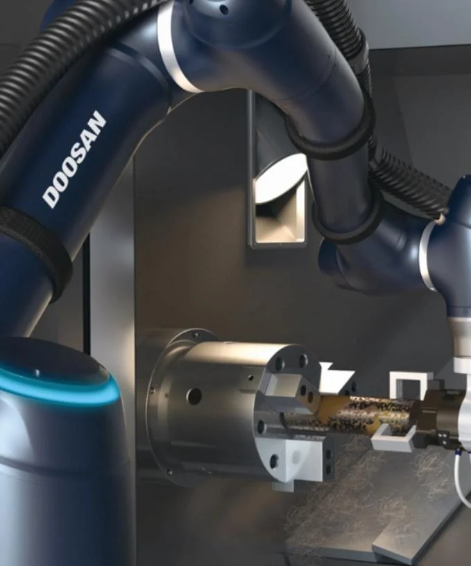

프로젝트기초환경설정
아로크마커, 컨베어벨트조작
주행및메니퓰레이터사용
학습 목표
내용검증필요
구어체변경

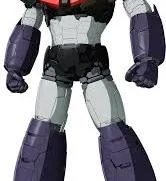

HUMAN AI ROBOTICS
3
터틀봇메내퓰레이터
참고
아두이노, 컨베이벨트

HUMAN AI ROBOTICS
4
터틀봇메내퓰레이터
참고
프로젝트개발하드웨어
아두이노 uno 1
컨베이어 1
컨베이어모터 드라이버 1
USB camera 1
SMPS 1
12V 아답터 1
레이더 센서 1
turtlebot-3 1
OpenManipulator-X 1
배터리 2
배터리 충전기 2
오린나노 1
wifi 동글 1
노트북 1
라이다센서

HUMAN AI ROBOTICS
5
터틀봇메내퓰레이터
참고
아두이노

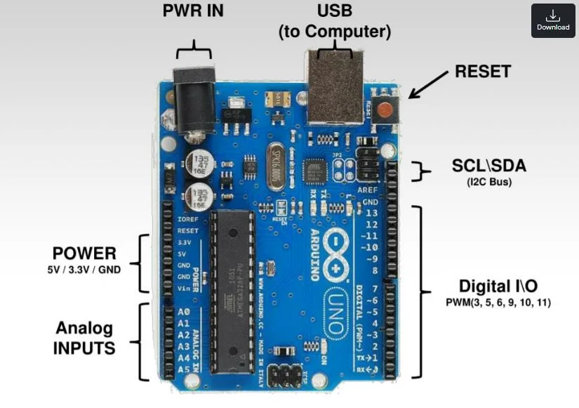

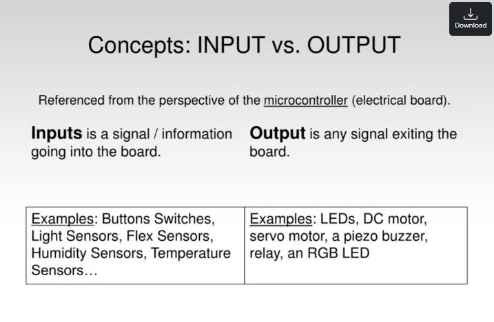

HUMAN AI ROBOTICS
6
터틀봇메내퓰레이터
참고
아두이노

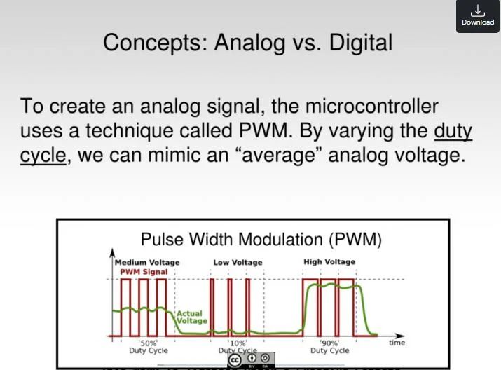

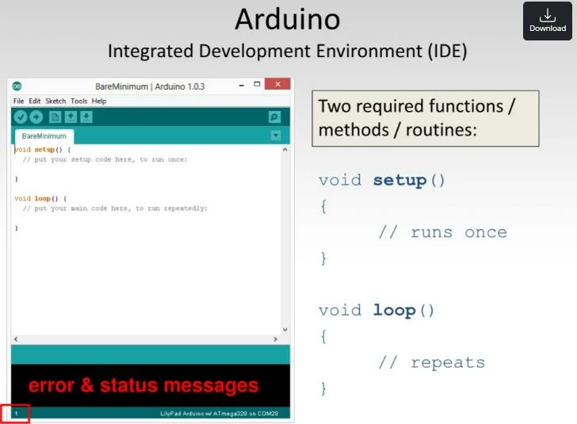

HUMAN AI ROBOTICS
7
터틀봇메내퓰레이터
참고
아두이노

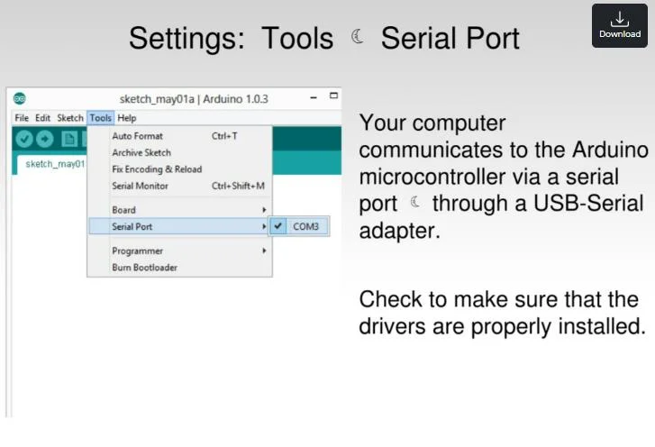

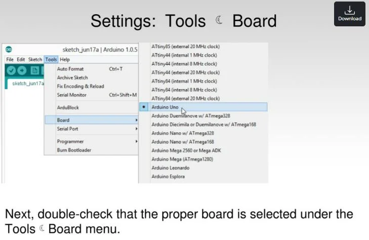

HUMAN AI ROBOTICS
8
터틀봇메내퓰레이터
참고
아두이노

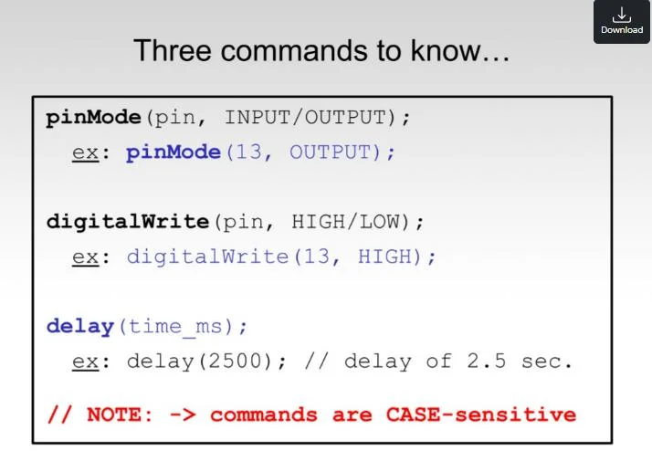

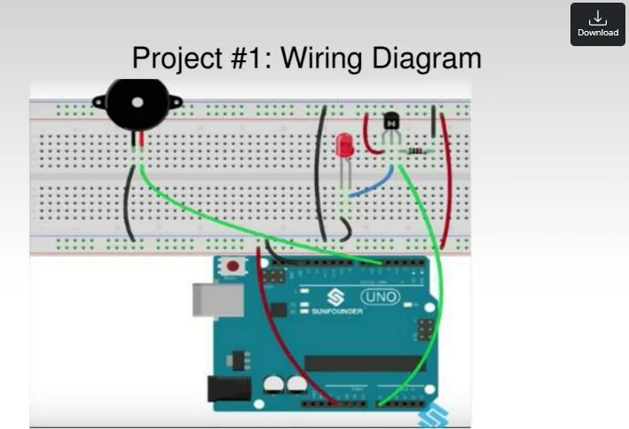

HUMAN AI ROBOTICS
9
터틀봇메내퓰레이터
참고
아두이노

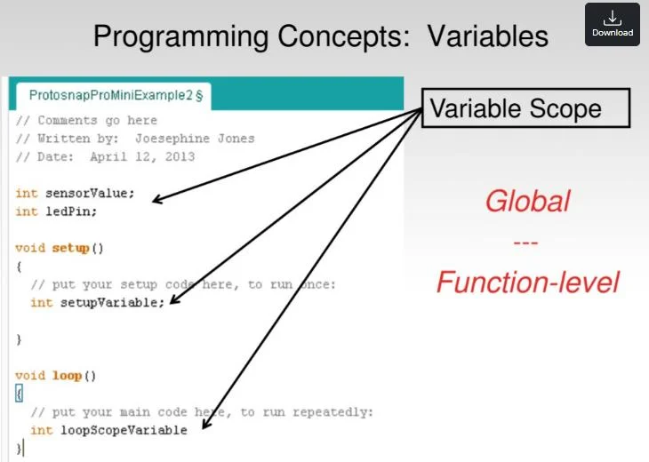

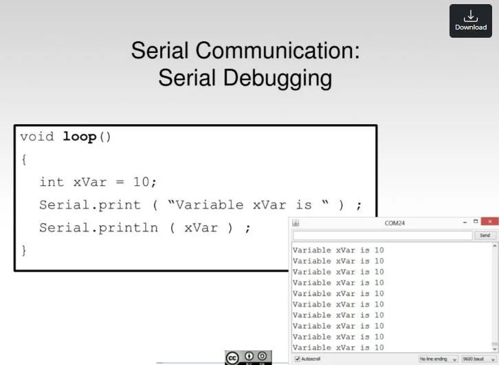

HUMAN AI ROBOTICS
10
터틀봇메내퓰레이터
참고
스테핑모터, 컨베이벨트
"43HD4027-02"는 스테핑 모터 모델명으로, 이 모터는 일반적으로 정밀한 위치 제어가 필요한 애플리케이션
에서 사용됩니다. 스테핑 모터는 각도별로 일정한 회전각만큼 이동할 수 있어 정밀한 제어가 가능합니다.

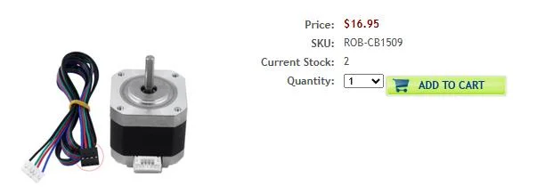

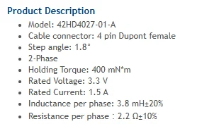

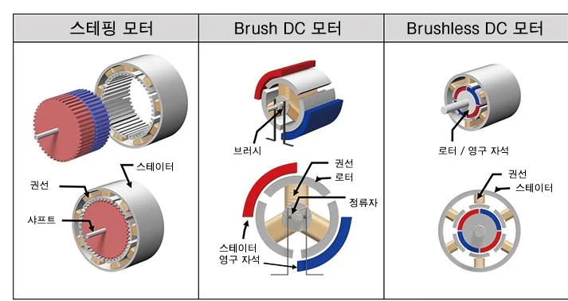

HUMAN AI ROBOTICS
11
터틀봇메내퓰레이터
참고
스테핑모터, 컨베이벨트
스테퍼 모터의 속도 제어
회전 속도는 펄스 수의 밀도로 제어합니다. 1펄스로 1기준 
스텝각이 회전하는 경우, 1초에 10펄스를 보내는 것이, 1초
에 1펄스를 보내는 것보다 1초의 회전한 각도가 크다. 그래
서 펄스의 주파수가 높으면 회전 속도가 빠릅니다.

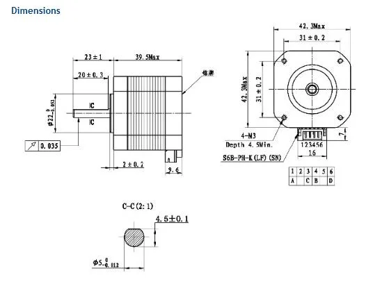

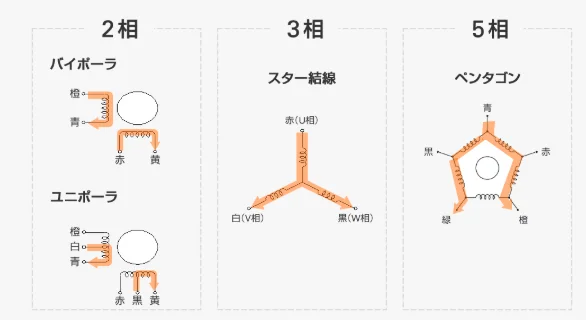

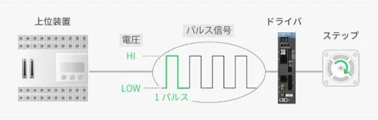

HUMAN AI ROBOTICS
12
터틀봇메내퓰레이터
참고
스테핑모터, 컨베이벨트

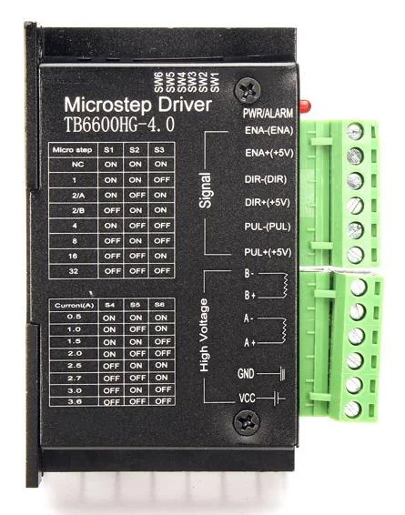

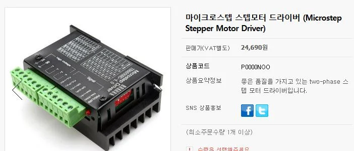

HUMAN AI ROBOTICS
13
터틀봇메내퓰레이터
참고
스테핑모터, 컨베이벨트
#define PIN_ENA 8 
// Enable pin on the driver (optional if you need to control enable state)
#define PIN_DIR 9 
// Direction pin (controls motor direction)
#define PIN_PUL 10 // Pulse pin (sends step signals to the driver)
int stepDelay = 1000; // Delay between steps in microseconds (adjust motor speed)
void setup() {
// Set the pins as outputs
pinMode(PIN_ENA, OUTPUT);
pinMode(PIN_DIR, OUTPUT);
pinMode(PIN_PUL, OUTPUT);
// Enable the driver (assuming active low for enable pin)
digitalWrite(PIN_ENA, LOW); // LOW typically enables the driver (check your driver datasheet)
// Set initial direction (optional)
digitalWrite(PIN_DIR, HIGH); // HIGH for one direction, LOW for the opposite direction
}
void loop() {
// Rotate the motor in one direction
for (int i = 0; i < 2000; i++) { // 2000 steps for one full rotation (adjust based on your motor's step count)
digitalWrite(PIN_PUL, HIGH); // Create a pulse
delayMicroseconds(stepDelay); // Wait for step duration
digitalWrite(PIN_PUL, LOW); 
// End the pulse
delayMicroseconds(stepDelay); // Wait for step duration
}
// Change direction after one rotation
digitalWrite(PIN_DIR, !digitalRead(PIN_DIR)); // Reverse direction
delay(1000); // Wait for a second before changing direction
}

HUMAN AI ROBOTICS
14
터틀봇메내퓰레이터
참고
초음파센서

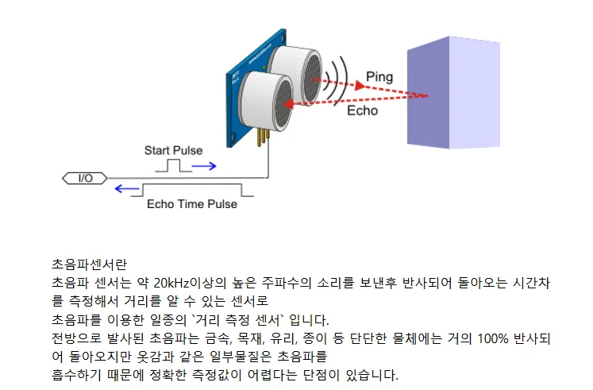

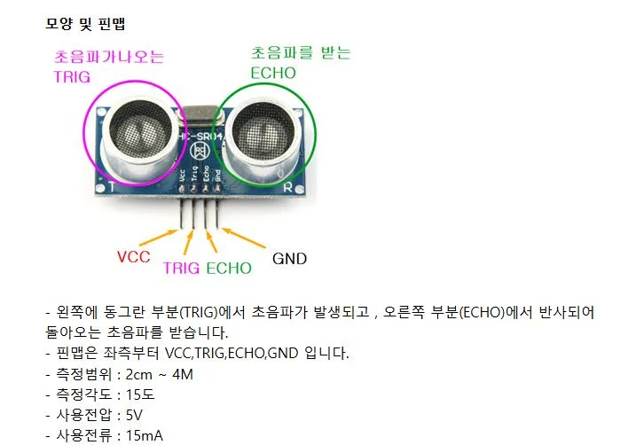

HUMAN AI ROBOTICS
15
터틀봇메내퓰레이터
참고
초음파센서
#define TRIG 9 //TRIG 핀 설정 (초음파 보내는 핀)
#define ECHO 8 //ECHO 핀 설정 (초음파 받는 핀)
void setup() {
Serial.begin(9600); //PC모니터로 센서값을 확인하기위해서 시리얼 통신을 정의해줍니다. 
  
 pinMode(TRIG, OUTPUT);
pinMode(ECHO, INPUT);
}
void loop()
{
long duration, distance;
digitalWrite(TRIG, LOW);
delayMicroseconds(2);
digitalWrite(TRIG, HIGH);
delayMicroseconds(10);
digitalWrite(TRIG, LOW);
duration = pulseIn (ECHO, HIGH); //물체에 반사되어돌아온 초음파의 시간을 변수에 저장합니다.
 //34000*초음파가 물체로 부터 반사되어 돌아오는시간 /1000000 / 2(왕복값이아니라 편도값이기때문에 나누기2를 해줍니다.)
//초음파센서의 거리값이 위 계산값과 동일하게 Cm로 환산되는 계산공식 입니다. 수식이 간단해지도록 적용했습니다.
 distance = duration * 17 / 1000; 
 //PC모니터로 초음파 거리값을 확인 하는 코드 입니다.
 Serial.println(duration ); //초음파가 반사되어 돌아오는 시간을 보여줍니다.
 Serial.print("\nDIstance : ");
Serial.print(distance); //측정된 물체로부터 거리값(cm값)을 보여줍니다.
 Serial.println(" Cm");
delay(1000); //1초마다 측정값을 보여줍니다.
}

HUMAN AI ROBOTICS
16
터틀봇메내퓰레이터
참고
아루코마커

HUMAN AI ROBOTICS
17
터틀봇메내퓰레이터
참고
아루코마커(ArUco marker)
로봇 비전 혹은 컴퓨터 비전에서 많이 사용하는 마커이다. 
QR 코드처럼 우리가 카메라로 아루코마커를 인식, 아루코마커가 가지고 있는 ID를 반환받아서 읽을 수 있다.
인식한 아루코마커의 위치와 각도에 따라서 x, y, z축 방향으로의 위치와 회전 각도를 계산할 수 있다.
aruco_pos_rot.py

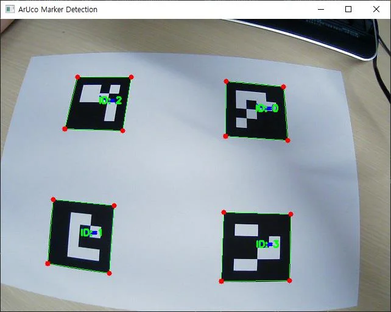

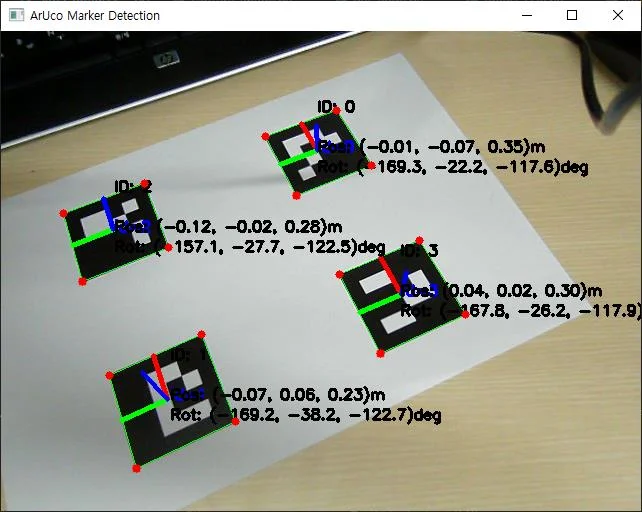

HUMAN AI ROBOTICS
18
터틀봇메내퓰레이터
참고
기타개발지원도구
아루코마커가 50mm임을 기준으로 각 아루코마커가 카메라의 중심으로 얼마나 떨어져 있고 회전되어 있는지 확인
할 수 있다. 물론 아주 정확하지는 않지만, 약간의 오차를 가지고 위치와 회전 각도를 받을 수 있다.
aruco_dist_pos_rot.py
코드공유

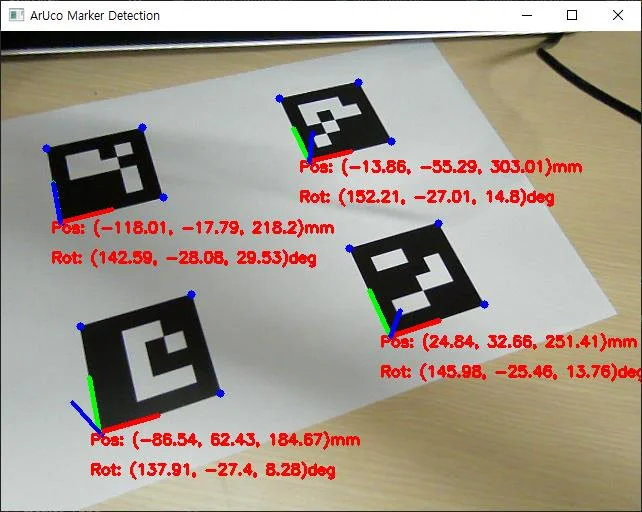

HUMAN AI ROBOTICS
19
터틀봇메내퓰레이터
참고
카메라켈리브레이션
위치에따라 카메라 랜즈의 굴곡에따른 왜곡 현상
이 과정은 일반적으로 체스보드 패턴을 사용하여 여러 각도에서 이미지를 
촬영하고, 이를 통해 카메라 매트릭스를 구하는 방식으로 진행됩니다.
카메라 캘리브레이션을 위해서는 보통 OpenCV를 사용하여 카메라의 내부 파라미터(초점 거리, 왜곡 계수 
등)를 추정

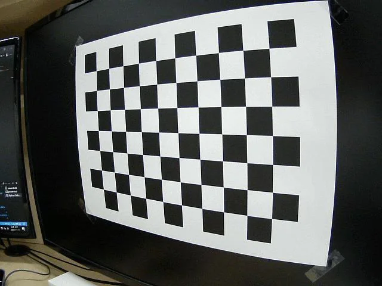

HUMAN AI ROBOTICS
20
터틀봇메내퓰레이터
참고
카메라켈리브레이션
카메라 파라미터
1.카메라 렌즈 시스템의내부 파라미터(Internal parameters): 초점 거리 (focal length), 광학 중심 (optical 
center), 렌즈의 방사 왜곡 계수 (radial distortion coefficients of the lens)
2.외부 파라미터(External parameters): 시계 좌표계에 대한 카메라의 방향, 회전, 이동
체커 보드
우리는 카메라 캘리브레이션을 위해서 체커 보드(checkerboard pattern)를 사용할 것이다. 
해당 사이트에서 체커 보드 패턴을 만들고 간단히 출력할 수 있다.
https://markhedleyjones.com/projects/calibration-checkerboard-collection

HUMAN AI ROBOTICS
21
터틀봇메내퓰레이터
참고
카메라켈리브레이션
•10x7 체커보드 패턴(내부 코너는 9x6)에서 각 사각형이 20mm인 체커보드를 사용합니다. 
•지정된 폴더에서 체커보드 이미지를 로드합니다. 
•각 이미지에서 체커보드 코너를 감지합니다. 
•감지된 코너를 사용하여 카메라 캘리브레이션을 수행합니다. 
•카메라 행렬(intrinsic parameters)과 왜곡 계수를 계산합니다. 
•캘리브레이션 결과를 파일로 저장합니다. 
•선택적으로 테스트 이미지의 왜곡을 보정합니다. 
Camera_calibration_captures.py
Camera_calibration.py
Camera_test.py
Camera_test_calibrationed.py

HUMAN AI ROBOTICS
22
터틀봇메내퓰레이터
참고
카메라켈리브레이션
https://darkpgmr.tistory.com/32

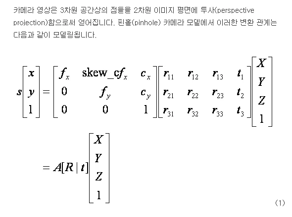

HUMAN AI ROBOTICS
23
터틀봇메내퓰레이터
참고
카메라켈리브레이션

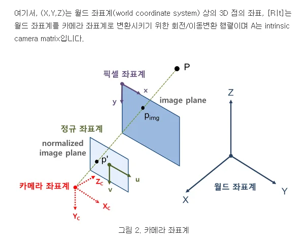

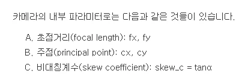

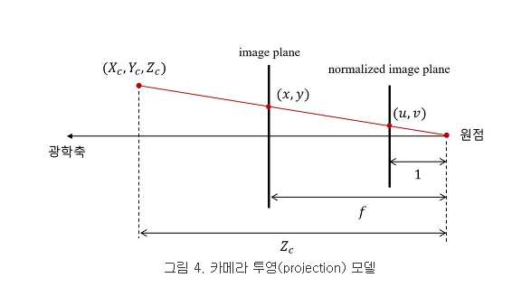

HUMAN AI ROBOTICS
24
터틀봇메내퓰레이터
참고
켈리브레이션

HUMAN AI ROBOTICS
25
터틀봇메내퓰레이터
참고
아로크마커생성
aruco_generate.py 
Aruco marker generate 웹사이트
https://chev.me/arucogen/
https://fodi.github.io/arucosheetgen/
marker_id = 마커의 아이디
marker_size = 마커크기(픽셀 또는 m)
dict_type = 마커 종류와 id 갯수 (4X4,5X5,6X6, 250,500,1000)

HUMAN AI ROBOTICS
26
터틀봇메내퓰레이터
참고
아로크마커거리추정
마커 id ,pose, rotation 추출 후 거리(distance)를 추정
정확한 거리를 위해서 카메라 calibration이 필요
aruco_run.py 실행
aruco_dict = cv2.aruco.getPredefinedDictionary(cv2.aruco.DICT_6X6_1000)
OpenCV의 ArUco 라이브러리를 사용하여 ArUco 마커를 생성하거나 인식하기 위한 코드입니다. 
1.cv2.aruco: OpenCV의 ArUco 모듈을 의미합니다. ArUco는 QR 코드와 유사한 방식으로 인식할 수 있는 작은 2D 마커입니다. 
2.주로 증강 현실(AR)이나 로봇 비전에서 사용됩니다.
2.getPredefinedDictionary(): 이 함수는 OpenCV에서 미리 정의된 다양한 ArUco 마커 세트를 반환합니다. 
3.사용자는 여러 종류의 마커 세트 중 하나를 선택할 수 있습니다. 이 함수는 마커들을 생성하거나 인식할 때 유용합니다.
3.cv2.aruco.DICT_6X6_1000: 이는 "6x6 크기의 1000개의 고유한 ArUco 마커" 세트를 의미합니다. 
4.여기서 6x6은 각 마커의 비트 크기를 나타내며, 1000은 세트 내에서 제공되는 마커의 수를 의미합니다. 
5.즉, 이 세트는 6x6 크기의 1000개의 서로 다른 ArUco 마커를 제공합니다.

HUMAN AI ROBOTICS
27
터틀봇메내퓰레이터
참고
아로크마커거리추정
Marker ID: 8, Position: [ 0.30174336 -0.14219974  0.58847091], Rotation (Yaw, Pitch, Roll): (175.39, 4.25, -2.24), Distance: 0.68m
Marker ID: 9, Position: [-0.3635388  -0.06435436  0.54939859], Rotation (Yaw, Pitch, Roll): (-173.50, -50.36, -11.39), Distance: 0.66m

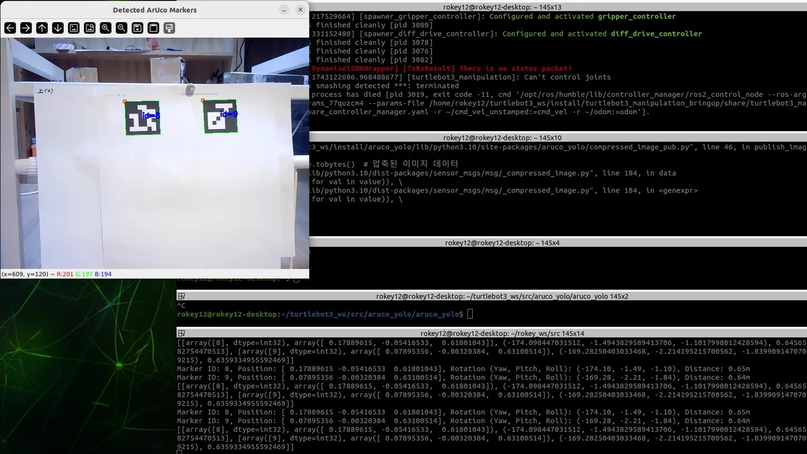

HUMAN AI ROBOTICS
28
터틀봇메내퓰레이터
참고
아로크마커거리추정
아로크마커 거리 추정 원리
•실제 마커 크기: 마커의 실제 크기(가령, 정사각형의 한 변의 길이)가 알려져 있어야 합니다.
•마커의 화면 상 크기: 
•카메라에서 본 마커의 크기는 실제 크기와 카메라의 초점 거리, 마커와 카메라 사이의 거리에 따라 다르게 나타납니다.
•삼각법: 
•삼각형의 기하학적 원리를 사용하여, 마커의 화면 상 크기와 실제 크기, 그리고 카메라의 초점 거리로부터 거리를 계산합니다.

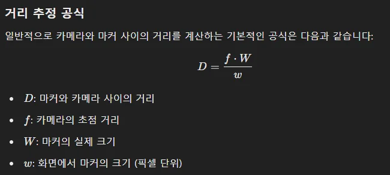

HUMAN AI ROBOTICS
29
터틀봇메내퓰레이터
참고
아로크마커거리추정
#!/usr/bin/env python3
import cv2
import numpy as np
import os
from ament_index_python.packages import get_package_share_directory
import yaml
import argparse
import rclpy
from rclpy.node import Node
from sensor_msgs.msg import CompressedImage
from std_msgs.msg import Float32, Int32
from aruco_msgs.msg import Marker, MarkerArray
from cv_bridge import CvBridge
주요 라이브러리
• cv2, numpy: 이미지 처리와 수학 계산
• rclpy: ROS 2 파이썬 클라이언트 라이브러리
• sensor_msgs.msg.CompressedImage: 압축된 이미지 메시지
• aruco_msgs.msg.Marker, MarkerArray: ArUco 마커 정보 메시지
• cv_bridge: ROS 이미지 
 OpenCV 이미지 변환
• yaml: 카메라 캘리브레이션 파일 로딩
aruco_marker_detector.py

HUMAN AI ROBOTICS
30
터틀봇메내퓰레이터
참고
아로크마커거리추정
def detect_markers(image, camera_matrix, dist_coeffs, marker_size):
aruco_dict = cv2.aruco.getPredefinedDictionary(cv2.aruco.DICT_6X6_1000)
parameters = cv2.aruco.DetectorParameters()
detector = cv2.aruco.ArucoDetector(aruco_dict, parameters)
corners, ids, _ = detector.detectMarkers(image)
detect_data = []
if ids is not None:
cv2.aruco.drawDetectedMarkers(image, corners, ids)
rvecs, tvecs, _ = my_estimatePoseSingleMarkers(corners, marker_size, camera_matrix, 
dist_coeffs)
if rvecs is not None and tvecs is not None:
for rvec, tvec, marker_id in zip(rvecs, tvecs, ids):
rot_mat, _ = cv2.Rodrigues(rvec)
yaw, pitch, roll = rotationMatrixToEulerAngles(rot_mat)
marker_pos = np.dot(-rot_mat.T, tvec).flatten()
distance = np.linalg.norm(tvec)
detect_data.append([marker_id, marker_pos, (yaw, pitch, roll), distance])
return image, detect_data
detect_markers()
• 카메라 영상에서 ArUco 마커 검출
• 마커 ID, 위치, 회전각, 거리 등을 추출
• cv2.solvePnP()을 통해 자세 추정
• rotationMatrixToEulerAngles()로 Euler 각도 추출
aruco_marker_detector.py

HUMAN AI ROBOTICS
31
터틀봇메내퓰레이터
참고
아로크마커거리추정
def my_estimatePoseSingleMarkers(corners, marker_size, mtx, distortion):
marker_points = np.array([[-marker_size / 2, marker_size / 2, 0],
[marker_size / 2, marker_size / 2, 0],
[marker_size / 2, -marker_size / 2, 0],
[-marker_size / 2, -marker_size / 2, 0]], dtype=np.float32)
rvecs = []
tvecs = []
for c in corners:
_, R, t = cv2.solvePnP(marker_points, c, mtx, distortion, False, cv2.SOLVEPNP_IPPE_SQUARE)
rvecs.append(R)
tvecs.append(t)
return rvecs, tvecs, []
my_estimatePoseSingleMarkers()
• 마커의 각 코너 좌표와 실제 크기를 바탕으로 자세 추정
aruco_marker_detector.py

HUMAN AI ROBOTICS
32
터틀봇메내퓰레이터
참고
아로크마커거리추정
def rotationMatrixToEulerAngles(R):
sy = np.sqrt(R[0,0] * R[0,0] + R[1,0] * R[1,0])
singular = sy < 1e-6
if not singular:
x = np.arctan2(R[2,1], R[2,2])
y = np.arctan2(-R[2,0], sy)
z = np.arctan2(R[1,0], R[0,0])
else:
x = np.arctan2(-R[1,2], R[1,1])
y = np.arctan2(-R[2,0], sy)
z = 0
return np.degrees(x), np.degrees(y), np.degrees(z)
rotationMatrixToEulerAngles()
• 회전 행렬을 Euler 각도(roll, pitch, yaw)로 변환
aruco_marker_detector.py

HUMAN AI ROBOTICS
33
터틀봇메내퓰레이터
참고
아로크마커거리추정
def load_camera_parameters(yaml_file):
package_share_directory = get_package_share_directory('aruco_marker_detect')
calibration_file = os.path.join(package_share_directory, 'config', yaml_file)
with open(calibration_file, 'r') as f:
data = yaml.safe_load(f)
camera_matrix = np.array(data["camera_matrix"]["data"], dtype=np.float32).reshape(3, 3)
dist_coeffs = np.array(data["distortion_coefficients"]["data"], dtype=np.float32)
return camera_matrix, dist_coeffs
load_camera_parameters()
• ROS 패키지 내 YAML 파일에서 카메라 캘리브레이션 파라미터를 로드
aruco_marker_detector.py

HUMAN AI ROBOTICS
34
터틀봇메내퓰레이터
참고
아로크마커거리추정
class ArucoMarkerDetector(Node):
def __init__(self):
super().__init__('aruco_marker_detector')
self.subscription = self.create_subscription(
CompressedImage,
'image_raw/compressed',
self.listener_callback,
10)
self.marker_publisher = self.create_publisher(MarkerArray, 'detected_markers', 10)
self.bridge = CvBridge()
self.marker_size = 0.04
self.camera_matrix, self.dist_coeffs = load_camera_parameters('calibration_params.yaml')
def listener_callback(self, msg):
np_arr = np.frombuffer(msg.data, np.uint8)
frame = cv2.imdecode(np_arr, cv2.IMREAD_COLOR)
frame, detect_data = detect_markers(frame, self.camera_matrix, self.dist_coeffs, self.marker_size)
if len(detect_data) == 0:
self.get_logger().debug("No markers detected")
else:
closest_marker = min(detect_data, key=lambda x: x[3])
self.get_logger().debug(f"Closest Marker ID: {closest_marker[0]}, Distance: {closest_marker[3]:.2f}m")
marker_array_msg = MarkerArray()
for marker in detect_data:
marker_msg = Marker()
marker_msg.id = int(marker[0])
marker_msg.pose.pose.position.x = marker[1][0]
marker_msg.pose.pose.position.y = marker[1][1]
marker_msg.pose.pose.position.z = marker[1][2]
marker_msg.pose.pose.orientation.x = marker[2][2]
marker_msg.pose.pose.orientation.y = marker[2][1]
marker_msg.pose.pose.orientation.z = marker[2][0]
marker_array_msg.markers.append(marker_msg)
self.marker_publisher.publish(marker_array_msg)
cv2.imshow('Detected Markers', frame)
cv2.waitKey(1)
클래스 ArucoMarkerDetector(Node)
주요 역할:
• /image_raw/compressed 주제를 구독하여 이미지를 받아옴
• 마커 검출 후 가장 가까운 마커 정보를 로그로 출력
• 검출된 마커 정보를 MarkerArray로 detected_markers 주제에 
퍼블리시
aruco_marker_detector.py

HUMAN AI ROBOTICS
35
터틀봇메내퓰레이터
참고
아로크마커거리추정
def main(args=None):
rclpy.init(args=args)
aruco_marker_detector = ArucoMarkerDetector()
rclpy.spin(aruco_marker_detector)
aruco_marker_detector.destroy_node()
rclpy.shutdown()
if __name__ == "__main__":
parser = argparse.ArgumentParser(description='Detect ArUco markers.')
parser.add_argument('--marker_size', type=float, default=0.04,
help='Size of the ArUco markers in meters.')
args = parser.parse_args()
ArucoMarkerDetector.marker_size = args.marker_size
main()
실행 흐름 (main() 함수)
1.ROS 2 초기화
2.ArucoMarkerDetector 노드 실행
3.노드 종료 시 종료 처리
aruco_marker_detector.py

HUMAN AI ROBOTICS
36
터틀봇메내퓰레이터
참고
터틀봇메니퓰레이터

HUMAN AI ROBOTICS
37
터틀봇메내퓰레이터
참고
터틀봇와플메니퓰레이터시작, 종료
1.
Open CR을 먼저 키고
2.
jetson orin을 킨다
1.
robot에서 sudo shutdown now 를 실행하고
2.
jetson orin의 스위치를 반드시 끄고
3.
Open CR을 끈다

HUMAN AI ROBOTICS
38
터틀봇메내퓰레이터
참고
SSH 로봇접속
ssh 연결하기
ssh -X rokeyOO@<rokeyIPaddres>
PASSWORD:rokey1234
1. vscode 확장(ctrl+shift+X)탭을 누른다
2. 마켓에서 ssh를 치고,Remote-SSH를 설치
VSCode 로봇접속
3. 원격 탐색기

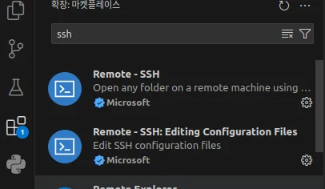

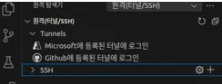

HUMAN AI ROBOTICS
39
터틀봇메내퓰레이터
참고
VSCode 로봇접속
4. 새 원격을 누른다
5. ssh -X rokeyO@<rokeyIP> 입력후 enter
6. ssh 창에 새로 고침 한 이후에
7. 자신이 접속할 창의 폴더를 누른다

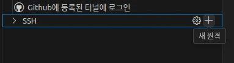

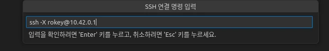

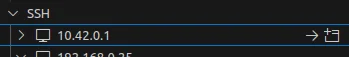

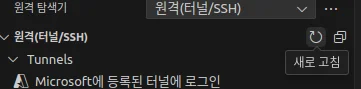

HUMAN AI ROBOTICS
40
터틀봇메내퓰레이터
참고
프로그램수행노드목록
I.
ros2 launch turtlebot3_manipulation
_bringup hardware.launch.py
II.
compressed_image_pub.py
III.
yolo_detect.py
IV.
aruco_marker_detect.py
I.
ros2 launch turtlebot3_manipulation_
moveit_config moveit_core.launch.py
II.
turtlebot_arm_controller
III.
manager_node
IV.
qt_qui.py
V.
conveyor_node

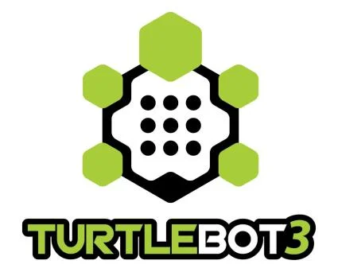

HUMAN AI ROBOTICS
41
터틀봇메내퓰레이터
참고
Aruco marker 거리추정후robot 주행
터틀봇 수행
1.
ros2 launch turtlebot3_manipulation_bringup hardware.launch.py
2.
ros2 launch aruco_yolo aruco_move.launch.py
(compressed_image_pub :영상 데이터를 압축 전송
aruco_detect_marker: 압축된 영상 데이터에서 aruco marker를 인식하여 pose와 rotation을 추출
aruco_move: 받은 pose.z 만큼 주행)
Node_graph 수행해보기
Node_graph(aruco_move.launch.py)
Node_graph(aruco_yolo.launch.py)

HUMAN AI ROBOTICS
42
터틀봇메내퓰레이터
참고
Moveit 이해
MoveIt의 역할: 로봇 암(Manipulator) 모션 플래닝 및 제어
ROS2 기반에서 동작하는 모션 플래닝 프레임워크
사용 목적: 경로 계획(Path Planning), 역기구학(IK), 충돌 회피(Collision Avoidance), 센서 통합 등
https://moveit.picknik.ai/main/index.html
코드분석필요

HUMAN AI ROBOTICS
43
터틀봇메내퓰레이터
참고
Moveit 수행
로봇에서 
ros2 launch turtlebot3_manipulation_bringup hardware.launch.py
pc에서 
ros2 launch turtlebot3_manipulation_moveit_config moveit_core.launch.py
Moveit 키보드 설정
- turtlebot3_manipulation_xyz_limit.py
ros2 topic list
export 
에러…
w 전진
s 후진
a 좌회전
d 우회전
y  joint1 +
h joint1 -
u joint2 +
j joint2 -
i joint3 +
k joint3 -
o joint4 +
l joint4 -
- 그리퍼 close
= 그리퍼 open

HUMAN AI ROBOTICS
44
터틀봇메내퓰레이터
참고
Moveit 수행
rviz 화면에 보이는 manipulator와 lidar 위치가 실제와 다르기때문에 위치를 변경해야 합니다

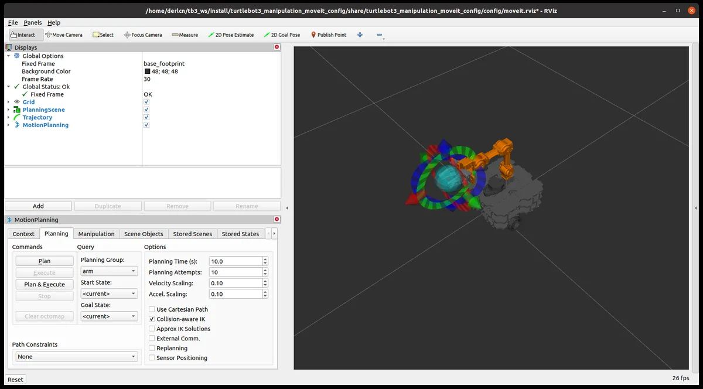

HUMAN AI ROBOTICS
45
터틀봇메내퓰레이터
참고
로봇모델링체크
~/turtlebot3_ws/src/turtlebot3_manipulation/turtlebot3_manipulation_description/urdf
~/turtlebot3_ws/src/turtlebot3_manipulation/turtlebot3_manipulation_description/urdf/turtlebot3_manipulation.urdf.xacro
manipulation을 x축으로 0.092만큼 전진 시킵니다

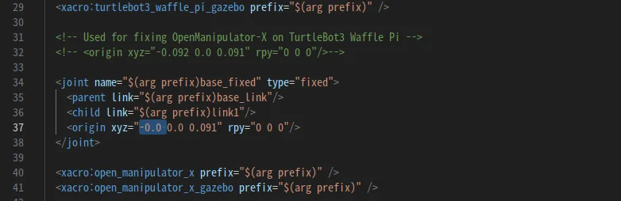

HUMAN AI ROBOTICS
46
터틀봇메내퓰레이터
참고
Moveit 수행
~/turtlebot3_ws/src/turtlebot3_manipulation/turtlebot3_manipulation_description/urdf/turtlebot3_waffle_pi.urdf.xacro
scan을 x축으로 0.076만큼 후진 시킵니다

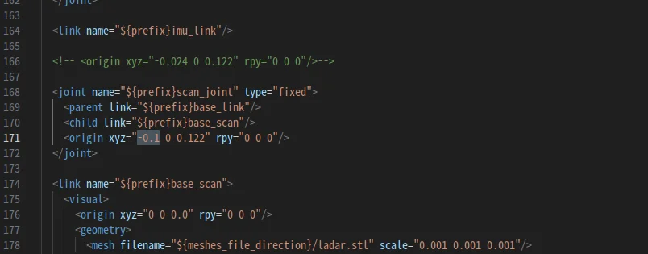

HUMAN AI ROBOTICS
47
터틀봇메내퓰레이터
참고
Moveit 수행
manipulation과 scan 위치가 달라지는지 확인하세요

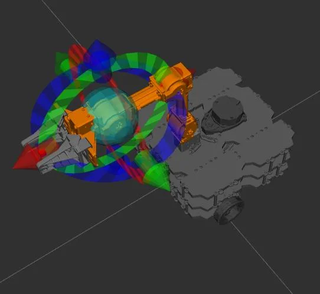

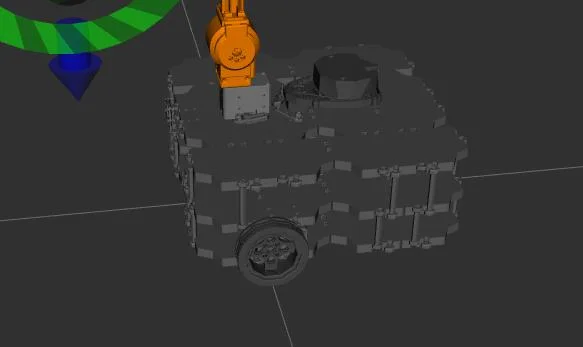

HUMAN AI ROBOTICS
48
터틀봇메내퓰레이터
참고
정밀도향상을위한옵션확인
kinematics.yaml 내용
turtlebot3_manipulation.srdf
~/turtlebot3_ws/src/turtlebot3_manipulation/turtlebot3_manipulation_movit_config/config

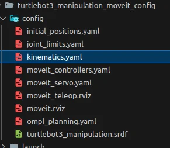

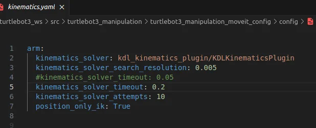

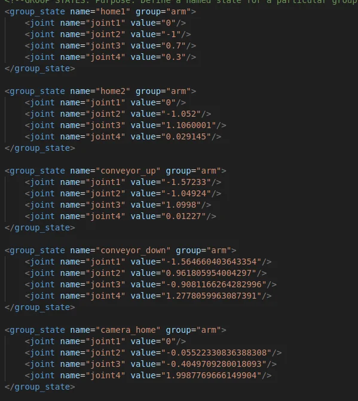

HUMAN AI ROBOTICS
49
터틀봇메내퓰레이터
참고
Moveit 아키텍처
Moveit control(pc)
manager_node
srv_call_test
turtlebot_arm_
controller.cpp
Moveit
cmd
posename
waypoint
move_gruop_
interface plan
request 작성
turtlebot_cosmo_interface

HUMAN AI ROBOTICS
50
터틀봇메내퓰레이터
참고
Moveit 아키텍처
1. turtlebot_cosmo_interface.zip 
~/turtlebot3_ws/src/안에 해당 패키지 압축풀기 (pc)
cd ~/turtlebot3_ws
colcon build --packages-select turtlebot_cosmo_interface
2. turtlebot_moveit.zip 
~/turtlebot3_ws/src (pc)
cd ~/turtlebot3_ws/
colcon build --packages-select turtlebot_moveit

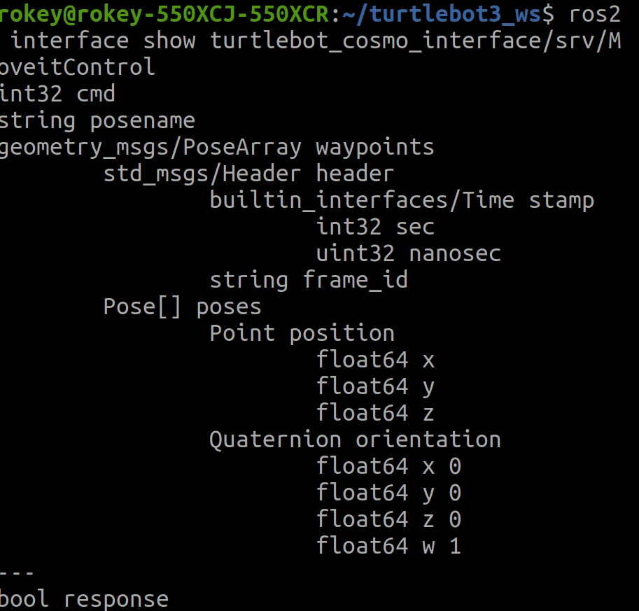

HUMAN AI ROBOTICS
51
터틀봇메내퓰레이터
참고
Moveit 아키텍처
압축풀기  turtlebot_cosmo_interface.zip
패키지       turtlebot_cosmo_interface
페키지 빌드       colcon build --packages-select turtlebot_cosmo_interface
압축풀기  turtlebot_moveit.zip
페키지 빌드       colcon build --packages-select turtlebot_moveit
인터페이스 페키지: MoveitController.srv
암 컨트롤러: turtlebot_arm_controller.cpp
코드분석

HUMAN AI ROBOTICS
52
터틀봇메내퓰레이터
참고
Moveit이용메니퓰레이터조작
준비 
Robot: 
Ros2 launch turtlebot3_manipulation_bringup hardware.launch.py
PC:
1. ros2 launch turtlebot3_manipulation_moveit_config moveit_core.launch.py
2. ros2 run turtlebot_moveit
turtlebot_arm_controller
실행
3. ros2 run turtlebot_moveit task.py
cd turtlebot_moveit/scripts/
python3 srv_call_test.py
python3 task.py

HUMAN AI ROBOTICS
53
터틀봇메내퓰레이터
참고
암컨트롤러: turtlebot_arm_controller.cpp
0: 메내퓰레이터를 파란색( 또는 빨간색) 상자를 먼저 인식하고 yolo 보는 방향으로 좌표이동
1: srdf에 저장된 arm의  joint 값이동
2: srdf에 저장된 gripper의 joint 값이동
3: 보라색 상자를 yolo 보는 방향으로 좌표이동
4: 좌표와 방향을 전부 주고 좌표이동
9: 해당 좌표 출력
파이썬에서 암컨트롤러 서비스 호출 예시(…yolo.py 
명령코드
실제 코드분석

HUMAN AI ROBOTICS
54
터틀봇메내퓰레이터
참고
Moveit 아키텍처
cmd 1을 주고 “box_up_02” 엑션
cmd 1을 주고 “box_up_02” 엑션
cmd 1을 주고 “box_up_02” 엑션
cmd 9을 주고 좌표를 출력
task.py 예제 - 1

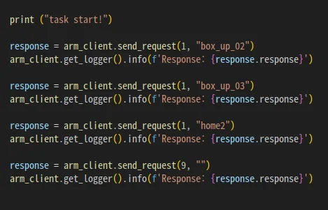

HUMAN AI ROBOTICS
55
터틀봇메내퓰레이터
참고
Moveit 아키텍처
1. waypoint를 줄  position과 orientation을 줍니다
1. cmd 4를 주고 해당 waypoint로 이동을 지시합니다
1. cmd 9를 주고 좌표를 출력합니다
task.py 예제 - 2

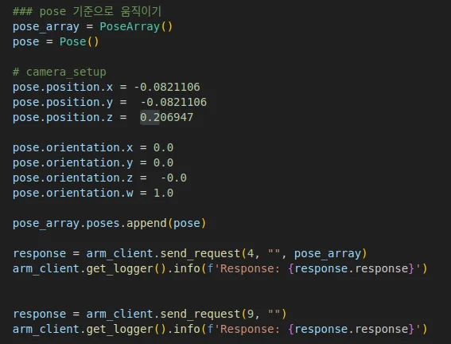

HUMAN AI ROBOTICS
56
터틀봇메내퓰레이터
참고
기타개발지원도구
전진방향이 x +
좌는 y + 
우는 y -
z는 높이
x +
y +
y -

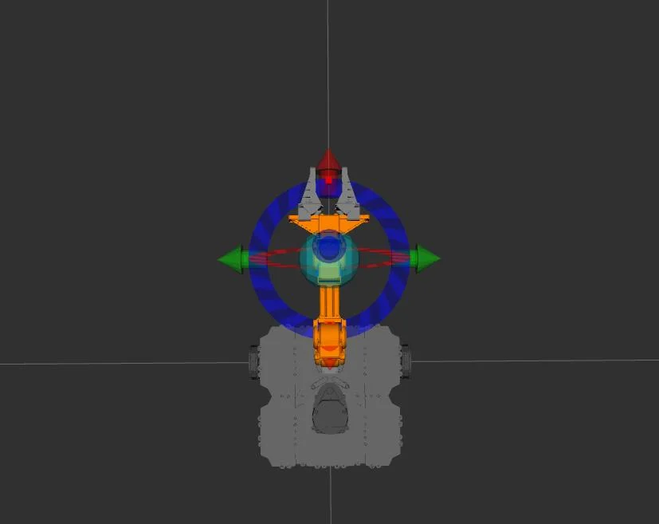

HUMAN AI ROBOTICS
57
터틀봇메내퓰레이터
참고
기타개발지원도구
robot_
y
+ 0.08
±0.01
robot_
y
- 0.08
±0.01
robot_x +0.15 ±0.01
robot_x +0.22 ±0.01

HUMAN AI ROBOTICS
58
터틀봇메내퓰레이터
참고
Moveit 아키텍처
task.py 예제 - 3 left_down
x + 방향으로 15cm 만큼 
y + 방향으로 8cm 만큼 
직접 좌표이동하는 코드입니다

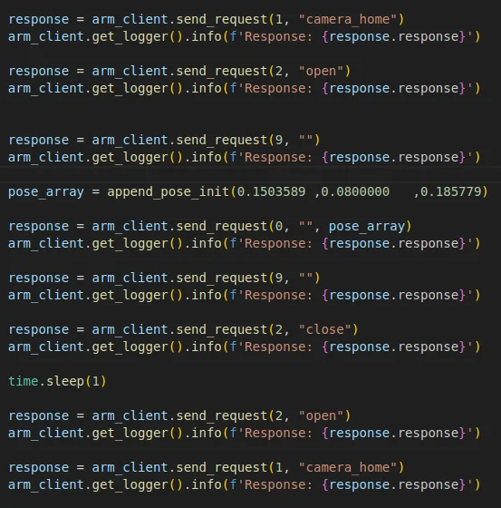

HUMAN AI ROBOTICS
59
터틀봇메내퓰레이터
참고
기타개발지원도구

HUMAN AI ROBOTICS
60
터틀봇메내퓰레이터
참고
기타개발지원도구
task.py 예제 - 4 left_up
x + 방향으로 22cm 만큼 
y + 방향으로 8cm 만큼 
직접 좌표이동하는 코드입니다

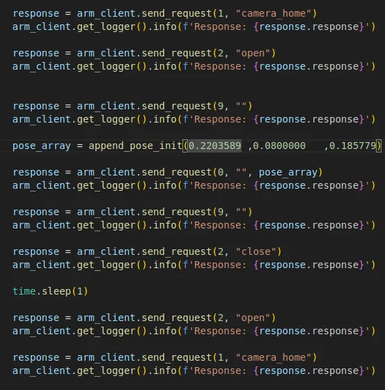

HUMAN AI ROBOTICS
61
터틀봇메내퓰레이터
참고
기타개발지원도구

HUMAN AI ROBOTICS
62
터틀봇메내퓰레이터
참고
기타개발지원도구
task.py 예제 - 5 right_down
x + 방향으로 15cm 만큼 
y - 방향으로 8cm 만큼 
직접 좌표이동하는 코드입니다

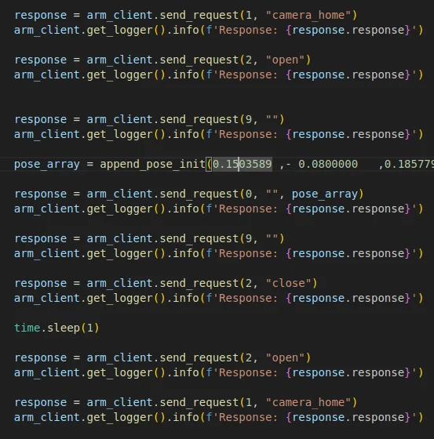

HUMAN AI ROBOTICS
63
터틀봇메내퓰레이터
참고
기타개발지원도구

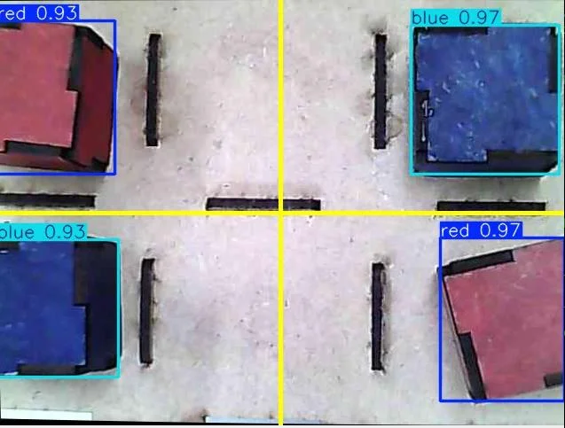

HUMAN AI ROBOTICS
64
터틀봇메내퓰레이터
참고
기타개발지원도구
task.py 예제 - 6 right_up
x + 방향으로 22cm 만큼 
y + 방향으로 8cm 만큼 
직접 좌표이동하는 코드입니다

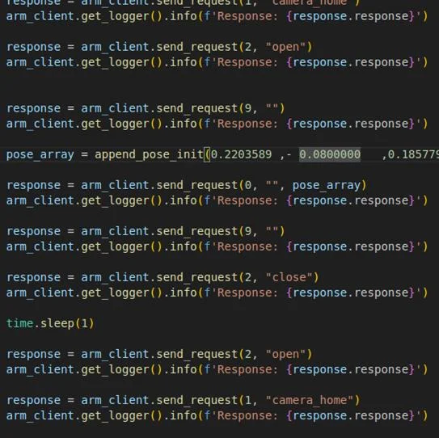

HUMAN AI ROBOTICS
65
터틀봇메내퓰레이터
참고
기타개발지원도구
task7은 yolo 데이터가 필요합니다
camera_home 위치에 간다음
ros2 launch aruco_yolo.launch.py(robot)
ros2 launch turtlebot3_manipulation_moveit_config moveit_core.launch.py(pc)
ros2 run turtlebot_moveit turtlebot_arm_controller
python3 task_3.py

HUMAN AI ROBOTICS
66
터틀봇메내퓰레이터
참고
기타개발지원도구
YOLO Task 설명
1. srdf에 저장된 camera_home 위치로 갑니다
2. 그 위치에서 yolo로 찾은 좌표로 robot을 이동시킵니다
3. gripper로 잡았으면 다시 수직으로 일어납니다
4. srdf에 저장된 conveyor에 올리는 행동을 시킵니다 
5. 작업이 완료되었는지 확인하고 다시 camera_home 위치로 돌
아갑니다.

HUMAN AI ROBOTICS
67
터틀봇메내퓰레이터
참고
기타개발지원도구
YOLO 코드 설명
pose_array에 들어가는 3가지 인자는 base link 원점 좌표에서 gripper의 좌표 x,y,z가 된다
0.137496이란 수치는 m 단위이며 13.7496cm만큼 x축 +방향으로 가 있는것
z축은 높이이므로 yolo로 찾은 좌표에 12.2354cm 높이에 간 상태에서 8.7354cm 높이로 내려가는 것

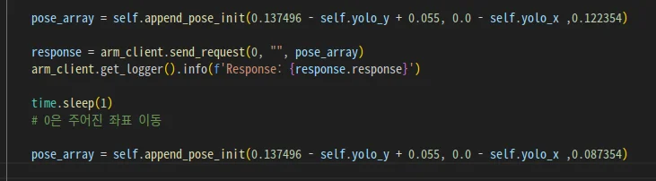

HUMAN AI ROBOTICS
68
터틀봇메내퓰레이터
참고
기타개발지원도구
yolo로 y축이 robot 기준
으로는 x축으로 들어갑니
다
yolo로 x축이 robot 기준
으로는 y축이며 yolo의 
+방향과 robot 축 기준 
방향이 달라서 yolo값에 
-를 곱해줍니다
yolo_
x +
yolo_
x -
yolo_
y +
yolo_
y -

HUMAN AI ROBOTICS
69
터틀봇메내퓰레이터
참고
기타개발지원도구
aruco_yolo.launch
task_3~7
turtlebot_arm_control
ler
moveit
yolo/detect_info
위치는 
camera_ho
me

HUMAN AI ROBOTICS
70
터틀봇메내퓰레이터
참고
기타개발지원도구
하지만 보라색 상자잡는건 좌표축이 달라집니다

HUMAN AI ROBOTICS
71
터틀봇메내퓰레이터
참고
기타개발지원도구
task.py 예제 - 8
x + 방향으로 1cm 만
큼 
y - 방향으로 29cm 만
큼 
z + 방향으로 26.5cm 
만큼
직접 좌표이동하는 코
드입니다

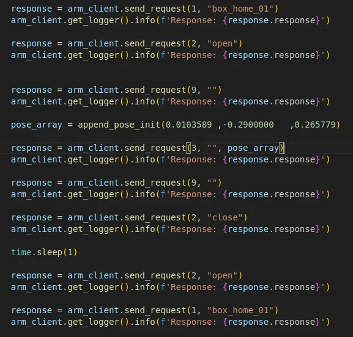

HUMAN AI ROBOTICS
72
터틀봇메내퓰레이터
참고
기타개발지원도구
aruco_yolo.launch
task_9
turtlebot_arm_controll
er
moveit
yolo/detect_info
위치는 
box_home_
01

HUMAN AI ROBOTICS
73
터틀봇메내퓰레이터
참고
기타개발지원도구
cmd 1을 주고 “box_home_01”행
동을 합니다
cmd 2를 주고 gripper에게 
“open”행동을 시킵니다
cmd 3를 주고 pose_array를 
waypoint로 주어 해당 좌표로 이
동시킵니다
cmd 3를 주고 pose_array를 
waypoint로 주어 해당 좌표로 이
동시킵니다
cmd 2를 주고 gripper에게 
“close”행동을 시킵니다
cmd 1을 주고 “box_up_01”행동
을 합니다
task.py 예제 - 9

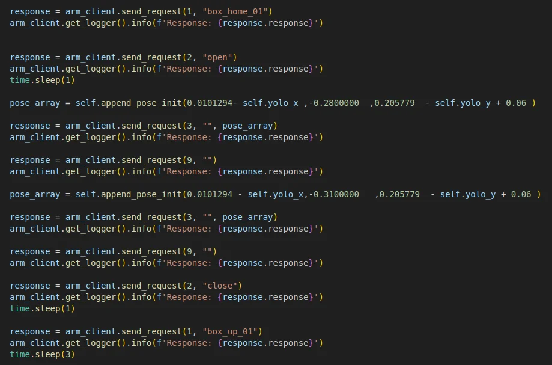

HUMAN AI ROBOTICS
74
터틀봇메내퓰레이터
참고
기타개발지원도구
실습
Aruco marker로 이동하고
Moveit으로 상자이송 코드 작성
simple_manager_node.py 다운로드

HUMAN AI ROBOTICS
75
터틀봇메내퓰레이터
참고
기타개발지원도구
manager_node를 완성하기전에 해야할일
1. task_7.py(빨간색 상자, 파란색 상자 잡기)가 정상적으로 작동하는 것을 완성
2. task_9.py(보라색 상자)가 정상적으로 작동하는 것을 완성
3. 해당 logic을 manager_node yolo_arm_control, purple_arm_control에 적용

HUMAN AI ROBOTICS
76
터틀봇메내퓰레이터
참고
기타개발지원도구
최종 실행 명령어 정리
ros2 launch turtlebot_manipulation_bringup hardware.launch.py(robot)
ros2 launch aruco_yolo aruco_yolo.launch.py(robot)
ros2 launch turtlebot3_manipulation_moveit_config moveit_core.launch.py(pc)
ros2 run turtlebot_moveit turtlebot_arm_controller(pc)
python3 simple_manager_node.py(pc) 
-
(turtlebot_moveit/scripts/폴더안에서 실행)
qt_gui

HUMAN AI ROBOTICS
77
터틀봇메내퓰레이터
참고
기타개발지원도구
Aruco 전진 거리 : 25cm(Aruco marker에서 부터 camera까지)
Aruco 후진 거리 : 117cm(Aruco marker에서 부터 camera까지)
yolo task 거리: 22.4cm(box 윗 면에서 부터 camera 까지)

HUMAN AI ROBOTICS
78
터틀봇메내퓰레이터
참고
기타개발지원도구
만약 qt_gui에서 이미지를 안 보겠다면
image 받는 부분을 주석처리

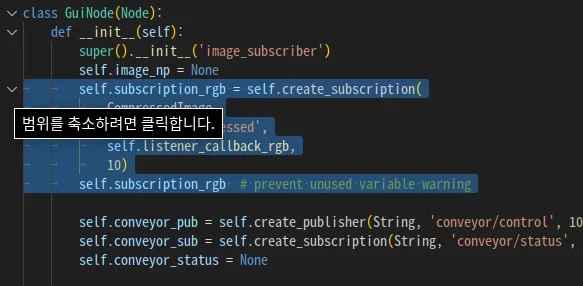

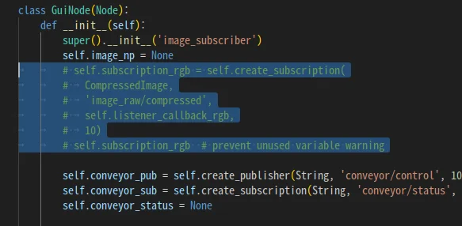

HUMAN AI ROBOTICS
79
터틀봇메내퓰레이터
참고
기타개발지원도구
ex) ros2 topic echo /joint_states >> a.txt
1.ros2 topic echo /joint_states는 ROS 2 토픽 /joint_states를 구독하여 해당 토픽의 데이터를 출력합니다. 
2./joint_states는 일반적으로 로봇의 관절 상태(joint positions, velocities 등)에 대한 정보를 포함하는 메시지입니다.
2.>> a.txt는 표준 출력의 내용을 a.txt 파일에 추가합니다. 파일이 이미 존재할 경우, 기존 내용을 유지하고 새로운 데이터를 파일 끝에 추가합니다.
따라서 이 명령은 ROS 2에서 특정 토픽 데이터를 파일로 기록할 때 유용합니다. 이를 활용하면 기록된 데이터를 분석하거나, 
다른 프로세스에서 처리할 수 있습니다.

HUMAN AI ROBOTICS
80
터틀봇메내퓰레이터
참고
기타개발지원도구
aruco_yolo에 자신의 pt파일을 적용시키고 싶으면
1. aruco_yolo/models에 자신의 pt파일을 넣는다
2. aruco_yolo의 setup.py로 간다

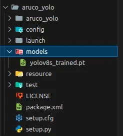

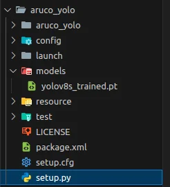

HUMAN AI ROBOTICS
81
터틀봇메내퓰레이터
참고
기타개발지원도구
3. setup.py에서 자신의 pt파일 명을 적는다.

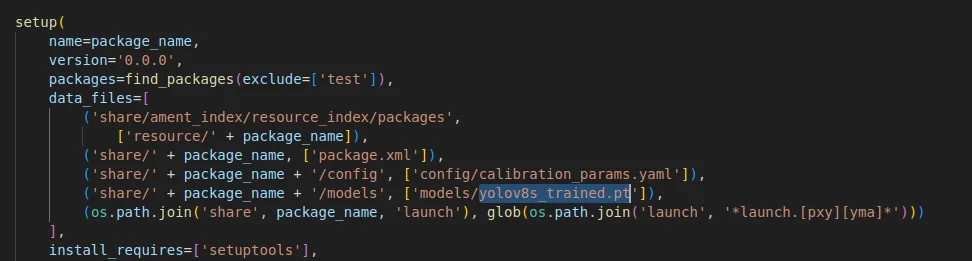

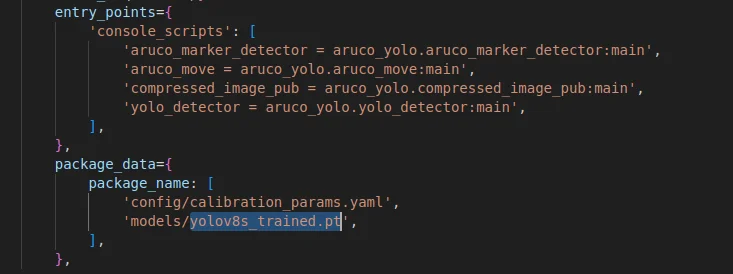

HUMAN AI ROBOTICS
82
터틀봇메내퓰레이터
참고
기타개발지원도구
4. aruco_yolo패키지 폴더안에 yolo_detector.py에 들어가서 model_path를 수정한다
5. turtlebot3_ws 에서 colcon build --packages-select aruco_yolo 로 빌드

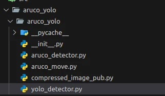

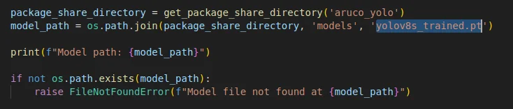

HUMAN AI ROBOTICS
83
터틀봇메내퓰레이터
참고
기타개발지원도구
마찬가지로 aruco에 적용될 calibration 값을 변경하려면 
aruco_yolo에 config 파일에 들어가서 수치 변경후 colcon build를 
한다

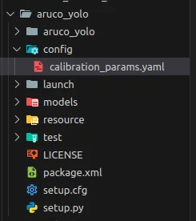

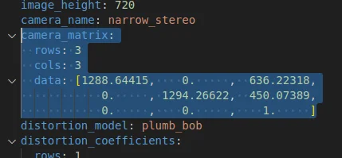

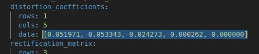

HUMAN AI ROBOTICS
84
터틀봇메내퓰레이터
참고
로봇에서실행되어야하는것들
1. ros2 launch turtlebot3_manipulation_bringup hardware.launch.py
2. ros2 launch aruco_yolo aruco_yolo.launch
1. ros2 launch turtlebot3_manipulation_moveit_config moveit_core.launch.py(pc)
2. ros2 run turtlebot_moveit turtlebot_arm_controller(pc)
3. python3 simple_manager_node.py(pc) (turtlebot_moveit/scripts/폴더안에서 실행)
pc에서실행되어야하는것들

HUMAN AI ROBOTICS
85
터틀봇메내퓰레이터
참고
기타개발지원도구

HUMAN AI ROBOTICS
86
터틀봇메내퓰레이터
참고
피지컬터틀봇사용

HUMAN AI ROBOTICS
87
터틀봇메내퓰레이터
참고
로봇연결및로봇조작순서
1. Turtlebot3_manipulation을 켤때
1.Opencr을 먼저 켜세요
2.Jetson orin switch를 켜세요
2. jetson orin도 일종의 컴퓨터 입니다 Hdmi cable로 monitor와 연결하고 usb port에 usb hub와 연결한 다음 keyboard와 mouse를 연결하세요
3. Jetson orin에 ubuntu 계정 login passward는 : rokey1234
4. 오른쪽 상단 wifi setting에 들어갑니다. 거기서 ‘Rokey-Ap-2’ wifi에 세팅합니다
passward: rokey12345
5. ctrl+alt+t를 눌러 terminal을 열고 ifconfig를 칩니다
ifconfig
그다음 로봇의 ip를 확인합니다
예) 172.30.1.XX -
(XX는 할당된 IP마다 다릅니다)
terminal 창에서 jetson orin의 컴퓨터명도 확인합니다
예) roekyXX@생략 - XX는 로봇마다 다른 숫자입니다
6. 5번에 찾은 컴퓨터명과 ip는 노트북에서 ssh 연결하기 위한 셋업니다
단 ssh는 서로 같은 wifi 공간에서 사용해야하는 본인 pc도 ‘Rokey-Ap-2’ wifi에 세팅합니다
그다음 노트북에 terminal을 연다음 다음과 같이 입력하세요
ssh -X rokeyOO@172.30.1.XX
만약 연결이 안되는 경우 실제 통신이 되는지 확인해봅니다
ping 172.30.1.XX (XX는 찾은 ip숫자)

HUMAN AI ROBOTICS
88
터틀봇메내퓰레이터
참고
로봇연결및로봇조작순서
7. ssh로 처음 연결하면 key를 받겠냐는 메세지가 나옵니다 거기서 yes를 입력하세요
그다음 접속하려는 계정의 passward를 물어봅니다 연결한 로봇의 passward와 동일합니다
passward: rokey1234
8. 로봇에서 실행하는 robot을 bringup 하는 명령어 입니다
ros2 launch turtlebot3_manipulation_bringup hardware.launch.py
9. 다른 터미널창을 열고 pc에서 로봇에 ssh 연결을 합니다
ssh -X rokeyOO@172.30.1.XX
password:rokey1234
10. 로봇에서 camera를 활성화하고 yolo와 aruco를 동시에 실행하는 launch 입니다
ros2 launch aruco_yolo aruco_yolo.launch.py
11. ssh로 실행한 ros도 확실하게 꺼주셔야 합니다
ssh로 연결된 로봇 터미널에서 활성된 ros 창에서
ctrl+c
누르고 꺼지는게 확인 될때 까지 기다리세요
12. ssh연결을 그냥 끊고 싶으면
exit
을 ssh로 연결한 로봇 터미널에 치세요
ssh로 연결한 로봇을 종료시키고 싶으면
sudo shutdown now
을 ssh로 연결한 로봇 터미널에 치세요
sudo로 실행한 명령어 이기에 로봇 password를 요구할겁니다
password:rokey1234
13. Turtlebot3_manipulation을 끌때
1.sudo shutdown now로 ubuntu를 제대로 종료한다
2.jetson orin switch를 종료시킨다
3.opencr을 종료시킨다

HUMAN AI ROBOTICS
89
터틀봇메내퓰레이터
참고
리눅스노트북설치가이드
참고사이트
turtlebot3_manipulation emanual:
https://emanual.robotis.com/docs/en/platform/turtlebot3/manipulation/#turtlebot3-with-openmanipulator
turtlebot3_manipulation git 주소:
https://github.com/ROBOTIS-GIT/turtlebot3_manipulation
강의 참고용 드라이브:https://tinylink.net/JfziW
이 과정이 완료되었을때 turtlebot3_ws/src에 들어있어야 하는 패키지는 다음과 같습니다
turtlebot3_manipulation turtlebot_cosmo_interface turtlebot_moveit
1. moveit과 관련된 ros2 package를 설치합니다
sudo apt install ros-humble-dynamixel-sdk ros-humble-ros2-control ros-humble-ros2-controllers ros-humble-gripper-controllers 
ros-humble-moveit* ros-humble-aruco-msgs
2. 만약 pc에 turtlebot3_ws가 home 디렉토리에 없을경우 workspace 폴더를 만드는 절차입니다
home 디렉토리에 있다면 무시하세요
mkdir -p turtlebot3_ws/src
3. turtlebot3_manipulation 패키지를 turtlebot3_ws안에 빌드하기 위해서 해당 workspace의 src 폴더로 이동합니다
cd ~/turtlebot3_ws/src/

HUMAN AI ROBOTICS
90
터틀봇메내퓰레이터
참고
리눅스노트북설치가이드
4. turtlebot3_manipulation 패키지를 다운받습니다
git clone -b humble https://github.com/ROBOTIS-GIT/turtlebot3_manipulation.git
5. turtlebot3_manipulation 패키지를 빌드합니다
cd ~/turtlebot3_ws && colcon build --symlink-install
6. 빌드된 패키지를 활성화 시킵니다
source install/setup.bash
7. 실제 패키지가 제대로 빌드되었는지 확인합니다
ros2 pkg list | grep turtlebot3_manipulation
8. 패키지가 빌드가 되었으면 moveit를 실행해봅시다
ros2 launch turtlebot3_manipulation_moveit_config moveit_core.launch.py
9. 두산폴더에서 turtlebot_cosmo_interface.zip을 먼저 다운로드 합니다
링크:https://tinylink.net/JfziW
10.다운 받은 turtlebot_cosmo_interface.zip을 압축해제하여 ~/turtlebot3_ws/src/안에 넣습니다
해당 패키지는 moveit 제어에 필요한 srv 등록용 패키지입니다
11.해당패키지를 ~/turtlebot3_ws/src/안에 넣었으면 터미널에서 빌드를 해줍니다
cd ~/turtlebot3_ws && colcon build --packages-select turtlebot_cosmo_interface

HUMAN AI ROBOTICS
91
터틀봇메내퓰레이터
참고
기타개발지원도구
12. 빌드된 패키지를 활성화 시킵니다
source install/setup.bash
13. turtlebot_cosmo_interface가 제대로 빌드되었는지 확인합니다
ros2 interface show turtlebot_cosmo_interface/srv/MoveitControl
14. 두산폴더에서 turtlebot_moveit.zip을 먼저 다운로드 합니다
링크:https://tinylink.net/JfziW
15.다운 받은 turtlebot_moveit.zip을 압축해제하여 ~/turtlebot3_ws/src/안에 넣습니다
해당 패키지는 서비스를 활성화 해서 python clinet가 준 request를 moveit에 plan으로 변환하는 turtlebot_arm_controller.cpp가 있습니다
16.해당패키지를 ~/turtlebot3_ws/src/안에 넣었으면 터미널에서 빌드를 해줍니다
cd ~/turtlebot3_ws && colcon build --packages-select turtlebot_moveit
현재 launch 폴더가 없는 상태인데 빌드하면서 오류가 나는것 같습니다
turtlebot_moveit패키지의 CMakeLists.txt에서 맨아래에 가보시면 launch가 명시되었는데 삭제하시고 저장한 다음 빌드가 정상적으로 작동 될 
것입니다
17. 빌드된 패키지를 활성화 시킵니다
source install/setup.bash
18. turtlebot_cosmo_interface가 제대로 빌드되었는지 확인합니다
ros2 pkg list | grep turtlebot_moveit

HUMAN AI ROBOTICS
92
터틀봇메내퓰레이터
참고
기타개발지원도구
Aruco_yolo 패키지 설명
aruco_yolo(package)
ㄴ aruco_yolo(src 폴더)
ㄴ__pycache__
ㄴ__init__.py
ㄴaruco_detector.py (영상 데이터를 수신한 다음 aruco marker detect 한 이후 aruco
marker data를 publish)
ㄴaruco_move.py(detected_marker topic을 수신해서 조건에 맞게 cmd_vel publish)
ㄴcompressed_image_pub.py(영상 데이터를 publish)
ㄴyolo_detector.py (영상 데이터를 수신한 다음 yolo를 이용하여 클래스 및 x,y 데이터 
publish)
ㄴconfig
ㄴcalibration_params.yaml
ㄴlaunch
ㄴaruco_move.launch.py
ㄴaruco_yolo.launch.py
ㄴmodels
ㄴyolov8s_trained.pt
ㄴresource
ㄴtest
ㄴpackage.xml
ㄴsetup.cfg
ㄴsetup.py

HUMAN AI ROBOTICS
93
터틀봇메내퓰레이터
참고
기타개발지원도구
turtlebot_moveit 패키지 설명
turtlebot_moveit
ㄴscripts
ㄴ__pycache__
ㄴ__init__.py
ㄴsimple_manager_node.py(manager_node 예시코드)
ㄴsrv_call_test.py(moveit_control 서비스에 요청하는 client 코드)
ㄴtask.py(task 요청하는 예시코드)
ㄴsrc
ㄴget_eef_pose.cpp (더미코드)
ㄴturtlebot_arm_controller.cpp (move_control 서비스를 만들고 python에서 요청한 
cmd,pose_name,waypoint를 수신하여 moveit에 plan을 execute하는 코드)
ㄴturtlebot_moveit.cpp (더미코드)
ㄴCMakeLists.txt
ㄴpackage.xml
turtlebot_cosmo_interface 패키지 설명
turtlebot_cosmo_interface
ㄴsrv
ㄴMoveitControl.srv
ㄴCMakeLists.txt
ㄴpackage.xml

HUMAN AI ROBOTICS
94
터틀봇메내퓰레이터
참고
노트북프로그램설치
manual
https://emanual.robotis.com/docs/en/platform/turtlebot3/manipulation/#turtlebot3-with-openmanipulator
git
https://github.com/ROBOTIS-GIT/turtlebot3_manipulation
1.
sudo apt install ros-humble-dynamixel-sdk ros-humble-ros2-control ros-humble-ros2-controllers ros-humble-gripper-controll
ers ros-humble-moveit* ros-humble-aruco-msgs
2.
mkdir -p turtlebot3_ws/src
3.
cd ~/turtlebot3_ws/src/
4.
git clone -b humble https://github.com/ROBOTIS-GIT/turtlebot3_manipulation.git
5.
cd ~/turtlebot3_ws && colcon build --symlink-install
확인하기:  cd ~/turtlebot3_ws/src/turtlebot3_manipulation
ros2 pkg list | grep turtlebot3_manipulation

HUMAN AI ROBOTICS
95
참고
수고하셨습니다.

HUMAN AI ROBOTICS
96
터틀봇메내퓰레이터
참고
기타개발지원도구

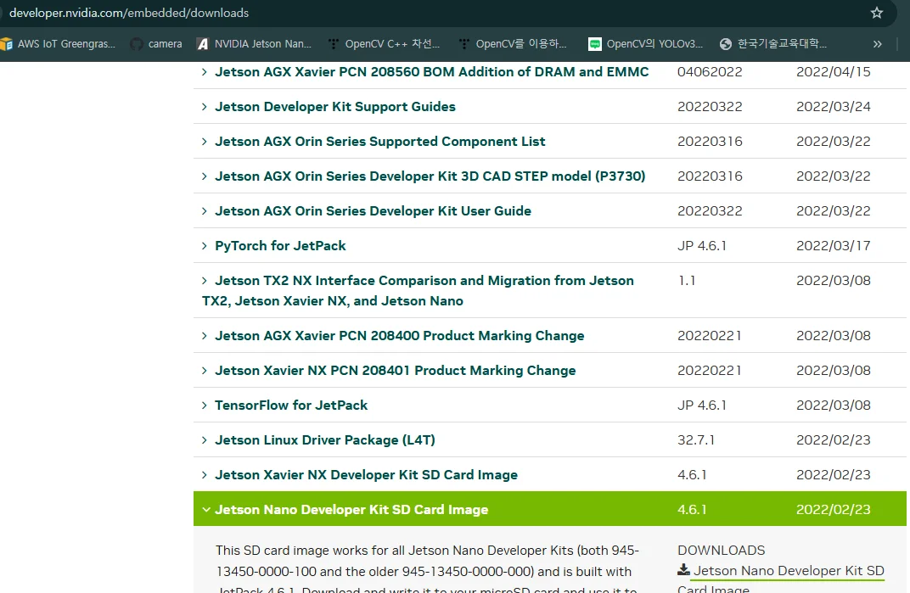

HUMAN AI ROBOTICS
97
터틀봇메내퓰레이터
참고
task_7(red_blue).py
＜주요 기능 요약＞
1. YOLO 결과 수신： /yolo/detected_info 토픽에서 YOLO가 인식한 객체 좌표를 수신하여 파싱＊
2. 로봇 암 제어：YOLO 결과를 바탕으로 로봇 암이 해당 위치로 이동하여 집거나 내려놓는 작업 수행
3. 키보드 인터페이스：키 입력을 통해 로봇 제어 및 보정(offset) 값 조정
4. Joint 상태 확인 및 출력
5. 보정값 파일 읽기/쓰기：offset_values.txt를 이용해 좌표 보정 값 유지
＜전체 구조 개요＞
• solv2, solv_robot_arm2: 역기구학 (Inverse Kinematics) 계산 함수
• YoloDetect: ROS 노드 클래스
• main: 키보드 입력 기반의 상호작용 실행 루프
＊‘파싱’이란, 이 메시지를 받아서 → 필요한 정보(예: 객체 이름, (x, y) 위치, 너비, 높이 등)를 
→ 프로그래밍적으로 추출해서 사용할 수 있도록 변환하는 과정

HUMAN AI ROBOTICS
98
터틀봇메내퓰레이터
참고
task_7(red_blue).py
def solv2(r1, r2, r3):
d1 = (r3**2 - r2**2 + r1**2) / (2*r3)
d2 = (r3**2 + r2**2 - r1**2) / (2*r3)
s1 = math.acos(d1 / r1)
s2 = math.acos(d2 / r2)
return s1, s2
# x, y, z : relational position from J0 (joint 0)
# r1 : distance J0 to J1
# r2 : distance J1 to J2
# r3 : distance J2 to J3
# sr1 : angle between z-axis to J0->J1
# sr2 : angle between J0->J1 to J1->J2
# sr3 : angle between J1->J2 to J2->J3 (maybe always parallel)
def solv_robot_arm2(x, y, z, r1, r2, r3):
z = z + r3 - j1_z_offset
Rt = math.sqrt(x**2 + y**2 + z**2)
Rxy = math.sqrt(x**2 + y**2)
St = math.asin(z / Rt)
# 
Sxy = math.acos(x / Rxy)
Sxy = math.atan2(y, x)
s1, s2 = solv2(r1, r2, Rt)
sr1 = math.pi/2 - (s1 + St)
sr2 = s1 + s2
sr2_ = sr1 + sr2
sr3 = math.pi - sr2_
return Sxy, sr1, sr2, sr3, St, Rt
•
역기구학 함수
1. solv2(r1, r2, r3)
- 삼각형의 세 변을 알고 있을 때, 각도를 구함
(Cosine Law 활용)
2. solv_robot_arm2(x, y, z, r1, r2, r3)
- 로봇팔의 링크 길이와 목표 위치(x, y, z)를 입력 받아 각 
관절(joint)의 회전 각도를 계산

HUMAN AI ROBOTICS
99
터틀봇메내퓰레이터
참고
task_7(red_blue).py
Class YoloDetect(Node): 
•
self.subscription  # YOLO 인식 데이터 수신
•
self.joint_pub     # 관절 제어 메시지 퍼블리셔
•
self.cmd_vel_publisher  # 이동 속도 퍼블리셔
＜주요 속성＞
1. listener_callback(self, msg)
• YOLO 인식 결과(문자열 형태의 리스트)를 파싱하여 
self.yolo_x, self.yolo_y로 저장
2. arm_controll(self)
3. append_pose_init(x, y, z)
• PoseArray 메시지를 만들어서 MoveIt 서비스 요청 시 사용
4. joint_states_callback
• 현재 로봇 관절(joint)의 위치 상태 출력
＜주요 동작＞
YOLO
객체 인식
5. 다시 camera 위치로 이동
4. Home 위치로 복귀
1. 그리퍼 Open
2. 객체 위치로 이동
3. 객체를 집음

HUMAN AI ROBOTICS
100
터틀봇메내퓰레이터
참고
task_7(red_blue).py
키
기능
1
YOLO 인식 결과를 한 번 수신하여 
yolo_x, yolo_y 변수에 저장 및 콘솔 출력
2
YOLO 위치 수신 & 그리퍼 열기
3
YOLO 위치 기준으로 보정값 적용 및 이동
4
물체 잡기 전 Z축 낮춤
5
그리퍼 close
6
그리퍼 open
7
home2 위치 이동
8
camera_home 위치 이동
9
현재 저장된 오프셋 값들을 콘솔 출력
0
현재 오프셋 값을 offset_values.txt 파일에 저장
main() - 키보드 입력 기반 제어 루프
• getkey.getkey() 로 키보드 입력을 받아 아래 작업 수행
offset_values.txt 파일
• YOLO가 인식한 좌표는 정확하지 않기 때문에, 위치 보정을 위한 offset 
• 프로그램 시작 시 읽고, 키보드 조정 후 저장 가능
Right 
Low
Right 
High
Left 
Low
Left 
High
전진후진
닫기열기
X+
X-
Y+
Y-
X+
X-
Y+
Y-
X+
X-
Y+
Y-
X+
X-
Y+
Y-
키
기능
키
기능
A
home2 이동
F
box_up_01 이동
B
conveyor_up 이동
G
box_up_02 이동
C
camera_home 이동
H
box_up_03 이동
D
test_conveyor 이동
I
box_back_01 이동
E
box_home_01 이동
J
box_back_put 이동
현재 관절 상태 출력
프로그램 종료
[그리퍼]
[로봇]

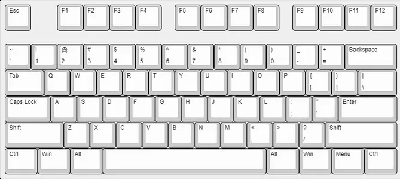

HUMAN AI ROBOTICS
101
터틀봇메내퓰레이터
참고
task_7(red_blue).py
서비스 클라이언트: TurtlebotArmClient
• send_request 메서드를 통해 MoveIt으로 로봇 암 제어 명령을 보냄
타입
의미
send_request(0, "", pose_array)
특정 위치로 이동
send_request(1, "group_states")
지정된 홈 위치로 이동
send_request(2, "open") / close
그리퍼 열기/닫기
group_states
home2
box_up_01
conveyor_up
box_up_02
camera_home
box_up_03
test_conveyor
box_back_01
box_home_01
box_back_put
Ex) send_rquest(1, “home2”)

HUMAN AI ROBOTICS
102
터틀봇메내퓰레이터
참고
task_7(red_blue).py
키
기능
1
YOLO 인식 결과를 한 번 수신하여 
yolo_x, yolo_y 변수에 저장 및 콘솔 출력
2
YOLO 위치 수신 & 그리퍼 열기
3
YOLO 위치 기준으로 보정값 적용 및 이동
4
물체 잡기 전 Z축 낮춤
5
그리퍼 close
키
기능
키
기능
A
home2 이동
F
box_up_01 이동
B
conveyor_up 이동
G
box_up_02 이동
C
camera_home 이동
H
box_up_03 이동
D
test_conveyor 이동
I
box_back_01 이동
E
box_home_01 이동
J
box_back_put 이동

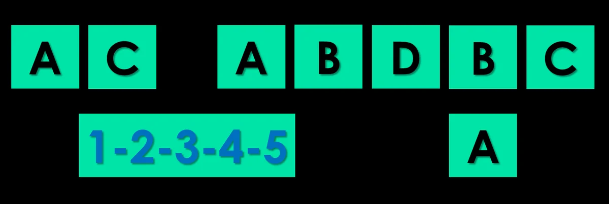
