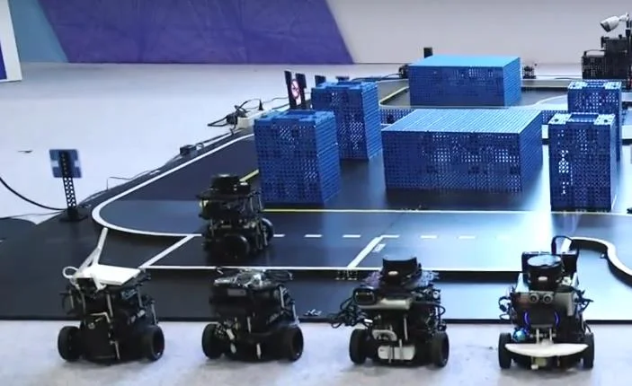
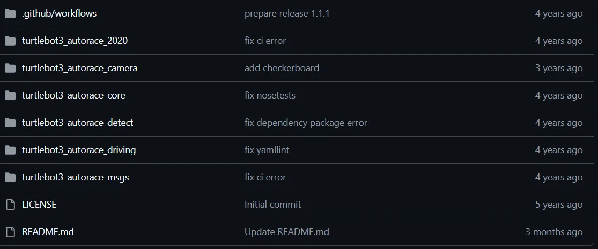
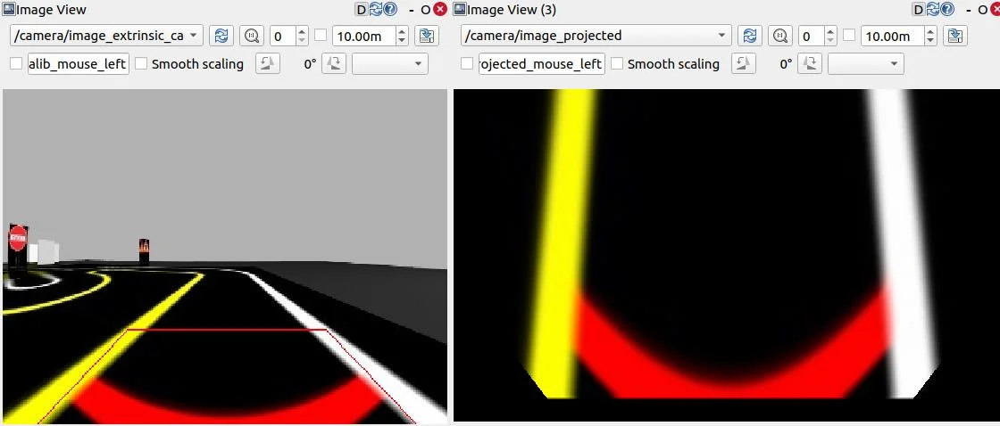
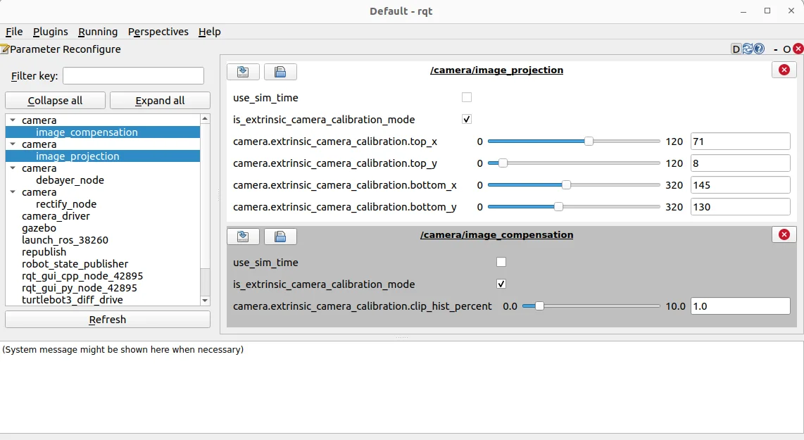
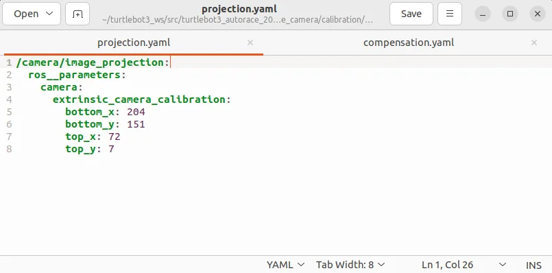
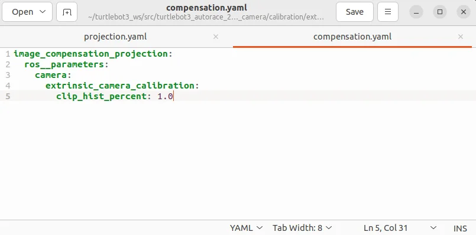
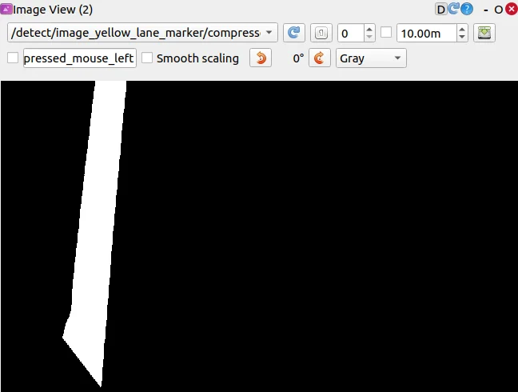
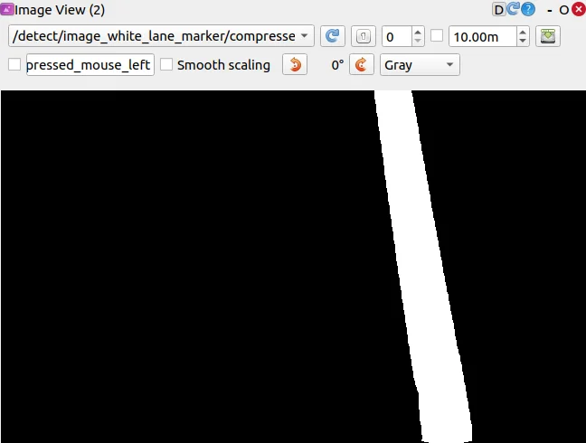
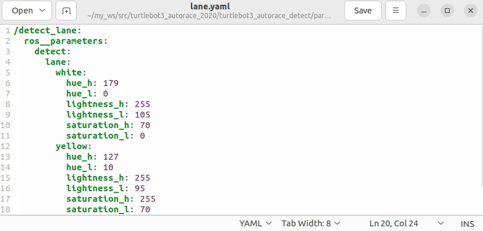
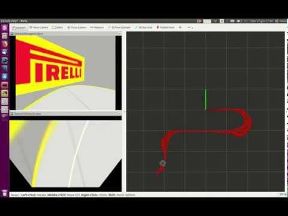

# 로키 -  자율주행 디지털 트윈 프로젝트 교안

Version
V1.0
최종수정일
2025.03.19
작성자
김루진
두산 프로젝트 교안

자율주행디지털트윈구현
자율주행수행
학습 목표
내용검증필요

디지털트윈, 자율주행
참고
디지털트윈

디지털트윈, 자율주행
참고
디지털트윈및활용
디지털 트윈(Digital Twin)은 물리적 객체나 시스템의 가상 복제본을 의미하는 첨단 기술입니다.
자율주행 분야에서 이 기술은 매우 중요한 역할을 하고 있습니다.

1. 차량 개발 및 시뮬레이션
-실제 주행 환경을 완벽하게 재현하여 다양한 주행 시나리오 테스트
-물리적 프로토타입 제작 전 가상 환경에서 성능과 안전성 검증
-극한 기후 조건, 복잡한 교통 상황 등 다양한 환경 시뮬레이션

2. 실시간 성능 모니터링
-차량의 실시간 상태, 부품 마모, 성능 추적
-예측 유지보수를 통한 잠재적 고장 사전 예방
-센서 데이터와 가상 모델의 지속적인 동기화

3. 주행 알고리즘 최적화
-인공지능 및 머신러닝 알고리즘의 지속적인 학습
-다양한 주행 시나리오에 대한 의사결정 최적화
-차량 간 통신(V2V) 및 인프라 통신(V2I) 시스템 개선

디지털트윈, 자율주행
참고
ROS 2 노드와 데이터 동기화
디지털 트윈을 구현하려면 Gazebo에서 생성된 데이터와 실제 센서 데이터를 동기화해야 합니다.
① Gazebo에서 센서 데이터 수집
Gazebo에서 센서 데이터를 구독하여 실제 데이터와 비교합니다.
② 실제 로봇 센서 데이터 수집
실제 로봇에서도 동일한 명령을 실행하여 데이터를 비교합니다.
③ TF(Transform) 동기화
실제 로봇과 시뮬레이션 로봇의 TF를 맞춰야 합니다.
Nav2와 AMCL을 활용하여 실제 환경과 일치하는 위치 추정을 수행합니다.
ros2 launch nav2_bringup localization_launch.py use_sim_time:=true
Gazebo의 use_sim_time을 활성화하여 시뮬레이션 시간을 사용할 수 있습니다.
ros2 param set /gazebo use_sim_time true

디지털트윈, 자율주행
참고
실제 로봇과 가상 로봇 간의 데이터 연동
① ROS 2 네임스페이스 및 리매핑 활용
다음과 같이 토픽을 리매핑하여 실제 데이터와 가상 데이터를 매칭할 수 있습니다.
<node pkg="ros2_bridge" exec="ros2_bridge_node">
    <remap from="/real_scan" to="/sim_scan"/>
    <remap from="/real_odom" to="/sim_odom"/>
</node>
② MQTT/ROS 2 Bridge 활용
실제 센서 데이터를 MQTT로 송신하고, Gazebo에서 이를 구독할 수도 있습니다.
ros2 run rosbridge_server rosbridge_websocket
이후 Python을 이용하여 MQTT로 데이터를 송수신할 수 있습니다.
디지털트윈, 자율주행
참고
실제 환경과 시뮬레이션 비교 및 보정
① SLAM 및 Localization 검증
Gazebo에서 생성된 맵과 실제 맵을 비교하여 차이를 보정합니다.
ros2 run nav2_map_server map_saver_cli -f sim_map
ros2 run nav2_map_server map_saver_cli -f real_map
② 데이터 로그 및 분석
ROS 2의 bag 파일을 활용하여 로그를 기록하고 분석할 수 있습니다.
ros2 bag record -o sim_data /scan /odom
ros2 bag record -o real_data /real_scan /real_odom
이후 데이터를 비교하여 실제와 시뮬레이션의 차이를 확인할 수 있습니다.

디지털트윈, 자율주행
참고
오토레이스

디지털트윈, 자율주행
참고
주요 사양
-베이스 플랫폼:
-TurtleBot3 AuroraRace는 기존 TurtleBot3 모델을 바탕으로 하며, 확장된 성능을 제공.
-주행 성능:
-고속 주행이 가능하며, 빠르고 민첩하게 움직일 수 있도록 설계.
-경주용 로봇으로서 성능을 강화한 모델.
-센서:
-자율 주행을 위한 다양한 센서들이 장착되어 있습니다.
-일반적으로 LiDAR(Light Detection and Ranging), 카메라, IMU(Inertial Measurement Unit) 등을 포함하여 환경을 실시간으로 인식하고 맵을 생성
-제어 시스템:
-ROS 2 및 ROS 1을 모두 지원하며, 다양한 로봇 제어 및 자율 주행 알고리즘을 실험하고 개발.
-모터와 구동 시스템:
-높은 토크와 성능을 제공하는 구동 시스템을 갖추고 있어, 레이싱 환경에서도 안정적인 성능을 발휘.

디지털트윈, 자율주행
참고
참고
https://github.com/ROBOTIS-GIT/turtlebot3_autorace_2020

디지털트윈, 자율주행
참고
자율주행수행설치
https://emanual.robotis.com/docs/en/platform/turtlebot3/autonomous_driving/
https://emanual.robotis.com/docs/en/platform/turtlebot3/simulation/
사전 학습: 주행 시뮬레이션
$ cd ~/turtlebot3_ws/src/
$ git clone https://github.com/ROBOTIS-GIT/turtlebot3_autorace.git
$ cd ~/turtlebot3_ws && colcon build --symlink-install
페키지 인스톨(PC 설치)
$ sudo apt install ros-humble-image-transport ros-humble-cv-bridge ros-humble-vision-opencv python3-
opencv libopencv-dev ros-humble-image-pipeline

디지털트윈, 자율주행
참고
자율주행수행설치
월드 플러그인 설정
카메라 보정
.bashrc에 내보내기 줄을 추가하고 작업 공간 이름을 {your_ws}에 넣으세요. 이 플러그인을 사용하면 세상에
서 동적 환경을 애니메이션으로 표현할 수 있습니다.
$ echo 'export
GAZEBO_PLUGIN_PATH=$HOME/{your_ws}/build/turtlebot3_gazebo:$GAZEBO_PLUGIN_PATH' >>
~/.bashrc
카메라 보정은 자율 주행에 필수적입니다. 카메라가 로봇 환경에 대한 정확한 데이터를 제공하도록 보장하기
때문입니다. Gazebo 시뮬레이션은 일부 보정 단계를 간소화하지만, 보정 프로세스를 이해하는 것은 실제 로
봇으로 전환하는 데 중요합니다. 카메라 보정은 일반적으로 두 단계로 구성됩니다. 내부 카메라 속성을 처리
하는 내재적 보정과 카메라 뷰를 로봇 좌표계에 맞추는 외재적 보정입니다. Gazebo에서는 시뮬레이션이 미리
정의된 카메라 매개변수를 사용하기 때문에 이러한 단계가 필요하지 않지만, 이러한 지침은 실제 하드웨어 배
포를 위한 전체 프로세스를 이해하는 데 도움이 됩니다.

디지털트윈, 자율주행
참고
자율주행수행설치
Gazebo 시뮬레이션에서는 시뮬레이션된 카메라에 렌즈 왜곡이 없기 때문에 카메라 이미징 보정이 필요 않음.
시작하려면 다음 명령을 실행하여 원격 PC에서 Gazebo 시뮬레이션을 시작합니다.
$ ros2 launch turtlebot3_gazebo turtlebot3_autorace_2020.launch.py
렌즈 왜곡을 보정하고 초점 거리 및 광학 중심과 같은 카메라의 내부 속성을 결정하는 데 중점을 둡니다. 실
제 로봇에서는 이 프로세스가 필수적이지만 Gazebo 시뮬레이션에서는 시뮬레이션된 카메라가 이미 왜곡이
없고 이상적인 이미지를 제공하기 때문에 내재적 교정이 필요하지 않습니다. 그러나 이 단계는 사용자가 실
제 하드웨어 배포 프로세스를 이해하는 데 도움이 되도록 포함되었습니다.
실제 하드웨어에서 실행되는 것처럼 내재적 교정 프로세스를 실행하려면 다음을 실행합니다.
$ ros2 launch turtlebot3_autorace_camera intrinsic_camera_calibration.launch.py

1. 내재적 교정

디지털트윈, 자율주행
참고
자율주행수행설치
이 단계에서는 이미지 출력이 수정되지 않지만 후속 처리에 올바른 topic(/camera/image_rect 또는
/camera/image_rect_color/compressed)를 사용할 수 있도록 보장합니다.

2. 외부 교정
외부 카메라 보정
외부 보정은 카메라의 관점을 로봇의 좌표계와 일치시켜 카메라 뷰에서 감지된 객체가 로봇 환경에서 실제
위치와 일치하도록 합니다. 실제 로봇에서는 이 프로세스가 중요하지만, Gazebo 시뮬레이션에서는 일관성을
위해 보정을 수행하고 사용자에게 실제 워크플로에 익숙해지도록 합니다.
시뮬레이션이 실행되면 외부 보정 프로세스를 시작합니다.
$ ros2 launch turtlebot3_autorace_camera extrinsic_camera_calibration.launch.py calibration_mode:=True

디지털트윈, 자율주행
참고
자율주행수행설치
카메라-지면 투사 및 보상을 담당하는 노드가 활성화됩니다.
시각화 및 매개변수 조정
$ rqt
Navigate to Plugins > Visualization > Image view 이동합니다. 두 개의 이미지 뷰 창을 만듭니다.
한 창에서 /camera/image_extrinsic_calib 토픽을 선택하고 다른 창에서 /camera/image_projected를 선택합니다.
첫 번째 토픽은 빨간색 사다리꼴 모양의 이미지를 보여주고, 두 번째 토픽은 지상 투사 뷰(조감도)를 보여줍니다.

디지털트윈, 자율주행
참고
자율주행수행설치

디지털트윈, 자율주행
참고
자율주행수행설치
Plugins > Configuration > Dynamic Reconfigure.으로 이동합니다.
/camera/image_projection 및 /camera/image_compensation의 매개변수를 조정하여 카메라의 보정을 조정합니다.
/camera/image_projection 값을 변경하여 /camera/image_extrinsic_calib 주제를 조정합니다.
내장 카메라 보정은 빨간색 사다리꼴의 이미지 관점을 수정합니다.
/camera/image_compensation을 조정하여 /camera/image_projected 조감도를 미세 조정합니다.

디지털트윈, 자율주행
참고
자율주행수행설치

디지털트윈, 자율주행
참고
자율주행수행설치
교정 데이터 저장
최상의 프로젝션 설정을 찾으면 매개변수가 세션 전체에 걸쳐 지속되도록 교정 데이터를 저장해야 합니다. 외부
교정 데이터를 저장하는 한 가지 방법은 YAML 구성 파일을 수동으로 편집하는 것입니다.
$ cd ~/turtlebot3_ws/src/turtlebot3_autorace/turtlebot3_autorace_camera/calibration/extrinsic_calibration/
$ gedit projection.yaml
동적 재구성에서 얻은 값과 일치하도록 투영 매개변수를 수정합니다.
이 방법은 외부 교정 매개변수가 향후 실행을 위해 올바르게 저장되도록 보장합니다

디지털트윈, 자율주행
참고
자율주행수행설치

디지털트윈, 자율주행
참고
자율주행수행설치
교정 결과 확인
교정 프로세스를 완료한 후 원격 PC에서 아래 지침에 따라 교정 결과를 확인합니다.
현재 외부 교정 프로세스를 중지합니다.
외부 교정이 교정_모드:=True에서 시작된 경우 터미널을 닫거나 Ctrl + C를 눌러 프로세스를 중지합니다.
교정 모드 없이 외부 교정 노드를 시작합니다.
이렇게 하면 시스템이 저장된 교정 매개변수를 검증에 적용합니다.
$ ros2 launch turtlebot3_autorace_camera extrinsic_camera_calibration.launch.py
rqt를 실행하고 Plugins > Visualization > Image view로 이동합니다.
$ rqt

디지털트윈, 자율주행
참고
자율주행수행설치
성공적인 보정 설정으로, /camera/image_projected 주제를 선택했을 때 조감도(bird-eye view) 이미지가 아
래와 같이 나타나야 합니다.
디지털트윈, 자율주행
참고
차선(Lane) 감지

디지털트윈, 자율주행
참고
차선 감지를 통해 TurtleBot3는 차선 표시를 인식하고 자율적으로 따라갈 수 있습니다. 이 시스템은 실제
TurtleBot3 또는 Gazebo 시뮬레이션에서 카메라 이미지를 처리하고, 색상 필터링을 적용하고, 차선 경계를
식별합니다.
이 섹션에서는 차선 감지 시스템을 시작하고, 감지된 차선 표시를 시각화하고, 정확한 추적을 보장하기 위해
매개변수를 보정하는 방법을 설명합니다.
시뮬레이션에서 차선 감지 시작
시작하려면 미리 정의된 차선 추적 코스로 Gazebo 시뮬레이션을 시작합니다.
$ ros2 launch turtlebot3_gazebo turtlebot3_autorace_2020.launch.py
다음으로, 감지된 차선이 로봇의 관점에 정확하게 매핑되었는지 확인하는 카메라 보정 프로세스를 실행합니다.
$ ros2 launch turtlebot3_autorace_camera intrinsic_camera_calibration.launch.py
$ ros2 launch turtlebot3_autorace_camera extrinsic_camera_calibration.launch.py

디지털트윈, 자율주행
참고
이러한 단계는 카메라 피드의 왜곡을 수정하기 위해 내재적 및 외재적 교정을 활성화합니다.
마지막으로, 차선 감지 노드를 교정 모드로 실행하여 차선 감지를 시작합니다.
$ ros2 launch turtlebot3_autorace_camera detect_lane.launch.py calibration_mode:=True
차선 감지 출력 시각화
감지된 차선을 검사하려면 원격 PC에서 rqt를 엽니다.
그런 다음 Plugins > Visualization > Image View 이동하여 세 개의 이미지 뷰어를 열어 다양한 차선 감지
결과를 표시합니다.

디지털트윈, 자율주행
참고
차선 감지 매개변수 교정
최적의 정확도를 위해 감지 매개변수를 조정하는 것이 필요합니다. 이러한 매개변수를 조정하면 로봇이 다양한 조명
환경 조건에서 차선을 올바르게 식별할 수 있습니다.
turtlebot3_autorace_detect/param/lane/에 있는 lane.yaml 파일을 열고 수정된 값을 이 파일에 씁니다. 이렇게 하면
메라가 향후 실행에 수정된 매개변수를 사용합니다.
$ cd ~/turtlebot3_ws/src/turtlebot3_autorace/turtlebot3_autorace_detect/param/lane

디지털트윈, 자율주행
참고
차선 추적 실행
캘리브레이션이 완료되면 캘리브레이션 옵션 없이 차선 감지 노드를 다시 시작합니다.
$ cd ~/turtlebot3_ws/src/turtlebot3_autorace/turtlebot3_autorace_detect/param/lane
$ ros2 launch turtlebot3_autorace_detect detect_lane.launch.py

디지털트윈, 자율주행
참고
그런 다음, TurtleBot3가 감지된 차선을 자동으로 따라갈 수 있도록 차선 추적 제어 노드를 시작합니다.
$ ros2 turtlebot3_autorace_driving control_lane.launch.py를 시작합니다.

디지털트윈, 자율주행
참고
프로젝트과제

디지털트윈, 자율주행
참고

1. 구현 가능한 디지털 트윈 시나리오를 작성한다.
2. 전체 설계서와 상세 설계서를 작성한다.
3. 전체 일정과 RnR을 정의 하고 시작한다.
1. 주어진 자율주행 트랙에서 센서에 반응하는 컨베이어 벨트 아두이노 코들 작성한다.
2. 프로젝트에서 사용될 아로크 마커를 생성한다.
3. 자율주행 트랙에 사용되는 신호등, 차단기를 하드웨어, 소프트웨어를 개발한다.
4. 자율주행 트랙과 터틀봇3 메니퓰레이터와 신호등, 차단기 등이 구성된 디지털 트윈으로 구현한다.
5. 차선을 인식하고 주행하는 자율주행 차를 개발한다.
1. 라이다, 레이다를 사용하여 실시간으로 장애물 회피 동작을 구현한다.
2. 박스가 도로에 있는 경우 메니퓰레이터로 들어서 마지막 지점 컨베어벨트에 놓는다.
3. 기타 자율주행에 필요한 기술 적용

디지털트윈, 자율주행
참고
This repository contains a folder named world which contains the gazebo simulation environments.
In order to makes it work you need to copy the environments inside the gazebo models directory.
In order to do that do the following commands:
roscd turtlebot3_autorace_simulation
cp -r ./world/turtlebot3_autorace_track* $HOME/.gazebo/models
cp -r ./world/*_logo $HOME/.gazebo/models
cp -r ./world/chess_flag $HOME/.gazebo/models

디지털트윈, 자율주행
참고
This repository use a custom model of turtlebot3. This model is the turtlebot3 burger pi.
In order to have it inside the simulation environment it has to be added to the models description in the
turtlebot3_descripion package. The 3D model and robot description is inside the urdf folder.
In order to add it to the choosable models do the following steps:
cp ./urdf/turtlebot3_burger_pi* $HOME/catkin_ws/src/turtlebot3/turtlebot3_description/urdf/.

디지털트윈, 자율주행
참고
참고할프로젝트
https://github.com/falfab/turtlebot3_autorace_simulation
Turtlebot 3 Autorace simulation is a ROS package which allows to run turtlebot3_autorace from ROBOTIS-GIT in simulation.
It is fully parametrizable and customizable.
Next will follow the instructions to getting started with standard examples and to customize trucks to test the package.
Circuit race with logo detection
In order to makes the turtlebot perform a race in a circuit with
logo detection do the following steps:
roslaunch turtlebot3_autorace_simulation circuit.launch
roslaunch turtlebot3_autorace_simulation autorace.launch
By default gazebo is launched with no gui, if you want to see
robot visualization do this:
roslaunch turtlebot3_autorace_simulation
config_file:=circuit.rviz

디지털트윈, 자율주행
참고

디지털트윈, 자율주행
참고

디지털트윈, 자율주행
참고

디지털트윈, 자율주행
참고

디지털트윈, 자율주행
참고
추가자료

디지털트윈, 자율주행
참고

디지털트윈, 자율주행
참고
가제보물리엔진
ODE(Open Dynamics Engine)는 Gazebo에서 기본적으로 제공하는 물리 엔진 중 하나
로봇의 충돌 감지 및 물리 시뮬레이션을 담당합니다.
ODE를 사용할 경우:

계산 속도가 빠름

충돌 감지가 안정적

다이나믹한 움직임을 시뮬레이션하기 용이

복잡한 관절 시스템에서 정확도가 떨어질 수 있음

만약 더 정밀한 물리 엔진이 필요하다면?
-DART: 동역학 시뮬레이션 정밀도 향상
-Bullet: 충돌 감지가 정밀하고 로봇 시뮬레이션에 적합
-Simbody: 물리적으로 정확한 시뮬레이션 수행 가능

참고
수고하셨습니다.

