# 01_로키 - 두산 프로젝트 교안(RVIZ2)_김루진_0225

Version
V2.0
최종수정일
2024.12.17
작성자
김루진
두산 프로젝트 교안

CONTENTS
ROS2와RVIZ2 시뮬레이터를이용한로봇구동
로봇URDF, XACRO,SDF 이용한로봇만들기및기동
터틀봇3 설치및SLAM, NAVIGATION 수행
비전딥러닝을활용한터틀봇3 활용

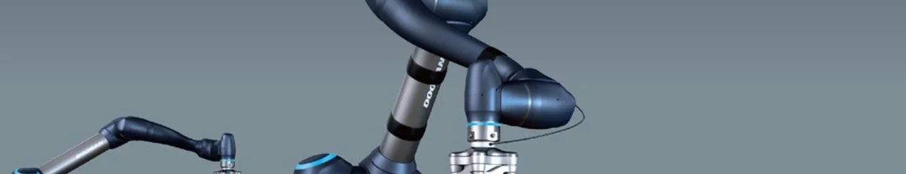

ROS2와RVIZ2 시뮬레이터를이용한로봇구동
로봇URDF, XACRO,SDF 이용한로봇및기동
자율주행로봇시뮬레이션
학습 주제

HUMAN AI ROBOTICS
4
RVIZ2
참고
학습목표
1. RViz2의 인터페이스와 기본 사용법을 이해하고, ROS2 환경에서 RViz2를 설정할 수 있다.
2. 다양한 센서 데이터를 RViz2에서 시각화하고, 로봇의 상태 및 환경을 모니터링하는 방법 학습 한다.
3. RViz2의 고급 기능을 활용하여 실제 로봇과 상호작용하는 환경에서 시뮬레이션을 수행 할 수 있다.

HUMAN AI ROBOTICS
5
ROS2 시각화도구RVIZ2
참고
ROS2 개발도구들

HUMAN AI ROBOTICS
6
RVIZ2
참고
기타개발지원도구
▪CLI: Command-Line Instruction
•  GUI 없이 ROS에서 제공되는 명령어만으로도 로봇 제어 및 거의 모든 ROS 기능 소화 가능
▪RQT
•  그래픽 인터페이스 개발을 위한 Qt 기반 프레임 워크 제공
•  노드와 그들 사이의 연결 정보 표시 (rqt_graph)
•  인코더, 전압같이 시간에 따라 변화하는 숫자를 플로팅 (rqt_plot)
•  데이터를 메시지 형태로 기록하고 재생 (rqt_bag)
▪Rviz (ROS Visualization)
•  강력한 2D, 3D 시각화 툴
•  로봇 시스템 이해에 도움

HUMAN AI ROBOTICS
7
RQT
참고
RQT
 RQT : 시스템의 다양한 측면을 시각화하고 상호작용할 수 있게 해주는 플러그인 기반의 프레임워크
 주요 기능:
• 토픽 모니터링 및 발행 
• 파라미터 서버 조작 
• 노드 그래프 시각화 
• 로그 뷰어 
• 플롯 도구 
• 이미지 뷰어 
 주요 플로그인:
• rqt_graph: 노드 토픽 연결을 그래프로 표시
• rqt_plot: 토픽 데이터를 실시간 그래프로 표시 
• rqt_console: 로그 메시지 표시및 필터링 
• rqt_image_view: 이미지 토픽 시각화 
• rqt_publisher: 토픽 발행 인터페이스를 제공
HUMAN AI ROBOTICS
8
RQT
참고
RQT Message Publisher
  상단 메뉴에서 Plugins -> Topic -> Message Publisher
※ 만약 플러그인이 표시되지 않으면 rqt 관련 플러그인이 설치되지 않았을 수 있으니 설치. 
  토픽과 메시지 형식을 선택.
•  Topic Name: 게시할 토픽의 이름 (예: /my_topic)
•  Message Type: 게시할 메시지의 타입 (예: std_msgs/msg/String)
$ sudo apt install ros-humble-rqt-publisher

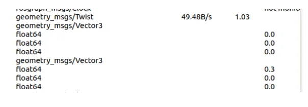

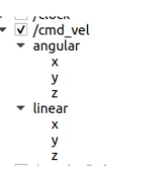

HUMAN AI ROBOTICS
9
RQT
참고
RQT_plot
•  실시간 토픽 데이터 시각화 툴
•  Plugins -> Visualization -> Plot
예시: 터틀심
1.
터틀심, teleop_key, rqt 실행
2. rqt_plots 추가
3. plot Topic에 /turtle1/cmd_vel/linear 입력
4. teleop_key으로 작동하여 rqt_plot 그래프 확인
 rqt_plot
$ ros2 run turtlesim turtlesim_node
$ ros2 run turtlesim turtle_teleop_key
$ rqt
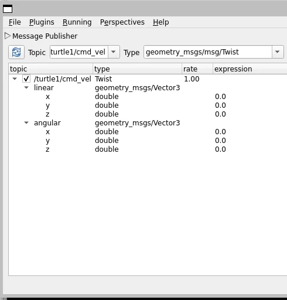

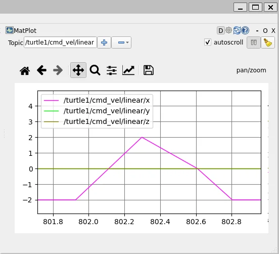

HUMAN AI ROBOTICS
10
RQT
참고
RQT_IMAGE_VIEW
 rqt_image_view
•  카메라 또는 다른 이미지 센서가 퍼블리시하는 이미지를 실시간으로 확인
•  Plugins -> Visualization -> image_view
※ 만약 플러그인이 표시되지 않으면 rqt 관련 플러그인이 설치되지 않았을 수 있으니 설치. 
$ sudo apt update
$ sudo apt install ros-humble-rqt-image-view
• 일반적으로 이미지 데이터는 sensor_msgs/msg/Image 타입
• 카메라 센서가 있는 경우 토픽 이름은 주로 /camera/image_raw와 같은 형식
HUMAN AI ROBOTICS
11
ROS2 시각화도구RVIZ2
참고
RVIZ2

HUMAN AI ROBOTICS
12
ROS2 시각화도구RVIZ2
참고
RVIZ2 특징
▪강력한 시각화 툴
•  로봇의 외형(URDF/XACRO 형식의 3D 모델), 위치, 자세시각화
•  IMU 관성 데이터 , 라이더의 거리 데이터, Depth Camera의 포인트 클라우드 데이터등다양한 데이터 시각화
•  지도(2D/3D) 시각화
•  토픽 데이터 시각화
•  계획된 동작을 표현
▪다른 ROS 툴과의 사용  
•  내비게이션
•  원격제어
•  디버깅 작업에 도움
HUMAN AI ROBOTICS
13
ROS2 시각화도구RVIZ2
참고
RVIZ2 설치및실생
# 설치 (ros2 humble 설치시 자동 설치됨)
※ 원격접속을 위한 ubuntu Open ssh server 설치
# 실행
$ sudo apt install ros-humble-rviz2
$ rviz2
$ ros2 run rviz2 rviz2
또는
$ sudo apt install openssh-server
$ sudo systemctl start ssh
▪설치 및 실행
※ 원격접속을 위한 윈도우 putty 프로그램 설치
#  Ubuntu 데스크톱 버전 필요

HUMAN AI ROBOTICS
14
ROS2 시각화도구RVIZ2
참고
RVIZ2  기본 인터페이스
 Displays: 
•  시각화 할 항목을 선택, 설정하는 패널.   
 Global Options: 
 
•  전체 환경의 좌표계와 배경색, 고정된 프레임을 설정 
•  고정 프레임(fixed fram): 로봇의 모든 센서 및 데이터의 기준이 되는 좌표계
 Tools:
•  카메라 이동, 목표 위치 설정 등의 도구
 3D 뷰 포트
•  선택한 데이터를 시각적으로 표시해 주는 공간
•  로봇의 상태를 3D로 관찰
주요 패널
HUMAN AI ROBOTICS
15
ROS2 시각화도구RVIZ2
참고
RVIZ2 기본 용어
RViz2를 이해하기 위해 알아야 할 기본 용어
▪고정 프레임 (Fixed Frame)
•  RViz2에서 모든 시각화 요소가 기준으로 삼는 좌표계
•  로봇의 기본 좌표계인 base_link 또는 세계 좌표계인 map을 사용
▪TF (Transform Frames)
•  각 좌표계 간의 관계를 정의하는 프레임 변환 정보
•  RViz2는 tf2 라이브러리를 사용해 여러 좌표계 간의 변환을 시각화
▪토픽 (Topics)
•  ROS2에서 퍼블리셔가 데이터를 보내는 통신 채널
•  RViz2는 특정 토픽에서 데이터를 구독하여 이를 시각화

HUMAN AI ROBOTICS
16
ROS2 시각화도구RVIZ2
참고
기본 Displays 구성 요소
Displays는 RViz2의 핵심 기능으로, 다양한 데이터를 시각화하기 위한 항목들 제공
주요 Displays 항목:
  
  RobotModel - 로봇의 URDF 모델을 3D로 시각화.
     TF - 좌표 프레임을 표시
     LaserScan - 라이다(LIDAR)에서 퍼블리시된 sensor_msgs/LaserScan 메시지를 시각화
     PointCloud2 - 3D 포인트 클라우드 데이터를 시각화
  
  Image - 카메라에서 퍼블리시된 이미지를 시각화
    Odometry - 로봇의 위치 정보를 시각화 (nav_msgs/Odometry 메시지 사용)
     Map - 로봇이 생성한 2D 지도를 시각화(nav_msgs/OccupancyGrid 메시지 사용)
     Path - 로봇의 경로를 시각화(nav_msgs/Path 메시지 사용).
HUMAN AI ROBOTICS
17
자동차연동시뮬레이션
참고
Rviz2에서시각화가가능한센서데이터
•라이다(LiDAR) 데이터 
•시각화 방법: PointCloud2 디스플레이 
•데이터 형식: sensor_msgs/PointCloud2 
•특징: 3D 포인트 클라우드로 주변 환경을 표현 
•카메라 이미지 
•시각화 방법: Image 디스플레이 
•데이터 형식: sensor_msgs/Image 
•특징: 2D 이미지 스트림 표시 
•깊이 카메라 데이터 
•시각화 방법: DepthCloud 디스플레이 
•데이터 형식: sensor_msgs/Image (depth image) 
•특징: 깊이 정보를 색상으로 표현한 포인트 클라우드 
•IMU (관성 측정 장치) 데이터 
•시각화 방법: Imu 디스플레이 
•데이터 형식: sensor_msgs/Imu 
•특징: 방향, 각속도, 선형 가속도를 화살표로 표현 
•레이저 스캔 데이터 
•시각화 방법: LaserScan 디스플레이 
•데이터 형식: sensor_msgs/LaserScan 
•특징: 2D 평면상의 거리 측정 데이터를 점이나 선으로 표현
•GPS 데이터 
•시각화 방법: Odometry 디스플레이 또는 커스텀 마커 
•데이터 형식: sensor_msgs/NavSatFix 
•특징: 위치 정보를 3D 공간상의 점으로 표현 
•초음파 센서 데이터 
•시각화 방법: Range 디스플레이 
•데이터 형식: sensor_msgs/Range 
•특징: 거리 측정값을 원뿔 형태로 표현 
•관절 상태 (로봇 팔 등) 
•시각화 방법: RobotModel 디스플레이 
•데이터 형식: sensor_msgs/JointState 
•특징: URDF 모델과 결합하여 로봇의 현재 자세 표현

HUMAN AI ROBOTICS
18
ROS2 시각화도구RVIZ2
참고
RVIZ2 주요도구모음(Toolbar)
•  2D Pose Estimate: 2D 포즈를 추정
•  2D Nav Goal: 2D 내비게이션 목표를 설정 
•  Publish Point: 특정 지점의 좌표를 발행
•3D 시각화 환경에서 사용자가 선택한 특정 지점의 3D 좌표를ROS 토픽으로 발행(publish)
• 기본적으로 /clicked_point 토픽 발행
•메시지 타입은 geometry_msg/PointStamped
  RViz Navigation 
•geometry_msgs/PointStamped 메시지 타입은 특정 시간에 특정 위치를 나타내는 메시지입니다.
•Header와 Point로 구성
•Header: 메시지의 프레임과 타임스탬프 정보를 포함합니다.
•Point: x, y, z 좌표로 위치를 나타냅니다.
HUMAN AI ROBOTICS
19
ROS2 시각화도구RVIZ2
참고
RVIZ2 시각화예시
  TF 좌표계 변환
•  TF 프레임을 통해 로봇의 센서와 다양한 파트 간의 좌표 변환을 시각화
•  로봇의 다양한 파트(링크)들의 움직임과 연결 상태 확인
•  TF는 좌표계 간의 관계를 주기에따라 보냄(topic publish), 로봇의 상태를 실시간으로 추적
  TF 시각화방법
• 1. TF Displays 항목을 추가
• 2. tf2에 의해 퍼블리시되는 모든 좌표 변환 확인
• 3. 로봇의 기준 좌표(base_link 등)에서 센서 좌표계나 다른 파트로 변환되는 과정을 시각적으로 이해
HUMAN AI ROBOTICS
20
ROS2 시각화도구RVIZ2
참고
카메라시각화
•  디스플레이에 카메라 타입 추가
• 카메라 타입 토픽에서 sensor_msgs/msg/Image 선택
Rviz2에 표시된 카메라 이미지

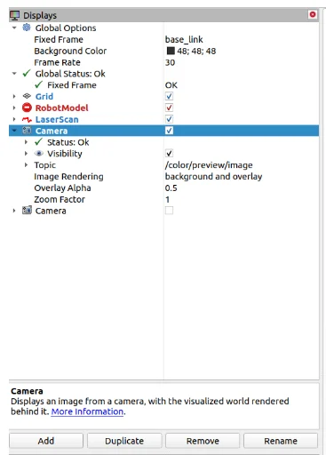

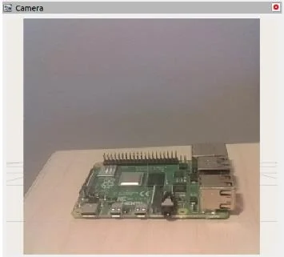

HUMAN AI ROBOTICS
21
ROS2 시각화도구RVIZ2
참고
카메라시각화과제
import rclpy
from rclpy.node import Node
from sensor_msgs.msg import Image
from cv_bridge import CvBridge
import cv2
class VideoPublisher(Node):
    def __init__(self):
        super().__init__('video_publisher')
        self.publisher_ = self.create_publisher(Image, 'video_frames', 10)
        timer_period = 0.033  # 30FPS를 위한 타이머 주기
        self.timer = self.create_timer(timer_period, self.timer_callback)
        
        # 비디오 캡처 객체 생성 (파일 또는 카메라)
        # self.cap = cv2.VideoCapture(0)  # 웹캠 사용시
        self.cap = cv2.VideoCapture('your_video.mp4')  # 비디오 파일 사용시
        
        self.bridge = CvBridge()
        
    def timer_callback(self):
        ret, frame = self.cap.read()
        
        if ret:
            # 프레임이 끝났다면 다시 시작
            if frame is None:
                self.cap.set(cv2.CAP_PROP_POS_FRAMES, 0)
                ret, frame = self.cap.read()
                
            # OpenCV 이미지를 ROS 메시지로 변환
            msg = self.bridge.cv2_to_imgmsg(frame, encoding='bgr8')
            self.publisher_.publish(msg)
            self.get_logger().info('Publishing video frame')
            
    def __del__(self):
        self.cap.release()
def main(args=None):
    rclpy.init(args=args)
    video_publisher = VideoPublisher()
    
    try:
        rclpy.spin(video_publisher)
    except KeyboardInterrupt:
        pass
    finally:
        video_publisher.destroy_node()
        rclpy.shutdown()
if __name__ == '__main__':
    main()

HUMAN AI ROBOTICS
22
ROS2 시각화도구RVIZ2
참고
카메라시각화과제
    def update_image(self, q_image):
        # 이미지 크기를 윈도우에 맞게 조정
        scaled_image = q_image.scaled(
            self.image_label.size(),
            Qt.KeepAspectRatio,
            Qt.SmoothTransformation
        )
        self.image_label.setPixmap(QPixmap.fromImage(scaled_image))
    def closeEvent(self, event):
        self.ros2_subscriber.destroy_node()
        rclpy.shutdown()
        event.accept()
def main():
    app = QApplication(sys.argv)
    window = MainWindow()
    window.show()
    sys.exit(app.exec_())
if __name__ == '__main__':
    main()
class MainWindow(QMainWindow):
    def __init__(self):
        super().__init__()
        self.setWindowTitle("ROS2 Video Subscriber")
        self.setGeometry(100, 100, 800, 600)
        # 중앙 위젯 설정
        central_widget = QWidget()
        self.setCentralWidget(central_widget)
        layout = QVBoxLayout(central_widget)
        # 이미지를 표시할 라벨
        self.image_label = QLabel()
        self.image_label.setAlignment(Qt.AlignCenter)
        layout.addWidget(self.image_label)
        # ROS2 초기화
        rclpy.init(args=None)
        self.ros2_subscriber = ImageSubscriber()
        
        # Signal Emitter 설정
        self.signal_emitter = ROS2SignalEmitter()
        self.signal_emitter.image_received.connect(self.update_image)
        # ROS2 스핀을 위한 타이머
        self.timer = QTimer()
        self.timer.timeout.connect(self.spin_once)
        self.timer.start(33)  # 30 FPS
    def spin_once(self):
        rclpy.spin_once(self.ros2_subscriber, timeout_sec=0)
        
        if hasattr(self.ros2_subscriber, 'current_frame'):
            # OpenCV 이미지를 Qt 이미지로 변환
            height, width, channel = self.ros2_subscriber.current_frame.shape
            bytes_per_line = 3 * width
            q_image = QImage(
                self.ros2_subscriber.current_frame.data,
                width,
                height,
                bytes_per_line,
                QImage.Format_RGB888
            ).rgbSwapped()
            
            self.signal_emitter.image_received.emit(q_image)
import sys
import rclpy
from rclpy.node import Node
from sensor_msgs.msg import Image
from cv_bridge import CvBridge
import cv2
from PyQt5.QtWidgets import QApplication, QMainWindow, QLabel, QVBoxLayout, QWidget
from PyQt5.QtCore import Qt, QTimer, pyqtSignal, QObject
from PyQt5.QtGui import QImage, QPixmap
class ROS2SignalEmitter(QObject):
    image_received = pyqtSignal(QImage)
class ImageSubscriber(Node):
    def __init__(self):
        super().__init__('image_subscriber')
        self.subscription = self.create_subscription(
            Image,
            'video_frames',
            self.listener_callback,
            10)
        self.bridge = CvBridge()
        
    def listener_callback(self, data):
        self.current_frame = self.bridge.imgmsg_to_cv2(data, desired_encoding='bgr8')

HUMAN AI ROBOTICS
23
ROS2 시각화도구RVIZ2
참고
IMU 데이터시각화
IMU 데이터를 구독
방향(쿼터니언)을 오일러 각도로 변환
각 속도, 선형 가속도 출력
로봇의 자세 추정
다른 센서 데이터와 융합하여 더 복잡한 작업을 수행 가능
# 쿼터니언을 오일러 각도로 변환
orientation_q = msg.orientation
orientation_list = [    orientation_q.x, orientation_q.y, orientation_q.z, orientation_q.w]
(roll, pitch, yaw) = euler_from_quaternion(orientation_list)

HUMAN AI ROBOTICS
24
ROS2 시각화도구RVIZ2
참고
RVIZ2 시각화예시
•   "LaserScan" 항목 확장 
•   "Topic" 필드 클릭
•   드롭다운 메뉴에서 "/scan" 토픽 선택
$ cd ~/ros2_ws/src
$ git clone https://github.com/Slamtec/sllidar_ros2.git
$ cd ~/ros2_ws
$ rosdep install --from-paths src --ignore-src -r -y
$ colcon build --symlink-install
$ source ~/ros2_ws/install/setup.bash
$ sudo chmod 666 /dev/ttyUSB0
$ ros2 launch sllidar_ros2 sllidar_launch.py
▪RPLIDAR 데이터 시각화
1)  Fixed Frame 변경
Global Options > Fixed Frame = laser
2)
Axes 추가 및 설정
RViz 좌측 하단의 Add에서 Axes 추가
(Length 및 Radius 변경은 옵션)
3)
LaserScan 추가 및 설정
RViz 좌측 하단의 Add에서 LaserScan 추가
(Topic 지정 필수, Color, Color Transformer 등은 옵션)
•  라이다 센서데이터를 2D 평면 상에 표시
•  주변 장애물 시각적으로 확인
HUMAN AI ROBOTICS
25
ROS2 시각화도구RVIZ2
참고
RViz2 구성 저장 및 로드
▪환경 저장
▪환경 불러오기
• File -> Save Config As
•  일반적으로 config 디렉토리에 저장
• Launch 파일에서 실행할 때 불러오는 방법
.rviz 파일은 RViz2(ROS Visualization Tool)의 설정 파일입니다. 이 파일은 RViz2의 사용자 인터페이스 설정, 
로드된 플러그인, 시각화 옵션 등 RViz2의 전체 구성을 저장
> rviz2 -d your_config.rviz
•
RViz2 실행 시 -d 옵션으로 .rviz 파일을 지정
HUMAN AI ROBOTICS
26
참고
로봇Description 패키지

HUMAN AI ROBOTICS
27
프로젝트기초
참고
로봇패키지만들기실습
1. URDF Package 생성하기
2. 연관 폴더만들기
•
src/urdf_tutorial 폴더 아래 다음 두 폴더를 추가
•
urdf: URDF 파일을 저장할 폴더
•
launch: ROS2 실행 launch 스크립트를 저장할 폴더
$ mkdir -p ~/ws_urdf/src
$ cd ~/ws_urdf/src
$ ros2 pkg create --build-type ament_python urdf_tutorial
$ cd ..
$ colcon build –symlink-install
$ cd src
$ cd urdf_tutorial
$ mkdir urdf
$ mkdir launch
  $ mkdir config
•
rm –rdf ./build ./install ./log

HUMAN AI ROBOTICS
28
프로젝트기초
참고
3. setup.py
두 폴더가 컴파일에 포함될 수 있도록 'src/urdf_tutorial/setup.py'를 아래와 같이 편집
import os
from glob import glob
from setuptools import setup
package_name = 'urdf_tutorial'
setup(
name=package_name,
version='0.0.0',
packages=[package_name],
data_files=[
('share/ament_index/resource_index/packages',
['resource/' + package_name]),
('share/' + package_name, ['package.xml']),
(os.path.join('share', package_name, 'launch'), glob('launch/*.launch.py')),
(os.path.join('share', package_name, 'urdf'), glob('urdf/*.xacro'))
],
install_requires=['setuptools'],
zip_safe=True,
maintainer='daeho',
maintainer_email='daeho@todo.todo',
description='TODO: Package description',
license='TODO: License declaration',
tests_require=['pytest'],
entry_points={
'console_scripts': [
],
},
)
로봇패키지만들기실습

HUMAN AI ROBOTICS
29
프로젝트기초
참고
‘src/urdf_tutorial/urdf/robot_1.xacro’ 파일을 만들고 아래와 같이 편집
• base_link: 가상의 링크
 • body: 가로, 세로, 높이 각각 1m인 상자
 • body_joint: base_link와 body를 연결하는 joint
4. 로봇 모델 만들기 
<?xml version="1.0"?>
<robot xmlns:xacro="http://ros.org/wiki/xacro" name="urdf_test">
<!-- BASE -->
<link name="base_link">
</link>
<!-- BODY LINK -->
<joint name="body_joint" type="fixed">
<!-- 'joink'를 'joint'로 수정 -->
        <parent link="base_link"/>
<child link="body"/>
</joint>
<link name="body">
<visual>
<geometry>
<box size="1 1 1"/>
</geometry>
</visual>
</link>
</robot>
로봇패키지만들기실습

HUMAN AI ROBOTICS
30
프로젝트기초
참고
‘src/urdf_tutorial/launch/robot_1.launch.py’ 파일을 만들고 아래와 같이 편집
5. 런치파일 만들기 
import os
from ament_index_python.packages import get_package_share_directory
from launch import LaunchDescription
from launch.substitutions import LaunchConfiguration
from launch.actions import DeclareLaunchArgument
from launch_ros.actions import Node
import xacro
def generate_launch_description():
use_sim_time = LaunchConfiguration('use_sim_time')
pkg_path = os.path.join(get_package_share_directory('urdf_tutorial'))
xacro_file = os.path.join(pkg_path,'urdf','robot_1.xacro')
robot_description = xacro.process_file(xacro_file)
params = {'robot_description': robot_description.toxml(), 'use_sim_time': use_sim_time}
return LaunchDescription([
DeclareLaunchArgument(
'use_sim_time',
default_value='false',
description='Use sim time'),
Node(
package='robot_state_publisher',
executable='robot_state_publisher',
output='screen',
parameters=[params])
])
로봇패키지만들기실습

HUMAN AI ROBOTICS
31
프로젝트기초
참고
6. 빌드 및 소싱
첫 번째 터미널에서 아래 명령을 실행해서 컴파일 및 ‘robot_1.launch.py’ 파일을 실행
7. 두 번째 터미널에서 아래 명령을 실행해서 Rviz를 실행
$ cd ~/ws_urdf
$ colcon build --symlink-install 
$ source install/setup.bash
$ ros2 launch urdf_tutorial robot_1.launch.py
$ cd ~/ws_urdf/ws_urdf
$ source install/setup.bash
$ rviz2
로봇패키지만들기실습

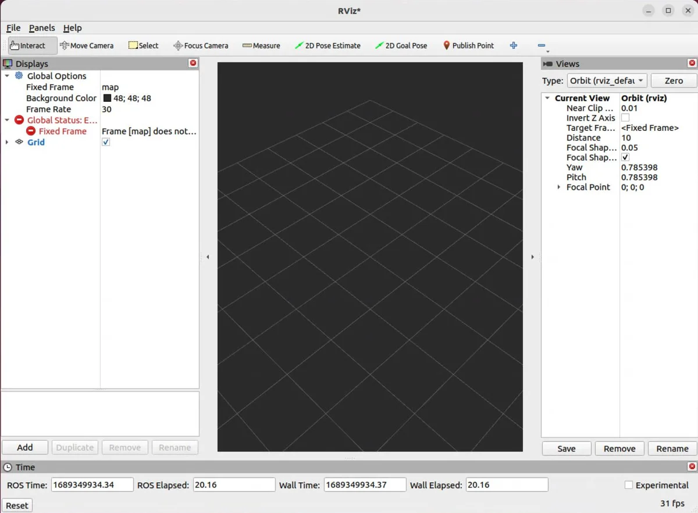

HUMAN AI ROBOTICS
32
프로젝트기초
참고
8. rviz2 설정
Display > Global Option > ‘Fixed Frame’을 ‘base_link’로 변경
왼쪽 하단의 ‘Add’ > ‘TF’ > ‘Ok’ 
로봇패키지만들기실습

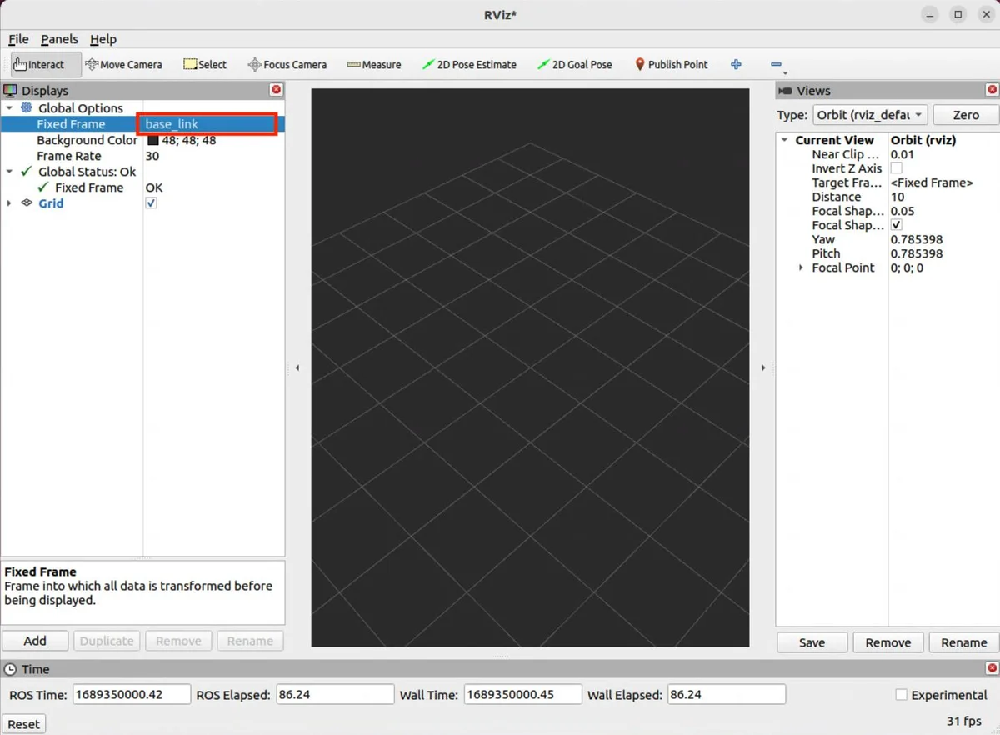

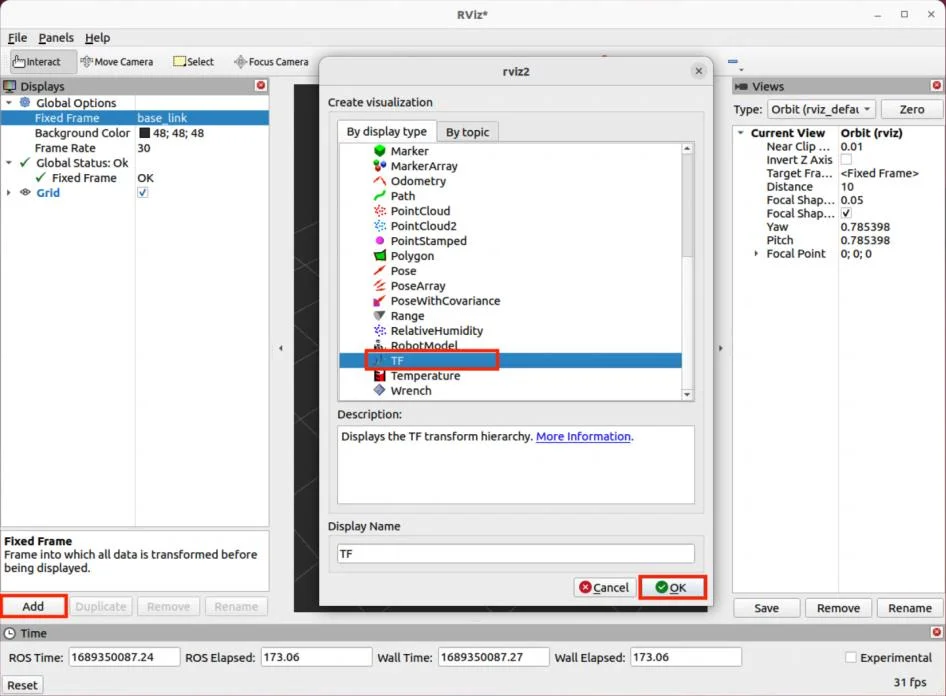

HUMAN AI ROBOTICS
33
주제2.1 기초
참고
9. TF 보기
TF의 하위 항목 중 ‘Show Names’를 선택
중앙에 ‘base_link’와 ‘body’가 겹쳐진 상태로 보이는 것 확인
왼쪽 하단의 ‘Add’ > ‘RobotModel’ > ‘Ok’ 
로봇패키지만들기실습

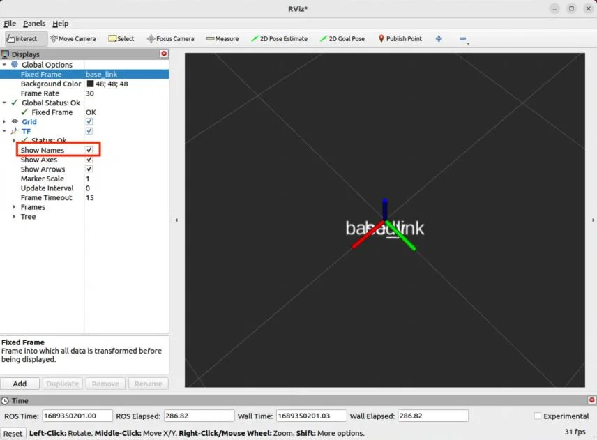

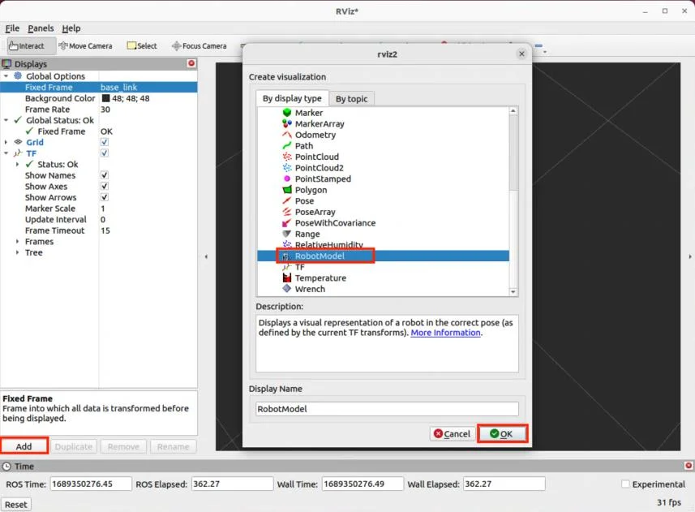

HUMAN AI ROBOTICS
34
주제2.1 기초
참고
10. 로봇 모델 보기
RobotModel의 하위 항목 중 ‘Description Topic’을 ‘/robot_description’으로 변경
'File' 메뉴에서 'Save Config As'를 선택
로봇패키지만들기실습
로봇 모델 불러오기
rviz2 –d ./config/robot.rviz

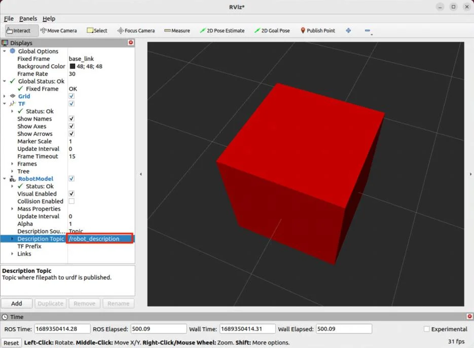

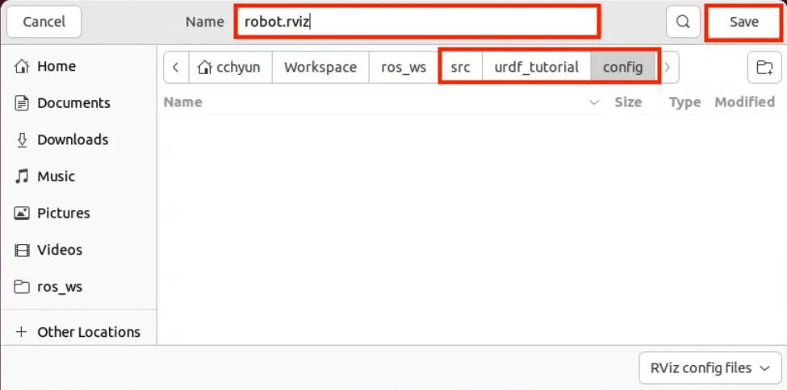

HUMAN AI ROBOTICS
35
주제2.1 기초
참고
11. 노드 및 토픽 확인
   세 번째 터미널에서 아래 명령을 실행해서 rqt_graph를 실행
• /robot_state_publisher: 
‘robot.launch.py’를 이용해서 실행한 Node
 • /transform_listner_Impl: 
rviz2에서 실행한 Node
 • ‘/robot_state_publisher’ Node는 
‘/transform_listner_Impl’ Node에게
‘/tf’, ‘/tf_static’ 두 개의 topic을 전달
$ rqt_graph
로봇패키지만들기실습

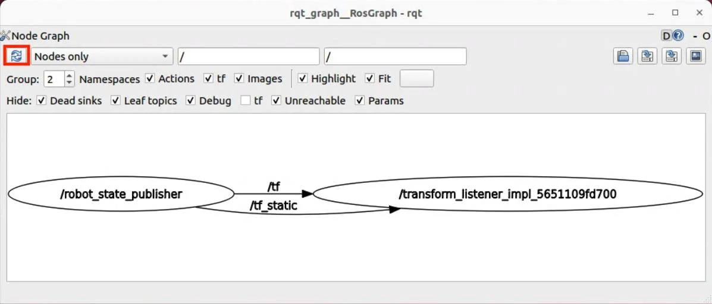

HUMAN AI ROBOTICS
36
주제2.1 기초
참고
12. 정육면체의 색 변경
  ‘src/urdf_tutorial/urdf/robot_1.xacro’ 파일을 아래와 같이 수정
• material white: 위쪽에 흰색을 표현하는 
white material을 선언
색상은 rgba 모두 1로 지정
(색상의 범위: 0 ~ 1 ) 
 • body link material: body link에 위에서 지정한 
white material을 지정
변경된 값을 반영하기 위해 첫 번째 터미널에서 
‘CTRL+C’ 키를 입력해서 ROS2를 종료한 후 명령을 수행
<?xml version="1.0"?>
<robot xmlns:xacro="http://ros.org/wiki/xacro" name="urdf_test">
<!-- COLOR-->
<material name="white">
<color rgba="1 1 1 1"/>
</material>
<!-- BASE -->
<link name="base_link">
</link>
<!-- BODY LINK -->
<joint name="body_joint" type="fixed">
<parent link="base_link"/>
<child link="body"/>
</joint>
<link name="body">
<visual>
<geometry>
<box size="1 1 1"/>
</geometry>
<material name="white"/>
</visual>
</link>
</robot>
$ cd ~/ws_urdf/urdf_tutorail
$ colcon build --symlink-install
$ source install/setup.bash
$ ros2 launch urdf_tutorial robot_1.launch.py
로봇패키지만들기실습

HUMAN AI ROBOTICS
37
주제2.1 기초
참고
메니퓨레이터모델링

HUMAN AI ROBOTICS
38
로봇description
참고
기초 지식
▪URDF, SDF, SRDF,XACRO
•  로봇의 기구학적 구조(모델)를 설명하는 XML 기반 포맷
•  주로 로봇의 링크, 조인트, 메시, 물리적 속성(질량, 관성 등) 등을 정의
• 로봇의 물리적 모델 정의: 로봇의 구조를 텍스트로 설명
• 각 링크(로봇의 고정된 부분)와 조인트(회전 또는 직선 운동을 하는 부분)를 정의
• 충돌 모델: 로봇이 다른 물체와 충돌할 때 사용하는 단순한 충돌 체적(보통 상자나 구 형태)을 정의
• 시각적 모델: 로봇의 시각적 표현을 위한 3D 메시(주로 STL, COLLADA) 파일 경로를 정의
• ROS 환경에서 로봇을 표현: RViz와 같은 시뮬레이터에서 로봇을 시각화하는 데 URDF 파일사용 
•  로봇의 구조, 동작, 환경 등을 정의하기 위한 XML 기반의 파일 포맷 및 확장자.
▪URDF

HUMAN AI ROBOTICS
39
로봇description
참고
기초 지식
6축(DOF) 매니퓰레이터
5축(DOF) 매니퓰레이터
 링크(Link)
• description :링크의 이름, 외형, 무게(mass, kg), 관성 모멘트(Kg.m^2)
• 외형: 주로 원통, 원뿔, 직육면체등의 간단한 모형 모델 사용 
복잡한 구조는 메쉬 (mesh)를 표현 할 수 있는 stl, dae(collda) 포맷을 사용
 조인트(Joint)
• description : 조인트의 이름, 종류, 운동의 기준 축,
연결하는 링크,
최소, 최대 동작 값(각도, 선형 움직임), 
조인트에 부여되는 힘 / 속도

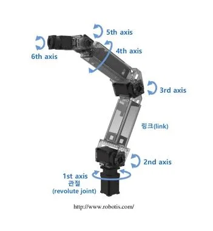

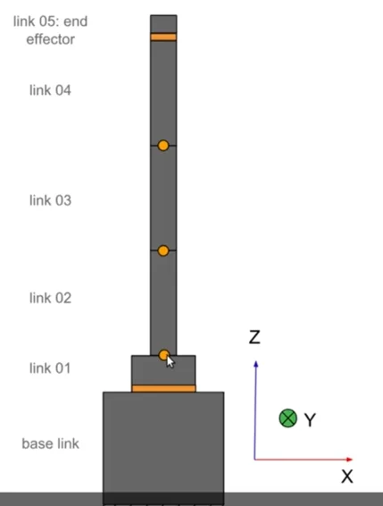

HUMAN AI ROBOTICS
40
로봇description
참고
기초 지식
기준 좌표를 흔히 Frame이라고 하는데, URDF에서는 조인트에 이 Frame을 둔다.
Frame을 기준으로 조인트 사이의 위치 관계를 상대적인 값들로 설정하거나 링크를 표현하는 여러 태그
들의 중심 위치를 설정한다.
URDF에서는 <origin> 태그가 자주 등장하는데, 링크와 조인트에서 사용하는 의미가 조금 다르다.
 프레임(Frame)
link의 origin이 기준 좌표(Frame)가 되는데, 바로 앞에 연결되어있는 조인트의 좌표를 사용
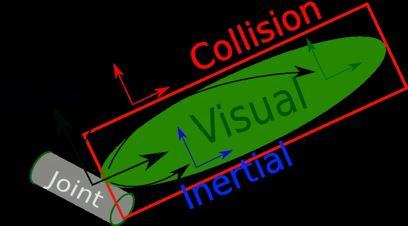

HUMAN AI ROBOTICS
41
로봇description
참고
기초 지식
<collision>, <visual>, <inertial> 태그
이 태그들은 link origin으로부터 각각의 상대 위치를 <origin> 값으로 설정
즉, 그 값은 link origin으로부터의 상대적 이동(x,y,z 속성)과 회전(r,p,y 속성)한 위치이다.
 링크(Link)
* rpy: roll, pitch, yaw
<geometry>는 기하학 값들을 설정하는데, box(x, y, z), cylinder(radius, length), sphere(radius), mesh(filename)
특히, mesh에는 3D 모델링 된 stl 파일을 지정
<geometry>의 여러 속성 값들은 <origin>에서 설정한 위치 값을 중심으로 대칭
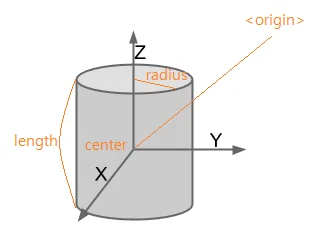

HUMAN AI ROBOTICS
42
로봇description
참고
기초 지식
 링크(Link) URDF에서 <visual> 태그 
앞 조인트로부터 z 축으로 25cm 떨어진 지점(xyz="0 0 0.25")에 중심점을 위치시킨다.
방향은 변화가 없다(rpy="0 0 0"). 
이 중심점을 기준으로 대칭되도록 너비와 폭은 10cm로 되고 길이는 50cm가 되는 box 형태의 링크
(box size="0.1 0.1 0.5").
<link name="link2">
<collision>
<origin xyz="0 0 0.25" rpy="0 0 0"/>
<geometry>
<box size="0.1 0.1 0.5"/>
</geometry>
</collision>
<visual>
<origin xyz="0 0 0.25" rpy="0 0 0"/>
<geometry>
<box size="0.1 0.1 0.5"/>
</geometry>
<material name="orange"/>
</visual>
<inertial>
<origin xyz="0 0 0.25" rpy="0 0 0"/>
<mass value="1"/>
<inertia ixx="1.0" ixy="0.0" ixz="0.0" iyy="1.0" iyz="0.0" izz="1.0"/>
</inertial>
</link>
HUMAN AI ROBOTICS
43
로봇description
참고
기초 지식
• 로봇의 조인트를 정의하는 데 사용
• 각 조인트는 두 링크를 연결 
• 어떤 방식으로 움직일 수 있는지 정의
• fixed (고정): 움직임이 허용되지 않는 관절(link)이다
• revolute (회전): 선풍기의 좌우 회전과 같이 일정 각도 범위를 회전
• continuous (연속): 자동차 바퀴처럼 연속 회전을 하는 관절
• prismatic (프리즘): 단일 축에 대해 선형으로 미끄러지는 관절
최대, 최소 위치 제한 정의 필요
• floating (자유): 6차원 이동 및 회전을 허용하는 관절
• planar (평면): 한 평면에 수직으로 이동 및 회전할 수 있는 관절
 조인트(Joint)
 URDF 에서 지원하는 조인트 종류(type)

HUMAN AI ROBOTICS
44
로봇description
참고
URDF – JOINT 예시
• <parent>, <child>
부모 링크(parent link)와 자식 링크(child link)의 이름 지정 (기저에 가까운 링크가 부모 링크)
• <axis>
회전 축을 정의
축은 로봇의 기준 좌표를 기준으로 정의 
회전 운동의 방향을 결정.
• <axis xyz="0 0 1"/> 
z 값만 설정
옆 그림의 경우에는 선풍기 목부분 z 축 기준으로 회전
• <limit>
조인트 동작에 대한 최소, 최대(lower, upper) 제한 사항을 설정.
조인트에 부여되는 힘(effort, 단위: N), 속도(단위: radian/s)의 제한 값 설정
HUMAN AI ROBOTICS
45
주제2.1 기초
참고
URDF 예시
• parent : 기준 링크 결정 (기저에 가까운 링크)
• origin: parent link 좌표계에서 조인트 위치, 회전
(rpy- 기울어진 정도, xyz- 위상차이)
• axis: 어떤 축을 기준으로 child 링크를 움직일 것인지 나타냄
(위 코드에서 y축을 기준으로 움직이므로 xyz=‘0 1 0’으로 정의
•
URDF 파일 확장자는 일반적으로 .urdf 또는 .xacro 
•
파라미터로 로봇 이름 확인 가능(예: ros2 param get /robot_state_publisher robot_name)
<robot name="example_robot">
<link name="base_link">
<visual>
<geometry>
<box size="1 1 1"/>
</geometry>
<material name="red"/>
</visual>
</link>
<joint name="joint1" type="revolute">
<parent link="base_link"/>
<child link="link1"/>
<axis xyz="0 0 1"/>
</joint>
</robot>
<joint name="joint_chassis_left_wheel" type="continuous">
<origin rpy="0 0 0" xyz="-0.5 0.65 0" />
<child link="link_left_wheel" />
<parent link="link_chassis" />
<axis rpy="0 0 0" xyz="0 1 0" />
<limit effort="10000" velocity="1000" />
<joint_properties damping="1.0" friction="1.0" />
</joint>
<xacro:robot name="my_robot">
...
</xacro:robot>

HUMAN AI ROBOTICS
46
SLAM
참고
메내퓨레이터모델링

HUMAN AI ROBOTICS
47
주제2.1 기초
참고
메니퓨레이터 패키지 - 생성
•  로봇의 모델링 정보을 받음 패키지 생성
매니플레이터의 기본 정보를 URDF로 작성해보자. 
로봇의 모델링 정보를 담은 패키지를 로봇명_descriptio으로 이름 만들기
$ cd ~/robot_ws/src
$ ros2 pkg create testbot_description --build-type ament_python --dependencies urdf
$ cd testbot_description
$ mkdir urdf rviz
$ cd urdf
$ vim testbot.urdf
•  urdf 폴더 생성후 urdf 파일 생성
<?xml version="1.0" ?>
<robot name="testbot">
<material name="green">
<color rgba="0 0.6 0 1" />
</material>
<material name="orange">
<color rgba="1.0 0.4 0.0 1.0"/>
</material>
<link name="base"/>
<link name="link1">
<inertial>
<origin xyz="0.0 0.0 0.25" rpy="0.0 0.0 0.0"/>
<mass value="1.0"/>
<inertia ixx="1.0" ixy="0.0" ixz="0.0" iyy="1.0" iyz="0.0" izz="1.0"/>
</inertial>
<visual>
<origin xyz="0.0 0.0 0.25" rpy="0.0 0.0 0.0"/>
<geometry>
<box size="0.1 0.1 0.5"/>
</geometry>
<material name="green"/>
</visual>
<collision>
<origin xyz="0.0 0.0 0.25" rpy="0.0 0.0 0.0"/>
<geometry>
<box size="0.1 0.1 0.5"/>
</geometry>
</collision>
</link>
<link name="link2">
<inertial>
<origin xyz="0.0 0.0 0.25" rpy="0.0 0.0 0.0"/>
<mass value="1.0"/>
<inertia ixx="1.0" ixy="0.0" ixz="0.0" iyy="1.0" iyz="0.0" izz="1.0"/>
</inertial>
<visual>
<origin xyz="0.0 0.0 0.25" rpy="0.0 0.0 0.0"/>
<geometry>
<box size="0.1 0.1 0.5"/>
</geometry>
<material name="orange"/>
</visual>
<collision>
<origin xyz="0.0 0.0 0.25" rpy="0.0 0.0 0.0"/>
<geometry>
<box size="0.1 0.1 0.5"/>
</geometry>
</collision>
</link>
<link name="link3">
<inertial>
<origin xyz="0.0 0.0 0.5" rpy="0.0 0.0 0.0"/>
<mass value="1.0"/>
<inertia ixx="1.0" ixy="0.0" ixz="0.0" iyy="1.0" iyz="0.0" izz="1.0"/>
</inertial>
<visual>
<origin xyz="0.0 0.0 0.5" rpy="0.0 0.0 0.0"/>
<geometry>
<box size="0.1 0.1 1.0"/>
</geometry>
<material name="green"/>
</visual>
<collision>
<origin xyz="0.0 0.0 0.5" rpy="0.0 0.0 0.0"/>
<geometry>
<box size="0.1 0.1 1.0"/>
</geometry>
</collision>
</link>
<link name="link4">
<inertial>
<origin xyz="0.0 0.0 0.25" rpy="0.0 0.0 0.0"/>
<mass value="1.0"/>
<inertia ixx="1.0" ixy="0.0" ixz="0.0" iyy="1.0" iyz="0.0" izz="1.0"/>
</inertial>
<visual>
<origin xyz="0.0 0.0 0.25" rpy="0.0 0.0 0.0"/>
<geometry>
<box size="0.1 0.1 0.5"/>
</geometry>
<material name="orange"/>
</visual>
<collision>
<origin xyz="0.0 0.0 0.25" rpy="0.0 0.0 0.0"/>
<geometry>
<box size="0.1 0.1 0.5"/>
</geometry>
</collision>
</link>
<joint name="base_joint" type="fixed">
<parent link="base"/>
<child link="link1"/>
</joint>
<joint name="link1_link2" type="revolute">
<origin xyz="0.0 0.0 0.5" rpy="0.0 0.0 0.0"/>
<parent link="link1"/>
<child link="link2"/>
<axis xyz="0.0 0.0 1.0"/>
<limit lower="-2.617" upper="2.617" effort="30.0" velocity="1.571"/>
</joint>
<joint name="link2_link3" type="revolute">
<origin xyz="0.0 0.0 0.5" rpy="0.0 0.0 0.0"/>
<parent link="link2"/>
<child link="link3"/>
<axis xyz="0.0 1.0 0.0"/>
<limit lower="-2.617" upper="2.617" effort="30.0" velocity="1.571"/>
</joint>
<joint name="link3_link4" type="revolute">
<origin xyz="0.0 0.0 1.0" rpy="0.0 0.0 0.0"/>
<parent link="link3"/>
<child link="link4"/>
<axis xyz="0.0 1.0 0.0"/>
<limit lower="-2.617" upper="2.617" effort="30.0" velocity="1.571"/>
</joint>
</robot>
※ 복붙용 testbot.urdf 코드
모두선택(ctrl+a) 후 복사

HUMAN AI ROBOTICS
48
주제2.1 기초
참고
메니퓨레이터 패키지 - URDF
testbot.urdf 파일
<?xml version="1.0" ?>
<robot name="testbot">
<material name="green">
<color rgba="0 0.6 0 1" />
</material>
<material name="orange">
<color rgba="1.0 0.4 0.0 1.0"/>
</material>
<link name="base"/>
<link name="link1">
<inertial>
<origin xyz="0.0 0.0 0.25" rpy="0.0 0.0 0.0"/>
<mass value="1.0"/>
<inertia ixx="1.0" ixy="0.0" ixz="0.0" iyy="1.0" iyz="0.0" izz="1.0"/>
</inertial>
<visual>
<origin xyz="0.0 0.0 0.25" rpy="0.0 0.0 0.0"/>
<geometry>
<box size="0.1 0.1 0.5"/>
</geometry>
<material name="green"/>
</visual>
<collision>
<origin xyz="0.0 0.0 0.25" rpy="0.0 0.0 0.0"/>
<geometry>
<box size="0.1 0.1 0.5"/>
</geometry>
</collision>
</link>
<link name="link2">
<inertial>
<origin xyz="0.0 0.0 0.25" rpy="0.0 0.0 0.0"/>
<mass value="1.0"/>
<inertia ixx="1.0" ixy="0.0" ixz="0.0" iyy="1.0" iyz="0.0" izz="1.0"/>
</inertial>
<visual>
<origin xyz="0.0 0.0 0.25" rpy="0.0 0.0 0.0"/>
<geometry>
<box size="0.1 0.1 0.5"/>
</geometry>
<material name="orange"/>
</visual>
<collision>
<origin xyz="0.0 0.0 0.25" rpy="0.0 0.0 0.0"/>
<geometry>
<box size="0.1 0.1 0.5"/>
</geometry>
</collision>
</link>

HUMAN AI ROBOTICS
49
주제2.1 기초
참고
<link name="link3">
<inertial>
<origin xyz="0.0 0.0 0.5" rpy="0.0 0.0 0.0"/>
<mass value="1.0"/>
<inertia ixx="1.0" ixy="0.0" ixz="0.0" iyy="1.0" iyz="0.0" izz="1.0"/>
</inertial>
<visual>
<origin xyz="0.0 0.0 0.5" rpy="0.0 0.0 0.0"/>
<geometry>
<box size="0.1 0.1 1.0"/>
</geometry>
<material name="green"/>
</visual>
<collision>
<origin xyz="0.0 0.0 0.5" rpy="0.0 0.0 0.0"/>
<geometry>
<box size="0.1 0.1 1.0"/>
</geometry>
</collision>
</link>
<link name="link4">
<inertial>
<origin xyz="0.0 0.0 0.25" rpy="0.0 0.0 0.0"/>
<mass value="1.0"/>
<inertia ixx="1.0" ixy="0.0" ixz="0.0" iyy="1.0" iyz="0.0" izz="1.0"/>
</inertial>
<visual>
<origin xyz="0.0 0.0 0.25" rpy="0.0 0.0 0.0"/>
<geometry>
<box size="0.1 0.1 0.5"/>
</geometry>
<material name="orange"/>
</visual>
<collision>
<origin xyz="0.0 0.0 0.25" rpy="0.0 0.0 0.0"/>
<geometry>
<box size="0.1 0.1 0.5"/>
</geometry>
</collision>
</link>
메니퓨레이터 패키지 - URDF

HUMAN AI ROBOTICS
50
주제2.1 기초
참고
<joint name="base_joint" type="fixed">
<parent link="base"/>
<child link="link1"/>
</joint>
<joint name="link1_link2" type="revolute">
<origin xyz="0.0 0.0 0.5" rpy="0.0 0.0 0.0"/>
<parent link="link1"/>
<child link="link2"/>
<axis xyz="0.0 0.0 1.0"/>
<limit lower="-2.617" upper="2.617" effort="30.0" velocity="1.571"/>
</joint>
<joint name="link2_link3" type="revolute">
<origin xyz="0.0 0.0 0.5" rpy="0.0 0.0 0.0"/>
<parent link="link2"/>
<child link="link3"/>
<axis xyz="0.0 1.0 0.0"/>
<limit lower="-2.617" upper="2.617" effort="30.0" velocity="1.571"/>
</joint>
<joint name="link3_link4" type="revolute">
<origin xyz="0.0 0.0 1.0" rpy="0.0 0.0 0.0"/>
<parent link="link3"/>
<child link="link4"/>
<axis xyz="0.0 1.0 0.0"/>
<limit lower="-2.617" upper="2.617" effort="30.0" velocity="1.571"/>
</joint>
</robot>
메니퓨레이터 패키지 - URDF

HUMAN AI ROBOTICS
51
주제2.1 기초
참고
메니퓨레이터 패키지 - 런치 파일 생성 
•  check_urdf 나 urdf_to_graphiz 와 같은 명령어를 통해서 작성한 URDF syntax나 렌더링 된 모습 확인
•  testbot_description 패키지 폴더로 이동해 testbot.launch.py 파일 생성
▪런치 파일 생성
$ cd ~/robot_ws/src/testbot_description
$ mkdir launch
$ cd launch
$ vim testbot.launch.py
import os
from ament_index_python.packages import get_package_share_directory
from launch import LaunchDescription
from launch_ros.actions import Node
def generate_launch_description():
rviz_display_config_file = os.path.join(
get_package_share_directory('testbot_description'),
'rviz',
'testbot.rviz')
urdf_file = os.path.join(
get_package_share_directory('testbot_description'),
'urdf',
'testbot.urdf')
with open(urdf_file, 'r') as infp:
robot_description_file = infp.read()
ld = LaunchDescription()
robot_state_publisher = Node(
package='robot_state_publisher',
executable='robot_state_publisher',
parameters=[
{'use_sim_time': False},
{'robot_description': robot_description_file}
],output='screen')
joint_state_publisher_gui = Node(
package='joint_state_publisher_gui',
executable='joint_state_publisher_gui',
output='screen')
rviz2 = Node(
package='rviz2',
executable='rviz2',
arguments=['-d', rviz_display_config_file],
output='screen')
ld.add_action(robot_state_publisher)
ld.add_action(joint_state_publisher_gui)
ld.add_action(rviz2)
return ld
※ 복붙용 testbot.launch.py 코드
모두선택(ctrl+a) 후 복사

HUMAN AI ROBOTICS
52
주제2.1 기초
참고
URDF를 담은 robot_description 파라미터와 
joint_state_publisher, robot_state_publisher, rviz2 노드로 구성
import os
from ament_index_python.packages import get_package_share_directory
from launch import LaunchDescription
from launch_ros.actions import Node
def generate_launch_description():
rviz_display_config_file = os.path.join(
get_package_share_directory('testbot_description'),
'rviz',
'testbot.rviz')
urdf_file = os.path.join(
get_package_share_directory('testbot_description'),
'urdf',
'testbot.urdf')
with open(urdf_file, 'r') as infp:
robot_description_file = infp.read()
ld = LaunchDescription()
robot_state_publisher = Node(
package='robot_state_publisher',
executable='robot_state_publisher',
parameters=[
{'use_sim_time': False},
{'robot_description': robot_description_file}
],
output='screen')
joint_state_publisher_gui = Node(
package='joint_state_publisher_gui',
executable='joint_state_publisher_gui',
output='screen')
rviz2 = Node(
package='rviz2',
executable='rviz2',
arguments=['-d', rviz_display_config_file],
output='screen')
ld.add_action(robot_state_publisher)
ld.add_action(joint_state_publisher_gui)
ld.add_action(rviz2)
return ld
메니퓨레이터 패키지 - 런치 파일 생성

HUMAN AI ROBOTICS
53
주제2.1 기초
참고
setup.py 파일의 데이터 파일에
Launch파일과urdf 파일, rviz 파일 추가
import os
from glob import glob
from setuptools import find_packages, setup
package_name = 'testbot_description'
setup(
name=package_name,
version='0.0.0',
packages=find_packages(exclude=['test']),
data_files=[
('share/ament_index/resource_index/packages',
['resource/' + package_name]),
('share/' + package_name, ['package.xml']),
(os.path.join('share', package_name, 'launch'), glob('launch/*.launch.py')),
(os.path.join('share', package_name, 'urdf'), glob('urdf/*.urdf')),
(os.path.join('share', package_name, 'rviz'), glob('rviz/*.rviz'))
],
install_requires=['setuptools'],
zip_safe=True,
maintainer='ABC',
maintainer_email='ABC@todo.todo',
description='TODO: Package description',
license='TODO: License declaration',
tests_require=['pytest'],
entry_points={
'console_scripts': [
],
},
)
메니퓨레이터 패키지 – setup.py 파일 편집
$ vim ~/robot_ws/src/testbot_description/setup.py

HUMAN AI ROBOTICS
54
주제2.1 기초
참고
메니퓨레이터 패키지– Launch 파일실행
$ cd ~/robot_ws/src/testbot_description
$ colcon build --symlink-install 
$ source install/setup.bash
$ ros2 launch testbot_description testbot.launch.py
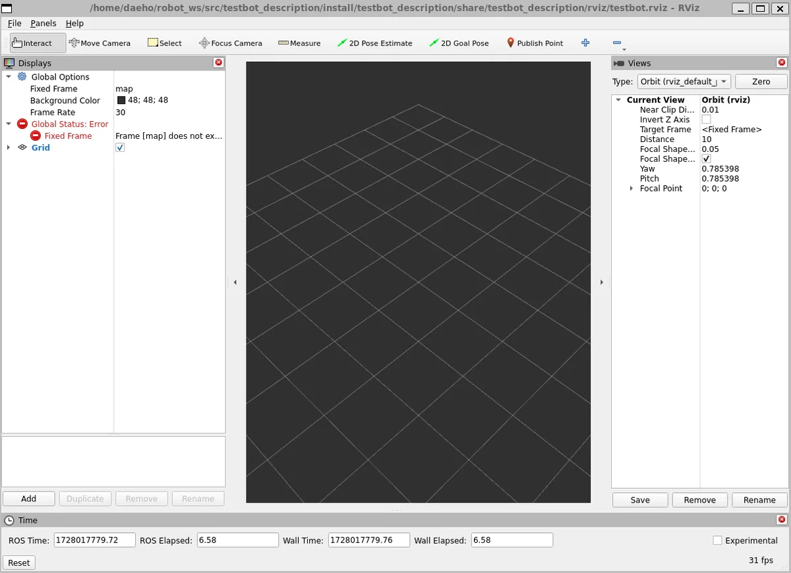

HUMAN AI ROBOTICS
55
주제2.1 기초
참고
메니퓨레이터 패키지– Rviz2 설정
Displays -> Global Options 
-> Fixed Frame : base
Add -> TF
Add -> RobotModel
Displays -> RobotModel
-> Description Topic : /robot_description

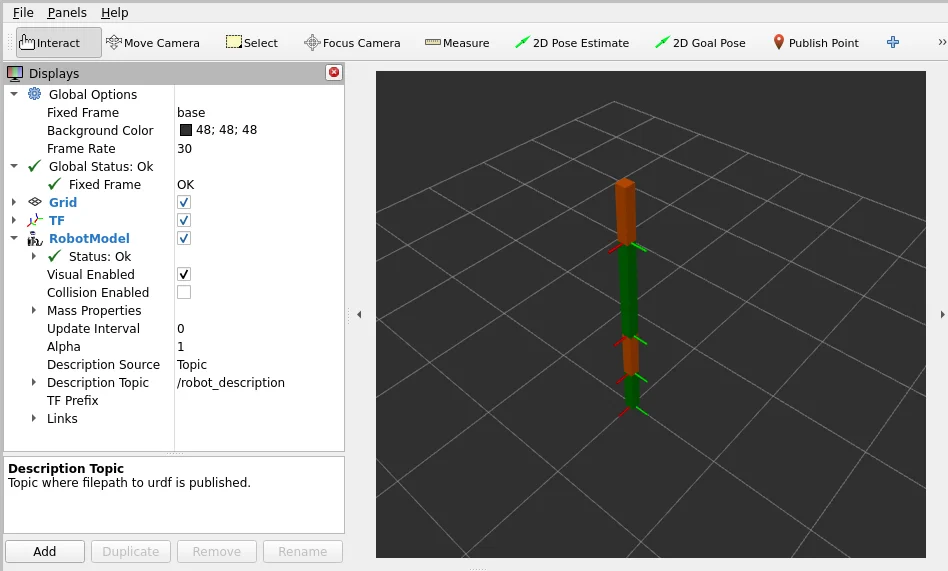

HUMAN AI ROBOTICS
56
주제2.1 기초
참고
메니퓨레이터 패키지– 시각화확인
Joint State Publish gui에서
joint 값을 바꿔가면서움직임 확인

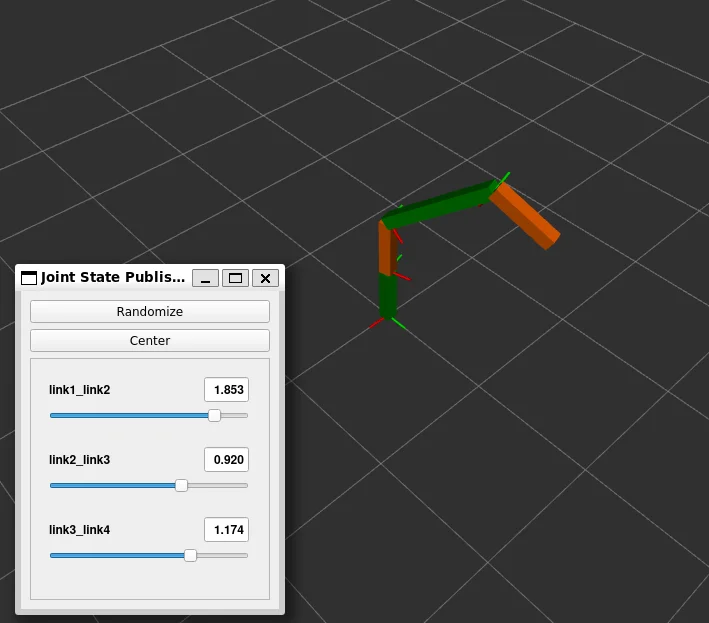

HUMAN AI ROBOTICS
57
주제2.1 기초
참고
메니퓨레이터 패키지 – 노드
robot_description 토픽으로 URDF가 주어지면 
URDF의 joint 값을 joint_state_publisher_gui로 받아
/joint_states 토픽으로 퍼블리시
joint_state_publisher : 
robot_state_publisher  :
URDF의 로봇 정보와 joint_state 토픽 정보 활용
계산한 TF 정보를 /tf, /tf_static 토픽으로 퍼블리시

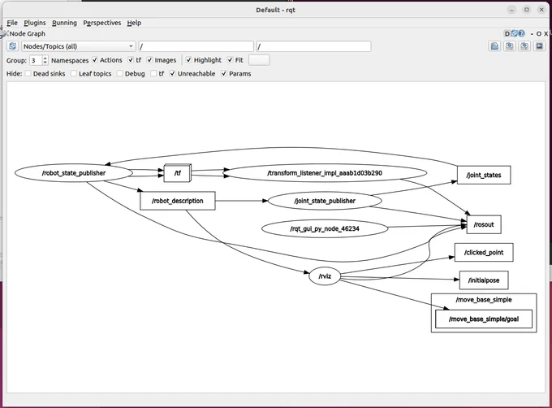

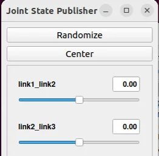

HUMAN AI ROBOTICS
58
주제2.1 기초
참고
메니퓨레이터 패키지 – 토픽
/tf (tf2_msgs/msg/TFMessage) : 
   로봇의 움직일 수 있는 조인트 정보
/tf_static (tf2_msgs/msg/TFMessage) : 
   로봇의 정적 조인트 정보
/robot_description (std_msgs/msg/String) : 
   로봇 URDF에 대한 String 값 
   robot_description parameter에 값이 설정되면 
   이 토픽으로 republish 하여 동적인 정보도 전달
/joint_states (sensor_msgs/JointState) :
   시스템에 있는 모든 움직이는 조인트 상태 값

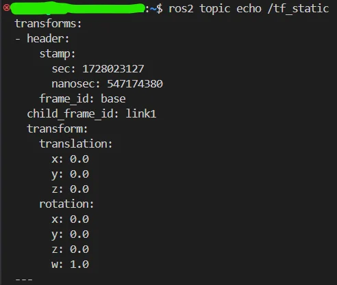

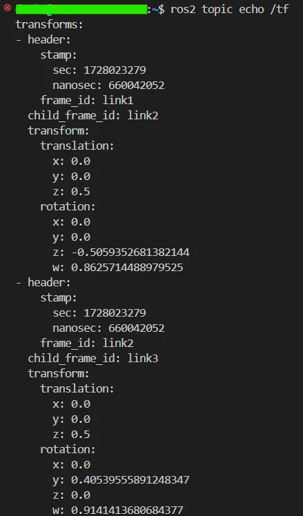
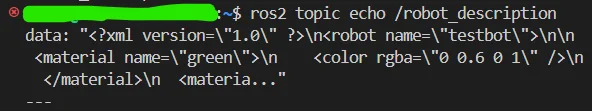

HUMAN AI ROBOTICS
59
주제2.1 기초
참고
Urdf 명령어
check_urdf 명령어로 작성한 URDF의 
문법적 오류 및 각 링크의 연결 관계를 확인 가능
다이어그램으로 표현 
.gv 파일과 .pdf 파일 생성
링크와 조인트와의 관계, 각 조인트와 
조인트 사이의 상대 
좌표 변환을 한눈에 확인
urdf_to_graphiz
check_urdf 
$ check_urdf
~/robot_ws/src/testbot_description/urdf/testbot.urdf
$ urdf_to_graphiz
~/robot_ws/src/testbot_description/urdf/testbot.urdf
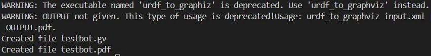

HUMAN AI ROBOTICS
60
SLAM
참고
차동 이동 로봇 모델링

HUMAN AI ROBOTICS
61
자동차연동시뮬레이션
참고
패키지생성및준비
1. car_tutorial package 생성 및 빌드
2. 다음 4개의 폴더를 생성
$ mkdir –p ~/car_ws/src
$ cd ~/car_ws/src/ 
$ ros2 pkg create --build-type ament_python car_tutorial
$ colcon build –symlink-install
$ cd ~/car_ws/src/car_tutorial
$ mkdir urdf launch config world

HUMAN AI ROBOTICS
62
자동차연동시뮬레이션
참고
의존성선언
3. package.xml 파일 편집
- ROS 2 빌드 시스템과 패키지 관리자에게 필요한 모든 정보를 제공
   - 패키지 간의 의존성을 해결하고, 빌드 순서를 결정하며, 패키지에 대한 메타데이터를 제공
•빌드 의존성: <build_depend> 
•실행 의존성: <exec_depend> 
•빌드 및 실행 의존성: <depend>
src/car_tutorial/package.xml
HUMAN AI ROBOTICS
63
자동차연동시뮬레이션
참고
패키지메타데이터종속성정의
Python의 setuptools를 사용하여 패키지의 메타데이터와 종속성 정의
src/car_tutorial/setup.py
•패키지 정보 정의
•이름, 버전, 설명 등의 메타데이터를 지정
•종속성 선언
•패키지가 필요로 하는 다른 ROS 2 패키지나 Python 라이브러리를 명시
•설치 대상 지정
•실행 파일, Python 모듈, 데이터 파일 등 패키지에 포함될 항목들을 정의
•빌드 설정
•컴파일이 필요한 경우 빌드 프로세스를 구성
이 파일은 colcon 빌드 시스템에 의해 사용되어 패키지를 올바르게 빌드하고 설치
ROS 2 개발에서 setup.py는 package.xml과 함께 패키지 구성의 핵심 요소
HUMAN AI ROBOTICS
64
자동차연동시뮬레이션
참고
자동차모델링
src/car_tutorial/urdf/car.xacro
<?xml version="1.0"?>
<robot 
xmlns:xacro="http://www.ros.org/wiki/xacro" 
name="urdf_tutorial">
    <!-- COLOR -->
    <material name="white">
        <color rgba="1 1 1 1" />
    </material>
    <material name="blue">
        <color rgba="0 0 1 1"/>
    </material>
    <material name="black">
        <color rgba="0 0 0 1"/>
    </material>
    <material name="red">
        <color rgba="1 0 0 1"/>
    </material>
    <!-- BASE LINK -->
    <link name="base_link">
    </link>
<!-- LEFT WHEEL LINK -->
    <joint name="left_wheel_joint" type="continuous">
        <parent link="base_link"/>
        <child link="left_wheel"/>
        <origin xyz="0 0.065 0" rpy="-${pi/2} 0 0" />
        <axis xyz="0 0 1"/>
    </joint>
    <link name="left_wheel">
        <visual>
            <geometry>
                <cylinder radius="0.03" length="0.03"/>
            </geometry>
            <material name="blue"/>
        </visual>
        <collision>
            <geometry>
                <cylinder radius="0.03" length="0.03"/>
            </geometry>
        </collision>
    </link>
    <!-- RIGHT WHEEL LINK -->
    <joint name="right_wheel_joint" type="continuous">
        <parent link="base_link"/>
        <child link="right_wheel"/>
        <origin xyz="0 -0.065 0" rpy="${pi/2} 0 0" />
        <axis xyz="0 0 -1"/>
    </joint>
    <link name="right_wheel">
        <visual>
            <geometry>
                <cylinder radius="0.03" length="0.03"/>
            </geometry>
            <material name="blue"/>
        </visual>
        <collision>
            <geometry>
                <cylinder radius="0.03" length="0.03"/>
            </geometry>
        </collision>
    </link>
    <!-- BODY LINK -->
    <joint name="body_joint" type="fixed">
        <parent link="base_link"/>
        <child link="body"/>
        <origin xyz="-0.12 0 0"/>
    </joint>
    <link name="body">
        <visual>
            <origin xyz="0.1 0 0.03"/>
            <geometry>
                <box size="0.2 0.1 0.06"/>
            </geometry>
            <material name="white"/>
        </visual>
        <collision>
            <origin xyz="0.1 0 0.03"/>
            <geometry>
                <box size="0.2 0.1 0.06"/>
            </geometry>
        </collision>
    </link>
<!-- CASTER WHEEL LINK -->
    <joint name="caster_wheel_joint" type="fixed">
        <parent link="body"/>
        <child link="caster_wheel"/>
        <origin xyz="0.03 0 0"/>
    </joint>
    <link name="caster_wheel">
        <visual>
            <geometry>
                <sphere radius="0.03"/>
            </geometry>
            <material name="black"/>
        </visual>
        <collision>
            <geometry>
                <sphere radius="0.03"/>
            </geometry>
        </collision>
    </link>
<!-- CAMERA -->
    <joint name="camera_joint" type="fixed">
        <parent link="body"/>
        <child link="camera_link"/>
        <origin xyz="0.20 0 0.03" rpy="0 0 0"/>
    </joint>
    <link name="camera_link">
        <visual>
            <geometry>
                <box size="0.01 0.03 0.03"/>
            </geometry>
            <material name="red"/>
        </visual>
        <collision>
            <geometry>
                <box size="0.01 0.03 0.03"/>
            </geometry>
        </collision>
    </link>
    <joint name="camera_optical_joint" type="fixed">
        <parent link="camera_link"/>
        <child link="camera_link_optical"/>
        <origin xyz="0 0 0" rpy="${-pi/2} 0 ${-pi/2}"/>
    </joint>
    <link name="camera_link_optical">
    </link>
</robot>

HUMAN AI ROBOTICS
65
자동차연동시뮬레이션
참고
런치파일
ROS 2의 launch 파일은 여러 노드와 그 구성을 한 번에 시작할 수 있게 해주는 도구
import os
from ament_index_python.packages import get_package_share_directory
from launch import LaunchDescription
from launch_ros.actions import Node
import xacro
def generate_launch_description():
    package_name = 'car_tutorial'
    # robot_state_publisher
    pkg_path = os.path.join(get_package_share_directory(package_name))
    xacro_file = os.path.join(pkg_path, 'urdf', 'car.xacro')
    robot_description = xacro.process_file(xacro_file)
    params = {'robot_description': robot_description.toxml(), 'use_sim_time': False}
    rsp = Node(
        package='robot_state_publisher',
        executable='robot_state_publisher',
        output='screen',
        parameters=[params],
    )
    # rviz2
    rviz = Node(
        package='rviz2',
        executable='rviz2',
        name='rviz2',
        output='screen',
        arguments=['-d', 'src/car_tutorial/config/car.rviz'],
    )
    return LaunchDescription(
        [
            rsp,
            rviz,
        ]
    )
# 여기에 노드와 기타 launch 요소들을 정의
# 모델 정의 파일 지정
# robot_state_publisher 실행 노드 정의, 파라미터로 
robot_description 을 선언
# rviz2실행 노드 정의
# 노드 리턴

HUMAN AI ROBOTICS
66
자동차연동시뮬레이션
참고
런치파일– 추가기능
from launch.actions import DeclareLaunchArgument
from launch.substitutions import LaunchConfiguration
DeclareLaunchArgument('use_sim_time', default_value='false'),
Node(
    # ...
    parameters=[{'use_sim_time': LaunchConfiguration('use_sim_time')}]
)
from launch.conditions import IfCondition
Node(
    # ...
    condition=IfCondition(LaunchConfiguration('condition_var'))
)
파라미터 설정
조건부 실행

HUMAN AI ROBOTICS
67
자동차연동시뮬레이션
참고
런치파일– 추가기능
다른 launch 파일 포함
from launch.actions import IncludeLaunchDescription
from launch.launch_description_sources import PythonLaunchDescriptionSource
IncludeLaunchDescription(
    PythonLaunchDescriptionSource(['/path/to/other/launch/file.launch.py'])
)
기타: 이벤트 헨들러, 그룹화

HUMAN AI ROBOTICS
68
자동차연동시뮬레이션
참고
빌드및실행
$ cd ~/ws_car/
$ colcon build --symlink-install
$ source install/setup.bash
$ ros2 launch car_tutorial fake.launch.py
•
RobotModel의 'Description Topic'을 '/robot_description'으로 설정하면 아래와 같이 모델이 보임. 
•
 'Status' Error가 발생하는데 이유
- 두 개의 Joint (left_wheel_joint, right_wheel_joint)에 대한 /joint_states Topic을 수신하지 못했기 때문.
- 새로운 창에서 joint_state_publisher_gui 수행
$ ros2 run joint_state_publisher_gui joint_state_publisher_gui

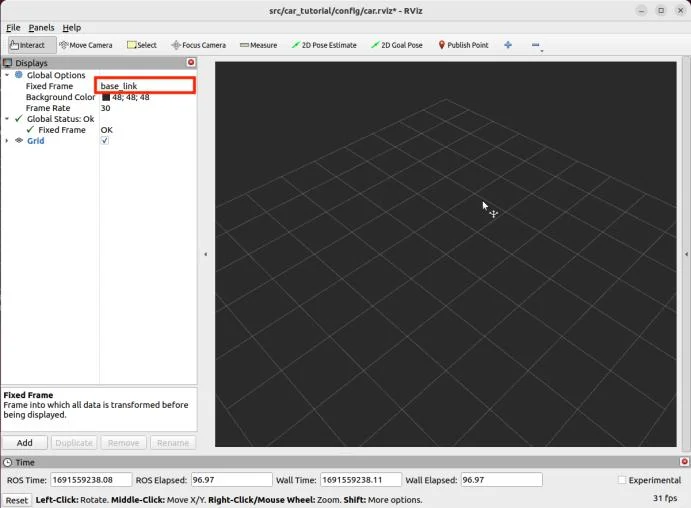

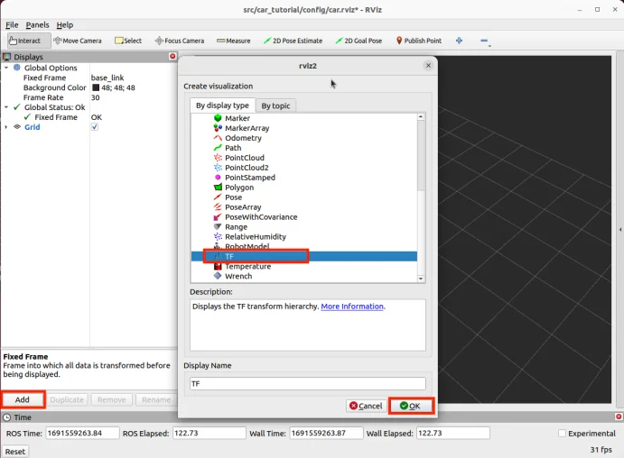

HUMAN AI ROBOTICS
69
자동차연동시뮬레이션
참고
이미지보기와설정저장
•
 'Add' 버튼을 누른 후 뜨는 팝업에서 Image를 선택 후 'Ok' 버튼을 눌러 Image를 추가
•
메뉴에서 File >> Save Config As를 선택 후 뜨는 팝업에서 현재 설정 'src/car_tutorial/config/car.rviz’에 저장
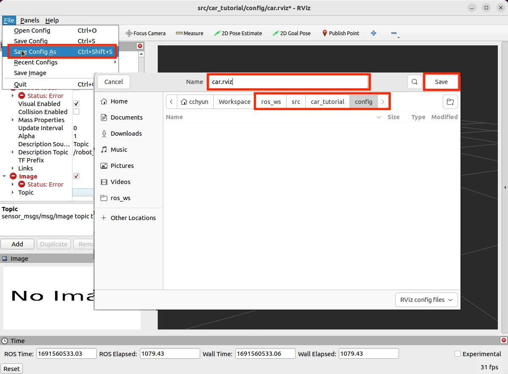

HUMAN AI ROBOTICS
70
SLAM
참고
자동차 연동 시뮬레이션

HUMAN AI ROBOTICS
71
자동차연동시뮬레이션
참고
차동이동로봇시뮬레이션
1. ROS에 자동차를 제어하고 Rviz로 확인하기 위한 최소의 컨트롤러 구성 요소
 - Keyboard Controller: 자동차의 방향/속도를 제어하는 명령을 Topic 퍼블리쉬
- Real Driver: 자동차에 방향/속도를 제어하는 명령을 보내고 실제 자동차의 방향/속도의 측정값 퍼블리쉬
카메라 화면 정보를 수신해서 Topic 퍼블리쉬
- Odometry: 자동차의 방향/속도의 측정값을 이용 실제 자동차의 위치를 계산 오돔데이터와 TF 퍼블리쉬
실제 자동차
가상 자동차

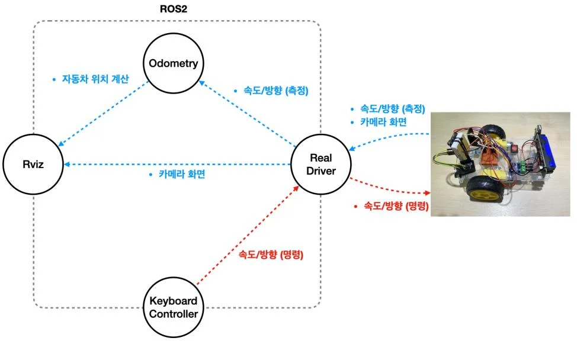

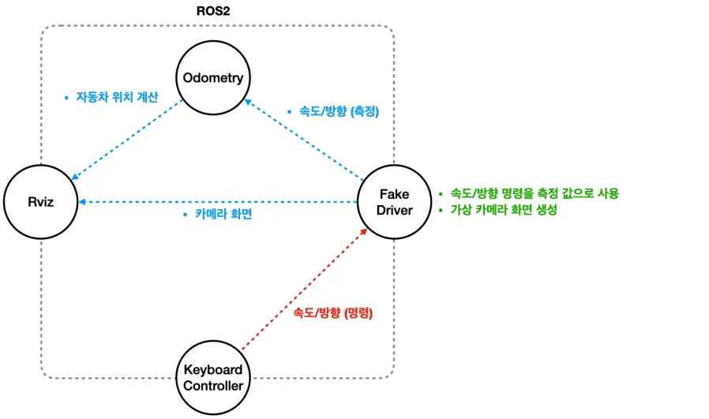

HUMAN AI ROBOTICS
72
자동차연동시뮬레이션
참고
차동이동로봇시뮬레이션
2. 차동 구동 컨트롤러 노드 작성
import rclpy
from rclpy.node import Node
from geometry_msgs.msg import Twist
from nav_msgs.msg import Odometry
import math
class DiffDriveController(Node):
    def __init__(self):
        super().__init__('diff_drive_controller')
        self.subscription = self.create_subscription(
            Twist,
            'cmd_vel',
            self.velocity_callback,
            10)
        self.publisher = self.create_publisher(Odometry, 'odom', 10)
        self.timer = self.create_timer(0.1, self.update_odometry)
        self.x = 0.0
        self.y = 0.0
        self.theta = 0.0
        self.linear_velocity = 0.0
        self.angular_velocity = 0.0
    def velocity_callback(self, msg):
        self.linear_velocity = msg.linear.x
        self.angular_velocity = msg.angular.z
def main(args=None):
    rclpy.init(args=args)
    controller = DiffDriveController()
    rclpy.spin(controller)
    controller.destroy_node()
    rclpy.shutdown()
if __name__ == '__main__':
    main()
    def update_odometry(self):
        dt = 0.1  # 타이머 주기
        self.x += self.linear_velocity * math.cos(self.theta) * dt
        self.y += self.linear_velocity * math.sin(self.theta) * dt
        self.theta += self.angular_velocity * dt
        odom = Odometry()
        odom.header.stamp = self.get_clock().now().to_msg()
        odom.header.frame_id = 'odom'
        odom.child_frame_id = 'base_link'
        odom.pose.pose.position.x = self.x
        odom.pose.pose.position.y = self.y
        odom.pose.pose.orientation.z = math.sin(self.theta / 2.0)
        odom.pose.pose.orientation.w = math.cos(self.theta / 2.0)
        self.publisher.publish(odom)

HUMAN AI ROBOTICS
73
자동차연동시뮬레이션
참고
차동이동로봇시뮬레이션
3. Rviz2 변화의 시각화 
- RViz2 자체는 시뮬레이터가 아니라 시각화 도구이지만, 차동 이동 로봇의 움직임을 시각화 가능
RViz2 설정
- RViz2를 실행하고 다음 디스플레이들을 추가
•
RobotModel (로봇 시각화)
•
TF (좌표 프레임 관계)
•
Odometry (로봇의 이동 경로)
실행
1.런치 파일 실행: ros2 launch car_tutorial your_launch_file.py 
2.차동 구동 컨트롤러 실행: ros2 run car_tutorial diff_drive_controller 
3.Teleop 실행 (선택사항): ros2 run teleop_keyboard

HUMAN AI ROBOTICS
74
자동차연동시뮬레이션
참고
실제로봇구현시고려사항
•물리 시뮬레이션
- 더 정확한 시뮬레이션을 위해서는 Gazebo와 같은 물리 엔진을 사용하는 것권장
- Gazebo는 ROS2와 통합되어 있어 RViz2와 함께 사용. 
•센서 시뮬레이션
- 실제 로봇에 장착된 센서들(예: 라이다, 카메라 등)을 시뮬레이션하려면 추가적인 노드나 Gazebo 플러그인이 필요. 
•제어 알고리즘
- 실제 로봇 제어에 사용될 알고리즘(예: PID 제어, 장애물 회피 등)을 구현하고 테스트. 
•네비게이션
- ROS2의 nav2 패키지를 사용하여 자율 주행 기능을 구현하고 테스트. 
•매핑
- SLAM (Simultaneous Localization and Mapping) 알고리즘을 구현하여 로봇이 환경 맵을 생성하는 과정을 시뮬레이션. 
4. 가제보(gazebo) 시각화

HUMAN AI ROBOTICS
75
자동차연동시뮬레이션
참고
차동이동로봇시뮬레이션
4. Caster Wheel 추가하기
<!-- CASTER WHEEL LINK -->
    <joint name="caster_wheel_joint" 
type="fixed">
        <parent link="body"/>
        <child link="caster_wheel"/>
        <origin xyz="0.03 0 0"/>
    </joint>
    <link name="caster_wheel">
        <visual>
            <geometry>
                <sphere radius="0.03"/>
            </geometry>
            <material name="black"/>
        </visual>
    </link>
5. Collision 추가하기
자동차가 주행하다가 장애물을 만난다면 그대로 통과 문제
충동을 시뮬레이션을 위해서 collision을 추가
<link name="body">
        <visual>
            <origin xyz="0.1 0 0.03"/>
            <geometry>
                <box size="0.2 0.1 0.06"/>
            </geometry>
            <material name="white"/>
        </visual>
        <collision>
            <origin xyz="0.1 0 0.03"/>
            <geometry>
                <box size="0.2 0.1 0.06"/>
            </geometry>
        </collision>
    </link>

HUMAN AI ROBOTICS
76
자동차연동시뮬레이션
참고
차동이동로봇시뮬레이션
6. 관성 모멘트 추가
<xacro:macro name="inertial_box" params="mass x y z *origin">
        <inertial>
            <xacro:insert_block name="origin"/>
            <mass value="${mass}" />
            <inertia ixx="${(1/12) * mass * (y*y+z*z)}" ixy="0.0" ixz="0.0"
                    iyy="${(1/12) * mass * (x*x+z*z)}" iyz="0.0"
                    izz="${(1/12) * mass * (x*x+y*y)}" />
        </inertial>
    </xacro:macro>
자동차의 물리적인 특성을 계산
<!-- MACROS -->
<xacro:include filename="macros.xacro"/>
7. URDF를 Gazebo에서 로딩하기
$ ros2 launch gazebo_ros gazebo.launch.py
$ ros2 launch urdf_tutorial robot_3.launch.py use_sim_time:=true

HUMAN AI ROBOTICS
77
SLAM
참고
ODOM,TF 발행

HUMAN AI ROBOTICS
78
주제2.1 기초
참고
센서정보시각화– ODOM,TF 발행
•초기화 함수에서 파라미터(휠 간 거리, 인코더 해상도, 휠 반경)를 설정합니다. 
•오도메트리 상태 변수(x, y, theta, 왼쪽/오른쪽 틱)를 초기화합니다. 
•왼쪽과 오른쪽 휠 인코더 틱을 구독합니다. 
•오도메트리 메시지를 발행할 퍼블리셔를 생성합니다. 
•TF 브로드캐스터를 설정합니다. 
•오도메트리 발행을 위한 타이머를 생성합니다. 
•콜백 함수(left_callback, right_callback)에서 인코더 틱 정보를 저장합니다. 
•각 휠의 이동 거리를 계산합니다. 
•로봇의 이동 거리와 회전각을 계산합니다. 
•로봇의 위치와 방향을 업데이트합니다. 
•오일러 각을 쿼터니언으로 변환합니다. 
•Odometry 메시지를 생성하고 발행합니다. 
•TF(Transform) 메시지를 생성하고 브로드캐스트합니다. 
•인코더 틱을 리셋합니다.
pip install transforms3d
package.xml에 필요한 의존성을 추가합니다:
xmlCopy<depend>std_msgs</depend>
<depend>nav_msgs</depend>
<depend>geometry_msgs</depend>
<depend>tf2_ros</depend>
•setup.py에 엔트리 포인트를 추가합니다. 
•패키지를 빌드하고 소스합니다. 
시작 지점으로부터 로봇의 상대적 위치 추정
휠 인코더 정보나 관성 측정 센서 기반으로 추정
다른 노드가 이 정보를 사용하여 로봇의 위치를 추적하거나 내비게이션에 활용
publish_odometry 메서드에서 오도메트리 계산과 발행
WheelOdometryNode 클래스

HUMAN AI ROBOTICS
79
주제2.1 기초
참고
센서정보시각화- 라이다
import rclpy
from rclpy.node import Node
from std_msgs.msg import Int32
from nav_msgs.msg import Odometry
from geometry_msgs.msg import TransformStamped, Quaternion
from tf2_ros import TransformBroadcaster
import math
from tf_transformations import quaternion_from_euler
class WheelOdometryNode(Node):
    def __init__(self):
        super().__init__('wheel_odometry_node')
        
        # Parameters
        self.wheel_separation = 0.5  # Distance between wheels in meters
        self.ticks_per_revolution = 1000  # Encoder ticks per wheel revolution
        self.wheel_radius = 0.1  # Wheel radius in meters
        
        # Odometry state
        self.x = 0.0
        self.y = 0.0
        self.theta = 0.0
        self.left_ticks = 0
        self.right_ticks = 0
        
        # Subscribers
        self.left_sub = self.create_subscription(Int32, 'left_ticks', self.left_callback, 10)
        self.right_sub = self.create_subscription(Int32, 'right_ticks', self.right_callback, 10)
        
        # Publishers
        self.odom_pub = self.create_publisher(Odometry, 'odom', 10)
        
        # TF Broadcaster
        self.tf_broadcaster = TransformBroadcaster(self)
        
        # Timer for publishing odometry
        self.create_timer(0.1, self.publish_odometry)  # 10Hz
    def left_callback(self, msg):
        self.left_ticks = msg.data
    def right_callback(self, msg):
        self.right_ticks = msg.data
def publish_odometry(self):
        # Calculate distance traveled by each wheel
        left_distance = (self.left_ticks / self.ticks_per_revolution) * 2 * math.pi * self.wheel_radius
        right_distance = (self.right_ticks / self.ticks_per_revolution) * 2 * math.pi * self.wheel_radius
        
        # Calculate change in position and orientation
        distance = (left_distance + right_distance) / 2
        delta_theta = (right_distance - left_distance) / self.wheel_separation
        
        # Update pose
        self.x += distance * math.cos(self.theta)
        self.y += distance * math.sin(self.theta)
        self.theta += delta_theta
        
        # Create quaternion from yaw
        q = quaternion_from_euler(0, 0, self.theta)
        
        # Publish odometry message
        odom = Odometry()
        odom.header.stamp = self.get_clock().now().to_msg()
        odom.header.frame_id = 'odom'
        odom.child_frame_id = 'base_link'
        odom.pose.pose.position.x = self.x
        odom.pose.pose.position.y = self.y
        odom.pose.pose.position.z = 0.0
        odom.pose.pose.orientation = Quaternion(x=q[0], y=q[1], z=q[2], w=q[3])
        self.odom_pub.publish(odom)
        
        # Broadcast TF
        t = TransformStamped()
        t.header.stamp = self.get_clock().now().to_msg()
        t.header.frame_id = 'odom'
        t.child_frame_id = 'base_link'
        t.transform.translation.x = self.x
        t.transform.translation.y = self.y
        t.transform.translation.z = 0.0
        t.transform.rotation = odom.pose.pose.orientation
        self.tf_broadcaster.sendTransform(t)
        
        # Reset ticks
        self.left_ticks = 0
        self.right_ticks = 0
def main(args=None):
    rclpy.init(args=args)
    node = WheelOdometryNode()
    rclpy.spin(node)
    node.destroy_node()
    rclpy.shutdown()
if __name__ == '__main__':
    main()

HUMAN AI ROBOTICS
80
자동차연동시뮬레이션
참고
가상자동차만들기
joint_states는 URDF에서 정의한 두 개의 Joint (left_wheel_joint, right_wheel_joint) 정보
def main(args=None):
rclpy.init(args=args)
driver = FakeDriver()
executor = MultiThreadedExecutor()
rclpy.spin(driver, executor=executor)
driver.destroy_node()
rclpy.shutdown()
if __name__ == '__main__':
main()
src/car_tutorial/car_tutorial/fake_driver.py
import rclpy
from rclpy.node import Node
from rclpy.executors import MultiThreadedExecutor
from sensor_msgs.msg import JointState
class FakeDriver(Node):
    def __init__(self):
        super().__init__('fake_driver')
        # joint states publisher
        self.pub_joint_states = self.create_publisher(JointState, "joint_states", 10)
        # init variable
        self.joint_states = JointState()
        self.joint_states.header.frame_id = "joint_states"
        self.joint_states.name = ["left_wheel_joint", "right_wheel_joint"]
        self.joint_states.position = [0.0, 0.0]
        # timer
        self.timer = self.create_timer(0.1, self.publish_callback)
    
    def publish_callback(self):
        curr_time = self.get_clock().now()
        # joint states
        self.joint_states.header.stamp = curr_time.to_msg()
        # publish
        self.pub_joint_states.publish(self.joint_states)
        # simulate wheel rotate
        self.joint_states.position[0] += 0.05
        self.joint_states.position[1] += 0.05

HUMAN AI ROBOTICS
81
자동차연동시뮬레이션
참고
가상자동차만들기
src/car_tutorial/setup.py'의 console_scripts 부분에 아래 내용을 추가
'src/car_tutorial/launch/fake.launch.py' 파일 수정

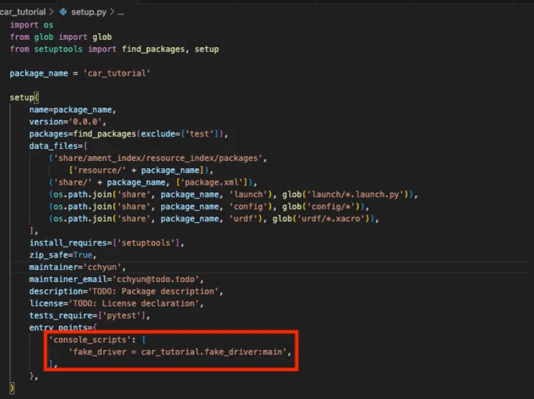

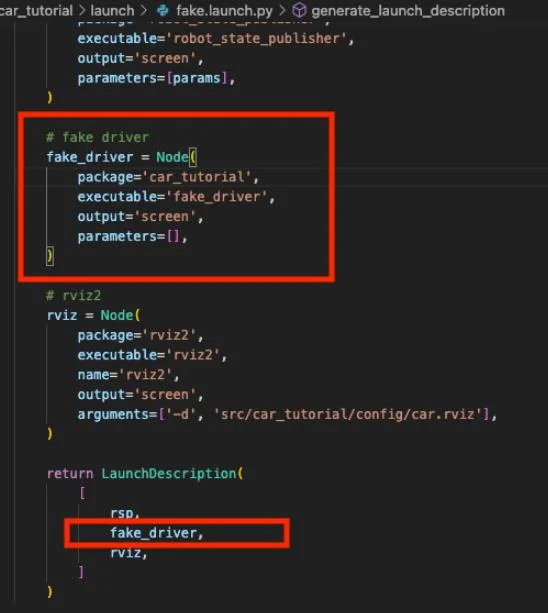

HUMAN AI ROBOTICS
82
자동차연동시뮬레이션
참고
정상실행하기
$ cd ~/Workspace/ros_ws/
$ colcon build --symlink-install
$ source install/setup.bash
$ ros2 launch car_tutorial fake.launch.py
터미널에서 'src/car_tutorial/launch/fake.launch.py' 실행
HUMAN AI ROBOTICS
83
자동차연동시뮬레이션
참고
자동차이동및이미지전송
FakeDriver에서cmd_vel subscribe and vel_raw 발행하기
•키보드(teleop_twist_keyboard)를 이용해서 로봇에게 제어 명령을 내리면 로봇이 이동하는 기능에 대한 과정
•실제 로봇은 Driver가 명령을 받으면 자동차에게 그 명령을 따라 동작하도록 명령을 전달하고 로봇으로부터 
실제 이동 속도 등의 정보를 받아야함
가상 로봇이기 때문에 입력받은 명령 그대로 로봇이 이동한다고 가정하겠습니다. 따라서 키보드 입력값 그
대로를 로봇의 실제 이동 정보로 사용
◦ 키보드를 이용한 자동차 제어 명령인 'cmd_vel' Topic을 수신할 subscriber를 등록
◦ 현재 로봇의 속도를 'vel_raw' Topic으로 전송할 publisher를 등록
◦ 0.1초에 한 번씩 'vel_raw' Topic을 발송

HUMAN AI ROBOTICS
84
주제2.1 자동차연동시뮬레이션
참고
가상자동차만들기
•첫 번째 터미널에서 아래 명령을 실행해서 'src/car_tutorial/launch/fake.launch.py'를 실행합니다.
•두 번째 터미널에서 아래 명령을 실행합니다.
$ cd ~/Workspace/ros_ws/
$ colcon build --symlink-install
$ source install/setup.bash
$ ros2 launch car_tutorial fake.launch.py
$ ros2 run teleop_twist_keyboard teleop_twist_keyboard

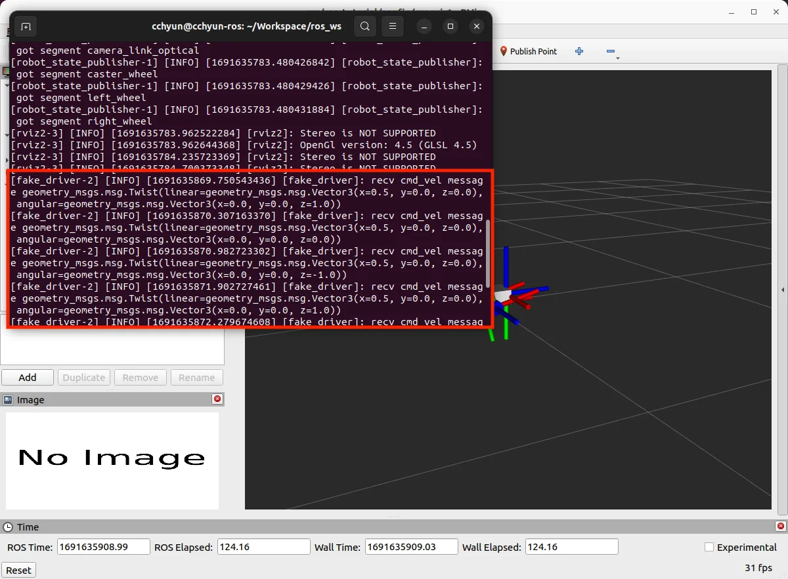

HUMAN AI ROBOTICS
85
주제2.1 자동차연동시뮬레이션
참고
가상자동차만들기
•세 번째 터미널에서 아래 명령을 실행합니다.
$ rqt_graph
FakeDriver - img_raw publish
적당한 크기의 (400 x 300) 이미지를 'src/car_tutorial/car_tutorial/photo.png'에 저장

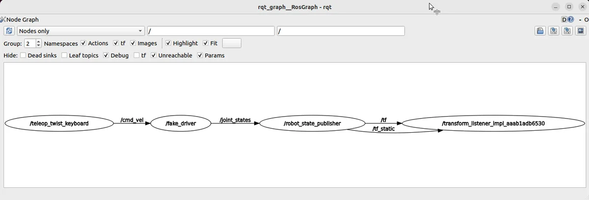

HUMAN AI ROBOTICS
86
주제2.1 자동차연동시뮬레이션
참고
가상자동차만들기
'src/car_tutorial/car_tutorial/fake_driver.py' 파일을 아래와 같이 편집

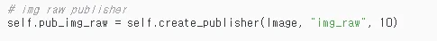

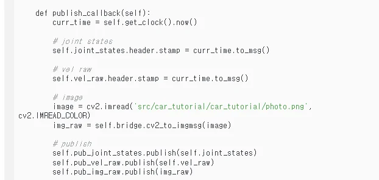

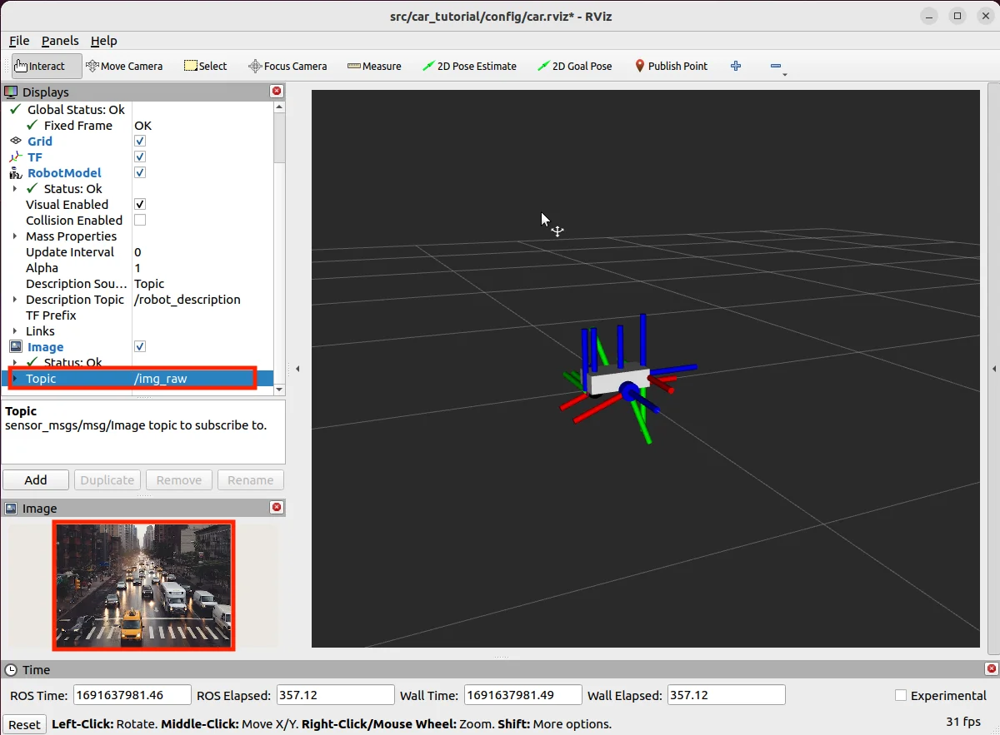

HUMAN AI ROBOTICS
87
SLAM
참고
슬램(SLAM)

HUMAN AI ROBOTICS
88
RQT
참고
SLAM과 RViz2
▪로봇의 자율주행을 위해 SLAM을 사용하는 경우, RViz2에서 SLAM이 생성하는 실시간 지도를 확인
▪ROS2에서는 주로 nav2 패키지와 함께 사용되며, RViz2에서 로봇의 위치와 생성된 지도를 동시에 시각화 
1.Map Displays 항목을 추가.
2.SLAM 알고리즘이 퍼블리시하는 map 토픽을 설정.
3.로봇이 탐색한 영역이 지도 형태로 나타남.
SLAM (Simultaneous Localization and Mapping)
1. SLAM 지도 시각화

HUMAN AI ROBOTICS
89
RQT
참고
터틀봇3를 이용한 SLAM
1. 위치: 로봇의 위치 계측/추정 하는 기능
- GPS : 오차,날씨,실외 등의 문제점
- 해결책(절대위치): IPS(indoor positioning sensor): landmark, indoor gps, wifi slam, beacon
-
추측항법(상대위치): 양 바퀴 축의 회전 값 이용/ 이동거리와 회전 값 이용해 위치 측정
-
IMU(관성센서, 필터))로 위치 보상
 -> 필요정보: 양 바퀴 축의 엔코더 값, 바퀴 간 거리, 바퀴반지름 이용하여 식에 대입
2. 센싱: 벽, 물체 등의 장애물의 계측하는 기능
- 거리센서, 비전센서, Depth camera
3. 지도: 길과 장애물 정보가 담긴 지도
- 지도가 없으면 만들면 된다 => 이게 SLAM (로봇의 위치와 지도를 만드는 과정)
4. 경로: 목적지까지 최적 경로를 계산하고 주행하는 기능
-  A* 알고리즘, 포텐셜 장, 파티클 필터, 그래프 등
2. SLAM을위한 ROS2 메시지

HUMAN AI ROBOTICS
90
RQT
참고
터틀봇3를 이용한 SLAM
3. SLAM을위한 노드들 처리 과정
HUMAN AI ROBOTICS
91
RQT
참고
터틀봇3를 이용한 SLAM
4. 루프 폐쇄 검출 (Loop Closure Detection)
•정의: 현재 센서 위치가 이전에 방문한 곳인지 판단하는 알고리즘
•방법: 현재 센서 입력과 이전 센서 입력 사이의 유사성을 고려
•효과: 아래와 같이 Visual Odometry에 의해 표류오차가 누적된 빨간 선에서 루프 폐쇄 검출 알고리즘을 통해 같은 위
치임을 판단해 전체 궤적을 초록선에 가까이 보정할 수 있음

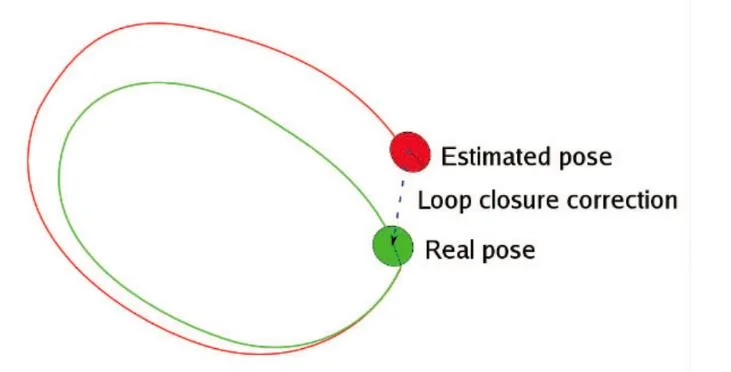

HUMAN AI ROBOTICS
92
RQT
참고
터틀봇3를 이용한 SLAM
5. DWA(dynamic window approach)
로봇 내비게이션에서 사용되는 중요한 지역 경로 계획 알고리즘
충돌 가능한 장애물을 회피하며 목표점까지 빠르게 갈수 있는 속도를 선택하는 방법.
즉, 지도를 위치영역 기반이 아닌 속도영역으로 바꿈
평가 기준
- 각 속도 조합은 다음 세 가지 주요 기준으로 평가
1.목표 도달성 (목표 지점에 가까워지는 정도)
2.장애물 회피 (장애물로부터 안전한 거리 유지)
3.속도 프로파일 (로봇의 운동학적 제약 고려)

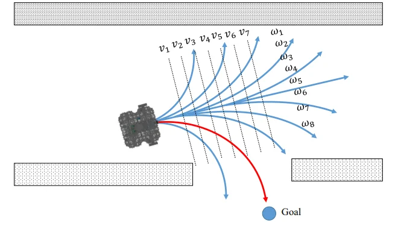

HUMAN AI ROBOTICS
93
자동차연동시뮬레이션
참고
차동이동로봇시뮬레이션
6. SDF 플러그인(plugin) 
SDF Plugin은 SDF 모델에 특정 동작을 추가하기 위해 사용하는 코드
Gazebo에서 로봇이나 환경이 더 동적이고 상호작용적으로 동작하도록 추가되는 소프트웨어 컴포넌트, 
주로 C++로 작성
•로봇의 특정 행동 정의
•센서 데이터 생성 및 처리
•시뮬레이션 환경과의 상호작용 
ROS 2에서 SDF Plugin의 역할
•ROS 2 노드와 통신
•토픽이나 서비스를 통해 데이터 송수신
•Gazebo 시뮬레이터 내의 로봇 동작 제어

HUMAN AI ROBOTICS
94
자동차연동시뮬레이션
참고
차동이동로봇시뮬레이션
SDF Plugin 작성하기
플러그인은 gazebo::ModelPlugin 또는 gazebo::SensorPlugin 클래스를 상속받아 구현 
#include <gazebo/common/Plugin.hh>
#include <ros/ros.h>
#include <std_msgs/String.h>
namespace gazebo
{
    class ExamplePlugin : public ModelPlugin
    {
    public:
        void Load(physics::ModelPtr _model, sdf::ElementPtr _sdf) override
        {
rclcpp::init(0, nullptr);
            auto node = rclcpp::Node::make_shared("example_plugin");
            
            auto publisher = node->create_publisher<std_msgs::msg::String>("example_topic", 10);
            auto msg = std_msgs::msg::String();
            msg.data = "Hello from SDF Plugin!";
            publisher->publish(msg);
        }
    };
    GZ_REGISTER_MODEL_PLUGIN(ExamplePlugin)
}
CMake 설정

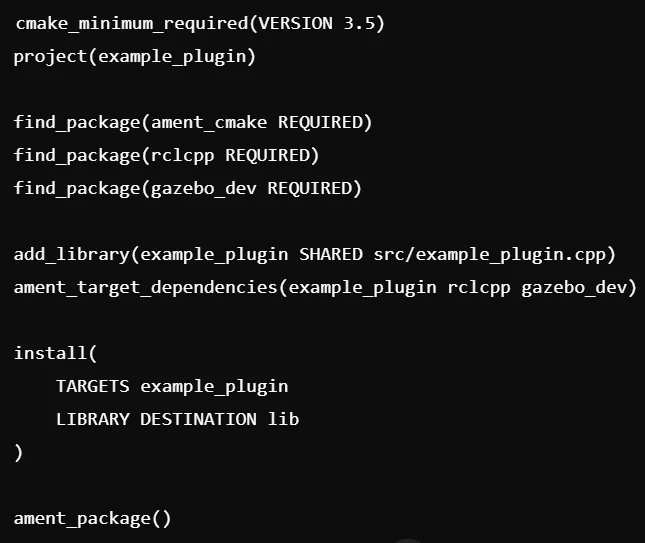

HUMAN AI ROBOTICS
95
자동차연동시뮬레이션
참고
차동이동로봇시뮬레이션
<model name="example_robot"> 
<plugin name="example_plugin" filename="libexample_plugin.so"/> 
</model>
SDF 파일에 플러그인 연결: SDF 파일의 <model> 또는 <sensor> 안에 플러그인을 정의 
ROS 2와 통합하기 위해 플러그인은 ROS 2 노드를 통해 토픽, 서비스, 액션 등을 사용
이를 통해 Gazebo에서 시뮬레이션된 센서 데이터나 제어 명령을 ROS 2로 전달.

HUMAN AI ROBOTICS
96
자동차연동시뮬레이션
참고
차동이동로봇시뮬레이션
ROS 2와 Gazebo SDF 파일을 활용해 카메라, 두 개의 차동 로봇 구동부(two-differential-mover), 그리고 
IMU 센서를 포함한 예제
<?xml version="1.0" ?>
<sdf version="1.7">
  <world name="example_world">
    <!-- Ground Plane -->
    <include>
      <uri>model://ground_plane</uri>
    </include>
    <!-- Sun -->
    <include>
      <uri>model://sun</uri>
    </include>
    <!-- Two-Differential-Mover Robot -->
    <model name="two_diff_robot">
      <static>false</static>
     
주요 태그 
•<model>: 전체 모델 정의 
•<link>: 로봇의 개별 강체 부분 
•<joint>: 링크 간 연결 방식 
•<sensor>: 센서 정의 
•<plugin>: 추가 기능 확장

HUMAN AI ROBOTICS
97
자동차연동시뮬레이션
참고
차동이동로봇시뮬레이션
ROS 2와 Gazebo SDF 파일을 활용해 카메라, 두 개의 차동 로봇 구동부(two-differential-mover), 그리고 
IMU 센서를 포함한 예제
<!-- Differential Drive Plugin --> 
<plugin name="differential_drive" filename="libgazebo_ros_diff_drive.so"> 
<ros> <namespace>/robot</namespace> </ros>
<left_joint>left_wheel_joint</left_joint> 
<right_joint>right_wheel_joint</right_joint> 
<wheel_separation>0.4</wheel_separation> 
<wheel_diameter>0.1</wheel_diameter> 
<topic>/cmd_vel</topic> 
<odometry_topic>/odom</odometry_topic> 
<odometry_frame>odom</odometry_frame> 
<robot_base_frame>base_link</robot_base_frame> 
</plugin>

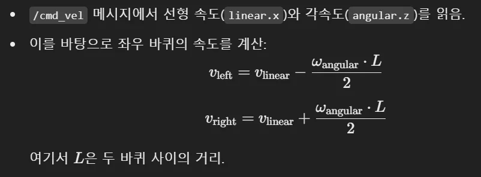

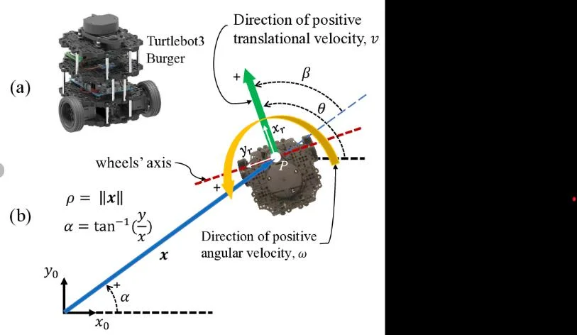

HUMAN AI ROBOTICS
98
자동차연동시뮬레이션
참고
차동이동로봇시뮬레이션
ROS 2와 Gazebo SDF 파일을 활용해 카메라, 두 개의 차동 로봇 구동부(two-differential-mover), 그리고 
IMU 센서를 포함한 예제
<!-- IMU -->
      <sensor name="imu_sensor" type="imu">
        <pose>0 0 0.2 0 0 0</pose>
        <imu>
          <angular_velocity>
            <x>0</x>
            <y>0</y>
            <z>0</z>
          </angular_velocity>
          <linear_acceleration>
            <x>0</x>
            <y>0</y>
            <z>0</z>
          </linear_acceleration>
        </imu>
        <plugin name="imu_plugin" filename="libgazebo_ros_imu.so">
          <ros>
            <namespace>/imu</namespace>
            <topic_name>data</topic_name>
            <frame_name>imu_link</frame_name>
          </ros>
        </plugin>
      </sensor>
<!-- Camera -->
      <sensor name="camera_sensor" type="camera">
        <pose>0 0 0.5 0 0 0</pose>
        <camera>
          <horizontal_fov>1.047</horizontal_fov>
          <image>
            <width>640</width>
            <height>480</height>
            <format>R8G8B8</format>
          </image>
        </camera>
        <plugin name="camera_plugin" filename="libgazebo_ros_camera.so">
          <ros>
            <namespace>/camera</namespace>
            <topic_name>image_raw</topic_name>
            <frame_name>camera_link</frame_name>
          </ros>
        </plugin>
      </sensor>

HUMAN AI ROBOTICS
99
SLAM
참고
주행(Navigation)

HUMAN AI ROBOTICS
100
자동차연동시뮬레이션
참고
주행(Navigation)
1. TurtleBot3에서 Nav2(Navigation 2)를 사용할 때 생성되는 주요 노드
•map_server 
•사전에 작성된 지도(map) 파일을 로드하고 공유합니다. 
•로봇에게 환경 정보를 제공합니다. 
•정적 지도 정보를 /map 토픽으로 발행합니다. 
•amcl (Adaptive Monte Carlo Localization) 
•파티클 필터 기반 로컬라이제이션 노드 
•로봇의 현재 위치를 추정합니다. 
•센서 데이터와 지도를 기반으로 로봇의 위치를 지속적으로 업데이트합니다. 
•/amcl_pose, /particlecloud 토픽을 발행합니다. 
•behavior_server 
•네비게이션 중 로봇의 행동을 관리합니다. 
•회전, 대기, 정지 등 다양한 로봇 행동을 제어합니다.

HUMAN AI ROBOTICS
101
자동차연동시뮬레이션
참고
주행(Navigation)
•bt_navigator 
•행동 트리(Behavior Tree) 기반 경로 탐색 노드 
•목표 지점까지의 전역 경로를 생성합니다. 
•복잡한 네비게이션 로직을 구현할 수 있습니다. 
•controller_server 
•로봇의 속도와 방향을 실시간으로 조절합니다. 
•장애물 회피 및 경로 추종 기능을 담당합니다. 
•로컬 경로 계획을 수행합니다. 
•planner_server 
•전역 경로 계획을 담당합니다. 
•출발지에서 목적지까지의 최적 경로를 계산합니다. 
•A* 또는 Dijkstra 알고리즘 등을 사용합니다.
1. TurtleBot3에서 Nav2(Navigation 2)를 사용할 때 생성되는 주요 노드

HUMAN AI ROBOTICS
102
자동차연동시뮬레이션
참고
주행(Navigation)
•lifecycle_manager 
•Nav2 노드들의 생명주기를 관리합니다. 
•노드들의 설정, 활성화, 비활성화를 제어합니다. 
•rviz 
•시각화 도구로, 로봇의 위치, 경로, 센서 데이터 등을 시각적으로 표현합니다.
1. TurtleBot3에서 Nav2(Navigation 2)를 사용할 때 생성되는 주요 노드

HUMAN AI ROBOTICS
103
자동차연동시뮬레이션
참고
주행(Navigation)
주요 통신 토픽
•/cmd_vel: 로봇 속도 제어 토픽 
•/odom: Odometry 정보 
•/scan: LiDAR 센서 데이터 
•/map: 지도 정보 
•/initialpose: 초기 위치 설정 
•/move_base_simple/goal: 목표 지점 설정 
구동 과정
# Nav2 런치 파일 실행
ros2 launch nav2_bringup navigation_launch.py
# 초기 위치 설정
ros2 topic pub /initialpose geometry_msgs/msg/PoseWithCovarianceStamped "{...}"
# 목표 지점 설정
ros2 topic pub /move_base_simple/goal geometry_msgs/msg/PoseStamped "{...}"

HUMAN AI ROBOTICS
104
자동차연동시뮬레이션
참고
주행(Navigation)
시뮬레이션 런치 파일 실행
# 시뮬레이션 환경 로드
roslaunch turtlebot3_gazebo turtlebot3_world.launch
# 별도의 터미널에서 네비게이션 런치
roslaunch turtlebot3_navigation turtlebot3_navigation.launch
•기본적으로 global planner와 local planner 사용
•Global: A* 알고리즘
•Local: Dynamic Window Approach(DWA)
경로 알고리즘
•/move_base 노드의 파라미터 수정 가능 
•costmap 설정 
•로봇 footprint 
•최대/최소 속도 
•가속도 제한
파라미터 조정 
•AMCL(Adaptive Monte Carlo Localization) 사용
•파티클 필터로 위치 추정 정확도 개선
오차 보정

HUMAN AI ROBOTICS
105
SLAM
참고
다중로봇환경

HUMAN AI ROBOTICS
106
자동차연동시뮬레이션
참고
TurtleBot3 차동이동로봇시뮬레이션
namespace 변경, 다중 로봇 환경에서 각 로봇을 구분하거나 특정 네임스페이스에서 노드 실행해야 할 때 필요
네임스페이스를 변경하면 각 로봇이나 관련된 토픽들이 충돌하지 않도록 독립적인 네임스페이스에서 실행
1. 네임스페이스 변경의 주요 방법
TurtleBot3에서 네임스페이스를 변경하는 방법은 두 가지입니다.
A. ROS 2 Launch 파일에서 네임스페이스 설정
ROS 2의 launch 파일에서 네임스페이스를 설정합니다.
B. 네임스페이스를 사용하여 터미널에서 실행
명령어 실행 시 --ros-args를 이용해 네임스페이스를 적용합니다.
2. Launch 파일에서 네임스페이스 설정
TurtleBot3의 launch 파일에서 namespace를 추가로 정의하고 적용합니다.
예제: TurtleBot3의 robot_state_publisher에 네임스페이스 적용
기존 turtlebot3_robot.launch.py를 수정하거나 별도의 커스텀 launch 파일을 만듭니다.
ros2 run turtlebot3_node turtlebot3_ros --ros-args --namespace robot1

HUMAN AI ROBOTICS
107
자동차연동시뮬레이션
참고
차동이동로봇시뮬레이션
from launch import LaunchDescription
from launch_ros.actions import Node
def generate_launch_description():
    namespace = 'robot1'  # 변경할 네임스페이스 설정
    return LaunchDescription([
        Node(
            package='robot_state_publisher',
            executable='robot_state_publisher',
            name='robot_state_publisher',
            namespace=namespace,  # 네임스페이스 적용
            output='screen',
            parameters=[{'use_sim_time': True}]
        ),
        Node(
            package='turtlebot3_node',
            executable='turtlebot3_ros',
            name='turtlebot3_ros',
            namespace=namespace,  # 네임스페이스 적용
            output='screen',
            parameters=[{'use_sim_time': True}]
        )
    ])
ros2 launch my_turtlebot3_launch.py

HUMAN AI ROBOTICS
108
자동차연동시뮬레이션
참고
차동이동로봇시뮬레이션
from launch import LaunchDescription
from launch_ros.actions import Node
def generate_launch_description():
    robot1_ns = 'robot1'
    robot2_ns = 'robot2'
    return LaunchDescription([
        # Robot 1
        Node(
            package='turtlebot3_node',
            executable='turtlebot3_ros',
            name='turtlebot3_ros',
            namespace=robot1_ns,
            output='screen',
            parameters=[{'use_sim_time': True}]
        ),
        # Robot 2
        Node(
            package='turtlebot3_node',
            executable='turtlebot3_ros',
            name='turtlebot3_ros',
            namespace=robot2_ns,
            output='screen',
            parameters=[{'use_sim_time': True}]
        )
    ])
ros2 launch multi_robot_turtlebot3.launch.py
•/robot1/cmd_vel
•/robot1/odom
•/robot1/scan
•/robot2/cmd_vel
•/robot2/odom
•/robot2/scan 
Topic list

HUMAN AI ROBOTICS
109
자동차연동시뮬레이션
참고
차동이동로봇시뮬레이션
다중 로봇 환경에서 TF 충돌을 방지하려면, 각 로봇의 TF 프레임 이름에도 네임스페이스를 추가
TurtleBot3의 URDF 또는 XACRO 파일에서 robot_description에 네임스페이스를 포함
<robot name="$(arg robot_name)">
  <link name="$(arg robot_name)_base_link">
    <!-- 내용 생략 -->
  </link>
</robot>
Node(
    package='robot_state_publisher',
    executable='robot_state_publisher',
    namespace='robot1',
    parameters=[{'robot_description': '<URDF_CONTENT>'}]
)
ros2 run tf2_tools view_frames
TF 데이터 확인:

HUMAN AI ROBOTICS
110
자동차연동시뮬레이션
참고
차동이동로봇시뮬레이션
1. 네임스페이스와 토픽의 기본 동작
네임스페이스가 적용되면 노드가 생성하는 모든 토픽, 서비스, 액션은 해당 네임스페이스 아래에서 생성
/robot1/cmd_vel
2. 네임스페이스를 무시하고 글로벌 토픽을 사용하는 방법
글로벌 토픽을 사용하려면 토픽 이름 앞에 슬래시(/)를 붙여 절대 경로로 명시 
import rclpy
from geometry_msgs.msg import Twist
def main():
    rclpy.init()
    node = rclpy.create_node('namespace_example', namespace='robot1')  # 네임스페이스 설정
    pub = node.create_publisher(Twist, '/cmd_vel', 10)  # 글로벌 토픽 설정
    msg = Twist()
    msg.linear.x = 1.0
    pub.publish(msg)
    rclpy.spin(node)
if __name__ == '__main__':
    main()

HUMAN AI ROBOTICS
111
자동차연동시뮬레이션
참고
차동이동로봇시뮬레이션
3. 네임스페이스와 연결된 토픽을 사용하는 방법
네임스페이스에 종속된 토픽은 네임스페이스를 포함한 경로로 접근해야 합니다. 
이를 위해 상대 경로와 절대 경로를 구분
상대 경로 토픽
토픽 이름이 상대 경로라면 노드의 네임스페이스가 자동으로 추가됩니다.
•예: cmd_vel → /robot1/cmd_vel (노드의 네임스페이스: robot1)
절대 경로 토픽
절대 경로를 사용하면 네임스페이스와 상관없이 해당 경로로 접근합니다.
•예: /robot1/cmd_vel 또는 /cmd_vel
네임스페이스 변경
런치 파일에서 네임스페이스를 설정하면, 모든 노드와 토픽이 해당 네임스페이스를 사용
from launch import LaunchDescription
from launch_ros.actions import Node
def generate_launch_description():
    return LaunchDescription([
        Node(
            package='turtlebot3_node',
            executable='turtlebot3_ros',
            name='turtlebot3_node',
            namespace='robot1',  # 네임스페이스 설정
            output='screen'
        )
    ])

HUMAN AI ROBOTICS
112
자동차연동시뮬레이션
참고
차동이동로봇시뮬레이션
노드가 사용하는 기본 이름(토픽, 서비스, 액션, 노드 이름 등)을 런타임에 다른 이름으로 변경하는 기능. 
이 기능은 네임스페이스를 구성하거나 여러 노드가 동일한 토픽을 충돌 없이 사용할 수 있도록 할 때 유용
ROS 2의 Remapping (리매핑) 
1. Remapping의 사용 대상
•Topic (예: /cmd_vel → /robot1/cmd_vel)
•Service (예: /reset → /robot1/reset)
•Action (예: /navigate → /robot1/navigate)
•Node 이름 (예: my_node → robot1_my_node)
2. Remapping의 주요 방법
A. CLI 명령어에서 Remapping
ros2 run my_package my_node --ros-args --remap __node:=robot1_node --remap /cmd_vel:=/robot1/cmd_vel

HUMAN AI ROBOTICS
113
자동차연동시뮬레이션
참고
차동이동로봇시뮬레이션
ROS 2의 Remapping (리매핑) 
B. Launch 파일에서 Remapping
from launch import LaunchDescription
from launch_ros.actions import Node
def generate_launch_description():
    return LaunchDescription([
        Node(
            package='my_package',
            executable='my_node',
            name='robot1_node',  # 노드 이름 변경
            remappings=[
                ('/cmd_vel', '/robot1/cmd_vel'),  # 토픽 리매핑
                ('/odom', '/robot1/odom')        # 다른 토픽 리매핑
            ]
        )
    ])

HUMAN AI ROBOTICS
114
자동차연동시뮬레이션
참고
차동이동로봇시뮬레이션
ROS 2의 Remapping (리매핑) 
C. 코드에서 Remapping
import rclpy
from rclpy.node import Node
class MyNode(Node):
def __init__(self):
super().__init__('my_node')
self.subscriber = self.create_subscription(
String,
'/cmd_vel',  # 이 이름은 리매핑 대상
            self.callback,
10
)
def callback(self, msg):
self.get_logger().info(f"Received: {msg.data}")
def main():
rclpy.init()
node = MyNode()
rclpy.spin(node)
if __name__ == '__main__':
main()
ros2 run my_package my_node --ros-args --remap /cmd_vel:=/robot1/cmd_vel

HUMAN AI ROBOTICS
115
자동차연동시뮬레이션
참고
차동이동로봇시뮬레이션
ROS 2의 Remapping (리매핑) 
A. 노드 이름 리매핑
리매핑 키워드 __node를 사용하여 노드 이름을 변경합니다.
ros2 run my_package my_node --ros-args --remap __node:=robot1_node
B. 네임스페이스 변경
ros2 run my_package my_node --ros-args --remap __ns:=/robot1
C. 토픽 이름 리매핑
ros2 run my_package my_node --ros-args --remap /cmd_vel:=/robot1/cmd_vel

HUMAN AI ROBOTICS
116
SLAM
참고
MOVEIT2

HUMAN AI ROBOTICS
117
Moveit2
참고
MoveIt 2 설치 및 사용 방법
MoveIt2는 ROS 2 패키지로 제공되며, apt 패키지 매니저를 통해 쉽게 설치할 수 있습니다. 
sudo apt update
sudo apt install ros-humble-moveit
MoveIt2 Setup Assistant 사용
로봇의 URDF 또는 XACRO 파일을 MoveIt2 환경에서 쉽게 사용할 수 있도록 설정하는 도구인 
MoveIt Setup Assistant를 사용하여 설정합니다.
ros2 launch moveit_setup_assistant setup_assistant.launch.py

HUMAN AI ROBOTICS
118
Moveit2
참고
MoveIt Setup Assistant
•로봇의 URDF/XACRO 파일 로드
•MoveIt Setup Assistant를 통해 로봇의 URDF 또는 XACRO 파일을 로드합니다.
•URDF/XACRO 파일은 로봇의 기구학적 모델(링크와 조인트)을 정의하며, 
•RViz2에서 로봇 모델을 시각적으로 확인할 수 있습니다.
•Planning Groups 설정
•로봇의 조인트와 링크들을 그룹으로 묶어서 모션 플래닝을 위한 그룹을 설정합니다. 
•예를 들어, 로봇 팔의 여러 조인트를 하나의 그룹으로 묶을 수 있습니다.
•End Effectors 설정
•로봇의 말단 장치(예: 그리퍼 또는 툴)를 설정합니다.
•Virtual Joints 설정
•로봇 베이스의 가상 관절을 설정하여 이동 가능한 로봇의 경우를 고려합니다
•(예: 로봇이 이동할 때 베이스의 가상 조인트를 추가).
•Self-Collision 검사 설정
•로봇의 링크들이 서로 충돌하지 않도록 Self-Collision Matrix를 생성합니다.
•IK 솔버 설정
•역운동학 솔버를 설정합니다. 
•주로 KDL(Kinematics and Dynamics Library)이나 IKFast와 같은 솔버를 선택할 수 있습니다.
•Configuration Files 저장
•설정이 완료되면 config 폴더에 로봇의 MoveIt 설정 파일을 저장합니다. 
•이는 launch 파일, srdf 파일 등으로 구성됩니다.

HUMAN AI ROBOTICS
119
Moveit2
참고
RViz2에서 MoveIt 2 실행 및 시각화
MoveIt 2 실행
•생성된 moveit_config 패키지 내에서 로봇을 플래닝하기 위해 launch 파일을 실행합니다.
ros2 launch <robot_moveit_config_package> demo.launch.py
RViz2에서 시각화
•MoveIt 2는 RViz2와 연동되어 로봇의 경로 및 움직임을 시각화할 수 있습니다. 
•RViz2에서 로봇의 현재 상태를 보고, 목표 지점을 설정하며 모션 플래닝 결과를 시각적으로 확인할 
수 있습니다.

HUMAN AI ROBOTICS
120
Moveit2
참고
MOVEIT
Moveit은 로봇 공학에서 사용할 수 있는 매우 강력한 모션 플래닝 프레임워크. 
생성된 패키지에 어떤 추가 수정이 필요한지, 시각화 도구 Rviz에서 Moveit 플러그인을 사용
사용 방법 순서
•MoveIt Setup Assistant 사용 URDF/SRDF 파일 기반으로 MoveIt 설정 파일을 생성.
•플래닝 그룹(로봇 팔, 그리퍼 등)을 정의, 플래닝 알고리즘을 선택.
•Rviz에서 로봇의 모델을 시각화, 목표 위치를 설정한 후 경로 계획을 확인.
•충돌 감지 및 키네마틱 솔버를 활용하여 최적 경로를 확인하고 수정.
•계획된 경로를 로봇 컨트롤러로 전송하여 실제 로봇동작수행.
•센서를 통해 환경 정보를 업데이트하여 실시간 경로 계획을 반영.

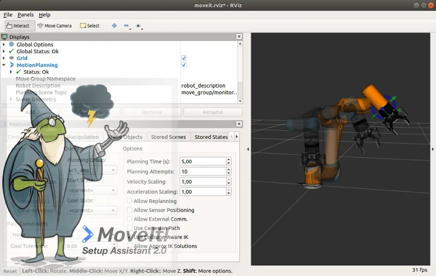

HUMAN AI ROBOTICS
121
Moveit2
참고
모션플래닝
Moveit, 모션 플래닝 프레임워크
로봇이 시작점에서 특정 원하는 위치로 정확히 어떻게 이동하는지와 관련
도중에 장애물을 피하고 제약 조건을 처리하는 것이 포함
그 외에도 잡기와 지각과 같은 조작의 다른 측면에 대한 지원을 제공
먼저 로봇과 그리퍼를 포함한 URDF를 하나 가져와야 합니다.
~/catkin_ws/src$ git clone -b <distro>-devel https://github.com/ros-industrial/universal_robot.git
~/catkin_ws/src$ git clone https://github.com/filesmuggler/robotiq.git
wget https://raw.githubusercontent.com/utecrobotics/ur5/master/ur5_description/urdf/ur5_robotiq85_gripper.urdf.xacro

HUMAN AI ROBOTICS
122
Moveit2
참고
MOVEIT2
방금 다운로드한 ur5_robotiq85_gripper.urdf.xacro 파일의 4번째 줄을 수정하여 ur_description 패키지 내부
의 URDF 파일을 검색하도록 합니다.
<xacro:include filename="$(find ur_description)/urdf/ur5_joint_limited_robot.urdf.xacro" /> 
이제 로봇과 그리퍼 모두의 컨트롤러 인터페이스를 수정해야 합니다. 둘 다 처음에는 PositionJointInterface로 구
성되어 있습니다. 저는 해당 인터페이스에 문제가 있어서 EffortJointInterface로 변경했습니다. 수정해야 할 내용
은 다음과 같습니다.
먼저 robotiq_description/urdf/robotiq_85_gripper.transmission.xacro 의 robotiq 저장소 내부에서 9번째 줄과 14번째 
줄을 다음과 같이 변경해야 합니다.
<hardwareInterface>hardware_interface/EffortJointInterface</hardwareInterface> 
<hardwareInterface>hardware_interface/EffortJointInterface</hardwareInterface> 
둘째, ur_description/urdf/ur5_joint_limited_robot.urdf.xacro 의 universal_robots 저장소에서 5번째 줄을 다
음과 같이 수정해야 합니다.
<xacro:arg name="transmission_hw_interface" default="hardware_interface/EffortJointInterface"/>

HUMAN AI ROBOTICS
123
Moveit2
참고
moveit setup assistant
Moveit 설정 어시스턴트를 사용하여 Moveit 구성 패키지.
$ ros2 launch moveit_setup_assistant setup_assistant.launch

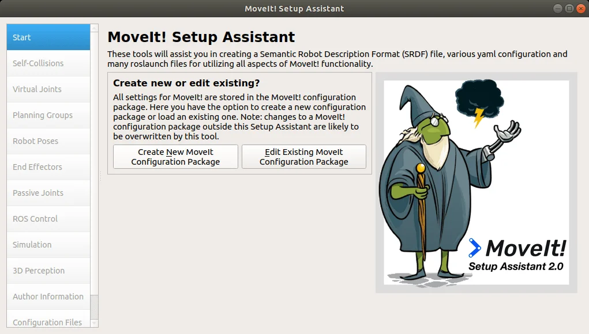

HUMAN AI ROBOTICS
124
Moveit2
참고
moveit setup assistant
Create New Moveit Configuration Package를 선택하면 파일 시스템에서 URDF를 선택. 
universal_robot 저장소에서 /universal_robot/ur_description/urdf/ur5_robotiq85_gripper.urdf.xacro를 선택하고 
Load Files를 클릭 . 
완료되면 다음과 같은 성공 메시지가 표시

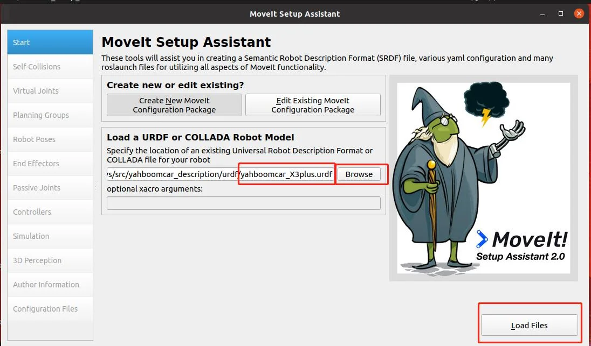

HUMAN AI ROBOTICS
125
Moveit2
참고
moveit setup assistant
Self-Collisions를 선택합니다 . 
설정을 그대로 두고 Generate Collision Matrix를 클릭
Moveit이 모션 플래닝을 할 때, 이동 중에 로봇 부품(링크) 간에 충돌이 발생하는지 확인
Moveit은 물리적으로 서로 충돌할 수 없는 링크를 찾아 계산에서 제외하려함.

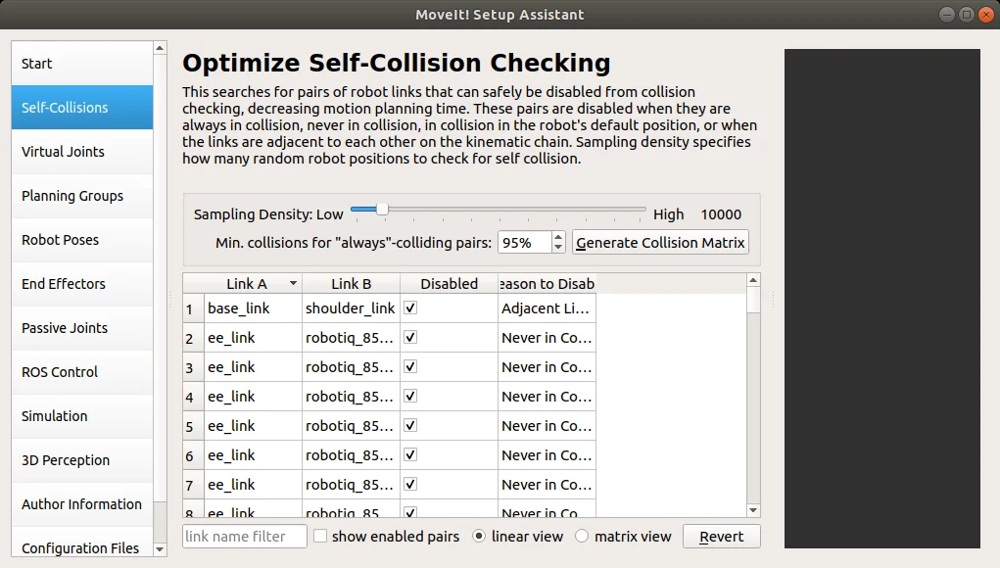

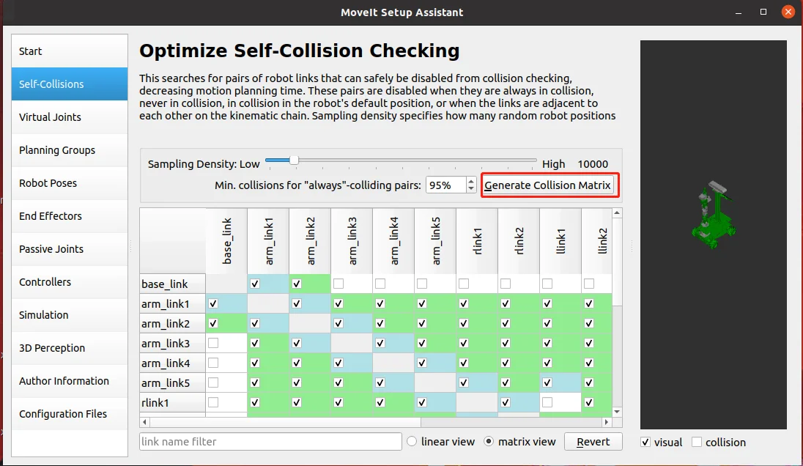

HUMAN AI ROBOTICS
126
Moveit2
참고
moveit setup assistant
가상 조인트 
로봇을 환경에 고정하기 위해 가상의 고정 조인트를 정의
가상 조인트 추가를 클릭하고 그림과 같이 빈칸을 채웁니다.

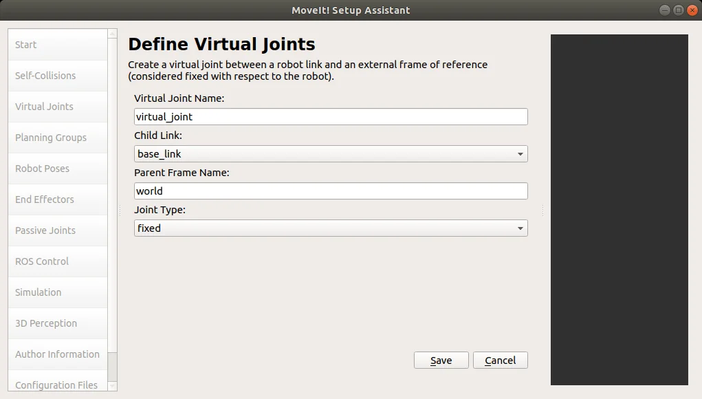

HUMAN AI ROBOTICS
127
Moveit2
참고
moveit setup assistant
모션 계획 그룹 생성
Planning Group은 MoveIt의 핵심 부분, [그룹 추가]를 클릭하여 플래닝 그룹 추가.
그룹 이름: 그룹 이름을 생성하고 [arm_group]으로 설정.
운동학 솔버: 여기서 우리는 [kdl]을 선택.
MoveIt은 다양한 샘플링 기반 및 최적화 기반 플래닝 알고리즘 지원
주로 OMPL (Open Motion Planning Library)를 통해 제공
RRT (Rapidly-exploring Random Tree)
샘플링 기반 플래닝 알고리즘 중 하나로, 높은 차원의 공간에서 빠르게 경
로를 찾기 위해 사용
PRM (Probabilistic Roadmap Method)
두 단계로 나뉘어 실행되는 샘플링 기반 플래닝 알고리즘입니다. 
로봇이 움직일 수 있는 공간에서 미리 샘플링한 지점들로 로드맵(그래프)
을 구성한 후, 그 로드맵을 사용
STOMP: 무작위 샘플링을 사용해 장애물 회피 경로 생성.

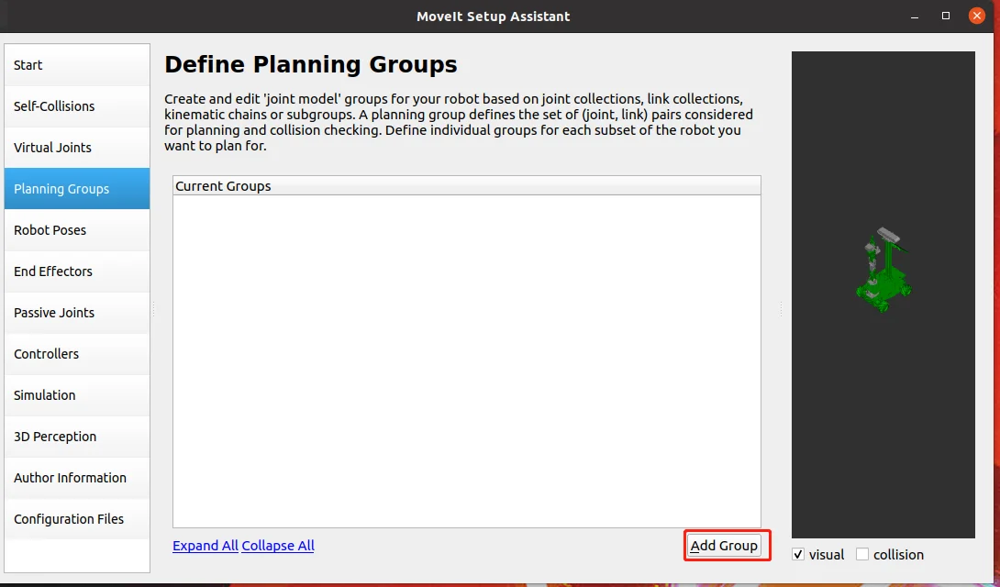

HUMAN AI ROBOTICS
128
Moveit2
참고
moveit setup assistant
•KDL, The Kinematics and Dynamics Library를 선택
•6개 이상의 자유도를 가진 단일 체인 기계 구조의 정방향 및 역방향 운동학 문제를 
잘 풀 수 있는 운동학 및 동역학 라이브러리
•물론 SRV나 IK_FAST와 같은 다른 IK 솔버를 사용할 수도 있고, 새로운 솔버를 직접 
개발하여 삽입할 수 있음
•Kin. Search Resolution: 조인트 공간의 샘플링 밀도
•Kin. Search TImeout : 해결 시간. 장비 성능이 미흡하거나 실제 적용 과정에서 지정
된 시간 내에 해결이 되지 않을 경우 시간을 늘릴 수 있다. 예를 들어 [0.1], [0.01]로 
설정
•그룹 기본 플래너: RRT 또는 없음을 선택
운동학 풀이 도구, 이것은 정방향 운동학(Forward Kinematics)과 역방향 운동학(IK)을 푸는 것
[조인트 추가]를 클릭하여 조인트를 추가

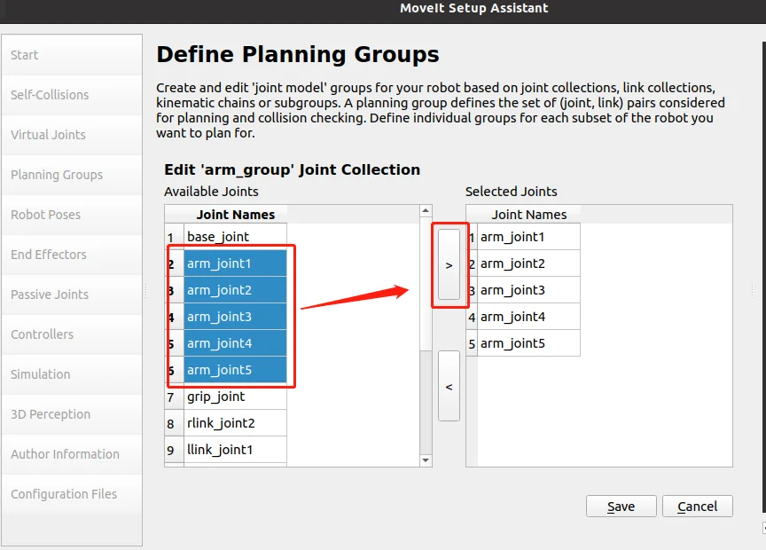

HUMAN AI ROBOTICS
129
Moveit2
참고
moveit setup assistant
모션 플렌이 필요한 조인트 선택

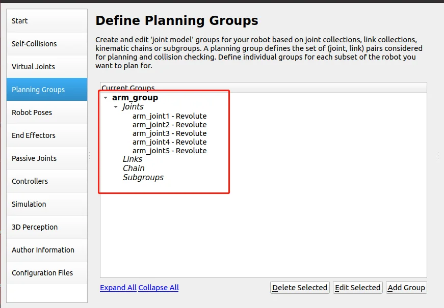

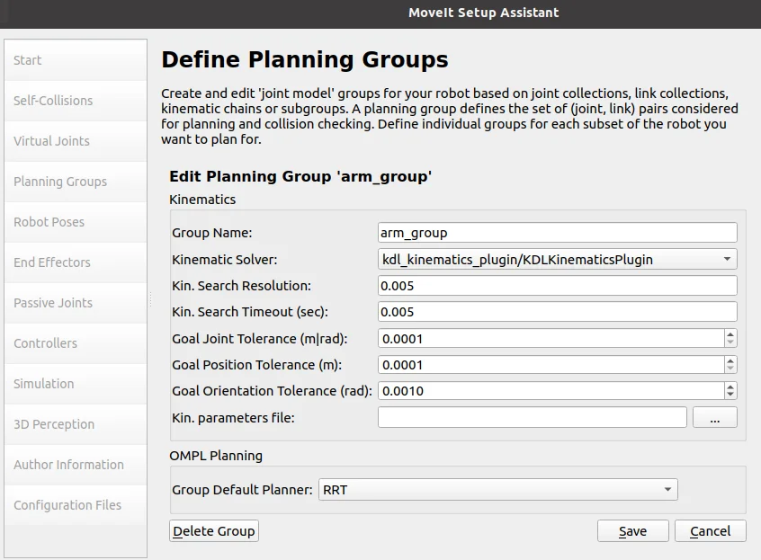

HUMAN AI ROBOTICS
130
Moveit2
참고
moveit setup assistant
그리퍼 계획 그룹 추가
Add Group을 클릭하여 그리퍼를 정의. 
그룹 이름으로 gripper를 입력하고, Kinematic Solver의 경우 None을 그대로 두고 Add Joints를 클릭. 
robotiq_85_left_knuckle_joint를 선택하고 오른쪽을 가리키는 화살표를 클릭하여 조인트가 오른쪽 열 추가

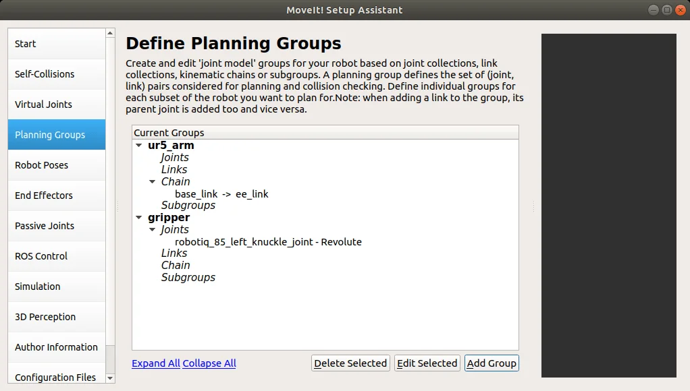

HUMAN AI ROBOTICS
131
Moveit2
참고
moveit setup assistant
로봇 포즈
필수는 아니지만 기본 포즈를 정의하면 나중에 시간을 절약할 수 있음. 
조인트 값을 설정하여 "홈" 포즈를 만듭니다. 아래 그림은 ur5에 유용한 홈 포즈를 보추가
•elbow_joint: 1.5447
•shoulder_lift_joint: -1.5447
•shoulder_pan_joint: 0.0
•wrist_1_joint: -1.5794
•wrist_2_joint: -1.5794
•wrist_3_joint: 0.0

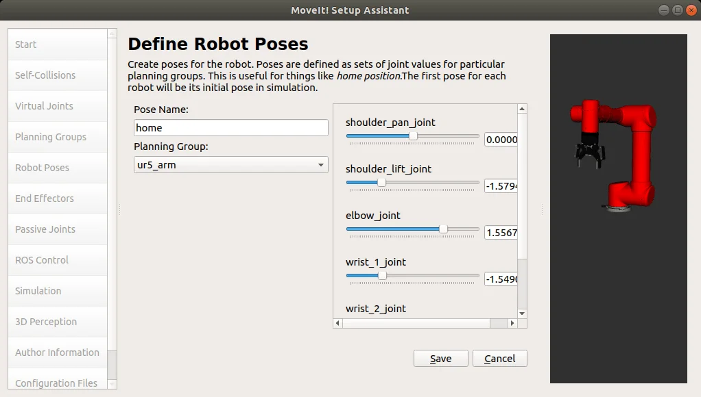

HUMAN AI ROBOTICS
132
Moveit2
참고
moveit setup assistant
로봇 포즈
그리퍼를 정의하려면 End Effectors 탭으로 전환하고 Add End Effector를 클릭
이름을 robotiq_gripper로 지정하고 아래 그림과 같이 Group, Parent Link, Parent Group을 선택

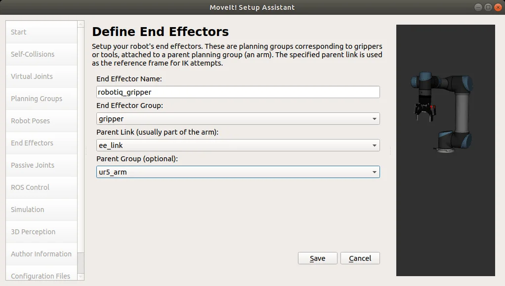

HUMAN AI ROBOTICS
133
Moveit2
참고
moveit setup assistant
수동 조인트

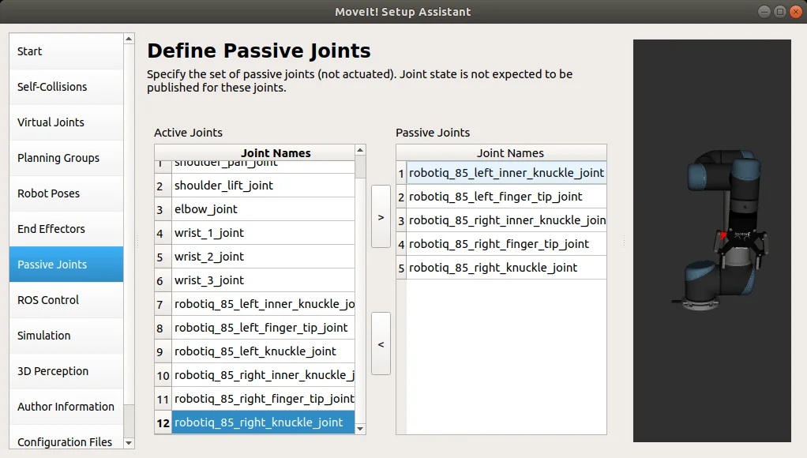

HUMAN AI ROBOTICS
134
Moveit2
참고
moveit setup assistant
ROS Control
Ros_control은 조인트에 대한 컨트롤러를 쉽게 설정할 수 있는 패키지
설정 어시스턴트에서 각 계획 그룹에 대해 FollowJointsTrajctory 컨트롤러 자동 추가 클릭

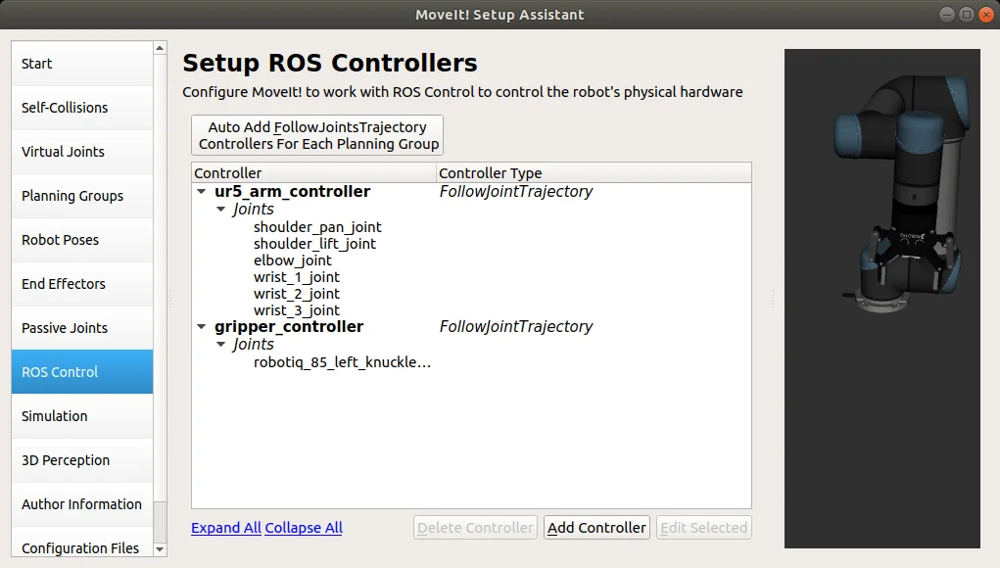

HUMAN AI ROBOTICS
135
Moveit2
참고
moveit setup assistant
시뮬레이션
Moveit은 Gazebo 시뮬레이션에서 로봇을 실행하는 데 사용할 수 있는 URDF를 생성

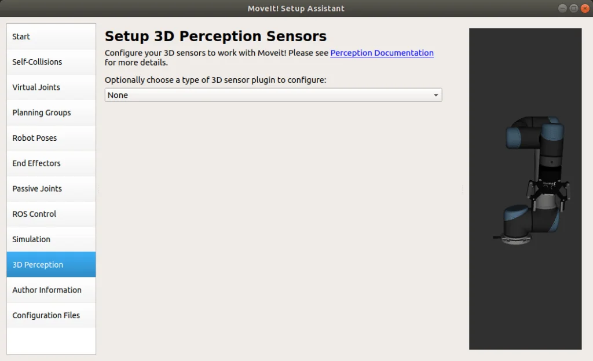

HUMAN AI ROBOTICS
136
주제2.1 기초
참고
moveit setup assistant
3D Preception Pane은 3D 센서 데이터를 사용하고자 하는 경우 매개변수를 설정하기 위한 것
Configuration Files 저장

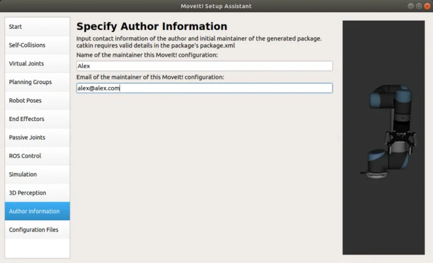

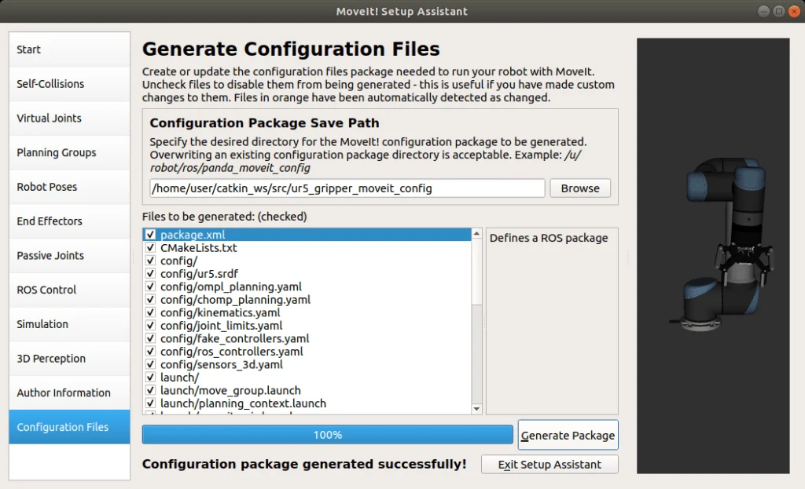

HUMAN AI ROBOTICS
137
MoveItのコンセプト
「MoveIt」のコンセプトの概要をまとめました。
1. MoveItのシステムアーキテクチャ
下図は、「MoveIt」のシステムアーキテクチャです。「move_group」と呼ばれるノードがアーキテクチャの
中心となります。このノードは、ユーザーが使用できるROSのアクションとサービスを提供します。
move_groupは、次の3つのインタフェースで利用できます。
https://docs.ros.org/en/noetic/api/moveit_commander/ht
ml/classmoveit__commander_1_1move__group_1_1Move
GroupCommander.html

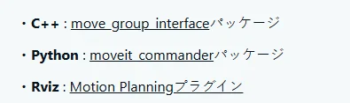

HUMAN AI ROBOTICS
138
MoveItのコンセプト
「MoveIt」のコンセプトの概要をまとめました。

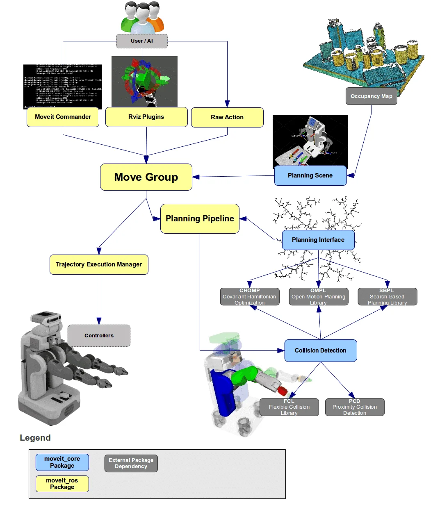

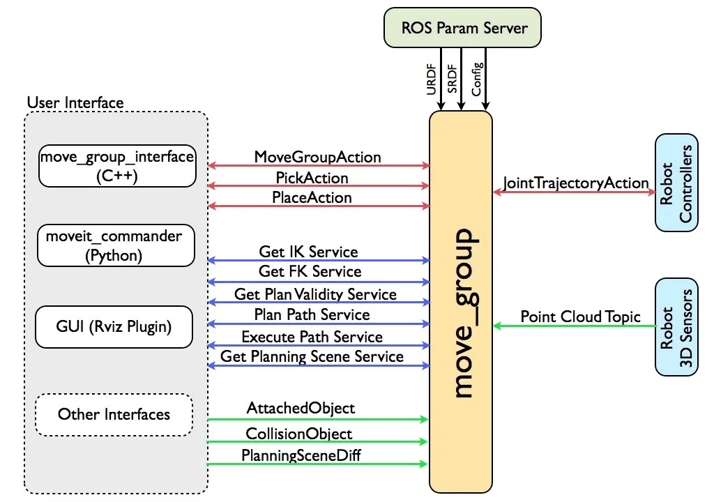

HUMAN AI ROBOTICS
139
MoveItのコンセプト
「MoveIt」のコンセプトの概要をまとめました。

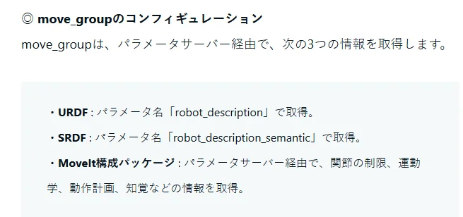

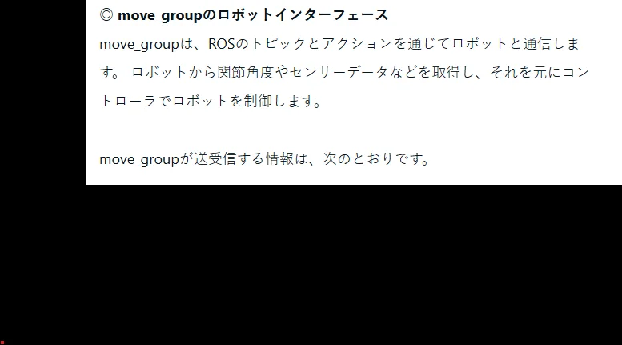

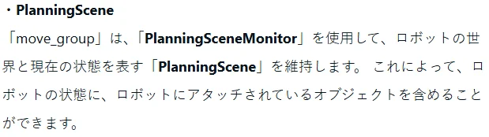

HUMAN AI ROBOTICS
140
Moveit2
프로그램활용
turtlebot3_manipulation.srdf.xacro 파일은 Turtlebot3 Manipulation의 시맨틱 로봇 설명(Semantic Robot 
Description)을 정의하는 파일입니다. xacro 포맷을 사용하여 SRDF를 생성합니다.
<?xml version="1.0" encoding="UTF-8"?>
<robot name="turtlebot3_manipulation">
    <!-- GROUPS: 로봇의 조인트와 링크들을 그룹으로 정의 -->
    <group name="arm">
        <chain base_link="link1" tip_link="end_effector_link" />
    </group>
    <group name="gripper">
        <link name="gripper_link"/>
        <link name="gripper_link_sub"/>
    </group>
    <!-- GROUP STATES: 미리 정의된 로봇 포즈들 -->
    <group_state name="home" group="arm">
        <joint name="joint1" value="0"/>
        <joint name="joint2" value="-1.57"/>
        <joint name="joint3" value="1.57"/>
        <joint name="joint4" value="0"/>
    </group_state>
    <!-- END EFFECTOR: 그리퍼 정의 -->
    <end_effector name="gripper" parent_link="end_effector_link" 
group="gripper"/>
    <!-- DISABLE COLLISIONS: 충돌 체크에서 제외할 링크 쌍들 -->
    <disable_collisions link1="base_link" link2="link1" reason="Adjacent"/>
    <disable_collisions link1="link1" link2="link2" reason="Adjacent"/>
    <!-- 추가적인 충돌 비활성화 정의들... -->
<group_state name="home" group="arm">
    <joint name="joint1" value="0"/>     <!-- 첫 번째 관절: 0 라디안 -->
    <joint name="joint2" value="-1.57"/> <!-- 두 번째 관절: -1.57 라디안 (약 -90도) -->
    <joint name="joint3" value="1.57"/>  <!-- 세 번째 관절: 1.57 라디안 (약 90도) -->
    <joint name="joint4" value="0"/>     <!-- 네 번째 관절: 0 라디안 -->
</group_state>
</robot>
# Python에서 사용 예
move_group.set_named_target("home")  # home 포즈로 
이동 명령

HUMAN AI ROBOTICS
141
Moveit2
프로그램활용
1. SRDF 파일 수정
(src/turtlebot3_manipulation/turtlebot3_manipulation_moveit_config/config/turtlebot3_manipulation.sfdf)
<robot name="your_robot">
  <!-- 기존 group states -->
  <group_state name="home" group="your_arm_group">
    <joint name="joint1" value="0.0" />
    <joint name="joint2" value="0.0" />
    <joint name="joint3" value="0.0" />
    <!-- 필요한 모든 joint들의 값을 지정 -->
  </group_state>
</robot>

HUMAN AI ROBOTICS
142
Moveit2
프로그램활용
# move_group.launch.py 또는 유사한 launch 파일
from moveit_configs_utils import MoveItConfigsBuilder
def generate_launch_description():
    moveit_config = MoveItConfigsBuilder("your_robot").to_moveit_configs()
    # SRDF가 자동으로 로드됩니다
3.실행 및 확인
•RViz2를 실행하면 Motion Planning 패널의 "Select Start State" 드롭다운 메뉴에서 새로 추가한 
"home" 상태를 선택할 수 있습니다.
주의사항:
•SRDF 파일을 수정한 후에는 로봇 설정을 다시 빌드해야 할 수 있습니다
•joint 값들은 로봇의 실제 제한값 내에 있어야 합니다
•group name은 반드시 SRDF에 정의된 planning group과 일치해야 합니다
RViz2에서 직접 상태를 저장하려면:
1.로봇을 원하는 포즈로 이동
2."Planning" 탭에서 "Save Current State"를 선택
3.이름을 지정하고 저장
2. launch 파일에서 로드

HUMAN AI ROBOTICS
143
Moveit2
참고
Move_group.go
#!/usr/bin/env python3
import rclpy
from rclpy.node import Node
from moveit_commander import MoveGroupCommander, RobotCommander, PlanningSceneInterface
from moveit_commander import roscpp_initialize, roscpp_shutdown
class RobotControlNode(Node):
    def __init__(self):
        super().__init__('robot_control_node')
        
        # MoveIt 초기화
        roscpp_initialize([])
        
        # Robot Commander 생성
        self.robot = RobotCommander()
        
        # Planning Scene Interface 생성
        self.scene = PlanningSceneInterface()
        
        # Move Group Commander 생성 (your_planning_group은 SRDF에 정의된 그룹 이름)
        self.move_group = MoveGroupCommander("your_planning_group")
        
    def go_to_named_pose(self, pose_name):
        # 저장된 포즈로 이동
        self.move_group.set_named_target(pose_name)
        success = self.move_group.go(wait=True)
        self.move_group.stop()
        return success
        
    def plan_cartesian_path(self, waypoints):
        # 카테시안 경로 계획
        (plan, fraction) = self.move_group.compute_cartesian_path(
            waypoints,   # waypoints to follow
            0.01,        # eef_step
            0.0)         # jump_threshold
        return plan, fraction
def main():
    rclpy.init()
    
    robot_control = RobotControlNode()
    
    # 예제: 'home' 포즈로 이동
    robot_control.go_to_named_pose("home")
    
    # 노드 실행
    rclpy.spin(robot_control)
    
    # 종료
    robot_control.destroy_node()
    rclpy.shutdown()
if __name__ == '__main__':
    main()

HUMAN AI ROBOTICS
144
Moveit2
참고
Pick and Place
#!/usr/bin/env python3
import rclpy
from rclpy.node import Node
from geometry_msgs.msg import Pose, PoseStamped
from moveit_commander import MoveGroupCommander, RobotCommander, PlanningSceneInterface
from moveit_commander import roscpp_initialize, roscpp_shutdown
import sys
from tf2_ros import Buffer, TransformListener
from rclpy.duration import Duration
import numpy as np
class PickPlaceNode(Node):
    def __init__(self):
        super().__init__('pick_place_node')
        
        # Initialize MoveIt
        roscpp_initialize(sys.argv)
        
        # Setup TF buffer
        self.tf_buffer = Buffer()
        self.tf_listener = TransformListener(self.tf_buffer, self)
        
        # Initialize robot commander
        self.robot = RobotCommander()
        
        # Initialize planning scene
        self.scene = PlanningSceneInterface()
        
        # Initialize move group for arm
        self.arm_group = MoveGroupCommander("arm")
        
        # Initialize move group for gripper
        self.gripper_group = MoveGroupCommander("gripper")
        
        # Wait for scene to get updated
        self.get_logger().info("Waiting for planning scene...")
        rclpy.sleep(2.0)
        
        # Add table to planning scene
        self.add_table_to_scene()
        
        # Add object to planning scene
        self.add_object_to_scene()
        
        # Pick and place demo
        self.get_logger().info("Starting pick and place demo...")
        self.timer = self.create_timer(5.0, self.execute_pick_and_place)
    
    def add_table_to_scene(self):
        table_pose = PoseStamped()
        table_pose.header.frame_id = "base_link"
        table_pose.pose.position.x = 0.5
        table_pose.pose.position.y = 0.0
        table_pose.pose.position.z = -0.07  # Half the height of the table
        self.scene.add_box("table", table_pose, size=(0.6, 0.6, 0.02))
        self.get_logger().info("Added table to planning scene")
    
def add_object_to_scene(self):
        object_pose = PoseStamped()
        object_pose.header.frame_id = "base_link"
        object_pose.pose.position.x = 0.4
        object_pose.pose.position.y = 0.0
        object_pose.pose.position.z = 0.02  # On the table
        self.scene.add_box("object", object_pose, size=(0.05, 0.05, 0.05))
        self.get_logger().info("Added object to planning scene")
    
    def open_gripper(self):
        self.get_logger().info("Opening gripper")
        # Set joint values for open gripper position
        # Adjust these values based on your gripper
        self.gripper_group.set_joint_value_target([0.01, 0.01])
        self.gripper_group.go(wait=True)
        self.gripper_group.stop()
    
    def close_gripper(self):
        self.get_logger().info("Closing gripper")
        # Set joint values for closed gripper position
        # Adjust these values based on your gripper
        self.gripper_group.set_joint_value_target([0.0, 0.0])
        self.gripper_group.go(wait=True)
        self.gripper_group.stop()
    
    def move_arm_to_pose(self, pose):
        self.get_logger().info(f"Moving arm to pose: {pose}")
        self.arm_group.set_pose_target(pose)
        success = self.arm_group.go(wait=True)
        self.arm_group.stop()
        self.arm_group.clear_pose_targets()
        return success
    
    def move_to_home(self):
        self.get_logger().info("Moving to home position")
        self.arm_group.set_named_target("home")
        self.arm_group.go(wait=True)
        self.arm_group.stop()

HUMAN AI ROBOTICS
145
Moveit2
참고
Pick and Place
def execute_pick_and_place(self):
        # Cancel the timer so this only runs once
        self.timer.cancel()
        
        try:
            # 1. Move to home position
            self.move_to_home()
            
            # 2. Open gripper
            self.open_gripper()
            
            # 3. Get object pose
            object_pose = self.get_object_pose()
            
            # 4. Move to pre-grasp position (slightly above object)
            pre_grasp_pose = Pose()
            pre_grasp_pose.position.x = object_pose.position.x
            pre_grasp_pose.position.y = object_pose.position.y
            pre_grasp_pose.position.z = object_pose.position.z + 0.15  # Above object
            pre_grasp_pose.orientation = object_pose.orientation
            self.move_arm_to_pose(pre_grasp_pose)
            
            # 5. Move to grasp position
            grasp_pose = Pose()
            grasp_pose.position.x = object_pose.position.x
            grasp_pose.position.y = object_pose.position.y
            grasp_pose.position.z = object_pose.position.z + 0.05  # Adjust based on object height
            grasp_pose.orientation = object_pose.orientation
            self.move_arm_to_pose(grasp_pose)
            
            # 6. Close gripper
            self.close_gripper()
            
# 7. Attach object to gripper
            self.scene.attach_box("end_effector_link", "object")
            
            # 8. Move back to pre-grasp
            self.move_arm_to_pose(pre_grasp_pose)
            
            # 9. Move to place position
            place_pose = Pose()
            place_pose.position.x = 0.3
            place_pose.position.y = 0.3
            place_pose.position.z = 0.15  # Above table
            place_pose.orientation = object_pose.orientation
            self.move_arm_to_pose(place_pose)
            
            # 10. Lower to place position
            place_pose.position.z = 0.05  # On table
            self.move_arm_to_pose(place_pose)
            
            # 11. Open gripper
            self.open_gripper()
            
            # 12. Detach object
            self.scene.remove_attached_object("end_effector_link", "object")
            
            # 13. Move back up
            place_pose.position.z = 0.15
            self.move_arm_to_pose(place_pose)
            
            # 14. Return to home
            self.move_to_home()
            
            self.get_logger().info("Pick and place operation completed successfully")
            
        except Exception as e:
            self.get_logger().error(f"Error in pick and place: {str(e)}")

HUMAN AI ROBOTICS
146
Moveit2
참고
Pick and Place
def main(args=None):
    rclpy.init(args=args)
    
    pick_place_node = PickPlaceNode()
    
    rclpy.spin(pick_place_node)
    
    pick_place_node.destroy_node()
    rclpy.shutdown()
if __name__ == '__main__':
    main()
    def get_object_pose(self):
        # In a real scenario, you would get the object pose from perception
        # Here, we'll use the known position from our scene
        object_pose = Pose()
        object_pose.position.x = 0.4
        object_pose.position.y = 0.0
        object_pose.position.z = 0.02
        
        # Set a valid orientation for grasping
        object_pose.orientation.x = 0.0
        object_pose.orientation.y = 0.0
        object_pose.orientation.z = 0.0
        object_pose.orientation.w = 1.0
        
        return object_pose

HUMAN AI ROBOTICS
147
주제2.1 기초
참고
추가자료

HUMAN AI ROBOTICS
148
주제2.1 기초
참고
RVIZ2 Display 기능설명
1. Global options
Indicates the name of the frame used as a reference for all the other frames. 
You can select every frame available in the combo box. 
map or odom are the best choices.
The maximum frequency used to update the 3D view. 
30 or 60 FPS are good values. 
Available computational power should guide your decision.
Fixed frame: 
Frame rate:

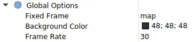

HUMAN AI ROBOTICS
149
주제2.1 기초
참고
RVIZ2 Display 기능설명
2. Grid
Reference frame: The frame used as a reference for the grid coordinates (normally: <fixed_frame>)
Plane cell count: The size of the grid in cells
Normal cell count: The number of cells in the direction normal to the grid plane (normally: 0)
Cell size: Dimensions in meters of each grid cell
Plane: The two axes that identify the grid plane

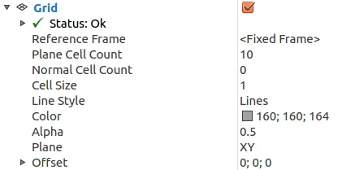

HUMAN AI ROBOTICS
150
주제2.1 기초
참고
RVIZ2 Display 기능설명
3. Robot model 
This plugin allows you to visualize the Robot Model according to its description from the URDF model.
Visual enabled: Enable/disable the 3D visualization of the model
Description Source: You can choose between File and Topic. 
At the moment of writing this guide the Topic option is not working as expected, so File is the 
right option
Description File: the URDF file that contains the Robot Description zed.urdf or zedm.urdf.

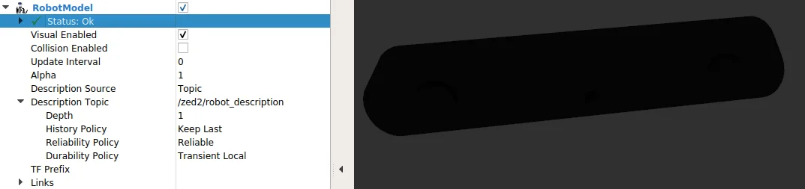

HUMAN AI ROBOTICS
151
주제2.1 기초
참고
RVIZ2 Display 기능설명
4. TF
This plugin allows you to visualize the position and orientation of all frames that compose the TF Hierarchy.
Show names: Enable/disable the 3D visualization of link names
Show axes: Enable/disable the 3D visualization of the axes of the frames
Show arrows: Enable/disable the 3D visualization of the arrows that connect the 
various frames
Marker Scale: Used to rescale all the TF objects to let them be more visible and less 
chaotic
Update interval: The update time in seconds. Leave at 0 to see each update

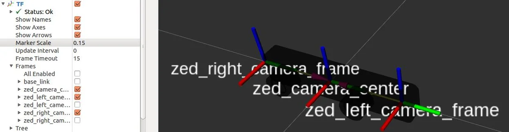

HUMAN AI ROBOTICS
152
주제2.1 기초
참고
URDF - LINK
<link>는 시각화 <visual>, 충돌 <collision> , 관성<inertial>태그로 구성되어 있다.
common tag
<origin> - 원점 좌표
좌표는 xyz 좌표계를 통해 로봇의 위치를 3차원 공간 상에서 표현을 하고 ryz 오일러 각을 통해 로봇의 방향
을 표현한다
단위는 xyz (meter), rpy (radian)을 사용한다
<visual>
<geometry> 태그는 origin 좌표 중심으로 표시 범위와 모양과 크기를 적는다
모델의 모양 입력은 box, cylinder, sphere 형태를 기본으로 제공한다
표현하기 어려운 모델인 경우에는 STL, DAE등의 CAD 파일을 입력할 수도 있다

HUMAN AI ROBOTICS
153
주제2.1 기초
참고
URDF - LINK
<inertial>
물리적 속성인 질량과 관성 텐서 (inertial tensor) 값을 지정
<mass> 태그는 링크의 무게 (mass, 단위: kg)
<inertia> 태그는 관성 모멘트 (moments of inertia, 단위:kg·m^2)는 3x3 회전 관성 행렬로 정의.
 대칭이라서 아래 밑줄친 것만 정의를 한다
ixx 
ixy 
ixz
ixy 
iyy 
iyz
ixz 
iyz 
izz
<collision>
<collision> 태그에는 링크의 간섭 범위를 나타내는 정보를 입력
<origin> 와 <geometry> 태그는 위에서 언급한 내용과 동일한데 표시 범위가 아닌 간섭 범위
로 <visual> 태그의 표시 범위보다 더 크게하여 안전을 더 고려할 수도 있다

HUMAN AI ROBOTICS
154
주제2.1 기초
참고
URDF - LINK
<material> 태그는 링크의 색상(color)이나 텍스처(texture)를 지정하는 데 사용
<rgba> 태그로 색상을 지정한다
빨강, 초록, 파랑에 해당하는 0.0 ~ 1.0 사이의 숫자를 각각 기입하여 설정
마지막 숫자는 투명도(알파)로 0.0 ~ 1.0 값을 가지며 1.0 이면 투명 옵션을 사용하지 않은 고유 색상
을 그대로 표시하는 상태를 의미
<texture> 텍스쳐는 파일(ex.webp)로 지정

HUMAN AI ROBOTICS
155
주제2.1 기초
참고
센서정보시각화- IMU
AHRS는 Attitude and Heading Reference System의 약자로, 세 축으로 나타낼 수 있는 센서로 이루어져 있
어 Roll, Pitch, Yaw의 정보를 수집하는 센서이다. 이는 각각 3축의 자이로스코프(각속도계), 가속도계, 자
기계 센서가 MEMS(microelectromechanical systems)로 실리콘 기판 위에 집적화된 것이다.
3축 gyroscope(16bit), 3축 acclerometer(16bit), 3축 magnetometer(13bit)로 이루어진 AHRS로, USB 포트에 꽂
아 사용한다.
해당 기기는 축으로 NED 타입을 사용하여, IMU에선 자북에 대해 x(north), y(east), z(down)으로 표기한다.

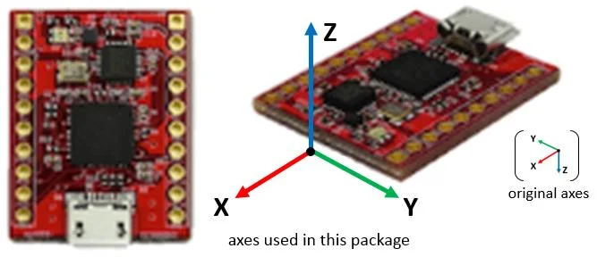

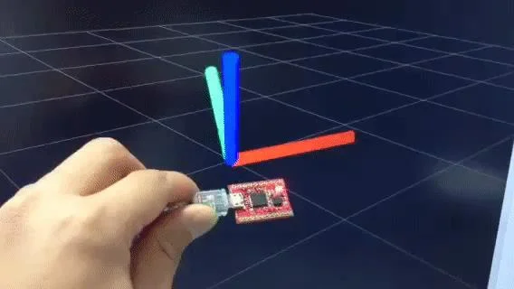

HUMAN AI ROBOTICS
156
주제2.1 기초
참고
센서정보시각화- IMU
(1) 설치
GitHub에서 myAHRS의 드라이버 패키지를 내려받아 설치.
$ cd ~/catkin_ws/src 
$ git clone https://github.com/robotpilot/myahrs_driver.git 
$ catkin_make
(2) 작동
[ 1 ] USB로 기기를 컴퓨터에 연결한다.
[ 2 ] USB 포트 이름을 확인한다. 
보통 허브 없이 바로 USB-5pin 케이블로 컴퓨터에 연결하면 ttyACM0로 뜬다.
$ ls /dev/tty*
[ 3 ] 기기에 실행 권한을 부여.
$ sudo chmod 777 /dev/tty*
[ 4 ] 기기를 작동시킨다. 
만약 포트 관련 에러가 난다면 myahrs_driver.launch 파일의 파라미터에서 
포트 이름을 위에서 조회한 이름(ttyACM1 등)으로 변경해주어야 한다.
$ roslaunch myahrs_driver myahrs_driver.launch # lauch 파일로, Rviz도 함께 실행.

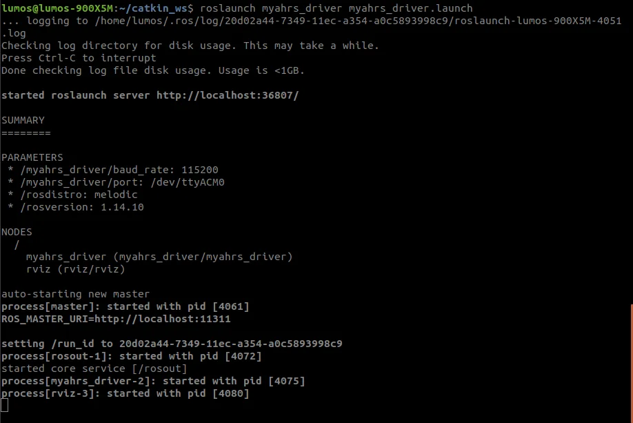

HUMAN AI ROBOTICS
157
주제2.1 기초
참고
센서정보시각화- IMU
Rviz로 축을 확인한다. Rviz는 launch 파일 실행과 동시에 함께 켜질 것이다. 
좌측에서 Axes, Imu의 체크박스를 각각 선택하면 아래 사진처럼 크게 분홍색 화살표가 보일 것이다. 
현재 IMU가 가리키고 있는 방향이다.

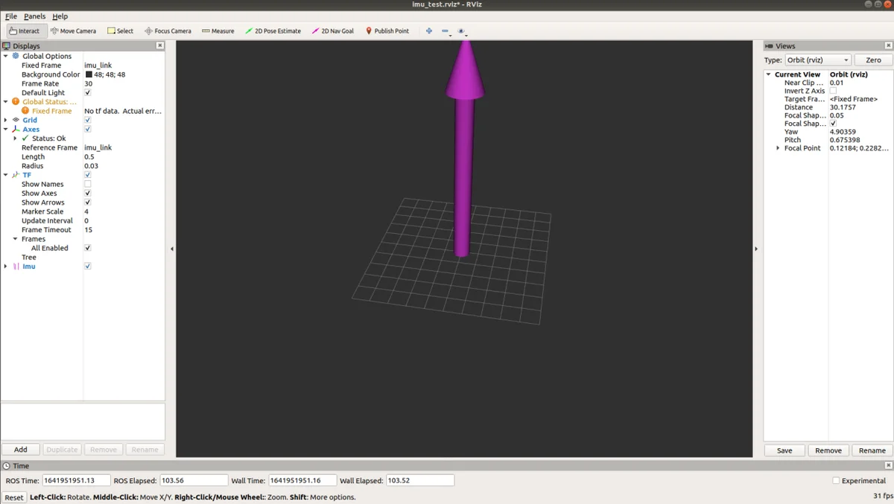

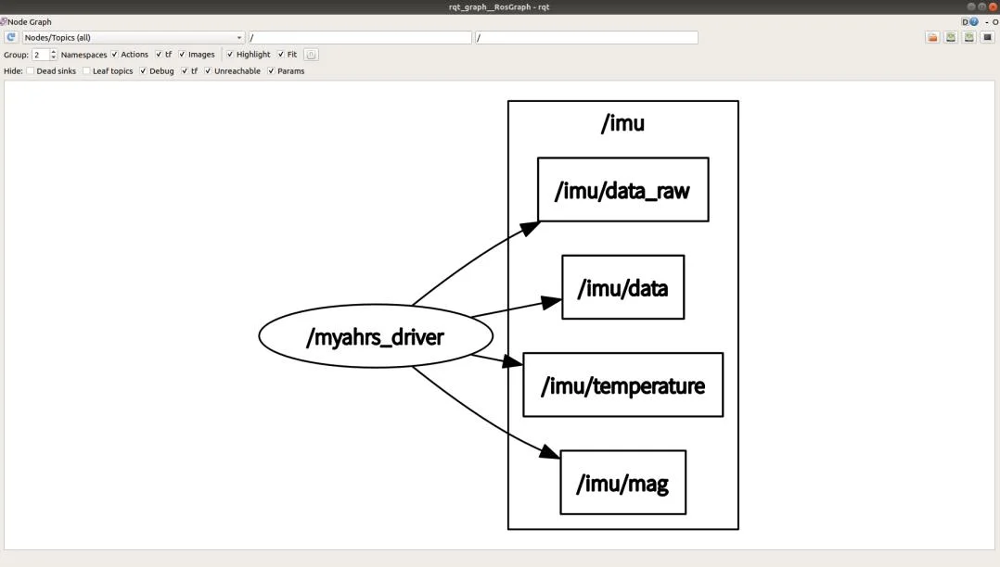

HUMAN AI ROBOTICS
158
주제2.1 기초
참고
센서정보시각화- IMU
IMU화살표가 너무 커서 축이 잘 보이지 않는다. Imu의 옵션에서 Alpha 값을 0.3 정도로 조정하면 축이 보일 것이다.

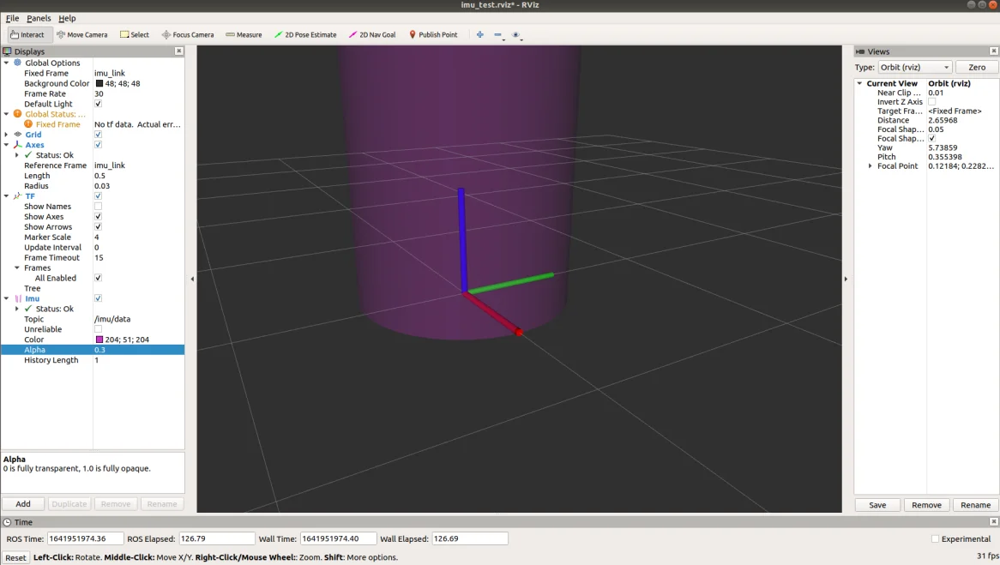

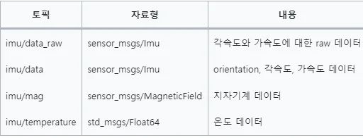

HUMAN AI ROBOTICS
159
주제2.1 기초
참고
센서정보시각화- 카메라
필요한 라이브러리 임포트
•rclpy: ROS 2의 Python 클라이언트 라이브러리 
•sensor_msgs.msg: 카메라 이미지를 위한 ROS 2 메시지 타입 
•cv_bridge: OpenCV 이미지와 ROS 이미지 메시지 간 변환을 위한 라이브러리 
•cv2: OpenCV 라이브러리
•__init__ 메서드: 
•create_publisher를 사용하여 'camera/image_raw' 토픽에 Image 메시지를 퍼블리시하는 퍼블리셔를 생성합니다. 
•create_timer를 사용하여 0.1초마다 (10Hz) timer_callback 메서드를 호출하는 타이머를 설정합니다. 
•CvBridge 객체를 생성하여 OpenCV 이미지와 ROS 메시지 간 변환을 준비합니다. 
•cv2.VideoCapture(0)로 기본 카메라를 엽니다.
•timer_callback 메서드: 
•cap.read()로 카메라에서 프레임을 읽습니다. 
•프레임 읽기에 성공하면, cv_bridge.cv2_to_imgmsg를 사용하여 OpenCV 이미지를 ROS Image 메시지로 변환합니다. 
•변환된 메시지를 퍼블리시합니다. 
•로그 메시지를 출력합니다. 
•__del__ 메서드: 
•객체가 삭제될 때 카메라 리소스를 해제합니다. 
•main 함수: 
•ROS 2 시스템을 초기화합니다. 
•CameraPublisher 노드를 생성하고 실행합니다. 
•노드가 종료되면 정리 작업을 수행합니다.
•CameraPublisher 클래스 정의: 
•ROS 2의 Node 클래스를 상속받아 새로운 노드를 정의합니다.

HUMAN AI ROBOTICS
160
주제2.1 기초
참고
센서정보시각화- 카메라
import rclpy
from rclpy.node import Node
from sensor_msgs.msg import Image
from cv_bridge import CvBridge
import cv2
class CameraPublisher(Node):
    def __init__(self):
        super().__init__('camera_publisher')
        self.publisher_ = self.create_publisher(Image, 'camera/image_raw', 10)
        self.timer = self.create_timer(0.1, self.timer_callback)  # 10Hz
        self.cv_bridge = CvBridge()
        self.cap = cv2.VideoCapture(0)  # 0은 기본 카메라를 의미합니다
    def timer_callback(self):
        ret, frame = self.cap.read()
        if ret:
            msg = self.cv_bridge.cv2_to_imgmsg(frame, "bgr8")
            self.publisher_.publish(msg)
            self.get_logger().info('Publishing camera frame')
    def __del__(self):
        self.cap.release()
def main(args=None):
    rclpy.init(args=args)
    camera_publisher = CameraPublisher()
    rclpy.spin(camera_publisher)
    camera_publisher.destroy_node()
    rclpy.shutdown()
if __name__ == '__main__':
    main()
publisher (ROS2 humble)

HUMAN AI ROBOTICS
161
주제2.1 기초
참고
센서정보시각화- 카메라
subscriber (ROS2 humble)
import rclpy
from rclpy.node import Node
from rclpy.qos import QoSProfile
from sensor_msgs.msg import CompressedImage
import numpy as np
import cv2
from cv_bridge import CvBridge
import base64
# 이미지 메시지 데이터를 어레이 형태로 변환
bridge = CvBridge() 
class ImageSubscriber(Node) :
  def __init__(self) :
    super().__init__('image_sub')
    qos = QoSProfile(depth=10)
    self.image_sub = self.create_subscription(
      CompressedImage, # 임포트 된 메시지 타입 
      '/camera/image/compressed', # 토픽리스트에서 조회한 토픽 주소
      self.image_callback, # 정의한 콜백함수
      qos)
    self.image = np.empty(shape=[1])
  def image_callback(self, msg) :
    img = bridge.compressed_imgmsg_to_cv2(msg)
    cv2.imshow('ros_img', img)
    cv2.waitKey(100)
     
def main(args=None) :
  rclpy.init(args=args)
  node = ImageSubscriber()
  try :
    rclpy.spin(node)
  except KeyboardInterrupt :
    node.get_logger().info('Stopped by Keyboard')
  finally :
    node.destroy_node()
    rclpy.shutdown()
if __name__ == '__main__' :
  main()
https://github.com/ANI717/ros2_camera_publish

HUMAN AI ROBOTICS
162
SLAM
참고
라이다센서실습

HUMAN AI ROBOTICS
163
라이다센서실습
참고
YDLIDAR 라이다설치
ROS2 드라이버 설치
$ cd ~/ros2_ws/src/ 
$ git clone https://github.com/YDLIDAR/YDLidar-SDK.git 
$ git clone https://github.com/YDLIDAR/ydlidar_ros2_driver.git
$ cd ~/ros2_ws 
$ colcon build --symlink-install

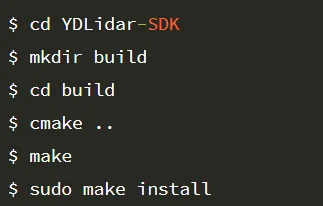

HUMAN AI ROBOTICS
164
라이다센서실습
참고
YDLIDAR 라이다실행
$ ros2 run ydlidar_ros2_driver ydlidar_ros2_driver_node --ros-args --param port:=/dev/ttyUSB0 --ros-
args --param frame_id:=laser_frame --ros-args --param baudrate:=128000 --ros-args --param 
lidar_type:=1 --ros-args --param device_type:=0 --ros-args --param sample_rate:=9 --ros-args --param 
abnormal_check_count:=4 --ros-args --param resolution_fixed:=true --ros-args --param reversion:=true 
--ros-args --param inverted:=true --ros-args --param auto_reconnect:=true --ros-args --param 
isSingleChannel:=false --ros-args --param intensity:=false --ros-args --param 
support_motor_dtr:=true --ros-args --param angle_max:=180.0 --ros-args --param angle_min:=-180.0 --
ros-args --param range_max:=64.0 --ros-args --param range_min:=0.01 --ros-args --param 
frequency:=10.0 --ros-args --param invalid_range_is_inf:=false
$ cd ~/ros2_ws/src/ 
$ git clone https://github.com/mechasolution/ydlidar_x4_example.git

HUMAN AI ROBOTICS
165
라이다센서실습
참고
센서정보시각화- 라이다
rviz2

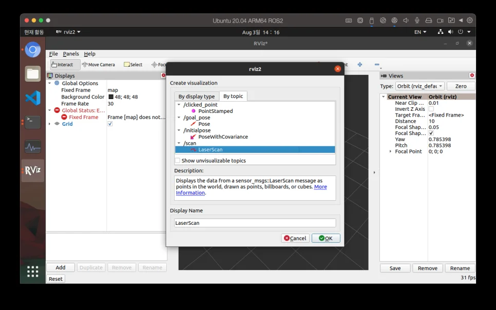

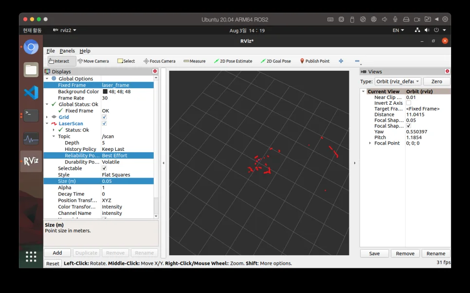

HUMAN AI ROBOTICS
166
라이다센서실습
참고
RPLidar 라이다
1. 장치명 확인
먼저 RPLIDAR를 Jetson에 연결하여 /dev/rplidar가 있는지 확인해주세요.
$ ll /dev/rp*
$ /dev/rplidar -> ttyUSB1
2. Slamtec rplidar_ros 설치
rplidar_ros github에서 ros2 branch를 다운로드한 후 빌드합니다.
$ cd ~/ros2_ws/src
$ git clone -b ros2 
https://github.com/Slamtec/rplidar_ros.git
$ cd ..
$ cbp rplidar_ros

HUMAN AI ROBOTICS
167
참고
RPLidar
3. RVIZ2로 동작 확인
3.1 SBC에서 rviz 실행
#terminal #1
$ ros2 launch monicar2_bringup rplidar_all.launch.py
3.2 PC에서 rviz 실행
remote 환경이 제대로 설정되어야합니다.
#terminal #1
$ ros2 launch monicar2_bringup rplidar.launch.py
#terminal #2, PC에서 실행
$ ros2 launch monicar2_bringup view_rplidar.launch.py

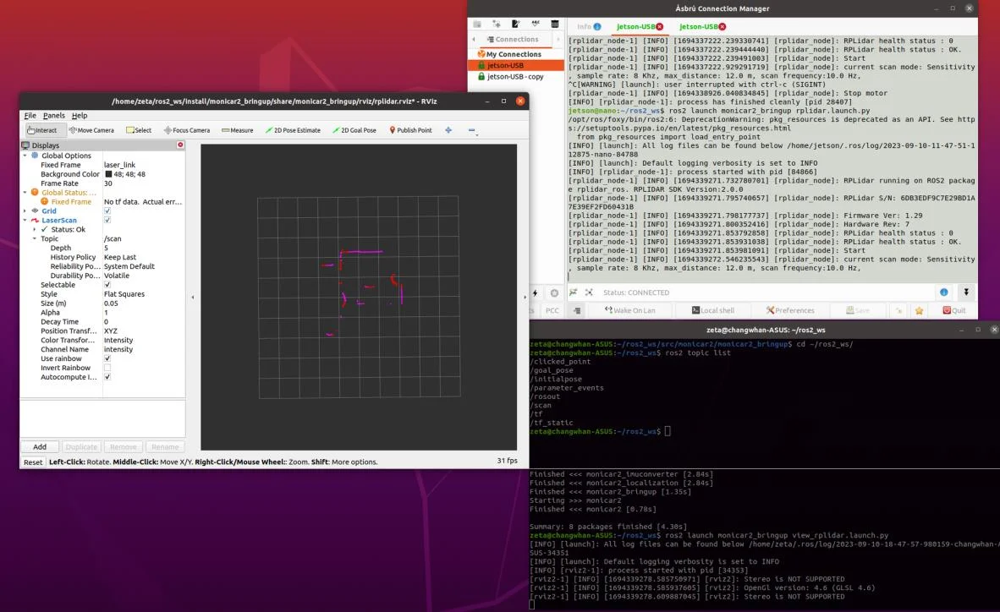

HUMAN AI ROBOTICS
168
라이다센서실습
참고
PyQT5
파이썬에서는 기본적으로 tkinter 이라는 GUI 모듈을 제공하고 있습니다.
pip install PyQt5
pip install pyqt5-tools

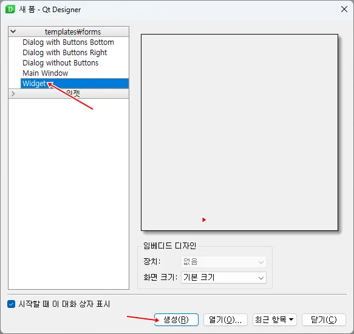

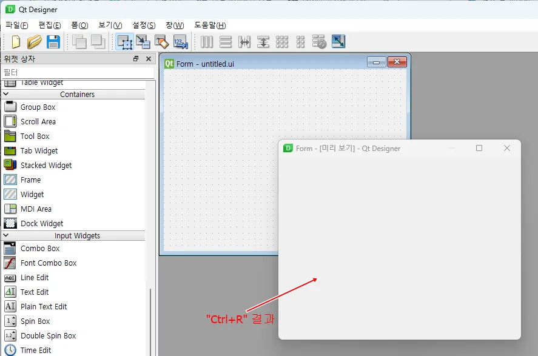

HUMAN AI ROBOTICS
169
라이다센서실습
참고
PyQT5

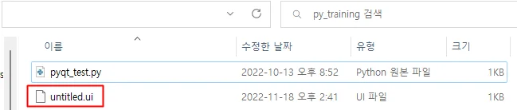

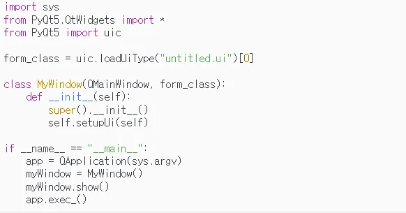

HUMAN AI ROBOTICS
170
라이다센서실습
참고
PyQT5
class MainWindow(QMainWindow):
    def __init__(self):
        super().__init__()
        # UI 구성
        self.setWindowTitle("QThread 예제")
        self.resize(300, 150)
        self.label = QLabel("버튼을 눌러 작업 시작", self)
        self.label.setAlignment(Qt.AlignCenter)
        self.button = QPushButton("작업 시작", self)
        self.button.clicked.connect(self.start_thread)
        layout = QVBoxLayout()
        layout.addWidget(self.label)
        layout.addWidget(self.button)
        container = QWidget()
        container.setLayout(layout)
        self.setCentralWidget(container)
    def start_thread(self):
        # 백그라운드 작업을 위한 스레드 생성
        self.thread = WorkerThread()
        self.thread.finished.connect(self.update_label)
        self.thread.start()
    def update_label(self, result):
        # 스레드 작업이 끝나면 레이블 업데이트
        self.label.setText(result)
def main():
    app = QApplication(sys.argv)
    window = MainWindow()
    window.show()
    sys.exit(app.exec_())
if __name__ == "__main__":
    main()
import sys
import time
from PyQt5.QtCore import QThread, pyqtSignal
from PyQt5.QtWidgets import QApplication, QMainWindow, QPushButton, QLabel, 
QVBoxLayout, QWidget
class WorkerThread(QThread):
    # 작업이 완료되었을 때 발생하는 시그널
    finished = pyqtSignal(str)
    def run(self):
        # 오래 걸리는 작업을 여기에 수행
        time.sleep(3)  # 예를 들어, 3초 동안 대기하는 작업
        result = "작업 완료!"
        
        # 작업이 끝나면 시그널로 결과를 전달
        self.finished.emit(result)

HUMAN AI ROBOTICS
171
주제2.1 기초
참고
수고하셨습니다.

