# 로키 - 시뮬레이션 - 협업_김루진_0303

Version
V2.0
최종수정일
2025.03.03
작성자
김루진강사
협동로봇 프로젝트 수행

Rokey
2
로봇패키지
참고
차동 이동 로봇URDF - 1

Rokey
3
로봇패키지
학습 목표
URDF (Unified Robot Description Format) 학습 목표
•URDF의 기본 구조와 문법 이해
•링크(link)와 조인트(joint) 정의 방법 습득
•시각적 요소(visual)와 충돌(collision) 속성 설정
•관성(inertial) 속성 정의 방법
•URDF 파일 검증 및 디버깅 방법

Rokey
4
로봇패키지
로봇모델링 , URDF 실습
1. URDF Package 생성하기
2. 연관폴더만들기
•
src/urdf_tutorial 폴더아래다음두폴더를추가
•
urdf: URDF 파일을저장할폴더
•
launch: ROS2 실행launch 스크립트를저장할폴더
$ mkdir -p ~/urdf_ws/src
$ cd ~/urdf_ws/src
$ ros2 pkg create --build-type ament_python urdf_tutorial
$ cd urdf_tutorial
$ mkdir urdf 
$ mkdir launch
차동 구동 로봇(Differential Drive Robot)
•XML 형식의 로봇 모델 정의 
•Xacro 매크로를 사용하여 파라메터화 및 코드 재사용성 향상

Rokey
5
로봇패키지
3. setup.py
두폴더가컴파일에포함될수있도록'src/urdf_tutorial/setup.py'를아래와같이편집
import os
from glob import glob
from setuptools import setup
package_name = 'urdf_tutorial'
setup(
name=package_name,
version='0.0.0',
packages=[package_name],
data_files=[
('share/ament_index/resource_index/packages',
['resource/' + package_name]),
('share/' + package_name, ['package.xml']),
(os.path.join('share', package_name, 'launch'), glob('launch/*.launch.py')),
(os.path.join('share', package_name, 'urdf'), glob('urdf/*.xacro’)),
(os.path.join('share', package_name, 'urdf'), glob('urdf/*.urdf’)),
],
install_requires=['setuptools'],
zip_safe=True,
maintainer='daeho',
maintainer_email='daeho@todo.todo',
description='TODO: Package description',
license='TODO: License declaration',
tests_require=['pytest'],
entry_points={
'console_scripts': [
],
},
)
로봇패키지만들기실습
*.urdf 도 추가하세요.

Rokey
6
로봇패키지
‘src/urdf_tutorial/urdf/robot_1.xacro’ 파일을만들고아래와같이편집
• base_link: 자동차 중심링크
• body: 가로, 세로, 높이각각1m인상자
• body_joint: base_link와body를연결하는joint
4. 로봇모델만들기
<?xml version="1.0"?>
<robot xmlns:xacro="http://ros.org/wiki/xacro" name="urdf_test">
<!-- BASE -->
<link name="base_link">
</link>
<!-- BODY LINK -->
<joint name="body_joint" type="fixed">
<!-- 'joink'를'joint'로수정-->
<parent link="base_link"/>
<child link="body"/>
</joint>
<link name="body">
<visual>
<geometry>
<box size="1 1 1"/>
</geometry>
</visual>
</link>
</robot>
로봇패키지만들기실습
• Base Link: 로봇의 메인 본체 (직육면체) 
• Wheels: 왼쪽과 오른쪽 바퀴 (원통형) 
• Joints: 바퀴와 베이스를 연결하는 조인트 
•차동 구동 메커니즘: 두 바퀴가 독립적으로 제어 가능 
•Gazebo 호환 플러그인 내장 
•물리적 특성(질량, 관성) 정의 
•ROS 호환 설계

Rokey
7
로봇패키지
‘src/urdf_tutorial/launch/robot_1.launch.py’ 파일을만들고아래와같이편집, 2가지 방법
5. 런치파일만들기
import os
from ament_index_python.packages import get_package_share_directory
from launch import LaunchDescription
from launch.substitutions import LaunchConfiguration
from launch.actions import DeclareLaunchArgument
from launch_ros.actions import Node
import xacro
def generate_launch_description():
use_sim_time = LaunchConfiguration('use_sim_time')
pkg_path = os.path.join(get_package_share_directory('urdf_tutorial'))
xacro_file = os.path.join(pkg_path,'urdf','robot_1.xacro')
robot_description = xacro.process_file(xacro_file)
params = {'robot_description': robot_description.toxml(), 'use_sim_time': use_sim_time}
return LaunchDescription([
DeclareLaunchArgument(
'use_sim_time',
default_value='false',
description='Use sim time'),
Node(
package='robot_state_publisher',
executable='robot_state_publisher',
output='screen',
parameters=[params])
])
로봇패키지만들기실습
로봇 시스템의 노드, 파라미터, 액션 등을 설정하는 데 사용

Rokey
8
로봇패키지
6. 빌드및소싱
첫번째터미널에서아래명령을실행해서컴파일및‘robot_1.launch.py’ 파일을실행
7. 두번째터미널에서아래명령을실행해서Rviz를실행
$ cd ~/urdf_ws
$ colcon build --symlink-install 
$ source install/setup.bash
$ ros2 launch urdf_tutorial robot_1.launch.py
$ cd ~/urdf_ws
$ source install/setup.bash
$ rviz2
로봇패키지만들기실습
Rokey
9
로봇패키지
8. rviz2 설정
Display > Global Option > ‘Fixed Frame’을‘base_link’로변경
왼쪽하단의‘Add’ > ‘TF’ > ‘Ok’ 
로봇패키지만들기실습

Rokey
10
로봇패키지
9. TF 보기
TF의하위항목중‘Show Names’를선택
중앙에‘base_link’와‘body’가겹쳐진상태로보이는것확인
왼쪽하단의‘Add’ > ‘RobotModel’ > ‘Ok’ 
로봇패키지만들기실습

Rokey
11
로봇패키지
10. 로봇모델보기
RobotModel의하위항목중‘Description Topic’을‘/robot_description’으로변경
'File' 메뉴에서'Save Config As'를선택
로봇패키지만들기실습

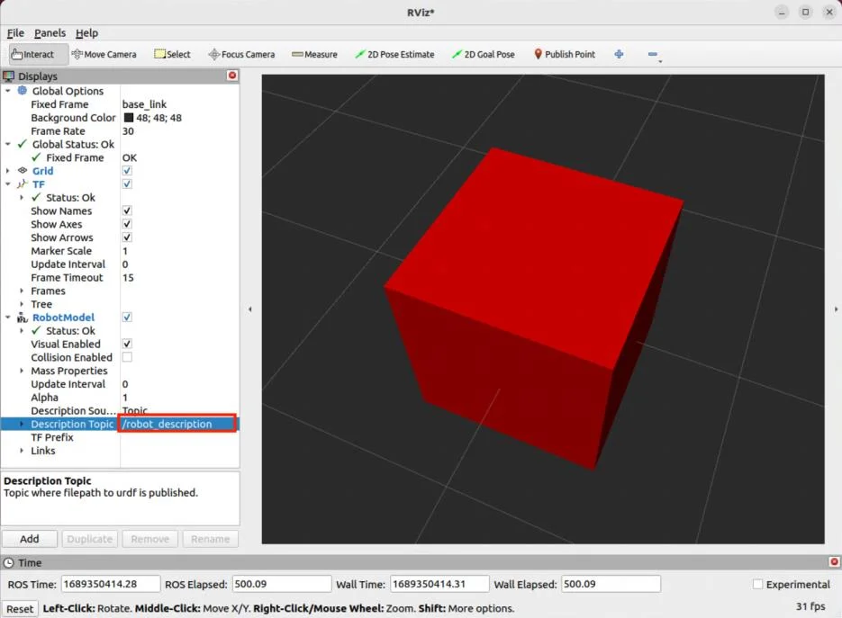

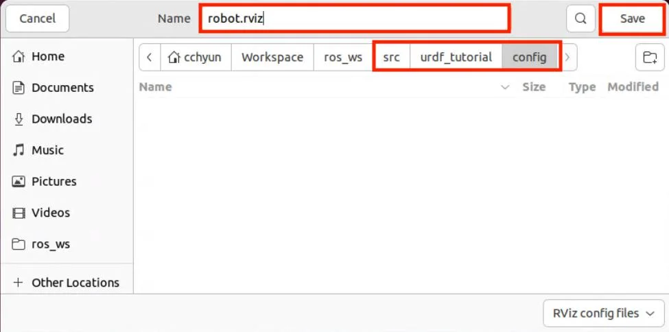

Rokey
12
로봇패키지
11. 노드및토픽확인
세번째터미널에서아래명령을실행해서rqt_graph를실행
• /robot_state_publisher: 
‘robot.launch.py’를이용해서실행한Node
• /transform_listner_Impl: 
rviz2에서실행한Node
• ‘/robot_state_publisher’ Node는
‘/transform_listner_Impl’ Node에게
‘/tf’, ‘/tf_static’ 두개의topic을전달
$ rqt_graph
로봇패키지만들기실습

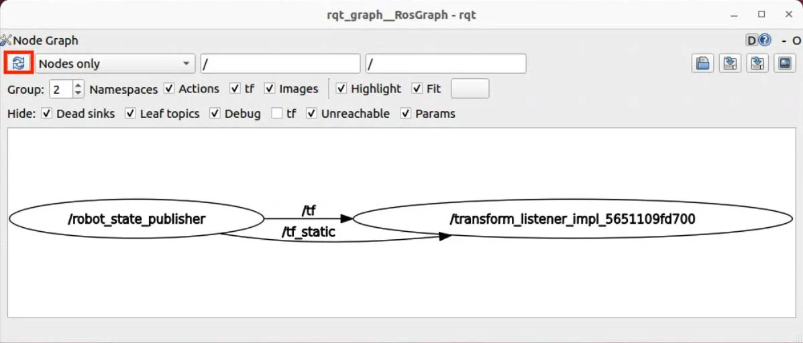

Rokey
13
로봇패키지
12. 정육면체의색변경
‘src/urdf_tutorial/urdf/robot_1.xacro’ 파일을아래와같이수정
• material white: 위쪽에흰색을표현하는white material을선언
색상은rgba 모두1로지정: (색상의범위:  0 ~ 1 ) 
• body link material: body link에위에서지정한white material을지정
변경된값을반영하기위해첫번째터미널에서
‘CTRL+C’ 키를입력해서ROS2를종료한후명령을수행
<?xml version="1.0"?>
<robot xmlns:xacro="http://ros.org/wiki/xacro" name="urdf_test">
<!-- COLOR-->
<material name="white">
<color rgba="1 1 1 1"/>
</material>
<!-- BASE -->
<link name="base_link">
</link>
<!-- BODY LINK -->
<joint name="body_joint" type="fixed">
<parent link="base_link"/>
<child link="body"/>
</joint>
<link name="body">
<visual>
<geometry>
<box size="1 1 1"/>
</geometry>
<material name="white"/>
</visual>
</link>
</robot>
$ cd ~/urdf_ws
$ colcon build --symlink-install
$ source install/setup.bash
$ ros2 launch urdf_tutorial robot_1.launch.py
로봇패키지만들기실습

Rokey
14
로봇패키지
참고
12. 바디를 원통형(cylinder)로 변경
‘src/urdf_tutorial/urdf/robot_1.xacro’ 파일을아래와같이수정
로봇패키지만들기실습
geometry 태그는 로봇의 각 링크(link)의 모양과 충돌 모델을 정의 
Box (상자)
Sphere (구체)
Cylinder (원기둥)
Mesh (메쉬)
왜 완전한 원
이 아닐까?

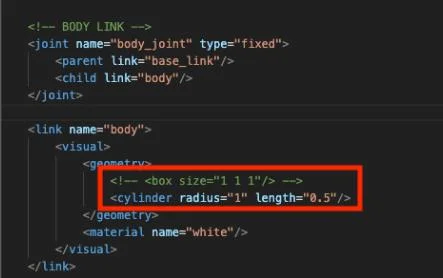

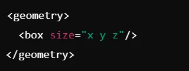

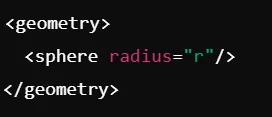
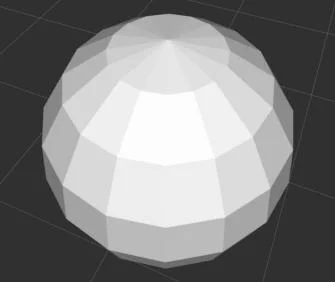

Rokey
15
로봇패키지
참고
13. 시각적 표현과 충돌 모델의 분리
로봇패키지만들기실습
URDF에서 visual 태그와 collision 태그 안에 별도로 geometry를 정의 
예를 들어, 시각적으로는 메쉬를 사용하지만, 충돌 모델은 간단한 Box로 정의 가능.
STL 파일 준비:
• mesh를 사용할 때는 .stl 또는 .dae 파일이 필요
• Blender, SolidWorks, FreeCAD 등에서 3D 모델을 생성.

Rokey
16
로봇패키지
참고
TF2(Transfor Framework)2

Rokey
17
로봇패키지
참고
TF2가 필요한 이유
1.로봇 시스템의 좌표계 관리
•로봇은 여러 센서(라이다, 카메라, IMU 등)와 부품(바퀴, 관절 등)이 있으며, 각각은 서로 다른 위치에 장착
•각 부품과 센서의 위치 관계를 수학적으로 표현하고 관리
•TF2는 이러한 좌표계 변환을 자동으로 처리해주는 프레임워크
2.시간 동기화
•센서 데이터는 각각 다른 시간에 수집됩니다
•TF2는 시간에 따른 좌표계 변환을 자동으로 보간 처리
https://with-rl.tistory.com/entry/ROS2-Transformation-System-TF2
Rokey
18
로봇패키지
참고
SLAM에서 TF2의 필요성
1.센서 데이터 통합
•SLAM은 여러 센서의 데이터를 통합하여 지도를 생성하고 로봇의 위치를 추정.
•서로 다른 센서의 데이터를 하나의 좌표계로 변환해야 정확한 매핑이 가능.
2.로봇의 이동 추적
•base_link(로봇 중심)와 odom(주행 기준) 간의 변환
•map과 odom 사이의 변환
•이러한 변환들은 SLAM의 핵심 요소입니다
3.센서 캘리브레이션
•라이다나 카메라의 실제 장착 위치를 정확히 반영해야 합니다
•TF2를 통해 센서의 위치 관계를 정의하고 관리할 수 있습니다
•
SLAM을 구현하는데 TF2는 필수적
•
정확한 좌표계 변환 없이는 센서 데이터를 올바르게 통합할 수 없고, 결과적으로 정확한 지도 생성과 위치 
추정이 불가능

Rokey
19
로봇패키지
참고
TF2, Map과 Odom 변환
"로봇이 생각하는 자신의 위치"와 "로봇의 실제 위치" 사이의 차이를 계산하고 보정하는 과정
1.각 프레임의 의미
•map 프레임: 
✓절대적인 세계 좌표계
✓로봇이 작동하는 전체 환경의 기준점
✓시간이 지나도 변하지 않는 고정된 좌표계
•odom 프레임
✓로봇이 처음 시작한 위치를 기준으로 하는 좌표계
✓주로 휠 엔코더나 IMU 등의 센서로부터 계산
✓시간이 지날수록 오차가 누적되는 특징
2.변환이 필요한 이유
•로봇이 출발점에서 1m 전진했다고 가정해보겠습니다
•odom 프레임에서는 정확히 1m 이동했다고 측정
•하지만 실제 map 프레임에서는 바닥이 미끄러워서 0.9m만 이동 시
=> 이러한 차이를 보정하기 위해 map과 odom 사이의 변환이 필요
3.SLAM에서의 역할
•SLAM은 지속적으로 map과 odom 사이의 변환을 계산
•이를 통해 오도메트리의 누적 오차를 보정
•결과적으로 로봇의 실제 위치(map 프레임)를 정확하게 추정

Rokey
20
로봇패키지
참고
차동 이동 로봇URDF - 2

Rokey
21
로봇패키지
참고
로봇패키지만들기실습
1. ROS 로봇 좌표계
위치에 대한 표현은 x, y, z 3개의 좌표로 표현
a) base_link 프레임
•로봇의 기준 좌표계
•로봇의 중심점을 원점으로 설정
•모든 로봇 부품의 상대적 위치 정의
b) odom 프레임
•전역 고정 좌표계
•로봇의 초기 위치를 원점으로 설정
•누적 이동 거리 추적
c) map 프레임
•환경의 전체 지도 좌표계
•SLAM에서 중요한 좌표계
•절대 좌표 제공

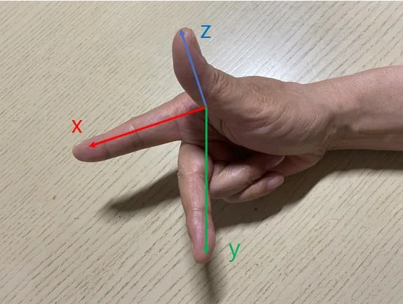

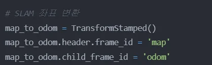

Rokey
22
로봇패키지
참고
로봇패키지만들기실습
2. src/urdf_tutorial/urdf/robot_2.xacro

Rokey
23
로봇패키지
참고
로봇패키지만들기실습
3. src/urdf_tutorial/launch/robot_2.launch.py
$ cd ~/urdf_ws
$ colcon build --symlink-install 
$ source install/setup.bash
$ ros2 launch urdf_tutorial robot_2.launch.py
Rokey
24
로봇패키지
참고
로봇패키지만들기실습
4. Rviz 메뉴에서 'File' >> 'Open Config' 선택 후 이전 과정에서 저장한 config 파일
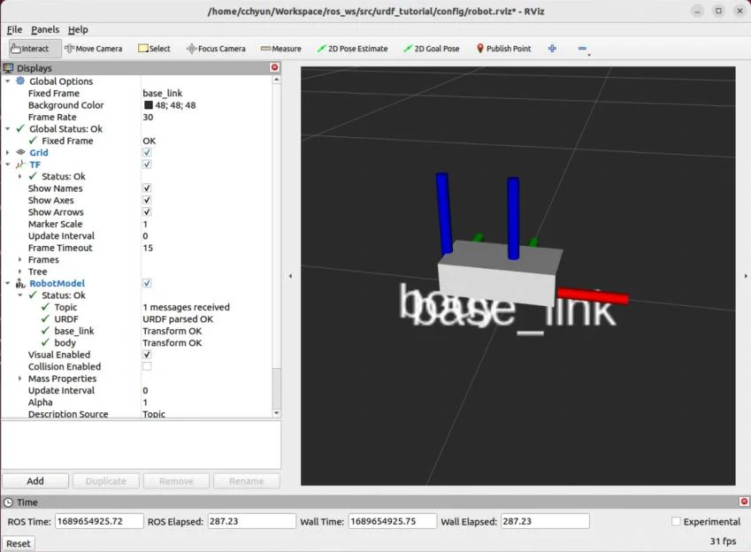

Rokey
25
로봇패키지
참고
로봇패키지만들기실습
4. Wheel 추가
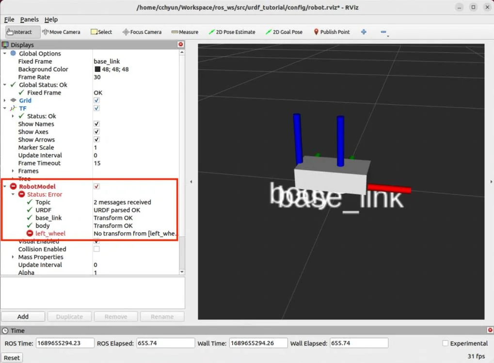

Rokey
26
로봇패키지
참고
로봇패키지만들기실습
5. URDF에서 <joint type> 은 로봇의 링크 간 연결 방식
1.continuous (연속)
•무제한 회전 가능
•각도 제한 없음
•주로 바퀴나 회전 관절에 사용
2.revolute (회전)
•고정된 각도 범위 내에서 회전
•최소/최대 각도 제한 있음
•로봇 관절, 팔 관절 등에 사용
3.prismatic (병진)
•직선 방향으로만 움직임
•슬라이딩 관절
•리니어 액추에이터, 그리퍼, 피스톤 등
4.fixed (고정)
•링크 간 움직임 없음
•강체로 연결
•구조적 연결, 센서 장착 등
Rokey
27
로봇패키지
참고
로봇패키지만들기실습
6. joint_state_publisher_gui
rqt_graph
‘joint_state_publisher_gui’에서 ‘left_wheel_joint’ 값을 변경
left_wheel이 회전하는 것 확인

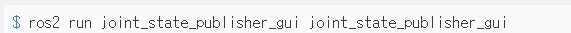

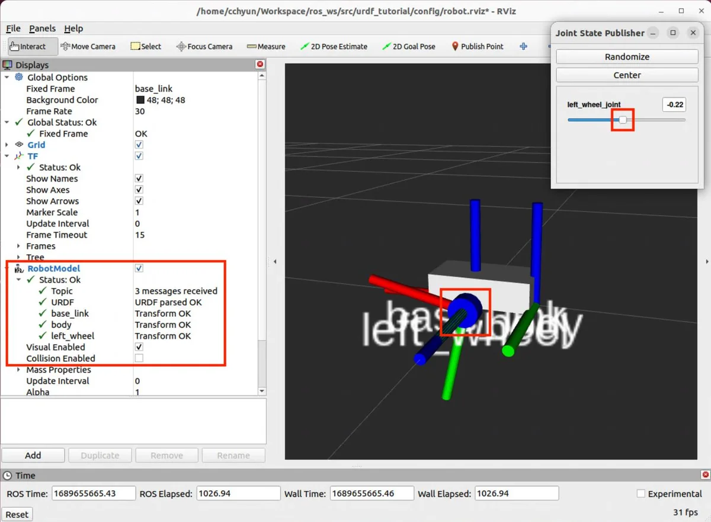

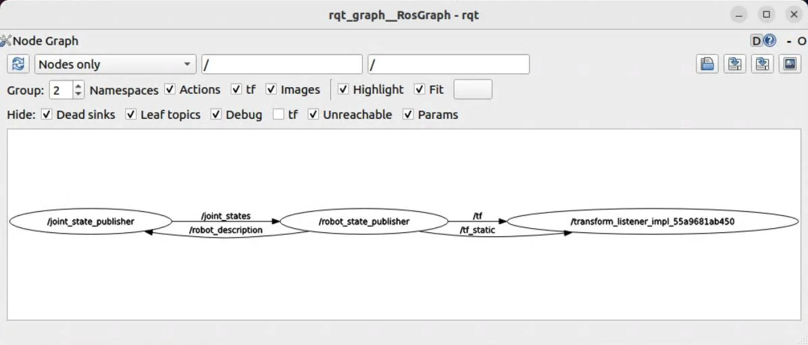

Rokey
28
로봇패키지
참고
로봇패키지만들기실습
7. right_wheel_joint
base_link에 'continuous' 형식 부착
8. Caster Wheel 추가하기

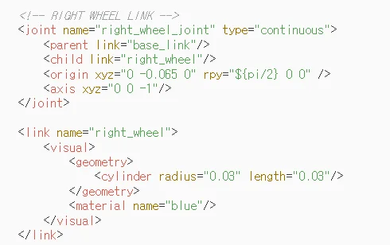

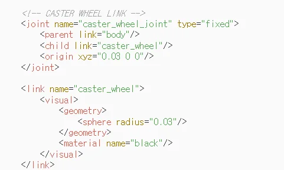

Rokey
29
로봇패키지
참고
로봇패키지만들기실습
9. Collision 추가

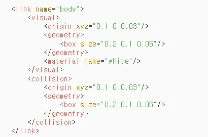

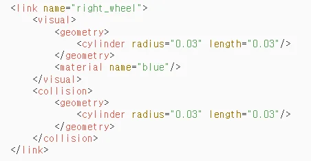

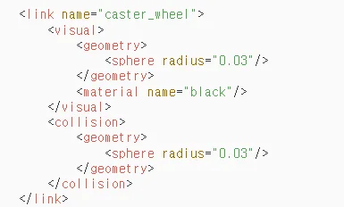

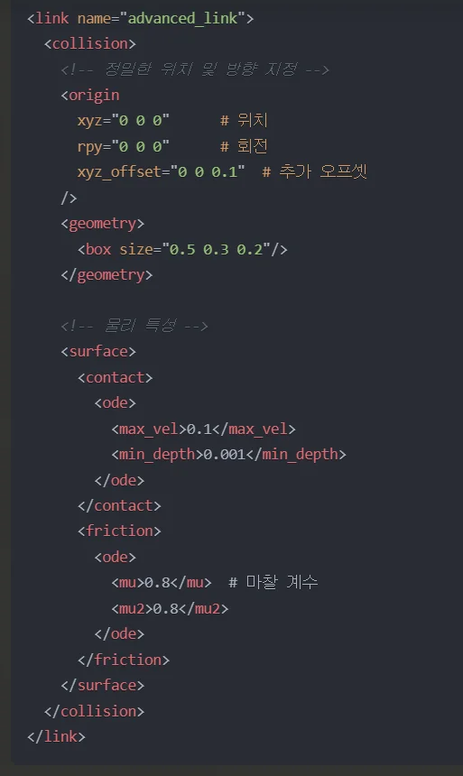

Rokey
30
로봇패키지
참고
로봇패키지만들기실습
10. 관성 모멘트 추가
•로봇의 링크(link)의 질량 분포와 관성 정보
•관성 모멘트의 계산식은https://en.wikipedia.org/wiki/List_of_moments_of_inertia에서 확인
•회전 운동에 대한 저항을 나타냅니다
•물체가 얼마나 회전하기 어려운지를 결정합니다
•로봇 제어 시 동적 특성에 큰 영향을 미칩니다

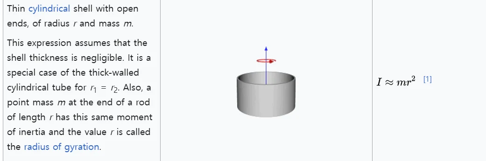

Rokey
31
차동구동로봇패키지
참고
차동구동로봇센서들

Rokey
32
차동구동로봇패키지
참고
패키지생성및실행
2. 워크스페이스및패키지생성
$ mkdir –p ~/car_ws/src
$ cd ~/car_ws/src/ 
$ ros2 pkg create --build-type ament_python car_tutorial
$ cd ~/car_ws/src/car_tutorial
$ mkdir urdf launch config photo
$ pip install numpy
$ pip install opencv-python
$ sudo apt install ros-humble-tf-transformations
1. 필요라이브러리, 패키지설치

Rokey
33
차동구동로봇패키지
참고
적당한크기의(400 x 300) 이미지를
" src/car_tutorial/photo/photo.png"에저장
3. 이미지저장
패키지생성및실행
$ wget -O photo/photo.png  [이미지url]
tf publisher
로봇을 만들었다면 로봇이 가만히 있을리는 당연히 없다. 이러한 robot의 위치를 변화시켜주려면, robot의 base가 
되는 link와 map의 transform을 publish해주는 node를 작성하면 된다.
Rokey
34
차동구동로봇패키지
참고
4. driver 노드작성
src/car_tutorial/car_tutorial/driver.py
패키지생성및실행
import cv2
import rclpy
from rclpy.node import Node
from rclpy.executors import MultiThreadedExecutor
from cv_bridge import CvBridge
from geometry_msgs.msg import Twist
from sensor_msgs.msg import JointState
from sensor_msgs.msg import Image
class Driver(Node):
    def __init__(self):
        super().__init__("drive")
       
        # Parameters
        self.wheel_separation = 0.1
        self.wheel_diameter = 0.03
        self.timer_frequently = 0.1
        # init variable
        self.joint_states = JointState()
        self.joint_states.header.frame_id = "joint_states"
        self.joint_states.name = ["left_wheel_joint", "right_wheel_joint"]
        self.joint_states.position = [0.0, 0.0]
       
        self.linear = 0.0
        self.angular = 0.0
       
        self.wheel_speed = [0.0, 0.0]
        self.wheel_rotate = [0.0, 0.0]
        self.msg = Twist()
        self.raw_vel = Twist()
        
        self.bridge = CvBridge()
        self.image = cv2.imread("src/car_tutorial/photo/photo.png", cv2.IMREAD_COLOR)
        self.img_msg = self.bridge.cv2_to_imgmsg(self.image, encoding="bgr8")
        
        # subscriber
        self.sub_cmd_vel = self.create_subscription(Twist, "cmd_vel", self.cmd_vel_callback, 10)
        # publisher
        self.pub_vel_raw = self.create_publisher(Twist, "raw_vel", 10)
        self.pub_joint_states = self.create_publisher(JointState, "joint_states", 10)
        self.pub_img = self.create_publisher(Image, "image",5)
        # timer
        self.timer_1 = self.create_timer(self.timer_frequently, self.publish_jointstate)
        self.timer_2 = self.create_timer(self.timer_frequently, self.publish_raw_vel)
        self.timer_3 = self.create_timer(5.0, self.publish_image)
       
    def cmd_vel_callback(self, msg):
        self.get_logger().info(f"recv cmd_vel message {msg}")
        self.msg = msg
        self.linear = msg.linear.x
        self.angular = msg.angular.z
        
    def publish_raw_vel(self):
        self.raw_vel= self.msg
        self.pub_vel_raw.publish(self.raw_vel)
       
    def publish_jointstate(self):
        # wheel speed
        self.wheel_speed[0] = self.linear - self.angular * self.wheel_separation / 2.0
        self.wheel_speed[1] = self.linear + self.angular * self.wheel_separation / 2.0
       
        # wheel rotate speed
        self.wheel_rotate[0] = self.wheel_speed[0] / (self.wheel_diameter / 2.0)
        self.wheel_rotate[1] = self.wheel_speed[1] / (self.wheel_diameter / 2.0)
       
        self.joint_states.header.stamp = self.get_clock().now().to_msg()
        self.joint_states.position[0] += self.wheel_rotate[0] *self.timer_frequently
        self.joint_states.position[1] += self.wheel_rotate[1] *self.timer_frequently

Rokey
35
차동구동로봇패키지
참고
패키지생성및실행
# publish
        
self.pub_joint_states.publish(self.joint_states)
   
    def publish_image(self):
        try:
            self.pub_img.publish(self.img_msg)
        except:
            return
def main(args=None):
    rclpy.init(args=args)
    driver = Driver()
    executor = MultiThreadedExecutor()
    rclpy.spin(driver, executor=executor)
    driver.destroy_node()
    rclpy.shutdown()
    
if __name__ == "__main__":
    main()

Rokey
36
차동구동로봇패키지
참고
5. xacro 작성
src/car_tutorial/urdf/car.xacro
패키지생성및실행
<?xml version="1.0"?>
<robot xmlns:xacro="http://www.ros.org/wiki/xacro" name="urdf_tutorial">
<!-- COLOR -->
<material name="white">
<color rgba="1 1 1 1" />
</material>
<material name="blue">
<color rgba="0 0 1 1"/>
</material>
<material name="black">
<color rgba="0 0 0 1"/>
</material>
<material name="red">
<color rgba="1 0 0 1"/>
</material>
<!-- BASE LINK -->
<link name="base_link">
</link>
<!-- BODY LINK -->
<joint name="body_joint" type="fixed">
<parent link="base_link"/>
<child link="body"/>
<origin xyz="-0.12 0 0"/>
</joint>
<link name="body">
<visual>
<origin xyz="0.1 0 0.03"/>
<geometry>
<box size="0.2 0.1 0.06"/>
</geometry>
<material name="white"/>
</visual>
<collision>
<origin xyz="0.1 0 0.03"/>
<geometry>
<box size="0.2 0.1 0.06"/>
</geometry>
</collision>
</link>
<!-- LEFT WHEEL LINK -->
<joint name="left_wheel_joint" type="continuous">
<parent link="base_link"/>
<child link="left_wheel"/>
<origin xyz="0 0.065 0" rpy="-${pi/2} 0 0" />
<axis xyz="0 0 1"/>
</joint>
<link name="left_wheel">
<visual>
<geometry>
<cylinder radius="0.03" length="0.03"/>
</geometry>
<material name="black"/>
</visual>
<collision>
<geometry>
<cylinder radius="0.03" length="0.03"/>
</geometry>
</collision>
</link>

Rokey
37
차동구동로봇패키지
참고
패키지생성및실행
<collision>
<geometry>
<cylinder radius="0.03" length="0.03"/>
</geometry>
</collision>
</link>
<!-- CASTER WHEEL LINK -->
<joint name="caster_wheel_joint" type="fixed">
<parent link="body"/>
<child link="caster_wheel"/>
<origin xyz="0.03 0 0"/>
</joint>
<link name="caster_wheel">
<visual>
<geometry>
<sphere radius="0.03"/>
</geometry>
<material name="black"/>
</visual>
<collision>
<geometry>
<sphere radius="0.03"/>
</geometry>
</collision>
</link>
<!-- CAMERA -->
<joint name="camera_joint" type="fixed">
<parent link="body"/>
<child link="camera_link"/>
<origin xyz="0.20 0 0.03" rpy="0 0 0"/>
</joint>
<!-- RIGHT WHEEL LINK -->
<joint name="right_wheel_joint" type="continuous">
<parent link="base_link"/>
<child link="right_wheel"/>
<origin xyz="0 -0.065 0" rpy="${pi/2} 0 0" />
<axis xyz="0 0 -1"/>
</joint>
<link name="right_wheel">
<visual>
<geometry>
<cylinder radius="0.03" length="0.03"/>
</geometry>
<material name="black"/>
</visual>
<collision>
<geometry>
<cylinder radius="0.03" length="0.03"/>
</geometry>
</collision>
</link>
<!-- CASTER WHEEL LINK -->
<joint name="caster_wheel_joint" type="fixed">
<parent link="body"/>
<child link="caster_wheel"/>
<origin xyz="0.03 0 0"/>
</joint>
<link name="caster_wheel">
<visual>
<geometry>
<sphere radius="0.03"/>
</geometry>
<material name="black"/>
</visual>

Rokey
38
차동구동로봇패키지
패키지생성및실행
<link name="camera_link">
<visual>
<geometry>
<box size="0.01 0.03 0.03"/>
</geometry>
<material name="red"/>
</visual>
<collision>
<geometry>
<box size="0.01 0.03 0.03"/>
</geometry>
</collision>
</link>
<joint name="camera_optical_joint" type="fixed">
<parent link="camera_link"/>
<child link="camera_link_optical"/>
<origin xyz="0 0 0" rpy="${-pi/2} 0 ${-pi/2}"/>
</joint>
<link name="camera_link_optical">
</link>
</robot>

Rokey
39
차동구동로봇패키지
참고
6. launch 작성
src/car_tutorial/launch/car_tutorial.launch.py
import os
from ament_index_python.packages import get_package_share_directory
from launch import LaunchDescription
from launch_ros.actions import Node
import xacro
def generate_launch_description():
package_name = "car_tutorial"
# robot_state_publisher
pkg_path = os.path.join(get_package_share_directory(package_name))
xacro_file = os.path.join(pkg_path, "urdf", "car.xacro")
robot_description = xacro.process_file(xacro_file)
params = {"robot_description": robot_description.toxml(), "use_sim_time": False}
rsp = Node(
package="robot_state_publisher",
executable="robot_state_publisher",
output="screen",
parameters=[params],
)
# rviz2
rviz = Node(
package="rviz2",
executable="rviz2",
name="rviz2",
output="screen",
arguments=["-d", "src/car_tutorial/config/car.rviz"],
)
driver = Node(
package="car_tutorial",
executable="driver",
output="screen",
)
return LaunchDescription(
[
rsp,
rviz,
driver,
])
# 모델정의파일지정
# 노드정의
# 노드실행
패키지생성및실행

Rokey
40
차동구동로봇패키지
참고
런치파일– 추가기능
파라미터설정
조건부실행
from launch.actions import DeclareLaunchArgument
from launch.substitutions import LaunchConfiguration
DeclareLaunchArgument('use_sim_time', default_value='false'),
Node(
# ...
parameters=[{'use_sim_time': LaunchConfiguration('use_sim_time')}]
)
from launch.conditions import IfCondition
Node(
# ...
condition=IfCondition(LaunchConfiguration('condition_var'))
)
다른launch 파일포함
기타: 이벤트헨들러, 그룹화
from launch.actions import IncludeLaunchDescription
from launch.launch_description_sources import PythonLaunchDescriptionSource
IncludeLaunchDescription(
PythonLaunchDescriptionSource(['/path/to/other/launch/file.launch.py'])
)

Rokey
41
차동구동로봇패키지
참고
7. setup.py 작성
src/car_tutorial/setup.py
import os
from glob import glob
from setuptools import find_packages, setup
package_name = "car_tutorial"
setup(
name=package_name,
version="0.0.0",
packages=find_packages(exclude=["test"]),
data_files=[
("share/ament_index/resource_index/packages",
["resource/" + package_name]),
("share/" + package_name, ["package.xml"]),
(os.path.join("share", package_name, "launch"), glob("launch/*.launch.py")),
(os.path.join("share", package_name, "config"), glob("config/*")),
(os.path.join("share", package_name, "urdf"), glob("urdf/*.xacro")),
(os.path.join("share", package_name, "photo"), glob("photo/*.png"))
],
install_requires=["setuptools"],
zip_safe=True,
maintainer="daeho",
maintainer_email="daeho@todo.todo",
description="TODO: Package description",
license="TODO: License declaration",
tests_require=["pytest"],
entry_points={
"console_scripts": [
"driver = car_tutorial.driver:main",
],
},
)
• 패키지정보정의
이름, 버전, 설명등의메타데이터를지정
• 종속성선언
패키지가필요로하는다른ROS 2 패키지나
Python 라이브러리를명시
• 설치대상지정
실행파일, Python 모듈, 데이터파일등패키지에
포함될항목들을정의
• 빌드설정
컴파일이필요한경우빌드프로세스를구성
- colcon 빌드시스템에의해사용되어
패키지빌드및설치
- package.xml과함께패키지구성의핵심요소
패키지생성및실행

Rokey
42
차동구동로봇패키지
참고
$ cd ~/car_ws
$ colcon build –symlink-install
$ source install/setup.bash
$ ros2 launch car_tutorial car_tutorial.launch
8. 빌드및실행
9. rviz 설정
Add -> TF
Add -> RobotModel
Add -> Image
Global Options > Fixed Frame : base_link
RobotModel > Description Topic : /robot_description
Image > Topic : /image
File -> Save Config
패키지생성및실행

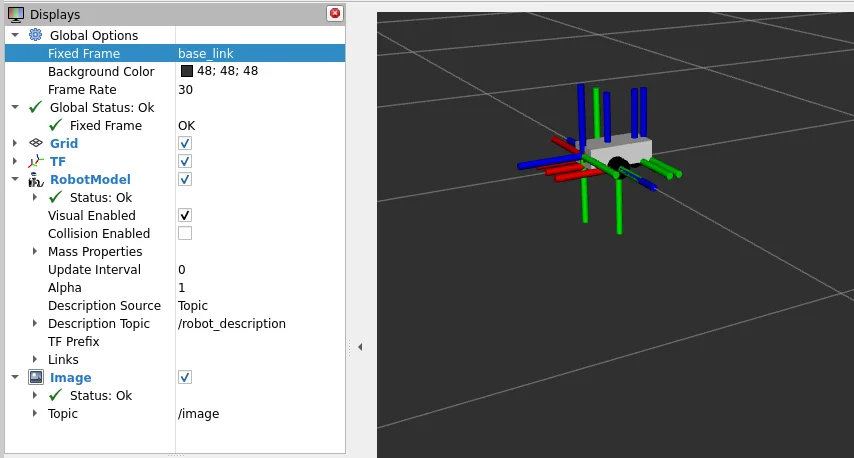

Rokey
43
차동구동로봇패키지
참고
$ ros2 run teleop_twist_keyboard teleop_twist_keyboard
10. 두번째터미널에서실행
u, I, o, j, k, l, m, ,, . 키로조작
패키지생성및실행
https://with-rl.tistory.com/entry/URDF%EB%A5%BC-%EC%9D%B4%EC%9A%A9%ED%95%9C-%EA%B0%84%EB%8B%A8%ED%95%9C-
%EB%A1%9C%EB%B4%87-%EB%A7%8C%EB%93%A4%EA%B8%B0-3
Rokey
44
차동구동로봇패키지
참고
Odom(odometry)

HUMAN AI ROBOTICS
45
Odom
Odom
1. Odometry
•로봇의 위치와 방향을 추정하는 기술 
•센서 데이터를 기반으로 로봇의 이동 경로 계산 
•주요 정보: 위치, 속도, 방향 
2. ROS2 Odometry 메시지 구조

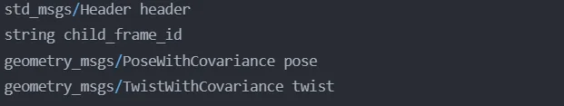

HUMAN AI ROBOTICS
46
Odeom
Odom
3. Odometry 노드

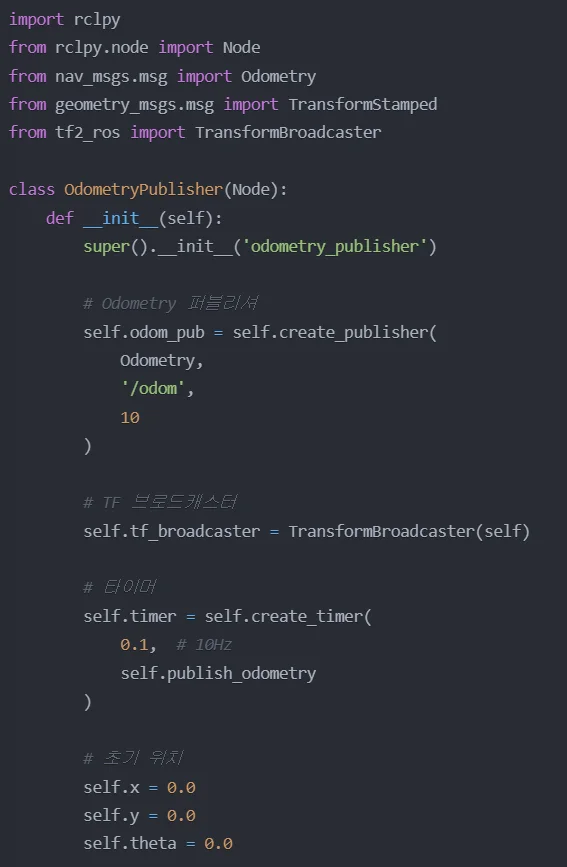

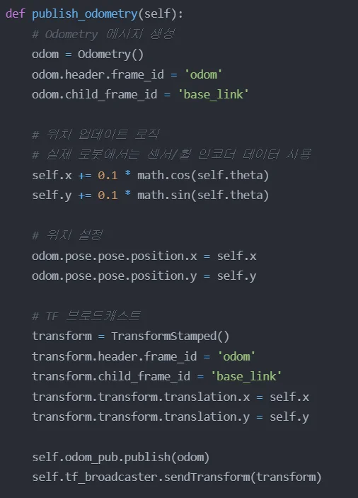

HUMAN AI ROBOTICS
47
Odom
Odom
4. FakeDriver 개념
•Keyboard Controller: 자동차의 방향/속도를 제어하는 명령을 Topic 전송
Real Driver: 자동차에방향/속도를 제어하는 명령을 보내고 실제 자동차의 방향/속도의 측정값 및 카메라 화면 정보를 수
신해서 Topic으로 전송
Odometry: 자동차의방향/속도의 측정값을 이용해서 실제 자동차의 위치를 계산

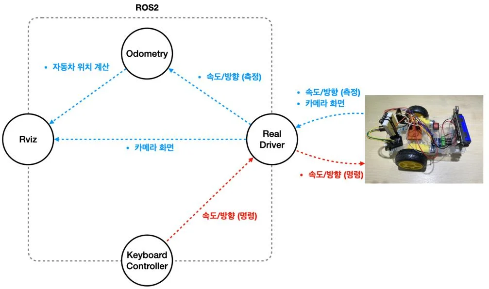

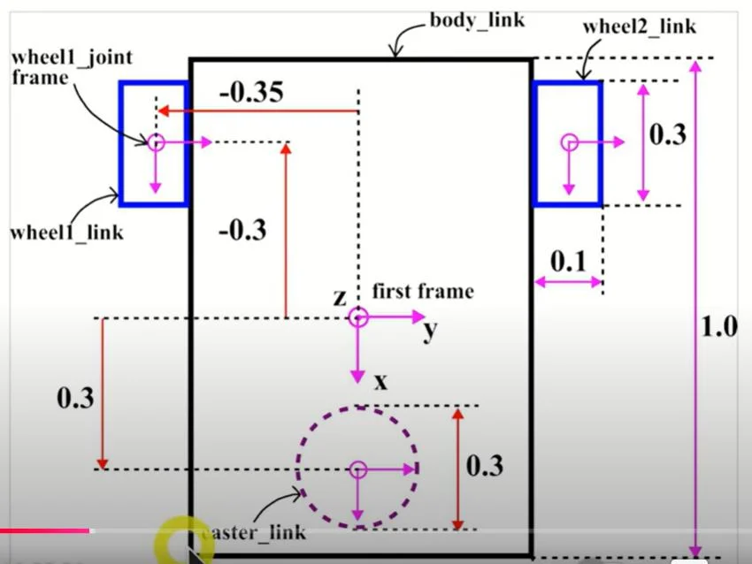

HUMAN AI ROBOTICS
48
Odom
Odom
5. car_odom 코드
Driver에서 속도/방향에 대한 측정값을 보내면 이 값을 기준으로 회전변환행렬을 이용해서 자동차의 실제 위치 계산

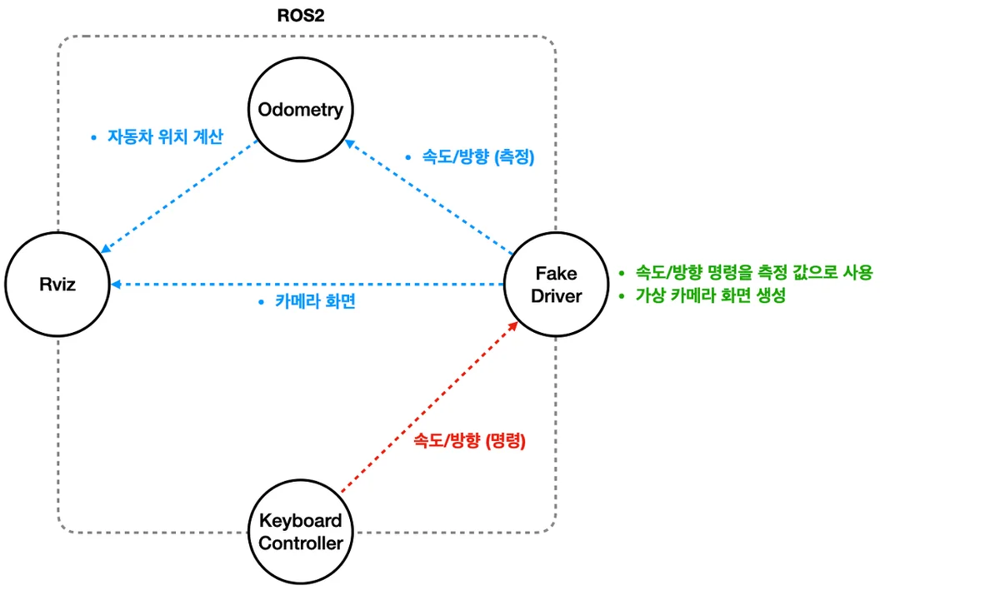

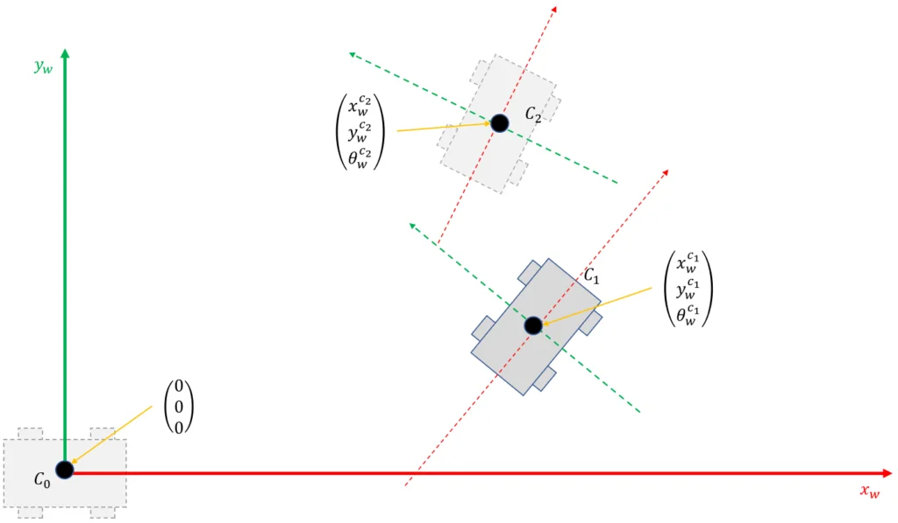

HUMAN AI ROBOTICS
49
Odom
odom
회전변환행렬
6. Odometry 회전행렬 변환식
•3차원 공간에서 물체의 위치와 자세를 표현(x,y,z,θx,θy,θz)(x,y,z,θx,θy,θz) 6개의 값
◦xx: x 축 방향으로 이동 거리입니다.
◦yy: y 축 방향으로 이동 거리입니다.
◦zz: z 축 방향으로 이동 거리입니다.
◦θxθx: x 축을 기준으로 반 시계 방향으로 회전한 각도
◦θyθy: y 축을 기준으로 반 시계 방향으로 회전한 각도
◦θzθz: z 축을 기준으로 반 시계 방향으로 회전한 각도
•2차원 공간에서(x,y,θ)(x,y,θ) 3개의 값으로 표현
◦xx: x축 방향으로 이동 거리
◦yy: y축 방향으로 이동 거리
◦θθ: 반 시계 방향으로 회전한 각도

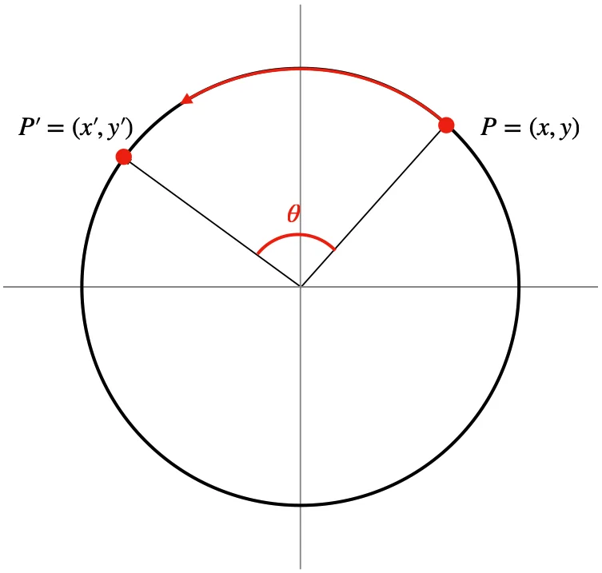

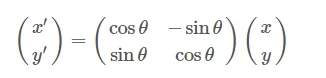

HUMAN AI ROBOTICS
50
Odom
odom
6. Odometry 자동차의 위치 변화
HUMAN AI ROBOTICS
51
Odom
odom
7. static_transform_publisher를 이용한 TF2 기능
$ ros2 run tf2_ros static_transform_publisher 2 1 0 0.785 0 0 world robot_1
◦2 1 0: x, y, z 좌표로 x=2, y=1, z=0이라는 의미입니다.
◦0.785 0 0: 은 yaw, pitch, roll 값으로 반시계 방향으로 45° π/4π/4 만큼 회전하라는 의미입니다.

Rokey
52
차동구동로봇패키지
참고
Controller Driver, Plugin

Rokey
53
차동구동로봇패키지
참고
1. odom 노드작성
src/car_tutorial/car_tutorial/odom.py
패키지생성및실행
import numpy as np
import rclpy
from rclpy.node import Node
from tf2_ros import TransformBroadcaster
from geometry_msgs.msg import Twist
from geometry_msgs.msg import TransformStamped
from nav_msgs.msg import Odometry
from tf_transformations import quaternion_from_euler
class Odom(Node):
    def __init__(self):
        super().__init__("odom")
       
        # Parameters
        self.timer_frequently = 0.1
        
        # init variable
        self.linear = 0.0
        self.angular = 0.0
       
        self.vel_x = 0.0
        self.vel_y = 0.0
        self.vel_z = 0.0
        self.delta_x = 0.0
        self.delta_y = 0.0
        self.delta_z = 0.0
       
        self.pos_x = 0.0
        self.pos_y = 0.0
        self.pos_z = 0.0
       
        self.tf_broadcaster = TransformBroadcaster(self)
        # subscriber
        self.sub_cmd_vel = self.create_subscription(Twist, "raw_vel", self.raw_vel_callback, 10)
        # publisher
        self.pub_odometry = self.create_publisher(Odometry, "odom", 10)
        # timer
        self.timer = self.create_timer(self.timer_frequently, self.publish_odometry)
       
    def raw_vel_callback(self, msg):
        self.get_logger().info(f"recv cmd_vel message {msg}")
        self.linear = msg.linear.x
        self.angular = msg.angular.z
   
    def publish_odometry(self):
        self.delta_x = self.linear * np.cos(self.pos_z) * self.timer_frequently
        self.delta_y = self.linear * np.sin(self.pos_z) * self.timer_frequently
        self.delta_z = self.angular * self.timer_frequently
       
        self.pos_x += self.delta_x
        self.pos_y += self.delta_y
        self.pos_z += self.delta_z
       
        q = quaternion_from_euler(0.0, 0.0, self.pos_z)
       
        # Odometry
        odom = Odometry()
        odom.header.stamp = self.get_clock().now().to_msg()
        odom.header.frame_id = "odom"
        odom.child_frame_id = "base_link"

Rokey
54
차동구동로봇패키지
참고
패키지생성및실행
        odom.pose.pose.position.x = self.pos_x
        odom.pose.pose.position.y = self.pos_y
        odom.pose.pose.position.z = 0.0
        odom.pose.pose.orientation.x = q[0]
        odom.pose.pose.orientation.y = q[1]
        odom.pose.pose.orientation.z = q[2]
        odom.pose.pose.orientation.w = q[3]
       
        odom.twist.twist.linear.x = self.vel_x
        odom.twist.twist.linear.y = 0.0
        odom.twist.twist.linear.z = 0.0
        odom.twist.twist.angular.x = 0.0
        odom.twist.twist.angular.y = 0.0
        odom.twist.twist.angular.z = self.vel_z
       
        # TF
        t = TransformStamped()
        t.header.stamp = self.get_clock().now().to_msg()
        t.header.frame_id = "odom"
        t.child_frame_id = "base_link"
       
        t.transform.translation.x = self.pos_x
        t.transform.translation.y = self.pos_y
        t.transform.translation.z = 0.0
    
        t.transform.rotation.x = q[0]
        t.transform.rotation.y = q[1]
        t.transform.rotation.z = q[2]
        t.transform.rotation.w = q[3]
        self.tf_broadcaster.sendTransform(t)
       
        self.pub_odometry.publish(odom)
def main(args=None):
    rclpy.init(args=args)
    odom = Odom()
    rclpy.spin(odom)
    odom.destroy_node()
    rclpy.shutdown()
    
    
if __name__ == "__main__":
    main()
import numpy as np
import rclpy
from rclpy.node import Node
from tf2_ros import TransformBroadcaster
from geometry_msgs.msg import Twist
from geometry_msgs.msg import TransformStamped
from nav_msgs.msg import Odometry
from tf_transformations import quaternion_from_euler
class Odom(Node):
    def __init__(self):
        super().__init__("odom")
       
        # Parameters
        self.timer_frequently = 0.1
        
        # init variable
        self.linear = 0.0
        self.angular = 0.0
       
        self.vel_x = 0.0
        self.vel_y = 0.0
        self.vel_z = 0.0
       
        self.delta_x = 0.0
        self.delta_y = 0.0
        self.delta_z = 0.0
       
        self.pos_x = 0.0
        self.pos_y = 0.0
        self.pos_z = 0.0
       
        self.tf_broadcaster = TransformBroadcaster(self)
        # subscriber
        self.sub_cmd_vel = self.create_subscription(Twist, "raw_vel", self.raw_vel_callback, 10)
        # publisher
        self.pub_odometry = self.create_publisher(Odometry, "odom", 10)
        # timer
        self.timer = self.create_timer(self.timer_frequently, self.publish_odometry)
       
    def raw_vel_callback(self, msg):
        self.get_logger().info(f"recv cmd_vel message {msg}")
        self.linear = msg.linear.x
        self.angular = msg.angular.z
   
    def publish_odometry(self):
        self.delta_x = self.linear * np.cos(self.pos_z) * self.timer_frequently
        self.delta_y = self.linear * np.sin(self.pos_z) * self.timer_frequently
        self.delta_z = self.angular * self.timer_frequently
       
        self.pos_x += self.delta_x
        self.pos_y += self.delta_y
        self.pos_z += self.delta_z
       
        q = quaternion_from_euler(0.0, 0.0, self.pos_z)
       
        # Odometry
        odom = Odometry()
        odom.header.stamp = self.get_clock().now().to_msg()
        odom.header.frame_id = "odom"
        odom.child_frame_id = "base_link"
       
        odom.pose.pose.position.x = self.pos_x
        odom.pose.pose.position.y = self.pos_y
        odom.pose.pose.position.z = 0.0
        odom.pose.pose.orientation.x = q[0]
        odom.pose.pose.orientation.y = q[1]
        odom.pose.pose.orientation.z = q[2]
        odom.pose.pose.orientation.w = q[3]
       
        odom.twist.twist.linear.x = self.vel_x
        odom.twist.twist.linear.y = 0.0
        odom.twist.twist.linear.z = 0.0
        odom.twist.twist.angular.x = 0.0
        odom.twist.twist.angular.y = 0.0
        odom.twist.twist.angular.z = self.vel_z
       
        # TF
        t = TransformStamped()
        t.header.stamp = self.get_clock().now().to_msg()
        t.header.frame_id = "odom"
        t.child_frame_id = "base_link"
       
        t.transform.translation.x = self.pos_x
        t.transform.translation.y = self.pos_y
        t.transform.translation.z = 0.0
    
        t.transform.rotation.x = q[0]
        t.transform.rotation.y = q[1]
        t.transform.rotation.z = q[2]
        t.transform.rotation.w = q[3]
        self.tf_broadcaster.sendTransform(t)
       
        self.pub_odometry.publish(odom)
def main(args=None):
    rclpy.init(args=args)
    odom = Odom()
    rclpy.spin(odom)
    odom.destroy_node()
    rclpy.shutdown()
    
    
if __name__ == "__main__":
    main()

Rokey
55
차동구동로봇패키지
참고
2. launch 수정
src/car_tutorial/launch/car_tutorial.launch.py
패키지생성및실행
Rokey
56
차동구동로봇패키지
참고
3. setup.py 수정
src/car_tutorial/setup.py
패키지생성및실행
Rokey
57
차동구동로봇패키지
참고
$ cd ~/car_ws
$ colcon build –symlink-install
$ source install/setup.bash
$ ros2 launch car_tutorial car_tutorial.launch
4. 빌드및실행
5. rviz 설정
Add -> TF
Add -> RobotModel
Add -> Image
Global Options > Fixed Frame : base_link
RobotModel > Description Topic : /robot_description
Image > Topic : /image
File -> Save Config
패키지생성및실행

Rokey
58
차동구동로봇패키지
참고
$ ros2 run teleop_twist_keyboard teleop_twist_keyboard
6. 두번째터미널에서실행
u, I, o, j, k, l, m, ,, . 키로조작
패키지생성및실행
Rokey
59
차동구동로봇패키지
참고
7. rqt_graph 실행
$ rqt_graph
패키지생성및실행

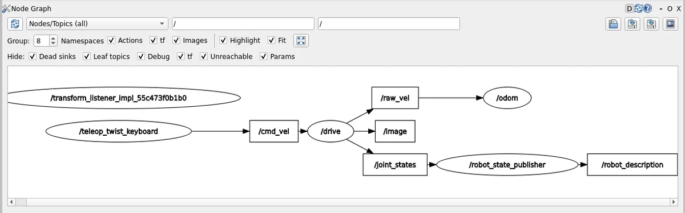

Rokey
60
차동구동로봇패키지
참고
가제보 시뮬레이션

HUMAN AI ROBOTICS
61
시뮬레이션
gazebo
1. car_tutorial package 생성 및 설정
$ cd ~/sim_ws
$ ros2 pkg create --build-type ament_python car_simulation
$ cd car_tutorial
$ mkdir urdf launch
$ cp ~/car_sw/src/car_tutorial/urdf/car.xacro ~/sim_sw/src/car_simulation/urdf/car.xacro
2. xacro 파일 복사

HUMAN AI ROBOTICS
62
시뮬레이션
gazebo
3. macros 파일 작성
src/sim_tutorial/urdf/macros.xacro
<?xml version="1.0"?>
<robot xmlns:xacro="http://www.ros.org/wiki/xacro" >
    <!-- Specify some standard inertial calculations https://en.wikipedia.org/wiki/List_of_moments_of_inertia -->
    <!-- These make use of xacro's mathematical functionality -->
    <xacro:macro name="inertial_sphere" params="mass radius *origin">
        <inertial>
            <xacro:insert_block name="origin"/>
            <mass value="${mass}" />
            <inertia ixx="${(2/5) * mass * (radius*radius)}" ixy="0.0" ixz="0.0"
                    iyy="${(2/5) * mass * (radius*radius)}" iyz="0.0"
                    izz="${(2/5) * mass * (radius*radius)}" />
        </inertial>
    </xacro:macro>  
    <xacro:macro name="inertial_box" params="mass x y z *origin">
        <inertial>
            <xacro:insert_block name="origin"/>
            <mass value="${mass}" />
            <inertia ixx="${(1/12) * mass * (y*y+z*z)}" ixy="0.0" ixz="0.0"
                    iyy="${(1/12) * mass * (x*x+z*z)}" iyz="0.0"
                    izz="${(1/12) * mass * (x*x+y*y)}" />
        </inertial>
    </xacro:macro>
    <xacro:macro name="inertial_cylinder" params="mass length radius *origin">
        <inertial>
            <xacro:insert_block name="origin"/>
            <mass value="${mass}" />
            <inertia ixx="${(1/12) * mass * (3*radius*radius + length*length)}" ixy="0.0" ixz="0.0"
                    iyy="${(1/12) * mass * (3*radius*radius + length*length)}" iyz="0.0"
                    izz="${(1/2) * mass * (radius*radius)}" />
        </inertial>
    </xacro:macro>
</robot>
시뮬레이션에 필요한 물리적 특성을 
기록한 파일

HUMAN AI ROBOTICS
63
시뮬레이션
gazebo
4. xacro 파일 수정
src/sim_tutorial/urdf/car.xacro
macros 부분 추가

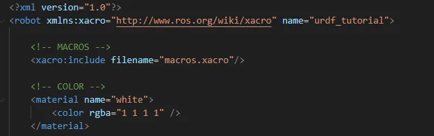

Rokey
64
참고
5. setup.py 작성
src/sim_tutorial/setup.py
패키지생성및실행
시뮬레이션

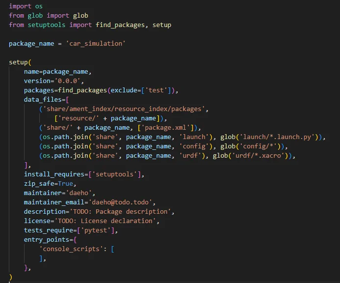

HUMAN AI ROBOTICS
65
시뮬레이션
패키지 생성 및 실행
6. launch 파일 작성
import os
from ament_index_python.packages import get_package_share_directory
from launch import LaunchDescription
from launch.substitutions import LaunchConfiguration
from launch.actions import DeclareLaunchArgument
from launch_ros.actions import Node
import xacro
def generate_launch_description():
    use_sim_time = LaunchConfiguration("use_sim_time")
    pkg_path = os.path.join(get_package_share_directory("car_simulation"))
    xacro_file = os.path.join(pkg_path, "urdf", "car.xacro")
    robot_description = xacro.process_file(xacro_file)
    params = {"robot_description": robot_description.toxml(), "use_sim_time": 
use_sim_time}
    return LaunchDescription(
        [
            DeclareLaunchArgument(
                "use_sim_time", default_value="true", description="use sim time"
            ),
            Node(
                package="robot_state_publisher",
                executable="robot_state_publisher",
                output="screen",
                parameters=[params],
            ),
        ]
    )
src/sim_tutorial/launch/car_simulation.launch.py

HUMAN AI ROBOTICS
시뮬레이션
$ cd ~/sim_ws
$ colcon build –symlink-install
$ source install/setup.bash
$ ros2 launch sim_tutorial car_simulation.launch
7. 빌드및실행
$ ros2 launch gazebo_ros gazebo.launch.py
$ ros2 run gazebo_ros spawn_entity.py -topic robot_description -entity with_robot
패키지 생성 및 실행

HUMAN AI ROBOTICS
67
시뮬레이션
가제보(gazebo)
Gazebo는 로봇을 3D 환경에서 시뮬레이션할 수 있는 강력한 물리 엔진 기반 시뮬레이터.
•로봇 시뮬레이션
•URDF 또는 SDF 형식의 로봇 모델을 불러와서 3D 환경에서 테스트 가능.
•예: TurtleBot3를 Gazebo에서 로딩하여 이동, 탐색 등을 실험 가능.
•물리 엔진 제공
•ODE, Bullet, DART, Simbody 등의 물리 엔진을 사용하여 실제 물리와 유사한 환경을 구현.
•중력, 충돌, 마찰, 센서 노이즈 등을 포함한 시뮬레이션 가능.
•센서 시뮬레이션
•LiDAR, 카메라, IMU, GPS, Force-Torque 센서 등을 가상 환경에서 사용할 수 있음.
•예: /scan 토픽을 이용해 가상 LiDAR 데이터를 ROS 2에서 받아올 수 있음.

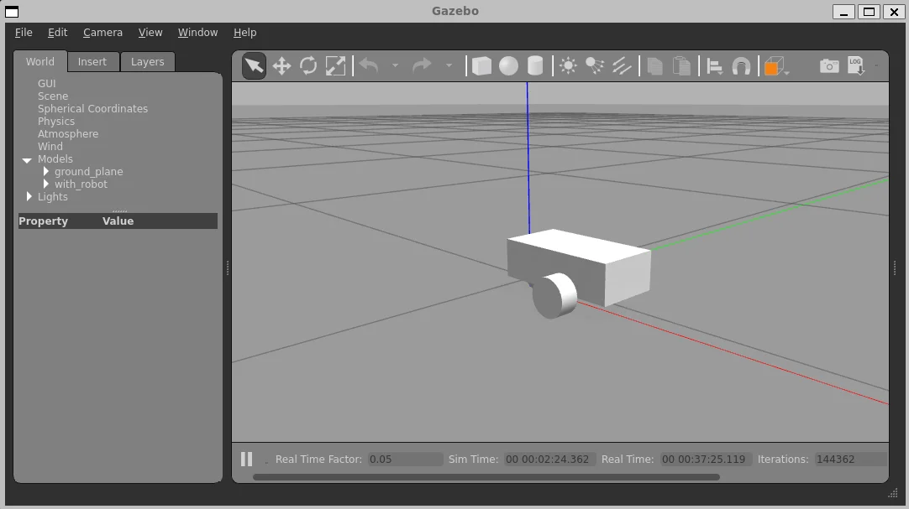

HUMAN AI ROBOTICS
68
시뮬레이션
gazebo
Launch 파일로 한번에 실행
import os
import xacro
from ament_index_python.packages import get_package_share_directory
from launch import LaunchDescription
from launch.actions import IncludeLaunchDescription, ExecuteProcess, TimerAction
from launch.launch_description_sources import PythonLaunchDescriptionSource
from launch_ros.actions import Node
from launch.substitutions import LaunchConfiguration
from launch.actions import RegisterEventHandler, EmitEvent
from launch.event_handlers import OnProcessExit
from launch.events import Shutdown
def generate_launch_description():
    pkg_share = get_package_share_directory('car_simulation')
    
    xacro_file = os.path.join(pkg_share, 'urdf', 'car.xacro')
    robot_description_config = xacro.process_file(xacro_file)
    robot_desc = robot_description_config.toxml()
    
    gazebo = IncludeLaunchDescription(
        PythonLaunchDescriptionSource(
            os.path.join(get_package_share_directory('gazebo_ros'), 'launch', 'gazebo.launch.py'),
        ),
    )
    robot_state_publisher = Node(
        package='robot_state_publisher',
        executable='robot_state_publisher',
        name='robot_state_publisher',
        output='screen',
        parameters=[{'use_sim_time': True, 
                    'robot_description': robot_desc}]
    )
    
    spawn_entity = Node(
        package='gazebo_ros',
        executable='spawn_entity.py',
        arguments=['-topic', 'robot_description',
                  '-entity', 'with_robot'],
        output='screen'
    )
    
    delayed_spawn = TimerAction(
        period=5.0,
        actions=[spawn_entity]
    )
    
    return LaunchDescription([
        gazebo,
        robot_state_publisher,
        delayed_spawn
    ])
src/sim_tutorial/launch/car_simulation_once.launch.py

Rokey
69
차동구동로봇패키지
참고
차동로봇 시뮬레이션

HUMAN AI ROBOTICS
70
운전하기
가제보시뮬레이션
<?xml version="1.0"?>
<robot xmlns:xacro="http://www.ros.org/wiki/xacro">
    <gazebo>
        <plugin name="diff_drive" filename="libgazebo_ros_diff_drive.so">
            <!-- Wheel Information -->
            <left_joint>left_wheel_joint</left_joint>
            <right_joint>right_wheel_joint</right_joint>
            <wheel_separation>0.35</wheel_separation>
            <wheel_diameter>0.1</wheel_diameter>
            <!-- Limits -->
            <max_wheel_torque>200</max_wheel_torque>
            <max_wheel_acceleration>10.0</max_wheel_acceleration>
            <!-- Output -->
            <odometry_frame>odom</odometry_frame>
            <robot_base_frame>base_link</robot_base_frame>
            <publish_odom>true</publish_odom>
            <publish_odom_tf>true</publish_odom_tf>
            <publish_wheel_tf>true</publish_wheel_tf>
        </plugin>
    </gazebo>
</robot>
gazebo.xacro 파일 작성
src/car_simulation/urdf/gazebo.xacro

HUMAN AI ROBOTICS
71
운전하기
가제보시뮬레이션
xacro 파일 수정
src/sim_turoail/urdf/car.xacro
macros 부분 추가

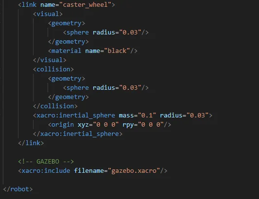

HUMAN AI ROBOTICS
운전하기
$ cd ~/car_ws
$ colcon build –symlink-install
$ source install/setup.bash
$ ros2 launch sim_tutorial car_simulation_once.launch
8. 빌드및실행
$ ros2 run teleop_twist_keyboard teleop_twist_keyboard
$ rviz2
가제보시뮬레이션

HUMAN AI ROBOTICS
운전하기
Add -> TF
Add -> RobotModel
Description Topic: /robot_description
Global Options > Fixed Frame : odom
Rviz2 Odom 설정
ODOM 프레임(Odometry Frame)은 로봇의 이동 경로를 추적하는데 사용되는 중요한 좌표계
1.기본 특징:
•로봇이 시작한 위치를 기준으로 하는 좌표계
•로봇의 상대적인 움직임을 표현
•시간이 지나도 원점이 변하지 않음
•일반적으로 "odom" 이라는 이름의 프레임으로 표현
2.주요 역할:
•로봇의 현재 위치와 방향을 시작점 대비 상대적으로 추적
•단기적인 로봇의 움직임을 정확하게 표현
•지역적 네비게이션에 사용
•센서 퓨전의 기준 프레임으로 활용

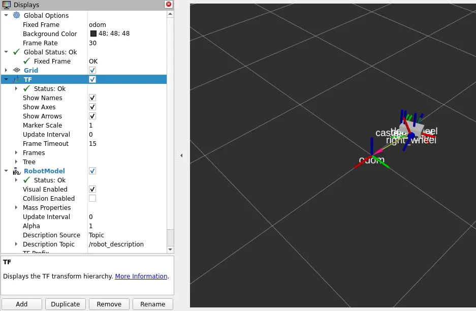

HUMAN AI ROBOTICS
운전하기
추측항법(推測航法, dead reckoning, dead reckoning navigation)
Rviz2 Odom 설정
TF 트리에서의 위치
world/map -> odom -> base_link -> 기타 센서 프레임
4.다른 프레임과의 관계:
•map 프레임: 전역 좌표계, 절대 위치 표현
•base_link: 로봇 본체의 좌표계
•odom은 이 둘 사이의 중간 역할을 수행
5.사용 예시:
•로봇의 dead reckoning 구현
•로컬 장애물 회피
•단거리 자율 주행
•센서 데이터 통합
주의할 점:
•시간이 지날수록 오차가 누적될 수 있음
•전역 위치 보정이 필요할 수 있음
•map 프레임과의 관계를 주기적으로 업데이트 해야 함

HUMAN AI ROBOTICS
운전하기
teleop 을 이용한 조작
가제보시뮬레이션
ros2 run teleop_twist_keyboard teleop_twist_keyboard

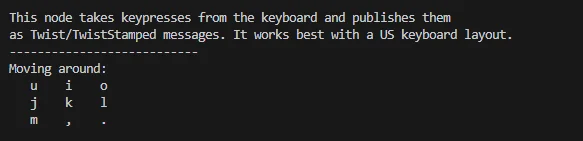

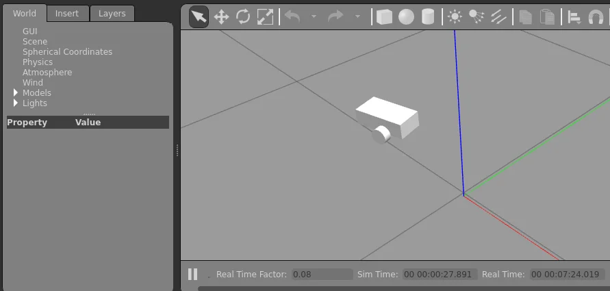

HUMAN AI ROBOTICS
운전하기
rqt_graph 실행
$ rqt_graph
가제보시뮬레이션

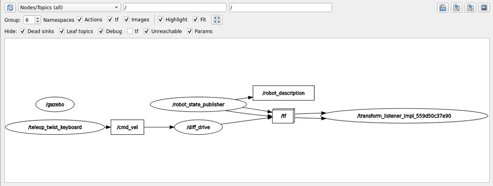

Rokey
77
차동구동로봇패키지
참고
라이다 시뮬레이션

HUMAN AI ROBOTICS
78
라이다
라이다시뮬레이션
lidar.xacro 파일 작성
src/sim_tutorial/urdf/lidar.xacro
라이더 기능 추가
<?xml version="1.0"?>
<robot xmlns:xacro="http://www.ros.org/wiki/xacro">
    <gazebo reference="laser_frame">
        <material>Gazebo/Red</material>
        <sensor name="laser" type="ray">
            <pose>0 0 0 0 0 0</pose>
            <visualize>true</visualize>
            <update_rate>10</update_rate>
            <ray>
                <scan>
                    <horizontal>
                        <samples>360</samples>
                        <min_angle>-3.14</min_angle>
                        <max_angle>3.14</max_angle>
                    </horizontal>
                </scan>
                <range>
                    <min>0.3</min>
                    <max>12</max>
                </range>
            </ray>
            <plugin name="laser_controller" filename="libgazebo_ros_ray_sensor.so">
                <ros>
                    <argument>~/out:=scan</argument>
                </ros>
                <output_type>sensor_msgs/LaserScan</output_type>
                <frame_name>laser_frame</frame_name>
            </plugin>
        </sensor>
    </gazebo>
</robot>
◦update_rate : 초당 10회 정보를 제공합니다.
◦samples: 검색 구간 내에서 360개의 광선을 발사합니다. 
(이 부분을 조절하면서 간단한 테스트를 진행하겠습니
다.)
◦min_angle, max_angle: 2D LiDAR가 스캔할 구간입니다.
−π부터+π까지2π 전체를 스캔합니다.
◦range min/max: 2D LiDAR가 스캔 가능한 거리의 최소, 최대 값입니다.
◦argument: ros에 전달할 topic 이름입니다.
◦output_type: 출력 형식입니다.
◦frame_name: 2D LiDAR가 부착된 센서 이름입니다.

HUMAN AI ROBOTICS
79
라이다
라이다시뮬레이션
1. xacro 파일 수정
src/sim_tutorial/urdf/car.xacro
라이더 링크 및 기능 파일 추가

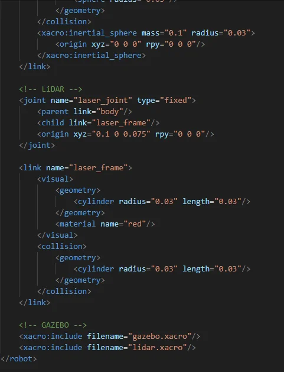

HUMAN AI ROBOTICS
라이다
$ cd ~/car_ws
$ colcon build –symlink-install
$ source install/setup.bash
$ ros2 launch sim_tutorial lidar.launch.py
빌드및실행
라이다시뮬레이션
$ ros2 run teleop_twist_keyboard teleop_twist_keyboard
동작 시키기

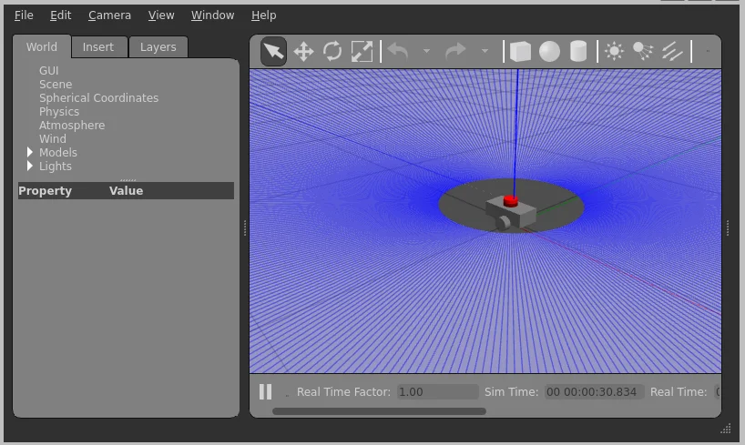

HUMAN AI ROBOTICS
라이다
모델 추가
라이다시뮬레이션
insert
http://model  ~~
모델 추가

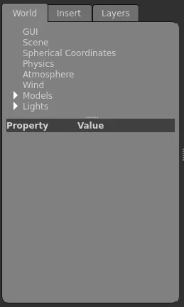

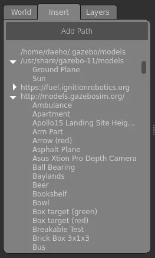

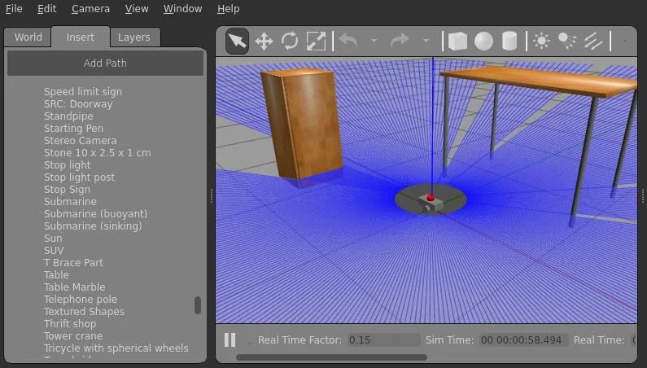

HUMAN AI ROBOTICS
라이다
world 저장
라이다시뮬레이션
File > Save World As
~/car_ws/src/car_simulation/my_world.world

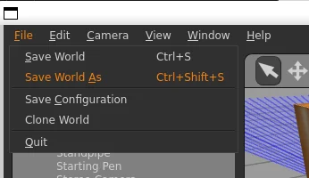

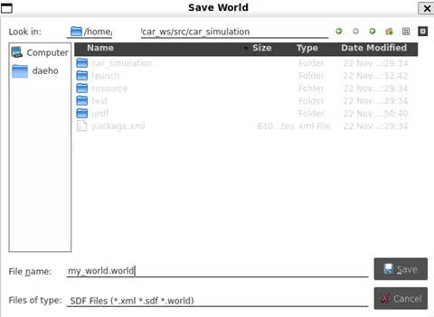

HUMAN AI ROBOTICS
라이다
Rviz 실행 및 설정
라이다시뮬레이션
$ rviz2
Add -> TF
Add -> RobotModel
Add -> LaserScan
Global Options > Fixed Frame : odom
RobotModel > Description Topic : /robot_description
LaserScan > Topic : /scan
> style : Points

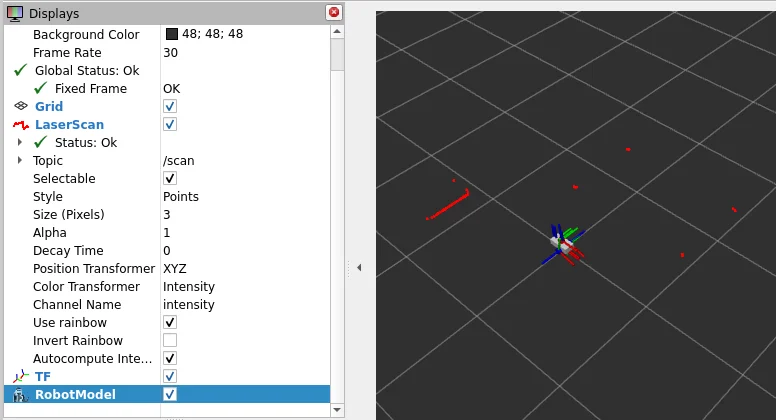

Rokey
84
차동구동로봇패키지
참고
카메라 시뮬레이션

HUMAN AI ROBOTICS
85
카메라
카메라시뮬레이션
camera.xacro 파일 작성
src/sim_tutorial/urdf/camera.xacro
카메라 기능 추가
◦update_rate: 초당 10회 정보를 제공합니다.
◦horizontal_fov: 가로 방향의 FOV (Field of View)는 1.089로 설정했습니
다. Gazebo에서는 세로 방향의 FOV는 이미지 사이즈에 따라서 자동으로 
계산되는 것으로 보입니다.
◦image format: R8G 8B8로 빨강, 초록, 파랑 모두 8비트로 인코딩 됩니다.
◦image widht/height: 이미지의 크기는 가로 640 픽셀, 세로 480 픽셀로 
지정했습니다.
◦frame_name: Camera가 부착된 센서 이름입니다.
<?xml version="1.0"?>
<robot xmlns:xacro="http://www.ros.org/wiki/xacro">
    <gazebo reference="camera_link">
        <material>Gazebo/Red</material>
        <sensor name="camera" type="camera">
            <pose>0 0 0 0 0 0</pose>
            <visualize>true</visualize>
            <update_rate>10</update_rate>
            <camera>
                <horizontal_fov>1.089</horizontal_fov>
                <image>
                    <format>B8G8R8</format>
                    <width>640</width>
                    <height>480</height>
                </image>
                <clip>
                    <near>0.05</near>
                    <far>8.0</far>
                </clip>
            </camera>
            <plugin name="camera_controller" filename="libgazebo_ros_camera.so">
                <frame_name>camera_link_optical</frame_name>
                <min_depth>0.1</min_depth>
                <max_depth>100.0</max_depth>
            </plugin>
        </sensor>
    </gazebo>
</robot>

HUMAN AI ROBOTICS
86
카메라
카메라시뮬레이션
1. xacro 파일 수정
src/sim_tutorial/urdf/car.xacro
카메라 링크 및 기능 파일 추가

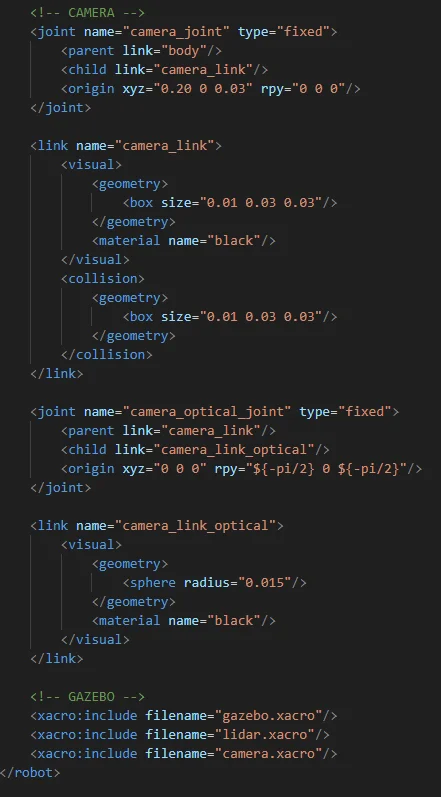

HUMAN AI ROBOTICS
카메라
$ cd ~/car_ws
$ colcon build –symlink-install
$ source install/setup.bash
$ ros2 launch sim_tutorial camera.launch.py 
빌드및실행
카메라시뮬레이션
$ ros2 run teleop_twist_keyboard teleop_twist_keyboard
동작 시키기

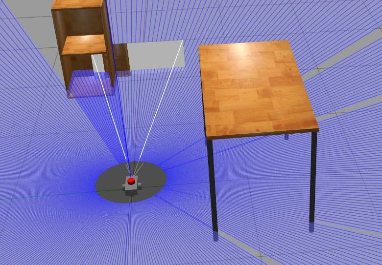

HUMAN AI ROBOTICS
카메라
Add -> TF
Add -> RobotModel
Add -> LaserScan
Add -> Image
Global Options > Fixed Frame : odom
RobotModel > Description Topic : /robot_description
LaserScan > Topic : /scan
> style : Points
Image > Topic : /camera/image_raw
Rviz 실행 및 설정
$ rviz2
카메라시뮬레이션

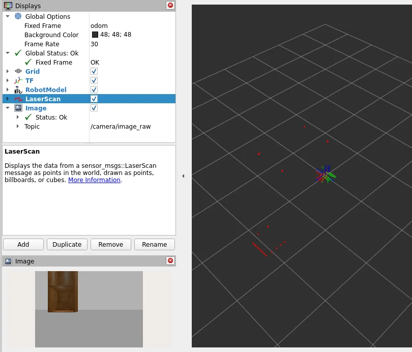

Rokey
89
참고
openManipulatorX , moveit2

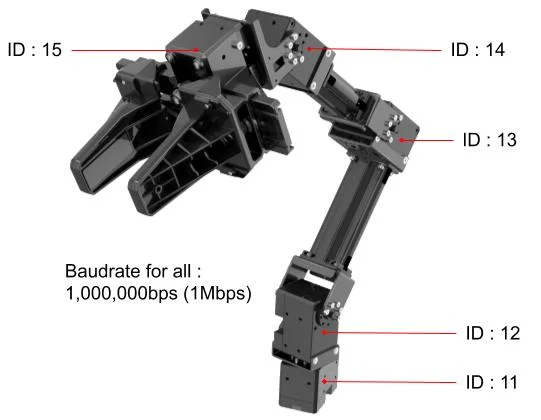

HUMAN AI ROBOTICS
90
OpenManipulatorX
가제보에서 물체를 붙여서 메니퓨레이터 이동시키기
메니퓰레이터
https://emanual.robotis.com/docs/en/platform/openmanipulator_x/quick_start_guide_basic_operation/
OpenManipulatorX 특징:
1.구조 
1. 5개의 다이나믹셀 서보 모터 사용 (XM430-W350-T)
2. 4 자유도 매니퓰레이터 + 그리퍼
3. 최대 가반하중: 0.5kg
4. 작업 반경: 약 380mm
1.하드웨어 구성 
1. 다이나믹셀 모터: 관절 제어
2. U2D2: 다이나믹셀 통신용 컨버터
3. 프레임: 3D 프린팅 가능한 부품들

HUMAN AI ROBOTICS
91
객체(object)와함께로봇팔다루기
설치 과정
메니퓰레이터
sudo apt-get install ros-${ROS_DISTRO}-dynamixel-sdk
sudo apt-get install ros-${ROS_DISTRO}-dynamixel-workbench
sudo apt-get install ros-${ROS_DISTRO}-robotis-manipulator
# 작업 공간 생성
mkdir -p ~/robotis_ws/src
cd ~/robotis_ws/src
# 소스 코드 다운로드
git clone https://github.com/ROBOTIS-GIT/open_manipulator.git
git clone https://github.com/ROBOTIS-GIT/open_manipulator_msgs.git
git clone https://github.com/ROBOTIS-GIT/open_manipulator_dependencies.git
# 빌드
cd ~/robotis_ws
catkin_make

HUMAN AI ROBOTICS
92
객체(object)와함께로봇팔다루기
# ~/.bashrc에 추가
echo 'source ~/robotis_ws/devel/setup.bash' >> ~/.bashrc
source ~/.bashrc
메니퓰레이터
# Gazebo 시뮬레이션
roslaunch open_manipulator_gazebo open_manipulator_gazebo.launch
# RViz 시각화
roslaunch open_manipulator_description open_manipulator_rviz.launch
# 컨트롤러
ros2 launch open_manipulator_x_moveit_config moveit_core.launch.py
#GUI 컨트롤
ros2 launch open_manipulator_x_gui open_manipulator_x_gui.launch.py

HUMAN AI ROBOTICS
93
Open manipulatorX
class ManipulatorXMoveIt(Node):
    def __init__(self):
        super().__init__('manipulatorx_moveit2')
        # Initialize MoveIt2 MoveGroupCommander
        self.group_name = "manipulator"  # Replace with the correct group name from your MoveIt2 
configuration
        self.move_group = MoveGroupCommander(self.group_name)
        # Set up logger
        self.get_logger().info("Manipulator-X MoveIt2 Node Initialized")
    def move_to_xyz(self, x, y, z):
        # Create a Pose object for the target position
        target_pose = Pose()
        target_pose.position.x = x
        target_pose.position.y = y
        target_pose.position.z = z
        
        # Orientation (w=1 indicates no rotation, adjust if needed)
        target_pose.orientation.x = 0.0
        target_pose.orientation.y = 0.0
        target_pose.orientation.z = 0.0
        target_pose.orientation.w = 1.0
        # Set the target pose for the move group
        self.move_group.set_pose_target(target_pose)
        # Plan and execute the motion
        success = self.move_group.go(wait=True)
        self.move_group.stop()  # Ensure no residual movement
        self.move_group.clear_pose_targets()
        if success:
            self.get_logger().info(f"Successfully moved to position: x={x}, y={y}, z={z}")
        else:
            self.get_logger().error("Failed to move to the target position")
def main():
    rclpy.init()
    
    node = ManipulatorXMoveIt()
    # Example target position (replace with your desired 
coordinates)
    target_x = 0.2
    target_y = 0.0
    target_z = 0.2
    # Move to the target position
    node.move_to_xyz(target_x, target_y, target_z)
    rclpy.shutdown()
if __name__ == "__main__":
    main()
import rclpy
from rclpy.node import Node
from moveit_commander import 
MoveGroupCommander
from geometry_msgs.msg import Pose
메니퓰레이터

HUMAN AI ROBOTICS
94
Open manipulatorX
import os
from ament_index_python.packages import get_package_share_directory
from launch import LaunchDescription
from launch.actions import IncludeLaunchDescription
from launch.launch_description_sources import 
PythonLaunchDescriptionSource
from launch_ros.actions import Node
def generate_launch_description():
    # Define package paths
    moveit_config_path = 
get_package_share_directory('turtlebot3_manipulation_moveit_config')
    bringup_path = 
get_package_share_directory('turtlebot3_manipulation_bringup')
    # Include MoveIt2 move_group.launch.py
    move_group_launch = IncludeLaunchDescription(
        PythonLaunchDescriptionSource(
            os.path.join(moveit_config_path, 'launch', 'move_group.launch.py')
        )
    )
    # Include robot hardware launch file
    hardware_launch = IncludeLaunchDescription(
        PythonLaunchDescriptionSource(
            os.path.join(bringup_path, 'launch', 'hardware.launch.py')
        )
    )
메니퓰레이터
    # RViz node to visualize planning
    rviz_config_file = os.path.join(moveit_config_path, 'launch', 'moveit.rviz')
    rviz_node = Node(
        package='rviz2',
        executable='rviz2',
        arguments=['-d', rviz_config_file],
        name='rviz2',
        output='screen'
    )
    return LaunchDescription([
        hardware_launch,
        move_group_launch,
        rviz_node
    ])

HUMAN AI ROBOTICS
95
Open manipulatorX
import rclpy
from rclpy.node import Node
from moveit_commander import MoveGroupCommander
class GripperControl(Node):
    def __init__(self):
        super().__init__('gripper_control')
        self.gripper_group_name = "gripper"  # Replace with the correct group name for 
the gripper
        self.gripper_group = MoveGroupCommander(self.gripper_group_name)
        self.get_logger().info("Gripper Control Node Initialized")
    def open_gripper(self):
        joint_goal = [0.02]  # Adjust value as per the gripper's joint limits (fully open)
        self.gripper_group.go(joint_goal, wait=True)
        self.gripper_group.stop()
        self.get_logger().info("Gripper opened.")
    def close_gripper(self):
        joint_goal = [0.0]  # Adjust value as per the gripper's joint limits (fully closed)
        self.gripper_group.go(joint_goal, wait=True)
        self.gripper_group.stop()
        self.get_logger().info("Gripper closed.")
def main():
    rclpy.init()
    node = GripperControl()
    # Example: Open and then close the gripper
    node.open_gripper()
    rclpy.sleep(2)  # Wait for a while
    node.close_gripper()
    rclpy.shutdown()
if __name__ == '__main__':
    main()
메니퓰레이터

HUMAN AI ROBOTICS
96
Open manipulatorX , moveit2를이용타겟으로이동시키기
#!/usr/bin/env python3
import rclpy
from rclpy.node import Node
from moveit2 import (
    MoveGroupInterface,
    PlanningSceneInterface,
    RobotState
)
from geometry_msgs.msg import Pose, Point, Quaternion
from tf2_ros import TransformException
from tf2_ros.buffer import Buffer
from tf2_ros.transform_listener import TransformListener
class ArmTrajectoryPlanner(Node):
    def __init__(self):
        super().__init__('arm_trajectory_planner')
        
        # Initialize MoveIt2 interfaces
        self.move_group = MoveGroupInterface(
            node=self,
            name="arm",  # Your planning group name
            robot_description="robot_description",
            robot_description_semantic="robot_description_semantic"
        )
        
        self.planning_scene = PlanningSceneInterface(
            node=self
        )
        
# Set planning parameters
        self.move_group.set_planning_time(5.0)
        self.move_group.set_num_planning_attempts(10)
        self.move_group.set_max_velocity_scaling_factor(0.1)
        self.move_group.set_max_acceleration_scaling_factor(0.1)
    def plan_cartesian_path(self, waypoints):
        """Plan a Cartesian path through given waypoints."""
        
        (plan, fraction) = self.move_group.compute_cartesian_path(
            waypoints,    # waypoints to follow
            0.01,         # eef_step
            0.0,          # jump_threshold
            True         # avoid_collisions
        )
        
        return plan, fraction
    def execute_trajectory(self, plan):
        """Execute a planned trajectory."""
        
        success = self.move_group.execute(plan, wait=True)
        return success
    def move_to_pose(self, target_pose):
        """Plan and execute movement to a target pose."""
        
        self.move_group.set_pose_target(target_pose)
        success = self.move_group.go(wait=True)
        self.move_group.clear_pose_targets()
        return success
메니퓰레이터

HUMAN AI ROBOTICS
97
Open manipulatorX
def main():
    rclpy.init()
    
    planner = ArmTrajectoryPlanner()
    
    # Example target pose
    target_pose = Pose()
    target_pose.position = Point(x=0.4, y=0.0, z=0.4)
    target_pose.orientation = Quaternion(x=0.0, y=0.0, z=0.0, w=1.0)
    
    # Move to single target pose
    success = planner.move_to_pose(target_pose)
    planner.get_logger().info(f"Move to pose success: {success}")
    
    # Example Cartesian path
    waypoints = []
    
    # Start with current pose
    start_pose = planner.move_group.get_current_pose().pose
    waypoints.append(start_pose)
    
    # Add waypoints relative to current pose
    wpose = Pose()
    wpose.position = Point(x=start_pose.position.x + 0.1,
                         y=start_pose.position.y,
                         z=start_pose.position.z)
    wpose.orientation = start_pose.orientation
    waypoints.append(wpose)
    
wpose = Pose()
    wpose.position = Point(x=start_pose.position.x + 0.1,
                         y=start_pose.position.y + 0.1,
                         z=start_pose.position.z)
    wpose.orientation = start_pose.orientation
    waypoints.append(wpose)
    
    # Plan and execute Cartesian path
    plan, fraction = planner.plan_cartesian_path(waypoints)
    planner.get_logger().info(f"Planned {fraction * 100}% of Cartesian path")
    
    if fraction > 0.9:  # Execute only if we can achieve at least 90% of the path
        success = planner.execute_trajectory(plan)
        planner.get_logger().info(f"Cartesian path execution success: {success}")
    
    rclpy.shutdown()
if __name__ == '__main__':
    main()
메니퓰레이터

HUMAN AI ROBOTICS
98
객체(object)와함께로봇팔다루기
https://github.com/minwoominwoominwoo7/op_moveit_client
가제보에서 물체를 붙여서 메니퓨레이터 이동시키기
메니퓰레이터

HUMAN AI ROBOTICS
99
static_transform_publisher
launch 파일 안에 추가
$ ros2 run tf2_ros static_transform_publisher 1 -1 0 0 0 0.707 base_link arm_base_link 
static_transform_publisher x y z yaw pitch roll frame_id child_frame_id period_in_ms
•로봇의 센서 위치 정의 
•고정된 좌표계 관계 설정 
•로봇 모델의 기본 구조 정의 
•시뮬레이션 환경 설정 
메니퓰레이터

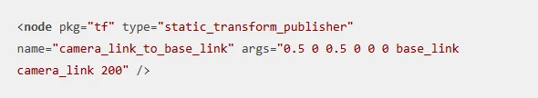

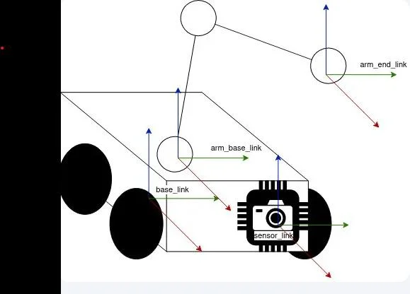

Rokey
10
0
참고
Make a world

HUMAN AI ROBOTICS
101
시뮬레이션월드만들기
Edit 메뉴에서 building editor 를 클릭한다.
그러면 다음과 같은 building editor화면이 나타난다.
Make a world

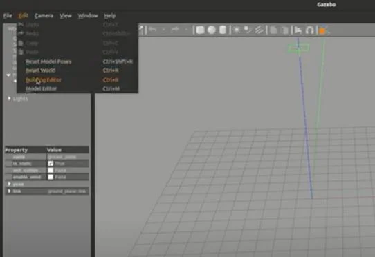

HUMAN AI ROBOTICS
102
시뮬레이션월드만들기
화면에서 왼쪽에는 벽, 문, 계단 등을 만들수 있는 항목들이 있고, 모눈종이처럼 생긴 구역에서 위에서 
내려다보는 평면도 관점의 맵을 볼 수 있다. 이 모눈종이 구역에서 벽, 계단 등을 생성, 배치할 수 있다 아래쪽 
구역은 실제 gazebo 공간상에 생성된 3차원 맵을 보여준다.
Make a world
Model 이름으로 저장한다.

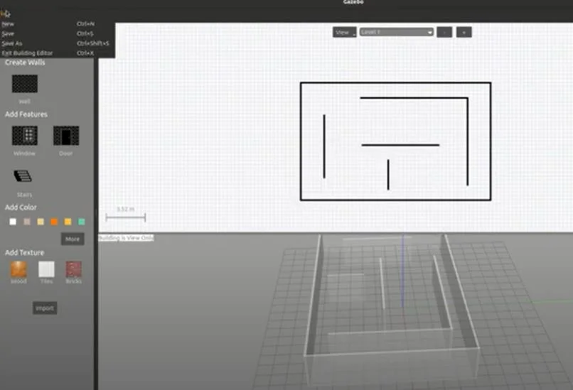

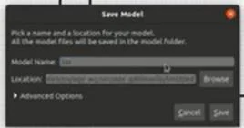

HUMAN AI ROBOTICS
103
시뮬레이션월드만들기
계단 만들기
Make a world

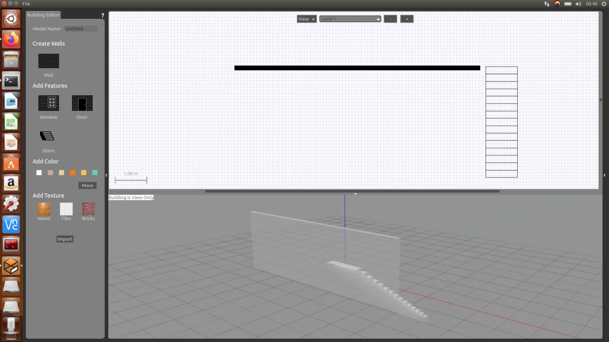

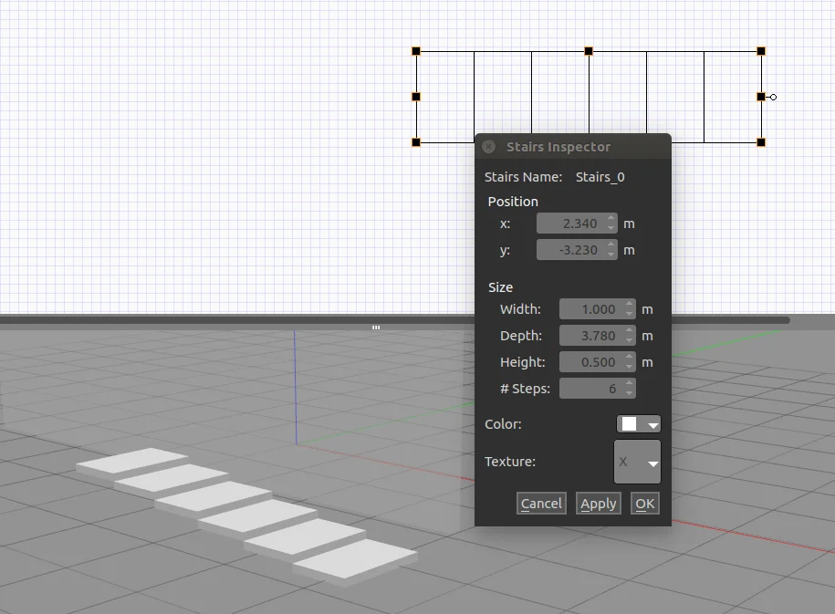

HUMAN AI ROBOTICS
104
시뮬레이션월드만들기
표면 이미지 추가 및 World 저장하기
Make a world
Add Texture
Save as xxx.world
https://www.youtube.com/watch?v=7McYSJFAqlU

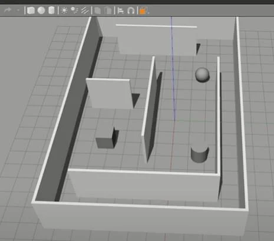

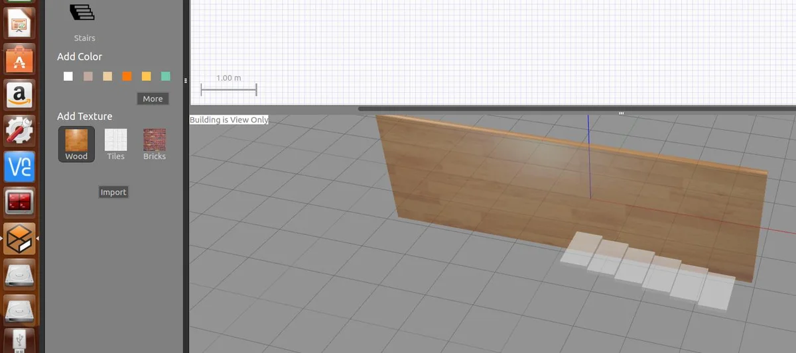

Rokey
10
5
차동구동로봇패키지
참고
예시 프로젝트

HUMAN AI ROBOTICS
Turtlebot3 Manipulation
https://emanual.robotis.com/docs/en/platform/turtlebot3/manipulation/

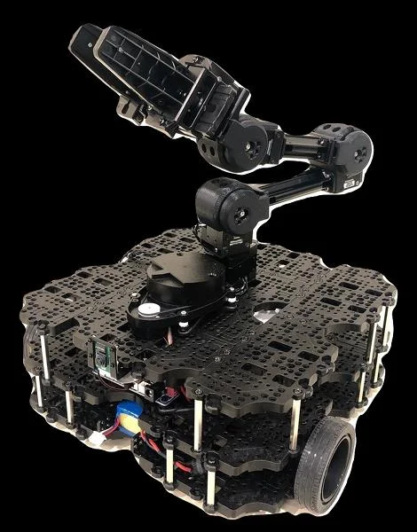

HUMAN AI ROBOTICS
Turtlebot3 Manipulation
TurtleBot3 SBC
$ export OPENCR_PORT=/dev/ttyACM0
$ export OPENCR_MODEL=turtlebot3_manipulation
$ rm -rf ./opencr_update.tar.bz2
$ wget https://github.com/ROBOTIS-GIT/OpenCR-Binaries/raw/master/turtlebot3/ROS2/latest/opencr_update.tar.bz2
$ tar -xvf opencr_update.tar.bz2
$ cd ./opencr_update
$ ./update.sh $OPENCR_PORT $OPENCR_MODEL.opencr
Simulation
ros2 launch turtlebot3_manipulation_bringup gazebo.launch.py
ros2 launch turtlebot3_manipulation_bringup 
gazebo.launch.py start_rviz:=true
또는
가상환경

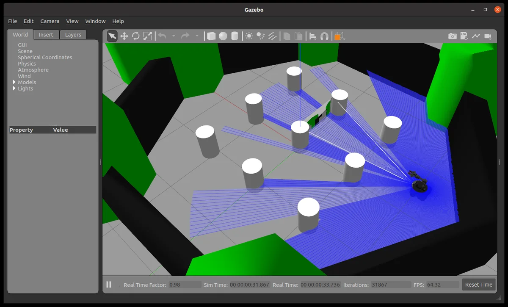

HUMAN AI ROBOTICS
Turtlebot3 Manipulation
ros2 launch turtlebot3_manipulation_moveit_config moveit_gazebo.launch.py
ros2 launch turtlebot3_manipulation_bringup gazebo.launch.py
ros2 run nav2_map_server map_saver_cli -f ~/map
ros2 launch turtlebot3_manipulation_cartographer cartographer.launch.py
가상환경

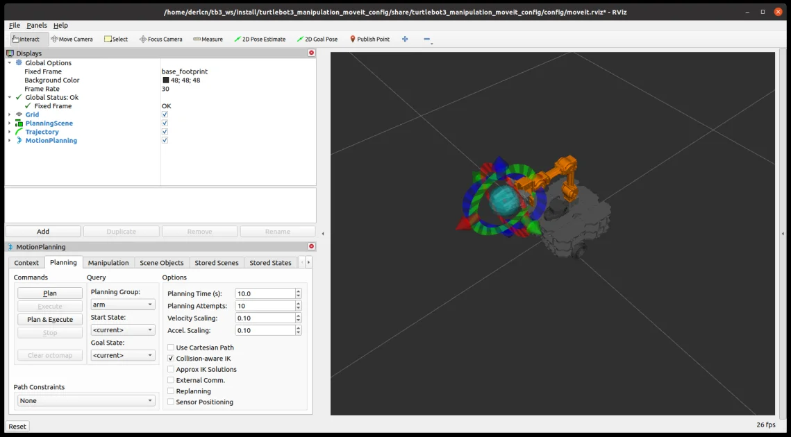

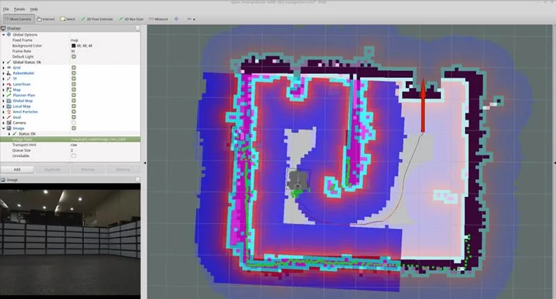

HUMAN AI ROBOTICS
Turtlebot3 Manipulation
가상환경

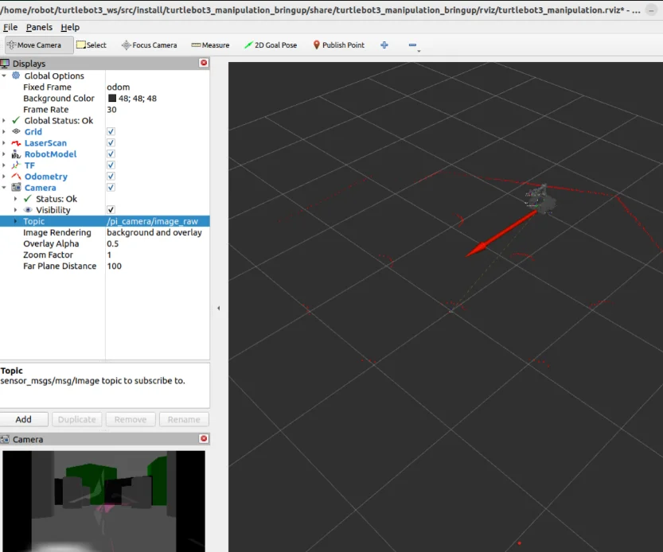

HUMAN AI ROBOTICS
gazebo에서 3D맵 만들기
가상환경
Edit 메뉴에서 building editor 를 클릭한다.
화면에서 왼쪽에는 벽, 문, 계단 등을 만들수 있는 항목들이 있고, 모눈종이처럼 생긴 구역에서 위에서 내려다보
는 평면도 관점의 맵을 볼 수 있다. 이 모눈종이 구역에서 벽, 계단 등을 생성, 배치할 수 있다 아래쪽 구역은 실제 
gazebo 공간상에 생성된 3차원 맵을 보여준다.

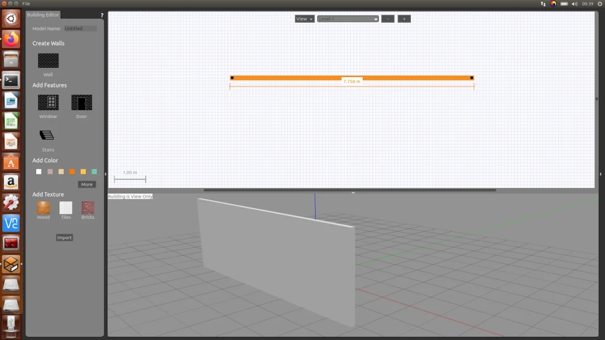

HUMAN AI ROBOTICS
gazebo에서 3D맵 만들기
가상환경
Add texture 기능으로 물체의 표면 질감?을 바꿔줄수 있다.
building editor 에서 맵을 다 만들었다면 왼쪽 상단의 File 탭에서 Save as..를 클릭하고
이름을 바꿔준 뒤, 저장한다.
저장한 뒤 File -> exit building editor 를 눌러 buildig editor 화면에서 나간다.

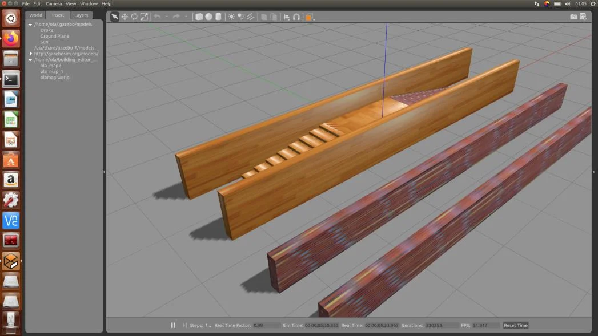

HUMAN AI ROBOTICS
gazebo에서 3D맵 만들기
가상환경
Gazebo에서 생성한 world를 SDF 파일로부터 불러와 실행하는 방법을 설명해드리겠습니다.
1.터미널에서 직접 실행하는 방법:
gazebo <world_file_path>.sdf
2. launch 파일을 통해 실행하는 방법:
<launch>
  <!-- Gazebo 서버와 클라이언트 실행 -->
  <include file="$(find gazebo_ros)/launch/empty_world.launch">
    <arg name="world_name" value="$(find 
your_package)/worlds/your_world.sdf"/>
    <arg name="paused" value="false"/>
    <arg name="use_sim_time" value="true"/>
    <arg name="gui" value="true"/>
    <arg name="headless" value="false"/>
    <arg name="debug" value="false"/>
  </include>
</launch>

HUMAN AI ROBOTICS
복수의정찰로봇관제시스템
가상환경

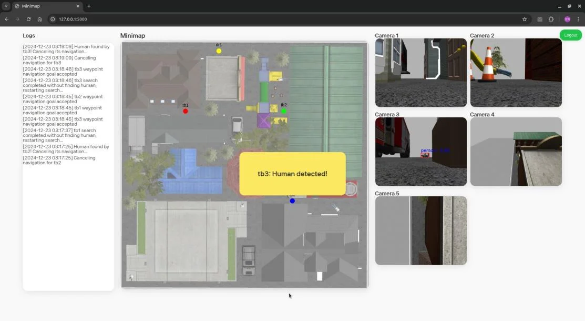

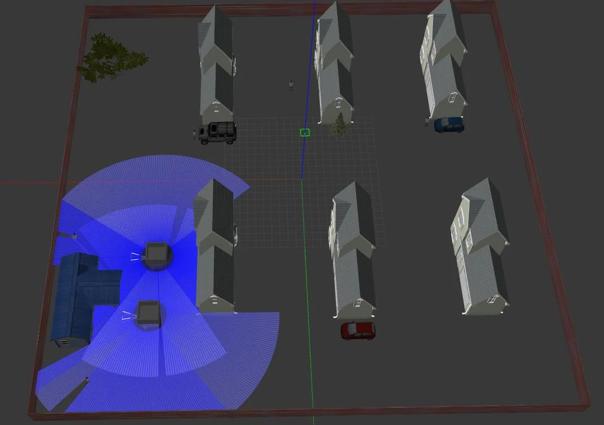

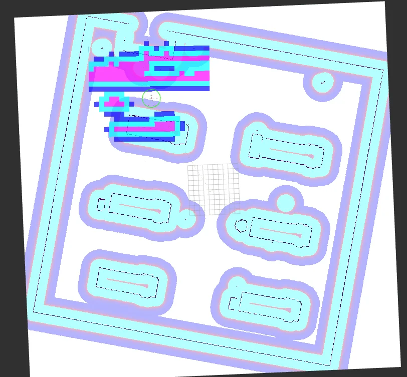

HUMAN AI ROBOTICS
로봇암을이용한자동주차시스템
최대 높이 : 125m
6-DoF로 설계
MoveIT2 구동
가상환경

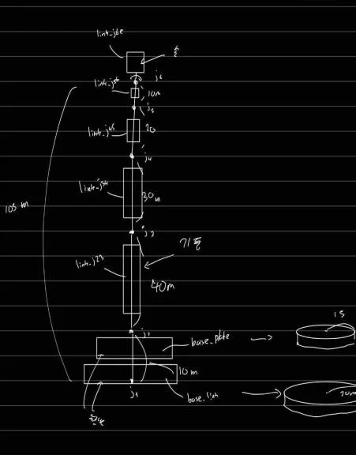

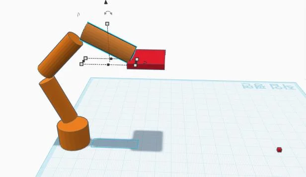

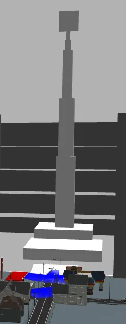

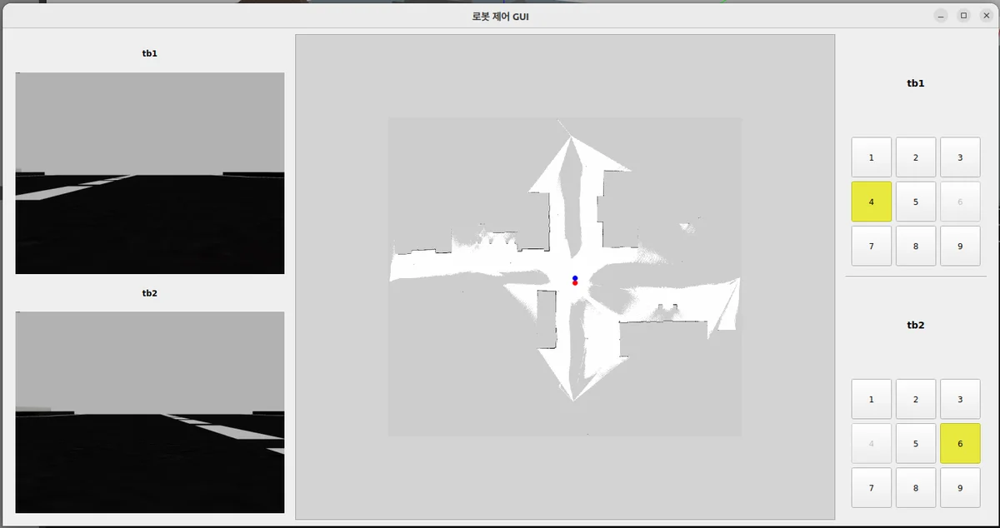

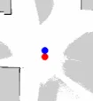

HUMAN AI ROBOTICS
드론모델을적용한정찰
Drone
• sjtu_drone 모델을 가져와서 사용
• 자세제어가 들어가 있는 점이 장점  
https://github.com/NovoG93/sjtu_drone
가상환경

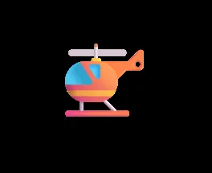

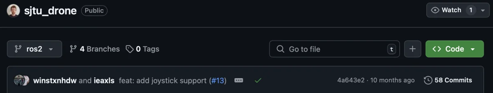

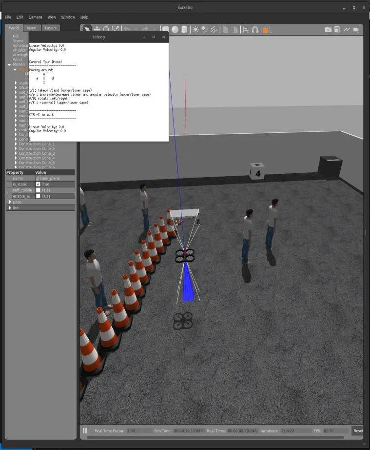

Rokey
11
6
참고
감사합니다.

