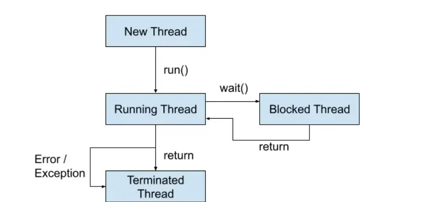
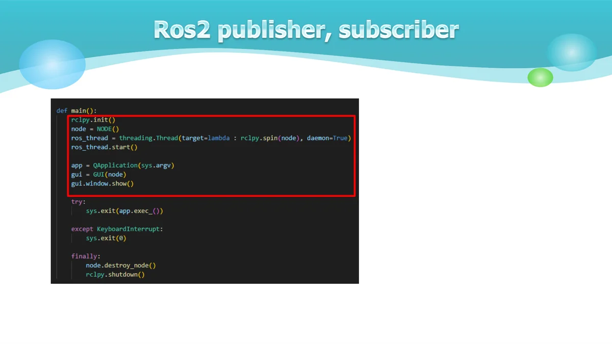
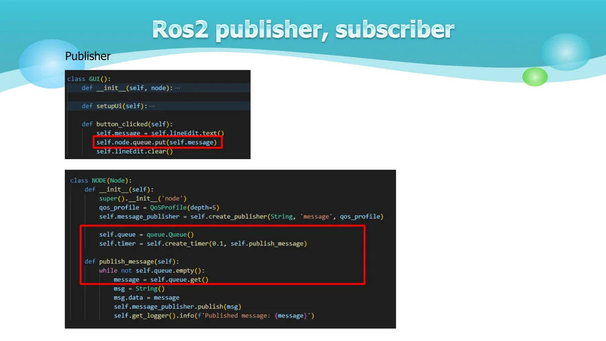
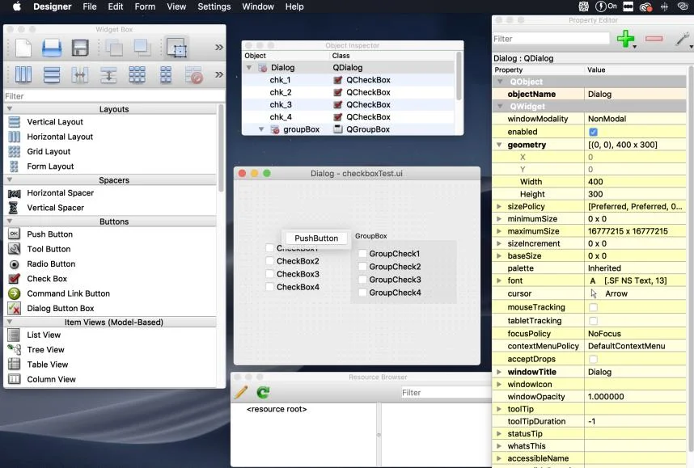
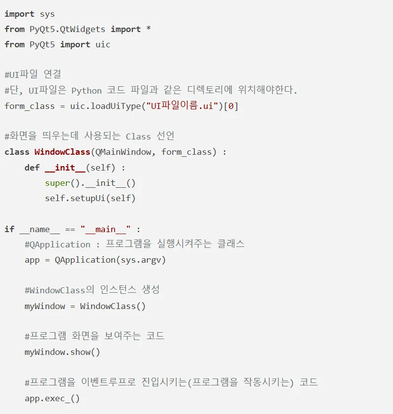
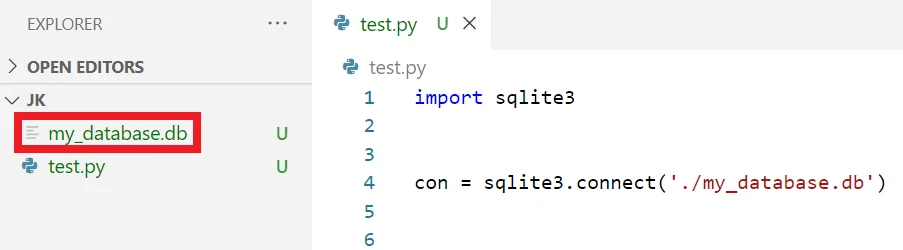

# 쓰레드와 데이터베이스

Thread와Sqlite3
- 방화벽 해지 sudo ufw disable
- Wifi 설정 Rokey / rokey12345
- 같은ROS_DOMAIN_ID에 영향을 안 받게하기 export $ROS_LOCALHOST_ONLY=1 김 루 진 강사

쓰 레드를 사용하는 주된 이유는 프로그램의 성능과 응답성을 향상시키기 위해서입니다.
특히ROS2와PyQt GUI를 함께 사용할 때 더욱 중요합니다.

프로세스와 쓰 레드
프로그램이 하나의 일을 처리할 때,
CPU는 메모리에 프로그램에 관련된
DATA를 저장하고 처리하게 된다.
이렇게 일련의 프로그램을 진행하는 것
을 프로세스(Process)라고 한다.
하나의 프로그램을 실행시키면, 그프
로 그램은 한 개의 프로세스를 가지게 된
다.

프로세스와 쓰 레드
새로운 프로세스를 생성하는 것을 프로세스 포크(Fork)
프로세스는 프로그램이 작동하기에 필요한 많은 데이터를 가지고 있다.

프로세스 포크를 하게 되면, 새로 생성된 프로세스는 이전의 프로세스와 동일한 데이터를 카피

프로세스 간의 데이터 공유를 위해 많은 뒤처리가 필요하고, 또한 컴퓨터 자원의 소모 야기

새로운 프로세스는 필요하지 않지만, 하나의 일을 따로 처리해야할 때 사용하는 것이 쓰 레드
멀티 쓰 레드와 멀티 프로세스의 가장 큰 차이는 자원 공유

GUI 응답성 유지
GUI는메인쓰레드(이벤트루프)에서 실행됨
시간이 오래 걸리는 작업을 메인 쓰 레드에서 실행하면GUI가멈춤
별도 쓰 레드로 실행하면GUI가 계속 반응 가능
ROS2 통신 처리
ROS2의publish/subscribe 통신은 지속적으로 발생
메인 쓰 레드에서 처리하면 다른 작업 수행 불가
별도 쓰 레드로 분리하여 동시 처리 가능

자원 효율성
멀티 코어CPU 활용 가능
작업을 병렬로 처리하여 성능 향상
시스템 리소스 효율적 사용
데드 락 방지
GUI 이벤트 처리와ROS2 통신을 분리
상호 블로킹 현상 방지
안정적인 프로그램 실행
threading 모듈의Thread 클래스를 사용
Thread 객체를 생성할 때target 매개 변수에 실행할 함수를 지정하고, 필요에 따라args 매개변수를 사용

파이썬에서 클래스를 쓰 레드로 만들기 위해서는threading 모듈의Thread 클래스를 상속하거나,
Thread 인스턴스를 생성할 때target 매개 변수에 함수를 지정하는 방법을 사용

생성 단계
시작(Started) 단계

실행(Running) 단계

대기(Waiting) 단계
종료(Terminated) 단계

Publisher.py
Subscriber.py
Main thread
Gui (pyqt)
node
Sub thread
Gui (pyqt)
node
Sub thread
Main thread

Publisher
Subscriber
Gui (pyqt)
node
Gui (pyqt)
node
Queue
Signal
Topic

Subscriber

$ sudo pip3 install PySide2
$ designer
Qt Designer의UI는 저장 버튼(Control + S / Command + S)를
누르면 저장을 할 수 있습니다. 저장된UI파일은XML의
형식을 가짐
Python 코드에서 이XML 파일을Import한 후 위젯들에
기능을 할당해 주면 실제로 기능을 가지고 작동하는
GUI프로그램이 완성
직접XML형식의ui파일을 수정하여 레이아웃을 수정할
수도 있습니다.

UI파일을Python에Import하여 사용하는 방법
https://wikidocs.net/35481

체계적으로 구조화된 데이터의 집합으로, 효율적인 데이터 관리와 검색을 위한 시스템
주요 특징:
1.데이터 독립성
-물리적 독립성: 저장 구조가 변경되어도 응용 프로그램에 영향 없음
-논리적 독립성: 논리적 구조 변경이 응용 프로그램에 영향 없음
2.데이터 무결성
-정확성과 일관성 보장
-제약 조건을 통한 데이터 품질 유지
-중복 최소화
3.동시성 제어
-여러 사용자의 동시 접근 관리
-데이터 일관성 유지
-트랜잭션 처리

-테이블(릴레이 션)
-필드(속성, 컬럼)
-레코드(튜플, 행)
-키(기본 키, 외래키)
-인덱스
-뷰
DDL(Data Definition Language)
DML(Data Manipulation Language)

One-to-One (1:1)
CREATE TABLE user (
user_id INT PRIMARY KEY,
name VARCHAR(50)
);
CREATE TABLE passport (
passport_id INT PRIMARY KEY,
user_id INT UNIQUE,
FOREIGN KEY (user_id) REFERENCES user(user_id)
);

One-to-Many (1:N)
CREATE TABLE department (
dept_id INT PRIMARY KEY,
dept_name VARCHAR(50)
);
CREATE TABLE employee (
emp_id INT PRIMARY KEY,
dept_id INT,
name VARCHAR(50),
FOREIGN KEY (dept_id) REFERENCES
department(dept_id)
);

Many-to-Many (N:M)
CREATE TABLE student (
student_id INT PRIMARY KEY,
name VARCHAR(50)
);
CREATE TABLE course (
course_id INT PRIMARY KEY,
title VARCHAR(100)
);
CREATE TABLE enrollment (
student_id INT,
course_id INT,
PRIMARY KEY (student_id, course_id),
FOREIGN KEY (student_id) REFERENCES student(student_id),
FOREIGN KEY (course_id) REFERENCES course(course_id)
);

SQLite3는 파일 기반의 경량 관계형 데이터 베이스 시스템
# 장점
- 서버가 필요 없음(파일 기반)
- 설치가 필요 없음(Python 기본 내장)
- 가볍고 빠름
- 단일 파일로 관리
- 트랜잭션 지원
- Zero-configuration
# 제한사항
- 동시 접근 제한
- 대규모 데이터에는 부적합
- 복잡한 쿼리에 제한적

-- 테이블 정보(table_order)
CREATE TABLE IF NOT EXISTS table_order (
table_id INTEGER PRIMARY KEY AUTOINCREMENT,
table_number INTEGER NOT NULL,
capacity INTEGER NOT NULL,
status TEXT DEFAULT 'empty' CHECK(status IN ('empty', 'occupied', 'reserved')),
created_at TIMESTAMP DEFAULT CURRENT_TIMESTAMP
);

-- 메뉴 정보(menu)
CREATE TABLE IF NOT EXISTS menu (
menu_id INTEGER PRIMARY KEY AUTOINCREMENT,
name TEXT NOT NULL,
price REAL NOT NULL,
category TEXT NOT NULL,
description TEXT,
available BOOLEAN DEFAULT 1,
created_at TIMESTAMP DEFAULT CURRENT_TIMESTAMP
);

-- 주문 목록(order_list)
CREATE TABLE IF NOT EXISTS order_list (
order_id INTEGER PRIMARY KEY AUTOINCREMENT,
table_id INTEGER,
total_amount REAL DEFAULT 0,
order_status TEXT DEFAULT 'pending' CHECK(order_status IN ('pending', 'preparing', 'served', 'completed',
'cancelled')),
created_at TIMESTAMP DEFAULT CURRENT_TIMESTAMP,
FOREIGN KEY (table_id) REFERENCES table_order(table_id)
);

-- 주문 상세 항목(order_items)
CREATE TABLE IF NOT EXISTS order_items (
order_item_id INTEGER PRIMARY KEY AUTOINCREMENT,
order_id INTEGER,
menu_id INTEGER,
quantity INTEGER NOT NULL,
price REAL NOT NULL,
subtotal REAL NOT NULL,
created_at TIMESTAMP DEFAULT CURRENT_TIMESTAMP,
FOREIGN KEY (order_id) REFERENCES order_list(order_id),
FOREIGN KEY (menu_id) REFERENCES menu(menu_id)
);

-- 취소 정보(cancel)
CREATE TABLE IF NOT EXISTS cancel (
cancel_id INTEGER PRIMARY KEY AUTOINCREMENT,
order_id INTEGER,
cancel_reason TEXT NOT NULL,
refund_amount REAL DEFAULT 0,
cancel_status TEXT DEFAULT 'pending' CHECK(cancel_status IN ('pending', 'approved', 'rejected')),
created_at TIMESTAMP DEFAULT CURRENT_TIMESTAMP,
FOREIGN KEY (order_id) REFERENCES order_list(order_id)
);

데이터 베이스를 생성할 때는 간단히connect() 메서드를 사용하면 된다.
이때 메서드의 인자로 넣은 값이 데이터 베이스 파일의 경로가 된다.
예를 들어'my_database.db'라는 파일을 생성하고자한다면 다음과 같이 한다.
현재'my_database.db'라는 데이터 베이스 파일이 없기 때문에, 새롭게 생성된 것을 확인할 수 있다.

SQL 구문을 이용하기 위해서는cursor 객체가 필요하다.
cursor 객체를 이용하여 실제로 데이터베이스에 테이블(table)을 삽입하거나, 테이블(table)을 조회할 수 있다.
예를 들어 다음의 명령어는Course(과목)라는 이름의 테이블을 생성한다.
이후에 생성된 테이블 정보를 조회한다.
cursor = con.cursor()
SQL = "CREATE TABLE Course (Course_ID int primary key not null, Course_Name text,
Course_Date date);"
cursor.execute(SQL)
SQL = "SELECT name FROM sqlite_master WHERE type='table';"
cursor.execute(SQL)
print(cursor.fetchall())
SQL = "SELECT sql FROM sqlite_master WHERE type='table';"
cursor.execute(SQL)
print(cursor.fetchall())
con.close()

SQL = "INSERT INTO Course VALUES(1, 'Algorithm', '2021-03-01');"
cursor.execute(SQL)
SQL = "INSERT INTO Course VALUES(2, 'Data Structure', '2021-03-02');"
cursor.execute(SQL)
SQL = "INSERT INTO Course VALUES(3, 'Computer Architecture', '2021-03-05');"
cursor.execute(SQL)
con.commit()
SQL = "SELECT * FROM Course;"
cursor.execute(SQL)
print(cursor.fetchall())
con.close()

데이터 삭제는DELETE 구문을 사용하면 된다. 예를 들어Course 테이블에 있는 모든 데이터(row)를
삭제하기 위해서는 다음과 같이 하면 된다. INSERT 구문과 마찬가지로 실행 뒤에commit() 메서드를
이용해DB에 반영할 수 있다. 위 코드를 실행하면Course 테이블에 존재하는 모든 데이터가 삭제되기
때문에, 조회 결과가 없다.
cursor = con.cursor()
SQL = "DELETE FROM Course;"
cursor.execute(SQL)
con.commit()
SQL = "SELECT * FROM Course;"
cursor.execute(SQL)
print(cursor.fetchall())
con.close()

def insert_course(course_id, course_name, course_date):
con = sqlite3.connect(database_name)
cursor = con.cursor()
SQL = "INSERT INTO Course VALUES(?, ?, ?);"
cursor.execute(SQL, (course_id, course_name,
course_date))
con.commit()
con.close()

def insert_course_list(course_list):
con = sqlite3.connect(database_name)
cursor = con.cursor()
SQL = "INSERT INTO Course VALUES(?, ?, ?);"
cursor.executemany(SQL, course_list)
con.commit()
con.close()

def search_course_by_name(course_name):
con = sqlite3.connect(database_name)
cursor = con.cursor()
SQL = "SELECT * FROM Course WHERE course_name = ?;"
cursor.execute(SQL, (course_name, ))
return cursor.fetchall()

def update_course_by_id(course_id, course_name, course_date):
con = sqlite3.connect(database_name)
cursor = con.cursor()
SQL = "UPDATE Course SET course_name = ?, course_date = ? WHERE course_id = ?;"
cursor.execute(SQL, (course_name, course_date, course_id))
con.commit()
con.close()

def delete_course_by_id(course_id):
con = sqlite3.connect(database_name)
cursor = con.cursor()
SQL = "DELETE FROM Course WHERE course_id = ?;"
cursor.execute(SQL, (course_id, ))
con.commit()
con.close()

