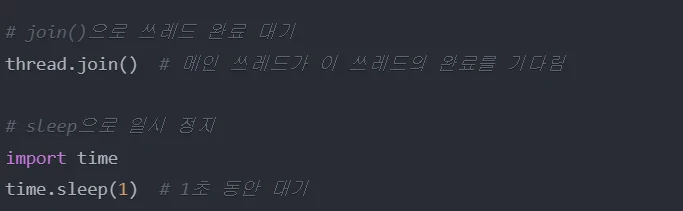
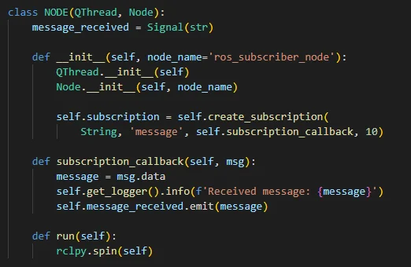
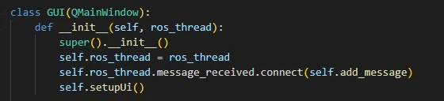

# 쓰레드와 데이터베이스

Thread와Sqlite3
•
방화벽해지
        sudo ufw disable
•
Wifi 설정
        Rokey / rokey12345 
•
같은ROS_DOMAIN_ID에영향을안받게하기
       export $ROS_LOCALHOST_ONLY=1
김루진강사

쓰레드를사용하는주된이유는프로그램의성능과응답성을향상시키기위해서입니다. 
특히ROS2와PyQt GUI를함께사용할때더욱중요합니다.

프로세스와쓰레드
프로그램이하나의일을처리할때, 
CPU는메모리에프로그램에관련된
DATA를저장하고처리하게된다.
이렇게일련의프로그램을진행하는것
을프로세스(Process)라고한다.
하나의프로그램을실행시키면, 그프
로그램은한개의프로세스를가지게된
다.

프로세스와쓰레드
새로운프로세스를생성하는것을프로세스포크(Fork)
프로세스는프로그램이작동하기에필요한많은데이터를가지고있다. 

프로세스포크를하게되면, 새로생성된프로세스는이전의프로세스와동일한데이터를카피

프로세스간의데이터공유를위해많은뒤처리가필요하고, 또한컴퓨터자원의소모야기

새로운프로세스는필요하지않지만, 하나의일을따로처리해야할때사용하는것이쓰레드
멀티쓰레드와멀티프로세스의가장큰차이는자원공유

GUI 응답성유지
GUI는메인쓰레드(이벤트루프)에서실행됨
시간이오래걸리는작업을메인쓰레드에서실행하면GUI가멈춤
별도쓰레드로실행하면GUI가계속반응가능
ROS2 통신처리
ROS2의publish/subscribe 통신은지속적으로발생
메인쓰레드에서처리하면다른작업수행불가
별도쓰레드로분리하여동시처리가능

자원효율성
멀티코어CPU 활용가능
작업을병렬로처리하여성능향상
시스템리소스효율적사용
데드락방지
GUI 이벤트처리와ROS2 통신을분리
상호블로킹현상방지
안정적인프로그램실행
threading 모듈의Thread 클래스를사용
Thread 객체를생성할때target 매개변수에실행할함수를지정하고, 필요에따라args 매개변수를사용

파이썬에서클래스를쓰레드로만들기위해서는threading 모듈의Thread 클래스를상속하거나, 
Thread 인스턴스를생성할때target 매개변수에함수를지정하는방법을사용

생성단계
시작(Started) 단계

실행(Running) 단계

대기(Waiting) 단계
종료(Terminated) 단계

Publisher.py
Subscriber.py
Main thread
Gui (pyqt)
node
Sub thread
Gui (pyqt)
node
Sub thread
Main thread

Publisher
Subscriber
Gui (pyqt)
node
Gui (pyqt)
node
Queue
Signal
Topic

Subscriber

$ sudo pip3 install PySide2
$ designer
Qt Designer의UI는저장버튼(Control + S / Command + S)를
누르면저장을할수있습니다. 저장된UI파일은XML의
형식을가짐
Python 코드에서이XML 파일을Import한후위젯들에
기능을할당해주면실제로기능을가지고작동하는
GUI프로그램이완성
직접XML형식의ui파일을수정하여레이아웃을수정할
수도있습니다.

UI파일을Python에Import하여사용하는방법
https://wikidocs.net/35481

체계적으로구조화된데이터의집합으로, 효율적인데이터관리와검색을위한시스템
주요특징:
1.데이터독립성
•물리적독립성: 저장구조가변경되어도응용프로그램에영향없음
•논리적독립성: 논리적구조변경이응용프로그램에영향없음
2.데이터무결성
•정확성과일관성보장
•제약조건을통한데이터품질유지
•중복최소화
3.동시성제어
•여러사용자의동시접근관리
•데이터일관성유지
•트랜잭션처리

•테이블(릴레이션) 
•필드(속성, 컬럼) 
•레코드(튜플, 행) 
•키(기본키, 외래키) 
•인덱스
•뷰
DDL(Data Definition Language)
DML(Data Manipulation Language)

One-to-One (1:1)
CREATE TABLE user (
user_id INT PRIMARY KEY,
name VARCHAR(50)
);
CREATE TABLE passport (
passport_id INT PRIMARY KEY,
user_id INT UNIQUE,
FOREIGN KEY (user_id) REFERENCES user(user_id)
);

One-to-Many (1:N)
CREATE TABLE department (
dept_id INT PRIMARY KEY,
dept_name VARCHAR(50)
);
CREATE TABLE employee (
emp_id INT PRIMARY KEY,
dept_id INT,
name VARCHAR(50),
FOREIGN KEY (dept_id) REFERENCES 
department(dept_id)
);

Many-to-Many (N:M)
CREATE TABLE student (
student_id INT PRIMARY KEY,
name VARCHAR(50)
);
CREATE TABLE course (
course_id INT PRIMARY KEY,
title VARCHAR(100)
);
CREATE TABLE enrollment (
student_id INT,
course_id INT,
PRIMARY KEY (student_id, course_id),
FOREIGN KEY (student_id) REFERENCES student(student_id),
FOREIGN KEY (course_id) REFERENCES course(course_id)
);

SQLite3는파일기반의경량관계형데이터베이스시스템
# 장점
- 서버가필요없음(파일기반)
- 설치가필요없음(Python 기본내장)
- 가볍고빠름
- 단일파일로관리
- 트랜잭션지원
- Zero-configuration
# 제한사항
- 동시접근제한
- 대규모데이터에는부적합
- 복잡한쿼리에제한적

-- 테이블정보(table_order)
CREATE TABLE IF NOT EXISTS table_order (
table_id INTEGER PRIMARY KEY AUTOINCREMENT,
table_number INTEGER NOT NULL,
capacity INTEGER NOT NULL,
status TEXT DEFAULT 'empty' CHECK(status IN ('empty', 'occupied', 'reserved')),
created_at TIMESTAMP DEFAULT CURRENT_TIMESTAMP
);

-- 메뉴정보(menu)
CREATE TABLE IF NOT EXISTS menu (
menu_id INTEGER PRIMARY KEY AUTOINCREMENT,
name TEXT NOT NULL,
price REAL NOT NULL,
category TEXT NOT NULL,
description TEXT,
available BOOLEAN DEFAULT 1,
created_at TIMESTAMP DEFAULT CURRENT_TIMESTAMP
);

-- 주문목록(order_list)
CREATE TABLE IF NOT EXISTS order_list (
order_id INTEGER PRIMARY KEY AUTOINCREMENT,
table_id INTEGER,
total_amount REAL DEFAULT 0,
order_status TEXT DEFAULT 'pending' CHECK(order_status IN ('pending', 'preparing', 'served', 'completed', 
'cancelled')),
created_at TIMESTAMP DEFAULT CURRENT_TIMESTAMP,
FOREIGN KEY (table_id) REFERENCES table_order(table_id)
);

-- 주문상세항목(order_items)
CREATE TABLE IF NOT EXISTS order_items (
order_item_id INTEGER PRIMARY KEY AUTOINCREMENT,
order_id INTEGER,
menu_id INTEGER,
quantity INTEGER NOT NULL,
price REAL NOT NULL,
subtotal REAL NOT NULL,
created_at TIMESTAMP DEFAULT CURRENT_TIMESTAMP,
FOREIGN KEY (order_id) REFERENCES order_list(order_id),
FOREIGN KEY (menu_id) REFERENCES menu(menu_id)
);

-- 취소정보(cancel)
CREATE TABLE IF NOT EXISTS cancel (
cancel_id INTEGER PRIMARY KEY AUTOINCREMENT,
order_id INTEGER,
cancel_reason TEXT NOT NULL,
refund_amount REAL DEFAULT 0,
cancel_status TEXT DEFAULT 'pending' CHECK(cancel_status IN ('pending', 'approved', 'rejected')),
created_at TIMESTAMP DEFAULT CURRENT_TIMESTAMP,
FOREIGN KEY (order_id) REFERENCES order_list(order_id)
);

데이터베이스를생성할때는간단히connect() 메서드를사용하면된다. 
이때메서드의인자로넣은값이데이터베이스파일의경로가된다. 
예를들어'my_database.db'라는파일을생성하고자한다면다음과같이한다. 
현재'my_database.db'라는데이터베이스파일이없기때문에, 새롭게생성된것을확인할수있다.

SQL 구문을이용하기위해서는cursor 객체가필요하다. 
cursor 객체를이용하여실제로데이터베이스에테이블(table)을삽입하거나, 테이블(table)을조회할수있다. 
예를들어다음의명령어는Course(과목)라는이름의테이블을생성한다. 
이후에생성된테이블정보를조회한다.
cursor = con.cursor()
SQL = "CREATE TABLE Course (Course_ID int primary key not null, Course_Name text, 
Course_Date date);"
cursor.execute(SQL)
SQL = "SELECT name FROM sqlite_master WHERE type='table';"
cursor.execute(SQL)
print(cursor.fetchall())
SQL = "SELECT sql FROM sqlite_master WHERE type='table';"
cursor.execute(SQL)
print(cursor.fetchall())
con.close()

SQL = "INSERT INTO Course VALUES(1, 'Algorithm', '2021-03-01');"
cursor.execute(SQL)
SQL = "INSERT INTO Course VALUES(2, 'Data Structure', '2021-03-02');"
cursor.execute(SQL)
SQL = "INSERT INTO Course VALUES(3, 'Computer Architecture', '2021-03-05');"
cursor.execute(SQL)
con.commit()
SQL = "SELECT * FROM Course;"
cursor.execute(SQL)
print(cursor.fetchall())
con.close()

데이터삭제는DELETE 구문을사용하면된다. 예를들어Course 테이블에있는모든데이터(row)를
삭제하기위해서는다음과같이하면된다. INSERT 구문과마찬가지로실행뒤에commit() 메서드를
이용해DB에반영할수있다. 위코드를실행하면Course 테이블에존재하는모든데이터가삭제되기
때문에, 조회결과가없다.
cursor = con.cursor()
SQL = "DELETE FROM Course;"
cursor.execute(SQL)
con.commit()
SQL = "SELECT * FROM Course;"
cursor.execute(SQL)
print(cursor.fetchall())
con.close()

def insert_course(course_id, course_name, course_date):
con = sqlite3.connect(database_name)
cursor = con.cursor()
SQL = "INSERT INTO Course VALUES(?, ?, ?);"
cursor.execute(SQL, (course_id, course_name, 
course_date))
con.commit()
con.close()

def insert_course_list(course_list):
con = sqlite3.connect(database_name)
cursor = con.cursor()
SQL = "INSERT INTO Course VALUES(?, ?, ?);"
cursor.executemany(SQL, course_list)
con.commit()
con.close()

def search_course_by_name(course_name):
con = sqlite3.connect(database_name)
cursor = con.cursor()
SQL = "SELECT * FROM Course WHERE course_name = ?;"
cursor.execute(SQL, (course_name, ))
return cursor.fetchall()

def update_course_by_id(course_id, course_name, course_date):
con = sqlite3.connect(database_name)
cursor = con.cursor()
SQL = "UPDATE Course SET course_name = ?, course_date = ? WHERE course_id = ?;"
cursor.execute(SQL, (course_name, course_date, course_id))
con.commit()
con.close()

def delete_course_by_id(course_id):
con = sqlite3.connect(database_name)
cursor = con.cursor()
SQL = "DELETE FROM Course WHERE course_id = ?;"
cursor.execute(SQL, (course_id, ))
con.commit()
con.close()

